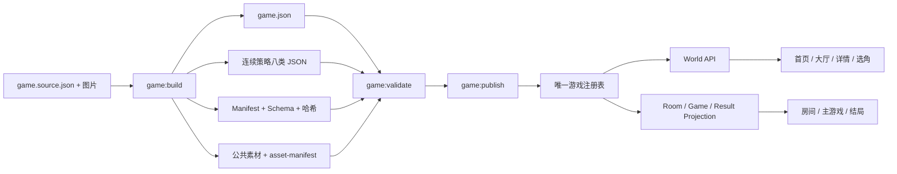

# Many Worlds 通用游戏内容化 P0 实施与验收规格 v1.0

> 项目：AI Story Room / Many Worlds  
> 日期：2026-07-16  
> 文档性质：P0 实施合同、任务顺序与最终验收门槛  
> 配套影响面清单：[`17_Many_Worlds_游戏页面数据统一替换清单_v1.0.md`](./17_Many_Worlds_游戏页面数据统一替换清单_v1.0.md)  
> 当前状态：P0 总目标尚未完成；第一阶段（注册表驱动大厅、一个游戏一个目录、统一 `/worlds/:worldId` 详情模板）已于 2026-07-17 实现并通过本地验收。第一阶段证据见 [`docs/auto-execute/game-content-phase1/11-final-acceptance-report.md`](./auto-execute/game-content-phase1/11-final-acceptance-report.md)。选角、房间、游戏过程、结局和作者工具链仍按本文后续阶段实施。

---

## 0. 第一阶段实施快照（2026-07-17）

| 范围 | 状态 | 当前实现 |
|---|---|---|
| 唯一目录 | PASS | 6 个大厅世界均由 `game-registry.json` 指向自己的 `config/<worldId>/game.json` |
| 游戏素材隔离 | PASS | 桑田诏和凯撒的封面、背景、头像均由各自 JSON 引用自己的 `assets/game/<worldId>/` 目录 |
| 游戏大厅 | PASS | `/worlds` 从 `GET /api/v4/worlds` 渲染 2 个 playable 和 4 个 Coming Soon；HTML 不含具体卡片 |
| 世界详情 | PASS | `/worlds/:worldId` 使用一个服务器路由、一个页面模板和一个渲染函数 |
| 两款游戏数据来源 | PASS | 桑田诏 3 个角色、凯撒 6 个角色的标题、介绍、人数、背景、头像均完成 JSON→API→DOM 浏览器比对 |
| 后续标准页面 | 未开始/未完成 | 选角、房间、主游戏和结局仍按 P0-4、P0-5、P0-7 实施 |
| 第三个游戏全流程零代码 | 未验收 | 必须完成作者 CLI、凯撒连续内容包及 P0-8 后才能宣称达到最终目标 |

第一阶段实现入口：

- 注册表：`packages/templates/config/game-registry.json`
- 游戏配置：`packages/templates/config/<worldId>/game.json`
- 游戏素材：`apps/web/public/assets/game/<worldId>/`
- 列表/详情 API：`apps/api/src/worlds.controller.ts`
- 大厅：`apps/web/public/worlds.html`、`worlds.js`、`worlds.css`
- 统一详情：`apps/web/public/platform.js`、`platform.css`
- 动态本地路由：`apps/web/src/server.mjs`
- 第一阶段验收：`docs/auto-execute/game-content-phase1/`

这个快照只记录已完成事实，不修改第 17 节的 P0 最终完成定义。

---

## 1. 最终目标

完成 P0 后，新增第三个以及后续同规则游戏时，作者只需要提供：

1. 一份符合 Schema 的游戏源文件 `game.source.json`。
2. 游戏封面、背景、角色头像和必要图标。
3. 可选的 Markdown 编剧说明；Markdown 不作为运行时数据源。

随后运行统一命令：

```bash
pnpm game:new --world <worldId>
pnpm game:build --world <worldId> --version <strategyVersion>
pnpm game:validate --world <worldId> --version <strategyVersion>
pnpm game:publish --world <worldId> --version <strategyVersion>
pnpm game:smoke --world <worldId>
```

系统必须自动完成：

- 生成 `game.json`。
- 生成 `strategy-registry.json`。
- 生成连续策略八类运行时 JSON。
- 复制并校验游戏素材。
- 生成 `asset-manifest.json`。
- 生成内容 `manifest.json` 和 SHA-256 哈希。
- 校验角色、阶段、行动、结果和结局的交叉引用。
- 更新唯一游戏注册表。
- 让首页、游戏大厅、详情、选角、房间、主游戏和结局页自动展示新游戏。
- 让统一动态路由自动承接 `/worlds/<worldId>`。

### 1.1 新游戏接入允许修改的范围

新增第三个游戏时，只允许新增或修改以下内容路径：

```text
packages/templates/authoring/<worldId>/**
packages/templates/config/<worldId>/**
packages/templates/config/game-registry.json
apps/web/public/assets/game/<worldId>/**
docs/auto-execute/results/game-platform-p0/<worldId>/**
```

其中 `config/<worldId>/**`、公共素材目录和 `game-registry.json` 应由作者命令生成或更新，不能要求作者手工维护八类运行时文件。

### 1.2 新游戏接入禁止修改的范围

新增第三个游戏的验收提交中，以下路径必须保持与接入前完全一致：

```text
apps/web/public/*.html
apps/web/public/*.js
apps/web/public/*.css
apps/web/src/**
apps/api/src/**
packages/shared/src/**
packages/templates/src/**
vercel.json
prisma/**
```

这意味着不能为第三个游戏增加：

- 新的页面条件分支。
- 新的 `worldId === "..."` 判断。
- 新的角色头像 CSS class。
- 新的专属 API。
- 新的专属引擎逻辑。
- 新的数据库表或字段。
- 新的逐游戏服务器路由。

### 1.3 路由例外的最终解释

用户允许“页面路由”作为例外，但 P0 必须一次性建立通用动态路由。完成后，新增第三个游戏不应再修改 `server.mjs` 或 `vercel.json`。

标准路由固定为：

```text
/worlds
/worlds/:worldId
/role-select?story=:worldId
/rooms?worldId=:worldId
/rooms/:roomId
/game?runId=:runId
/game/result?runId=:runId
```

如果需要公开别名，只能在 `game.json.publicId` 或 `game.json.aliases` 中配置，由统一解析器处理，不能增加页面代码分支。

---

## 2. 当前真实基线

以下状态是 P0 开始时的验收基线，不得把“内核能力存在”写成“两个真实游戏已经通用”。

| 验收项 | 当前状态 | 直接证据 | P0 目标 |
|---|---|---|---|
| 唯一后端游戏注册表 | 通过 | `packages/templates/config/game-registry.json:1-7` | 成为所有页面和发布流程的唯一目录来源 |
| 可配置 N 个角色 | 通过 | `packages/templates/src/game-registry/types.ts`、`validation.ts` | 所有页面移除固定三角色假设 |
| 真人不足时 AI 补位 | 通过 | `apps/api/src/rooms.service.ts` | 1 真人 + N-1 AI、多人混合均可运行 |
| 按 `worldId + strategyVersion` 加载 | 内核通过 | `packages/templates/src/continuous-strategy/loader.ts:140-159` | 用两个真实内容包和第三个测试游戏验证 |
| 六角色通用加载 | 仅测试夹具 | `packages/templates/tests/continuous-strategy-multiworld.test.ts:15-21` | 删除其作为凯撒完成证据的资格 |
| 《桑田诏》连续策略 | 通过 | `packages/templates/config/sangtian/strategy-registry.json` | 保持回归通过 |
| 《凯撒》连续策略 | 未完成 | `packages/templates/config/caesar/game.json:25-30` | 完成真实六角色、七阶段内容包 |
| 通用游戏前端 | 未完成 | `continuous-game-view.js`、`platform.js`、`worlds.html` | 所有标准页面只读 API/Projection |
| 通用作者工具链 | 部分存在 | 只有桑田专用 `generate:continuous-strategy` | 建立 `game:new/build/validate/publish/smoke` |
| 第三个游戏零代码接入 | 未达到 | 大厅和页面仍有世界专属分支 | 通过受保护文件哈希验收 |

### 2.1 当前最重要的反证

- 凯撒仍为 `legacy_v1`，没有 `strategy-registry.json`，没有 `worldActor`：`packages/templates/config/caesar/game.json:25-30`。
- 连续加载器会拒绝凯撒：`packages/templates/src/continuous-strategy/loader.ts:146-151`。
- 六角色测试使用 `caesar_fixture`，不是凯撒真实包：`packages/templates/tests/continuous-strategy-multiworld.test.ts:15-21`。
- 主游戏页写死 7 轮、3 个决策角色、桑田返回地址和杭州地点：`apps/web/public/continuous-game-view.js:8-12,44-47`。
- 头像映射只识别桑田角色：`apps/web/public/continuous-game-view.js:143`。
- 游戏大厅卡片静态写在 HTML：`apps/web/public/worlds.html:18-49`。
- 世界详情、房间标题和结果页包含桑田/凯撒条件分支：`apps/web/public/platform.js:316-355,442`。
- 当前运行时只读取 JSON：`packages/templates/authoring/README.md:3`。
- 当前已有桑田专用生成与校验命令，但没有通用 `game:*` 作者命令：`packages/templates/package.json:7-14`。

---

## 3. P0 范围与非目标

### 3.1 P0 必须完成

1. 把唯一注册表扩展为页面、API、运行时和发布工具共同使用的唯一游戏目录。
2. 把凯撒制作成第二个真实连续策略内容包。
3. 把世界展示数据加入 Room、Game、Result Projection。
4. 把全部标准游戏页面改成注册表和 Projection 驱动。
5. 建立通用作者源文件、编译、校验、发布和冒烟命令。
6. 用凯撒验证六角色和真人/AI 混合控制。
7. 用第三个测试游戏证明零页面、零 API、零引擎代码修改上线。

### 3.2 P0 不包含

- 不建立 CMS 或可视化编辑器。
- 不要求系统从一段完全自由格式小说自动推断游戏规则。
- 不引入新的前端框架。
- 不重新设计现有页面视觉。
- 不支持与“连续策略 v1”完全不同的游戏规则。
- 不把 `/trio` 或无 `runId` 的旧 `/game` 当作标准产品入口。
- 不允许为了赶进度把新游戏内容写回页面 JavaScript。

### 3.3 连续策略 v1 的固定规则

P0 针对“与《桑田诏》同一套规则”的游戏：

- 默认 7 个阶段。
- 每个正常角色每阶段 3 张主决策卡。
- 每个正常角色每阶段 1 套谋划策略。
- 支持定向回应。
- 支持真人控制、AI Agent 控制、掉线接管和控制权收回。
- 每阶段有公共结果和每个角色的个人结果。
- 游戏结束有公共结局和每个角色的个人结局。
- `worldActor` 是世界行动来源，不是玩家角色。

前端仍必须从配置读取 `stageCount`、`mainCardsPerRoleStage` 和 `roleCount`，不能继续写死 7 和 3。

---

## 4. 目标架构与唯一数据流



### 4.1 唯一真相边界

| 数据 | 唯一来源 | 禁止来源 |
|---|---|---|
| 游戏目录、状态、排序 | `game-registry.json` + `game.json.catalog` | HTML 卡片、JavaScript 数组 |
| 标题、简介、人数、封面 | `game.json` | 页面条件分支 |
| 角色身份和头像 | `game.json.roles` | CSS 角色名映射、页面数组 |
| 阶段、行动、AI 策略 | 连续策略内容包 | 页面 Fixture |
| 当前真人/AI/Ready | Room / Run Projection | 页面自行推算默认值 |
| 当前地点、背景、轮次名 | Projection 中的 `presentation` | 世界 ID 判断 |
| 结局 | Result Projection | 静态凯撒或桑田结果 HTML |
| 动态路由 | 通用 `/worlds/:worldId` | 每个游戏新增一条服务器路由 |

### 4.2 运行时原则

- 浏览器不能直接读取仓库 JSON 文件，只能读取 API 或 Projection。
- API 不能维护第二份游戏标题、角色和图片映射。
- Projection 必须携带页面完成渲染所需的世界展示信息。
- 运行时只读取已发布、已验证的不可变内容版本。
- 页面不得根据 `worldId` 决定文本、图片、角色数量或轮数。

---

## 5. 作者输入合同

### 5.1 作者目录

```text
packages/templates/authoring/<worldId>/
├─ game.source.json
├─ README.md                         # 可选，编剧说明
└─ assets/
   ├─ card-cover.png
   ├─ hero-cover.png
   ├─ scene-background.png
   ├─ world-actor.png
   └─ roles/
      ├─ <roleKey-1>.png
      └─ <roleKey-N>.png
```

`game.source.json` 是唯一机器输入。Markdown 可以帮助人类或 ChatGPT 编写源文件，但不能被运行时直接加载。

### 5.2 `game.source.json` 顶层结构

```json
{
  "schemaVersion": "game_authoring_source_v1",
  "world": {},
  "catalog": {},
  "modes": {},
  "rules": {},
  "presentation": {},
  "worldActor": {},
  "roles": [],
  "stages": [],
  "publicEndingRules": [],
  "personalEndingRules": []
}
```

### 5.3 必填世界字段

```text
world.worldId
world.publicId
world.aliases
world.templateId
world.strategyVersion
world.status
catalog.title
catalog.subtitle
catalog.description
catalog.genre
catalog.tags
catalog.durationLabel
catalog.featured
catalog.sortOrder
modes.solo
modes.multiplayer
modes.minHumanPlayers
modes.maxHumanPlayers
rules.stageCount
rules.mainCardsPerRoleStage
presentation.locationLabel
presentation.roundLabel
presentation.finaleLabel
presentation.accent
presentation.accentSoft
worldActor.actorKey
worldActor.actorName
worldActor.description
```

### 5.4 每个正常角色必填字段

```text
roleKey
roleName
identity
publicInfo
hiddenSecret
personalGoal
currentState
abilityText
arcText
knownInfo[]
cannotDo[]
portraitAsset
canBeHumanControlled = true
canBeAiControlled = true
```

约束：

- `roleKey` 在游戏内唯一且发布后不可修改。
- `worldActor.actorKey` 不能与任何 `roleKey` 相同。
- `modes.maxHumanPlayers <= roles.length`。
- 所有未被真人占用的正常角色必须可由 AI Agent 控制。
- `roles.length` 是角色席位总数，不包含 `worldActor`。

### 5.5 每个阶段必填内容

每个阶段必须包含：

- `stageKey`、顺序、标题、公共局势和状态迁移。
- 所有正常角色的私密简报和个人压力。
- 每个角色固定数量的主决策卡。
- 每个角色的谋划策略。
- 每个角色的 Agent policy 和兜底行动。
- 世界行动。
- 可选的定向回应场景。
- 公共阶段结果规则。
- 每个正常角色的个人阶段结果规则。

数量必须满足：

```text
角色阶段内容 = stageCount × roleCount
主决策卡 = stageCount × roleCount × mainCardsPerRoleStage
谋划策略 = stageCount × roleCount
Agent policy = stageCount × roleCount
个人阶段结果 = stageCount × roleCount
最终个人结局 = roleCount
```

---

## 6. 编译输出合同

`game:build` 必须从作者源文件生成以下运行时结构：

```text
packages/templates/config/<worldId>/
├─ game.json
├─ strategy-registry.json
└─ <strategyVersion>/
   ├─ stages.json
   ├─ role-stage-content.json
   ├─ system-actions.json
   ├─ agent-policies.json
   ├─ maneuver-strategies.json
   ├─ reaction-scenarios.json
   ├─ result-rules.json
   ├─ ending-rules.json
   ├─ manifest.json
   └─ schemas/

apps/web/public/assets/game/<worldId>/
├─ card-cover.png
├─ hero-cover.png
├─ scene-background.png
├─ world-actor.png
├─ roles/*.png
└─ asset-manifest.json
```

### 6.1 编译器必须保证

- 输出稳定：相同输入生成完全相同的 JSON 和哈希。
- 输出格式化稳定：UTF-8、LF、末尾换行、键顺序固定。
- 不自动创作或补写剧情；缺少内容必须失败。
- 不覆盖已发布的相同 `strategyVersion`。
- 使用共享 canonical Schema 快照生成 `schemas/`。
- 自动计算 Manifest 文件哈希。
- 自动把作者素材复制到公共素材目录并验证路径。
- `--check` 模式只比较，不写文件。

### 6.2 禁止手工维护生成物

以下内容都属于生成物：

- 八类运行时 JSON。
- Manifest 和哈希。
- `strategy-registry.json` 的版本条目。
- `asset-manifest.json`。
- 公共素材的标准化文件名。

如果生成物需要修改，应修改 `game.source.json` 或作者素材后重新构建。

---

## 7. 通用作者命令合同

### 7.1 `game:new`

职责：

- 校验 `worldId` 格式和冲突。
- 创建作者目录、空的源文件模板和素材目录。
- 不修改游戏注册表。
- 不把未完成游戏暴露给页面。

失败条件：重复 `worldId`、重复 `publicId`、非法路径。

### 7.2 `game:build`

职责：

- 校验作者源 Schema。
- 生成 `game.json`、连续策略内容包、素材和两个 Manifest。
- 默认将新游戏状态保持为 `hidden`，不能直接公开。
- 支持 `--check` 验证生成物无漂移。

失败条件：数量不足、交叉引用错误、素材不存在、世界角色冲突、版本已发布。

### 7.3 `game:validate`

必须执行：

1. 游戏注册表和 `game.json` Schema 校验。
2. 连续策略八类 JSON Schema 校验。
3. Manifest 哈希校验。
4. 素材文件存在性和 Manifest 校验。
5. 角色键、阶段键、行动键和结果键唯一性校验。
6. 每阶段角色覆盖率校验。
7. 兜底行动和目标角色引用校验。
8. 公共结局与每个角色个人结局覆盖率校验。
9. 确定性七阶段离线评估。
10. 禁止世界专属代码扫描。

校验结果必须输出 JSON 报告，不允许只打印控制台文本。

### 7.4 `game:publish`

前置条件：

- `game:validate` 最新报告为 PASS。
- 策略版本未发布过。
- 素材和内容哈希已固定。
- 目标世界没有 ID 冲突。

职责：

- 原子更新 `game-registry.json`。
- 将 `game.json.engine.strategyVersion` 指向发布版本。
- 将 `strategyRegistryPath` 指向标准注册表。
- 将游戏状态切换为指定的 `playable` 或 `coming_soon`。
- 生成发布收据和回滚信息。

### 7.5 `game:smoke`

职责：

- 检查游戏出现在 World API。
- 检查详情、选角、房间、游戏和结果投影都携带正确 `worldId`。
- 至少完成一个离线全角色七阶段运行。
- 生成统一 JSON 验收报告。

---

## 8. API 与 Projection 合同

### 8.1 世界目录 API

`GET /api/v4/worlds` 每个游戏必须返回：

```text
worldId
publicId
title
subtitle
description
genre
tags[]
durationLabel
cardCover
status
featured
sortOrder
roleCount
minHumanPlayers
maxHumanPlayers
solo
multiplayer
```

不得继续用含义模糊的 `minPlayers` 代替 `minHumanPlayers`。

### 8.2 世界详情 API

`GET /api/v4/worlds/:worldId` 必须额外返回：

- Hero 和场景背景。
- 地点、回合和最终裁决文案。
- 所有可公开角色资料与头像。
- `worldActor` 的公开资料。
- 固定规则数量。
- 页面 CTA、价格或平台统一经济配置。

### 8.3 统一 `WorldPresentationV1`

Room、Game 和 Result Projection 复用同一结构：

```json
{
  "worldId": "caesar",
  "publicId": "caesar_last_spring",
  "title": "Caesar: The Last Spring of the Republic",
  "subtitle": "...",
  "detailUrl": "/worlds/caesar",
  "cardCover": "/assets/game/caesar/card-cover.png",
  "heroCover": "/assets/game/caesar/hero-cover.png",
  "sceneBackground": "/assets/game/caesar/scene-background.png",
  "locationLabel": "Rome · The Senate",
  "roundLabel": "Scene",
  "finaleLabel": "The Republic's Verdict",
  "accent": "#6b4ce6",
  "accentSoft": "#f3f0ff",
  "stageCount": 7,
  "mainCardsPerRoleStage": 3,
  "roleCount": 6,
  "minHumanPlayers": 1,
  "maxHumanPlayers": 6,
  "roles": [
    {
      "roleKey": "brutus",
      "roleName": "Brutus",
      "identity": "...",
      "portrait": "/assets/game/caesar/roles/brutus.png"
    }
  ]
}
```

### 8.4 Projection 要求

- `GameProjectionV1` 增加 `presentation: WorldPresentationV1`。
- `ResultProjectionV1` 增加 `presentation: WorldPresentationV1`。
- 房间详情响应增加同一 presentation 或等价的类型化字段。
- Projection Schema 的 required keys、TypeScript 类型和 JSON Schema 同步更新。
- Projection 中不得包含其他角色的秘密、私密简报或隐藏目标。
- 页面只读取 Projection，不根据 `worldId` 补充展示内容。

当前缺口：`packages/shared/src/continuous-strategy/projection.schemas.ts:37-80`。

---

## 9. 页面通用化合同

| 页面 | 唯一数据来源 | P0 完成条件 |
|---|---|---|
| 首页 `/` | World API | 游戏标题、图片、人数、状态和跳转无静态游戏数组 |
| 大厅 `/worlds` | World API | 注册表新增游戏后自动增加卡片；Coming Soon 不可点击 |
| 详情 `/worlds/:worldId` | World Detail API | 一套模板，无桑田/凯撒分支 |
| 选角 `/role-select` | World Detail API | 任意角色数；无默认桑田、无凯撒专属创建分支 |
| 房间列表 `/rooms` | Room API + World API | 标题、封面、人数和筛选器动态 |
| 房间 `/rooms/:roomId` | Room Projection | 角色头像、真人数、AI 数、阶段数动态 |
| 游戏 `/game` | GameProjection | 轮数、角色数、地点、背景、头像和文案动态 |
| 结局 `/game/result` | ResultProjection | 标题、头像、世界返回地址和重新开始地址动态 |

### 9.1 页面禁止项

以下形式必须在标准游戏路径中归零：

```text
worldId === "sangtian"
worldId === "caesar"
story.id === "caesar"
href="/worlds/sangtian"
href="/worlds/caesar"
/ 7
/ 3
杭州总督府
仅按角色键选择固定 CSS 头像
```

营销页中与具体游戏无关的品牌文案可以静态保留。

### 9.2 错误状态

- 未注册世界：返回统一 404 页面。
- `hidden` 世界：公开 API 返回 404。
- `coming_soon` 世界：可以展示，但不能创建房间或 Run。
- 素材加载失败：显示通用占位，不回退到桑田或凯撒图片。
- 内容版本失效：返回明确错误码，不启动 legacy 内容。

---

## 10. 动态路由合同

### 10.1 一次性改造

- `apps/web/src/server.mjs` 只保留通用 `/worlds/:worldId -> platform.html` 行为。
- `vercel.json` 保留 `/worlds/:path* -> /platform.html`。
- `publicId` 和 `aliases` 由世界查询 API 或注册表解析。
- 页面初始化从当前路径提取世界 ID，再请求 API。

### 10.2 第三个游戏验收

注册 `third_fixture` 后，以下地址必须直接工作：

```text
/worlds/third_fixture
/role-select?story=third_fixture
/rooms?worldId=third_fixture
```

不得在 `server.mjs`、`vercel.json` 或页面文件中增加 `third_fixture` 字符串。

---

## 11. P0 实施任务

## P0-0：冻结基线和验收保护面

目标：防止后续继续把能力测试当成真实游戏完成。

实施文件：

- 新增 `scripts/acceptance/game-platform-protected-files.mjs`。
- 新增 `scripts/acceptance/game-platform-baseline.mjs`。
- 新增 `docs/auto-execute/results/game-platform-p0/baseline.json`。

必须产出：

- 本文第 2 节状态表的机器可读版本。
- 受保护代码路径的 SHA-256 快照。
- 桑田、凯撒当前加载结果。

完成门槛：基线报告明确显示桑田 PASS、凯撒 `GAME_ENGINE_NOT_CONTINUOUS`，且不把 `caesar_fixture` 计为凯撒。

## P0-1：把唯一注册表扩展为全平台目录

目标：注册表不只服务后端加载器，也服务 API、页面和发布工具。

主要文件：

- `packages/templates/config/game-registry.json`
- `packages/templates/src/game-registry/types.ts`
- `packages/templates/src/game-registry/validation.ts`
- `packages/templates/src/game-registry/loader.ts`
- `apps/api/src/worlds.controller.ts`

实施要求：

- 补齐 `status`、排序、精选和页面所需目录字段。
- 明确 `roleCount/minHumanPlayers/maxHumanPlayers`。
- 支持 `worldId/publicId/aliases` 统一查找。
- 全局检查 ID、地址和定义路径唯一。
- `hidden` 不进入公开目录。

完成门槛：新增一个只含合法 `game.json` 的注册项后，World API 无代码修改即可返回它。

## P0-2：建立通用作者编译与发布工具链

目标：替代桑田专用生成器和手工八文件维护。

主要文件：

- 新增 `packages/templates/src/authoring/**`
- 新增 `packages/templates/scripts/game-new.mjs`
- 新增 `packages/templates/scripts/game-build.mjs`
- 新增 `packages/templates/scripts/game-validate.mjs`
- 新增 `packages/templates/scripts/game-publish.mjs`
- 新增 `packages/templates/scripts/game-smoke.mjs`
- 更新根 `package.json`
- 更新 `packages/templates/package.json`

实施要求：

- 作者源 Schema 与 CLI 参数类型化。
- 编译结果确定性。
- 已发布版本不可覆盖。
- 所有命令支持 JSON 结果输出。
- `validate` 失败时 `publish` 必须拒绝。
- 桑田专用生成脚本迁移为通用编译器的回归样本，不能保留为新游戏必需路径。

完成门槛：桑田作者源重新构建后，`--check` 与当前已发布运行时包一致，或者通过一次明确、审核过的内容版本升级完成迁移。

## P0-3：完成凯撒真实连续策略内容包

目标：让凯撒成为第二个真实样板，不再使用 `caesar_fixture` 证明通用性。

输入：

- `packages/templates/authoring/caesar/game.source.json`
- `packages/templates/authoring/caesar/assets/**`
- `packages/templates/authoring/caesar/CONTENT_CHECKLIST.md`

必须包含：

- 6 个正常玩家角色。
- 独立 `worldActor`。
- 7 个阶段。
- 42 份角色阶段内容。
- 126 张主决策卡。
- 42 套谋划策略。
- 42 套 Agent policy 和兜底行动。
- 7 份公共阶段结果。
- 42 份个人阶段结果。
- 1 套公共结局规则。
- 6 份角色个人结局规则。

完成门槛：

- `loadGameContinuousStrategyPackage("caesar")` 成功。
- `game:validate` PASS。
- `game:smoke` 完成七阶段。
- 测试直接加载 `worldId=caesar`，不再使用 `caesar_fixture` 作为完成证据。

## P0-4：统一 API 与 Projection

目标：页面渲染不再需要识别游戏名称。

主要文件：

- `packages/shared/src/continuous-strategy/projection.schemas.ts`
- `packages/shared/src/continuous-strategy/index.ts`
- `apps/api/src/worlds.controller.ts`
- `apps/api/src/rooms.service.ts`
- `apps/api/src/continuous-strategy/member-projection.service.ts`
- 对应 API 和 Projection 测试

实施要求：

- 建立共享 `WorldPresentationV1`。
- World、Room、Game、Result 输出字段语义一致。
- 删除 `minPlayers = roles.length` 的歧义。
- 移除 `minPlayers: 3` 等 fallback。
- Projection 安全测试继续确保秘密不泄露。

完成门槛：桑田和凯撒的相同 API/Projection Schema 校验均通过，只有数据不同。

## P0-5：全部标准页面注册表化

目标：一个页面模板渲染任意连续策略游戏。

主要文件：

- `apps/web/public/home.js`
- `apps/web/public/worlds.html`
- 建议新增 `apps/web/public/worlds.js`
- `apps/web/public/role-select.js`
- `apps/web/public/platform.js`
- `apps/web/public/continuous-game-view.js`
- `apps/web/public/game-bootstrap.js`
- `apps/web/public/continuous-game-client.js`
- `apps/web/public/main-game.css`
- 对应 Web 测试

实施要求：

- 大厅保留静态布局容器，卡片由 API 生成。
- 详情页只保留一套模板。
- 选角、创建 Solo 和创建房间都使用 `worldId` 通用接口。
- 头像使用 `` 或 CSS 变量，不使用角色键 class 映射。
- 主游戏所有计数读取 Projection。
- 结局页删除静态凯撒 Fixture 和桑田/凯撒标题分支。
- 首页具体游戏入口由 World API 生成。

完成门槛：对前端标准路径执行专属字符串扫描，桑田/凯撒判断为 0；桑田和凯撒浏览器流程均通过。

## P0-6：统一动态路由和发布可见性

目标：新世界注册后无需添加服务器路由。

主要文件：

- `apps/web/src/server.mjs`
- `vercel.json`
- Web 路由测试

实施要求：

- 本地与 Vercel 使用一致的动态世界路由。
- `hidden/coming_soon/playable` 行为一致。
- 未注册 ID 不回退到凯撒页面。

完成门槛：随机合法但未注册 worldId 返回 404；第三个已注册世界直接打开详情页。

## P0-7：两款真实游戏完整验收

目标：证明同一套代码运行桑田和凯撒。

必须运行：

- 桑田 1 真人 + 2 AI，完整七阶段。
- 凯撒 1 真人 + 5 AI，完整七阶段。
- 凯撒 3 真人 + 3 AI，完整七阶段。
- 凯撒全角色确定性离线七阶段。
- 凯撒 1 个公共结局和 6 个角色个人结局可生成。
- 两个游戏的大厅、详情、选角、房间、游戏和结局浏览器流程。

完成门槛：所有结果报告 PASS，且没有任何 Fixture 被计入真实内容验收。

## P0-8：第三个游戏零代码接入验收

目标：证明平台已经真正内容化。

测试游戏要求：

- 使用新的 `worldId`。
- 至少 4 个正常角色，不能复制桑田的 3 角色数量。
- 1–4 个真人，剩余角色 AI 补位。
- 完整 7 阶段和 4 个个人结局。
- 独立封面、背景和头像。

验收过程：

1. 记录所有受保护文件哈希。
2. 只添加作者源文件和素材。
3. 运行 `game:build/validate/publish/smoke`。
4. 访问全部标准页面。
5. 再次计算受保护文件哈希。
6. 对比前后哈希和允许路径清单。

完成门槛：受保护代码文件哈希变化数量必须等于 0，全部标准页面和完整游戏流程通过。

---

## 12. 验收矩阵

| ID | 验收项目 | 可执行判定 | 必须结果 |
|---|---|---|---|
| AC-01 | 注册表唯一性 | 重复 worldId/publicId/alias 构建失败 | PASS |
| AC-02 | 作者源完整性 | 删除任一角色阶段内容后 validate 失败 | PASS |
| AC-03 | 构建确定性 | 相同输入连续构建两次，所有输出哈希一致 | PASS |
| AC-04 | 发布不可变性 | 再次发布同一版本被拒绝 | PASS |
| AC-05 | 素材完整性 | 缺少头像或背景时 validate 失败 | PASS |
| AC-06 | 桑田回归 | 真实桑田包七阶段和三角色结局通过 | PASS |
| AC-07 | 凯撒真实加载 | `worldId=caesar` 不再抛 `GAME_ENGINE_NOT_CONTINUOUS` | PASS |
| AC-08 | 凯撒 1+5 | 1 真人、5 AI 完成七阶段 | PASS |
| AC-09 | 凯撒 3+3 | 3 真人、3 AI 完成七阶段 | PASS |
| AC-10 | 凯撒结局覆盖 | 1 公共结局 + 6 角色个人结局可生成 | PASS |
| AC-11 | Projection 通用 | 桑田/凯撒通过同一 Schema，包含 presentation | PASS |
| AC-12 | 信息安全 | 任何玩家 Projection 不含其他角色秘密 | PASS |
| AC-13 | 大厅自动出现 | 注册第三个游戏后 `/worlds` 自动新增卡片 | PASS |
| AC-14 | 详情通用 | `/worlds/third_fixture` 无页面代码修改可打开 | PASS |
| AC-15 | 选角通用 | 第三个游戏按真实角色数生成角色卡 | PASS |
| AC-16 | 房间人数 | 明确显示真人、AI、角色席位和最低真人数 | PASS |
| AC-17 | 游戏页动态 | 轮数、角色数、地点、背景和头像来自 Projection | PASS |
| AC-18 | 结局页动态 | 标题、封面、头像、返回地址来自 ResultProjection | PASS |
| AC-19 | 动态路由 | 本地与 Vercel 均不需要第三个游戏专属路由 | PASS |
| AC-20 | 专属分支归零 | 标准页面无桑田/凯撒 worldId 条件判断 | PASS |
| AC-21 | 零代码接入 | 第三个游戏接入前后受保护文件哈希变化为 0 | PASS |
| AC-22 | 错误隔离 | 无效游戏不能进入注册表，也不能影响已发布游戏 | PASS |

任何一项未通过，P0 总结论必须是 `FAIL` 或 `PASS_WITH_LIMITATION`，不能写“第三个游戏已经可以零代码上线”。

---

## 13. 测试与证据输出

### 13.1 目标命令

```bash
pnpm --filter @ai-story/templates test:games
pnpm game:validate --world sangtian --version sangtian_v1_1
pnpm game:validate --world caesar --version caesar_v1_0
pnpm test:api
pnpm --filter @apps/web test
pnpm game:smoke --world sangtian
pnpm game:smoke --world caesar
pnpm game:acceptance --world third_fixture
```

`game:acceptance` 是 P0 必须增加的聚合命令，不能把人工点击截图作为唯一证明。

### 13.2 必须生成的证据

```text
docs/auto-execute/results/game-platform-p0/
├─ baseline.json
├─ protected-files-before.json
├─ protected-files-after.json
├─ protected-files-diff.json
├─ sangtian-validation.json
├─ sangtian-seven-stage.json
├─ caesar-validation.json
├─ caesar-1h5ai-seven-stage.json
├─ caesar-3h3ai-seven-stage.json
├─ caesar-ending-coverage.json
├─ world-api-contract.json
├─ projection-contract.json
├─ page-route-smoke.json
├─ third-fixture-validation.json
├─ third-fixture-zero-code.json
└─ final-acceptance.json
```

### 13.3 最终报告最低字段

```json
{
  "status": "PASS",
  "sangtianRealPackage": true,
  "caesarRealPackage": true,
  "thirdWorldZeroCode": true,
  "protectedFileChanges": 0,
  "requiredAcceptancePassed": 22,
  "requiredAcceptanceTotal": 22,
  "fixtureCountedAsRealGame": false
}
```

---

## 14. 新游戏上线后的标准操作

P0 完成后，第四个以及后续游戏的标准流程固定为：

1. 运行 `game:new` 创建作者目录。
2. 让编剧或 ChatGPT 按 Schema 生成 `game.source.json`。
3. 放入封面、背景和所有角色头像。
4. 运行 `game:build`。
5. 运行 `game:validate`，修复所有内容错误。
6. 运行 `game:publish` 更新注册表和版本。
7. 运行 `game:smoke`。
8. 部署已有应用，不修改页面、API、引擎或数据库代码。

上线人员不需要理解八类运行时 JSON 的拆分方式，也不需要编辑页面跳转。

---

## 15. 风险与处理

| 风险 | 后果 | P0 处理 |
|---|---|---|
| 作者源缺少结构化信息 | 编译器无法可靠推断行动和结果 | 严格 Schema，缺失即失败，不自动编造 |
| 页面仍有隐藏世界分支 | 第三个游戏显示错误 | 专属字符串扫描 + 第三个游戏浏览器验收 |
| 生成物允许手改 | 源文件与运行时漂移 | `game:build --check` 和哈希校验 |
| 发布覆盖旧版本 | 已开始 Run 不可重放 | 发布版本不可变，新增版本发布 |
| 注册表更新一半失败 | 游戏目录和内容不一致 | 临时文件验证后原子替换 |
| 受保护文件验收受脏工作区影响 | 零代码结论不可靠 | 使用接入前后文件哈希快照，不只依赖 `git diff` |
| Fixture 被当成真实凯撒 | 再次虚假完成 | 报告必须记录加载 worldId 和 manifest templateKey |
| Projection 暴露秘密 | 多人游戏信息泄漏 | 保留并扩展投影安全测试 |

---

## 16. 架构决策记录

### 决策

使用“单一严格作者源 `game.source.json` + 确定性编译器 + 不可变运行时包”，而不是运行时直接读取 Markdown，也不再要求作者手工维护八类 JSON。

### 驱动因素

1. 第三个游戏必须零页面、零 API、零引擎代码接入。
2. 构建和发布必须可重复、可校验、可回滚。
3. 作者不应直接处理 Manifest、Schema 快照和哈希。

### 已考虑方案

| 方案 | 优点 | 缺点 | 结论 |
|---|---|---|---|
| 手工维护八类 JSON | 与当前运行时最接近 | 容易漏文件、引用和哈希，不满足一次上线 | 拒绝 |
| 运行时直接读取自由 Markdown | 作者体验简单 | 不确定、难校验、难保证完整行动结构 | 拒绝 |
| 严格作者源 + 编译器 | 可生成、可校验、可重复 | P0 需要建设编译工具 | 采用 |

### 后果

- 运行时继续保持严格 JSON，不引入 Markdown 解析风险。
- 作者只维护一份源数据和素材。
- 内容 Schema 成为新游戏生成提示词的固定输出合同。
- 第三个游戏的成功与否可以用文件哈希和完整 E2E 客观判断。

---

## 17. 最终完成定义

只有同时满足以下条件，才可以宣布“通用游戏内容化 P0 完成”：

1. 桑田真实内容包回归通过。
2. 凯撒真实六角色连续内容包完成，不再是 `legacy_v1`。
3. 凯撒 1 真人 + 5 AI、3 真人 + 3 AI 均完成七阶段。
4. 凯撒可以生成六个角色个人结局。
5. 全部标准页面没有桑田/凯撒专属分支。
6. 页面展示字段全部来自 World API 或 Projection。
7. 本地和生产使用同一动态世界路由规则。
8. 通用 `game:new/build/validate/publish/smoke` 命令可用。
9. 第三个测试游戏只新增作者源、配置生成物、注册表条目和素材。
10. 第三个游戏接入前后所有受保护代码文件哈希变化为 0。
11. 第三个游戏的大厅、详情、选角、房间、游戏和结局流程全部通过。
12. `final-acceptance.json` 为 `PASS` 且 22/22 验收项通过。

在此之前，允许使用的准确表述只能是：

> 通用后端内核和部分内容工具已存在，但完整内容化平台尚未通过第二个真实游戏和第三个零代码游戏验收。
