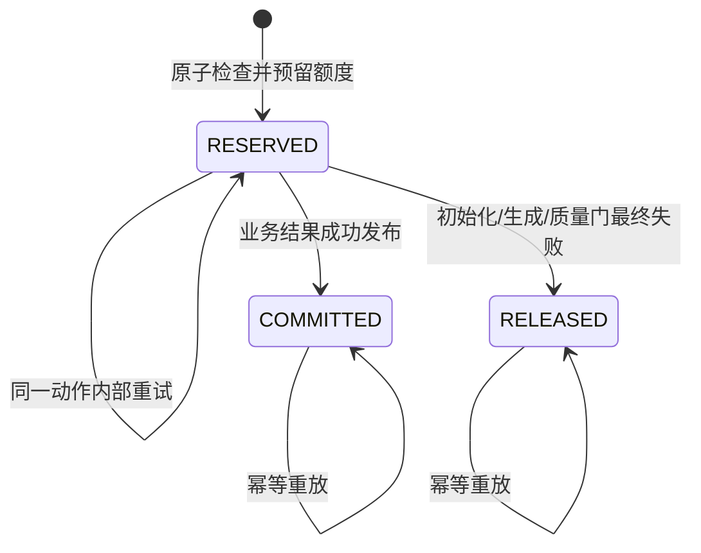
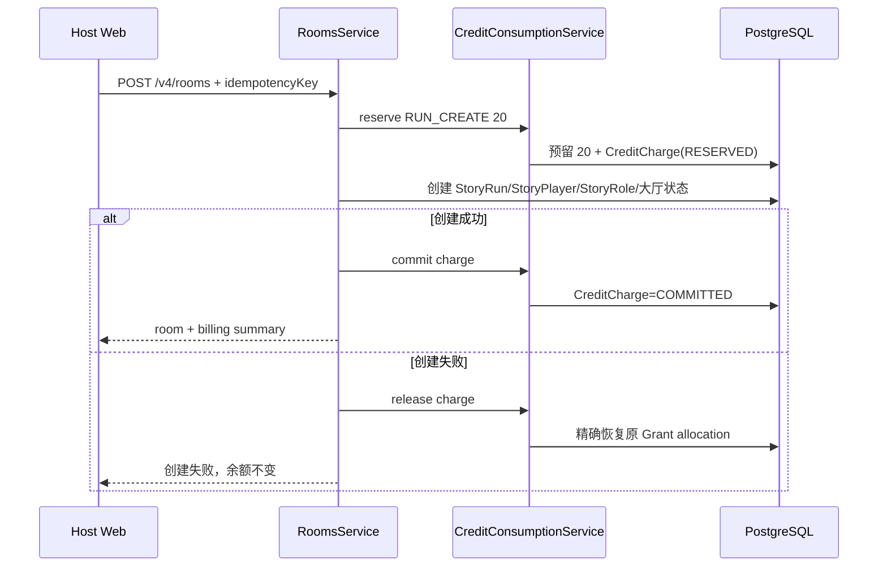

# Our Many Worlds：World Credits 扣减、AI 托管与房主赞助完整开发方案 v1.0

> 文档状态：可开发方案
> 适用仓库：`D:\lyh\agent\agent-frame\aiStoryRoom`
> 基线日期：2026-07-21
> 目标策略版本：`active_action_v1`
> 兼容策略版本：`world_unlock_v1`

---

## 1. 结论与定版规则

本方案把 World Credits 从当前的“共享世界一次性解锁”改为“创建 Story Run + 真人主动生成行为”的计费方式，并保留旧 Run 的兼容能力。

正式规则如下：

| 业务动作 | Credits | 扣费主体 | 成功条件 |
| --- | ---: | --- | --- |
| 创建新的 Shared Story Run | 20 | 房主 | 房间、角色和世界初始数据持久化成功 |
| 创建并启动新的 Solo Story Run | 20 | Solo 玩家 | Run 初始化且首个可玩剧情成功发布 |
| 选择系统建议行动 | 1 | 当前真人玩家，或当前 Run 的房主赞助额度 | 该行动的真实结果通过质量门并正式发布 |
| 提交自定义行动 | 2 | 当前真人玩家，或当前 Run 的房主赞助额度 | 同上 |
| 提交自定义谈话、调查、资源运用或复杂谋划 | 2 | 当前真人玩家，或当前 Run 的房主赞助额度 | 同上 |
| 阅读故事、查看局势、接收跨角色影响、聊天、心跳 | 0 | 无 | 不计费 |
| AI 托管角色自动行动 | 0 | 不从原玩家钱包扣除 | 合并到房间级 AI 推演 |
| DeepSeek 超时、格式错误、内部自动重试 | 0 次额外扣费 | 无 | 同一业务动作只保留一笔预留 |
| 内容最终生成失败或质量门拒绝 | 0 | 原预留来源 | 释放预留，恢复原额度 |

核心边界：

```text
Credits 消耗 = 成功完成并发布的计费业务动作
Credits 消耗 != DeepSeek HTTP 请求次数
```

余额不足不会踢出玩家、删除角色或阻塞整个房间。角色控制权切换为 AI；玩家仍是原 StoryPlayer，仍可阅读、观察、接收影响，并在获得个人 Credits 或 Run 专属赞助后重新接管。

### 1.1 本方案直接作出的产品决策

1. 旧 Run 不改价：已存在的 Run 固定为 `world_unlock_v1`，继续使用当前免费轮次和 `WORLD_UNLOCK`。
2. 新 Run 才使用 `active_action_v1`，创建时冻结计费策略与价格快照，运行中不跟随环境变量改变。
3. 新策略下不再出现共享世界 100 Credits 解锁；新 Run 从创建起即可推进，但真人主动行为按 1/2 Credits 计费。
4. Shared Room 的 20 Credits 在“大厅及角色世界数据创建成功”时确认；随后 Start 或开场生成失败可免费重试，不重复收取创建费。
5. Solo 的创建和首个可玩开场是一个用户动作，因此 20 Credits 在首个可玩开场发布后确认；最终失败则释放。
6. 个人行动先用当前 Run 的赞助额度，再用个人 Bonus Credits，最后用个人 Purchased Credits。
7. 房主赞助固定为 10 Credits；它不是账户转账，不能跨 Run 使用、不能提现、不能转赠，Run 结束后未用额度失效。
8. 玩家重新接管前，服务端至少确认其可用来源合计大于等于最低行动价 1 Credit。
9. 第一次请求赞助可打断式提醒房主一次；之后的请求只进入房间通知/请求列表，不再反复弹窗。
10. 计费逻辑由服务端根据可信业务对象分类，绝不接受前端传入的价格。

---

## 2. 范围与非目标

### 2.1 本次开发范围

- Story Run 创建费的预留、确认、释放和幂等。
- 真人主动行为 1/2 Credits 的服务端定价与计费状态机。
- DeepSeek 重试与 Credits 扣减解耦。
- 余额不足后的 AI 托管、玩家保留、重新接管。
- 房主对指定玩家、指定 Run 的 10 Credits 专属赞助额度。
- 赞助额度、Bonus、Purchased 的确定性抵扣顺序。
- Solo、`continuous_strategy_v1_1`、`continuous_story_v2` 三条引擎路线的接入。
- AI 托管角色的房间级批量决策与统一世界推演。
- Credits 页面、建房弹窗、游戏内余额不足弹窗、房主赞助弹窗和交易记录。
- 迁移、灰度、监控、对账、回滚与完整验收。

### 2.2 非目标

- 不改变 Credits 的购买、注册奖励、邀请奖励来源。
- 不允许玩家之间自由转账。
- 不把 DeepSeek token、请求次数或美元成本直接暴露成用户价格。
- 不在一个进行中的 Run 内动态改价。
- 不把余额不足解释为离开房间、角色死亡或角色消失。
- 不以降低剧情真实性为代价把所有 AI 行为替换为固定文案。
- 不用新的计费系统回写或重算历史 `WORLD_UNLOCK` 账本。

---

## 3. 当前项目实现与差距

以下结论以当前代码为准，不以旧设计文档为准。

| 当前能力 | 仓库证据 | 结论 |
| --- | --- | --- |
| 当前只有 `WORLD_UNLOCK` 是正式消费原因 | `prisma/schema.prisma:1666-1675`、`apps/api/src/story-access/story-access.service.ts:108-126` | 需要增加 Run 创建、玩家行动、Run 赞助三类消费原因 |
| 当前默认 3 次免费决策、解锁 100 Credits | `.env.example:99-100`、`apps/api/src/story-access/story-access.service.ts:97-111` | 新 Run 必须绕过旧解锁门；旧 Run 继续兼容 |
| 钱包已经能先花 Bonus、再花 Purchased | `apps/api/src/credits/credits.service.ts:106-147` | 可复用个人钱包抵扣与精确 Grant allocation |
| 钱包消费已有 Serializable 事务和幂等键 | `apps/api/src/credits/credits.service.ts:92-117` | 可作为新计费预留的底层能力，但要新增业务 Charge 状态 |
| 房间创建已支持幂等键和确定性 RunId | `apps/api/src/rooms.service.ts:141-195` | 创建费可绑定现有 idempotencyKey，不能另造不一致的重试键 |
| Solo 创建包含创建、选角、启动/开场 | `apps/api/src/rooms.service.ts:199-260` | Solo 创建费需覆盖整条编排并在首个开场发布后确认 |
| 角色已有真人、离线宽限、AI 托管、重领状态 | `prisma/schema.prisma:545-593`、`apps/api/src/continuous-strategy/window-lifecycle.service.ts:270-363` | 不新增平行的玩家状态枚举；复用 `RoleControl.mode` |
| 已有主动交给 AI 和重新接管 API | `apps/api/src/rooms.controller.ts:29-31`、`apps/api/src/continuous-strategy/action-command.service.ts:66-197` | Credits 不足应走同一控制权状态机和 epoch 保护 |
| V2 已支持建议项与自定义行动二选一 | `packages/shared/src/continuous-strategy/story-v2.schemas.ts:202-211`、`apps/api/src/continuous-story-v2/continuous-story-v2.service.ts:3358-3367` | 服务端可稳定将建议项定价为 1、自定义定价为 2 |
| V2 当前在模型生成前就写事实、资产并推进 worldSequence | `apps/api/src/continuous-story-v2/continuous-story-v2.service.ts:1880-2138` | 这是“失败不扣费”最大的结构性阻塞，必须拆分预留和最终发布 |
| V2 结果通过质量门后才正式填充叙事并完成 Turn | `apps/api/src/continuous-story-v2/continuous-story-v2.service.ts:2182-2260` | Credits 正式确认应挂在这个最终发布事务上 |
| Solo 已有 Action Reservation、单次 provider 调用与显式重试 | `apps/api/src/solo-story-engine/solo-story-engine.service.ts:283-340`、`:477-555` | 最适合作为第一条接入新计费状态机的引擎路线 |
| Solo 当前禁止交给 AI | `apps/api/src/solo-story-engine/solo-story-engine.service.ts:374-380` | 必须补齐 Solo 的 AI 托管与有限 Story Run 自动推进 |
| 当前 Role Agent 按角色创建和处理任务 | `apps/api/src/continuous-strategy/role-agent-task.service.ts:43-109`、`apps/api/src/story-task-outbox.service.ts:168-198` | 需要增加房间/窗口级批量 AI 任务，不能把每个 NPC 当独立付费请求 |
| Worker 已有 lease、重试、最大尝试次数和终态失败 | `apps/api/src/story-task-outbox.service.ts:204-302` | 新 CreditCharge 可绑定 Outbox 终态做确认或释放 |
| 建房 UI 已保存稳定幂等键 | `apps/web/public/platform.js:1187-1233` | 建房确认弹窗可直接显示 20 Credits，不改变重试语义 |
| V2 前端已有 handoff/reclaim 和建议/自定义提交 | `apps/web/public/continuous-story-v2-legacy-storage.js:23-114` | 可增加余额不足处理而不重做整个游戏页 |

### 3.1 最重要的结构性风险

当前 `continuous_story_v2.reserveResolution()` 名字虽然叫 reserve，但它不只是“预留”：它会在 DeepSeek 成功前创建 `PlayerAction`、`DecisionSubmission`、`ActionResolution`，应用资产变化和事实，推进 `StoryRun.worldSequence`，然后才由 `ACTOR_RESULT_V2` 生成和发布故事。

因此下面这种简单改法是错误的：

```text
先 spendCredits()
→ 调用现有 submit()
→ DeepSeek 失败时 refundSpend()
```

它虽然退回了 Credits，却可能已经让世界状态发生变化。正确改法必须让“剧情副作用提交”和“CreditCharge 确认”共享同一个最终发布边界。

---

## 4. 计费策略冻结与旧 Run 兼容

### 4.1 StoryRun 新增策略快照

建议在 `StoryRun` 增加：

```prisma
billingPolicyVersion String @default("world_unlock_v1")
billingPriceJson     Json
```

新 Run 的 `billingPriceJson` 固定为：

```json
{
  "currency": "WORLD_CREDITS",
  "runCreate": 20,
  "standardAction": 1,
  "customAction": 2,
  "complexAction": 2,
  "sponsorshipPack": 10
}
```

规则：

- 价格只在创建 Run 时由服务端写入。
- Action 提交只读取该 Run 的价格快照。
- 环境变量改变只影响之后创建的新 Run。
- Worker、API、Web 都不得用“当前默认价格”覆盖 Run 快照。
- 历史 Run 迁移时统一写入 `world_unlock_v1`。
- 新策略 Run 写入 `active_action_v1`，并把 `accessLevel` 置为 `UNLOCKED`，使旧世界解锁门不再生效。

### 4.2 新旧策略分流

```ts
if (run.billingPolicyVersion === "world_unlock_v1") {
  // 保留当前 free decisions + WORLD_UNLOCK 行为
}

if (run.billingPolicyVersion === "active_action_v1") {
  // 不调用 WORLD_UNLOCK；建房和真人行动进入新计费服务
}
```

禁止在运行中把一个 Run 从 `world_unlock_v1` 切到 `active_action_v1`，也禁止反向切换。

---

## 5. 服务端定价规则

### 5.1 统一的服务端分类

新增纯函数 `classifyCreditAction()`，输入必须来自服务端已经校验过的命令和业务对象。

建议位置：

```text
apps/api/src/credits/credit-policy.ts
```

分类规则：

```ts
type CreditActionClass =
  | "RUN_CREATE"
  | "STANDARD_CHOICE"
  | "CUSTOM_ACTION"
  | "COMPLEX_ACTION"
  | "NON_BILLABLE";

function classifyCreditAction(input: {
  actorKind: "HUMAN" | "AI" | "SYSTEM";
  candidateId?: string;
  customAction?: string;
  decisionForm?: DecisionFormV2;
  operation: string;
}): CreditActionClass;
```

确定性映射：

| 条件 | 分类 | 价格 |
| --- | --- | ---: |
| `actorKind !== HUMAN` | `NON_BILLABLE` | 0 |
| 系统建议 `candidateId`，没有 `customAction` | `STANDARD_CHOICE` | 1 |
| 任意 `customAction` | `CUSTOM_ACTION` | 2 |
| `CUSTOM_PLAN`，或自由文本谈话/调查/资源运用 | `COMPLEX_ACTION` | 2 |
| 心跳、读取、DONE、leave-stage、显式 handoff/reclaim | `NON_BILLABLE` | 0 |
| AI fallback、timeout fallback、跨角色被动影响、条件自动触发 | `NON_BILLABLE` | 0 |

对于 `continuous_strategy_v1_1`：

- 真人 MAIN：1。
- 真人 MANEUVER：1；如果将来允许自由文本谋划，则自由文本版本为 2。
- 真人 REACTION：1。
- DONE、leave-stage：0。
- AI takeover 和 timeout fallback：0。

前端不得传 `cost`、`price`、`creditsCharged` 作为可信输入。

---

## 6. CreditCharge 预留—确认—释放状态机

### 6.1 为什么需要独立的 CreditCharge

现有 `CreditLedger` 适合记录钱包增减，但不能表达“本次业务动作正在生成、最终可能确认或释放”。新增 `CreditCharge` 作为业务状态，底层个人钱包扣减仍复用 `CreditsService.spendCredits()` 和原有 Grant allocation。



### 6.2 建议的数据结构

在 `prisma/schema.prisma` 增加以下概念；字段名可按项目命名规范微调，但状态与唯一约束不可删除。

```prisma
enum CreditChargeType {
  RUN_CREATE
  PLAYER_ACTION
}

enum CreditChargeStatus {
  SHADOW
  RESERVED
  COMMITTED
  RELEASED
}

enum CreditChargeAllocationSource {
  RUN_ALLOWANCE
  PERSONAL_WALLET
}

model CreditCharge {
  id                     String             @id @default(cuid())
  runId                  String?
  beneficiaryUserId      String
  playerActionId         String?            @unique
  chargeType             CreditChargeType
  actionClass            String
  status                 CreditChargeStatus
  amount                 Int
  allowanceAmount        Int                @default(0)
  walletAmount           Int                @default(0)
  personalDebitLedgerId  String?            @unique
  personalRefundLedgerId String?            @unique
  idempotencyKey         String             @unique
  requestHash            String
  failureCode            String?
  expiresAt              DateTime?
  committedAt            DateTime?
  releasedAt             DateTime?
  metadataJson           Json?
  createdAt              DateTime           @default(now())
  updatedAt              DateTime           @updatedAt

  allocations CreditChargeAllocation[]

  @@index([runId, status, createdAt])
  @@index([beneficiaryUserId, createdAt])
  @@index([status, expiresAt])
}

model CreditChargeAllocation {
  id           String                       @id @default(cuid())
  allocationKey String                      @unique
  chargeId     String
  source       CreditChargeAllocationSource
  allowanceId  String?
  ledgerId     String?
  amount       Int
  status       CreditChargeStatus
  createdAt    DateTime                     @default(now())
  updatedAt    DateTime                     @updatedAt

  charge CreditCharge @relation(fields: [chargeId], references: [id], onDelete: Cascade)

  // allocationKey 由 chargeId + source + sourceRef 规范化生成；不要依赖含 NULL 字段的组合唯一键。
  @@index([allowanceId, status])
}
```

`allocationKey` 示例：`<chargeId>:RUN_ALLOWANCE:<allowanceId>`、`<chargeId>:BONUS:<ledgerId>`。PostgreSQL 的普通组合唯一约束会把 `NULL` 视为互不相等，不能用 `@@unique([chargeId, source, allowanceId, ledgerId])` 代替该键。

`CreditLedgerReason` 增加：

```prisma
RUN_CREATE
PLAYER_ACTION
RUN_SPONSORSHIP
```

释放个人钱包预留时继续使用现有 `SYSTEM_REFUND`，并通过 `externalRef=CreditCharge.id` 形成可追溯的正反账。

### 6.3 预留顺序

`reserveActionCharge()` 必须在 Serializable 事务内完成：

```text
1. 按 idempotencyKey 查询 CreditCharge
2. 已存在且 requestHash 相同 → 返回原 Charge
3. 已存在但 requestHash 不同 → IDEMPOTENCY_KEY_REUSED
4. 锁定/读取当前 Run、角色控制 epoch、玩家成员关系
5. 读取当前 Run 对该玩家的 ACTIVE allowance，按 createdAt FIFO
6. 计算 allowance 可用量
7. 计算个人钱包 Bonus + Purchased 可用量
8. 总额不足 → 不做任何部分抵扣，返回 insufficient 结果
9. 先扣 allowance
10. 不足部分调用现有 spendCredits()，其内部先 Bonus、后 Purchased
11. 创建 CreditCharge 和 allocations
12. 创建/密封业务动作或创建 Run
13. 提交事务
```

禁止先扣一部分赞助额度，再因为个人余额不足而留下半笔状态。整个预留要么全部成功，要么全部回滚。

### 6.4 幂等键规范

| 操作 | 业务幂等键 |
| --- | --- |
| Shared Run 创建 | `run-create:{ownerUserId}:{roomCreateIdempotencyKey}` |
| Solo Run 创建 | `run-create:{ownerUserId}:{soloCreateIdempotencyKey}` |
| 真人行动 | `player-action:{runId}:{userId}:{command.idempotencyKey}` |
| 房主批准赞助 | `run-sponsor:{runId}:{requestId}` |
| Charge 释放 | `charge-release:{chargeId}` |

同一幂等键必须同时保存 `requestHash`。相同键不同请求内容一律返回 `409 IDEMPOTENCY_KEY_REUSED`。

---

## 7. Run 创建费设计

### 7.1 Shared Room

当前 `POST /v4/rooms` 会创建一个可持久化的大厅，玩家随后才加入、选角、Ready 和 Start。因此 Shared Room 的确认边界定义为：



要求：

- 20 Credits 预留必须发生在 `StoryService.createRun()` 之前。
- 创建成功后不因房主主动关闭大厅或没有邀请到人而退款，避免免费创建大量 Run。
- Start、开场生成和 Worker 重试不再收创建费。
- Start/开场失败允许在同一个 Run 上免费重试。
- 重复点击 Create Room 或网络重试返回同一个 Run、同一笔 Charge。

余额不足响应：

```json
{
  "code": "RUN_CREATION_CREDITS_REQUIRED",
  "requiredCredits": 20,
  "availableCredits": 12,
  "purchaseUrl": "/credits?intent=RUN_CREATE&returnTo=%2Frooms"
}
```

### 7.2 Solo Run

Solo 当前的一个入口同时完成创建、选角、引擎激活、Start 和首个剧情生成。确认边界为首个可玩的 `ActorTurn + DecisionSet + NarrativeEntry` 发布成功。

```text
预留 20
→ 创建 Run
→ 选角并初始化 Solo 引擎
→ 生成首个开场
→ 开场 PASS：确认 20
→ 可恢复的 provider 失败：保持 RESERVED，允许同一 Run 重试
→ 最终失败/质量拒绝：释放 20，并把 Run 标记为 creation_failed
```

Charge 释放后的失败 Solo Run 不得在没有重新预留的情况下被免费恢复为可玩 Run。重试入口必须先检查关联 Charge 状态；若已 `RELEASED`，要重新建立新的创建预留或明确关闭失败 Run 后新建。

---

## 8. 真人行动计费接入

### 8.1 所有引擎共享的不变量

1. 在 DeepSeek 调用前确定价格并预留全部额度。
2. 余额不足时不得创建可执行的真人行动，不得调用 provider。
3. 自动重试只复用原 `CreditCharge`。
4. 只有故事结果通过质量门并正式发布时，Charge 才 `COMMITTED`。
5. 最终失败、澄清而未接受行动、管理员取消时，Charge 必须 `RELEASED`。
6. AI、SYSTEM、timeout fallback 不创建个人 CreditCharge。
7. 前端响应超时不等于业务失败；服务端按权威 Charge/Action 状态对账。

### 8.2 `continuous_story_v2`

这是改造量最大的一条路线。

#### 必须重构的事务边界

把当前 `reserveResolution()` 拆为：

```text
reserveDecision()
  - 校验 turn/revision/control epoch
  - 预留 Credits
  - 创建 PlayerAction / DecisionSubmission / pending ActionResolution
  - 把事实、资产、关系、worldSequence 变化写入待提交 mutation plan
  - 创建 ACTOR_RESULT_V2 outbox
  - 不把 mutation plan 应用到权威世界状态

generateResult()
  - 使用冻结上下文调用剧情 pipeline
  - provider 重试复用同一 Charge

publishDecision()
  - 再校验 turn、world sequence reservation、control epoch 和 task lease
  - 原子应用 mutation plan
  - 更新 worldSequence、事实、资产、关系和跨角色影响
  - 发布 NarrativeEntry / DecisionSet
  - ActionResolution=PASS
  - CreditCharge=COMMITTED
```

建议把待提交变化继续放在 `ActionResolution.statePatchJson`，但必须增加 schemaVersion，例如：

```json
{
  "schemaVersion": "pending_world_mutation_v1",
  "baseWorldSequence": 17,
  "nextWorldSequence": 18,
  "facts": [],
  "assetMutations": [],
  "influenceEdges": [],
  "stageProgress": {}
}
```

若生成最终失败：

- `DecisionSubmission.status=FAILED`。
- `ActionResolution.qualityStatus=FAIL`。
- `ActorTurn` 恢复 `OPEN` 或进入明确的 `GENERATION_FAILED` 可重试状态。
- 不应用 mutation plan。
- 释放 CreditCharge。
- 玩家可用新 idempotencyKey 重新提交修正后的行动；同一 idempotencyKey 只重放原失败结果。

#### 独立异步推进不能被破坏

延迟应用副作用不能重新引入“必须等所有玩家”的房间屏障。每个 ActorTurn 仍独立 reserve、generate、publish；只在相同 Run 的 worldSequence 提交点做短事务排序。发生序列冲突时重新编译上下文，不重复预留或扣费。

### 8.3 `solo_story_v2`

Solo 已经把 `reserveAction()`、provider 执行、`publishAction()` 分开，建议第一阶段先接入这里。

接入点：

- `reserveAction()` 同一事务内创建 `CreditCharge(RESERVED)`。
- `reserveRetry()` 复用原 chargeId，不新增预留。
- `publishAction()` 成功事务内 `COMMITTED`。
- `publishClarification()`、`failBeforeProvider()`、最终 `FAILED_RETRYABLE` 被取消时释放。
- 如果只是可恢复失败并保留原行动，则 Charge 继续 `RESERVED`；显式放弃/改写时才释放。

Solo 还必须移除当前 `SOLO_HUMAN_CONTROL_REQUIRED` 限制，补齐真实的 AI 托管状态。因为 Run 有明确的有限章节/轮次，创建费覆盖该有限 Run 的托管能力；不得生成无限自动故事。

### 8.4 `continuous_strategy_v1_1`

MAIN、MANEUVER、REACTION 都在 `ActionCommandService.submitSlot()` 中密封，但世界结算在 `WindowResolutionService` 中完成。

接入方式：

```text
submitSlot 事务
→ 分类并预留 1/2 Credits
→ 创建 PlayerAction
→ CreditCharge.playerActionId = action.id

WindowResolution FINALIZED checkpoint
→ 批量确认本 Window 所有真人 PlayerAction 的 Charge

Window 最终失败/Run 关闭
→ 批量释放仍 RESERVED 的 Charge
```

等待其他动作期间 Charge 处于 `RESERVED`。现有窗口超时和 AI fallback 会保证房间继续推进；不能用普通固定 TTL 提前释放一个仍属于活动 Window 的预留。恢复器必须先读取 Window/Outbox 权威状态再决定确认或释放。

---

## 9. 余额不足与 AI 托管

### 9.1 服务端响应

玩家提交计费行动时，如果 Run allowance + 个人 Bonus + 个人 Purchased 总额不足：

```json
{
  "code": "PLAYER_CREDITS_REQUIRED",
  "requiredCredits": 2,
  "availableCredits": 0,
  "canRequestSponsor": true,
  "control": {
    "mode": "AI_ACTIVE",
    "epoch": 8,
    "reason": "CREDITS_INSUFFICIENT"
  },
  "purchaseUrl": "/credits?intent=PLAYER_RECLAIM&runId=run_123&returnTo=%2Fgame%3FrunId%3Drun_123"
}
```

HTTP 状态使用 `402 Payment Required`。响应只能返回当前玩家自己的个人余额，不向其他玩家或房主泄露其钱包明细。

### 9.2 原子控制权切换

余额不足不能简单在 controller 捕获 `INSUFFICIENT_CREDITS` 后再异步切换，因为购买/赞助可能在两个操作之间并发发生。

正确做法是在引擎自己的 Serializable Action Reservation 事务中：

```text
重新计算 allowance + personal wallet
→ 确认不足
→ 不创建真人行动、不产生部分扣款
→ RoleControl.mode = AI_ACTIVE
→ epoch + 1
→ RoleControlTransition(reason=CREDITS_INSUFFICIENT)
→ 按引擎需要创建 AI task
→ 发布 ROLE_CONTROL_CHANGED 事件
→ 提交事务
→ 事务外返回 402
```

不能在事务中直接 throw 402，否则 Nest/Prisma 会把控制权切换一起回滚。事务应返回 discriminated result，提交后再由 service 转换成 HTTP 异常。

### 9.3 玩家仍然保留什么

切换到 `AI_ACTIVE` 后：

- `StoryPlayer` 不删除，`status` 仍为 active。
- `RoleControl.humanPlayerId` 保留原玩家。
- 玩家仍可打开当前 `/game?runId=...`。
- 玩家可阅读自己的已发布剧情和允许看到的世界事件。
- 玩家可接收跨角色影响和最终结果。
- 玩家不能提交真人主动行动。
- AI 在安全边界内接管未密封的下一个行动槽/ActorTurn。
- 已经密封的真人行动不被 AI 覆盖。

### 9.4 重新接管

复用现有：

```text
POST /v4/rooms/:roomId/game/control/reclaim
```

新增前置校验：

```text
当前 Run allowance + 个人可用 Credits >= 1
```

若不足：

```json
{
  "code": "PLAYER_CREDITS_REQUIRED",
  "requiredCredits": 1,
  "availableCredits": 0,
  "canRequestSponsor": true
}
```

继续遵守现有 control epoch 和安全槽位：AI 已密封的行动不回滚；必要时返回 `HUMAN_RECLAIM_PENDING`，从下一个安全 Turn/Window 生效。

---

## 10. 房主 Run Credits 赞助

### 10.1 产品语义

房主支付 10 Credits 后：

- 房主个人钱包立即正式扣除 10。
- 被赞助玩家个人余额不增加。
- 当前 Run 创建一笔 10 Credits 的专属 allowance。
- allowance 只能支付该玩家在该 Run 的真人主动行为。
- 先消费 allowance，再消费玩家个人余额。
- Run `completed/closed/expired` 后剩余额度失效，不退回房主。
- 赞助不计入邀请奖励，不允许循环转赠。

### 10.2 数据模型

```prisma
enum RunCreditAllowanceStatus {
  ACTIVE
  EXHAUSTED
  EXPIRED
}

enum SponsorshipRequestStatus {
  PENDING
  APPROVED
  DECLINED
  EXPIRED
}

enum SponsorshipRequestOrigin {
  FIRST_INSUFFICIENT
  MANUAL
}

model RunCreditAllowance {
  id                String                   @id @default(cuid())
  runId             String
  sponsorUserId     String
  beneficiaryUserId String
  fundedAmount      Int
  remainingAmount   Int
  status            RunCreditAllowanceStatus @default(ACTIVE)
  fundingLedgerId   String                   @unique
  idempotencyKey    String                   @unique
  expiresAt         DateTime?
  createdAt         DateTime                 @default(now())
  updatedAt         DateTime                 @updatedAt

  @@index([runId, beneficiaryUserId, status, createdAt])
  @@index([sponsorUserId, createdAt])
}

model SponsorshipRequest {
  id                 String                   @id @default(cuid())
  runId              String
  hostUserId         String
  beneficiaryUserId  String
  status             SponsorshipRequestStatus @default(PENDING)
  origin             SponsorshipRequestOrigin
  automaticPromptKey String?                  @unique
  idempotencyKey     String                   @unique
  allowanceId        String?                  @unique
  createdAt          DateTime                 @default(now())
  resolvedAt         DateTime?

  @@index([runId, hostUserId, status, createdAt])
  @@index([runId, beneficiaryUserId, createdAt])
}
```

首次打断式提示使用唯一键：

```text
auto-sponsor-prompt:{runId}:{beneficiaryUserId}
```

这样数据库层可以保证每个玩家、每个 Run 只有一次首次提示。后续手动请求使用普通 idempotencyKey，可进入通知列表，但不得再次触发打断式弹窗。

### 10.3 API 契约

```text
GET  /v4/story-runs/:runId/credit-status
POST /v4/story-runs/:runId/sponsorship-requests
GET  /v4/story-runs/:runId/sponsorship-requests
POST /v4/story-runs/:runId/sponsorship-requests/:requestId/approve
POST /v4/story-runs/:runId/sponsorship-requests/:requestId/decline
```

权限：

- `credit-status`：当前 Run 活跃成员，只能读自己的钱包与 allowance；房主可读请求状态，但不能读其他人的个人钱包拆分。
- 创建请求：只有 beneficiary 自己。
- 列出、批准、拒绝：只有 `StoryRun.ownerUserId`。
- 批准前再次检查请求仍为 PENDING、beneficiary 仍是成员、Run 仍在进行。
- 服务端固定扣 10，不信任前端 amount。
- 房主不能给自己创建 sponsorship；自己的行动直接使用个人钱包。

批准事务：

```text
校验 host 和 request
→ 房主钱包 spendCredits(10, RUN_SPONSORSHIP)
→ 创建 RunCreditAllowance(10)
→ request=APPROVED
→ 若 beneficiary 当前 AI_ACTIVE，允许其主动 reclaim，但不自动覆盖已密封 AI 行动
→ 发布 SPONSORSHIP_APPROVED 事件
```

### 10.4 Allowance 消费与失败恢复

行动预留时把 allowance `remainingAmount` 原子减小并创建 `CreditChargeAllocation(source=RUN_ALLOWANCE)`。

- Action 成功：allocation `COMMITTED`，不再改房主钱包，因为房主批准时已经付款。
- Action 失败：allocation `RELEASED`，allowance 原子加回。
- allowance 归零：状态 `EXHAUSTED`。
- Run 结束：所有 ACTIVE allowance 改为 `EXPIRED`，剩余量保留用于审计但不再可消费。

对账恒等式：

```text
fundedAmount
= remainingAmount
+ COMMITTED usage
+ RESERVED usage
```

`RELEASED usage` 不计入已消费。

---

## 11. AI/NPC 托管的批量推演

### 11.1 当前问题

当前连续策略引擎为每个 AI 角色创建 `ROLE_AGENT_DECISION`，V2 为每个 AI ActorTurn 创建 `ACTOR_AGENT_TURN_V2`。如果六人房间只剩一名真人，按角色独立调用 provider 会让平台成本随 AI 角色数量线性增长。

### 11.2 定版架构

拆成两层：

```text
规则层：为每个 AI 角色生成合法候选、目标、风险、关系约束
生成层：把同一个 Run 当前可推进的 AI intents 合并为一个小批次请求
```

新增 Outbox 任务类型：

```text
ROOM_AI_BATCH_V1       // continuous_strategy 同一 Window/Slot
ROOM_AI_BATCH_V2       // continuous_story_v2 当前已就绪的 ActorTurns
SOLO_AI_WORLD_TICK_V1  // 有限 Solo Run 的下一逻辑世界步
```

#### Continuous Strategy

- 同一 `runId + windowId + actionSlot` 的所有 AI_ACTIVE 角色进入一个 batch。
- 规则引擎先给每个角色确定合法 action keys 和 fallback。
- 单次 provider 输出 `{ roleId, chosenActionKey, rationale }[]`。
- 某角色输出非法时只对该角色使用确定性 fallback，不重跑其他成功角色。
- 整个 Window 最多一次 AI 选择请求；世界结算仍由统一 `RESOLVE_WINDOW` 完成。

#### Continuous Story V2

V2 必须保留“不同角色无需互相等待”。采用微批次而不是全房间屏障：

- 收集同一 Run 已经 ready 的 AI ActorTurns。
- 最长聚合等待 250ms；达到 batch size 立即执行。
- 250ms 内只有一个 ready turn 时允许 size=1，绝不等待其他真人。
- 输出必须逐 turn 带 `turnId + controlEpoch + candidateId`。
- 最终发布仍逐 ActorTurn 经过 worldSequence 短事务，保证因果顺序。

#### Solo

- Solo Run 有冻结的有限章节/轮次，不允许无限生成。
- AI 托管只推进到该 Run 的既定完成条件。
- 每个世界步由规则层决定角色意图，一次世界请求生成 AI 行动、世界反馈和可见叙事。
- 不允许因为玩家刷新页面、重复轮询或保持在线而产生额外 AI tick。
- tick 只能由带唯一 dedupeKey 的服务端状态机触发。

### 11.3 Provider 调用与用户扣费的关系

- 一个业务动作内部 1 次、2 次或更多 provider 尝试，都只对应一个 CreditCharge。
- AI batch 不从原玩家钱包扣费。
- Provider metrics 单独记录实际调用、tokens、latency、retry；不得拿它们直接生成玩家账单。
- 自动重试使用同一 Outbox task/业务 Charge，不能创建第二笔消费。

---

## 12. API 与共享类型改造

### 12.1 Shared contracts

建议修改：

```text
packages/shared/src/continuous-strategy/command.schemas.ts
packages/shared/src/continuous-strategy/projection.schemas.ts
packages/shared/src/continuous-strategy/story-v2.schemas.ts
```

Projection 增加：

```ts
type CreditControlProjection = {
  policyVersion: "world_unlock_v1" | "active_action_v1";
  available: number;
  personalAvailable?: number;   // 仅本人可见
  runAllowanceAvailable: number;
  minimumActionCost: number;
  standardActionCost: number;
  customActionCost: number;
  canRequestSponsor: boolean;
  sponsorshipRequestStatus: "NONE" | "PENDING" | "APPROVED" | "DECLINED";
};
```

新策略下 `access`：

```json
{
  "state": "UNLOCKED",
  "requiresUnlock": false,
  "canCurrentUserUnlock": false,
  "unlockEndpoint": null
}
```

### 12.2 Action 成功响应

可返回机器可读 billing summary，但前端默认静默处理：

```json
{
  "accepted": true,
  "resolution": {},
  "billing": {
    "chargeId": "charge_123",
    "status": "COMMITTED",
    "creditsCharged": 2,
    "runAllowanceCharged": 2,
    "personalCreditsCharged": 0,
    "availableAfter": 8
  },
  "gameProjection": {}
}
```

客户端不得用这个响应自行计算下一笔价格；下一笔价格仍由服务端 Run 快照决定。

### 12.3 旧 Unlock API

`POST /v4/story-runs/:runId/unlock`：

- `world_unlock_v1`：保持当前行为。
- `active_action_v1`：返回 `409 BILLING_POLICY_DOES_NOT_REQUIRE_UNLOCK`，不扣费。

所有新策略的 Web View 必须隐藏旧 Unlock 按钮和 100 Credits 文案。

---

## 13. 前端体验

### 13.1 建房确认

当前 Create Room 弹窗增加一次明确确认：

```text
Create a living world

Creating this Story Run uses 20 World Credits.
Your balance: 50 Credits
Balance after creation: 30 Credits

[Create Room · 20 Credits]
[Cancel]
```

余额不足时按钮改为 `Add Credits`，保留安全 `returnTo=/rooms`。

### 13.2 游戏内静默消费

- 不为每次成功行动弹“扣除 1 Credit”的确认框。
- 顶部钱包余额可在结果发布后轻量更新。
- 第一次进入新策略 Run 时显示一次说明：建议行动 1、自定义行动 2、AI 托管不从个人扣费。
- Credits 页面和 FAQ 长期展示完整规则。
- 交易记录必须可查到 `Run created`、`Player action`、`Run sponsorship`、`System release`。

### 13.3 玩家余额不足弹窗

```text
Continue controlling your character

You don’t currently have enough World Credits
to submit another action.

Your character is still in this world and will continue
under AI control. You can return at any time.

[Add Credits]
[Ask the host]
[Continue with AI control]
```

行为：

- 弹窗出现前服务端已经权威切换到 `AI_ACTIVE`。
- 关闭弹窗等同于 `Continue with AI control`，不阻塞房间。
- `Add Credits` 使用新 intent：`PLAYER_RECLAIM`，回流到当前 game。
- `Ask the host` 创建幂等 sponsorship request。
- 购买或获批赞助后显示 `Reclaim character`，调用现有 reclaim API。

### 13.4 房主首次赞助弹窗

```text
Anna needs support to keep controlling her character

Without support, Anna’s character will continue under AI control.
Sponsor 10 World Credits for Anna in this Story Run only.

[Sponsor 10 Credits]
[Continue with AI control]
```

- 每个 beneficiary、每个 Run 只自动弹一次。
- 关闭等于 DECLINED，不再自动打断。
- 后续手动请求只显示通知徽标/请求列表。
- 不显示 beneficiary 的个人 Purchased/Bonus 明细。

### 13.5 AI 托管状态

游戏页持续显示非阻塞 banner：

```text
AI is currently guiding your character.
You can keep reading and return to control when you have Credits.

[Add Credits] [Request support] [Reclaim character]
```

---

## 14. 模块与文件改造清单

### 14.1 数据库

| 文件 | 改造 |
| --- | --- |
| `prisma/schema.prisma` | StoryRun 计费策略；CreditCharge；allocation；allowance；sponsorship request；新 ledger reasons |
| `prisma/migrations/<timestamp>_active_action_credit_policy/` | 仅 additive migration；回填旧 Run 为 `world_unlock_v1`；增加唯一约束和索引 |

### 14.2 API / Worker

| 文件 | 改造 |
| --- | --- |
| `.env.example` | 新策略、价格、shadow/enforced、AI batch 配置 |
| `apps/api/src/config/credit-consumption.config.ts` | fail-fast 读取配置；只用于新 Run 默认值 |
| `apps/api/src/credits/credit-policy.ts` | 纯函数分类与价格读取 |
| `apps/api/src/credits/credit-consumption.service.ts` | reserve/commit/release/reconcile |
| `apps/api/src/credits/run-sponsorship.service.ts` | 请求、批准、拒绝、allowance 生命周期 |
| `apps/api/src/credits/run-sponsorship.controller.ts` | Story Run sponsorship API |
| `apps/api/src/credits/credits.service.ts` | 暴露 tx-aware 精确消费/退回能力；保持 Bonus→Purchased |
| `apps/api/src/credits/credits.module.ts` | 导出消费与赞助服务；不要反向依赖剧情引擎 |
| `apps/api/src/rooms.service.ts` | Shared/Solo 创建费；按 Run 冻结策略；分流引擎 |
| `apps/api/src/rooms.controller.ts` | 创建/行动错误契约与 sponsorship 状态投影 |
| `apps/api/src/story-access/story-access.service.ts` | 仅旧策略走 free round/WORLD_UNLOCK；新策略直接 bypass |
| `apps/api/src/continuous-story-v2/continuous-story-v2.service.ts` | 延迟世界副作用、Action Charge、失败释放、Credits 不足转 AI |
| `apps/api/src/solo-story-engine/solo-story-engine.service.ts` | Charge 生命周期；AI 托管；有限自动推进 |
| `apps/api/src/continuous-strategy/action-command.service.ts` | Slot 预留、余额不足控制权切换 |
| `apps/api/src/continuous-strategy/window-resolution.service.ts` | Window 成功批量确认、终态失败释放 |
| `apps/api/src/continuous-strategy/role-agent-task.service.ts` | 角色任务改为 batch 生成/落库 |
| `apps/api/src/story-task-outbox.service.ts` | 新 batch task；Charge 终态 hook；stuck reservation 恢复 |

依赖方向必须保持：

```text
Credits domain 不 import 剧情引擎
剧情引擎 import CreditConsumptionService
引擎事务负责 RoleControl/Outbox 等引擎状态
CreditConsumptionService 只负责价格、额度与 Charge
```

这样可以避免当前 `CreditsModule / ReferralsModule / StoryAccessModule` 的循环依赖继续扩大。

### 14.3 Web

| 文件 | 改造 |
| --- | --- |
| `apps/web/public/platform.js` | 建房 20 Credits 确认；房主 sponsorship UI |
| `apps/web/public/js/credits.js` | 支持 `RUN_CREATE`、`PLAYER_RECLAIM` intent 和安全回流 |
| `apps/web/public/credits.html` | 消费规则与 transaction labels |
| `apps/web/public/continuous-game-client.js` | 处理 PLAYER_CREDITS_REQUIRED、静默更新余额、请求赞助、reclaim |
| `apps/web/public/continuous-game-view.js` | AI 托管 banner、房主请求弹窗、隐藏新策略 unlock |
| `apps/web/public/continuous-story-v2-legacy-storage.js` | 402 分流、保留 action idempotency、回流刷新 |
| `apps/web/public/continuous-story-v2-view.js` | 余额不足弹窗、AI 托管/重新接管状态 |
| `apps/web/public/legal/terms-of-service.md`、FAQ 内容 | 明确 Credits 用于创建世界和真人主动生成行为 |

---

## 15. 配置建议

```dotenv
# 新 Run 选择；初始仍为 world_unlock_v1
CREDIT_DEFAULT_POLICY=world_unlock_v1

# OFF | SHADOW | ENFORCED
CREDIT_ACTION_METERING_MODE=OFF

CREDIT_RUN_CREATE_COST=20
CREDIT_STANDARD_ACTION_COST=1
CREDIT_CUSTOM_ACTION_COST=2
CREDIT_COMPLEX_ACTION_COST=2
CREDIT_RUN_SPONSORSHIP_AMOUNT=10

# 仅用于 recovery 提醒；不能盲目释放仍有活动业务对象的 Charge
CREDIT_CHARGE_STUCK_AFTER_SECONDS=900

AI_BATCHING_ENABLED=false
AI_BATCH_MAX_SIZE=6
AI_BATCH_MAX_WAIT_MS=250
```

生产要求：

- 非法枚举、负数、0 元赞助、价格过大要在启动时 fail-fast。
- `CREDIT_DEFAULT_POLICY` 只在创建 Run 时读取。
- `SHADOW` 只记录“本应扣多少”，不改变钱包或控制权。
- `ENFORCED` 才实际预留并在余额不足时进入 AI 托管。

---

## 16. 恢复、对账与异常处理

### 16.1 Charge Reconciler

新增周期恢复器，不以时间单独决定退款，而是按关联业务状态决定：

| 关联状态 | Charge 处理 |
| --- | --- |
| Run/Action 已 PASS 且 Charge RESERVED | COMMIT |
| Outbox 仍 PENDING/RUNNING 且 lease 有效 | 保持 RESERVED |
| Outbox 可重试失败 | 保持 RESERVED，等待显式/自动重试 |
| Outbox 终态 FAILED，Action 未发布 | RELEASE |
| Run 创建失败或不存在 | RELEASE |
| Window 已 FINALIZED | COMMIT 对应真人 Action Charges |
| Window/Run 已关闭且未结算 | RELEASE |
| Charge COMMITTED 但没有业务对象 | 告警并进入人工审计，不自动猜测 |

### 16.2 必须持续成立的不变量

1. `CreditWallet.purchasedBalance + bonusBalance` 不得为负。
2. Grant remaining 总和必须与 wallet 拆分余额一致。
3. 同一 Run 创建请求最多一笔非 RELEASED `RUN_CREATE` Charge。
4. 同一真人 PlayerAction 最多一笔 `PLAYER_ACTION` Charge。
5. 新策略下，每个 PASS 真人 billable Action 恰有一笔 COMMITTED Charge。
6. AI/SYSTEM/timeout Action 不得有关联个人 Charge。
7. RELEASED Charge 的个人 debit 必须有且仅有一笔精确恢复 ledger。
8. Allowance 不得为负，不得跨 Run 或跨 beneficiary 使用。
9. 同一 sponsorship approval 只扣房主一次。
10. RoleControl 进入 `AI_ACTIVE` 后，旧 epoch 的真人命令必须被拒绝。

### 16.3 退款与支付争议

购买 Credits 的 Creem 退款继续使用现有逻辑。若已购买的 Credits 已用于创建 Run、赞助或行动：

- 不回滚已发布剧情。
- 不从 beneficiary 的 allowance 反向追回已使用部分。
- 继续使用当前 wallet debt/reversal 机制处理付款方账户。
- 管理后台必须能从 purchase → grant → spend allocation → CreditCharge/allowance 追踪完整链路。

---

## 17. 监控与审计

至少增加：

```text
credit_charge_total{type,class,status,policy}
credit_charge_amount_total{type,class,status,source}
credit_charge_release_total{reason}
credit_insufficient_total{engine,action_class}
credit_reclaim_total{result}
sponsorship_request_total{origin,status}
sponsorship_allowance_amount{status}
ai_batch_size{engine}
ai_provider_attempt_total{engine,batch_type,result}
ai_provider_tokens_total{engine,batch_type}
credit_charge_stuck_count
```

告警：

- `RESERVED` 超过 15 分钟且无活动 Outbox/Window。
- Charge 已 COMMITTED 但业务对象未 PASS。
- 业务对象 PASS 但没有 COMMITTED Charge。
- allowance 或 wallet 变成负数。
- 同一 actionId 出现多笔 Charge。
- 新策略 Run 仍产生 `WORLD_UNLOCK` ledger。
- AI batch size 长期为 1 且 AI 角色数大于 1。

所有日志必须包含：

```text
runId, userId/beneficiaryUserId, chargeId, actionId,
idempotencyKey, policyVersion, actionClass, status,
allowanceAmount, walletAmount, outboxTaskId
```

不得记录 DeepSeek API Key、完整支付信息或其他玩家的私密剧情正文。

---

## 18. 开发阶段与提交顺序

### D01：策略与数据库基础

- 增加 additive Prisma schema 和 migration。
- 回填所有既有 Run 为 `world_unlock_v1`。
- 增加配置解析、价格快照和纯定价函数。
- 新增 CreditCharge/allowance/request 模型。
- 暂不改变任何用户扣费。

完成门：迁移可在现有数据上前进/回滚；旧测试行为不变。

### D02：CreditConsumptionService

- 实现 reserve/commit/release/replay/reconcile。
- 复用精确 Grant allocations。
- 实现 allowance-first、Bonus-second、Purchased-last。
- 完成并发、幂等和精确退款单测。

完成门：并发 20 个相同/不同请求仍无负余额、无重复 Charge。

### D03：Shadow Mode

- 在 Shared/Solo 创建和三条 Action 路线上只计算、记录 SHADOW。
- 对比预计扣费和现有业务成功状态。
- 不切换 AI，不影响玩家。

完成门：至少一轮完整 Solo 和三真人七轮数据可对账；不存在无法分类的真人行动。

### D04：Run 创建费

- Shared 创建接入 20 Credits。
- Solo 创建/开场接入 20 Credits。
- 建房 UI 明示价格、余额和安全购买回流。
- 失败释放和幂等重放通过。

完成门：创建成功一次扣 20；任何重复点击仍只一笔；注入初始化失败后余额完全恢复。

### D05：Solo Action Metering + Solo AI 托管

- 先在 `solo_story_v2` 接入 1/2 Credits。
- 成功发布确认，澄清/终态失败释放。
- 实现有限 Run 的 AI takeover/reclaim。

完成门：五个真实行动中标准/自定义价格正确；DeepSeek 失败和显式重试不重复扣；0 Credits 后故事角色保留。

### D06：Continuous Story V2

- 拆分 pending mutation 与最终发布事务。
- 接入 Charge 和余额不足控制切换。
- 保持独立 ActorThread 异步推进。

完成门：生成失败时既不扣费，也不留下事实/资产/worldSequence 副作用。

### D07：Continuous Strategy V1.1

- MAIN/MANEUVER/REACTION 预留。
- Window FINALIZED 批量确认。
- Window/Run 终态失败释放。

完成门：窗口重试、Worker 重启、lease 丢失均不重复收费。

### D08：Sponsorship

- API、allowance、请求状态、房主一次提示。
- 赞助优先抵扣和失败恢复。
- 购买/赞助后安全 reclaim。

完成门：房主 -10、玩家钱包不变、Run allowance +10；行动优先从 allowance 扣。

### D09：AI Batch

- V1 Window batch。
- V2 ready-turn 微批次。
- Solo 有限 world tick。
- Provider 指标和 fallback。

完成门：多 AI 角色不再产生角色数线性 provider 选择调用，同时真人无需等待其他真人。

### D10：新 Run 灰度与旧 Unlock 保留

- 内部账号/测试世界先使用 `active_action_v1`。
- 生产 SHADOW 观察。
- allowlist ENFORCED。
- 全量新 Run 切换默认策略。
- 旧 Run 继续 `world_unlock_v1` 直至自然结束。

完成门：新策略 Run 不出现旧 100 Credits unlock；旧 Run 行为完全不变。

---

## 19. 测试计划

### 19.1 Unit

1. 建议项无 customAction → 1。
2. 任意 customAction → 2。
3. AI/SYSTEM/timeout → 0。
4. 价格只读 Run 快照，不读变化后的全局默认。
5. allowance → Bonus → Purchased 的顺序正确。
6. allowance 1 + personal 1 可以支付 cost=2。
7. 总额不足不产生部分分配。
8. 同幂等键同 hash 重放原结果。
9. 同幂等键不同 hash 返回 409。
10. release 精确恢复原 Bonus/Purchased grants。
11. sponsorship approval 只扣一次。
12. 首次 host prompt 唯一键阻止重复弹窗。

### 19.2 API / DB Integration

1. 50 Credits 用户创建 Shared Run 后为 30。
2. 并发重复创建只有一个 Run 和一笔 20 Charge。
3. 创建事务注入失败后余额回到 50，Charge=RELEASED。
4. Solo 开场失败后不留下可免费恢复的可玩 Run。
5. 标准行动 PASS 扣 1。
6. 自定义行动 PASS 扣 2。
7. Provider 第一次失败、内部第二次成功，只确认一次原 Charge。
8. 质量门最终拒绝，余额恢复且无权威世界副作用。
9. 余额为 0 时 providerCallCount 不增加，RoleControl=AI_ACTIVE。
10. StoryPlayer/StoryRole 仍存在且关系不变。
11. 房主批准赞助：host wallet -10，beneficiary wallet 不变，allowance=10。
12. 赞助额度 10 支付自定义行动后为 8。
13. 赞助 action 失败后 allowance 回到 10。
14. Run 完成后 allowance=EXPIRED 且不可跨 Run 使用。
15. 购买 300 后玩家可 reclaim；旧 epoch 命令仍被拒绝。
16. `active_action_v1` 调 unlock API 不扣费。
17. `world_unlock_v1` 仍能按当前规则解锁且只扣一次。

### 19.3 Worker / Fault Recovery

- Credit reserve 后、Outbox 创建前进程退出。
- Outbox claimed 后 provider 调用前退出。
- Provider 成功后、publish 前退出。
- publish 成功后、HTTP 响应前退出。
- lease 过期被另一 Worker 接管。
- 非可重试质量拒绝。
- maxAttempts 耗尽。

每个注入点都必须证明：

```text
最多一次正式扣费
最多一次世界状态提交
没有负余额
没有永久孤立 RESERVED Charge
没有重复 DeepSeek 计费映射
```

### 19.4 Visible Browser E2E

必须用真实可见 UI 和独立玩家会话完成：

1. 房主从注册奖励 50 开始，通过建房弹窗确认 20，余额显示 30。
2. 两名玩家加入、选角、Ready、Start。
3. 玩家 A 做建议行动，结果发布后余额减少 1。
4. 玩家 B 做自定义行动，结果发布后余额减少 2。
5. 将玩家 B 可用额度耗尽；下一次行动显示不足弹窗，角色继续由 AI 推进，房间不冻结。
6. 玩家 B 继续阅读，并点击 Ask the host。
7. 房主只看到一次赞助弹窗，批准 10。
8. 玩家 B 个人钱包仍为 0，Run allowance 为 10。
9. 玩家 B reclaim 后继续行动，优先消耗 allowance。
10. 玩家 C 主动 handoff，之后重新 reclaim，不覆盖已密封 AI 行动。
11. 三名真人仍能各自独立推进，不能为了批量 AI 而重新等待所有人。
12. 结束后 Credits transactions 与数据库账本逐笔一致。

浏览器点击、API、DB readback 和 provider metrics 四类证据必须对应同一 RunId、同一 Release SHA。

---

## 20. 可执行验收标准

| ID | 验收标准 |
| --- | --- |
| AC-001 | 新 Shared Run 成功创建恰好确认 20 Credits |
| AC-002 | 新 Solo Run 只有首个可玩开场成功发布后才确认 20 Credits |
| AC-003 | 建房失败、Solo 开场终态失败均精确释放 20 |
| AC-004 | 建议行动成功恰好确认 1，自定义/复杂行动成功恰好确认 2 |
| AC-005 | 相同业务幂等键无论 HTTP、Worker、WebSocket 重试多少次都最多一笔正式消费 |
| AC-006 | DeepSeek timeout、格式错误和内部重试不会创建额外 Charge |
| AC-007 | 最终生成失败为 0 净消费，并且没有权威世界副作用 |
| AC-008 | 余额不足时不调用 provider、不产生部分扣款、不创建真人行动 |
| AC-009 | 余额不足后 RoleControl=AI_ACTIVE，StoryPlayer 和角色因果关系保留 |
| AC-010 | 其他真人和房主可继续推进，不被余额不足玩家阻塞 |
| AC-011 | 房主赞助只扣房主 10，不增加玩家个人钱包 |
| AC-012 | 赞助额度只可用于指定 beneficiary + 指定 Run |
| AC-013 | 抵扣顺序严格为 allowance → Bonus → Purchased |
| AC-014 | 每 beneficiary/Run 最多一次打断式 host prompt |
| AC-015 | 玩家购买或获赞助后可按安全 epoch/slot 重新接管 |
| AC-016 | AI 已密封行动不会被 reclaim 覆盖 |
| AC-017 | AI/SYSTEM/timeout 行动无个人 CreditCharge |
| AC-018 | 多 AI 角色使用房间/窗口级批次，provider 选择调用不随角色数线性增长 |
| AC-019 | V2 微批次最大等待 250ms，不能形成等待其他真人的房间屏障 |
| AC-020 | 旧 Run 保持 world_unlock_v1，新 Run 不产生 WORLD_UNLOCK 消费 |
| AC-021 | Credits 页面、首次说明和建房确认明确披露消费规则 |
| AC-022 | 交易历史能从用户动作追踪到 Charge、Ledger、Grant/Allowance、Action/Run |
| AC-023 | Reconciler 可收敛所有 crash 注入点，不留永久 RESERVED |
| AC-024 | Production metrics 能区分用户业务 Charge 与真实 provider 调用成本 |

任何一项不满足，不得将 `CREDIT_ACTION_METERING_MODE` 全量切到 `ENFORCED`。

---

## 21. 灰度、回滚与停止规则

### 21.1 灰度顺序

```text
OFF
→ SHADOW（内部/测试环境）
→ SHADOW（生产新 Run）
→ ENFORCED（内部账号 allowlist）
→ ENFORCED（单一世界/单一引擎）
→ ENFORCED（全部新 Run）
```

### 21.2 回滚

- 可把“之后创建的新 Run”默认策略切回 `world_unlock_v1`。
- 已经冻结为 `active_action_v1` 的 Run 不允许中途改回 unlock。
- 发生计费事故时，可把 enforcement 切到“只允许免费继续、停止新扣款”的安全模式；不能为了回滚再向玩家补扣。
- 已 COMMITTED 的正确账本不删除；错误扣款以 SYSTEM_REFUND 正向补偿。
- 新表和字段在所有 action-metered Run 结束、完成数据保留周期之前不得删除。

### 21.3 立即停止上线的条件

- 任意重复扣费。
- 任意负余额或 allowance 负数。
- 生成失败退款后仍存在已生效剧情副作用。
- 余额不足仍调用 provider。
- 玩家被删除/踢出或房间因其余额不足冻结。
- Sponsorship 增加了 beneficiary 个人余额。
- 新旧策略在同一 Run 混用。
- AI batching 破坏“真实决策、独立异步推进、不用等他人”的产品不变量。

---

## 22. ADR：为什么采用该方案

### Decision

采用“每 Run 冻结策略 + CreditCharge 业务状态机 + Run 专属 allowance + 既有 RoleControl AI 托管 + 房间级 AI batch”的组合方案。

### Drivers

1. 用户只为成功业务动作付费，不能为 DeepSeek 内部重试付费。
2. 余额不足不能让角色消失，也不能阻断其他真人的世界。
3. 当前仓库已有可靠的 Ledger allocation、idempotency、RoleControl epoch、Outbox lease，应复用而不是建立平行体系。

### Alternatives considered

#### A. 每次 DeepSeek HTTP 请求直接扣费

拒绝。重试、模型拆分、provider 迁移会直接改变用户价格，无法稳定幂等，也会鼓励错误的成本暴露。

#### B. 继续只做每个 World 一次性 100 Credits 解锁

仅保留给历史 Run。它不能把成本与真人主动生成行为对应，也不能支持余额不足后转 AI、房主针对玩家赞助。

#### C. 房主把 Credits 直接转给玩家

拒绝。额度可跨房间带走，会形成转账、套利、重复赠送和退款追踪问题。

#### D. 只在现有 Action 外围先扣、失败再退

拒绝。当前 V2 在 provider 成功前已经推进世界状态，单独退款会造成“钱退了、剧情副作用还在”的不一致。

### Why chosen

该方案同时把钱、行动、剧情发布和控制权放入可审计的状态机；对旧 Run 零侵入，对新 Run 可灰度；并直接复用当前最成熟的 Grant allocation、Serializable transaction、idempotency、Outbox 和 RoleControl 基础。

### Consequences

- 需要对 V2 的世界状态提交边界做一次实质重构，不能只做小补丁。
- 数据表和状态数会增加，但每笔费用都能解释、恢复和对账。
- AI 托管的成本由有限 Run 创建费和房间级 batch 控制，不直接从离线/无余额玩家扣款。
- Web 需要增加清晰披露和非阻塞状态，但不需要每次行动确认。

### Follow-ups

- 用真实 provider metrics 校准 20/1/2/10 是否覆盖实际成本，但任何调价只产生新的 policy version，例如 `active_action_v2`。
- 上线后观察 Run 完成率、AI takeover 率、赞助接受率、Charge release 率和用户退款原因。
- 若未来支持无限世界，必须新增 Run 级平台成本预算；不能沿用有限七阶段 Run 的 AI 托管假设。

---

## 23. 最终开发完成定义

只有同时满足以下条件，才算“World Credits 扣减方案开发完成”：

```text
数据库迁移完成并有旧 Run 回填证明
+
新 Run 策略和价格冻结
+
创建/行动 reserve-commit-release 全链路
+
Solo、Continuous V1、Continuous V2 三条引擎通过
+
余额不足不调用 provider，角色转 AI 且房间继续
+
房主 Run allowance 不是个人转账
+
购买/赞助后安全 reclaim
+
AI/NPC 批量推演不破坏独立异步推进
+
可见 UI、API、DB、Worker、provider metrics 同 RunId 验收
+
旧 world_unlock_v1 无回归
+
生产灰度和回滚演练通过
```

在这些证据完整之前，状态只能是“部分实现”或“灰度中”，不能报告为完成。
