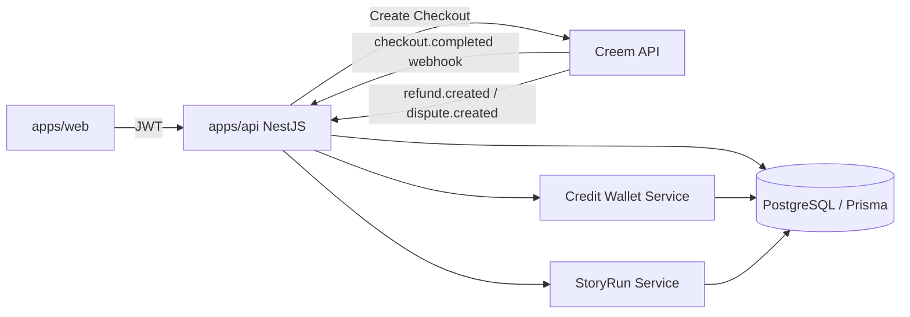

# Many Worlds — Creem 支付、World Credits 与邀请奖励完整开发方案（本地联调版）

> 本文档用于直接交给 Codex 执行。
>
> 目标仓库：`forwardFish/aiStoryRoom`
>
> 当前工程约束：
>
> - `apps/web`：现有静态模块化 Web 前端，CSS + 原生 ES Modules；
> - `apps/api`：NestJS + TypeScript；
> - 数据库：PostgreSQL + Prisma；
> - API 前缀继续使用 `/api/v4`；
> - 不迁移 Next.js，不重写现有前端；
> - 所有余额、奖励、支付、扣点均以后端数据库为唯一权威；
> - 浏览器不得直接增加、扣除或修改 World Credits。

---


## 本地联调结论（先看这一段）

可以在本地把完整支付流程跑通，但必须区分两种测试：

### A. 静态测试支付链接：只用于支付页面与 webhook 冒烟测试

```text
300 Credits:
https://www.creem.io/test/payment/prod_xkzSkuNeiQuP1QVNV6NbL

650 Credits:
https://www.creem.io/test/payment/prod_43UaxI9MUzfbPcGZtBbvQD
```

这两个链接可以直接打开并完成 Test Mode 支付，也可以触发 Creem 的测试 webhook。

但是，静态链接通常没有 Many Worlds 后端创建的 `purchaseId`、`userId`、`request_id` 和自定义 `metadata`。因此：

- 可以验证产品名称、价格、支付页和 webhook 是否能收到事件；
- 不应作为“给当前登录用户自动增加 Credits”的最终联调方式；
- 不能因为付款邮箱相同，就在生产环境直接给某个用户加点；
- 完整账户入账测试必须使用后端动态创建 Checkout。

### B. 动态 Checkout：用于真正跑通“用户付款 → Credits 到账”

```text
本地前端
→ POST http://localhost:3001/api/v4/billing/checkouts
→ NestJS 使用 Test API Key 调用 https://test-api.creem.io/v1/checkouts
→ Creem 返回 checkoutUrl
→ 用户完成测试付款
→ Creem 通过 HTTPS tunnel 调用本地 webhook
→ 后端根据 metadata.purchaseId 与数据库记录完成幂等入账
→ 本地成功页轮询并显示最新余额
```

本地完整联调必须具备：

1. 本地 Web：`http://localhost:3000`；
2. 本地 API：`http://localhost:3001`；
3. API 的公网 HTTPS tunnel，例如 ngrok；
4. Creem Test API Key；
5. Creem Test Webhook Secret；
6. 本文档中已经写入的两个 Test Product ID。

---

# 0. 本文档覆盖范围

本次必须一次性打通以下闭环：

```text
用户注册并验证账号
→ 后端幂等赠送 50 Bonus World Credits
→ 用户查看余额和流水
→ 用户生成邀请链接
→ 用户分享到 X / Facebook / 系统分享面板
→ 新用户通过邀请链接注册并参与有效体验
→ 邀请人获得 25 Bonus World Credits
→ 用户选择 300 / 650 Credits 点数包
→ 后端创建 Creem Checkout
→ 用户完成支付
→ Creem webhook 通知后端
→ 后端幂等增加 Purchased World Credits
→ 用户到达世界付费节点
→ 房间内任一用户支付 100 Credits 解锁整个房间
→ 系统失败时自动返还 Credits
→ Creem 退款或争议时撤回未使用 Credits 或登记 Credit Debt
```

本次不实现：

- 订阅；
- 按每次行动扣点；
- 用户之间转赠 Credits；
- Credits 提现、交易或兑换现金；
- 多人共同凑点；
- 分享按钮点击后立即奖励；
- 复杂 Affiliate 分成；
- 1,400 Credits 大包；
- Creator 收益分成。

---

# 1. 最终业务规则

## 1.1 Credits 类型

### Purchased Credits

用户通过 Creem 一次性付款购买：

- 永久有效；
- 不可提现；
- 不可转让；
- 不可交易；
- 系统故障可原数返还；
- 退款时需要根据该次购买尚未使用的 Credits 处理。

### Bonus Credits

注册、邀请或运营活动赠送：

- 默认 90 天有效；
- 不可退款；
- 不可转让；
- 优先于 Purchased Credits 消耗；
- 过期后自动作废并生成账本记录。

## 1.2 固定数值

| 项目 | 规则 |
|---|---:|
| 新用户注册并验证账号 | `+50 Bonus Credits` |
| 有效邀请奖励 | `+25 Bonus Credits / 人` |
| MVP 有效邀请奖励上限 | 每个邀请人最多奖励 2 人，共 50 Credits |
| 创建房间 | 免费 |
| 加入房间 | 免费 |
| 选择角色 | 免费 |
| 第一次动态免费体验 | 每账号 1 次 |
| 标准世界完整解锁 | `100 Credits / 房间` |
| 单人和多人价格 | 相同 |
| 300 Credits 点数包 | `$7.99` |
| 650 Credits 点数包 | `$14.99` |
| Purchased Credits 有效期 | 永久 |
| Bonus Credits 有效期 | 90 天 |

## 1.3 邀请奖励不是“分享奖励”

必须严格区分：

```text
点击 X / Facebook / Copy Link
→ 只记录 share event
→ 不奖励 Credits

被邀请人完成注册验证
+ 通过邀请链接绑定
+ 至少完成 2 次有效决策，或完成免费第一幕
→ 才算 Qualified Referral
→ 邀请人获得 25 Bonus Credits
```

这是反作弊底线，禁止改成“点击分享就送点”。

## 1.4 房间解锁规则

```text
标准世界价格：100 Credits / runId
```

- 房间内任何一名参与者都可以解锁；
- 一人成功扣点后，整个 `runId` 解锁；
- 同一 `runId` 只能扣款一次；
- 其他玩家同时点击时必须返回已解锁结果，不得重复扣点；
- 进入完整内容后，不再按行动、轮次或 AI 调用扣点。

---

# 2. 总体架构



关键原则：

1. Checkout 成功页只是用户体验页面，不是到账依据；
2. 真正增加 Credits 的唯一入口是经过签名验证的 Creem webhook；
3. 注册奖励、邀请奖励、购买入账、世界扣点全部写入统一账本；
4. 所有奖励和支付处理必须幂等；
5. Credits 余额必须可通过完整流水重新计算；
6. 客户端永远不能提交 `userId`、`credits`、`price` 等权威值。

---

# 3. Creem 后台配置

你已经创建了以下两个 Test Mode 一次性产品：

| 点数包 | 价格 | Test Product ID | 静态 Test Payment Link |
|---|---:|---|---|
| 300 World Credits | `$7.99` | `prod_xkzSkuNeiQuP1QVNV6NbL` | `https://www.creem.io/test/payment/prod_xkzSkuNeiQuP1QVNV6NbL` |
| 650 World Credits | `$14.99` | `prod_43UaxI9MUzfbPcGZtBbvQD` | `https://www.creem.io/test/payment/prod_43UaxI9MUzfbPcGZtBbvQD` |

## 3.1 Test Mode 必需配置

在 Creem Dashboard 切换到 **Test Mode**，然后完成：

1. 在 `Developers` 中创建或复制 Test API Key；
2. 新建测试 webhook endpoint；
3. 将本地 API 通过 ngrok 暴露为公网 HTTPS；
4. 将 webhook URL 填为：

```text
https://<YOUR_NGROK_DOMAIN>/api/v4/webhooks/creem
```

示例：

```text
https://abc123.ngrok-free.app/api/v4/webhooks/creem
```

5. 复制该 webhook endpoint 对应的 signing secret，填入 `CREEM_WEBHOOK_SECRET`；
6. 至少订阅以下事件：

```text
checkout.completed
refund.created
```

如 Dashboard 当前支持并需要争议事件，再增加：

```text
dispute.created
```

> 每次免费 ngrok 域名变化后，都必须同步修改 Creem Test Mode 中的 webhook URL。

## 3.2 两类支付入口的用途

### 静态 Payment Link

静态链接适合：

- 检查产品配置是否正确；
- 检查测试卡能否支付；
- 检查 webhook 是否到达；
- 检查签名验证和事件日志。

静态链接不适合完整 Credits 入账，因为缺少后端为当前登录用户创建的购买记录和 metadata。

### 动态 Checkout API

完整本地联调必须使用：

```http
POST /api/v4/billing/checkouts
```

后端在创建 Checkout 时写入：

```json
{
  "metadata": {
    "userId": "internal_user_id",
    "purchaseId": "local_database_purchase_id",
    "packKey": "credits_300",
    "source": "web-local-test"
  }
}
```

这样 webhook 才能可靠判断：

- 给哪个 Many Worlds 用户入账；
- 入账 300 还是 650 Credits；
- 是否已经处理过；
- Product ID、金额和数据库购买记录是否一致。

## 3.3 本地 Return / Success URL

动态 Checkout 本地优先使用：

```text
http://localhost:3000/credits-success.html
```

付款完成后，Creem 会在浏览器中重定向到该地址，并附带 `checkout_id` 等参数。

如果 Creem 当前配置不接受 `http://localhost`，则再开一个 Web tunnel：

```bash
ngrok http 3000
```

然后改用：

```text
https://<YOUR_WEB_NGROK_DOMAIN>/credits-success.html
```

无论浏览器是否成功跳转，Credits 到账都必须以签名 webhook 为准。

## 3.4 Live Mode

上线前必须在 Live Mode 中重新创建或确认 live 产品，并单独配置：

- Live API Key；
- Live Webhook Secret；
- Live Product IDs；
- Live Webhook URL。

Test 与 Live 数据、API Key、Product ID、Webhook Secret 完全分离，不允许混用。

## 3.5 Cloudflare / WAF

Webhook 路由必须允许 Creem 服务器访问：

```text
POST /api/v4/webhooks/creem
```

不要依赖 IP 白名单验证 Creem；必须验证 `creem-signature`。

如果 Cloudflare Bot Protection 拦截 webhook，应对该路由做服务器到服务器请求的绕过配置，不能关闭签名校验。

---

# 4. 环境变量

在 `apps/api/.env.example` 增加以下模板；真实密钥只写入本地 `.env`，禁止提交 Git。

```dotenv
# App
NODE_ENV=development
PUBLIC_WEB_URL=http://localhost:3000
PUBLIC_API_URL=http://localhost:3001

# Creem Test Mode
CREEM_MODE=test
CREEM_API_KEY=creem_test_REPLACE_WITH_YOUR_TEST_API_KEY
CREEM_WEBHOOK_SECRET=whsec_REPLACE_WITH_YOUR_TEST_WEBHOOK_SECRET

# 已确认的 Test Product IDs
CREEM_PRODUCT_300_ID=prod_xkzSkuNeiQuP1QVNV6NbL
CREEM_PRODUCT_650_ID=prod_43UaxI9MUzfbPcGZtBbvQD

# 仅用于人工打开/冒烟测试，不参与服务端权威入账映射
CREEM_TEST_PAYMENT_LINK_300=https://www.creem.io/test/payment/prod_xkzSkuNeiQuP1QVNV6NbL
CREEM_TEST_PAYMENT_LINK_650=https://www.creem.io/test/payment/prod_43UaxI9MUzfbPcGZtBbvQD

# World Credits
CREDIT_SIGNUP_BONUS=50
CREDIT_REFERRAL_REWARD=25
CREDIT_REFERRAL_MAX_REWARDS=2
CREDIT_BONUS_TTL_DAYS=90
CREDIT_STANDARD_WORLD_COST=100
CREDIT_FREE_DECISION_LIMIT=3

# Referral
REFERRAL_BASE_URL=http://localhost:3000/join.html
REFERRAL_COOKIE_TTL_DAYS=30
```

如果本地成功页必须使用 HTTPS tunnel，则临时改为：

```dotenv
PUBLIC_WEB_URL=https://<YOUR_WEB_NGROK_DOMAIN>
```

生产环境必须替换为：

```dotenv
CREEM_MODE=live
PUBLIC_WEB_URL=https://ourmanyworlds.com
PUBLIC_API_URL=https://api.ourmanyworlds.com
CREEM_API_KEY=REPLACE_WITH_LIVE_API_KEY
CREEM_WEBHOOK_SECRET=REPLACE_WITH_LIVE_WEBHOOK_SECRET
CREEM_PRODUCT_300_ID=REPLACE_WITH_LIVE_300_PRODUCT_ID
CREEM_PRODUCT_650_ID=REPLACE_WITH_LIVE_650_PRODUCT_ID
```

安全要求：

- `CREEM_API_KEY` 和 `CREEM_WEBHOOK_SECRET` 只能存在后端；
- 禁止使用 `VITE_`、`NEXT_PUBLIC_` 等前端公开前缀；
- 禁止提交到 Git；
- Test 和 Live 使用不同环境变量集合；
- Product ID 可以出现在客户端展示层，但 Credits 数量和价格仍必须由后端固定映射决定；
- 静态 payment link 不得作为服务端判定用户身份的依据。

---

# 5. 安装依赖

在仓库根目录执行：

```bash
pnpm --filter @apps/api add creem
```

如果尚未安装 DTO 校验依赖：

```bash
pnpm --filter @apps/api add class-validator class-transformer
```

不需要在前端安装 Creem SDK。Checkout 必须由后端创建。

---

# 6. 建议目录结构

```text
apps/api/src/
  billing/
    billing.module.ts
    billing.controller.ts
    billing.service.ts
    creem.client.ts
    creem-webhook.controller.ts
    creem-webhook.service.ts
    credit-pack.config.ts
    dto/create-checkout.dto.ts
  credits/
    credits.module.ts
    credits.controller.ts
    credits.service.ts
    credit-expiration.service.ts
  referrals/
    referrals.module.ts
    referrals.controller.ts
    referrals.service.ts
    dto/claim-referral.dto.ts
    dto/share-event.dto.ts
  story-runs/
    story-runs.service.ts
    story-runs.controller.ts
  auth/
    current-user.decorator.ts
    auth.guard.ts

apps/web/public/
  credits.html
  credits-success.html
  join.html
  js/
    api-client.js
    credits.js
    credits-success.js
    referrals.js
    share.js
```

保持现有项目目录时，Codex 可以将文件合并进已有模块，但 API 路径和业务规则不得改变。

---

# 7. Prisma 数据模型

将以下模型合并进现有 `prisma/schema.prisma`。

> 注意：如果仓库已有 `User` 模型，可以补 relation；如果用户由 Supabase Auth 管理而本地没有 User 表，保留 `userId String` 即可。

```prisma
enum CreditGrantKind {
  PURCHASED
  BONUS
}

enum CreditGrantSource {
  SIGNUP
  REFERRAL
  PURCHASE
  SYSTEM_REFUND
  ADMIN
}

enum CreditLedgerReason {
  SIGNUP_BONUS
  REFERRAL_REWARD
  PURCHASE
  WORLD_UNLOCK
  SYSTEM_REFUND
  BONUS_EXPIRED
  PURCHASE_REFUND
  DISPUTE
  ADMIN_ADJUSTMENT
}

enum CreemPurchaseStatus {
  PENDING
  PAID
  REFUNDED
  PARTIALLY_REFUNDED
  DISPUTED
  FAILED
}

enum WebhookProcessStatus {
  PROCESSED
  IGNORED
}

enum ReferralStatus {
  REGISTERED
  QUALIFIED
  REWARDED
  QUALIFIED_NO_REWARD
  REJECTED
}

enum ReferralChannel {
  COPY
  X
  FACEBOOK
  NATIVE_SHARE
  DIRECT
  UNKNOWN
}

enum WorldUnlockStatus {
  COMMITTED
  REFUNDED
}

model CreditWallet {
  userId           String   @id
  purchasedBalance Int      @default(0)
  bonusBalance     Int      @default(0)
  debtBalance      Int      @default(0)
  version          Int      @default(0)
  createdAt        DateTime @default(now())
  updatedAt        DateTime @updatedAt

  @@index([updatedAt])
}

model CreditGrant {
  id               String            @id @default(cuid())
  userId           String
  kind             CreditGrantKind
  source           CreditGrantSource
  originalAmount   Int
  remainingAmount  Int
  expiresAt        DateTime?
  idempotencyKey   String            @unique
  externalRef      String?
  metadataJson     Json?
  createdAt        DateTime          @default(now())
  updatedAt        DateTime          @updatedAt

  allocations CreditSpendAllocation[]

  @@index([userId, kind, expiresAt])
  @@index([externalRef])
}

model CreditLedger {
  id              String             @id @default(cuid())
  userId          String
  reason          CreditLedgerReason
  purchasedDelta  Int                @default(0)
  bonusDelta      Int                @default(0)
  debtDelta       Int                @default(0)
  idempotencyKey  String             @unique
  externalRef     String?
  metadataJson    Json?
  createdAt       DateTime           @default(now())

  allocations CreditSpendAllocation[]

  @@index([userId, createdAt])
  @@index([externalRef])
}

model CreditSpendAllocation {
  id        String      @id @default(cuid())
  ledgerId  String
  grantId   String
  amount    Int
  createdAt DateTime    @default(now())

  ledger CreditLedger @relation(fields: [ledgerId], references: [id], onDelete: Cascade)
  grant  CreditGrant  @relation(fields: [grantId], references: [id], onDelete: Restrict)

  @@unique([ledgerId, grantId])
  @@index([grantId])
}

model CreemPurchase {
  id                  String              @id @default(cuid())
  userId              String
  packKey             String
  creemProductId      String
  credits             Int
  expectedAmountCents Int
  expectedCurrency    String              @default("USD")
  status              CreemPurchaseStatus @default(PENDING)
  checkoutId          String?             @unique
  orderId             String?             @unique
  transactionId       String?             @unique
  customerId          String?
  customerEmail       String?
  paidAmountCents     Int?
  paidCurrency        String?
  rawJson             Json?
  createdAt           DateTime            @default(now())
  paidAt              DateTime?
  refundedAt          DateTime?
  updatedAt           DateTime            @updatedAt

  @@index([userId, createdAt])
  @@index([creemProductId])
}

model PaymentWebhookEvent {
  eventId        String               @id
  eventType      String
  status         WebhookProcessStatus
  payloadJson    Json
  createdAt      DateTime             @default(now())
  processedAt    DateTime             @default(now())
}

model ReferralCode {
  id        String   @id @default(cuid())
  userId    String   @unique
  code      String   @unique
  createdAt DateTime @default(now())

  referrals Referral[]
}

model Referral {
  id                 String          @id @default(cuid())
  referralCodeId     String
  inviterUserId      String
  referredUserId     String          @unique
  channel            ReferralChannel @default(UNKNOWN)
  status             ReferralStatus  @default(REGISTERED)
  qualifiedRunId     String?
  rewardLedgerId     String?
  rejectionReason    String?
  registeredAt       DateTime        @default(now())
  qualifiedAt        DateTime?
  rewardedAt         DateTime?
  updatedAt          DateTime        @updatedAt

  referralCode ReferralCode @relation(fields: [referralCodeId], references: [id], onDelete: Restrict)

  @@index([inviterUserId, status])
  @@index([referralCodeId])
}

model ReferralShareEvent {
  id        String          @id @default(cuid())
  userId    String
  channel   ReferralChannel
  runId     String?
  createdAt DateTime        @default(now())

  @@index([userId, createdAt])
}

model WorldUnlock {
  id             String            @id @default(cuid())
  runId          String            @unique
  templateKey    String
  paidByUserId   String
  creditsCharged Int
  debitLedgerId  String            @unique
  status         WorldUnlockStatus @default(COMMITTED)
  createdAt      DateTime          @default(now())
  refundedAt     DateTime?

  @@index([paidByUserId, createdAt])
}
```

如果 `StoryRun` 是 Prisma model，增加：

```prisma
enum RunAccessLevel {
  FREE_TRIAL
  UNLOCKED
}

model StoryRun {
  // existing fields...

  accessLevel       RunAccessLevel @default(FREE_TRIAL)
  freeDecisionsUsed Int            @default(0)
  paywallReachedAt  DateTime?
  unlockedAt        DateTime?
}
```

执行：

```bash
pnpm prisma format
pnpm prisma migrate dev --name add_world_credits_billing_referrals
pnpm prisma generate
```

---

# 8. Credits 常量与点数包映射

创建 `apps/api/src/billing/credit-pack.config.ts`：

```ts
export type CreditPackKey = 'credits_300' | 'credits_650';

export interface CreditPackDefinition {
  key: CreditPackKey;
  productId: string;
  credits: number;
  expectedAmountCents: number;
  currency: 'USD';
}

export function getCreditPacks(): Record<CreditPackKey, CreditPackDefinition> {
  const product300 = process.env.CREEM_PRODUCT_300_ID;
  const product650 = process.env.CREEM_PRODUCT_650_ID;

  if (!product300 || !product650) {
    throw new Error('Missing Creem product IDs');
  }

  return {
    credits_300: {
      key: 'credits_300',
      productId: product300,
      credits: 300,
      expectedAmountCents: 799,
      currency: 'USD',
    },
    credits_650: {
      key: 'credits_650',
      productId: product650,
      credits: 650,
      expectedAmountCents: 1499,
      currency: 'USD',
    },
  };
}

export function findPackByProductId(productId: string): CreditPackDefinition | null {
  return Object.values(getCreditPacks()).find((pack) => pack.productId === productId) ?? null;
}
```

严禁：

```ts
// 错误：信任客户端提交的 credits 或 price
const credits = body.credits;
const price = body.price;
```

服务端只接受 `packKey`，并从固定映射中获得 Product ID、价格和 Credits。

---

# 9. Creem Client

创建 `apps/api/src/billing/creem.client.ts`：

```ts
import { Injectable } from '@nestjs/common';
import { Creem } from 'creem';

@Injectable()
export class CreemClient {
  readonly sdk: Creem;

  constructor() {
    const apiKey = process.env.CREEM_API_KEY;
    if (!apiKey) {
      throw new Error('CREEM_API_KEY is required');
    }

    // 官方 Core SDK 在未指定 server 时默认使用 production。
    // 本地和测试环境必须显式使用 server: 'test'。
    this.sdk =
      process.env.CREEM_MODE === 'test'
        ? new Creem({ apiKey, server: 'test' })
        : new Creem({ apiKey });
  }
}
```

本地启动时建议打印非敏感配置，便于确认没有混用环境：

```ts
console.info('[Creem] mode=%s product300=%s product650=%s',
  process.env.CREEM_MODE,
  process.env.CREEM_PRODUCT_300_ID,
  process.env.CREEM_PRODUCT_650_ID,
);
```

禁止打印：

- API Key；
- Webhook Secret；
- 完整支付敏感数据。

---

# 10. 创建 Checkout API

## 10.1 DTO

`apps/api/src/billing/dto/create-checkout.dto.ts`：

```ts
import { IsIn } from 'class-validator';
import type { CreditPackKey } from '../credit-pack.config';

export class CreateCheckoutDto {
  @IsIn(['credits_300', 'credits_650'])
  packKey!: CreditPackKey;
}
```

## 10.2 Billing Service

```ts
import {
  BadRequestException,
  Injectable,
  InternalServerErrorException,
} from '@nestjs/common';
import { PrismaService } from '../prisma/prisma.service';
import { CreemClient } from './creem.client';
import { getCreditPacks, type CreditPackKey } from './credit-pack.config';

interface AuthenticatedUser {
  id: string;
  email: string;
}

@Injectable()
export class BillingService {
  constructor(
    private readonly prisma: PrismaService,
    private readonly creem: CreemClient,
  ) {}

  async createCheckout(user: AuthenticatedUser, packKey: CreditPackKey) {
    const pack = getCreditPacks()[packKey];
    if (!pack) {
      throw new BadRequestException('Unknown credit pack');
    }

    const webUrl = process.env.PUBLIC_WEB_URL;
    if (!webUrl) {
      throw new InternalServerErrorException('PUBLIC_WEB_URL is missing');
    }

    const purchase = await this.prisma.creemPurchase.create({
      data: {
        userId: user.id,
        packKey: pack.key,
        creemProductId: pack.productId,
        credits: pack.credits,
        expectedAmountCents: pack.expectedAmountCents,
        expectedCurrency: pack.currency,
      },
    });

    try {
      const checkout = await this.creem.sdk.checkouts.create({
        productId: pack.productId,
        successUrl: `${webUrl}/credits-success.html`,
        customer: {
          email: user.email,
        },
        metadata: {
          userId: user.id,
          purchaseId: purchase.id,
          packKey: pack.key,
          source: process.env.NODE_ENV === 'development' ? 'web-local-test' : 'web',
        },
      });

      await this.prisma.creemPurchase.update({
        where: { id: purchase.id },
        data: { checkoutId: checkout.id },
      });

      return {
        purchaseId: purchase.id,
        checkoutId: checkout.id,
        checkoutUrl: checkout.checkoutUrl,
      };
    } catch (error) {
      await this.prisma.creemPurchase.update({
        where: { id: purchase.id },
        data: { status: 'FAILED' },
      });

      throw new InternalServerErrorException('Failed to create checkout');
    }
  }

  async getCheckoutStatus(userId: string, checkoutId: string) {
    const purchase = await this.prisma.creemPurchase.findFirst({
      where: { checkoutId, userId },
      select: {
        id: true,
        status: true,
        credits: true,
        paidAt: true,
      },
    });

    if (!purchase) {
      throw new BadRequestException('Checkout not found');
    }

    return purchase;
  }
}
```

## 10.3 Controller

```ts
import { Body, Controller, Get, Param, Post, UseGuards } from '@nestjs/common';
import { BillingService } from './billing.service';
import { CreateCheckoutDto } from './dto/create-checkout.dto';
import { AuthGuard } from '../auth/auth.guard';
import { CurrentUser } from '../auth/current-user.decorator';

@Controller('/api/v4/billing')
@UseGuards(AuthGuard)
export class BillingController {
  constructor(private readonly billing: BillingService) {}

  @Post('/checkouts')
  createCheckout(
    @CurrentUser() user: { id: string; email: string },
    @Body() dto: CreateCheckoutDto,
  ) {
    return this.billing.createCheckout(user, dto.packKey);
  }

  @Get('/checkouts/:checkoutId')
  getCheckoutStatus(
    @CurrentUser() user: { id: string },
    @Param('checkoutId') checkoutId: string,
  ) {
    return this.billing.getCheckoutStatus(user.id, checkoutId);
  }
}
```

---

# 11. NestJS Raw Body 配置

Creem webhook 签名必须使用未经 JSON 解析修改的原始请求体。

修改 `apps/api/src/main.ts`：

```ts
import { NestFactory } from '@nestjs/core';
import { AppModule } from './app.module';

async function bootstrap() {
  const app = await NestFactory.create(AppModule, {
    rawBody: true,
  });

  app.enableCors({
    origin: [process.env.PUBLIC_WEB_URL!],
    credentials: true,
  });

  await app.listen(process.env.PORT ?? 3001);
}

bootstrap();
```

禁止先执行 `JSON.stringify(req.body)` 再验签。必须使用 `req.rawBody`。

---

# 12. Credits Service

创建 `apps/api/src/credits/credits.service.ts`。

下面代码展示核心实现。Codex 应根据现有 `PrismaService` 路径调整 import。

```ts
import {
  ConflictException,
  Injectable,
  PaymentRequiredException,
} from '@nestjs/common';
import { Prisma, type PrismaClient } from '@prisma/client';
import { PrismaService } from '../prisma/prisma.service';

type Tx = Prisma.TransactionClient;

@Injectable()
export class CreditsService {
  constructor(private readonly prisma: PrismaService) {}

  async ensureWallet(userId: string, tx: Tx = this.prisma) {
    return tx.creditWallet.upsert({
      where: { userId },
      create: { userId },
      update: {},
    });
  }

  async getBalance(userId: string) {
    await this.expireBonusCredits(userId);
    const wallet = await this.ensureWallet(userId);

    const nextExpiringBonus = await this.prisma.creditGrant.findFirst({
      where: {
        userId,
        kind: 'BONUS',
        remainingAmount: { gt: 0 },
        expiresAt: { gt: new Date() },
      },
      orderBy: { expiresAt: 'asc' },
      select: { remainingAmount: true, expiresAt: true },
    });

    return {
      purchased: wallet.purchasedBalance,
      bonus: wallet.bonusBalance,
      debt: wallet.debtBalance,
      available: wallet.purchasedBalance + wallet.bonusBalance,
      nextBonusExpiration: nextExpiringBonus,
    };
  }

  async grantCredits(params: {
    userId: string;
    kind: 'PURCHASED' | 'BONUS';
    source: 'SIGNUP' | 'REFERRAL' | 'PURCHASE' | 'SYSTEM_REFUND' | 'ADMIN';
    amount: number;
    reason:
      | 'SIGNUP_BONUS'
      | 'REFERRAL_REWARD'
      | 'PURCHASE'
      | 'SYSTEM_REFUND'
      | 'ADMIN_ADJUSTMENT';
    idempotencyKey: string;
    externalRef?: string;
    expiresAt?: Date | null;
    metadata?: Prisma.InputJsonValue;
    tx?: Tx;
  }) {
    if (!Number.isInteger(params.amount) || params.amount <= 0) {
      throw new Error('Credit amount must be a positive integer');
    }

    const execute = async (tx: Tx) => {
      const existing = await tx.creditLedger.findUnique({
        where: { idempotencyKey: params.idempotencyKey },
      });
      if (existing) return existing;

      await this.ensureWallet(params.userId, tx);

      const debtWallet = await tx.creditWallet.findUniqueOrThrow({
        where: { userId: params.userId },
      });

      // Refund/dispute debt is repaid before new purchased credits become available.
      const debtPayment =
        params.kind === 'PURCHASED'
          ? Math.min(debtWallet.debtBalance, params.amount)
          : 0;
      const netAmount = params.amount - debtPayment;

      const grant = await tx.creditGrant.create({
        data: {
          userId: params.userId,
          kind: params.kind,
          source: params.source,
          originalAmount: params.amount,
          remainingAmount: netAmount,
          expiresAt: params.expiresAt ?? null,
          idempotencyKey: params.idempotencyKey,
          externalRef: params.externalRef,
          metadataJson: params.metadata,
        },
      });

      const purchasedDelta = params.kind === 'PURCHASED' ? netAmount : 0;
      const bonusDelta = params.kind === 'BONUS' ? netAmount : 0;

      const ledger = await tx.creditLedger.create({
        data: {
          userId: params.userId,
          reason: params.reason,
          purchasedDelta,
          bonusDelta,
          debtDelta: -debtPayment,
          idempotencyKey: params.idempotencyKey,
          externalRef: params.externalRef,
          metadataJson: {
            ...(typeof params.metadata === 'object' && params.metadata
              ? (params.metadata as object)
              : {}),
            grantId: grant.id,
            grossAmount: params.amount,
            debtPayment,
          },
        },
      });

      await tx.creditWallet.update({
        where: { userId: params.userId },
        data: {
          purchasedBalance: { increment: purchasedDelta },
          bonusBalance: { increment: bonusDelta },
          debtBalance: { decrement: debtPayment },
          version: { increment: 1 },
        },
      });

      return ledger;
    };

    return params.tx
      ? execute(params.tx)
      : this.prisma.$transaction(execute, {
          isolationLevel: Prisma.TransactionIsolationLevel.Serializable,
        });
  }

  async spendCredits(params: {
    userId: string;
    amount: number;
    reason: 'WORLD_UNLOCK';
    idempotencyKey: string;
    externalRef: string;
    metadata?: Prisma.InputJsonValue;
    tx?: Tx;
  }) {
    if (!Number.isInteger(params.amount) || params.amount <= 0) {
      throw new Error('Spend amount must be a positive integer');
    }

    const execute = async (tx: Tx) => {
      const existing = await tx.creditLedger.findUnique({
        where: { idempotencyKey: params.idempotencyKey },
      });
      if (existing) return existing;

      await this.ensureWallet(params.userId, tx);

      // PostgreSQL row lock. Keep exact table naming aligned with generated Prisma table.
      await tx.$queryRaw`
        SELECT "userId"
        FROM "CreditWallet"
        WHERE "userId" = ${params.userId}
        FOR UPDATE
      `;

      await this.expireBonusCreditsTx(params.userId, tx);

      const wallet = await tx.creditWallet.findUniqueOrThrow({
        where: { userId: params.userId },
      });

      if (wallet.purchasedBalance + wallet.bonusBalance < params.amount) {
        throw new PaymentRequiredException({
          code: 'INSUFFICIENT_WORLD_CREDITS',
          required: params.amount,
          available: wallet.purchasedBalance + wallet.bonusBalance,
          missing:
            params.amount - (wallet.purchasedBalance + wallet.bonusBalance),
        });
      }

      const grants = await tx.creditGrant.findMany({
        where: {
          userId: params.userId,
          remainingAmount: { gt: 0 },
          OR: [
            { kind: 'PURCHASED' },
            { kind: 'BONUS', expiresAt: { gt: new Date() } },
          ],
        },
        orderBy: [
          { kind: 'desc' }, // BONUS before PURCHASED: enum order must be checked; explicit split is safer below.
          { expiresAt: 'asc' },
          { createdAt: 'asc' },
        ],
      });

      const bonusGrants = grants
        .filter((g) => g.kind === 'BONUS')
        .sort((a, b) =>
          (a.expiresAt?.getTime() ?? Number.MAX_SAFE_INTEGER) -
          (b.expiresAt?.getTime() ?? Number.MAX_SAFE_INTEGER),
        );
      const purchasedGrants = grants
        .filter((g) => g.kind === 'PURCHASED')
        .sort((a, b) => a.createdAt.getTime() - b.createdAt.getTime());

      let remaining = params.amount;
      let bonusUsed = 0;
      let purchasedUsed = 0;
      const allocations: Array<{ grantId: string; amount: number }> = [];

      for (const grant of [...bonusGrants, ...purchasedGrants]) {
        if (remaining === 0) break;
        const used = Math.min(grant.remainingAmount, remaining);
        if (used <= 0) continue;

        await tx.creditGrant.update({
          where: { id: grant.id },
          data: { remainingAmount: { decrement: used } },
        });

        allocations.push({ grantId: grant.id, amount: used });
        remaining -= used;
        if (grant.kind === 'BONUS') bonusUsed += used;
        else purchasedUsed += used;
      }

      if (remaining !== 0) {
        throw new ConflictException('Credit grant allocation mismatch');
      }

      const ledger = await tx.creditLedger.create({
        data: {
          userId: params.userId,
          reason: params.reason,
          purchasedDelta: -purchasedUsed,
          bonusDelta: -bonusUsed,
          idempotencyKey: params.idempotencyKey,
          externalRef: params.externalRef,
          metadataJson: params.metadata,
        },
      });

      await tx.creditSpendAllocation.createMany({
        data: allocations.map((allocation) => ({
          ledgerId: ledger.id,
          grantId: allocation.grantId,
          amount: allocation.amount,
        })),
      });

      await tx.creditWallet.update({
        where: { userId: params.userId },
        data: {
          purchasedBalance: { decrement: purchasedUsed },
          bonusBalance: { decrement: bonusUsed },
          version: { increment: 1 },
        },
      });

      return ledger;
    };

    return params.tx
      ? execute(params.tx)
      : this.prisma.$transaction(execute, {
          isolationLevel: Prisma.TransactionIsolationLevel.Serializable,
        });
  }

  async refundSpend(params: {
    originalLedgerId: string;
    idempotencyKey: string;
    reason?: string;
  }) {
    return this.prisma.$transaction(async (tx) => {
      const existing = await tx.creditLedger.findUnique({
        where: { idempotencyKey: params.idempotencyKey },
      });
      if (existing) return existing;

      const original = await tx.creditLedger.findUniqueOrThrow({
        where: { id: params.originalLedgerId },
        include: { allocations: true },
      });

      if (original.reason !== 'WORLD_UNLOCK') {
        throw new ConflictException('Only world unlock spends can be refunded here');
      }

      let bonusRestored = 0;
      let purchasedRestored = 0;

      for (const allocation of original.allocations) {
        const grant = await tx.creditGrant.findUniqueOrThrow({
          where: { id: allocation.grantId },
        });

        const bonusStillValid =
          grant.kind !== 'BONUS' ||
          !grant.expiresAt ||
          grant.expiresAt.getTime() > Date.now();

        if (grant.kind === 'BONUS' && !bonusStillValid) {
          continue;
        }

        await tx.creditGrant.update({
          where: { id: grant.id },
          data: { remainingAmount: { increment: allocation.amount } },
        });

        if (grant.kind === 'BONUS') bonusRestored += allocation.amount;
        else purchasedRestored += allocation.amount;
      }

      const ledger = await tx.creditLedger.create({
        data: {
          userId: original.userId,
          reason: 'SYSTEM_REFUND',
          purchasedDelta: purchasedRestored,
          bonusDelta: bonusRestored,
          idempotencyKey: params.idempotencyKey,
          externalRef: params.originalLedgerId,
          metadataJson: { reason: params.reason },
        },
      });

      await tx.creditWallet.update({
        where: { userId: original.userId },
        data: {
          purchasedBalance: { increment: purchasedRestored },
          bonusBalance: { increment: bonusRestored },
          version: { increment: 1 },
        },
      });

      return ledger;
    });
  }

  async expireBonusCredits(userId: string) {
    return this.prisma.$transaction((tx) =>
      this.expireBonusCreditsTx(userId, tx),
    );
  }

  private async expireBonusCreditsTx(userId: string, tx: Tx) {
    const expired = await tx.creditGrant.findMany({
      where: {
        userId,
        kind: 'BONUS',
        remainingAmount: { gt: 0 },
        expiresAt: { lte: new Date() },
      },
    });

    if (!expired.length) return 0;

    const amount = expired.reduce((sum, grant) => sum + grant.remainingAmount, 0);
    const batchKey = `bonus-expire:${userId}:${new Date().toISOString().slice(0, 10)}`;

    const existing = await tx.creditLedger.findUnique({
      where: { idempotencyKey: batchKey },
    });
    if (existing) return 0;

    for (const grant of expired) {
      await tx.creditGrant.update({
        where: { id: grant.id },
        data: { remainingAmount: 0 },
      });
    }

    await tx.creditLedger.create({
      data: {
        userId,
        reason: 'BONUS_EXPIRED',
        bonusDelta: -amount,
        idempotencyKey: batchKey,
        metadataJson: { grantIds: expired.map((g) => g.id) },
      },
    });

    await tx.creditWallet.update({
      where: { userId },
      data: {
        bonusBalance: { decrement: amount },
        version: { increment: 1 },
      },
    });

    return amount;
  }
}
```

> Codex 注意：如果 PostgreSQL 实际表名因 Prisma mapping 不同，应调整 `FOR UPDATE` 查询。不得删除行锁或 Serializable 事务。

---

# 13. 注册赠送 50 Credits

## 13.1 触发方式

不要依赖前端“只调用一次”。推荐每次登录或注册完成后都调用：

```http
POST /api/v4/credits/onboarding
```

后端通过唯一 `idempotencyKey` 保证只发一次。

只有满足以下条件才赠送：

- 已登录；
- 邮箱已验证，或 OAuth 提供方已经验证邮箱；
- 非匿名账号。

## 13.2 Controller

```ts
import { Body, Controller, Get, Post, UseGuards } from '@nestjs/common';
import { CreditsService } from './credits.service';
import { ReferralsService } from '../referrals/referrals.service';
import { AuthGuard } from '../auth/auth.guard';
import { CurrentUser } from '../auth/current-user.decorator';

@Controller('/api/v4/credits')
@UseGuards(AuthGuard)
export class CreditsController {
  constructor(
    private readonly credits: CreditsService,
    private readonly referrals: ReferralsService,
  ) {}

  @Post('/onboarding')
  async onboarding(
    @CurrentUser()
    user: {
      id: string;
      email: string;
      emailVerified: boolean;
      isAnonymous?: boolean;
    },
    @Body()
    body: { referralCode?: string; channel?: string },
  ) {
    if (!user.emailVerified || user.isAnonymous) {
      return {
        bonusGranted: false,
        reason: 'EMAIL_VERIFICATION_REQUIRED',
        balance: await this.credits.getBalance(user.id),
      };
    }

    const ttlDays = Number(process.env.CREDIT_BONUS_TTL_DAYS ?? 90);
    const signupBonus = Number(process.env.CREDIT_SIGNUP_BONUS ?? 50);
    const expiresAt = new Date(Date.now() + ttlDays * 86_400_000);

    await this.credits.grantCredits({
      userId: user.id,
      kind: 'BONUS',
      source: 'SIGNUP',
      amount: signupBonus,
      reason: 'SIGNUP_BONUS',
      idempotencyKey: `signup-bonus:${user.id}`,
      externalRef: user.id,
      expiresAt,
    });

    if (body.referralCode) {
      await this.referrals.bindReferral({
        referredUserId: user.id,
        referralCode: body.referralCode,
        channel: body.channel,
      });
    }

    return {
      bonusGranted: true,
      balance: await this.credits.getBalance(user.id),
    };
  }

  @Get('/balance')
  getBalance(@CurrentUser() user: { id: string }) {
    return this.credits.getBalance(user.id);
  }
}
```

因为 `signup-bonus:${user.id}` 唯一，所以重复调用不会重复发放。

---

# 14. 邀请与分享系统

## 14.1 生成邀请码

邀请码只包含随机短码，不暴露 userId。

```ts
import { Injectable, BadRequestException } from '@nestjs/common';
import { randomBytes } from 'node:crypto';
import { PrismaService } from '../prisma/prisma.service';
import { CreditsService } from '../credits/credits.service';

function generateReferralCode(): string {
  return randomBytes(6).toString('base64url').replace(/[-_]/g, '').slice(0, 8).toUpperCase();
}

@Injectable()
export class ReferralsService {
  constructor(
    private readonly prisma: PrismaService,
    private readonly credits: CreditsService,
  ) {}

  async getOrCreateCode(userId: string) {
    const existing = await this.prisma.referralCode.findUnique({
      where: { userId },
    });
    if (existing) return existing;

    for (let attempt = 0; attempt < 5; attempt += 1) {
      try {
        return await this.prisma.referralCode.create({
          data: { userId, code: generateReferralCode() },
        });
      } catch (error: any) {
        if (error?.code !== 'P2002') throw error;
      }
    }

    throw new Error('Unable to allocate referral code');
  }

  async getReferralSummary(userId: string) {
    const code = await this.getOrCreateCode(userId);
    const rewardedCount = await this.prisma.referral.count({
      where: { inviterUserId: userId, status: 'REWARDED' },
    });

    const baseUrl = process.env.REFERRAL_BASE_URL ?? `${process.env.PUBLIC_WEB_URL}/join.html`;

    return {
      code: code.code,
      inviteUrl: `${baseUrl}?ref=${encodeURIComponent(code.code)}`,
      rewardPerQualifiedInvite: Number(process.env.CREDIT_REFERRAL_REWARD ?? 25),
      maxRewardedInvites: Number(process.env.CREDIT_REFERRAL_MAX_REWARDS ?? 2),
      rewardedCount,
      remainingRewardSlots: Math.max(
        0,
        Number(process.env.CREDIT_REFERRAL_MAX_REWARDS ?? 2) - rewardedCount,
      ),
    };
  }

  async bindReferral(params: {
    referredUserId: string;
    referralCode: string;
    channel?: string;
  }) {
    const code = await this.prisma.referralCode.findUnique({
      where: { code: params.referralCode.trim().toUpperCase() },
    });

    if (!code) return { bound: false, reason: 'INVALID_CODE' };
    if (code.userId === params.referredUserId) {
      return { bound: false, reason: 'SELF_REFERRAL' };
    }

    const existing = await this.prisma.referral.findUnique({
      where: { referredUserId: params.referredUserId },
    });
    if (existing) return { bound: false, reason: 'ALREADY_BOUND' };

    await this.prisma.referral.create({
      data: {
        referralCodeId: code.id,
        inviterUserId: code.userId,
        referredUserId: params.referredUserId,
        channel: this.normalizeChannel(params.channel),
      },
    });

    return { bound: true };
  }

  async recordShare(userId: string, channel?: string, runId?: string) {
    await this.prisma.referralShareEvent.create({
      data: {
        userId,
        channel: this.normalizeChannel(channel),
        runId,
      },
    });

    // IMPORTANT: no credit reward here.
    return { recorded: true, creditsGranted: 0 };
  }

  async qualifyReferral(referredUserId: string, qualifiedRunId: string) {
    return this.prisma.$transaction(async (tx) => {
      const referral = await tx.referral.findUnique({
        where: { referredUserId },
      });

      if (!referral) return { rewarded: false, reason: 'NO_REFERRAL' };
      if (referral.status === 'REWARDED') {
        return { rewarded: true, reason: 'ALREADY_REWARDED' };
      }
      if (referral.status !== 'REGISTERED') {
        return { rewarded: false, reason: referral.status };
      }

      const maxRewards = Number(process.env.CREDIT_REFERRAL_MAX_REWARDS ?? 2);
      const alreadyRewarded = await tx.referral.count({
        where: { inviterUserId: referral.inviterUserId, status: 'REWARDED' },
      });

      if (alreadyRewarded >= maxRewards) {
        await tx.referral.update({
          where: { id: referral.id },
          data: {
            status: 'QUALIFIED_NO_REWARD',
            qualifiedRunId,
            qualifiedAt: new Date(),
          },
        });
        return { rewarded: false, reason: 'REWARD_LIMIT_REACHED' };
      }

      const reward = Number(process.env.CREDIT_REFERRAL_REWARD ?? 25);
      const ttlDays = Number(process.env.CREDIT_BONUS_TTL_DAYS ?? 90);
      const expiresAt = new Date(Date.now() + ttlDays * 86_400_000);

      const ledger = await this.credits.grantCredits({
        userId: referral.inviterUserId,
        kind: 'BONUS',
        source: 'REFERRAL',
        amount: reward,
        reason: 'REFERRAL_REWARD',
        idempotencyKey: `referral-reward:${referral.id}`,
        externalRef: referral.id,
        expiresAt,
        metadata: {
          referredUserId,
          qualifiedRunId,
        },
        tx,
      });

      await tx.referral.update({
        where: { id: referral.id },
        data: {
          status: 'REWARDED',
          qualifiedRunId,
          qualifiedAt: new Date(),
          rewardedAt: new Date(),
          rewardLedgerId: ledger.id,
        },
      });

      return { rewarded: true, credits: reward };
    });
  }

  private normalizeChannel(channel?: string) {
    switch (channel?.toLowerCase()) {
      case 'x':
      case 'twitter':
        return 'X' as const;
      case 'facebook':
        return 'FACEBOOK' as const;
      case 'copy':
        return 'COPY' as const;
      case 'native_share':
        return 'NATIVE_SHARE' as const;
      case 'direct':
        return 'DIRECT' as const;
      default:
        return 'UNKNOWN' as const;
    }
  }
}
```

## 14.2 Referral Controller

```ts
import { Body, Controller, Get, Post, UseGuards } from '@nestjs/common';
import { AuthGuard } from '../auth/auth.guard';
import { CurrentUser } from '../auth/current-user.decorator';
import { ReferralsService } from './referrals.service';

@Controller('/api/v4/referrals')
@UseGuards(AuthGuard)
export class ReferralsController {
  constructor(private readonly referrals: ReferralsService) {}

  @Get('/me')
  getMine(@CurrentUser() user: { id: string }) {
    return this.referrals.getReferralSummary(user.id);
  }

  @Post('/share-events')
  recordShare(
    @CurrentUser() user: { id: string },
    @Body() body: { channel?: string; runId?: string },
  ) {
    return this.referrals.recordShare(user.id, body.channel, body.runId);
  }
}
```

## 14.3 何时触发 qualifyReferral

在现有 `StoryRun` 决策成功落账后：

```ts
if (storyRun.validDecisionCount >= 2 || storyRun.firstActCompletedAt) {
  await referralsService.qualifyReferral(userId, storyRun.id);
}
```

要求：

- 只有规则引擎确认并成功落账的有效决策计数；
- 被 ActionGuard 拒绝的输入不计数；
- 重复 idempotency request 不重复计数；
- 一个 referred user 最多触发一次邀请奖励。

---

# 15. 前端捕获 Referral Code

`apps/web/public/js/referrals.js`：

```js
const REFERRAL_STORAGE_KEY = 'mw_referral';

export function captureReferralFromUrl() {
  const params = new URLSearchParams(window.location.search);
  const ref = params.get('ref');
  const channel = params.get('channel') || 'direct';

  if (!ref) return null;

  const payload = {
    code: ref.trim().toUpperCase(),
    channel,
    capturedAt: Date.now(),
  };

  localStorage.setItem(REFERRAL_STORAGE_KEY, JSON.stringify(payload));
  return payload;
}

export function getStoredReferral() {
  try {
    const raw = localStorage.getItem(REFERRAL_STORAGE_KEY);
    if (!raw) return null;
    const parsed = JSON.parse(raw);
    const ttl = 30 * 24 * 60 * 60 * 1000;
    if (Date.now() - parsed.capturedAt > ttl) {
      localStorage.removeItem(REFERRAL_STORAGE_KEY);
      return null;
    }
    return parsed;
  } catch {
    return null;
  }
}

export function clearStoredReferral() {
  localStorage.removeItem(REFERRAL_STORAGE_KEY);
}
```

在 `join.html` 和所有注册入口加载时调用：

```js
captureReferralFromUrl();
```

登录成功后调用 onboarding：

```js
import { getStoredReferral, clearStoredReferral } from './referrals.js';
import { apiFetch } from './api-client.js';

export async function completeCreditsOnboarding() {
  const referral = getStoredReferral();

  const response = await apiFetch('/api/v4/credits/onboarding', {
    method: 'POST',
    body: JSON.stringify({
      referralCode: referral?.code,
      channel: referral?.channel,
    }),
  });

  if (response.bonusGranted && referral) {
    clearStoredReferral();
  }

  return response;
}
```

---

# 16. X、Facebook 与系统分享

`apps/web/public/js/share.js`：

```js
import { apiFetch } from './api-client.js';

const DEFAULT_TEXT =
  'Step into a complex world with me. We each take a different role, and nothing after the opening is scripted.';

async function logShare(channel, runId) {
  try {
    await apiFetch('/api/v4/referrals/share-events', {
      method: 'POST',
      body: JSON.stringify({ channel, runId }),
    });
  } catch {
    // Analytics failure must not block sharing.
  }
}

export async function shareToX(inviteUrl, runId) {
  await logShare('x', runId);
  const url = new URL('https://twitter.com/intent/tweet');
  url.searchParams.set('text', DEFAULT_TEXT);
  url.searchParams.set('url', addChannel(inviteUrl, 'x'));
  window.open(url.toString(), '_blank', 'noopener,noreferrer,width=720,height=640');
}

export async function shareToFacebook(inviteUrl, runId) {
  await logShare('facebook', runId);
  const url = new URL('https://www.facebook.com/sharer/sharer.php');
  url.searchParams.set('u', addChannel(inviteUrl, 'facebook'));
  window.open(url.toString(), '_blank', 'noopener,noreferrer,width=720,height=640');
}

export async function shareNative(inviteUrl, runId) {
  const shareUrl = addChannel(inviteUrl, 'native_share');

  if (navigator.share) {
    await logShare('native_share', runId);
    await navigator.share({
      title: 'Join me in Many Worlds',
      text: DEFAULT_TEXT,
      url: shareUrl,
    });
    return true;
  }

  return false;
}

export async function copyInviteLink(inviteUrl, runId) {
  await logShare('copy', runId);
  await navigator.clipboard.writeText(addChannel(inviteUrl, 'copy'));
}

function addChannel(inviteUrl, channel) {
  const url = new URL(inviteUrl);
  url.searchParams.set('channel', channel);
  return url.toString();
}
```

注意：

- Facebook 分享卡片标题、描述和图片主要读取目标页面的 Open Graph 标签；
- `join.html` 必须配置通用 OG 标签；
- 不要声称“分享即可获得点数”；
- UI 文案应为：

```text
Invite friends
Earn 25 Bonus Credits after a new friend joins and completes the opening.
Up to 2 rewarded invites during the MVP.
```

---

# 17. Creem Webhook

## 17.1 Controller

`apps/api/src/billing/creem-webhook.controller.ts`：

```ts
import {
  Controller,
  Headers,
  HttpCode,
  Post,
  RawBodyRequest,
  Req,
  UnauthorizedException,
} from '@nestjs/common';
import type { Request } from 'express';
import { constructWebhookEventEntity } from 'creem/webhooks';
import { CreemWebhookService } from './creem-webhook.service';

@Controller('/api/v4/webhooks')
export class CreemWebhookController {
  constructor(private readonly webhookService: CreemWebhookService) {}

  @Post('/creem')
  @HttpCode(200)
  async handle(@Req() req: RawBodyRequest<Request>) {
    const rawBody = req.rawBody?.toString('utf8');
    if (!rawBody) {
      throw new UnauthorizedException('Missing raw body');
    }

    const event = await constructWebhookEventEntity(rawBody, req.headers, {
      secret: process.env.CREEM_WEBHOOK_SECRET!,
    }).catch(() => null);

    if (!event) {
      throw new UnauthorizedException('Invalid Creem signature');
    }

    await this.webhookService.process(event as any);
    return { received: true };
  }
}
```

该路由必须标记为 public，不得要求用户 JWT，但必须验证 Creem signature。

## 17.2 Webhook Service

```ts
import { Injectable, Logger } from '@nestjs/common';
import { Prisma } from '@prisma/client';
import { PrismaService } from '../prisma/prisma.service';
import { CreditsService } from '../credits/credits.service';
import { findPackByProductId } from './credit-pack.config';

@Injectable()
export class CreemWebhookService {
  private readonly logger = new Logger(CreemWebhookService.name);

  constructor(
    private readonly prisma: PrismaService,
    private readonly credits: CreditsService,
  ) {}

  async process(event: any) {
    switch (event.eventType) {
      case 'checkout.completed':
        return this.processCheckoutCompleted(event);
      case 'refund.created':
        return this.processRefund(event);
      case 'dispute.created':
        return this.processDispute(event);
      default:
        return this.recordIgnored(event);
    }
  }

  private async processCheckoutCompleted(event: any) {
    const checkout = event.object;
    const metadata = checkout?.metadata ?? {};
    const productId = checkout?.product?.id ?? checkout?.order?.product;
    const order = checkout?.order;
    const customer = checkout?.customer;

    if (!productId || !order || order.status !== 'paid') {
      throw new Error('Malformed or unpaid checkout.completed event');
    }

    const pack = findPackByProductId(productId);
    if (!pack) {
      throw new Error(`Unknown Creem product ID: ${productId}`);
    }

    const purchaseId = metadata.purchaseId;
    const userId = metadata.userId;
    if (!purchaseId || !userId) {
      throw new Error('Missing required checkout metadata');
    }

    await this.prisma.$transaction(
      async (tx) => {
        const existingEvent = await tx.paymentWebhookEvent.findUnique({
          where: { eventId: event.id },
        });
        if (existingEvent) return;

        const purchase = await tx.creemPurchase.findUnique({
          where: { id: purchaseId },
        });
        if (!purchase) throw new Error('Purchase record not found');

        if (purchase.userId !== userId) {
          throw new Error('Purchase user metadata mismatch');
        }
        if (purchase.creemProductId !== productId) {
          throw new Error('Purchase product mismatch');
        }
        if (purchase.credits !== pack.credits) {
          throw new Error('Purchase credit mapping mismatch');
        }

        const paidAmount = Number(order.amount ?? order.amount_paid ?? 0);
        const currency = String(order.currency ?? '').toUpperCase();

        // Taxes may be added on top. Validate product base price conservatively.
        if (currency !== purchase.expectedCurrency) {
          throw new Error('Unexpected checkout currency');
        }
        if (paidAmount < purchase.expectedAmountCents) {
          throw new Error('Paid amount is lower than configured product price');
        }

        await tx.creemPurchase.update({
          where: { id: purchase.id },
          data: {
            status: 'PAID',
            checkoutId: checkout.id,
            orderId: order.id,
            transactionId: order.transaction ?? null,
            customerId: customer?.id ?? order.customer ?? null,
            customerEmail: customer?.email ?? null,
            paidAmountCents: paidAmount,
            paidCurrency: currency,
            paidAt: new Date(),
            rawJson: event,
          },
        });

        await this.credits.grantCredits({
          userId: purchase.userId,
          kind: 'PURCHASED',
          source: 'PURCHASE',
          amount: purchase.credits,
          reason: 'PURCHASE',
          idempotencyKey: `creem-purchase:${order.id}`,
          externalRef: purchase.id,
          expiresAt: null,
          metadata: {
            checkoutId: checkout.id,
            orderId: order.id,
            productId,
          },
          tx,
        });

        await tx.paymentWebhookEvent.create({
          data: {
            eventId: event.id,
            eventType: event.eventType,
            status: 'PROCESSED',
            payloadJson: event,
          },
        });
      },
      { isolationLevel: Prisma.TransactionIsolationLevel.Serializable },
    );
  }

  private async processRefund(event: any) {
    const refund = event.object;
    const orderId = refund?.order?.id ?? refund?.transaction?.order;
    if (!orderId) throw new Error('Refund event missing order ID');

    await this.prisma.$transaction(async (tx) => {
      const existing = await tx.paymentWebhookEvent.findUnique({
        where: { eventId: event.id },
      });
      if (existing) return;

      const purchase = await tx.creemPurchase.findUnique({
        where: { orderId },
      });
      if (!purchase) throw new Error('Purchase for refund not found');

      const refundAmount = Number(refund.refund_amount ?? 0);
      const paidAmount = purchase.paidAmountCents ?? purchase.expectedAmountCents;
      const creditsToReverse = Math.min(
        purchase.credits,
        Math.ceil((purchase.credits * refundAmount) / Math.max(paidAmount, 1)),
      );

      await this.reversePurchasedCreditsTx({
        tx,
        purchase,
        creditsToReverse,
        reason: 'PURCHASE_REFUND',
        idempotencyKey: `creem-refund:${refund.id}`,
      });

      await tx.creemPurchase.update({
        where: { id: purchase.id },
        data: {
          status:
            creditsToReverse >= purchase.credits ? 'REFUNDED' : 'PARTIALLY_REFUNDED',
          refundedAt: new Date(),
          rawJson: event,
        },
      });

      await tx.paymentWebhookEvent.create({
        data: {
          eventId: event.id,
          eventType: event.eventType,
          status: 'PROCESSED',
          payloadJson: event,
        },
      });
    });
  }

  private async processDispute(event: any) {
    const dispute = event.object;
    const orderId = dispute?.order?.id ?? dispute?.transaction?.order;
    if (!orderId) throw new Error('Dispute event missing order ID');

    await this.prisma.$transaction(async (tx) => {
      const existing = await tx.paymentWebhookEvent.findUnique({
        where: { eventId: event.id },
      });
      if (existing) return;

      const purchase = await tx.creemPurchase.findUnique({
        where: { orderId },
      });
      if (!purchase) throw new Error('Purchase for dispute not found');

      await this.reversePurchasedCreditsTx({
        tx,
        purchase,
        creditsToReverse: purchase.credits,
        reason: 'DISPUTE',
        idempotencyKey: `creem-dispute:${dispute.id}`,
      });

      await tx.creemPurchase.update({
        where: { id: purchase.id },
        data: { status: 'DISPUTED', rawJson: event },
      });

      await tx.paymentWebhookEvent.create({
        data: {
          eventId: event.id,
          eventType: event.eventType,
          status: 'PROCESSED',
          payloadJson: event,
        },
      });
    });
  }

  private async reversePurchasedCreditsTx(params: {
    tx: Prisma.TransactionClient;
    purchase: {
      id: string;
      userId: string;
      credits: number;
    };
    creditsToReverse: number;
    reason: 'PURCHASE_REFUND' | 'DISPUTE';
    idempotencyKey: string;
  }) {
    const grant = await params.tx.creditGrant.findUnique({
      where: { idempotencyKey: `creem-purchase:${
        (await params.tx.creemPurchase.findUniqueOrThrow({ where: { id: params.purchase.id } })).orderId
      }` },
    });

    // Fallback lookup by purchase externalRef if order-based key is unavailable.
    const purchaseGrant =
      grant ??
      (await params.tx.creditGrant.findFirst({
        where: {
          externalRef: params.purchase.id,
          source: 'PURCHASE',
          kind: 'PURCHASED',
        },
        orderBy: { createdAt: 'asc' },
      }));

    if (!purchaseGrant) {
      throw new Error('Purchased credit grant not found');
    }

    const removable = Math.min(
      purchaseGrant.remainingAmount,
      params.creditsToReverse,
    );
    const debt = params.creditsToReverse - removable;

    if (removable > 0) {
      await params.tx.creditGrant.update({
        where: { id: purchaseGrant.id },
        data: { remainingAmount: { decrement: removable } },
      });
    }

    await params.tx.creditWallet.update({
      where: { userId: params.purchase.userId },
      data: {
        purchasedBalance: { decrement: removable },
        debtBalance: { increment: debt },
        version: { increment: 1 },
      },
    });

    await params.tx.creditLedger.create({
      data: {
        userId: params.purchase.userId,
        reason: params.reason,
        purchasedDelta: -removable,
        debtDelta: debt,
        idempotencyKey: params.idempotencyKey,
        externalRef: params.purchase.id,
        metadataJson: {
          requestedReverse: params.creditsToReverse,
          removedUnusedCredits: removable,
          debtCreated: debt,
        },
      },
    });
  }

  private async recordIgnored(event: any) {
    await this.prisma.paymentWebhookEvent.upsert({
      where: { eventId: event.id },
      create: {
        eventId: event.id,
        eventType: event.eventType,
        status: 'IGNORED',
        payloadJson: event,
      },
      update: {},
    });
  }
}
```

> Codex 必须修正 `reversePurchasedCreditsTx` 中因实际 schema / orderId 可空导致的类型问题，并补单元测试。核心规则是：先撤回该购买批次未使用 Credits；不足部分形成 debt，不允许余额变成负数。

---

# 18. 世界解锁 API

## 18.1 路由

```http
POST /api/v4/story-runs/:runId/unlock
```

返回：

```json
{
  "unlocked": true,
  "runId": "run_xxx",
  "creditsCharged": 100,
  "paidByUserId": "user_xxx",
  "balance": {
    "purchased": 250,
    "bonus": 0,
    "available": 250
  }
}
```

## 18.2 Service

```ts
import { ForbiddenException, Injectable } from '@nestjs/common';
import { Prisma } from '@prisma/client';
import { PrismaService } from '../prisma/prisma.service';
import { CreditsService } from '../credits/credits.service';

@Injectable()
export class StoryRunUnlockService {
  constructor(
    private readonly prisma: PrismaService,
    private readonly credits: CreditsService,
  ) {}

  async unlock(runId: string, userId: string) {
    const cost = Number(process.env.CREDIT_STANDARD_WORLD_COST ?? 100);

    return this.prisma.$transaction(
      async (tx) => {
        const existing = await tx.worldUnlock.findUnique({
          where: { runId },
        });
        if (existing?.status === 'COMMITTED') {
          return {
            unlocked: true,
            alreadyUnlocked: true,
            ...existing,
          };
        }

        const run = await tx.storyRun.findUniqueOrThrow({
          where: { id: runId },
        });

        const participant = await this.isRunParticipant(tx, runId, userId, run.userId);
        if (!participant) {
          throw new ForbiddenException('Only a room participant can unlock this world');
        }

        const ledger = await this.credits.spendCredits({
          userId,
          amount: cost,
          reason: 'WORLD_UNLOCK',
          idempotencyKey: `world-unlock:${runId}`,
          externalRef: runId,
          metadata: { runId, templateKey: run.templateKey },
          tx,
        });

        const unlock = await tx.worldUnlock.create({
          data: {
            runId,
            templateKey: run.templateKey,
            paidByUserId: userId,
            creditsCharged: cost,
            debitLedgerId: ledger.id,
          },
        });

        await tx.storyRun.update({
          where: { id: runId },
          data: {
            accessLevel: 'UNLOCKED',
            unlockedAt: new Date(),
          },
        });

        return {
          unlocked: true,
          alreadyUnlocked: false,
          ...unlock,
        };
      },
      { isolationLevel: Prisma.TransactionIsolationLevel.Serializable },
    );
  }

  async refundUnlockOnSystemFailure(runId: string, reason: string) {
    const unlock = await this.prisma.worldUnlock.findUnique({
      where: { runId },
    });
    if (!unlock || unlock.status === 'REFUNDED') return;

    await this.credits.refundSpend({
      originalLedgerId: unlock.debitLedgerId,
      idempotencyKey: `world-unlock-refund:${runId}`,
      reason,
    });

    await this.prisma.worldUnlock.update({
      where: { runId },
      data: { status: 'REFUNDED', refundedAt: new Date() },
    });
  }

  private async isRunParticipant(
    tx: Prisma.TransactionClient,
    runId: string,
    userId: string,
    ownerUserId?: string | null,
  ) {
    if (ownerUserId === userId) return true;

    // Replace with actual participant table when multiplayer is enabled.
    const participant = await tx.storyParticipant?.findFirst?.({
      where: { runId, userId },
    });
    return Boolean(participant);
  }
}
```

Codex 必须根据当前真实的房间参与者模型替换 `storyParticipant` 占位实现。当前单人 MVP 可以先仅允许 `run.userId === userId`。

## 18.3 Paywall Guard

在提交第 4 次及以后有效决策前检查：

```ts
const freeLimit = Number(process.env.CREDIT_FREE_DECISION_LIMIT ?? 3);

if (
  run.accessLevel !== 'UNLOCKED' &&
  run.freeDecisionsUsed >= freeLimit
) {
  throw new PaymentRequiredException({
    code: 'WORLD_UNLOCK_REQUIRED',
    runId: run.id,
    requiredCredits: 100,
  });
}
```

成功完成免费有效决策后：

```ts
await tx.storyRun.update({
  where: { id: run.id },
  data: {
    freeDecisionsUsed: { increment: 1 },
    paywallReachedAt:
      run.freeDecisionsUsed + 1 >= freeLimit ? new Date() : undefined,
  },
});
```

不要根据前端传来的轮次判断是否收费。

---

# 19. 系统失败自动返还

世界解锁后的第一段付费内容生成失败时：

```ts
try {
  await generateFirstPaidWorldContent(runId);
} catch (error) {
  await storyRunUnlockService.refundUnlockOnSystemFailure(
    runId,
    'FIRST_PAID_CONTENT_GENERATION_FAILED',
  );
  throw error;
}
```

必须满足：

- 退款幂等；
- 同一个 runId 只返还一次；
- 已成功生成付费内容后用户主动退出不返还；
- AI 超时重试期间不要过早返还；
- 达到最终失败状态后才返还。

---

# 20. Credits Success 页面

Creem 支付跳转不能直接被当作到账证明。

`credits-success.html` 逻辑：

1. 从 URL 读取 `checkout_id`；
2. 显示 `Payment received. Adding your World Credits…`；
3. 轮询后端 checkout 状态；
4. 后端显示 `PAID` 后再展示最新余额；
5. 最多轮询 30 秒；
6. 超时后提示稍后刷新，不要再次充值。

`apps/web/public/js/credits-success.js`：

```js
import { apiFetch } from './api-client.js';

const params = new URLSearchParams(window.location.search);
const checkoutId = params.get('checkout_id');

async function sleep(ms) {
  return new Promise((resolve) => setTimeout(resolve, ms));
}

async function waitForCredits() {
  if (!checkoutId) {
    renderError('Missing checkout ID.');
    return;
  }

  for (let attempt = 0; attempt < 15; attempt += 1) {
    try {
      const purchase = await apiFetch(
        `/api/v4/billing/checkouts/${encodeURIComponent(checkoutId)}`,
      );

      if (purchase.status === 'PAID') {
        const balance = await apiFetch('/api/v4/credits/balance');
        renderSuccess(purchase.credits, balance.available);
        return;
      }

      if (['FAILED', 'REFUNDED', 'DISPUTED'].includes(purchase.status)) {
        renderError(`Payment status: ${purchase.status}`);
        return;
      }
    } catch {
      // Continue polling. Webhook can arrive after redirect.
    }

    await sleep(2000);
  }

  renderPending(
    'Your payment was received, but the credit update is still processing. Please refresh this page in a moment or contact support if it does not appear.',
  );
}

waitForCredits();
```

禁止：

```js
// 严禁在成功页直接修改余额
localStorage.worldCredits = 300;
```

---

# 21. Frontend Credits 页面

页面应显示：

```text
World Credits

Available: 350
Purchased: 300
Bonus: 50
Bonus expires in 74 days
```

点数包：

```text
300 World Credits — $7.99
650 World Credits — $14.99
```

按钮逻辑：

```js
async function buyCredits(packKey) {
  const response = await apiFetch('/api/v4/billing/checkouts', {
    method: 'POST',
    body: JSON.stringify({ packKey }),
  });

  window.location.assign(response.checkoutUrl);
}
```

Checkout 前必须展示：

```text
One-time purchase. No subscription.
Purchased Credits never expire.
Credits have no cash value and cannot be transferred.
Taxes may apply based on your location.
```

并提供链接：

```text
Terms of Service
Privacy Policy
Refund Policy
```

---

# 22. API 契约汇总

## Credits

```http
POST /api/v4/credits/onboarding
GET  /api/v4/credits/balance
GET  /api/v4/credits/transactions?page=1&pageSize=30
```

## Billing

```http
POST /api/v4/billing/checkouts
GET  /api/v4/billing/checkouts/:checkoutId
POST /api/v4/webhooks/creem
```

## Referrals

```http
GET  /api/v4/referrals/me
POST /api/v4/referrals/share-events
```

## Story Run

```http
POST /api/v4/story-runs/:runId/unlock
```

## 402 错误格式

```json
{
  "statusCode": 402,
  "code": "WORLD_UNLOCK_REQUIRED",
  "runId": "run_xxx",
  "requiredCredits": 100,
  "availableCredits": 50,
  "missingCredits": 50
}
```

---

# 23. 认证与权限要求

所有用户 API 必须从已验证 JWT 中获取用户身份：

```ts
@CurrentUser() user
```

禁止接受：

```json
{
  "userId": "user_from_browser"
}
```

Creem webhook 是唯一不要求用户 JWT 的写接口，但必须验证 `creem-signature`。

如果使用 Supabase Auth：

- API 必须验证 Supabase access token；
- 使用 `sub` 作为 `userId`；
- 检查 `email_confirmed_at` 或 JWT 中的验证状态；
- 匿名用户不得领取注册奖励；
- OAuth 验证账号可以直接领取。

---

# 24. 安全与反作弊规则

## 24.1 支付

- 不信任客户端价格；
- 不信任客户端 Credits 数量；
- 只按服务端 Product ID 映射充值；
- 只通过签名 webhook 入账；
- webhook eventId 唯一；
- orderId 唯一；
- checkoutId 唯一；
- 未知 Product ID 必须报错；
- Test 与 Live 不能混用。

## 24.2 注册奖励

- 邮箱验证后发放；
- 每 userId 一次；
- 使用 `signup-bonus:${userId}` 幂等；
- 删除账号后重新注册是否可再次获得，由风控策略决定；MVP 可按 Supabase userId 判断，后期增加设备/IP 风险识别。

## 24.3 Referral

- 自我邀请无效；
- 一个新用户只能绑定一个邀请人；
- 点击分享不奖励；
- 注册但未完成有效体验不奖励；
- 被拒绝的 AI 输入不计有效决策；
- 同设备、同邮箱变体、明显批量账号应记录风险；
- MVP 每个邀请人最多 2 个奖励名额；
- 奖励必须由后端事件触发。

## 24.4 Credits

- Bonus 优先消耗；
- 即将过期的 Bonus 优先；
- Purchased 先进先出；
- 不允许余额小于 0；
- 退款造成不足时记录 debt；
- 有 debt 时，新 Purchased Credits 先偿还 debt；
- 所有增减必须有 ledger；
- 不允许直接执行 `wallet.balance += x` 而不写 ledger。

---

# 25. Refund 与 Dispute 规则

## 25.1 Refund

收到 `refund.created`：

1. 找到原始 CreemPurchase；
2. 按退款比例计算应撤回 Credits；
3. 优先撤回该购买批次尚未使用的 Credits；
4. 已使用部分形成 `debtBalance`；
5. 后续 Purchased Credits 先偿还 debt；
6. 标记 purchase 为 REFUNDED 或 PARTIALLY_REFUNDED；
7. 写完整 ledger 和 webhook event。

## 25.2 Dispute

收到 `dispute.created`：

- 撤回整个购买包尚未使用 Credits；
- 已使用部分形成 debt；
- 将 purchase 标记为 DISPUTED；
- 可选：暂停该账号进一步付费内容访问，等待人工审核；
- 不删除故事数据和账本。

## 25.3 人工退款前检查

客服批准退款前必须查询：

- 该购买包剩余多少 Credits；
- 是否已经解锁世界；
- 是否存在退款或争议；
- 购买时间；
- 适用法律和 Refund Policy。

---

# 26. 定时任务

每天执行一次 Bonus Credits 过期任务：

```text
02:30 UTC
```

实现方式：

```ts
@Cron('30 2 * * *')
async expireBonusCredits() {
  // paginate users with expired grants
}
```

不要一次加载全部用户。按 200 或 500 用户分页处理。

MVP 也可以在以下时机惰性过期：

- 查询余额前；
- 扣点前；

但仍建议保留日常清理任务，确保报表准确。

---

# 27. 审计日志与指标

至少记录以下事件：

```text
credits.signup_bonus_granted
credits.referral_reward_granted
credits.purchase_granted
credits.world_unlocked
credits.world_unlock_refunded
credits.bonus_expired
credits.purchase_refunded
credits.dispute_debt_created
billing.checkout_created
billing.checkout_completed
billing.webhook_invalid_signature
referral.link_shared
referral.registered
referral.qualified
referral.reward_limit_reached
```

核心指标：

```text
注册奖励发放数
免费第一幕完成率
付费节点到达率
世界解锁率
300 / 650 Credits 包购买占比
支付成功但未入账数量
Guest-to-Host 转化率
每个邀请人的有效邀请数
Referral 作弊拒绝率
每个房间 Credits 收入
每个房间 AI Token 成本
60 天复购率
```

---

# 28. 测试要求

## 28.1 Credits 单元测试

必须覆盖：

1. 注册奖励只发一次；
2. 未验证用户不发奖励；
3. Bonus 优先消耗；
4. Bonus 按最早过期优先；
5. Purchased Credits FIFO；
6. 余额不足返回 402；
7. 同一 idempotencyKey 不重复扣点；
8. 系统退款只返还一次；
9. Bonus 过期正确扣除；
10. 并发两次解锁同一 runId 只扣一次。

## 28.2 Referral 单元测试

1. 生成邀请码；
2. 自我邀请拒绝；
3. 一个 referred user 不能绑定两次；
4. 分享按钮不发点；
5. 完成 2 次有效决策才奖励；
6. 同一 referral 只奖励一次；
7. 第 3 个有效邀请不再奖励；
8. 邀请奖励 90 天过期。

## 28.3 Creem Webhook 单元测试

1. 无签名返回 401；
2. 错签名返回 401；
3. checkout.completed 正常增加 300 Credits；
4. checkout.completed 正常增加 650 Credits；
5. 重发同一 event 不重复入账；
6. 同一 orderId 不重复入账；
7. 未知 productId 拒绝；
8. metadata userId 不匹配拒绝；
9. 货币不匹配拒绝；
10. 付款金额低于配置价格拒绝；
11. refund.created 撤回未使用点数；
12. 已使用点数退款形成 debt；
13. dispute.created 标记 DISPUTED。

## 28.4 E2E

完整测试路径：

```text
注册测试账号
→ 验证邮箱
→ onboarding 返回 50 Bonus Credits
→ 创建 referral link
→ 新账号通过 link 注册
→ 新账号完成 2 次有效决策
→ 原账号余额变为 75
→ 再邀请一个有效账号
→ 原账号余额变为 100
→ 创建标准 StoryRun
→ 免费完成 3 次决策
→ 第 4 次返回 402
→ 使用 100 Credits 解锁
→ 原账号余额变为 0
→ 创建 Creem 300 Credits Test Checkout
→ 使用测试卡支付
→ webhook 到达
→ 余额变为 300
→ 重发 webhook
→ 余额仍为 300
→ 解锁另一个世界
→ 余额变为 200
```

---

# 29. 本地完整支付联调步骤

本节是 Codex 本地执行的强制顺序。目标是跑通：

```text
注册奖励 50 点
→ 创建动态 Checkout
→ Creem Test Mode 支付
→ 本地 webhook 验签
→ Purchased Credits 幂等到账
→ 成功页显示余额
→ 重放 webhook 不重复加点
```

## 29.1 准备 Creem Test Mode 配置

在 Creem Dashboard 中确认当前位于 **Test Mode**，并准备：

```text
Test API Key
Test Webhook Signing Secret
```

已确认产品：

```text
300 Credits Product ID:
prod_xkzSkuNeiQuP1QVNV6NbL

650 Credits Product ID:
prod_43UaxI9MUzfbPcGZtBbvQD
```

静态冒烟测试链接：

```text
https://www.creem.io/test/payment/prod_xkzSkuNeiQuP1QVNV6NbL
https://www.creem.io/test/payment/prod_43UaxI9MUzfbPcGZtBbvQD
```

## 29.2 启动数据库、API 与 Web

```bash
pnpm install
pnpm prisma format
pnpm prisma migrate dev
pnpm prisma generate
pnpm --filter @apps/api dev
pnpm --filter @apps/web dev
```

确认：

```text
Web: http://localhost:3000
API: http://localhost:3001
```

建议实现一个健康检查：

```http
GET http://localhost:3001/api/v4/health
```

预期：

```json
{
  "ok": true,
  "environment": "development",
  "creemMode": "test"
}
```

健康检查不得返回密钥。

## 29.3 暴露本地 webhook

安装并登录 ngrok 后运行：

```bash
ngrok http 3001
```

得到类似：

```text
https://abc123.ngrok-free.app
```

在 Creem Test Mode 的 Developers → Webhooks 中填写：

```text
https://abc123.ngrok-free.app/api/v4/webhooks/creem
```

复制该 endpoint 的 signing secret 到：

```dotenv
CREEM_WEBHOOK_SECRET=whsec_xxx
```

修改 `.env` 后重启 NestJS API。

## 29.4 先测试注册奖励

1. 创建本地测试账号；
2. 完成邮箱验证，或使用已验证的 OAuth 测试账号；
3. 登录后调用：

```http
POST http://localhost:3001/api/v4/credits/onboarding
Authorization: Bearer <LOCAL_TEST_ACCESS_TOKEN>
Content-Type: application/json

{}
```

预期余额：

```json
{
  "purchased": 0,
  "bonus": 50,
  "available": 50
}
```

再次调用 onboarding，余额仍必须保持 50，而不是 100。

## 29.5 静态支付链接冒烟测试

先直接打开：

```text
300 Credits:
https://www.creem.io/test/payment/prod_xkzSkuNeiQuP1QVNV6NbL
```

测试成功卡：

```text
Card number: 4242 4242 4242 4242
Expiry: 任意未来日期
CVV: 任意值
Billing details: 任意测试信息
```

完成后检查：

- Creem Test Mode 出现 transaction / order；
- ngrok Inspector 收到 POST；
- NestJS 收到 `checkout.completed`；
- `creem-signature` 验证成功；
- API 返回 HTTP 200。

注意：静态链接没有本地 `CreemPurchase` 和 metadata 时，完整入账 handler 可能按设计拒绝该事件。此步骤的目标是验证“支付页和 webhook 网络链路”，不是给当前用户自动加点。

650 Credits 静态链接同理：

```text
https://www.creem.io/test/payment/prod_43UaxI9MUzfbPcGZtBbvQD
```

## 29.6 动态 Checkout：完整 300 Credits 入账测试

用户必须先登录本地 Many Worlds，然后由前端调用：

```http
POST http://localhost:3001/api/v4/billing/checkouts
Authorization: Bearer <LOCAL_TEST_ACCESS_TOKEN>
Content-Type: application/json

{
  "packKey": "credits_300"
}
```

也可以用 curl：

```bash
curl -X POST 'http://localhost:3001/api/v4/billing/checkouts' \
  -H 'Authorization: Bearer <LOCAL_TEST_ACCESS_TOKEN>' \
  -H 'Content-Type: application/json' \
  -d '{"packKey":"credits_300"}'
```

预期返回：

```json
{
  "purchaseId": "...",
  "checkoutId": "...",
  "checkoutUrl": "https://checkout.creem.io/..."
}
```

浏览器打开 `checkoutUrl`，使用：

```text
4242 4242 4242 4242
```

完成支付后，正确流程为：

```text
Creem checkout.completed
→ ngrok
→ POST /api/v4/webhooks/creem
→ raw body 验签
→ 根据 purchaseId + userId + productId 校验
→ CreemPurchase = PAID
→ CreditGrant +300 PURCHASED
→ CreditLedger +300
→ CreditWallet.purchasedBalance +300
```

注册奖励仍在时，最终余额应为：

```json
{
  "purchased": 300,
  "bonus": 50,
  "available": 350
}
```

## 29.7 动态 Checkout：完整 650 Credits 入账测试

请求改为：

```json
{
  "packKey": "credits_650"
}
```

支付成功后新增：

```text
+650 Purchased Credits
```

如在全新账号上测试，且注册奖励仍为 50，预期余额：

```text
Purchased: 650
Bonus: 50
Available: 700
```

## 29.8 成功页联调

动态 Checkout 的 `successUrl` 使用：

```text
http://localhost:3000/credits-success.html
```

成功页应读取 Creem 带回的：

```text
checkout_id
order_id
product_id
request_id
signature
```

页面只负责展示和轮询：

```http
GET /api/v4/billing/checkouts/:checkoutId
GET /api/v4/credits/balance
```

禁止成功页直接增加 Credits。

如果重定向发生时 webhook 尚未完成，页面显示：

```text
Payment received. Adding your World Credits…
```

最多轮询 30 秒；仍未完成则提示稍后刷新。

## 29.9 数据库核对

打开 Prisma Studio：

```bash
pnpm prisma studio
```

300 Credits 成功支付后必须至少出现：

```text
CreemPurchase
- packKey = credits_300
- credits = 300
- status = PAID
- checkoutId 非空
- orderId 非空

PaymentWebhookEvent
- eventType = checkout.completed
- status = PROCESSED

CreditGrant
- kind = PURCHASED
- source = PURCHASE
- originalAmount = 300
- remainingAmount = 300

CreditLedger
- reason = PURCHASE
- purchasedDelta = 300

CreditWallet
- purchasedBalance 增加 300
```

## 29.10 Webhook 幂等测试

在 Creem Dashboard 或本地测试工具中重发同一 webhook event。

预期：

```text
PaymentWebhookEvent 仍只有同一个 eventId
CreemPurchase 不重复创建
CreditGrant 不重复增加
CreditLedger 不重复增加
CreditWallet 不再增加 300 / 650
```

## 29.11 失败卡测试

至少测试以下情况：

```text
4000 0000 0000 0002 → Card declined
4000 0000 0000 9995 → Insufficient funds
4000 0000 0000 0127 → Incorrect CVC
```

预期：

- 不产生 `checkout.completed` 成功入账；
- `CreditWallet` 不增加；
- 用户可以返回 Credits 页面重试；
- 不创建重复的已支付购买记录。

## 29.12 本地联调完成标准

以下全部通过才算“支付流程已在本地跑通”：

- [ ] 注册验证后获得且只获得一次 50 Bonus Credits；
- [ ] 300 Credits 动态 Checkout 支付成功并到账；
- [ ] 650 Credits 动态 Checkout 支付成功并到账；
- [ ] 静态 payment link 可以正常打开和测试支付；
- [ ] ngrok webhook 能到达本地 NestJS；
- [ ] webhook 签名验证正常；
- [ ] 成功页跳转不能直接修改余额；
- [ ] 重放 webhook 不重复加点；
- [ ] 失败支付不增加 Credits；
- [ ] Test API Key、Test Product ID 和 Test Webhook Secret 未混用 Live 配置。

---

# 30. 生产部署清单

## API

- [ ] `rawBody: true` 已启用；
- [ ] Webhook 为公开路由；
- [ ] Webhook 签名验证已启用；
- [ ] Live API Key 已配置；
- [ ] Live Webhook Secret 已配置；
- [ ] Live Product IDs 已配置；
- [ ] CORS 只允许正式 Web 域名；
- [ ] 数据库迁移完成；
- [ ] Credits 并发测试通过；
- [ ] webhook 重放测试通过；
- [ ] 日志不输出 API Key、webhook secret 或完整付款敏感数据。

## Creem

- [ ] Live Mode 产品为 One-time Payment；
- [ ] 300 Credits = $7.99；
- [ ] 650 Credits = $14.99；
- [ ] Webhook 事件已选择；
- [ ] 正式 webhook URL 可访问；
- [ ] 支付成功后的 Return URL 正确；
- [ ] Creem Checkout 中产品名、描述、客服信息正确。

## Web

- [ ] Pricing 页面明确无订阅；
- [ ] Purchased Credits 永久有效；
- [ ] Bonus Credits 90 天有效；
- [ ] 点数无现金价值、不可转让；
- [ ] 分享不直接奖励；
- [ ] 邀请奖励条件清晰；
- [ ] Terms / Privacy / Refund 可访问；
- [ ] 支付前链接 Refund Policy；
- [ ] 成功页不会直接修改余额；
- [ ] 支付处理中有明确状态；
- [ ] 支付失败可返回点数页。

---

# 31. Codex 执行顺序

Codex 必须按以下顺序实施，不要先写 UI 再补账本：

## Phase 1 — Repository Intake

1. `git status`；
2. 检查现有 Prisma schema；
3. 检查现有 Auth Guard 和用户 ID 来源；
4. 检查 `StoryRun` 与参与者模型；
5. 检查 `apps/web` 实际路由和 API client；
6. 不删除现有文件、不重写架构。

## Phase 2 — Database and Credits Ledger

1. 添加 Prisma enums/models；
2. 执行 migration；
3. 实现 CreditsService；
4. 实现 signup bonus；
5. 完成单元测试。

## Phase 3 — Referral

1. 邀请码；
2. Referral 绑定；
3. 分享事件；
4. Qualify hook；
5. 奖励上限；
6. 单元测试。

## Phase 4 — Creem

1. Creem client；
2. Checkout endpoint；
3. raw body；
4. webhook 验签；
5. checkout.completed；
6. refund.created；
7. dispute.created；
8. 幂等测试。

## Phase 5 — World Unlock

1. StoryRun paywall fields；
2. 免费决策计数；
3. 402 response；
4. unlock endpoint；
5. 一人解锁全房间；
6. 系统失败退款；
7. 并发测试。

## Phase 6 — Frontend

1. Credits balance；
2. Credits purchase page；
3. Creem redirect；
4. Success polling；
5. Referral modal；
6. X / Facebook / Native Share；
7. Paywall modal；
8. 法律文案与链接。

## Phase 7 — E2E and QA

1. Test Mode 完整支付；
2. 重发 webhook；
3. Referral 两人奖励；
4. 免费阶段→402→解锁；
5. 系统故障返还；
6. 退款与 dispute 测试；
7. 记录 QA 报告。

---

# 32. 最终验收标准

以下全部通过才算完成：

1. 新验证用户自动获得且只获得一次 50 Bonus Credits；
2. 分享按钮不会直接增加 Credits；
3. 两名有效新用户可让邀请人累计获得 50 Bonus Credits；
4. 第三名邀请不再获得 MVP 奖励；
5. 300 Credits 动态 Checkout 使用 `prod_xkzSkuNeiQuP1QVNV6NbL` 正常支付并到账；
6. 650 Credits 动态 Checkout 使用 `prod_43UaxI9MUzfbPcGZtBbvQD` 正常支付并到账；
7. 成功页被伪造不能到账；
8. webhook 签名错误不能到账；
9. webhook 重放不能重复到账；
10. 100 Credits 可以解锁一个标准 run；
11. 同一 run 并发解锁只扣一次；
12. Bonus 优先消耗；
13. Purchased Credits 永久有效；
14. Bonus Credits 90 天后过期；
15. 系统生成失败可自动返还；
16. refund / dispute 能撤回未使用 Credits；
17. 已使用部分形成可审计 debt；
18. 所有 Credits 变化都有 ledger；
19. Test 与 Live 配置完全隔离；
20. `pnpm typecheck`、API tests、Prisma migration、E2E 全部通过。

---

# 33. 关键产品文案（英文）

## 注册成功

```text
Welcome to Many Worlds
50 Bonus World Credits have been added to your account.
Bonus Credits expire in 90 days.
```

## 邀请

```text
Invite friends, enter together
Earn 25 Bonus Credits after a new friend joins and completes the opening.
Up to 2 rewarded invites during the MVP.
```

## 分享按钮

```text
Share on X
Share on Facebook
Copy invite link
More ways to share
```

## Paywall

```text
The situation is about to deepen

You have reached the end of the free opening. Unlock the full world to continue every role, consequence, and final recap.

100 World Credits unlocks this room for everyone.
```

按钮：

```text
Unlock for Everyone — 100 Credits
Add World Credits
Invite Friends
Save and Continue Later
```

## 购买

```text
No subscription. No charge per decision.

300 World Credits — $7.99
650 World Credits — $14.99

One-time purchase. Purchased Credits never expire.
Taxes may apply based on your location.
```

## 成功页

```text
Payment received
We are adding your World Credits now.
```

到账后：

```text
Your World Credits are ready
300 World Credits have been added to your account.
```

---

# 34. 参考与实现说明

本文实现按以下官方 Creem 能力设计：

- One-time Payments；
- Checkout API；
- TypeScript Core SDK `creem`；
- `checkout.completed` webhook；
- `refund.created` webhook；
- `dispute.created` webhook；
- HMAC-SHA256 webhook signature；
- Test Mode 与 Production Mode 隔离；
- webhook 失败自动重试；
- Test Mode 使用 `https://test-api.creem.io`；
- 本地 webhook 使用 ngrok 等 HTTPS tunnel；
- 静态 payment link 只做冒烟测试，完整入账使用动态 Checkout metadata。

Creem API 或 SDK 未来发生变化时，应优先以当时的官方文档和已安装 SDK TypeScript 类型为准，但不得破坏本文定义的账本、幂等和安全边界。
