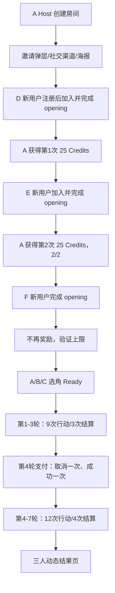

# Many Worlds MVP v1.4 P0 支付、邀请分享功能测试与三玩家七轮真实用户测试

> 文档状态：PLANNED
> 编制日期：2026-07-14
> 主验收世界：《嘉靖财政危局》
> 核心规模：3 个隔离浏览器玩家 × 7 轮 × 每轮 1 次真人行动；另加 3 个首次受邀用户验证 referral reward、重复与上限。
> 测试目标：证明支付和邀请不是孤立页面，而是真实插入已有注册、房间、七轮和结果流程，并在失败、刷新、重复回调和回原页面时保持幂等、安全和可恢复。

## 0. 不可替代原则

- 支付页截图不等于 Checkout、Webhook、入账、解锁和回房间通过。
- Checkout 200 不等于 Credits 已到账；只有签名 Webhook 和账本读回可确认。
- URL 出现 `paid=true` 不等于支付成功。
- Copy link 成功不等于邀请奖励；好友必须加入并完成 opening。
- share event 成功不允许直接发 Credits。
- 海报下载按钮存在不等于海报可用；必须验证 PNG、文字和真实 QR。
- 邀请中转能跳转不等于登录后恢复原房间。
- 单个浏览器完成不等于三名玩家状态同步。
- 原 v1.3 旧证据只作基线，不能替代本轮 RunId 的支付/邀请证据。
- 视觉接近不等于一比一；每个 P0 reference 必须有 actual/diff/metrics。

## 1. 测试分层

| 层级 | 覆盖内容 |
|---|---|
| UT | safe returnTo、display code、combined invite URL、share URL、状态映射、QR payload、奖励上限 |
| IT | Checkout service、Webhook、Credits ledger、unlock、referral bind/qualify/reward、DB 读回 |
| E2E | 支付页面点击、托管跳转 mock/test、状态恢复、邀请弹层、链接加入、海报下载 |
| VT | PAY-01—07、INVITE-01、POSTER-01 一比一视觉比较 |
| MP | 三玩家第 1—7 轮，支付门槛插入第 4 轮 |
| SP | 首次用户能否理解“分享不奖励、完成 opening 才奖励”和“支付后回原房间” |
| SEC | IDOR、open redirect、伪造状态、重复入账、重复奖励、密钥和隐私泄漏 |

## 2. RunId 与测试环境

每轮创建唯一 RunId，并记录源码 SHA、dirty digest、Web/API build、Supabase 脱敏指纹、Creem mode、浏览器版本、viewport、测试账号、purchaseId、checkoutId 脱敏值、房间 runId、ledgerId 和 evidence 目录。

| 环境 | 支付 | 数据库 | 允许动作 |
|---|---|---|---|
| unit | fake adapter | mock/transaction | 无外部网络 |
| local integration | mock checkout + signed fixture Webhook | 当前 Supabase 测试数据 | 可写 RunId 测试账号 |
| sandbox acceptance | Creem test mode，用户明确授权时才运行 | 当前 Supabase 测试数据 | 不产生真实扣费 |
| production | 本轮不执行 | 不写测试数据 | 只检查配置与路由 |

真实付款不是本轮验收条件，且默认禁止。Creem test mode 不可用时，mock Webhook 只能证明本地合同，最终结论必须明确支付供应商部分的限制，不能说真实付款通过。

## 3. 测试夹具

| Fixture ID | 内容 |
|---|---|
| FX-USER-001 | Host，40 Bonus Credits，房间成员 |
| FX-USER-002/003 | 两名核心玩家，独立 session |
| FX-USER-004 | 从未绑定 referral 的新用户 |
| FX-ROOM-001 | 《嘉靖财政危局》3 人房间，第 4 轮、未解锁 |
| FX-PAY-001 | credits_300，$7.99，purchase PENDING |
| FX-PAY-002 | 合法 checkout.completed Webhook |
| FX-PAY-003 | 非法签名、重复 event、错误 product/amount/currency |
| FX-PAY-004 | user returned unpaid / expired / checkout create error |
| FX-INV-001 | room inviteCode + Host referralCode |
| FX-INV-002 | rewardedCount=0/1/2 三种状态 |
| FX-POSTER-001 | 无字 1122×1402 海报背景、真实 combinedInviteUrl |
| FX-VISUAL-001 | 所有 P0 参考图固定状态 |

## 4. 功能测试总矩阵

### 4.1 支付上下文与安全

| ID | 测试点 | 通过条件 |
|---|---|---|
| FT-PAY-001 | unlock intent 创建 Checkout | 当前用户为成员，runId/returnTo 服务端保存 |
| FT-PAY-002 | safe returnTo | 只接受 `/room-game`、`/credits` 等白名单站内路径 |
| FT-PAY-003 | open redirect | `https://evil.example`、`//evil`、编码绕过全部拒绝 |
| FT-PAY-004 | 非成员 runId | 403/404，不创建 purchase |
| FT-PAY-005 | pack 校验 | 只有 credits_300/650；金额来自服务端配置 |
| FT-PAY-006 | display code | 可展示、稳定、不等于 DB 主键或 checkoutId |
| FT-PAY-007 | 订单归属 | 其他用户读取 status 返回 403/404 |
| FT-PAY-008 | metadata | 只含必要内部标识，不含 Token、密码、私密行动 |

### 4.2 PAY-01—PAY-03 页面与点击

| ID | 操作 | 通过条件 |
|---|---|---|
| FT-UI-PAY-001 | 第 4 轮进入 `/room-game` | 自动出现 PAY-01，显示 100/40/shortfall 60 |
| FT-UI-PAY-002 | Back to room | 关闭弹层但不能继续第 4 轮，不丢房间状态 |
| FT-UI-PAY-003 | Buy Credits | 进入带 runId/intent/safe returnTo 的 World Credits |
| FT-UI-PAY-004 | 钱包加载 | 显示 40 Bonus、0 Purchased、房间和轮次 |
| FT-UI-PAY-005 | 选择 300 | 只进入 PAY-03 confirm，不创建 Checkout |
| FT-UI-PAY-006 | confirm 返回 | 回 wallet，保留同一上下文 |
| FT-UI-PAY-007 | Continue 双击 | 只创建一个有效 purchase/checkout |
| FT-UI-PAY-008 | 第三方跳转 | 目标为服务端返回 checkoutUrl，不是本地假支付表单 |

### 4.3 PAY-04—PAY-07 状态与恢复

| ID | 状态 | 通过条件 |
|---|---|---|
| FT-STATUS-001 | processing | 显示套餐、display code、房间和轮次；不显示新余额 |
| FT-STATUS-002 | processing 刷新 | 继续同一 purchase，不创建新订单 |
| FT-STATUS-003 | paid | 只在服务端 PAID 后显示更新余额 |
| FT-STATUS-004 | returned unpaid | 显示 cancelled/未完成，余额与 ledger 不变 |
| FT-STATUS-005 | create error/expired | 显示 failed，Try Again 创建新尝试但保留旧记录 |
| FT-STATUS-006 | 查询 401 | 引导登录并安全恢复 purchase，不泄漏订单 |
| FT-STATUS-007 | 超时 | 保持 processing 或明确稍后刷新，不能自动标失败或再次购买 |
| FT-STATUS-008 | 浏览器后退/前进 | 状态来自服务端，不能在历史栈伪造 paid |

### 4.4 Webhook、余额和房间解锁

| ID | 测试点 | 通过条件 |
|---|---|---|
| FT-WEBHOOK-001 | 合法 completed | 300 Purchased Credits 只入账一次 |
| FT-WEBHOOK-002 | 重放 | 相同 event/purchase 幂等，余额不重复 |
| FT-WEBHOOK-003 | 非法签名 | 401，无 purchase/ledger 修改 |
| FT-WEBHOOK-004 | 错误金额/产品/币种 | 拒绝并记录安全错误，无 Credits |
| FT-UNLOCK-001 | paid 后 unlock | 扣 100，房间 accessLevel=UNLOCKED |
| FT-UNLOCK-002 | unlock 重试 | alreadyUnlocked，creditsCharged=0 |
| FT-UNLOCK-003 | 其他玩家刷新 | 同一房间立即可继续第 4 轮 |
| FT-UNLOCK-004 | 余额仍不足 | 不解锁，成功页展示真实不足状态 |
| FT-UNLOCK-005 | 回原房间 | 同 runId、同 round，不创建新房间或新局 |

### 4.5 邀请弹层和分享渠道

| ID | 测试点 | 通过条件 |
|---|---|---|
| FT-INV-001 | 打开 Invite Friends | 房间、3/6、Waiting、奖励规则、0/2 可见 |
| FT-INV-002 | WhatsApp | 预填文案与 combinedInviteUrl；记录 channel |
| FT-INV-003 | Telegram | 同上 |
| FT-INV-004 | Discord | 支持 Web Share/复制回退；记录 channel |
| FT-INV-005 | Facebook | 正确 share URL；记录 channel |
| FT-INV-006 | X | 正确 share URL 与编码；记录 channel |
| FT-INV-007 | Copy link | 剪贴板内容准确，显示 copied 提示 |
| FT-INV-008 | 分享不奖励 | 所有 share event `creditsGranted=0`，进度不变 |
| FT-INV-009 | 弹层关闭 | Escape/关闭按钮有效，焦点回 Invite Friends |
| FT-INV-010 | 失败回退 | popup 被阻止或 clipboard 失败时提供可理解回退 |

### 4.6 邀请链接、认证恢复和加入房间

| ID | 测试点 | 通过条件 |
|---|---|---|
| FT-JOIN-001 | combined URL | 同时包含合法 room 和 ref；不含原始用户 ID |
| FT-JOIN-002 | 未登录打开 | 去 `/auth`，登录后回 join 中转 |
| FT-JOIN-003 | referral bind | 新用户绑定一次；邀请人不能邀请自己 |
| FT-JOIN-004 | join-by-code | 加入正确 roomId 并进入等待页 |
| FT-JOIN-005 | 已加入重开 | 幂等进入原房间，不重复 StoryPlayer |
| FT-JOIN-006 | 无效/满/关闭/已开始 | 显示明确错误，无错误 DB 写入 |
| FT-JOIN-007 | 恶意 returnTo | 不能跳外站或访问他人 purchase/room |

### 4.7 奖励资格和进度

| ID | 测试点 | 通过条件 |
|---|---|---|
| FT-REF-001 | 只打开链接 | 不奖励 |
| FT-REF-002 | 注册但未加入 | 不奖励 |
| FT-REF-003 | 加入但未完成 opening | 不奖励 |
| FT-REF-004 | 完成 opening | 邀请人 +25 Bonus，rewardedCount 1 |
| FT-REF-005 | 重复完成/并发 qualify | 只一条 reward ledger |
| FT-REF-006 | 第二个合格用户 | +25，进度 2/2 |
| FT-REF-007 | 第三个合格用户 | status 可记录，Credits 不再增加 |
| FT-REF-008 | 自邀请 | 拒绝 |
| FT-REF-009 | 已绑定其他邀请人 | 不允许改绑 |
| FT-REF-010 | 进度回显 | 邀请弹层重新打开显示服务端最新 0/2—2/2 |

### 4.8 海报导出

| ID | 测试点 | 通过条件 |
|---|---|---|
| FT-POSTER-001 | 预览 | 与下载使用相同数据和背景 |
| FT-POSTER-002 | PNG | MIME image/png，尺寸 1080×1350 或批准的等比尺寸 |
| FT-POSTER-003 | 文件名 | 安全、可读、不含内部 ID |
| FT-POSTER-004 | QR 解码 | 精确等于 combinedInviteUrl |
| FT-POSTER-005 | 图片加载失败 | 不下载空白海报，显示 retry |
| FT-POSTER-006 | 隐私扫描 | 无 Host、玩家名单、余额、支付和私密角色信息 |
| FT-POSTER-007 | 文本溢出 | 长房间名有安全截断或换行，不遮挡 QR |

### 4.9 结果页和生产路由

| ID | 测试点 | 通过条件 |
|---|---|---|
| FT-RESULT-001 | Share Recap | 低权重展示，不打开未实现的公开分享流程 |
| FT-RESULT-002 | 原三操作 | Play Again/换角色/返回世界无回归 |
| FT-ROUTE-001 | 直接访问 | auth/world/rooms/room-game/result/credits/status/join 均不 404 |
| FT-ROUTE-002 | build 资产 | Logo、背景、头像、图标、海报底图均存在 |
| FT-ROUTE-003 | API base | 页面调用正确环境 API，无 localhost 退役端口回退 |

## 5. 视觉测试矩阵

| Visual ID | Route/State | Reference | Viewport | 关键断言 |
|---|---|---|---:|---|
| VT-PAY-001 | `/room-game` unlock modal | UI-PAY-01 | 1487×1058 | 遮罩、620px 卡片、100/40、主次按钮 |
| VT-PAY-002 | `/credits?intent=unlock` | UI-PAY-02 | 1487×1058 | Header、上下文 banner、余额、套餐、信任行 |
| VT-PAY-003 | credits confirm | UI-PAY-03 | 1486×1058 | 单摘要卡、外部跳转说明、回房间上下文 |
| VT-PAY-004 | processing | UI-PAY-04 | 1487×1058 | 蓝色状态、统一卡片、无新余额 |
| VT-PAY-005 | paid | UI-PAY-05 | 1487×1058 | 绿色状态、更新余额、Return to Room |
| VT-PAY-006 | cancelled | UI-PAY-06 | 1487×1058 | amber、余额未变、Try Again |
| VT-PAY-007 | failed | UI-PAY-07 | 1487×1058 | red、错误但不泄漏技术细节 |
| VT-INV-001 | room invite modal | UI-INVITE-01 | 1487×1058 | 980px modal、奖励卡、6 渠道、海报预览 |
| VT-POSTER-001 | downloaded poster | UI-POSTER-01 | 1122×1402 | 排版、背景、真实 QR 区域 |

每个 Visual ID 必须输出：

```text
reference.png
actual.png
diff.png
metrics.json
visual-summary.json
geometry.json
console-network.json
```

建议门槛沿用 v1.3：关键几何偏差 ≤2 CSS px；非动态内容区域 SSIM ≥0.985；changed pixel ratio ≤1.5%。支付金额、订单 display code、二维码等动态区可按 manifest 掩码，但其容器和排版仍参与比较。

### 5.1 全站路由和链接测试

路由真源为 `docs/Many_Worlds_MVP_v1.4_全站页面路由与多用户闭环流程.md`。除逐页视觉比较外，必须加入自动链接巡检：

| ID | 操作 | 通过条件 |
|---|---|---|
| VT-ROUTE-001 | 新浏览器直接访问全部规范 route | 无 404；受保护页面进入 auth 恢复链路 |
| VT-ROUTE-002 | 提取首页/Header/Footer 全部 href | 无 `#flow`、`#explore` 假链接、无用户可见 `.html` |
| VT-ROUTE-003 | 逐个点击 Hero、world、Create、Credits CTA | 到达表中唯一目标，浏览器 Back 可恢复 |
| VT-ROUTE-004 | 未登录点击 Rooms/Credits | 登录后回原目标，不统一落首页 |
| VT-ROUTE-005 | 直接打开 combined invite URL | 登录后自动加入并进入目标房间 |
| VT-ROUTE-006 | 支付四状态的所有按钮 | 成功回原房间；取消/失败可重试或返回，无死页 |
| VT-ROUTE-007 | Footer Legal | `/terms`、`/privacy`、`/refund` 均可直接访问 |
| VT-ROUTE-008 | 扫描点击无反应控件 | 没有假语言切换、假账户、假社交和空 Share Recap |

## 6. 三玩家七轮加邀请人的真实浏览器场景



### 6.1 角色与账号

| 浏览器 | 角色 | 本轮附加职责 |
|---|---|---|
| B1 Host | 浙江总督 | 发邀请、走支付、解锁房间 |
| B2 Player 2 | 浙江巡抚 | 通过房间邀请加入 |
| B3 Player 3 | 清流县令 | 通过房间邀请加入 |
| B4 Invitee D | 新用户/可选未占用角色 | 验证 combined link、auth returnTo、首次奖励 |
| B5 Invitee E | 第二个新用户 | 验证第二次奖励和 2/2 进度 |
| B6 Invitee F | 第三个新用户 | 验证超过 2 人后不再奖励 |

### 6.2 完整点击路径

1. B1 注册/登录，创建《嘉靖财政危局》房间并选角。
2. B1 点击 `Invite Friends`，记录 0/2，Copy link，确认奖励未变化。
3. B1 下载海报并自动解码 QR，QR 与复制链接相同。
4. B2/B3 使用房间链接加入、选角、Ready；B1 Start。
5. B4 使用 combined link，先认证，再自动加入原房间；完成 opening 后 B1 进度变 1/2、余额 +25。
6. B4 刷新并重复可达操作，证明不会重复奖励；B1 自己打开自己的链接也不得奖励。
7. B5 用全新账号重复邀请加入和 opening，B1 进度变 2/2、累计奖励 50。
8. B6 用第三个全新账号完成 opening，B1 仍为 2/2、余额不再增加。
9. B1/B2/B3 在 UI 完成第 1—3 轮，共 9 次真人行动、3 次唯一 resolution。
10. 第 4 轮三人看到锁定；B1 打开 PAY-01，进入 PAY-02，选择 300，进入 PAY-03。
11. B1 继续到 test/sandbox Checkout，先验证一次 returned unpaid → PAY-06 → Return to Room，确认仍锁定。
12. 第二次尝试先让 success 页面早于 Webhook，确认 PAY-04 不诱导重复购买；随后发送合法 test Webhook，进入 PAY-05。
13. B1 点击或等待自动 Return to Room；解锁 API 只扣 100，三人继续同一第 4 轮。
14. 另以独立 checkout fixture 覆盖创建失败/terminal failed → PAY-07 → Try Again，不污染成功订单。
15. B1/B2/B3 完成第 4—7 轮；总计 21 次真人行动、7 次唯一 resolution。
16. 三人进入动态结果页，验证 Share Recap 为展示级入口，其他三个操作正常。

### 6.3 每轮硬断言

- 三个核心 userId 各有且仅有一个 accepted action。
- 每轮只有一个权威 resolution。
- 第 4 轮支付前不能提交行动；支付解锁后可以提交。
- 购买、奖励和解锁不会改变角色、轮次或 runId。
- 其他玩家不能读取 Host purchase；Host 不能读取他人私密行动。
- 支付/邀请新增 UI 不改变现有叙事和角色投影合同。

### 6.4 最终计数断言

```text
core human players = 3
rounds = 7
accepted human actions = 21
authoritative resolutions = 7
paid purchase grants = 1
duplicate purchase grants = 0
world unlock spends = 1
duplicate world unlock spends = 0
share events >= 3
credits granted by share events = 0
qualified referrals >= 3
referral reward ledgers = 2
referral reward amount = 50
duplicate/self/capped referral reward amount = 0
poster QR decode success = 1
privacy violations = 0
runtime errors = 0
```

## 7. 故障注入

| ID | 注入 | 通过条件 |
|---|---|---|
| FI-PAY-001 | Continue 双击 | 单 purchase/checkout |
| FI-PAY-002 | success 跳转先于 Webhook | processing 等待，不重复购买 |
| FI-PAY-003 | Webhook 重放 | 单入账 |
| FI-PAY-004 | paid 页刷新 3 次 | 单 unlock spend |
| FI-PAY-005 | 恶意 paid query | 不显示 paid，不入账 |
| FI-PAY-006 | 用户从托管页返回 | cancelled/未完成，不改余额 |
| FI-PAY-007 | status 500/timeout | 保持可恢复，不丢 return context |
| FI-INV-001 | popup 被阻止 | 回退 copy，不发奖励 |
| FI-INV-002 | clipboard 拒绝 | 显示手动复制，不发奖励 |
| FI-INV-003 | 同一好友 qualify 并发 | 单 reward ledger |
| FI-INV-004 | 自邀请 | 拒绝 |
| FI-INV-005 | 海报背景加载失败 | 不下载空白 PNG |
| FI-INV-006 | QR 被替换为占位 | 解码测试失败，阻断 PASS |
| FI-ROUTE-001 | 恶意 `returnTo=https://evil.example` | 拒绝外跳并回 `/` |
| FI-ROUTE-002 | 邀请链接 room code 失效 | 到房间列表显示明确错误，可重新输入邀请码 |
| FI-ROUTE-003 | 用户从 auth 使用浏览器 Back/Forward | 不重复加入、不丢 returnTo、不形成循环 |
| FI-MP-001 | B2 第 4 轮刷新/断线重连 | 恢复同 run、同 round、同角色和提交状态 |
| FI-MP-002 | B1 双击 Resolve | 同一轮只有一个权威 resolution |
| FI-MP-003 | B/C 在 A 支付时尝试提交 | 明确等待解锁，不绕过门槛 |

## 8. 模拟玩家理解测试

每个首次用户回答：

```text
分享链接后会立即得到 Credits 吗？
好友要完成什么才算有效邀请？
最多奖励几名好友？
支付完成后会回到哪里？
Payment processing 时应该再次购买吗？
```

通过条件：每名用户 5 题至少 4 题正确；任何人认为“点击分享立即奖励”或“processing 应重复付款”，对应文案和信息架构必须修复。

## 9. 必须生成的未来执行报告

| 报告 | 必须内容 |
|---|---|
| UI/资产 manifest | UI hash/尺寸、pic/icon 对应、参考图完整性与新增图标 |
| 支付合同报告 | create/status/Webhook/returnTo/metadata/IDOR |
| 支付账本报告 | purchase、grant、balance、unlock spend、重复回调 |
| 邀请分享报告 | channel URL、share event、clipboard/popup fallback |
| referral 报告 | bind、qualify、reward cap、ledger readback |
| 海报报告 | PNG metadata、QR decode、隐私扫描 |
| 视觉报告 | 9 个 Visual ID 的 reference/actual/diff/metrics |
| 三玩家七轮报告 | 3 browser、21 actions、7 resolutions、支付插入点 |
| 邀请人 E2E 报告 | B4/B5/B6 auth returnTo、join、opening、重复/自邀请/上限、B1 奖励进度 |
| 全站路由报告 | 每个规范 route 的 direct access、所有 href/按钮目标、死链与恢复链路 |
| 安全报告 | open redirect、IDOR、伪造状态、密钥、真实扣费防护 |
| 最终聚合报告 | 同 RunId 证据、失败/阻塞/limitation 与 verdict |

## 10. 最终退出规则

只有以下全部满足才允许纯 PASS：

1. PAY-01—07、INVITE-01 和 POSTER-01 全部可由真实页面状态打开。
2. PAY-03 参考图已经补齐并通过一比一视觉比较。
3. Checkout、Webhook、余额、unlock 和回房间有 API、DB、浏览器三类证据。
4. 六个分享渠道与 Copy link/海报可用，分享本身不发奖励。
5. combined invite link 在未登录场景下能认证后回原房间。
6. D/E/F 验证首次 +25、第二次 +25、重复/自邀请/第三人 +0，累计最多 2 人。
7. 海报真实二维码可解码为当前 combinedInviteUrl。
8. 三个核心玩家仍完成 7 轮、21 次行动和 7 次唯一结算。
9. 所有 P0 UI 有真实 reference/actual/diff/metrics，无 material deviation。
10. 没有真实扣费、重复入账、重复扣点、重复奖励、隐私或密钥泄漏。

任一条件缺失都回到 `REPAIR_REQUIRED`；文档、截图、旧 PASS 或聊天结论不能替代证据。
