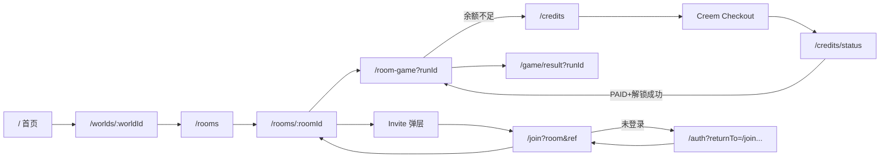
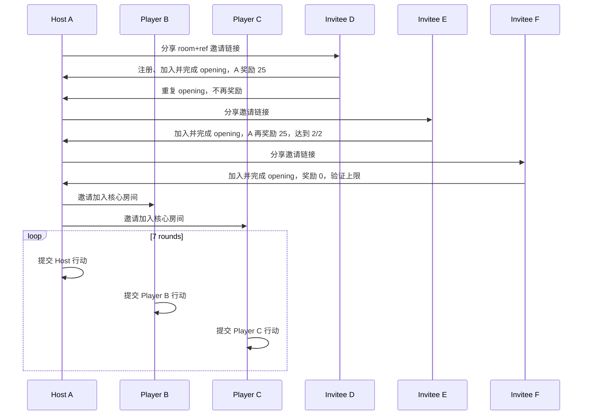

# Many Worlds MVP v1.4 P0 支付、邀请分享与海报完整流程开发步骤与验收步骤

> 文档状态：PLANNED
> 编制日期：2026-07-14
> 适用仓库：`D:\lyh\agent\agent-frame\aiStoryRoom`
> 目标版本：Many Worlds Web MVP v1.4
> 执行边界：本文只定义后续开发与验收，不代表页面和功能已经完成。
> 核心目标：在保留 v1.3 已有“注册/登录 → 房间 → 三玩家七轮 → 结果页”链路的基础上，补齐“余额不足 → 购买 World Credits → 支付确认 → 到账 → 返回原房间并幂等解锁”，以及“房间内邀请 → 社交平台分享 → 海报下载 → 好友加入并完成 opening → 邀请人获得奖励”的两个 P0 闭环。

## 0. 本轮产品边界

### 0.1 必须完成的 P0

1. 游戏第 4 轮余额不足时展示解锁弹层，不再只显示一个直接扣点按钮。
2. World Credits 页面带回房间上下文，支持选择 300/650 Credits 套餐。
3. 选择套餐后显示内部确认状态，再跳转 Creem 托管 Checkout；本项目不自建银行卡表单。
4. 支付处理中、成功、取消、失败共用一套状态页模板。
5. 支付成功后读取服务端到账结果，幂等执行房间解锁，并自动或一键返回原房间继续第 4 轮。
6. 房间等待页增加 `Invite Friends`，打开完整社交邀请弹层。
7. 邀请弹层包含奖励规则、奖励进度、WhatsApp、Telegram、Discord、Facebook、X、Copy link 和邀请海报下载。
8. 分享链接同时携带房间邀请信息和 referral code；未登录用户登录后自动加入原房间。
9. 好友只打开或只分享不发奖励；好友完成 opening 后邀请人获得 25 Bonus Credits；最多奖励 2 人；重复回调不重复发奖。
10. 生成可下载 PNG 邀请海报，真实二维码必须由真实邀请 URL 动态生成，不能把参考图中的假二维码直接用于产品。
11. 结果页增加低权重 `Share Recap` 展示入口。本轮不展开公开故事分享流程。
12. 新增页面、弹层与状态必须按 `docs/UI/web` 参考图一比一复刻，并复用现有背景、头像、Logo 和图标资产。

### 0.2 明确不做

```text
账户中心、订单历史、交易流水页面、订单详情、收据/发票
退款申请页面、退款进度页面、客服工单系统
公开故事回顾页、分享 Token、公开范围、撤销分享
独立邀请落地视觉页、好友关系、排行榜、邀请转化后台
房间聊天、语音、评论、观战
自建银行卡输入、在 Many Worlds 内嵌假支付网关
对《嘉靖财政危局》UI01—UI08 做视觉重构
```

`/join.html` 可以作为无视觉负担的中转入口复用，但不新增一张邀请落地设计图；用户应被自动送到 `/auth` 或目标房间。

## 1. 输入真源与冲突优先级

| 优先级 | 真源 | 用途 |
|---:|---|---|
| 1 | 本文与用户 2026-07-14 的最新范围指令 | 本轮 P0/P1 边界 |
| 2 | `docs/Many_Worlds_P0支付与分享_ChatGPT图片生成提示词_v1.0.md` | PAY-01—PAY-07、结果页展示入口 |
| 3 | `docs/Many_Worlds_社交邀请奖励与海报_ChatGPT图片生成提示词_v1.0.md` | 邀请渠道、奖励条件、邀请海报 |
| 4 | `docs/UI/web/*.png` | 页面和弹层视觉真源 |
| 5 | `docs/UI/web/pic/` | 背景和头像源资产 |
| 6 | `docs/UI/web/icon/many-worlds-icons-clean/` | 46 个透明紫色功能图标 |
| 7 | `docs/Many_Worlds_MVP_v1.3_完整流程开发步骤与验收步骤.md` | 开发、证据、失败修复格式 |
| 8 | `docs/Many_Worlds_MVP_v1.3_功能测试与三玩家七轮模拟测试.md` | 三玩家七轮回归与真实浏览器标准 |
| 9 | Creem Checkout 官方文档 | `success_url`、签名跳转参数、metadata、Webhook 合同 |
| 10 | `docs/Many_Worlds_MVP_v1.4_全站页面路由与多用户闭环流程.md` | 全站规范路由、首页链接、returnTo、多用户流程图 |

Creem 当前官方创建 Checkout 合同明确提供 `success_url` 和 metadata，未列出 `cancel_url`。因此取消状态不能假定第三方一定回调取消 URL；实现必须支持用户从托管页按浏览器返回后，由本地页面把“仍未支付的本次尝试”显示为取消/未完成状态，同时继续以 Webhook 和服务端订单状态作为到账唯一真源。

## 2. UI 参考图与页面复用

### 2.1 已有 P0 参考图

| UI ID | 原始文件 | 尺寸 | 页面/状态 | 复用目标 |
|---|---|---:|---|---|
| UI-PAY-01 | `docs/UI/web/MW-60_PAY-01_游戏内解锁提示.png` | 1487×1058 | 游戏内解锁门槛 | `/room-game` 中央弹层 |
| UI-PAY-02 | `docs/UI/web/MW-60_PAY-02_世界点数钱包.png` | 1487×1058 | World Credits | `/credits` 或 `credits.html` |
| UI-PAY-03 | `docs/UI/web/MW-60_PAY-03_确认购买.png` | 1486×1058 | Confirm your purchase | `/credits` 的 confirm 状态 |
| UI-PAY-04 | `docs/UI/web/MW-60_PAY-04_支付处理中.png` | 1487×1058 | Payment processing | 支付状态模板 |
| UI-PAY-05 | `docs/UI/web/MW-60_PAY-05_支付成功.png` | 1487×1058 | Payment confirmed | 支付状态模板 |
| UI-PAY-06 | `docs/UI/web/MW-60_PAY-06_支付取消.png` | 1487×1058 | Payment cancelled | 支付状态模板 |
| UI-PAY-07 | `docs/UI/web/MW-60_PAY-07_支付失败.png` | 1487×1058 | Payment failed | 支付状态模板 |
| UI-INVITE-01 | `docs/UI/web/MW-80_INVITE-01_社交分享与奖励.png` | 1448×1086 | 邀请奖励与社交分享弹层 | `/rooms/:roomId` 弹层 |
| UI-POSTER-01 | `docs/UI/web/MW-80_INVITE-02_邀请海报.png` | 1122×1402 | 完整邀请海报参考 | 下载 PNG |
| UI-POSTER-BG | `docs/UI/web/pic/ChatGPT Image 2026年7月14日 20_10_29.png` | 1122×1402 | 无文字海报背景 | 动态海报底图 |

### 2.2 复用状态，不需要新增参考图

| 状态 ID | 状态 | 处理方式 |
|---|---|---|
| UI-INVITE-02 | 复制链接后的确认状态 | 不新增页面；完全复用 UI-INVITE-01，只增加绿色 `Invitation link copied` 提示条和文案变化，可直接按规范实现 |
| UI-RESULT-SHARE | 结果页 `Share Recap` | 不新增页面；复用现有结果图，在底部动作区增加低权重文字按钮 |

UI-PAY-03 参考图已于 2026-07-14 补齐，实际尺寸为 1486×1058，SHA-256 为 `F1725E2F86AC7494507EB97E3A2A2D3419823910BE8235E22267D9C2FC14B8B9`。它现在是确认购买状态的正式视觉真源；这只解除“缺少参考图”的阻塞，不代表页面已开发或已通过一比一视觉比较。

### 2.3 资产复用规则

- `docs/UI/web/pic/` 现有 12 张背景和 15 张头像已经逐一复制到 `apps/web/public/assets/bg/` 与 `apps/web/public/assets/portrait/`，后续优先复用，不重新生成同类素材。
- `docs/UI/web/icon/many-worlds-icons-clean/png-128/` 用于普通导航、按钮和卡片；`png-256/` 用于高分屏大图标；`png-tight/` 只用于需要严格控制真实边界的地方。
- 支付页优先复用：`14-lock`、`15-check`、`17-user-role`、`24-share`、`30-unlock-pass`、`41-link`、`43-info`、`46-card`。
- 邀请页优先复用：`24-share`、`31-sparkle`、`32-x-twitter`、`35-discord`、`40-external-link`、`41-link`、`42-people-network`、`43-info`。
- 现有包缺少 WhatsApp、Telegram、Facebook 三个品牌图标；它们是本轮唯一必须新增的社交图标。状态勾、警告、错误、下载和关闭图标优先用 CSS/内联 SVG，不再增加图片文件。
- 运行时代码只引用稳定 assetKey 或稳定文件名，禁止硬编码 `ChatGPT Image 2026年...` 时间戳文件名。

## 3. 2026-07-14 当前实现扫描

### 3.1 已有并应复用

| 能力 | 当前实现 | 结论 |
|---|---|---|
| Credits 余额和账本 | `CreditsService` 支持 BONUS/PURCHASED、FIFO 消耗、幂等、退款与争议 | 复用 |
| Checkout 创建和状态 | `POST /api/v4/billing/checkouts`、`GET /api/v4/billing/checkouts/:checkoutId` | 复用并扩展上下文 |
| Creem Webhook | 签名验证、重复事件幂等、购买入账、退款/争议 | 复用 |
| 房间解锁 | `POST /api/v4/story-runs/:runId/unlock`，同 run 幂等 | 复用 |
| 邀请奖励 | referral code、share event、qualified referral、最多 2 次奖励 | 复用并接房间链接 |
| 房间邀请码 | `StoryRun.inviteCode`、`POST /api/v4/rooms/join-by-code` | 复用 |
| 真实房间与七轮 | `/rooms/:roomId`、`/room-game`、三浏览器七轮脚本 | 作为回归主链路 |
| 结果页 | `/game/result?runId=...` | 只增加展示级入口 |

### 3.2 当前断点

| GAP ID | 当前事实 | 必须修复 |
|---|---|---|
| GAP-PAY-001 | `/room-game` 余额不足时仍只有 `Unlock shared room` | 根据服务端短缺金额打开 UI-PAY-01；`Buy Credits` 带安全 return context |
| GAP-PAY-002 | `credits.html` 是简易纵向页面 | 一比一实现 UI-PAY-02，展示余额拆分、套餐和回房间上下文 |
| GAP-PAY-003 | 点击套餐直接创建 Checkout | 增加 PAY-03 内部确认状态，不新增银行卡表单 |
| GAP-PAY-004 | Checkout 只接收 packKey，successUrl 固定 | 服务端持久化 `runId/intent/returnTo/orderDisplayCode`，安全生成 success URL 和 metadata |
| GAP-PAY-005 | `credits-success.html` 只有 pending/paid 文案 | 建立 processing/paid/cancelled/failed 同模板状态页 |
| GAP-PAY-006 | 支付成功只能回钱包 | paid 后幂等调用 unlock，再回原 `/room-game?runId=...` |
| GAP-PAY-007 | 生产 rewrite 缺认证、房间、结果、支付路由 | 补 Vercel 路由并做直接访问 smoke |
| GAP-INV-001 | 等候页只复制短邀请码 | 改为 `Invite Friends`，打开 UI-INVITE-01 |
| GAP-INV-002 | referral inviteUrl 和 room inviteCode 分离 | 生成同时含 room 与 ref 的邀请链接 |
| GAP-INV-003 | 只有 Copy link，无平台渠道 | 增加五个社交渠道与 Copy link；记录 share event，始终 `creditsGranted=0` |
| GAP-INV-004 | 无海报导出和真实 QR | 使用无字底图 + DOM/Canvas 合成 + 真实 QR，下载 PNG |
| GAP-INV-005 | 奖励进度未在房间邀请 UI 展示 | 从 `GET /v4/referrals/me` 显示 0/2、1/2、2/2 |
| GAP-INV-006 | 结果页无 `Share Recap` | 增加低权重展示按钮，不实现公开分享 |

## 4. 目标产品状态机

### 4.1 支付闭环

```text
三名玩家完成第 1—3 轮
→ 第 4 轮服务端返回 WORLD_UNLOCK_REQUIRED、requiredCredits、balance、shortfall
→ /room-game 打开 PAY-01
→ 点击 Buy Credits
→ /credits?intent=unlock&runId=<runId>&returnTo=/room-game?runId=<runId>
→ GET balance + GET room context
→ 显示 PAY-02，选择套餐
→ 同容器进入 PAY-03 confirm 状态
→ Continue to secure payment
→ POST /api/v4/billing/checkouts { packKey, intent, runId, returnTo }
→ 服务端校验当前用户是房间成员、returnTo 为站内白名单，持久化购买上下文
→ 跳转 Creem 托管 Checkout
├─ 创建 Checkout 失败：PAY-07
├─ 用户浏览器返回且仍未支付：PAY-06 本地取消/未完成状态
└─ success_url 回站：PAY-04，轮询服务端订单
     ├─ Webhook 尚未到账：继续 processing，禁止重复购买提示
     ├─ PAID：PAY-05 → POST unlock（幂等）→ 返回原房间第 4 轮
     └─ terminal failure/expired：PAY-07 → Try Again 或 Return to Room
```

核心安全规则：

- URL 中的 `balance`、`credits`、`status`、`paid=true` 均不可信。
- 到账只由签名 Webhook 和服务端订单记录确认。
- returnTo 必须是站内允许路径；runId 必须验证成员关系。
- `POST unlock` 重复执行不能重复扣点；同一购买重复回调不能重复入账。
- PAID 后若 Credits 仍不足以解锁，停在成功页并提示余额不足，不得伪称房间已解锁。
- 用户返回原房间后重新读取服务端状态；浏览器缓存不是权威。

### 4.2 邀请、分享、加入和奖励闭环

```text
Host 在 /rooms/:roomId 点击 Invite Friends
→ 打开 INVITE-01
→ GET room summary + GET /v4/referrals/me
→ 生成 /join.html?room=<inviteCode>&ref=<referralCode>
→ 用户选择 WhatsApp / Telegram / Discord / Facebook / X / Copy link / Download poster
→ POST /v4/referrals/share-events { channel, runId }
→ creditsGranted 必须为 0
→ 被邀请者打开链接
├─ 未登录：/auth?returnTo=<安全的 join 中转>
└─ 已登录：bind referral → join-by-code → /rooms/:roomId
→ 被邀请者选择角色、Ready、完成 opening
→ 服务端 qualifyReferral
→ inviter 获得 25 Bonus Credits，最多 2 次
→ INVITE-01 下次打开显示 1/2 或 2/2
```

邀请奖励以 referral code 绑定到新用户，以房间 code 决定加入目标；两者职责不可混淆。自邀请、已绑定用户、同一被邀请者重复完成、超过 2 人和未完成 opening 均不得重复发奖。

### 4.3 全产品页面跳转闭环



规范路由只使用 `/credits`、`/credits/status` 和 `/join`；现有 `/credits.html`、`/credits-success.html`、`/join.html` 只作为实现载体或兼容重定向，不再出现在新页面链接中。完整按钮、回退、Header、Footer 和生产 rewrite 真源见 `docs/Many_Worlds_MVP_v1.4_全站页面路由与多用户闭环流程.md`。

当前首页必须同步清理：

| 当前问题 | P0 修复 |
|---|---|
| Header Help 指向不存在的 `/home#help` | 统一为 `/#faq` |
| Footer Pricing 指向不存在的 `#flow` | 统一为 `#pricing` |
| Terms、Privacy 等指向通用假锚点 | 改为 `/terms`、`/privacy`、`/refund` |
| About/Contact/Creators/Careers/Community/Status 无真实页面 | MVP 移除，不保留假链接 |
| 多处 Credits 指向 `/credits.html` | 统一为 `/credits` |
| 登录后 Profile 又跳登录页 | 已登录只提供昵称和 Sign out 小菜单，不新增账户页 |
| English 和社交图标无真实行为 | 没有实现就隐藏或降为不可点击文本 |

### 4.4 多用户真实参与闭环



A/B/C 必须使用三个隔离浏览器 context 完成七轮；D/E/F 必须是三个全新账号，用于验证被邀请、认证恢复、首次奖励、重复不奖励、第二奖励和达到上限。不能复用 token，也不能用 API 直接代替页面加入和 opening。

## 5. 数据与 API 增量合同

### 5.1 建议扩展 CreemPurchase

```text
intent              unlock | wallet_topup
returnTo            站内相对路径
runId               可空；unlock 时必填
orderDisplayCode    例如 MW-8F2A；不暴露数据库主键
clientExitState     none | returned_unpaid
lastStatusCheckedAt 可空
```

如果现有 `metadataJson` 已能可靠存储这些字段，可以不新增所有列，但必须可查询、可校验、可独立读回，不能只存在浏览器 URL。

### 5.2 Checkout 请求与响应

```json
{
  "packKey": "credits_300",
  "intent": "unlock",
  "runId": "story-run-id",
  "returnTo": "/room-game?runId=story-run-id"
}
```

响应增加：

```json
{
  "purchaseId": "internal-id",
  "checkoutId": "provider-id",
  "checkoutUrl": "https://checkout.creem.io/...",
  "orderDisplayCode": "MW-8F2A",
  "returnContext": {
    "runId": "story-run-id",
    "roomName": "Night Council",
    "round": 4,
    "returnTo": "/room-game?runId=story-run-id"
  }
}
```

### 5.3 Checkout 状态响应

除现有状态、credits、balance 外，必须返回服务端保存的 `orderDisplayCode` 和 `returnContext`。前端不得从查询参数拼接房间名、轮次或支付状态。

### 5.4 邀请上下文响应

邀请 UI 可以组合现有接口，也可以增加房间级聚合接口，但最终必须得到：

```text
roomId / roomName / worldTitle / playerCount / maxPlayers / status
roomInviteCode
referralCode / referralInviteUrl
rewardPerQualifiedInvite = 25
maxRewardedInvites = 2
rewardedCount / remainingRewardSlots
combinedInviteUrl
```

### 5.5 海报导出合同

- 输出 PNG；推荐 1080×1350，允许按参考图 1122×1402 先渲染后等比导出。
- 文件名：`many-worlds-night-council-invite.png`，房间名需安全清洗。
- 海报使用 `UI-POSTER-BG` 或确认后的背景 assetKey，不加载完整 UI 参考图。
- QR 内容必须是当前 `combinedInviteUrl`；用测试自动解码，证明不是占位二维码。
- 海报不得含 Host 姓名、原始邀请码、玩家名单、Credits 余额、支付数据或私密角色信息。

## 6. 开发阶段总表

| 顺序 | 阶段 | 主目标 | 主要产物 |
|---:|---|---|---|
| 00 | D00 接管与差距冻结 | 记录当前代码、UI、资产、路由和本轮范围 | gap matrix、RunId |
| 01 | D01 UI 与资产 manifest | 稳定 UI ID、hash、尺寸、assetKey | UI/asset manifest |
| 02 | D02 支付上下文合同 | 保存 runId/intent/returnTo/order display code | migration、API contract |
| 03 | D03 游戏解锁弹层 | 一比一实现 PAY-01 | 可操作 modal |
| 04 | D04 World Credits 与确认状态 | 一比一实现 PAY-02/PAY-03 | 钱包与 confirm state |
| 05 | D05 支付状态模板 | 一比一实现 PAY-04—07 | 单模板四状态 |
| 06 | D06 支付后回房间 | paid → 幂等 unlock → return | 完整支付恢复链路 |
| 07 | D07 房间邀请链接合同 | 合并 room code 与 referral code | combined invite URL |
| 08 | D08 社交邀请弹层 | 一比一实现 INVITE-01/02 | 社交分享 UI |
| 09 | D09 邀请海报 | 动态文字、真实 QR、PNG 下载 | POSTER-01 |
| 10 | D10 好友加入与奖励 | auth returnTo、join、qualify、进度回显 | referral E2E |
| 11 | D11 结果页展示入口 | 增加低权重 Share Recap | 结果页小改动 |
| 12 | D12 路由与部署准备 | 直接访问所有核心 route | Vercel rewrite/build |
| 13 | D13 自动测试与视觉收敛 | unit/integration/E2E/visual repair | evidence |
| 14 | D14 三玩家真实用户回归 | 支付和邀请插入七轮主流程 | 3 browser trace |
| 15 | D15 最终门禁 | fail-closed 聚合 | final verdict |

## 7. 详细开发步骤

### D00：接管、冻结范围与证据命名

1. 读取本文件、两个图片提示词文档、v1.3 两份执行文档和全部 P0 UI。
2. 记录 `git status`；当前工作区大量用户修改和未跟踪资产不得清理、覆盖或批量提交。
3. 创建本轮 RunId；未来截图、API、DB、Checkout mock、海报和三浏览器证据统一绑定该 RunId。
4. 明确本轮只改支付、邀请、结果入口、路由和必要公共资产；冻结无关游戏 UI。

### D01：UI、背景、头像与图标 manifest

1. 为 UI-PAY-01—07、UI-INVITE-01、UI-POSTER-01/BG 记录 SHA-256、尺寸、目标 route/state。
2. 为 `pic/` 与运行时 `assets/bg`、`assets/portrait` 建立一一对应表；保持当前 12 背景、15 头像的精确复用关系。
3. 读取图标 `manifest.json`，按稳定名称引用；补充 3 个缺少的社交品牌图标。
4. UI-PAY-03 已有正式参考图；实现后必须按其原生 1486×1058 尺寸生成 actual/diff/metrics，才允许进入视觉纯 PASS。
5. 参考图只能用于离线比较，产品运行时不得加载。

### D02：支付上下文与状态合同

1. 扩展 Checkout DTO、服务和购买记录，保存 intent、runId、returnTo、orderDisplayCode。
2. 服务端验证 unlock intent 的当前用户属于目标房间；拒绝未知 runId、非成员和外部 returnTo。
3. 把安全内部 ID 放入 Creem metadata；success URL 只指向统一状态页。
4. 状态查询只允许购买人读取，并返回服务端保存的 return context。
5. 保留 Webhook 作为入账唯一真源；跳转签名可验证但不能替代 Webhook 账本幂等。

### D03：PAY-01 游戏内解锁弹层

1. 复用 `/room-game` 和原游戏上下文，只新增中央弹层，不新建页面。
2. 显示 Required、Your balance、shortfall、免费轮次和“一人解锁全房间”。
3. 余额足够时主按钮可直接 `Unlock shared room`；余额不足时主按钮为 `Buy Credits`。
4. `Back to room` 关闭弹层但第 4 轮仍保持锁定，不丢失行动或房间状态。
5. 支付返回后重新请求 `/game` 状态，不从 localStorage 猜测已解锁。

### D04：PAY-02 World Credits 与 PAY-03 确认状态

1. 复用 `credits.html`，用 query/state 切换 wallet 与 confirm，不增加两个独立 HTML。
2. wallet 显示 Bonus/Purchased 拆分、当前房间、短缺金额和两个套餐。
3. 点击套餐只进入 confirm，不立即跳第三方。
4. confirm 显示套餐、价格、当前余额、预计余额、回到哪个房间和外部托管提示。
5. `Continue to secure payment` 才创建 Checkout；按钮提交期间禁用，避免重复创建。
6. `Back to World Credits` 恢复同一 runId/returnTo。

### D05：PAY-04—PAY-07 支付状态模板

1. 复用一套 HTML/CSS/JS 组件，状态只改变图标、色彩、标题、摘要和按钮。
2. processing 轮询服务端，支持刷新安全恢复；显示 orderDisplayCode，不显示 raw checkout ID。
3. paid 显示更新余额并准备返回房间。
4. cancelled 表示用户返回且本次尝试没有确认付款；不写 Credits、不伪造服务端 CANCELLED。
5. failed 用于 Checkout 创建失败、状态查询终止失败或 provider terminal/expired；展示安全重试。
6. 四状态都保留 return context；非购买人访问返回 403/404 UI。

### D06：支付成功后回原房间

1. paid 状态确认后调用幂等 unlock API。
2. unlock 成功后 1.5 秒自动返回原房间，同时保留立即返回主按钮。
3. 已解锁返回 `alreadyUnlocked=true` 时直接回房间，不重复扣费。
4. 若 webhook 延迟，保持 processing；禁止自动再次创建订单。
5. 若支付成功但套餐余额仍不足，显示真实余额和重新选择套餐入口，不宣称解锁成功。

### D07：合并房间邀请与 referral 链接

1. 生成 `join.html?room=<inviteCode>&ref=<referralCode>&channel=<channel>`。
2. `join.html` 只做参数白名单、session 判断和中转；没有独立产品视觉页。
3. 未登录时安全保存 returnTo；登录后先绑定 referral，再 join-by-code，再进入 `/rooms/:roomId`。
4. referral 已绑定、房间已加入时幂等继续；无效/满员/关闭/已开始显示现有平台错误状态。
5. 禁止把短房间 code 单独当作 referral code。

### D08：INVITE-01/02 社交邀请弹层

1. 在房间等待页用 `Invite Friends` 替换小型 Copy Code 模块，打开大弹层。
2. 显示房间摘要、奖励主卡、0/2—2/2 进度、规则说明、社交渠道和海报预览。
3. 各渠道使用标准 share URL 或 Web Share API；无法打开时回退 Copy link。
4. 每次分享记录 channel/runId，但 `creditsGranted` 必须为 0。
5. Copy link 后显示 INVITE-02 绿色提示，但奖励进度保持不变。
6. Escape、关闭按钮、焦点锁定和关闭后焦点恢复必须可用。

### D09：POSTER-01 动态海报

1. 使用无字背景 `UI-POSTER-BG`，叠加 Logo、世界名、房间名、邀请文案和真实 QR。
2. 复用同一 combinedInviteUrl；测试中解码 QR 与复制链接必须完全一致。
3. 下载前等待字体、Logo、背景和 QR 全部加载；失败时显示可重试错误，不下载空白文件。
4. 支持高 DPI 渲染，导出 PNG 后再按目标尺寸落盘。
5. 海报预览和下载内容必须一致。

### D10：好友加入、opening 和邀请奖励

1. 新用户通过 combinedInviteUrl 注册/登录并加入原房间。
2. onboarding 绑定 referral 只能成功一次；自邀请和已有 referral 用户拒绝。
3. 新用户完成 opening 后触发 qualify；奖励邀请人 25 Bonus Credits。
4. 两次合格邀请后进度 2/2；第三个合格邀请可记录但不发 Credits。
5. 重复 qualify、刷新、Webhook 重放和多 Worker 并发均只产生一条奖励 ledger。
6. 邀请弹层重新打开后必须读到最新进度和余额。

### D11：结果页 Share Recap 展示入口

1. 在现有结果页底部操作区增加分享图标和 `Share Recap` 低权重文字按钮。
2. 不新增弹层、URL、公开页、Token、二维码或可见范围设置。
3. 点击可以显示 `Sharing recap is coming next` 的非阻塞 toast，或按产品决定保持禁用并带解释；不得伪造已分享。
4. Play Again 仍为唯一主操作，原三按钮行为不变。

### D12：路由与部署准备

1. 为 `/auth`、`/worlds/:id`、`/rooms`、`/rooms/:id`、`/room-game`、`/game/result`、`/credits`、`/credits/status`、`/join.html` 补直接访问 rewrite。
2. build 后从 `apps/web/dist-vercel` 验证静态文件和资产路径。
3. 支付 success URL 使用 HTTPS 公开站点配置；本地/test 使用 Creem test mode 或 mock，禁止真实扣费。
4. 生产缺少凭证时只能判 deployment 子项未运行，不能伪称线上支付完成。

### D13：自动测试、视觉比较与修复循环

1. 扩展现有 Web、API、World Credits 和房间测试。
2. 每个 P0 UI 在固定 1487×1058、DPR=1、动画关闭、Inter 加载完成后截图。
3. POSTER 按 1122×1402 参考和 1080×1350 导出分别验证。
4. 每页输出 reference、actual、diff、metrics、summary、geometry、console/network。
5. 任一 material deviation 进入最小视觉 repair，再重新采集；不能只改比较阈值。

### D14：三玩家真实用户回归

1. 三个隔离浏览器注册/登录、建房、邀请加入、选角、Ready、Start。
2. 在分享弹层执行 Copy link、一个社交渠道和海报下载。
3. 使用第四个新账号打开 combinedInviteUrl，证明登录后回原房间；完成 opening 后邀请人奖励进度变为 1/2。
4. 三名核心玩家完成前 3 轮；第 4 轮 Host 余额不足，走完整 test/sandbox 支付 UI，到账后回房间并只解锁一次。
5. 三人继续完成第 4—7 轮和结果页；验证 `Share Recap` 仅展示，不影响重玩/返回。
6. 全流程禁止直接 API 代替玩家点击；API/DB 只用于独立读回。

### D15：最终收口

最终聚合只读取当前 RunId 的 durable evidence。任一 P0 UI 缺 actual/diff、任一支付/奖励写入缺 DB readback、任一回房间/加入房间流程缺浏览器 trace，最终都不得为纯 PASS。

## 8. 验收步骤

### A00：真源与资产验收

- 所有 UI 文件 UTF-8 路径可读，hash 和尺寸可复算。
- PAY-03 参考图存在、可解码，尺寸为 1486×1058，SHA-256 可复算；实现后的 actual/diff 尚需单独验收。
- 12 背景、15 头像、46 图标均有稳定 assetKey；新增只有 WhatsApp/Telegram/Facebook。
- 产品运行时网络请求不加载 UI reference。

### A01：支付合同验收

- Checkout 创建校验 pack、用户、runId、房间成员、intent 和 returnTo。
- 非成员、外部 returnTo、未知 pack、重复请求和他人订单全部稳定拒绝。
- purchase 独立读回包含上下文和 display code。
- Webhook 签名拒绝、重复合法回调幂等、退款/争议账本回归通过。

### A02：支付页面验收

- PAY-01—07 对应状态均可确定性打开。
- wallet 与 confirm 共用页面容器；四个结果状态共用状态模板。
- 第三方 Checkout 页面不由本项目伪造。
- processing 刷新不丢订单；cancelled/failed 不改变余额；paid 显示服务端余额。

### A03：支付回房间验收

- 从第 4 轮余额不足开始走完整 UI。
- test/sandbox 到账后回同一 runId 和同一 round。
- 只生成一次 PURCHASE ledger 和一次 WORLD_UNLOCK spend；重复返回、刷新、双击均不重复。
- 其他两名玩家刷新后看到同一房间已解锁。

### A04：邀请分享验收

- Invite Friends 打开弹层；奖励规则、0/2 进度和六个渠道可见。
- 每个渠道生成正确 URL；share event 的 channel/runId 正确；creditsGranted 永远为 0。
- Copy link 显示确认但奖励进度不变。
- 弹层可键盘操作，关闭后焦点回入口。

### A05：海报验收

- PNG 尺寸、MIME、文件名和内容正确。
- Logo、世界、房间、文案和二维码均存在且不溢出。
- QR 可解码为 combinedInviteUrl；不得是参考图中的占位码。
- 下载内容不含 Host、原始 code、余额、支付或私密信息。

### A06：邀请加入与奖励验收

- 新用户未登录时先认证，认证后自动回原房间。
- referral 绑定与 join-by-code 均成功且幂等。
- 只打开、只复制、只分享、加入但未完成 opening 均不奖励。
- 完成 opening 后邀请人 +25 Bonus Credits；重复完成不重复；第 3 人不超过上限。

### A07：结果页与原流程回归

- Share Recap 只为低权重展示入口，不出现公开分享功能。
- Play Again、Try Another Role、Back to Worlds 不回归。
- 《嘉靖财政危局》三玩家七轮、21 次行动、7 次唯一结算和动态结果页仍通过。

### A08：生产路由验收

- build 产物可直接访问全部 P0 route，刷新不 404。
- API base、PUBLIC_WEB_URL、Creem test/prod endpoint 与 Webhook URL 配置清楚。
- local/test 不真实扣款；production 未授权时不执行支付。

### A09：最终门禁

只有以下全部具备才允许 `Product Functional Verdict=PASS`：

```text
全部 P0 requirement 有实现任务和验证任务
PAY-01—07、INVITE-01、POSTER-01 有真实浏览器证据
PAY-03 参考图已补齐并完成一比一比较
支付 purchase/ledger/unlock 有 API transcript 和 Supabase 独立读回
邀请 share/bind/qualify/reward 有 API transcript 和 Supabase 独立读回
三玩家七轮完整回归通过
第四个被邀请用户的真实浏览器加入与奖励流程通过
没有真实扣费、密钥泄漏、伪造二维码或参考图作弊
失败数、阻塞数、未处理视觉偏差数均为 0
```

## 9. 失败处理

| 状态 | 使用条件 | 后续动作 |
|---|---|---|
| `REPAIR_REQUIRED` | 可由代码、CSS、合同、测试数据修复 | 最小修复并重跑目标与影响面 |
| `PASS_NEEDS_MANUAL_UI_REVIEW` | 功能有证据但缺真实 raster/diff | 补截图与视觉比较，不进入最终纯 PASS |
| `BLOCKED_BY_MISSING_SOURCE` | 任一必须参考图或资产后来缺失、损坏或不可解码 | 恢复真源后继续，禁止自行替代 |
| `BLOCKED_BY_ENVIRONMENT` | 本地浏览器、Supabase 或 test provider 在排障后仍不可用 | 记录脱敏错误、重试命令和唯一外部输入 |
| `HARD_FAIL` | 真实扣费、重复入账/扣点、IDOR、密钥泄漏、假二维码、reference-as-page | 停止发布，修复后全量回归 |

## 10. 最终完成定义

新用户必须能够独立完成：

```text
进入共享房间
→ 点击 Invite Friends
→ 选择社交平台或下载真实二维码海报
→ 好友通过链接登录并加入
→ 好友完成 opening 后邀请人获得可核验奖励
→ 三人开始游戏并完成前三轮
→ 第四轮余额不足
→ 选择套餐、确认、跳转托管支付
→ 支付状态可恢复
→ 到账后只解锁一次并返回原房间
→ 三人继续完成第七轮
→ 查看结果和低权重 Share Recap 展示入口
```

上述流程必须由真实浏览器、真实本地/test API、Supabase 独立读回和一比一视觉证据共同证明。只有页面截图、API 200、旧报告或 mock 文案都不构成完成。
