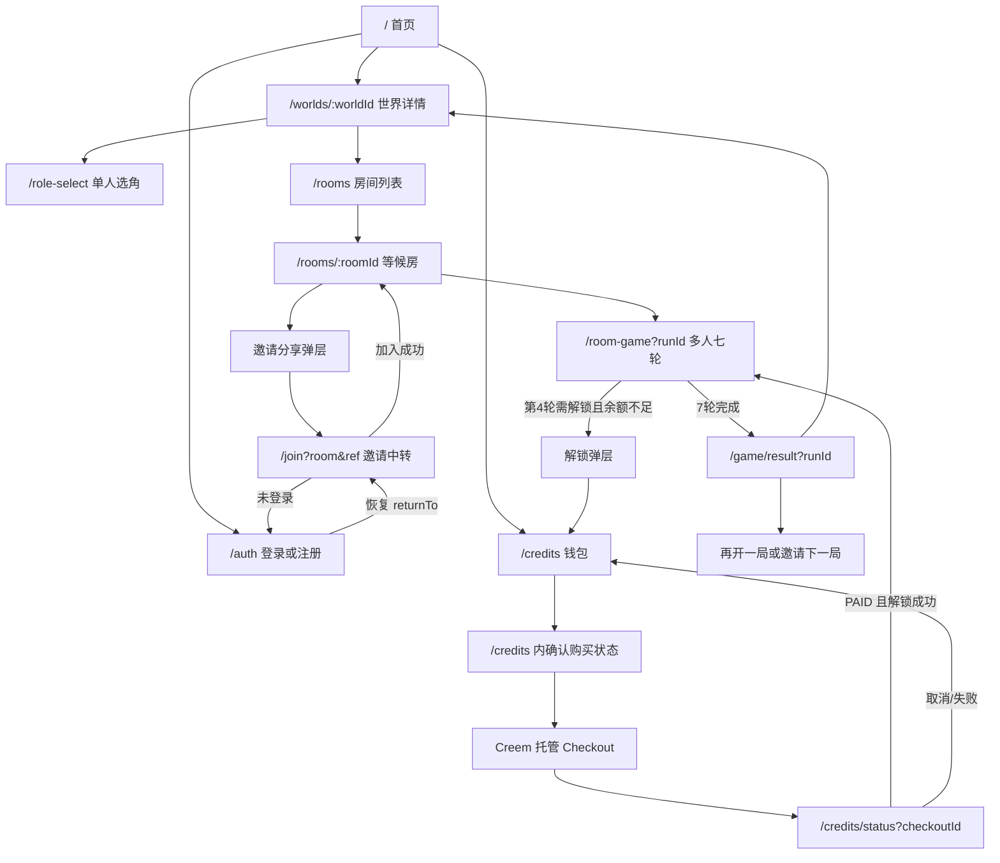
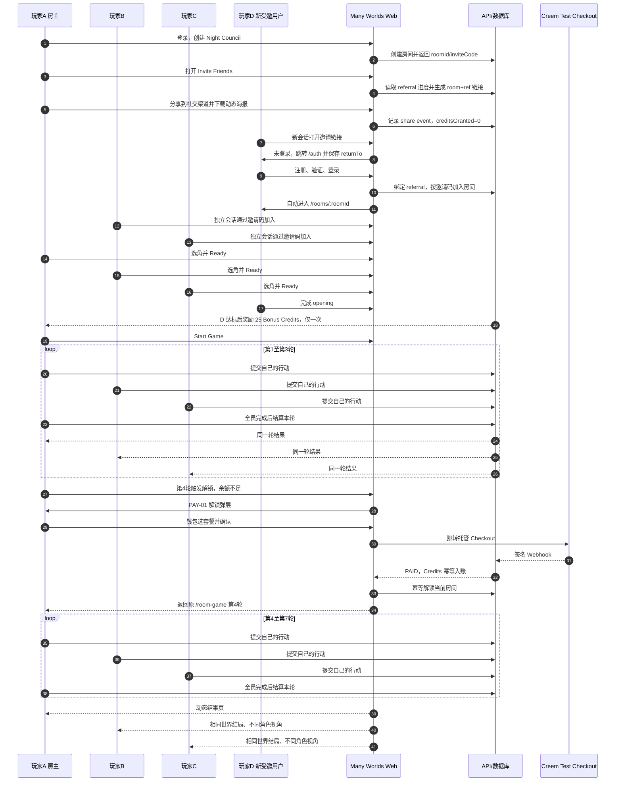
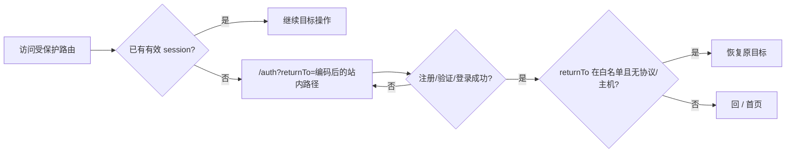
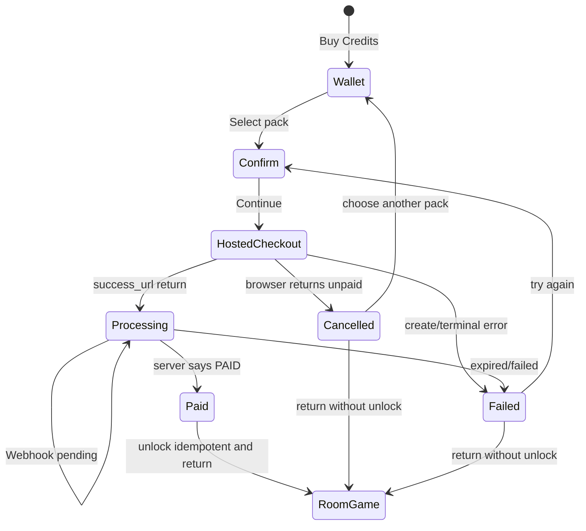
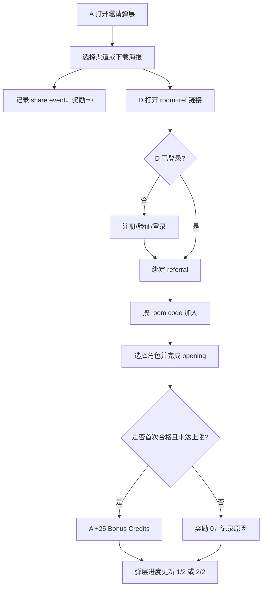

# Many Worlds MVP v1.4 全站页面路由、跳转与多用户闭环流程

> 文档状态：PLANNED
> 编制日期：2026-07-14
> 适用仓库：`D:\lyh\agent\agent-frame\aiStoryRoom`
> 用途：作为 v1.4 P0 开发、真实浏览器测试和最终验收的唯一页面跳转真源。
> 边界：只整理 MVP 必须可达的页面；不新增账户中心、订单历史、公开故事页或客服后台。

## 1. 路由整理结论

MVP 必须统一使用无 `.html` 的产品路由。HTML 文件只是实现载体，页面内不得继续出现 `/credits.html`、`/join.html`、`./credits.html` 等用户可见跳转。

```text
/                     首页唯一入口
/auth                 登录/注册/验证
/worlds/:worldId      世界详情
/rooms                房间列表
/join                 邀请中转，不新增独立视觉页
/rooms/:roomId        等候房、选角、Ready、邀请
/role-select          单人角色选择
/game                 单人游戏
/room-game            多人七轮游戏
/credits              钱包、套餐、确认购买
/credits/status       支付处理中/成功/取消/失败共用页面
/game/result          结局页
/privacy /terms /refund  法务页
```

`/home`、`/credits.html`、`/credits-success.html` 和 `/join.html` 只允许作为兼容入口，必须重定向到上述规范路由，不得成为新代码输出的链接。

## 2. 全产品主流程图



## 3. 多用户参与流程图



玩家 D 用于验证“被邀请、认证恢复、加入、opening、奖励”闭环；核心七轮固定由 A/B/C 完成，避免把邀请奖励测试与三角色七轮计数混在一起。另增第二名新用户 E 验证奖励从 1/2 到 2/2，再增 F 验证达到上限后不再奖励。

## 4. 规范页面路由表

| Route ID | 规范路由 | 页面/状态 | 登录要求 | 主要入口 | 成功出口 | 失败/返回出口 |
|---|---|---|---|---|---|---|
| ROUTE-HOME | `/` | 首页 | 否 | 域名、Logo | 世界详情、登录、房间、Credits | 原地锚点 |
| ROUTE-AUTH | `/auth?mode=<login|signup>&returnTo=<path>` | 登录/注册/验证 | 否 | Header、受保护路由 | 服务端校验后的 `returnTo` | `/` |
| ROUTE-WORLD | `/worlds/:worldId` | 世界详情 | 浏览可匿名 | 首页世界卡 | 单人选角、房间列表 | `/` |
| ROUTE-ROOMS | `/rooms?worldId=:worldId` | 房间列表 | 加入/创建时要求 | 世界详情、Header | `/rooms/:roomId` | `/worlds/:worldId` |
| ROUTE-JOIN | `/join?room=:inviteCode&ref=:referralCode` | 邀请中转 | 最终要求 | 社交链接、二维码 | `/rooms/:roomId` | `/rooms?joinError=<code>` |
| ROUTE-ROOM | `/rooms/:roomId` | 等候房、选角、Ready | 是且必须为成员 | 房间列表、邀请中转 | `/room-game?runId=:roomId` | `/rooms?worldId=:worldId` |
| ROUTE-SOLO-ROLE | `/role-select?story=:worldId` | 单人角色选择 | 是 | 世界详情 | `/game` 或 `/room-game` | `/worlds/:worldId` |
| ROUTE-SOLO-GAME | `/game?runId=:runId` | 单人游戏 | 是且有权限 | 单人选角 | `/game/result?runId=:runId` | `/role-select?story=:worldId` |
| ROUTE-MULTI-GAME | `/room-game?runId=:roomId` | 多人七轮 | 是且为成员 | 等候房 | 结果页或支付弹层 | `/rooms/:roomId` |
| ROUTE-CREDITS | `/credits?intent=:intent&runId=:runId&returnTo=:path` | 钱包/套餐/确认 | 是 | Header、解锁弹层 | 外部 Checkout | 经白名单验证的 returnTo 或 `/` |
| ROUTE-PAY-STATUS | `/credits/status?checkoutId=:id` | 处理中/成功/取消/失败 | 是且订单归属本人 | Creem 回站、浏览器恢复 | 原房间或钱包 | 钱包、原房间 |
| ROUTE-RESULT | `/game/result?runId=:runId` | 动态结局 | 是且为成员 | 游戏完成 | 再开一局、另一角色、返回世界 | `/rooms/:roomId` |
| ROUTE-LEGAL | `/privacy` `/terms` `/refund` | 法务 | 否 | Footer、Checkout 页 | `/` | `/` |

## 5. 全站 Header 跳转规则

所有平台页共用一套 Header，不得每页各写一套不同链接。

| 元素 | 未登录 | 已登录 | MVP 处理 |
|---|---|---|---|
| Many Worlds Logo | `/` | `/` | 永远回首页 |
| Explore Worlds | `/#worlds` | `/#worlds` | 首页锚点；不要固定只跳 Caesar 详情 |
| Rooms | `/auth?returnTo=%2Frooms` | `/rooms` | 保留 |
| World Credits | `/auth?returnTo=%2Fcredits` | `/credits` | 不再使用 `/credits.html` |
| Help | `/#faq` | `/#faq` | 当前代码的 `/home#help` 必须改掉 |
| English | 不显示或只显示不可点击文本 | 同左 | MVP 没有语言切换就不要放假链接 |
| Profile | `/auth?returnTo=<current>` | 打开只含昵称与 Sign out 的小菜单 | 不新增账户中心页 |

## 6. 首页链接清理表

### 6.1 Header 和 Hero

| 当前元素 | 当前目标 | 最终目标 | 处理 |
|---|---|---|---|
| Logo | `/` | `/` | 保留 |
| Explore Worlds | `#worlds` | `#worlds` | 保留 |
| Create | `#create` | `#create` | 保留，区块 CTA 再去 `/rooms?worldId=caesar` |
| How It Works | `#how-it-works` | `#how-it-works` | 保留 |
| Pricing | `#pricing` | `#pricing` | 保留 |
| FAQ | `#faq` | `#faq` | 保留 |
| Log in | `/auth?returnTo=%2F` | 同左 | 保留 |
| Get started | `/worlds/caesar` | `/worlds/caesar` | 保留 |
| See How It Works | `#how-it-works` | 同左 | 保留 |

### 6.2 内容区 CTA

| 文案 | 最终目标 | 规则 |
|---|---|---|
| Explore worlds | `/worlds/caesar` | 当前 MVP 只有可完整演示的 Caesar 平台流程时可保留 |
| Create a Room | `/rooms?worldId=caesar` | 未登录由房间页统一送 `/auth` 并恢复 |
| View World Credits | `/credits` | 未登录送 `/auth?returnTo=%2Fcredits` |
| Claim your bonus | `/credits#bonus` | 只触发现有 onboarding claim，不伪造到账 |
| Open a World | `/worlds/caesar` | 保留 |
| Buy World Credits | `/credits` | 不再使用 `.html` |
| View bonus rules | `/credits#invite` | 直接定位邀请规则模块 |

### 6.3 Footer 必须清理的死链

| 当前问题 | 最终处理 |
|---|---|
| Pricing 指向不存在的 `#flow` | 改为 `#pricing` |
| Terms/Privacy 指向 `#explore` | 改为 `/terms`、`/privacy` |
| Refund 未在主 Footer 明确出现 | 加 `/refund` |
| About/Contact/Creators/Careers 都指向同一假锚点 | MVP 直接移除，不做假链接 |
| Community/Status 没有真实目的地 | MVP 直接移除；有真实 URL 后再恢复 |
| 社交图标只是静态图形 | 有真实官方账号才做 `<a>`，否则隐藏 |
| Create 指向 `#worlds` | 改为 `#create` 或 `/rooms?worldId=caesar`，文案与目标一致 |

## 7. 各页面按钮与回退规则

| 页面 | 控件 | 目标/行为 | 必须保留的上下文 |
|---|---|---|---|
| Auth | 登录/注册成功 | `returnTo` | 仅允许站内白名单路径 |
| World | Play Solo | `/role-select?story=:worldId` | worldId |
| World | Play Multiplayer | `/rooms?worldId=:worldId` | worldId |
| Rooms | Join with Code | join API 后 `/rooms/:roomId` | inviteCode |
| Rooms | Create Room | create API 后 `/rooms/:roomId` | worldId |
| Room | Invite Friends | 原页打开 INVITE-01 弹层 | roomId、inviteCode、referralCode |
| Room | Ready | 原页更新 | roomId、roleId |
| Room | Start Game | `/room-game?runId=:roomId` | roomId |
| Room Game | Back to room | `/rooms/:roomId` | roomId |
| Room Game | Buy Credits | `/credits?...` | intent、runId、returnTo |
| Credits | 返回游戏 | 经校验的 returnTo | 不接受外站 URL |
| Credits | 选择套餐 | 原页切换到 Confirm 状态 | packKey、服务端房间摘要 |
| Confirm | Continue to secure payment | 服务端 checkoutUrl | purchaseId、checkoutId |
| Pay Processing | 自动轮询 | 同一状态模板 | checkoutId |
| Pay Success | Continue to game | 幂等 unlock 后 returnTo | 服务端 returnContext |
| Pay Cancelled | Choose another pack | `/credits` 并恢复原 intent | purchase attempt |
| Pay Failed | Try again | 新建 checkout，旧订单不复用 | packKey、returnContext |
| Result | Play Again | `/rooms?worldId=:worldId` | worldId |
| Result | Try Another Role | `/role-select?story=:worldId` | worldId |
| Result | Back to Worlds | `/worlds/:worldId` | worldId |
| Result | Share Recap | MVP 只显示“Coming after MVP”或隐藏 | 不打开空页面 |

## 8. 登录与 returnTo 恢复流程



白名单至少覆盖：`/worlds/`、`/rooms`、`/rooms/`、`/join`、`/role-select`、`/game`、`/room-game`、`/credits`、`/credits/status`、`/game/result`。拒绝 `//evil.example`、`https://...`、编码后外站、CRLF 和脚本协议。

## 9. 支付四分支跳转图



托管支付创建失败、用户主动返回、success 先于 Webhook、Webhook 重复、刷新成功页、开两个成功页、支付后余额仍不足，均必须有独立用例。

## 10. 邀请与奖励多用户分支图



至少用 D、E、F 三个新账号验证：D 首次奖励、D 重复不奖励、E 第二次奖励、F 超过 2 人上限不奖励；另测 A 自己打开自己的链接不奖励。

## 11. 多浏览器真实用户测试编排

| Browser | 用户 | 主要任务 | 隔离要求 |
|---|---|---|---|
| Browser-A | Host A | 建房、邀请、支付、每轮结算、查看结果 | 独立 profile/context |
| Browser-B | Player B | 邀请码加入、选角、7 次行动 | 独立 profile/context |
| Browser-C | Player C | 邀请码加入、选角、7 次行动 | 独立 profile/context |
| Browser-D | Invitee D | 社交链接注册、认证恢复、加入、完成 opening | 全新用户、无旧 storage |
| Browser-E | Invitee E | 第二个合格邀请奖励 | 全新用户、无旧 storage |
| Browser-F | Invitee F | 验证 2 人奖励上限 | 全新用户、无旧 storage |

执行要求：

1. A/B/C 不能共享 token、localStorage、cookie 或浏览器上下文。
2. D/E/F 每次必须是全新邮箱和空 storage；不能在数据库直接造“已完成 opening”。
3. 页面操作必须走可见 UI；脚本只可用于驱动点击、输入、等待和截图。
4. API 和数据库只能在操作后独立读回，不得替代页面操作。
5. 第 1—7 轮每轮保存 A/B/C 三个浏览器的提交状态和同一 resolutionId。
6. 支付只使用 Creem test/sandbox 或确定性本地 provider fixture，禁止真实扣款。
7. 每条失败分支结束后都要证明用户能回钱包或原房间，不留下死页。

## 12. 页面级直接访问与链接巡检

每次构建后执行两类检查：

1. 直接访问：对第 4 节每条规范路由使用新浏览器直接打开，确认不是 404，受保护页面能正确进入 auth 恢复链路。
2. 链接爬取：提取首页、Header、Footer、世界、房间、支付、结果页全部 `<a href>` 和按钮目标，逐一断言目标属于规范路由或真实外部托管支付域名。

禁止通过项：

- `href="#explore"` 被多个不相关文案复用；
- `/home#help`、`#flow` 等不存在锚点；
- 用户可见 `.html` 路径；
- 点击后无反馈的语言、账号、社交图标或 Share Recap；
- 受保护按钮把用户送到 auth 后丢失原页面；
- 支付成功后固定回钱包；
- 邀请注册后只到首页、没有自动加入目标房间。

## 13. 生产 rewrite 清单

`vercel.json` 或等价部署路由必须覆盖：

```text
/                         -> /home.html
/home                     -> 308 /
/auth                     -> /platform.html
/worlds/:worldId          -> /platform.html
/rooms                    -> /platform.html
/rooms/:roomId            -> /platform.html
/join                     -> /join.html
/role-select              -> /role-select.html
/game                     -> /index.html
/room-game                -> /room-game.html
/credits                  -> /credits.html
/credits/status           -> /credits-success.html 或统一支付状态 HTML
/game/result              -> /platform.html
/privacy /terms /refund   -> /legal.html
```

动态 route 必须在生产构建产物中存在，不能只在本地 `server.mjs` 可用。部署验收必须对这些 URL 做直接访问，不允许只从首页点击过去掩盖 rewrite 缺失。

## 14. 完成定义

只有同时满足下列条件，才可称“页面跳转和多用户流程闭环”：

- 所有首页/Header/Footer 死链已删除或改为真实目标；
- 所有规范路由直接访问有确定结果；
- 受保护路由登录后恢复原目标；
- A/B/C 三个隔离用户真实完成 7 轮、21 次行动、7 次唯一结算；
- A 的余额不足支付流程覆盖处理中、成功、取消、失败和延迟；
- 支付成功只入账一次、只解锁一次并回到原第 4 轮；
- D/E/F 验证邀请奖励第一次、第二次、重复、自邀请和上限；
- 动态海报二维码能由新会话加入正确房间；
- 每张新增/修改 UI 都有 reference、actual、diff 和人工视觉结论；
- 所有浏览器操作之后都有独立 API/数据库读回证据。
