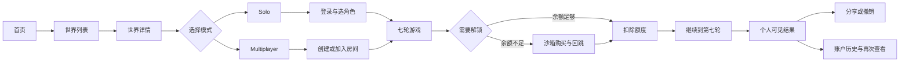
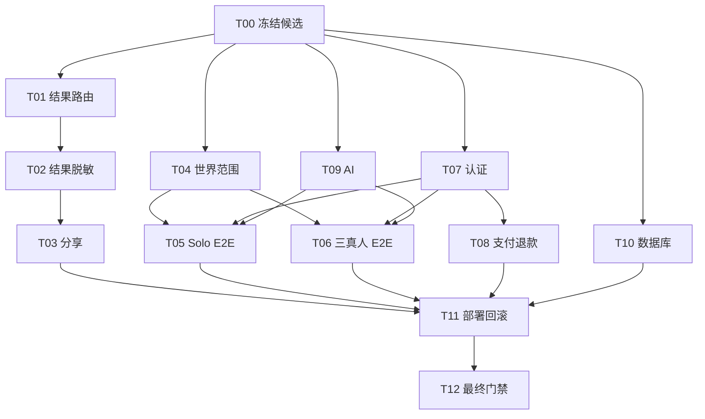

# Many Worlds 正式上线前未完成功能、完整开发步骤与验收方案 v1.0

> 文档性质：上线前差距审计、实施合同与最终验收门禁（PLANNED）  
> 审计日期：2026-07-17（Asia/Shanghai）  
> 目标：支持最早于 2026-07-18 发布一个可回滚、可验证的公开版本  
> 范围：Web、API、数据库、认证、AI、Solo、Multiplayer、支付、结果分享、部署与运维  
> 本文不代表功能已完成；只有本文定义的证据全部通过，状态才可改为 PASS。

---

## 0. 结论先行

### 0.1 当前上线结论

当前结论：**REPAIR_REQUIRED，不允许直接正式上线。**

仓库已有较完整的连续游戏后端、桑田诏七轮逻辑、多人掉线接管、恢复、支付与结果分享基础设施，但“已有接口/测试”不等于“真人从页面完整玩通”。截至本次审计，仍存在以下阻断事实：

1. 本地 `main` 提交为 `2ccbe90033896fd4b044c1b64d1963aba4ec0851`，线上 API 健康接口报告的版本为 `eaf5934b2847ecb976f2cc20381b1b43b0225eed`；同时本地工作树有大量已修改、删除和未跟踪文件。当前没有可唯一复现的上线候选版本。
2. Web 测试存在 2 个失败，且 `/game/result` 究竟应由 `platform.html` 还是旧 `index.html` 承载的契约互相冲突。
3. API 全量测试在结果分享 URL 断言处失败：测试预期 localhost，实际读取到了生产域名。说明环境隔离或测试契约尚未收口。
4. 最新完整三真人七轮浏览器证据 Run11 的总清单为 FAIL，原因是玩家结果页泄漏 `global_*`、`personal_*` 内部结局键。已有修复截图不能代替一次全新的通过运行。
5. Run12 只有进入页、房间列表和创建房间等前段截图，没有三真人完整七轮与结果闭环。
6. Solo 七轮现有主要证据是 API 脚本，不是用户在真实页面上的点击流程。
7. Caesar 仍是 `legacy_v1`，但页面把它展示为可玩的 Solo/Multiplayer 世界；“通用引擎已存在”不等于“Caesar 连续七轮内容已完成”。
8. 三方游戏零代码接入尚未形成 `game:new/build/validate/publish/smoke` 的仓库级标准命令与受保护文件零改动证明。
9. 认证、支付/退款、AI 提供商、迁移/回滚虽有代码和局部测试，但缺少冻结版本上的生产等价浏览器闭环。
10. 本次尝试启动桌面浏览器控制时，浏览器连接环境报错，未产生新的真人点击证据。该项必须在发布候选环境重新执行，不得用旧截图或直接 API 调用冒充。

### 0.2 明日上线建议范围

最安全、最可落地的范围是：**“桑田诏公开 Beta”，暂不把 Caesar 宣称为连续七轮正式可玩。**

- 桑田诏：保留 Solo 与 Multiplayer，但必须先完成本文所有 P0 门禁。
- Caesar：在完成连续策略内容、Solo 和三真人浏览器验收前，改为 Coming Soon 或从可玩入口隐藏。
- 其他世界：保持 Coming Soon，不得出现可进入但无法完成的半成品入口。
- `/trio`、旧 `room-game` 和带 mock 身份头的开发页面：不得成为生产用户入口。
- 支付：上线前只允许使用官方测试/沙箱环境验收；正式切换生产密钥必须是独立发布步骤。

如果坚持明日把 Caesar 同时正式上线，则必须把本文 P0-05B 的 Caesar 内容化与两种模式验收全部完成，不能只依赖通用后端能力。

---

## 1. 审计依据与证据可信度

### 1.1 事实源优先级

从高到低：

1. 冻结提交上的真实浏览器录像/截图、网络日志、控制台日志、API 与数据库回读。
2. 冻结提交上的自动化测试结果及其原始 JSON/JUnit 报告。
3. 当前代码、路由、数据库模型和游戏包配置。
4. 历史证据；只能证明当时版本，不自动证明当前版本。
5. 计划文档、人工描述和标记为 PASS 的表格；不能单独作为完成证据。

### 1.2 本次已核对的关键事实源

| 事实源 | 当前结果 | 说明 |
|---|---:|---|
| `pnpm --filter @apps/web test` | FAIL，89/91 通过 | `/game/result` 路由契约两处失败 |
| `pnpm --filter @apps/api test` | FAIL | 结果分享测试读取生产域名，套件提前终止 |
| `pnpm --filter @ai-story/templates test:games` | PASS，10/10 | 证明模板单测通过，不证明 Caesar 已内容化 |
| `pnpm test:continuous-mp:contracts` | PASS | 证明共享契约通过 |
| `pnpm test:continuous-manifest` | PASS，5/5 | 证明证据清单 fail-closed 逻辑可用 |
| Run11 三真人七轮浏览器清单 | FAIL | 结果页曾泄漏内部结局键 |
| Run12 浏览器目录 | INCOMPLETE | 只覆盖流程前段 |
| Solo 七轮脚本 | PARTIAL | API 级，不是页面级 |
| 线上 Web 首页 | HTTP 200 | 只证明站点可访问 |
| 线上 API `/api/health/ready` | ready | 只证明 API/DB/邮件就绪，不证明业务闭环 |

### 1.3 当前已经具备、可复用的能力

- 桑田诏七阶段、主行动、谋略行动、反应及阶段推进基础逻辑。
- 多人房间、角色选择、准备、开始、心跳、掉线接管、交接与认领接口。
- 结果计算、解锁、结果分享、账户历史、积分/额度、购买和退款基础模块。
- 旧端点拒绝、清单完整性、重启后房间恢复、房主/非房主掉线、全 AI 七轮等局部证据。
- 线上 API 健康检查、数据库连接和邮件提供商就绪信号。

这些能力属于“可以继续收口的基础”，不能因此把下述 P0 标为完成。

---

## 2. 上线前未完成功能总表

| ID | 优先级 | 未完成或未证明项 | 当前证据 | 上线完成定义 |
|---|---|---|---|---|
| P0-01 | P0 | 冻结唯一发布候选版本 | 本地脏工作树，Web/API 版本不一致 | 唯一 SHA；Web/API/迁移均可追溯到该 SHA；工作树意图明确 |
| P0-02 | P0 | 结果页路由契约统一 | Web 2 个测试失败且断言冲突 | 本地、Vercel、直接刷新、登录跳转均进入同一正式结果壳 |
| P0-03 | P0 | 结果投影与内部键脱敏 | Run11 清单 FAIL | 新运行中 UI、响应体、分享页均不出现内部键或隐藏字段 |
| P0-04 | P0 | 结果分享环境隔离 | API 测试拿到生产域名 | local/test/staging/prod URL 可控；分享、撤销、过期均通过 |
| P0-05A | P0 | 桑田诏 Solo 真人页面闭环 | 仅有 API 脚本 | 从首页点击到七轮结果、历史和重进均通过 |
| P0-05B | P0/范围 | Caesar 上线范围真实性 | `legacy_v1` 但 UI 显示可玩 | 明日推荐隐藏；若上线则连续内容及两种模式全通过 |
| P0-06 | P0 | 三真人 Multiplayer 七轮新鲜证据 | Run11 FAIL、Run12 不完整 | 三独立浏览器源完整七轮、隐私、掉线、结果闭环通过 |
| P0-07 | P0 | 生产等价认证闭环 | 健康接口仅显示邮件就绪 | 注册、验证、登录、Google、重置、退出、会话过期全部通过 |
| P0-08 | P0 | 支付/额度/退款闭环 | 主要是本地 mock/脚本证据 | 官方沙箱 UI 流程、Webhook 幂等、额度回读、退款审核通过 |
| P0-09 | P0 | 真实 AI 提供商与降级 | 规则/局部测试不能替代真实调用 | 正常、超时、限流、失败降级、成本和日志脱敏均有证据 |
| P0-10 | P0 | 迁移、备份、回滚演练 | 无冻结 SHA 上的完整演练 | 空库迁移、现有库迁移、备份恢复、应用回滚均通过 |
| P0-11 | P0 | 生产部署一致性与冒烟 | 线上版本落后/不同 | Vercel 与 Railway 同一候选；关键路由/API 冒烟通过 |
| P0-12 | P0 | 最终发布门禁 | 当前测试红、浏览器证据不完整 | 所有必需门禁 PASS，任何缺证据均 fail-closed |
| P1-01 | P1 | 三方游戏零代码接入 | 无标准五命令 | 新游戏包不改核心受保护文件即可生成、校验、发布和冒烟 |
| P1-02 | P1 | 通用静态资源与世界策略注册 | 服务端仍有桑田特例 | 资源、策略、世界演员均由游戏包声明驱动 |
| P1-03 | P1 | 可观测性和告警 | 健康检查已有，业务告警未证明 | 登录、支付、AI、回合推进、5xx 告警可演练 |
| P1-04 | P1 | 无障碍、移动端和兼容性 | 未形成冻结版本矩阵 | 核心流程在目标设备/浏览器通过基本可用性检查 |
| P1-05 | P1 | 法务、隐私、退款和支持入口 | 未见最终上线验收 | 页面可达、内容准确、联系方式和政策与支付行为一致 |

---

## 3. 上线目标用户流程

发布候选必须让一个第一次访问的真人按下列链路自然完成，不要求用户知道内部 URL、runId、token 或 API：



必须同时覆盖：刷新、重复点击、网络超时、会话过期、掉线重连、角色被占、重复支付 Webhook、分享链接撤销和直接访问深层路由。

---

## 4. 实施规则

### 4.1 统一产物约定

每个任务必须输出：

- 机器可读结果：`docs/auto-execute/results/launch-v1/<TASK_ID>.json`
- 人类交接：`docs/auto-execute/latest/launch-v1/<TASK_ID>-HANDOFF.md`
- 原始证据：`docs/auto-execute/evidence/launch-v1/<attemptId>/<TASK_ID>/`
- 结果字段至少包括：`taskId`、`commitSha`、`environment`、`startedAt`、`finishedAt`、`commands`、`checks`、`evidence`、`verdict`、`blockers`。

状态只允许：`PASS`、`FAIL`、`BLOCKED_BY_ENVIRONMENT`。没有文件、没有可回读数据、只说“应该可以”均为 FAIL。

### 4.2 保护与禁止规则

- 不得用 `page.evaluate(fetch(...))`、直接注入 Bearer token、直接改 localStorage、伪造 DOM 点击或手工改数据库来冒充真人 UI 通过。
- 不得把规则 AI 或 mock Webhook 的通过结果写成真实提供商/真实支付通过。
- 不得复用旧版本截图替代冻结 SHA 的新运行。
- 不得为了让测试变绿而同时保留两个互相冲突的路由真相。
- 不得把 Caesar 的通用后端兼容性写成 Caesar 连续七轮内容完成。
- 修复遇到的缺陷必须新增最小回归测试，并保留失败前与修复后的证据。

---

## 5. 一次性实施任务清单

### T00：冻结发布候选与版本追踪

**模板类型**：TPL-DEPLOY-ENV / TPL-RELEASE-RUNBOOK  
**依赖**：无  
**目标**：把明日上线对象固定为唯一可重建的 SHA。

实施要求：

1. 盘点全部已修改、删除和未跟踪文件，区分产品改动、证据、缓存和用户资料。
2. 只纳入本次上线所需产品改动；证据与大文件按仓库规则保留但不得污染构建。
3. 生成并展示 `git status --short`、`git diff --stat`、最终 SHA、构建产物版本信息。
4. Web `/version` 或构建元数据、API `/api/health` 必须可回读相同发布标识。
5. 后续所有任务的结果 JSON 必须绑定此 SHA；如果 SHA 改变，受影响门禁全部重跑。

验收命令基线：

```powershell
git status --short
git rev-parse HEAD
git rev-parse origin/main
pnpm install --frozen-lockfile
pnpm build
```

PASS：候选 SHA 唯一、依赖锁定、完整构建通过、产物可追踪。  
FAIL：仍依赖未提交源文件、Web/API 无法对齐版本、构建从本机缓存偶然通过。

### T01：统一 `/game/result` 路由和页面壳

**模板类型**：TPL-CONTRACT / TPL-REPAIR  
**依赖**：T00  
**目标**：本地、Vercel、前端导航、直接刷新和测试只有一个路由真相。

实施要求：

1. 确认正式结果页由 `platform.html` 承载，或选择另一个唯一壳；同步修正服务器、Vercel 重写和测试。
2. 验证 `/game/result?runId=...` 登录态与未登录态行为。
3. 验证直接刷新、浏览器前进后退、无效 runId、非本人 runId。
4. 删除或隔离会误导测试与用户的旧页面假设；不能只改正则。

最低验收：

```powershell
pnpm --filter @apps/web test
pnpm --filter @apps/web build
```

另需浏览器证据：状态码、最终 URL、页面标题、网络瀑布、控制台无错误。

### T02：结果投影、隐私与内部键脱敏

**模板类型**：TPL-SECURITY / TPL-REPAIR  
**依赖**：T00、T01  
**目标**：玩家只能看到允许公开的叙事与个人结果，不看到内部状态键或他人秘密。

实施要求：

1. 从 API DTO、服务层投影、Web 渲染、分享快照四层查找 `global_*`、`personal_*`、调试键和隐藏数值。
2. 内部 key 只能在受控日志或数据库内部使用；响应和 UI 只能显示本地化文案。
3. 为房主、普通玩家、观战/分享访问者分别做字段白名单测试。
4. 对 HTML、JSON、截图 OCR/文本转储执行敏感键扫描。

PASS：新建的一整局七轮及分享页扫描为 0；跨角色秘密不可见。  
FAIL：仅遮挡 CSS、仅修改截图、API 仍返回内部字段。

### T03：结果分享 URL、撤销和环境隔离

**模板类型**：TPL-CONTRACT / TPL-SECURITY  
**依赖**：T00、T01、T02  
**目标**：local/test/staging/prod 不串域名，分享生命周期正确。

实施要求：

1. 明确 public base URL 的唯一配置来源、默认值和缺失时 fail-fast 行为。
2. 单测不得读取开发者机器或生产环境的残留变量。
3. 覆盖创建、重复创建、匿名访问、过期、撤销、重新创建、非所有者撤销。
4. 分享页必须是不可变的安全快照或经过同一投影层，不得绕过 T02。

最低验收：

```powershell
pnpm --filter @apps/api test
```

PASS：API 全量套件完整执行完且退出码 0；四类环境 URL 精确匹配。

### T04：发布世界范围门禁

**模板类型**：TPL-BUSINESS-ENGINE  
**依赖**：T00  
**目标**：页面宣称与真实游戏能力完全一致。

明日推荐方案：

1. 桑田诏保持可玩。
2. Caesar 改为 Coming Soon 或隐藏 Solo/Multiplayer CTA。
3. 其他未完成世界保持不可进入。
4. 世界列表、详情、房间创建、Solo 创建和 API 都使用同一发布状态；不能只隐藏按钮而 API 仍公开创建。

若选择同时上线 Caesar，则必须额外完成：

- `engineVersion=continuous_strategy_v1_1`；
- 非空策略注册和世界演员声明；
- 七阶段内容、角色目标、行动、谋略、反应、叙事和结局投影；
- Caesar Solo 1+5 与 Multiplayer 3+3 浏览器门禁；
- 内容校验、确定性重放、隐私和支付解锁门禁。

PASS：前端/API/配置的 `playable` 真相一致；没有用户可进入的半成品世界。

### T05：Solo 真人页面闭环

**模板类型**：TPL-OWNER-E2E  
**依赖**：T01-T04、T07-T09  
**目标**：普通用户不借助开发工具完成一局七轮 Solo。

必须执行第 2 份测试方案中的 S00-S15：首次访问、登录、选世界、选角色、创建、七轮、解锁、结果、分享、账户历史、刷新恢复和错误分支。

PASS：视频/连续截图、网络日志、控制台日志、API 回读和数据库回读互相对应；没有直接 API 驱动步骤。

### T06：三真人 Multiplayer 七轮闭环

**模板类型**：TPL-OWNER-E2E  
**依赖**：T01-T04、T07-T09  
**目标**：三名真实账号、三份独立浏览器存储完成一局七轮。

必须执行第 2 份测试方案中的 M00-M24，包括邀请链接、三角色、准备、七轮、行动隐私、阶段同步、房主/非房主掉线、AI 接管、认领和结果页。

PASS：必须是新的运行 ID、新的 attemptId 和冻结 SHA；Run11/Run12 不能直接作为 PASS。

### T07：认证与身份生产等价闭环

**模板类型**：TPL-AUTH-IDENTITY / TPL-SECURITY  
**依赖**：T00  
**目标**：新用户和回访用户都能稳定进入游戏，身份边界正确。

覆盖：邮箱注册、验证链接、重复验证、密码登录、错误密码、忘记密码、重置、Google 登录、退出、刷新后会话、过期会话、跨标签页、受保护深链回跳。

安全门禁：cookie 属性、CSRF/Origin、重放、用户枚举、速率限制、日志脱敏。

### T08：购买、额度、解锁和退款闭环

**模板类型**：TPL-PAYMENT-ENTITLEMENT  
**依赖**：T00、T07  
**目标**：官方沙箱中的用户可从 UI 购买额度、回到原游戏、解锁并继续；退款可审计。

覆盖：

1. 余额不足触发购买页，成功/取消/失败回跳保留原 runId。
2. Webhook 签名、重复投递、乱序、延迟和失败重试。
3. 订单、账本、余额、解锁记录四方一致且操作幂等。
4. 退款申请、管理员审核、批准/拒绝、额度回收和历史记录。
5. 绝不在验收中产生真实扣费；生产密钥切换由发布负责人单独确认。

### T09：真实 AI 提供商和降级策略

**模板类型**：TPL-AI-PROVIDER  
**依赖**：T00  
**目标**：冻结版本对实际配置的 AI 提供商可用，并在失败时不破坏回合状态。

覆盖：成功生成、超时、429、5xx、无效 JSON、内容过滤、重试上限、规则降级、幂等和成本记录。日志不得包含密钥、完整用户秘密或不必要的提示词正文。

PASS：真实调用冒烟和故障注入均有证据；规则模式不得冒充真实调用。

### T10：数据库迁移、备份和恢复

**模板类型**：TPL-DEPLOY-ENV / TPL-RELEASE-RUNBOOK  
**依赖**：T00  
**目标**：迁移不会破坏现有用户、房间、购买和结果。

覆盖：全新数据库、生产结构副本、含进行中房间的数据副本、迁移重复执行、应用旧版本回滚、备份恢复与恢复后账本核对。

PASS：迁移前后关键表数量、唯一约束、账本总额、进行中 run 状态和分享记录核对一致。

### T11：部署、冒烟、监控和回滚演练

**模板类型**：TPL-DEPLOY-ENV / TPL-RELEASE-RUNBOOK  
**依赖**：T01-T10  
**目标**：把同一候选部署到生产等价环境，并证明可快速回退。

部署顺序：数据库备份 → 兼容性迁移 → API → Web → 健康检查 → 核心冒烟 → 开流量。  
回滚顺序：停止新建局/支付 → Web 回退 → API 回退 → 必要时应用前滚修复；禁止在未评估数据兼容性时盲目回滚数据库。

必须证明：

- Vercel 与 Railway 报告同一候选标识；
- `/`、`/worlds`、世界详情、`/auth`、`/game`、`/game/result`、`/account` 可直接刷新；
- `/api/health`、`/api/health/ready` 和一个无副作用业务探针通过；
- 登录、创建 Solo、创建/加入房间、分享页至少各有一次生产冒烟；
- 5xx、AI 失败、支付 Webhook 失败和数据库连接失败有告警去向；
- 回滚时间和恢复点满足发布负责人约定。

### T12：最终门禁与发布决策

**模板类型**：TPL-FINAL-GATE / TPL-REPORT-GUARD  
**依赖**：T00-T11  
**目标**：只依据机器证据做 GO/NO-GO。

门禁命令至少包括：

```powershell
pnpm lint
pnpm typecheck
pnpm build
pnpm --filter @apps/web test
pnpm --filter @apps/api test
pnpm --filter @ai-story/templates test:games
pnpm test:continuous-mp:contracts
pnpm test:continuous-manifest
```

最终报告必须列出所有命令、退出码、失败测试、浏览器 attemptId、三真人 runId、Solo runId、部署 URL、Web/API 版本、迁移 ID、支付沙箱订单号和回滚证据。

GO 的必要条件：

1. 所有 P0 结果为 PASS；
2. 没有被“已知问题”豁免的隐私、认证、支付、数据一致性或核心流程缺陷；
3. 新鲜 Solo 与三真人浏览器运行通过；
4. Web/API/DB 版本和证据绑定同一候选；
5. 回滚负责人、监控负责人和上线观察窗口已明确。

任一必要条件缺失即 NO-GO。

---

## 6. 推荐执行顺序与最短关键路径



如果只剩一天，不应靠减少证据来压缩时间。应通过缩小产品范围压缩：只上线桑田诏 Beta、隐藏 Caesar、暂不宣传未完整验证的能力。

---

## 7. 上线日 Runbook

### 上线前 4-2 小时

- 冻结候选 SHA 与数据库迁移。
- 全量测试和两套真人浏览器流程完成。
- 创建数据库备份并验证可读。
- 确认沙箱支付证据、生产密钥存在性和密钥权限，但不在日志打印值。
- 发布说明明确 Beta 范围和 Caesar 状态。

### 上线前 2-1 小时

- 按 T11 顺序部署。
- 执行生产只读健康检查与最小写入冒烟。
- 检查错误率、延迟、数据库连接池、AI 失败率和 Webhook 队列。
- 由非开发者账号完成一次首页到创建游戏的点击冒烟。

### 开放后 0-2 小时

- 观察注册、进入游戏、首轮提交、解锁、完成局和分享漏斗。
- 每 15 分钟检查 5xx、卡住回合、重复扣款和邮件失败。
- 触发任一回滚条件立即停止扩流：核心路由不可达、认证大面积失败、账本不一致、内部秘密泄漏、游戏无法推进、数据迁移异常。

### 回滚完成标准

- 用户可再次登录和访问账户；
- 新支付已停止或稳定；
- 进行中房间没有被无声丢弃；
- 账本和订单数量核对一致；
- 公告说明影响范围和后续处理；
- 保存故障时的日志、部署 ID 和数据库快照。

---

## 8. 文档质量审计

| 检查项 | 结果 |
|---|---:|
| 是否把已有后端基础与真人产品完成分开 | PASS |
| 是否区分桑田诏、Caesar 与三方游戏零代码接入 | PASS |
| 是否覆盖 Solo 和三真人 Multiplayer 全链路 | PASS |
| 是否覆盖认证、支付、AI、数据库、部署和回滚 | PASS |
| 是否为每项定义证据与 fail-closed 规则 | PASS |
| 是否把旧截图/API 脚本误判为当前 UI 完成 | PASS（未误判） |
| 当前产品是否可因此文档标记为上线完成 | **NO** |

本文当前状态保持 **PLANNED / REPAIR_REQUIRED**。只有 T00-T12 的冻结版本证据全部通过后，最终门禁报告才可把产品状态改为 PASS。
