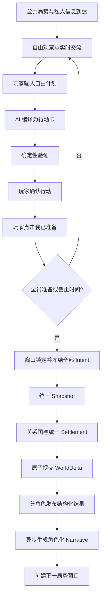
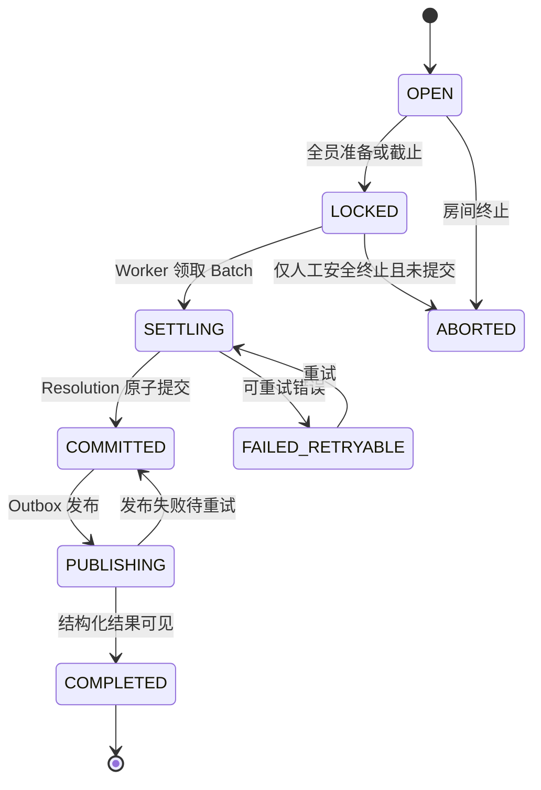
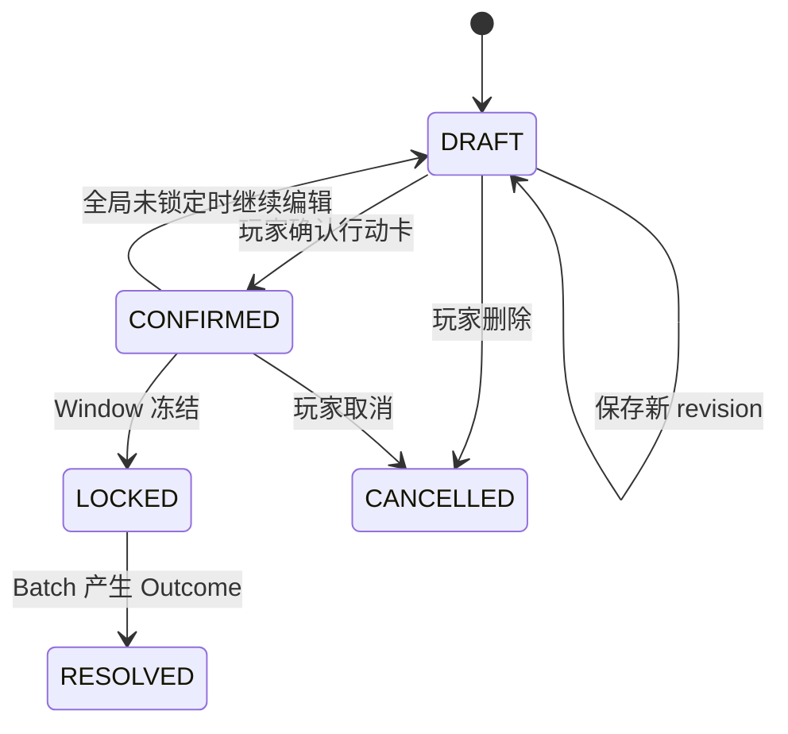

# Our Many Worlds：B0 同步结算多人博弈完整实施、测试与受控上线方案 v1.0

> 文档状态：可进入开发拆分与实施  
> 产品：Our Many Worlds  
> 仓库：`forwardFish/aiStoryRoom`  
> 首发世界：《凯撒：共和国最后的春天》  
> 首发模式：多人 `OPENOVEL_ROLE_V1`  
> 兼容模式：Solo `OPENOVEL_V1` 保持现有体验，但复用同一批量 Settlement 底座  
> 核心路线：**B 架构打底 → 单行动 Batch 打通权威链路 → B0 受控上线 → 基于真实房间数据逐步迭代**

---

## 目录

1. 执行结论
2. 产品目标与首发边界
3. B0 玩家体验与局势节拍
4. 总体技术架构与权威边界
5. 仓库模块落点与改动范围
6. 核心状态机
7. 核心数据合同
8. 数据库存储与约束
9. 完整端到端执行链路
10. 自由输入与行动合同编译
11. 多行动统一 Settlement
12. 原子提交、Outbox 与幂等
13. 可见性、知识边界与跨玩家影响
14. OpenNovel Runtime 与叙事生成
15. `/game` 页面对应设计
16. AI 角色、缺席玩家与截止策略
17. 异常恢复与降级策略
18. API、实时事件与错误码
19. Feature Flag、规则版本与兼容迁移
20. 可观测性与线上诊断控制台
21. 测试体系与对抗测试矩阵
22. 分阶段开发与发布路径
23. Alpha/Beta 产品验证方案
24. 上线后的数据驱动迭代规则
25. 安全、公平与运营门槛
26. 风险清单与缓解方案
27. 开发任务分解与依赖关系
28. 示例：三角色行动碰撞完整数据流
29. Definition of Done

---

# 1. 执行结论

## 1.1 最终路线

多人主玩法不先正式上线完整 A，也不等待完整 B 的所有高级能力完成。

采用以下唯一主路线：

```text
B 架构作为最终底座
        ↓
单行动 Batch 打通权威链路
        ↓
增加 SettlementWindow 与统一 Snapshot
        ↓
一个 Batch 同时承载所有玩家 Intent
        ↓
上线极度收敛的 B0
        ↓
邀请制 Alpha → 受控公开 Beta
        ↓
根据真实问题增加有限应变、简单延迟行动、正式承诺
```

## 1.2 为什么不是完整 A

生产级 A 仍然必须处理：

- 多人并发；
- `worldSequence` 冲突；
- 重复请求与幂等；
- 先提交者优势；
- 模型响应速度优势；
- 旧行动失效与重新执行；
- 可见性与跨玩家影响；
- 服务崩溃后的恢复。

如果 A 按“读取当前世界 → 单行动即时裁决 → 立即写世界”上线，后续切换为 B 时，需要重构权威写入模型，而不是简单增加倒计时。

更重要的是，A 无法有效验证产品最重要的假设：

> 多个真人玩家的计划基于同一世界状态同时碰撞，是否比多个玩家分别与 AI 互动更好玩。

## 1.3 为什么不是完整 B 后再上线

完整 B 还包括：

- 多层应变；
- 延迟行动；
- 复杂条件触发；
- 行动套行动；
- 长期异步世界；
- 中途控制权转移；
- 完整外交承诺系统；
- 多世界通用复杂关系图。

这些能力在没有真实玩家数据前很容易过度设计。首发只实现 B0 所必需的公平同步结算。

## 1.4 B0 成功的技术定义

B0 不是“页面上有倒计时”。B0 必须同时满足：

1. 同一局势窗口内所有主要行动共享同一个 `SettlementSnapshot`；
2. 所有行动进入同一个 `SettlementBatch`；
3. 一个窗口只产生一个合并后的 `WorldDelta`；
4. 一个窗口只进行一次原子世界提交；
5. 一个窗口只推进一次 `worldSequence`；
6. 改变 Intent 到达顺序，不改变权威 Resolution；
7. 每个角色只收到自己有权知道的结果；
8. Narrator 失败不影响世界事实、胜负与下一窗口。

## 1.5 B0 成功的产品定义

首发只验证一件事：

> 玩家能否明确感知“另一名真人玩家的某个行动，改变了我的处境、计划或结局”。

不是优先验证：

- AI 文笔是否足够长；
- 世界数量是否足够多；
- 玩家能否做任意无限行动；
- 是否拥有完整卡牌式反制系统；
- 是否能够长时间开放运行。

---

# 2. 产品目标与首发边界

## 2.1 首发产品承诺

> 每个玩家拥有不同目标、秘密和有限视角；玩家可以自由谈判、欺骗和交换信息；每个局势窗口只能提交一个主要计划；所有人的计划会基于同一个世界快照统一结算，并真实改变其他玩家面对的局势。

任何不能直接增强这段体验的功能，均不进入 B0。

## 2.2 B0 范围

| 项目 | B0 配置 |
|---|---|
| 首发世界 | 《凯撒：共和国最后的春天》 |
| 真人玩家 | 最少 2 人，最多 5 人 |
| 空缺角色 | 房间开始前由 AI 固定补位 |
| 局势窗口 | 默认 6 个，由 `RoomRuleset` 配置 |
| 总体验 | 目标约 30 分钟，具体节奏上线后迭代 |
| 每窗口主要行动 | 每个角色最多 1 个 |
| 交流 | 公共与私人交流实时开放 |
| 行动修改 | 全局锁定前允许 |
| 窗口关闭 | 全员准备或服务器截止时间到达 |
| 缺席处理 | 使用最后一个已确认 Intent；没有则 `HOLD` |
| 提交顺序 | 默认不产生优先级 |
| 行动关系 | `SUPPORTS / CONFLICTS / INDEPENDENT` |
| 结果 | 结构化结果先发布，Narrative 后补 |
| 淘汰 | 不允许玩家永久失去参与资格 |
| 房间规则 | 创建房间时冻结，整局不变化 |

## 2.3 B0 明确不做

- 多层应变链；
- 反应触发新的反应；
- 任意自然语言条件延迟事件；
- 中途加入；
- 人类角色中途转 AI 或 AI 转人类；
- 房主迁移；
- 排位、赛季、竞技积分；
- UGC 世界编辑器；
- 多世界同时首发；
- 复杂战斗地图；
- 大量装备、卡牌与技能组合；
- 语音识别与实时语音裁决；
- 同一房间中途切换规则版本；
- B 故障后静默降级为即时 A。

## 2.4 四类玩家操作的时间语义

| 玩家行为 | B0 时间模型 | 是否修改权威世界 |
|---|---|---:|
| 查看已知信息 | 即时 | 否 |
| 公共聊天、私聊、试探、撒谎 | 实时 | 否 |
| 普通消息中的口头承诺 | 实时 | 否 |
| 深度调查 | 作为主要 Intent，窗口统一结算 | 是 |
| 影响人物或群体 | 作为主要 Intent，窗口统一结算 | 是 |
| 调动、公开证据、阻断、保护等行动 | 作为主要 Intent，窗口统一结算 | 是 |
| 正式承诺 | B0 默认关闭；后续结构化进入 Settlement | 可能 |
| Narrative | 权威提交后异步生成 | 否 |

关键原则：

> 玩家交流可以开放，世界变化必须结构化；玩家体验可以没有传统“轮到谁”，世界因果必须存在明确结算边界。

---

# 3. B0 玩家体验与局势节拍

## 3.1 不使用传统“回合”表达

内部使用 `SettlementWindow`，玩家界面使用：

- 当前局势；
- 关键时刻；
- 决策窗口；
- 元老院会议开始前；
- 城门关闭前；
- 凯撒抵达前；
- 世界正在推演。

不显示：

- “第 3 回合”；
- “现在轮到你”；
- “结束回合”。

建议按钮：

- 编辑计划；
- 预览计划；
- 确认计划；
- 我已准备；
- 取消准备；
- 锁定计划。

## 3.2 单个局势窗口的完整体验



## 3.3 玩家结果展示顺序

结算完成后先显示：

```text
结果：部分成功

你想实现：
让西塞罗公开反对凯撒

实际发生：
西塞罗接受了你的私人立场，但拒绝公开表态

主要原因：
- 你提交的证据提高了他的怀疑
- 卡西乌斯的支持增强了你的说服力
- 安东尼的监视提高了公开表态风险

资源变化：
政治证据 -1

关系变化：
西塞罗对你的私人信任上升
安东尼对你的怀疑上升

下一步机会：
继续推动西塞罗，或先处理监视风险
```

随后再加载小说化叙事。

禁止用一段长 Narrative 替代结构化结果。

---

# 4. 总体技术架构与权威边界

## 4.1 总体分层

```text
apps/web
  ├─ 真实 /game 页面
  ├─ 公共/私人交流
  ├─ 行动草稿与预览
  ├─ 准备状态
  └─ 结构化结果与 Narrative 展示

API / Window Coordinator
  ├─ 创建窗口
  ├─ 管理截止时间
  ├─ 草稿/确认/准备接口
  ├─ 窗口冻结
  ├─ Snapshot 与 Batch 创建
  ├─ 原子提交协调
  └─ 恢复任务与 Outbox

packages/shared / contracts
  ├─ Window 合同
  ├─ ActionContract
  ├─ Snapshot
  ├─ SettlementResolution
  ├─ Typed Audience
  ├─ Causal Edge
  └─ RoomRuleset

Settlement Engine
  ├─ 引用与知识验证
  ├─ 关系图
  ├─ 硬约束
  ├─ 软冲突裁决
  ├─ WorldDelta 合并
  ├─ 因果链
  └─ Audience 规划

apps/openovel-runtime
  ├─ 消费已确认事实
  ├─ 按角色视角小说化
  ├─ 关键事实校验
  ├─ 幂等发布 Narrative
  └─ 不决定世界事实与胜负
```

## 4.2 权威边界

| 层 | 能否修改权威世界 | 说明 |
|---|---:|---|
| Web 客户端 | 否 | 只能发起请求和显示状态 |
| 自由输入解析模型 | 否 | 只生成 ActionContract 候选 |
| 推荐行动模型 | 否 | 只提供候选选项 |
| Settlement 规则与裁决器 | 生成候选 Resolution | 仍需验证与原子提交 |
| API Commit 事务 | 是 | 唯一最终确认入口 |
| World Event Log | 是 | 已提交后的最终事实记录 |
| Narrator | 否 | 只能表达已经确认的事实 |

## 4.3 单一 Settlement 引擎

禁止形成两套世界写入逻辑：

```ts
// 禁止
resolveImmediateAction();
resolveWindowedActions();
```

统一入口：

```ts
export interface SettleBatchInput {
  snapshot: SettlementSnapshot;
  intents: LockedIntent[];
  ruleset: RoomRuleset;
  dueSystemIntents: SystemIntent[];
}

export async function settleBatch(
  input: SettleBatchInput,
): Promise<SettlementResolution>;
```

Solo：

```ts
settleBatch({
  snapshot,
  intents: [singleIntent],
  ruleset,
  dueSystemIntents: [],
});
```

多人：

```ts
settleBatch({
  snapshot,
  intents: allLockedRoleIntents,
  ruleset,
  dueSystemIntents,
});
```

---

# 5. 仓库模块落点与改动范围

> 以下为建议落点。开发前先审计最新仓库结构；如果 API 服务实际目录不同，应映射到现有服务，不新建平行 API 或平行运行时。

## 5.1 建议模块映射

| 领域 | 建议目录 | 主要改动 |
|---|---|---|
| 公共合同 | `packages/shared/**` | 类型、Schema、错误码、Audience、Ruleset |
| Settlement 通用规则 | 现有 Settlement 所在包 | Batch 输入、关系图、Resolution、Delta 合并 |
| 世界包 | 现有 templates/world packages | 凯撒角色、目标、资源、行动能力与关系规则 |
| API / Coordinator | 现有 API 服务目录 | Window、Intent、Ready、Freeze、Commit、Outbox |
| 叙事运行时 | `apps/openovel-runtime/**` | 从 Canonical Facts 生成角色 Narrative |
| Web | `apps/web/**` | 复用真实 `/game` 页面接入 Window 状态 |
| E2E | `scripts/e2e/**` | 三角色真实浏览器测试 |
| Acceptance | `scripts/acceptance/**` | 不变量、恢复、灰度验收 |
| Evidence | `docs/auto-execute/evidence/**` | 每个里程碑证据与日志 |

## 5.2 页面硬约束

- 不新增测试专用页面；
- 不新增平行 OpenNovel 主游戏页；
- 不使用 toy HTML 或测试专用 DOM 控件证明功能；
- B0 状态必须映射到真实 `/game` 的现有剧情区、状态区、Options、自由输入与控制组件；
- 必要扩展应最小、视觉一致，并增加普通 Solo/V2 回归；
- E2E 必须启动并操作真实 `/game` 页面和真实 HTTP 链路。

## 5.3 世界无关约束

通用运行时和 Settlement Engine 不得写入：

- “凯撒”；
- “布鲁图斯”；
- “西塞罗”；
- 世界特定词法判断；
- 角色名分支；
- 某个世界专用的 `if/else`。

这些内容应存在于凯撒世界包中，通过结构化 ID、规则绑定和配置注入通用引擎。

---

# 6. 核心状态机

## 6.1 Window 状态机



允许状态转换必须由服务端显式校验。客户端不得自行修改状态。

## 6.2 Intent 状态机



规则：

- 每次编辑 `revision + 1`；
- 冻结时只读取每个角色最高且有效的 `CONFIRMED revision`；
- Window 进入 `LOCKED` 后，任何 Draft/Confirm/Cancel 请求必须拒绝；
- 同一角色每窗口只能有一个 `LOCKED` 主要 Intent。

## 6.3 Batch 状态机

```text
PREPARED
→ RESOLVING
→ RESOLVED
→ COMMITTING
→ COMMITTED
→ PUBLISHED
→ COMPLETED
```

异常：

```text
任意计算阶段 → FAILED_RETRYABLE
验证不可恢复 → FAILED_HARD
```

`FAILED_HARD` 不允许自动切换为即时 A；应暂停窗口并进入人工诊断或退款流程。

## 6.4 Narrative Job 状态机

```text
PENDING
→ GENERATING
→ VALIDATING
→ PUBLISHED
```

失败：

```text
GENERATING / VALIDATING
→ FAILED_RETRYABLE
→ GENERATING
```

Narrative Job 的状态不能回滚已提交世界。

---

# 7. 核心数据合同

以下类型为实现基线，可按仓库现有 Schema 工具转换为 Zod、JSON Schema、TypeScript 类型或数据库模型。

## 7.1 RoomRuleset

```ts
export type SettlementMode = "IMMEDIATE" | "WINDOWED";

export interface RoomRuleset {
  rulesetVersion: string;
  schemaVersion: number;

  settlementMode: SettlementMode;
  totalWindows: number;
  windowDurationSeconds: number;

  maxHumanPlayers: number;
  maxPrimaryIntentsPerActor: 1;

  readyPolicy: "ALL_READY_OR_DEADLINE";
  missingIntentPolicy: "LAST_CONFIRMED_OR_HOLD";

  supportedRelations: readonly [
    "SUPPORTS",
    "CONFLICTS",
    "INDEPENDENT",
  ];

  reactionDepth: 0;
  playerAuthoredDelayedEffects: "DISABLED" | "NEXT_WINDOW_ONLY";
  structuredCommitmentsEnabled: false;

  allowMidGameJoin: false;
  allowRoleTransfer: false;
  allowHumanToAiTransfer: false;

  aiFillEnabled: true;
  structuredResultRequired: true;
  narrativeFailurePolicy: "CONTINUE_WITH_STRUCTURED_RESULT";
}
```

规则版本在创建房间时写入并冻结，整局不得变化。

## 7.2 SettlementWindow

```ts
export type WindowStatus =
  | "OPEN"
  | "LOCKED"
  | "SETTLING"
  | "COMMITTED"
  | "PUBLISHING"
  | "COMPLETED"
  | "FAILED_RETRYABLE"
  | "FAILED_HARD"
  | "ABORTED";

export interface SettlementWindow {
  id: string;
  roomId: string;
  runId: string;

  mode: SettlementMode;
  ordinal: number;
  situationId: string;

  baseWorldSequence: number;
  expectedActorIds: string[];
  readyActorIds: string[];

  openedAt: string;
  locksAt: string | null;
  lockedAt: string | null;
  committedAt: string | null;
  completedAt: string | null;

  status: WindowStatus;
  lockReason: "ALL_READY" | "DEADLINE" | "IMMEDIATE" | null;

  rulesetVersion: string;
  schemaVersion: number;
}
```

## 7.3 ActionContract

```ts
export type IntentKind =
  | "OBSERVE"
  | "INFLUENCE"
  | "ACT"
  | "HOLD";

export type TargetRef = {
  type:
    | "ACTOR"
    | "GROUP"
    | "LOCATION"
    | "RESOURCE"
    | "PROPOSITION"
    | "EVIDENCE"
    | "CAPABILITY";
  id: string;
};

export type EffectDirection =
  | "INCREASE"
  | "DECREASE"
  | "CREATE"
  | "BLOCK"
  | "PROTECT"
  | "REVEAL"
  | "CONCEAL"
  | "MOVE"
  | "TRANSFER"
  | "VERIFY";

export interface ActionContract {
  id: string;
  windowId: string;
  roomId: string;
  runId: string;
  actorId: string;

  revision: number;
  kind: IntentKind;

  rawPlayerText: string;
  normalizedSummary: string;

  targetRefs: TargetRef[];

  primaryEffect: {
    effectTypeId: string;
    direction: EffectDirection;
    requestedMagnitude: "MINOR" | "MODERATE" | "MAJOR";
  };

  method: {
    methodTypeId: string;
    description: string;
  };

  resourceCommitments: Array<{
    resourceId: string;
    amount: number;
  }>;

  evidenceRefs: string[];
  capabilityRefs: string[];
  propositionRefs: string[];

  visibilityIntent: {
    type: "PUBLIC" | "PRIVATE" | "COVERT" | "CONDITIONAL";
    declaredRecipientRefs?: string[];
  };

  reactionPolicy: "NONE" | "IF_PUBLIC" | "IF_OBSERVED";

  requestedTiming: "CURRENT_WINDOW";
  riskTags: string[];

  compilerVersion: string;
  validationVersion: string;
  clientRequestId: string;

  status: "DRAFT" | "CONFIRMED" | "LOCKED" | "RESOLVED" | "CANCELLED";

  createdAt: string;
  updatedAt: string;
  confirmedAt: string | null;
  lockedAt: string | null;
}
```

硬规则：

- `createdAt`、`updatedAt`、`confirmedAt`、`lockedAt` 默认不参与胜负计算；
- 原始文本不是权威合同；
- 只有结构化字段进入 Settlement；
- 引用必须能够在当前 Snapshot 与角色知识中解析；
- 未知字段 fail-closed；
- 资源在确认时预检，冻结与提交时再次校验；
- 资源只在 Commit 时扣除一次。

## 7.4 SettlementSnapshot

```ts
export interface SettlementSnapshot {
  id: string;
  windowId: string;
  roomId: string;
  runId: string;

  baseWorldSequence: number;
  rulesetVersion: string;
  schemaVersion: number;

  worldState: unknown;
  actorStates: unknown[];
  roleBindings: unknown[];
  knowledgeState: unknown;
  relationshipState: unknown;
  resourceState: unknown;
  activeCapabilities: unknown[];
  dueSystemIntents: unknown[];

  worldStateHash: string;
  roleSetHash: string;
  knowledgeStateHash: string;
  relationshipStateHash: string;
  rulesetHash: string;

  createdAt: string;
}
```

Snapshot 必须绑定：

- `roomId`；
- `runId`；
- `windowId`；
- `baseWorldSequence`；
- `rulesetVersion`。

禁止使用没有运行上下文的通用快照。

## 7.5 SettlementBatch

```ts
export type BatchStatus =
  | "PREPARED"
  | "RESOLVING"
  | "RESOLVED"
  | "COMMITTING"
  | "COMMITTED"
  | "PUBLISHED"
  | "COMPLETED"
  | "FAILED_RETRYABLE"
  | "FAILED_HARD";

export interface SettlementBatch {
  id: string;
  windowId: string;
  snapshotId: string;
  roomId: string;
  runId: string;

  baseWorldSequence: number;
  lockedIntentIds: string[];
  dueSystemIntentIds: string[];

  status: BatchStatus;
  attempt: number;

  inputHash: string;
  relationGraphHash: string | null;
  resolutionHash: string | null;

  createdAt: string;
  resolvedAt: string | null;
  committedAt: string | null;
  completedAt: string | null;
}
```

## 7.6 IntentRelation

```ts
export type IntentRelationType =
  | "SUPPORTS"
  | "CONFLICTS"
  | "INDEPENDENT";

export interface IntentRelation {
  id: string;
  batchId: string;

  leftIntentId: string;
  rightIntentId: string;
  type: IntentRelationType;

  basis:
    | "TARGET_OVERLAP"
    | "PROPOSITION_OPPOSITION"
    | "RESOURCE_CONTENTION"
    | "LOCATION_CONTENTION"
    | "PROTECT_VS_HARM"
    | "REVEAL_VS_CONCEAL"
    | "CAPABILITY_RULE"
    | "WORLD_RULE"
    | "MODEL_ASSISTED";

  confidence: number;
  classifierVersion: string;
  evidenceRefs: string[];
}
```

关系对必须按稳定 ID 排序后分类：

```ts
const [left, right] = [intentA, intentB]
  .sort((a, b) => a.id.localeCompare(b.id));
```

不能因输入数组顺序产生不同结果。

## 7.7 SettlementResolution

```ts
export interface SettlementResolution {
  batchId: string;
  roomId: string;
  runId: string;
  windowId: string;
  baseWorldSequence: number;

  intentRelations: IntentRelation[];
  conflictGroups: ConflictGroup[];
  intentOutcomes: IntentOutcome[];

  worldDelta: WorldDelta;
  resourceMutations: ResourceMutation[];
  relationshipMutations: RelationshipMutation[];
  capabilityMutations: CapabilityMutation[];

  canonicalEvents: CanonicalWorldEvent[];
  observableTraces: ObservableTrace[];
  knowledgeGrants: KnowledgeGrant[];
  playerOutcomes: PlayerOutcome[];
  pendingEffects: PendingEffect[];
  causalEdges: CausalEdge[];

  resolutionVersion: string;
  resolutionHash: string;
}
```

## 7.8 CausalEdge

```ts
export interface CausalEdge {
  id: string;
  batchId: string;

  from:
    | { type: "INTENT"; id: string }
    | { type: "RESOURCE"; id: string }
    | { type: "CAPABILITY"; id: string }
    | { type: "WORLD_FACT"; id: string }
    | { type: "RELATIONSHIP"; id: string }
    | { type: "SYSTEM_INTENT"; id: string };

  to:
    | { type: "INTENT_OUTCOME"; id: string }
    | { type: "WORLD_EVENT"; id: string }
    | { type: "TRACE"; id: string }
    | { type: "KNOWLEDGE_GRANT"; id: string }
    | { type: "MUTATION"; id: string };

  relation:
    | "ENABLED"
    | "SUPPORTED"
    | "BLOCKED"
    | "WEAKENED"
    | "EXPOSED"
    | "CAUSED"
    | "LIMITED";
}
```

## 7.9 三类结果的因果来源必须不同

B0 必须区分：

| 类型 | 定义 | 必须存在的因果来源 |
|---|---|---|
| Personal Outcome | 发起者自己的行动结果 | 本人 Intent、本人资源、本人状态 |
| Cross-player Impact | 另一角色的行动真实改变了目标角色 | 不同 actor 的 Intent 或冲突组，并有目标持久变化 |
| World Event | 世界公共或结构性变化 | 合并后的 WorldDelta 与 Canonical Event |

禁止同一个没有独立因果来源和持久变化的 effect，同时伪装成三类结果。

---

# 8. 数据库存储与约束

## 8.1 建议实体

| 表/集合 | 用途 |
|---|---|
| `room_rulesets` | 房间冻结后的规则版本 |
| `settlement_windows` | 局势窗口状态 |
| `action_intents` | 草稿、确认与锁定 Intent |
| `settlement_snapshots` | 不可变世界快照 |
| `settlement_batches` | 批次状态 |
| `intent_relations` | 行动关系图 |
| `settlement_resolutions` | 验证后的完整 Resolution |
| `batch_commits` | 批次原子提交墓碑 |
| `intent_outcomes` | 每个 Intent 的结果 |
| `canonical_world_events` | 权威事实 |
| `observable_traces` | 可观察迹象 |
| `knowledge_grants` | 角色新增知识 |
| `causal_edges` | 结果因果链 |
| `publication_outbox` | 可靠发布 |
| `narrative_jobs` | 角色 Narrative 生成任务 |
| `room_diagnostics` | 线上诊断索引，可选 |

## 8.2 必须的唯一约束

1. 同一 `roomId + runId` 最多一个活动 `WINDOWED` 窗口；
2. 同一 Window 只能创建一个 Batch；
3. 同一 Batch 只能存在一个 `batch_commit`；
4. 同一 Window、Actor、Revision 唯一；
5. 同一 Window、Actor 只能有一个 Locked 主要 Intent；
6. `publication_outbox.idempotencyKey` 唯一；
7. `narrative_jobs(runId, batchId, recipientActorId, narrativeKind)` 唯一；
8. 同一 Batch、Recipient、ResultKind、SourceId 的发布时间线记录唯一。

数据库不支持部分唯一索引时，使用：

- 显式 `activeWindowKey`；
- 短事务行锁；
- Compare-and-Set；
- 唯一 Batch `windowId`。

## 8.3 不可变对象

以下对象一旦冻结不得原地修改：

- Locked Intent；
- SettlementSnapshot；
- SettlementBatch 输入集合；
- 已验证 Resolution；
- Canonical Event；
- Causal Edge。

修正必须创建新版本或新运行，不得覆盖历史证据。

## 8.4 数据保留

至少保留到房间完成后可诊断窗口结束：

- 原始玩家行动文本；
- 编译后的所有 revision；
- 最终 Locked Intent；
- Snapshot；
- Relation Graph；
- Resolution；
- Audience 解析结果；
- Narrator 输入输出；
- Outbox 投递状态；
- 规则、模型、Prompt 版本。

---

# 9. 完整端到端执行链路

## 9.1 创建窗口

上一个窗口完成后：

```text
room.runId = R100
room.worldSequence = 25

创建：
window.id = W26
window.baseWorldSequence = 25
window.status = OPEN
window.rulesetVersion = b0-rules-v1
```

创建条件：

- 房间处于运行中；
- 没有其他活动窗口；
- `runId` 与房间当前运行一致；
- 上一个 Batch 已经权威提交；
- 终局条件尚未达成。

## 9.2 发布局势视角

服务器从当前权威状态构建：

- 公共局势；
- 角色已确认私人事实；
- 角色可观察迹象；
- 当前目标与风险；
- 允许使用的资源、筹码与能力；
- 推荐行动候选。

严禁把其他玩家的草稿或秘密计划提前发布。

## 9.3 实时交流

聊天链路与权威世界链路分离：

```text
Player Message
→ 权限校验
→ 发送给指定频道/角色
→ 记录消息
→ 不生成 WorldDelta
```

玩家可以撒谎。系统不得把玩家声明写成 Canonical Fact。

## 9.4 保存行动草稿

```text
玩家自由输入
→ Intent Compiler
→ ActionContract 候选
→ 玩家预览
→ 保存 DRAFT revision
```

保存草稿要求：

- Window 仍为 `OPEN`；
- Actor 属于 `expectedActorIds`；
- `runId`、`roomId`、`windowId` 一致；
- `clientRequestId` 幂等；
- revision 使用乐观锁。

## 9.5 确认行动

确认前进行确定性验证。成功后状态变为 `CONFIRMED`。

确认不扣资源、不修改关系、不创建世界事件。

## 9.6 玩家准备

```text
POST /ready
→ 校验 CONFIRMED Intent 或允许 HOLD
→ readyActorIds 加入 actorId
→ 广播准备人数
→ 判断是否可以冻结
```

同一 Actor 重复点击必须幂等。

在全局锁定前允许取消准备，取消后可以继续编辑。

## 9.7 冻结窗口

冻结触发：

```text
所有 expectedActorIds 已准备
OR
服务器时间达到 locksAt
```

冻结必须在短事务中完成：

```text
锁定 Window 行
→ 校验 status=OPEN
→ 读取每个 Actor 最新 CONFIRMED revision
→ 没有确认行动则补 HOLD
→ 将选中 Intent 复制/标记为 LOCKED
→ 捕获不可变 Snapshot
→ 创建唯一 Batch
→ Window OPEN → LOCKED
→ 写入 SETTLEMENT_REQUESTED Outbox
→ 提交事务
```

事务中禁止：

- 调用大模型；
- 执行长时间关系图分析；
- 生成 Narrative；
- 发送外部网络请求。

## 9.8 Settlement Worker

```text
领取 SETTLEMENT_REQUESTED
→ Batch PREPARED → RESOLVING
→ 读取 Snapshot 与 Locked Intents
→ 上下文复验
→ 稳定排序
→ 建立 Relation Graph
→ 构建 Conflict Groups
→ 硬约束裁决
→ 软冲突裁决
→ 合并 WorldDelta
→ 生成 Outcomes、Events、Traces、Knowledge、CausalEdges
→ Resolution Validator
→ 保存 Resolution Plan
→ 原子 Commit
```

## 9.9 原子提交

```text
短事务：
校验 runId
校验 worldSequence == baseWorldSequence
校验 Batch 未提交
写入 Canonical Events
应用资源、关系、能力变化
写入 Outcomes、Traces、Knowledge、CausalEdges
写入 Pending Effects
创建 Publication Outbox
写入 batch_commit
worldSequence + 1
Batch → COMMITTED
Window → COMMITTED
```

## 9.10 结构化结果发布

Outbox 按 typed audience 解析具体接收者并可靠发布：

- 公共事件；
- 发起者行动结果；
- 真实跨玩家影响；
- 可观察迹象；
- 新增私人知识。

结构化结果发布成功后，玩家可进入阅读状态；Narrative 不阻断下一步。

## 9.11 Narrative

每个接收角色创建独立 Narrative Job：

```text
角色过滤后的 Canonical Facts
+ 角色已有知识
+ 角色化风格提示
→ OpenNovel Runtime
→ 关键事实校验
→ 幂等发布 Narrative
```

Narrator 不接收无权限角色的完整事实集合。

## 9.12 下一窗口

满足以下条件后创建下一窗口：

- 当前 Batch 已提交；
- 当前结构化结果已可读；
- 终局条件未达成；
- 房间未暂停；
- 没有活动窗口。

Narrative 可在下一窗口开放后继续补发，但页面必须清楚区分“权威结果已确认”和“故事化内容加载中”。

---

# 10. 自由输入与行动合同编译

## 10.1 编译器职责

Intent Compiler 只负责：

- 识别 Actor 的主要意图；
- 解析目标；
- 解析主要效果；
- 解析手段；
- 识别资源承诺；
- 识别证据、能力与命题引用；
- 给出可见性意图；
- 给出风险标签；
- 输出结构化候选；
- 标记不确定字段。

它不负责：

- 判断行动已经成功；
- 创建世界事实；
- 扣除资源；
- 决定其他角色能看到什么；
- 判断最终胜负。

## 10.2 编译链路

```text
Raw Player Text
→ 基础安全与长度校验
→ 注入当前角色可用对象索引
→ 结构化模型调用
→ JSON Schema 校验
→ 引用解析
→ 知识边界校验
→ 资源与能力预检
→ 生成预览卡
→ 玩家确认
```

## 10.3 歧义处理

不允许模型静默猜测重要字段。

以下字段不明确时，前端要求玩家直接选择：

- 目标是谁；
- 主要效果是什么；
- 是否公开；
- 使用哪份证据；
- 消耗哪种资源。

示例：

```text
你提到“让他们支持我”。请选择目标：
[西塞罗] [共和派元老群体] [中立元老群体]
```

不要通过多轮自由聊天无限追问；优先用有限选项完成合同。

## 10.4 确定性验证顺序

1. Schema 与未知字段；
2. `roomId/runId/windowId/actorId`；
3. Window 是否 `OPEN`；
4. Actor 是否有权提交；
5. 目标是否存在；
6. Actor 是否知道所引用事实；
7. Actor 是否拥有所引用证据/能力；
8. 资源数量是否足够；
9. 行动类型是否被当前 Ruleset 允许；
10. 目标与效果组合是否允许；
11. 可见性意图是否有效；
12. 是否超过每窗口 Intent 上限。

任何关键字段缺失都 fail-closed。

## 10.5 建议的编译错误码

```text
INTENT_SCHEMA_INVALID
INTENT_UNKNOWN_FIELD
INTENT_TARGET_NOT_FOUND
INTENT_TARGET_NOT_ACCESSIBLE
INTENT_KNOWLEDGE_VIOLATION
INTENT_RESOURCE_INSUFFICIENT
INTENT_CAPABILITY_UNAVAILABLE
INTENT_EFFECT_UNSUPPORTED
INTENT_WINDOW_NOT_OPEN
INTENT_STALE_REVISION
INTENT_ALREADY_LOCKED
```

## 10.6 模型调用控制

- 不在每次键盘输入时调用模型；
- 仅在玩家点击“预览计划”或选中推荐行动后调用；
- 同一原始文本与上下文 Hash 命中缓存时复用；
- 编译器使用低随机性与严格 Schema；
- 保存 `compilerVersion/modelVersion/promptVersion/inputHash`；
- 模型失败时允许玩家选择结构化推荐行动，不阻断整个窗口。

---

# 11. 多行动统一 Settlement

## 11.1 阶段 A：输入复验

Settlement 读取：

- Snapshot；
- Locked Intents；
- Ruleset；
- 世界包规则；
- 角色能力；
- 资源状态；
- Due System Intents。

必须验证：

```text
所有 Intent 绑定同一 roomId
所有 Intent 绑定同一 runId
所有 Intent 绑定同一 windowId
所有 Intent 绑定同一 baseWorldSequence
每个 Actor 最多一个主要 Intent
所有 Actor 属于角色集合
所有引用在 Snapshot 中有效
输入 Hash 与 Batch 记录一致
```

任一上下文不一致：`FAILED_HARD` 或可诊断的 fail-closed，不做猜测性修复。

## 11.2 阶段 B：稳定排序

所有需要遍历的集合都按稳定键排序：

```text
Actor：actorId
Intent：intentId
Relation Pair：min(intentId), max(intentId)
Mutation：entityType, entityId, mutationType
Event：eventType, originId, targetId
```

不得使用数据库返回顺序、网络到达时间或模型完成时间作为语义顺序。

## 11.3 阶段 C：关系候选生成

先用确定性索引找可能相关的 Intent：

- 相同目标；
- 相同命题；
- 对立方向；
- 争夺同一资源；
- 同一地点与时段；
- 保护与攻击；
- 揭露与隐藏；
- 支持同一 Actor/Group；
- 世界包声明的互斥能力；
- 排他职位或排他状态。

没有任何重叠的 Intent 可直接判定 `INDEPENDENT`。

## 11.4 阶段 D：关系分类

优先级：

```text
世界硬规则
→ 通用确定性规则
→ 能力绑定规则
→ 受约束的模型辅助分类
→ 保守回退
```

模型辅助分类必须：

- 输入为稳定排序后的结构化 Intent；
- 不输入玩家身份之外的隐私叙事；
- 输出仅允许三类关系与证据引用；
- 低置信度不得直接视为强冲突；
- 结果保存并 Hash，重放不得重新随意分类；
- Schema 或引用不合法时回退为保守关系，并写诊断事件。

## 11.5 阶段 E：冲突组

将 `SUPPORTS` 或 `CONFLICTS` 相连的 Intent 组成连接分量。

```text
Group 1：布鲁图斯影响西塞罗
       ↕ CONFLICTS
       安东尼威胁西塞罗沉默
       ↕ SUPPORTS
       凯撒给予安东尼政治保护

Group 2：卡西乌斯调查军团粮草
       独立处理
```

同一个冲突组必须一次裁决，不允许按 Intent 逐个写世界。

## 11.6 阶段 F：硬约束裁决

硬约束包括：

- Actor/Target 是否仍有效；
- 前置条件；
- 资源所有权；
- 能力可用性；
- 目标可接触性；
- 排他资源；
- 保护与强制阻断；
- 地点状态；
- 已确认世界事实；
- 系统级禁止条件。

硬约束只由确定性代码与世界包规则处理。

示例：

- 角色没有证据，不能展示证据；
- 目标已被拘押，普通私下会面不可执行；
- 同一职位只能授予一人；
- 城门已关闭，普通移动不能穿过；
- 已失去某能力的角色不能继续引用该能力。

## 11.7 阶段 G：Resolution Envelope

规则引擎先生成受约束的候选空间：

```ts
export interface ResolutionEnvelope {
  conflictGroupId: string;
  legalIntentIds: string[];
  rejectedIntentIds: string[];

  allowedOutcomeByIntent: Record<
    string,
    Array<"SUCCESS" | "PARTIAL_SUCCESS" | "CONTESTED" | "BLOCKED" | "FAILED">
  >;

  maxMutationMagnitude: Record<string, "NONE" | "MINOR" | "MODERATE" | "MAJOR">;
  requiredResourceCosts: ResourceMutation[];
  protectedFactIds: string[];
  forbiddenFactPatterns: string[];
  audienceConstraints: TypedAudienceSpec[];
}
```

模型只能在 Envelope 允许范围内生成语义结果。

## 11.8 阶段 H：软冲突裁决

软冲突可综合：

- 角色基础能力；
- 当前地位；
- 已投入资源；
- 证据质量；
- 关系状态；
- 支持行动；
- 对方抵抗；
- 场景优势；
- 风险与暴露；
- 世界包规则；
- 明确存在的速度能力。

不得使用：

- 打字速度；
- 请求到达时间；
- 模型先返回的顺序；
- 文本长度；
- 玩家会不会写 Prompt。

建议内部使用可解释修正项，而不是纯模型自由裁决：

```text
基础能力
+ 资源投入
+ 支持来源
+ 证据质量
+ 场景优势
- 对方阻断
- 风险暴露
- 硬性限制
```

结果为离散等级：

```ts
type OutcomeStatus =
  | "SUCCESS"
  | "PARTIAL_SUCCESS"
  | "CONTESTED"
  | "BLOCKED"
  | "FAILED";
```

双方接近时优先：

- 部分成功；
- 双方各得部分结果；
- 形成争议状态；
- 将决定延续到下一局势；

而不是随机挑一方胜利。

## 11.9 阶段 I：合并 WorldDelta

错误方式：

```text
先应用 Intent A Delta
再应用 Intent B Delta
再应用 Intent C Delta
```

正确方式：

```text
所有冲突组结果
→ 收集候选 Mutation
→ 按实体与属性归并
→ 检测互斥与守恒
→ 生成唯一 WorldDelta
→ 统一验证
```

WorldDelta Validator 至少验证：

- 同一实体同一字段没有不可解释的互斥写入；
- 资源不凭空增加；
- 关系变化有因果来源；
- Actor/Target 引用有效；
- 不跨 `runId`；
- 不修改 Snapshot 之外的未知世界；
- 不产生超出 Envelope 的幅度；
- 不创建 Narrator 自行补充的事实。

## 11.10 阶段 J：生成因果链

每个重要 Outcome、Mutation、Event、Trace 必须能够追溯到：

- 哪个 Intent；
- 哪个支持或冲突；
- 哪份资源；
- 哪个世界事实；
- 哪项能力；
- 哪个系统事件。

玩家结构化解释从 CausalEdges 中生成，不由 Narrator临时编理由。

## 11.11 阶段 K：Resolution 验证

验证器至少包含：

- Schema Validator；
- Reference Validator；
- Knowledge Access Validator；
- Event Context Validator；
- Resource Conservation Validator；
- WorldDelta Consistency Validator；
- Causal Source Validator；
- Typed Audience Validator；
- Run/Window/Sequence Validator；
- Protected Fact Validator；
- Unknown Field Validator；
- Cross-player Impact Origin Validator。

失败策略：

1. 允许一次受控修复调用；
2. 再失败则使用确定性保守 fallback；
3. fallback 也无法安全生成时，Batch `FAILED_HARD`；
4. 绝不让未验证 Resolution 进入 Commit。

---

# 12. 原子提交、Outbox 与幂等

## 12.1 五段式链路

```text
PREPARE
捕获 Snapshot、冻结 Intent
        ↓
RESOLVE
事务外规则计算与模型辅助
        ↓
VALIDATE
验证引用、因果、权限、守恒与越权
        ↓
COMMIT
短事务内原子写入
        ↓
PUBLISH
Outbox 可靠发布
```

## 12.2 原子 Commit 伪代码

```ts
export async function commitResolution(
  batchId: string,
  resolution: SettlementResolution,
): Promise<"COMMITTED" | "ALREADY_COMMITTED"> {
  return db.transaction(async (tx) => {
    const batch = await tx.batches.getForUpdate(batchId);
    const runtime = await tx.roomRuntime.getForUpdate(batch.roomId);

    if (runtime.runId !== batch.runId) {
      throw new DomainError("RUN_ID_MISMATCH");
    }

    const existingCommit = await tx.batchCommits.find(batch.id);
    if (existingCommit) {
      if (existingCommit.resolutionHash !== resolution.resolutionHash) {
        throw new DomainError("BATCH_COMMIT_HASH_MISMATCH");
      }
      return "ALREADY_COMMITTED";
    }

    if (runtime.worldSequence !== batch.baseWorldSequence) {
      throw new DomainError("WORLD_SEQUENCE_MISMATCH");
    }

    await tx.canonicalEvents.insertMany(resolution.canonicalEvents);
    await tx.resources.applyMany(resolution.resourceMutations);
    await tx.relationships.applyMany(resolution.relationshipMutations);
    await tx.capabilities.applyMany(resolution.capabilityMutations);
    await tx.pendingEffects.insertMany(resolution.pendingEffects);
    await tx.intentOutcomes.insertMany(resolution.intentOutcomes);
    await tx.observableTraces.insertMany(resolution.observableTraces);
    await tx.knowledgeGrants.insertMany(resolution.knowledgeGrants);
    await tx.causalEdges.insertMany(resolution.causalEdges);

    await tx.roomRuntime.advanceWorldSequence({
      roomId: batch.roomId,
      expected: batch.baseWorldSequence,
      next: batch.baseWorldSequence + 1,
    });

    await tx.batchCommits.insert({
      batchId: batch.id,
      resolutionHash: resolution.resolutionHash,
      committedWorldSequence: batch.baseWorldSequence + 1,
    });

    await tx.batches.markCommitted(batch.id);
    await tx.windows.markCommitted(batch.windowId);

    await enqueuePublicationOutbox(tx, batch, resolution);

    return "COMMITTED";
  });
}
```

## 12.3 Outbox 幂等键

建议：

```text
settlement-requested:{batchId}
window:{windowId}:public:{eventId}
intent:{intentId}:outcome:{actorId}
v2-impact:{originIntentId}:{targetActorId}:{mutationId}
v2-trace:{traceId}:{observerActorId}
knowledge:{knowledgeGrantId}:{recipientActorId}
narrative:{batchId}:{recipientActorId}:{narrativeKind}
```

重试不得：

- 重复扣资源；
- 重复推进 `worldSequence`；
- 重复创建时间线条目；
- 重复发放知识；
- 重复创建 Narrative。

## 12.4 Credits

B0 建议按房间或完整世界锁定成本，不按每条消息直接扣费。

技术规则：

- 房间开始前锁定本局预算；
- 结构化世界提交成功后确认消费；
- Narrative 单独失败不重复扣房间费用；
- Batch 重试不重复扣费；
- 房间不可恢复时通过诊断控制台返还；
- 支付与 Credits 事件使用独立幂等键。

---

# 13. 可见性、知识边界与跨玩家影响

## 13.1 信息类型

| 类型 | 示例 | 是否权威 |
|---|---|---:|
| Canonical Fact | 元老院会议已开始 | 是 |
| Direct Observation | 你亲眼看见某人进入住所 | 是，限观察者 |
| Observable Trace | 有人接触了共和派元老，身份不明 | 是，限合格观察者 |
| NPC Testimony | 侍从声称看见安东尼调兵 | 证词本身是事实，内容未必真实 |
| Rumor | 城内流传凯撒将接受王冠 | 传闻存在是事实，传闻内容未确认 |
| Player Statement | 安东尼说自己没有调兵 | 只确认“他说过”，不确认内容 |

## 13.2 Typed Audience

禁止用静态 `affectedActorIds` 直接绕过可见性合同。

示例：

```ts
export type TypedAudienceSpec =
  | { type: "PUBLIC" }
  | { type: "ACTOR_ONLY"; actorRef: string }
  | { type: "DIRECT_TARGETS"; originIntentId: string }
  | { type: "OBSERVERS_OF_TRACE"; traceId: string }
  | { type: "RELATION_PARTICIPANTS"; relationId: string }
  | { type: "ROLE_SET"; roleSetId: string }
  | { type: "CONDITION_BASED"; conditionId: string };
```

解析流程：

```text
TypedAudienceSpec
→ 读取同一 Snapshot 的角色集合
→ 解析关系参与者或观察条件
→ 排除无关角色
→ 校验 visibility 与 knowledge
→ 生成具体 recipientActorIds
→ 再次 fail-closed 验证
```

`RELATION_PARTICIPANTS` 只能解析真实关系参与者，不能扩张到无关 durable actor。

## 13.3 PRIVATE

PRIVATE 规则：

- 直接发起者与明确接收者可见；
- 未被观察到的秘密行动不得通知潜在目标；
- Narrative 不得泄露隐藏源 Actor；
- 公共时间线不得出现可反推秘密内容的摘要；
- PRIVATE NPC 也可作为合法接收者，不应因“不是玩家角色”被错误拒绝。

## 13.4 Observable Trace

秘密行动可能产生迹象，但迹象与事实内容分离：

```text
事实：布鲁图斯向西塞罗展示了某份证据
迹象：有人与共和派元老进行了秘密会面
```

观察者只能获得自己有资格观察的 Trace，不自动获得完整事实。

## 13.5 Cross-player Impact

Cross-player Impact 必须满足：

1. Origin 来自另一 Actor 的 Intent 或多人冲突组；
2. Target 是实际受到影响的角色；
3. 存在持久变化或明确可操作后果；
4. 影响内容不超过 Target 的可见权限；
5. 使用唯一幂等键；
6. 不能只把发起者本人作为 CROSS_PLAYER 目标；
7. 不允许同一个 effect 在没有独立因果来源时冒充 Personal/Cross-player/World 三种回响。

## 13.6 Knowledge Grants

新增知识必须记录：

- 来源事件；
- 获取方式；
- 接收者；
- 可信等级；
- 可否转述；
- 是否为权威事实、迹象、证词或传闻；
- `runId/windowId/batchId`。

---

# 14. OpenNovel Runtime 与叙事生成

## 14.1 Runtime 职责

Runtime 只能：

- 接收已提交 Canonical Facts；
- 接收当前角色有权知道的结果；
- 生成角色视角叙事；
- 生成有限的情绪、氛围和表达；
- 验证后发布 Narrative。

Runtime 不能：

- 决定行动成功与否；
- 新增人物、资源、证据或事件事实；
- 修改世界状态；
- 修改胜负；
- 扩大可见性；
- 把传闻写成确认事实；
- 覆盖 Settlement 的结构化结果。

## 14.2 Narrative 输入

每个角色的 Narrative 输入只包括：

- 该角色可见的公共事件；
- 该角色自己的 Intent Outcome；
- 该角色受到的 Cross-player Impact；
- 该角色有资格观察的 Trace；
- 该角色新增 Knowledge；
- 相关 Causal Edges；
- 风格和长度要求。

禁止把全量 Resolution 交给每个角色的 Narrator。

## 14.3 Narrative 验证

验证项：

- 所有命名实体在允许列表内；
- 没有新增 Canonical Fact；
- 没有把未确认效果写成已完成；
- 没有泄露其他角色 PRIVATE 内容；
- 没有改变 OutcomeStatus；
- 没有改变资源、关系与能力数值；
- 没有把 Observable Trace 写成完整事实；
- 没有引用其他 `runId` 内容。

失败：

- 保存结构化结果；
- Narrative Job 重试；
- 玩家页面显示“故事化内容正在补充”；
- 不阻塞下一窗口。

## 14.4 Runtime 恢复语义

Narrative Job 键：

```text
(runId, batchId, recipientActorId, narrativeKind)
```

旧 Job 不能因为 workspace revision 变化就被错误标记为成功或 superseded。

只有满足以下条件才可认为某 Impact 已经权威应用：

- `runId` 一致；
- Commit Manifest 存在；
- authoritative `appliedWorldSequence` 已达到目标；
- 对应 Batch Commit 已确认。

旧输出恢复时不得覆盖更新后的 guidance 或已发布 Narrative 版本。

---

# 15. `/game` 页面对应设计

## 15.1 页面原则

- 复用现有 `/game`；
- 不创建平行主界面；
- 保持每名玩家“像在玩自己的单人故事”；
- 多人状态作为现有剧情、状态、Options、自由输入的最小扩展；
- 页面首先解释“现在发生了什么”和“我现在能做什么”。

## 15.2 顶部状态区

显示：

```text
当前局势：元老院会议开始前
世界时间：三月十五日 · 午前
计划状态：尚未确认 / 已确认 / 已准备 / 已锁定
准备进度：3/5
剩余时间：02:18
```

客户端倒计时仅展示，服务端 `locksAt` 为权威。

## 15.3 中央消息区

按照明确视觉类型展示：

- 公共世界事件；
- 私人信息；
- 玩家消息；
- 可观察迹象；
- 你的行动结果；
- 他人对你的影响；
- Narrative。

每种消息必须有明显标签，避免玩家把声明、传闻和系统事实混为一谈。

## 15.4 行动区

复用现有 Options 与自由输入：

```text
推荐行动 1
推荐行动 2
推荐行动 3
自拟计划
```

玩家输入后显示行动卡：

```text
目标
主要效果
方法
消耗
可见性
主要风险
生效时间
```

按钮状态：

| 状态 | 可用操作 |
|---|---|
| 无草稿 | 选择推荐行动 / 自拟计划 |
| DRAFT | 继续编辑 / 预览计划 |
| CONFIRMED | 修改 / 我已准备 |
| READY 且 Window OPEN | 取消准备 |
| LOCKED | 只读，显示“计划已锁定” |
| SETTLING | 显示推演进度，不显示他人计划 |
| COMMITTED | 显示结构化结果 |
| Narrative Available | 在结果下补充故事化内容 |

## 15.5 准备人数

B0 默认只显示：

```text
3/5 名角色已准备
```

不显示具体谁未准备，避免催促和由准备顺序推测策略。是否公开具体名单作为后续实验项。

## 15.6 断线重连

页面重新进入时，必须从服务器恢复：

- 当前 Window；
- 服务器剩余时间；
- 自己最新 Draft/Confirmed Intent；
- 自己是否 Ready；
- Window 是否 Locked；
- Batch 状态；
- 已发布结构化结果；
- Narrative 状态。

不得仅依赖浏览器本地状态。

---

# 16. AI 角色、缺席玩家与截止策略

## 16.1 AI 补位

- 房间开始时确定人类和 AI 角色；
- 开局后角色所有权冻结；
- 空缺角色由 AI 固定控制整局；
- 人类角色中途不自动转 AI；
- AI 角色在 Window `OPEN` 期间并行生成 Intent；
- AI Intent 同样经过 ActionContract、验证与冻结；
- AI 不能使用人类角色不可见的信息。

## 16.2 AI 生成失败

优先级：

```text
有效 CONFIRMED AI Intent
→ 世界包确定性保守候选
→ HOLD
```

禁止在冻结事务中等待 AI。

## 16.3 人类缺席

截止时：

```text
有 CONFIRMED Intent → 冻结该 Intent
无 CONFIRMED Intent → HOLD
```

不根据未确认 Draft 自动执行，避免系统替玩家提交未经确认的计划。

## 16.4 HOLD

`HOLD` 不是简单“什么都没发生”，可根据世界包定义最小行为：

- 保持当前立场；
- 不消耗主要资源；
- 不主动改变世界；
- 仍可能被他人行动影响；
- 不提供隐含防御优势，除非角色能力明确规定。

---

# 17. 异常恢复与降级策略

## 17.1 Window OPEN 时服务重启

恢复 Worker：

- 读取所有活动 Window；
- `locksAt` 未到：恢复计时；
- `locksAt` 已到：幂等调用 `freezeWindow(DEADLINE)`；
- 不创建第二个活动 Window。

## 17.2 Window 已 LOCKED，Batch 未开始

Batch 为 `PREPARED`：

- Worker 重新领取；
- 使用同一 Snapshot 与 Locked Intents；
- 不重新读取当前世界；
- 不重新冻结。

## 17.3 Resolution 已生成，Commit 前崩溃

- 保存 Resolution Plan 与 Hash；
- 恢复时先检查 Batch Commit；
- 未提交则使用同一 Plan 进入 Commit；
- 不允许重新生成不同结果后覆盖同一 Batch；
- 必要时使用 `attempt` 与 Resolution Version 记录受控修复。

## 17.4 Commit 成功，Publish 前崩溃

- `batch_commit` 已存在；
- 不重新结算；
- Outbox 继续发布；
- 不重复扣资源；
- 不重复推进世界。

## 17.5 重复点击准备

```text
READY → READY
```

返回当前状态，不创建新 Batch。

## 17.6 两个请求同时冻结

通过行锁或 CAS：

```text
OPEN → LOCKED
```

只允许一个成功。另一个读取已创建 Batch 并返回。

## 17.7 旧 runId 请求

返回：

```text
RUN_ID_MISMATCH
```

不得自动迁移到当前 Run。

## 17.8 worldSequence 不一致

处理：

1. 检查是否已有同一 Batch Commit；
2. 有且 Hash 一致：幂等成功；
3. 无：fail-closed；
4. 不将旧 Batch 静默标记完成；
5. 不重新基于新世界自由执行；
6. 进入诊断控制台。

## 17.9 Narrator 失败

降级为：

```text
结构化结果正常展示
Narrative 状态 = 正在补充 / 暂不可用
游戏继续
```

## 17.10 Settlement 失败

不得降级为即时 A。

按顺序：

1. 自动重试可重试错误；
2. 使用确定性保守 Resolution；
3. 暂停房间并显示“该局势正在恢复”；
4. 人工诊断；
5. 无法恢复则终止房间并返还 Credits。

---

# 18. API、实时事件与错误码

## 18.1 REST API

```text
GET    /api/v2/rooms/:roomId/windows/current
PUT    /api/v2/windows/:windowId/intents/draft
POST   /api/v2/windows/:windowId/intents/preview
POST   /api/v2/windows/:windowId/intents/confirm
POST   /api/v2/windows/:windowId/ready
DELETE /api/v2/windows/:windowId/ready
GET    /api/v2/windows/:windowId/result
GET    /api/v2/windows/:windowId/narrative-status
```

内部 API：

```text
POST /internal/v2/windows/:windowId/freeze
POST /internal/v2/batches/:batchId/resolve
POST /internal/v2/batches/:batchId/commit
POST /internal/v2/outbox/drain
POST /internal/v2/narratives/:jobId/retry
```

## 18.2 Draft 请求示例

```json
{
  "runId": "R100",
  "actorId": "actor-brutus",
  "baseRevision": 2,
  "clientRequestId": "client-uuid",
  "rawPlayerText": "我私下说服西塞罗公开反对终身权力"
}
```

## 18.3 Confirm 请求示例

```json
{
  "runId": "R100",
  "actorId": "actor-brutus",
  "intentId": "intent-123",
  "revision": 3,
  "clientRequestId": "client-uuid-confirm"
}
```

## 18.4 实时事件

```text
WINDOW_OPENED
WINDOW_READY_COUNT_CHANGED
PLAYER_INTENT_CONFIRMED
PLAYER_READY_STATE_CHANGED
WINDOW_LOCKED
SETTLEMENT_STARTED
STRUCTURED_RESULT_AVAILABLE
NARRATIVE_AVAILABLE
WINDOW_COMPLETED
ROOM_PAUSED
ROOM_RECOVERED
ROOM_ABORTED
```

事件必须包含：

```text
roomId
runId
windowId
serverEventId
serverTimestamp
rulesetVersion
```

## 18.5 核心错误码

```text
ROOM_NOT_RUNNING
WINDOW_NOT_FOUND
WINDOW_NOT_OPEN
WINDOW_ALREADY_LOCKED
ACTOR_NOT_EXPECTED
ACTOR_OWNERSHIP_MISMATCH
INTENT_NOT_FOUND
INTENT_STALE_REVISION
INTENT_ALREADY_LOCKED
INTENT_VALIDATION_FAILED
READY_REQUIRES_CONFIRMED_OR_HOLD
RUN_ID_MISMATCH
WORLD_SEQUENCE_MISMATCH
BATCH_ALREADY_COMMITTED
BATCH_COMMIT_HASH_MISMATCH
RESOLUTION_VALIDATION_FAILED
AUDIENCE_RESOLUTION_FAILED
NARRATIVE_VALIDATION_FAILED
ROOM_RULESET_MISMATCH
```

所有错误返回可追踪 `diagnosticId`，但不向玩家暴露其他角色私密内容。

---

# 19. Feature Flag、规则版本与兼容迁移

## 19.1 房间级 Feature Flag

B0 必须按房间启用：

```ts
export interface MultiplayerFeatureFlags {
  windowedSettlementEnabled: boolean;
  structuredActionPreviewEnabled: boolean;
  typedAudienceV2Enabled: boolean;
  structuredResultEnabled: boolean;
  narrativeAsyncEnabled: boolean;
  reactionWindowEnabled: false;
  structuredCommitmentEnabled: false;
}
```

## 19.2 规则版本冻结

正确：

```text
旧房间继续 b0-rules-v1
新房间开始 b0-rules-v2
```

错误：

```text
同一个运行中的房间在第 4 个窗口切到新规则
```

灰度以房间为单位，不能同一房间不同玩家使用不同规则。

## 19.3 兼容旧模式

- Solo `OPENOVEL_V1` 可继续即时体验；
- 底层逐步迁移为 `IMMEDIATE` Window + 单 Intent Batch；
- 旧房间可继续使用旧规则，不强制转换；
- 新多人房间才启用 `WINDOWED`；
- 不做破坏性历史数据回填；
- 迁移应以新增表和可选字段为主；
- 旧接口通过 Adapter 转为单 Intent Batch，最终删除直接写世界的旁路。

## 19.4 禁止旁路

完成 M0 后，任何新世界变化不得：

- 直接修改 WorldState；
- 由 Narrator 写入；
- 通过 legacy `affectedActorIds` 发布；
- 绕过 Batch Commit；
- 绕过 `runId/baseWorldSequence`；
- 绕过 Typed Audience。

---

# 20. 可观测性与线上诊断控制台

## 20.1 全链路标识

每个房间记录：

```text
roomId
runId
windowId
batchId
snapshotId
intentId
relationId
resolutionHash
rulesetVersion
schemaVersion
modelVersion
promptVersion
compilerVersion
validatorVersion
narrativeJobId
outboxEventId
```

## 20.2 产品事件

```text
ROOM_CREATED
PLAYER_INVITED
PLAYER_JOINED
ROLE_ASSIGNED
WINDOW_OPENED
INTENT_DRAFTED
INTENT_PREVIEWED
INTENT_CONFIRMED
PLAYER_READY
PLAYER_UNREADY
WINDOW_LOCKED
SETTLEMENT_STARTED
SETTLEMENT_COMMITTED
STRUCTURED_RESULT_VIEWED
NARRATIVE_VIEWED
NEXT_INTENT_STARTED
ROOM_COMPLETED
REMATCH_STARTED
NEW_ROOM_CREATED_BY_PARTICIPANT
RESULT_SHARED
```

## 20.3 技术指标

| 指标 | 目标用途 |
|---|---|
| Window 冻结成功率 | 状态机是否稳定 |
| Settlement 成功率 | 核心结算可靠性 |
| 锁定到结构化结果延迟 | 玩家真实等待 |
| Narrative 失败率 | 叙事层稳定性 |
| Batch 重试率 | 后端与模型问题 |
| 重复发布数量 | 幂等是否有效 |
| `RUN_ID_MISMATCH` | 旧任务串线风险 |
| `WORLD_SEQUENCE_MISMATCH` | 并发与错误推进 |
| Audience 拒绝数量 | 可见性合同问题 |
| HOLD 比例 | 玩家是否来不及行动 |
| AI Intent 失败比例 | AI 补位稳定性 |
| 房间人工救援比例 | 是否可扩大流量 |

## 20.4 诊断控制台必须展示

```text
当前 Room/Run/Ruleset
当前 Window 状态
每名角色最新 Draft
最终 Locked Intent
Snapshot 与 Hash
Relation Graph
Conflict Groups
硬约束结果
Resolution Envelope
软冲突结果
WorldDelta
CausalEdges
Audience 解析结果
每个角色收到的结构化内容
Narrator 输入输出
Outbox 状态
Credits 状态
错误与重试记录
```

## 20.5 诊断操作

- 基于 Snapshot 只读重放；
- 比较两个 Ruleset 的离线结果；
- 重发未成功 Outbox；
- 重试 Narrative；
- 暂停房间；
- 终止异常房间；
- 返还 Credits；
- 禁止新房间使用某 Ruleset；
- 导出脱敏诊断包；
- 不允许人工直接修改已提交 Canonical Facts。

---

# 21. 测试体系与对抗测试矩阵

## 21.1 测试分层

```text
Unit
→ Contract
→ Property-based
→ Integration
→ Runtime
→ API
→ Real /game E2E
→ Recovery / Chaos
→ Adversarial
→ Controlled Alpha
```

## 21.2 Unit 测试

覆盖：

- Window 状态转换；
- Intent revision；
- 确认与锁定规则；
- 稳定排序；
- Relation 候选生成；
- 硬约束；
- WorldDelta 合并；
- 资源守恒；
- CausalEdge 生成；
- Typed Audience；
- Outbox 幂等键；
- Ruleset 冻结。

## 21.3 Contract 测试

覆盖：

- 未知字段拒绝；
- 引用完整性；
- Knowledge Access；
- Event Context；
- `runId/windowId/baseWorldSequence` 绑定；
- PRIVATE 与 INFERABLE 边界；
- 空世界与空角色集 fail-closed；
- Narrative 不得新增事实。

## 21.4 Property-based 测试

必须包含：

### 行动排列不变性

```text
[A, B, C]
[B, C, A]
[C, A, B]
```

权威 Resolution Hash 应一致。

### 重放幂等

同一 Batch Commit 执行 N 次：

- `worldSequence` 只加一次；
- 资源只扣一次；
- 时间线只发布一次。

### 守恒

- 资源不会无来源增加；
- Mutation 不会超出 Envelope；
- Cross-player Impact 必须有不同 Actor 来源；
- PRIVATE 不会扩散到无关角色。

## 21.5 Integration 测试

| 场景 | 必须验证 |
|---|---|
| 两人同时点击 Ready | 只创建一个 Batch |
| 截止 Worker 与全员 Ready 同时触发 | 只冻结一次 |
| 锁定前并发修改 Draft | 只冻结最高合法 revision |
| 锁定后修改 | 拒绝 |
| Commit 前服务崩溃 | 恢复同一 Resolution |
| Commit 后 Publish 前崩溃 | Outbox 继续 |
| 重复 Outbox 消费 | 不重复发布 |
| 旧 runId Job 到达 | 拒绝 |
| 当前 Sequence 被异常推进 | fail-closed |
| Narrator 超时 | 结构化结果正常 |

## 21.6 关系图测试

至少覆盖：

- 同一目标同向支持；
- 同一目标反向冲突；
- 同一证据公开与销毁；
- 同一人物保护与拘押；
- 相同地点互斥；
- 无关行动独立；
- 模型辅助关系输出未知引用；
- 输入对顺序互换仍相同；
- 世界包不含角色名分支。

## 21.7 Audience 对抗测试

必须覆盖：

- legacy `affectedActorIds` 无法绕过 typed audience；
- PRIVATE summary 不泄露给其他玩家；
- PRIVATE NPC 是合法接收者；
- `RELATION_PARTICIPANTS` 不扩张到无关 actor；
- 同一 Snapshot 不混入两个 `runId`；
- `CROSS_PLAYER` 不能只指回发起者本人；
- Observable Trace 只公开迹象；
- 无权限角色不能从 Narrative 反推完整秘密；
- 三类回响必须有不同因果来源和持久变化。

## 21.8 Runtime 对抗测试

- Opening 与未完成 Impact 交错；
- workspace revision 变化不能错误墓碑成功 Impact；
- 旧 Job 不覆盖新 guidance；
- Heartbeat 与 lease 竞态；
- Commit Manifest 缺失不得视为已应用；
- 同一 Job Key 重试幂等；
- `appliedWorldSequence` 为权威成功依据。

## 21.9 真实 `/game` E2E

必须操作真实主游戏页：

1. 创建多人房间；
2. 三个浏览器角色加入；
3. 三人看到不同私人信息；
4. 布鲁图斯提交影响西塞罗；
5. 安东尼提交监视布鲁图斯；
6. 卡西乌斯提交支持布鲁图斯；
7. 三人确认并 Ready；
8. Window 锁定；
9. 三个 Intent 进入同一个 Batch；
10. 世界序列只增加一次；
11. 三人收到不同且不矛盾的结果；
12. 刷新后状态一致；
13. 重复请求无重复事件；
14. Narrator 失败时仍可继续下一窗口；
15. 完整跑到终局。

## 21.10 建议新增脚本

按仓库实际测试框架落地：

```text
pnpm test:b0-contract
pnpm test:b0-window
pnpm test:b0-settlement
pnpm test:b0-audience
pnpm test:b0-runtime
pnpm test:b0-integration
pnpm test:b0-e2e
pnpm test:b0-recovery
pnpm test:b0-all
```

`test:b0-all` 必须包括旧 Solo、普通 V2 与现有 Web 回归，避免 B0 破坏现有功能。

---

# 22. 分阶段开发与发布路径

不以时间估算作为退出条件，只以可验证交付物和验收门作为退出条件。

## M0：基线冻结与范围审计

### 目标

明确现有所有直接修改世界的入口，并冻结 B0 范围。

### 工作

- 阅读 `AGENTS.md`、`CLAUDE.md`、README、package scripts；
- 绘制现有 Action → Settlement → Runtime → Web 链路；
- 列出所有旁路写世界入口；
- 确认当前 `worldSequence/runId/Snapshot/typed audience` 实现；
- 建立 Ruleset v1；
- 建立现有回归基线；
- 建立 Evidence 目录。

### 退出标准

- 所有改动范围已列出；
- 现有测试命令可复现；
- B0 非目标已冻结；
- 不存在未知的生产世界写入口。

## M1：单行动 Batch 权威底座

### 目标

让所有新世界变化经过 Batch，即使 Batch 中暂时只有一个 Intent。

### 工作

- 新增公共合同；
- 新增 Snapshot、Batch、Commit Manifest；
- 实现 `settleBatch(intents[])`；
- Adapter 将现有单行动路径转为单 Intent Batch；
- 原子 Commit；
- Outbox；
- Narrator 与权威提交解耦；
- 重试与恢复。

### 退出标准

- 重复提交不重复扣资源；
- 同一 Batch 不重复推进世界；
- `runId/worldSequence` 绑定；
- Narrative 失败不影响世界；
- 单 Intent 输入排列与重放稳定；
- 旧核心回归通过。

## M2：Window Coordinator

### 目标

完成 `OPEN → LOCKED → SETTLING → COMMITTED → COMPLETED`。

### 工作

- Window 表与服务；
- Draft/Confirm/Ready/Unready；
- 服务器截止时间；
- 冻结短事务；
- `HOLD` fallback；
- 活动 Window 唯一约束；
- WebSocket/SSE 状态事件；
- 重启恢复。

### 退出标准

- 全员 Ready 与 Deadline 竞态只冻结一次；
- 锁定前可修改，锁定后拒绝；
- 刷新后状态恢复；
- 一个房间只有一个活动 Window；
- 冻结事务不调用模型。

## M3：多 Intent Batch 与关系图

### 目标

一个 Batch 同时承载所有角色主要行动。

### 工作

- `lockedIntentIds[]`；
- 稳定排序；
- Relation Candidate Index；
- 三类关系；
- Conflict Groups；
- Resolution Envelope；
- WorldDelta 合并；
- 排列不变性测试。

### 退出标准

- 所有 Intent 共享同一 Snapshot；
- 每角色最多一个 Locked Intent；
- 输入排列变化 Resolution Hash 不变；
- 两个冲突行动不按提交时间决定；
- 一个 Window 只推进一次 Sequence。

## M4：Typed Audience 与结构化结果

### 目标

每名角色收到正确、可解释、无泄漏的结果。

### 工作

- Public Event；
- Actor Outcome；
- Cross-player Impact；
- Observable Trace；
- Knowledge Grant；
- Causal Explanation Card；
- Typed Audience Resolver；
- Audience 对抗测试。

### 退出标准

- PRIVATE 无泄漏；
- Cross-player 只发给真实受影响者；
- Trace 不泄露完整秘密；
- 无 legacy bypass；
- 三类回响因果来源正确。

## M5：OpenNovel Runtime 接入

### 目标

结构化结果先可用，Narrative 异步补充。

### 工作

- 角色过滤输入；
- Narrative Job；
- 关键事实验证；
- Commit Manifest；
- 恢复与 lease；
- `appliedWorldSequence` 语义；
- 防旧输出覆盖。

### 退出标准

- Narrator 不新增事实；
- PRIVATE 不泄露；
- Narrative 失败不阻断；
- 重试不重复发布；
- Runtime 对抗测试通过。

## M6：真实 `/game` 垂直切片

### 目标

三名玩家完成一次真实行动碰撞。

### 场景

- 布鲁图斯争取西塞罗；
- 安东尼监视布鲁图斯；
- 卡西乌斯支持布鲁图斯。

### 工作

- 顶部局势状态；
- 行动卡预览；
- Ready 进度；
- Locked/Settling UI；
- 结构化结果卡；
- Narrative 补充；
- 断线恢复；
- 真实 E2E。

### 退出标准

- 不新增平行测试页；
- 三浏览器真实链路通过；
- 三人看到不同结果；
- 刷新一致；
- Sequence 只增加一次；
- 重复请求无重复事件。

## M7：内部完整房间

### 目标

完整跑完 6 个局势窗口与终局。

### 工作

- 凯撒世界六个 Situation；
- AI 空缺角色；
- HOLD；
- 终局条件与 Ending Blueprint；
- 全链路诊断；
- Credits 失败返还；
- 恢复演练。

### 退出标准

- 多个完整房间无人工修改世界；
- 可恢复窗口无数据丢失；
- Narrative 失败仍完成房间；
- 没有已知 P0 隐私、幂等、串 Run 问题。

## M8：邀请制 Alpha

### 目标

完成 30—50 个真实房间，验证看懂、碰撞、公平和复玩。

### 限制

- 一个世界；
- 一个 Ruleset；
- 2—5 真人；
- 6 个 Window；
- 无应变；
- 无中途转移；
- 限制并发房间数；
- 可一键关闭新房间。

### 退出标准

见第 23 章。

## M9：受控公开 Beta

### 目标

扩大用户样本，同时保持可诊断、可回滚、可止损。

### 必备

- Beta 标识；
- 房间级灰度；
- Ruleset 固定；
- 并发上限；
- 关闭新房间总开关；
- 诊断控制台；
- 结构化结果降级；
- Credits 返还；
- 监控告警。

## M10：小规模付费验证

### 原则

- 先验证房主是否愿意为完整房间付费；
- 不同时大改核心玩法与价格；
- 不按普通消息收费；
- 付费失败不污染房间状态；
- 记录房主复购与参与者转房主。

## M11：公开商业上线

只有在产品与技术门槛均满足后进入。

## M12：验证后增加高级能力

优先顺序：

```text
节奏与理解
→ 增加行动碰撞
→ 一层有限应变
→ 简单延迟行动
→ 结构化承诺
→ 第二世界
→ 平台化
```

---

# 23. Alpha/Beta 产品验证方案

## 23.1 测试用户组成

覆盖：

- 狼人杀玩家；
- 剧本杀玩家；
- 三国杀或策略玩家；
- 对产品完全陌生的人；
- 不擅长公开表达的人；
- 熟人组；
- 半熟人组；
- 陌生组。

不要全部使用开发人员、朋友或已经理解产品的人。

## 23.2 每窗口轻量反馈

结算后快速点选：

```text
我理解为什么会发生这个结果
[是] [部分理解] [否]

我明显感到另一个玩家影响了我
[是] [不确定] [否]

我认为这次结算基本公平
[是] [不确定] [否]
```

## 23.3 核心产品指标

| 指标 | Alpha 建议判断线 |
|---|---:|
| 首次玩家 3 分钟内完成有效行动 | ≥ 80% |
| 已开始房间完成到结局 | ≥ 65% |
| 玩家能说出“谁的什么行动改变了我” | ≥ 60% |
| 关键结算基本公平且可理解 | ≥ 75% |
| 完成后愿意近期再开一局 | ≥ 30% |
| 普通参与者后续主动创建房间 | ≥ 15% |
| 愿意分享个人结局 | ≥ 20% |
| 需要人工纠正的结算窗口 | ≤ 10% |

这些是内部判断线，不是行业保证值。

## 23.4 核心漏斗

```text
进入邀请链接
→ 加入房间
→ 完成角色介绍
→ 完成第一个行动
→ 完成第一个同步结算
→ 玩完整局
→ 查看终局复盘
→ 再开一局
→ 自己创建房间
→ 分享结果
```

## 23.5 主要负面信号

出现以下情况，不扩大流量：

- 玩家把产品理解成多人聊天机器人；
- 玩家主要等待 AI，不是判断别人；
- 五个人像在玩五个单人故事；
- 行动几乎不发生冲突；
- 玩家频繁质疑 AI 偏袒；
- 结果只能靠长 Narrative 解释；
- 大量房间需要人工救援；
- 玩家只评价文笔，不讨论别人做了什么；
- 复玩只是换角色看文本，而不是尝试新策略。

## 23.6 从 Alpha 进入 Beta 的技术门槛

- 无已知跨角色隐私泄漏；
- 无重复扣费或重复世界事件；
- 刷新与重连不丢 Window 状态；
- 绝大多数房间可自动恢复；
- Narrator 失败不阻断；
- Batch 重放不产生第二次 Commit；
- Ruleset 可追踪；
- 异常能定位到 Snapshot、Intent 与 Resolution；
- 同组 Intent 排列不变性通过。

## 23.7 从 Alpha 进入 Beta 的产品门槛

- 大多数新玩家能迅速完成首个行动；
- 大多数开始房间能结束；
- 至少一半以上玩家明确感到真人影响；
- 大多数玩家能理解关键结算；
- 出现愿意主动再开房间的人；
- 玩家讨论“谁阻止了谁、谁欺骗了谁、谁改变了谁”。

---

# 24. 上线后的数据驱动迭代规则

| 真实问题 | 优先改进 | 不建议 |
|---|---|---|
| 等待太久 | 缩短窗口、全员 Ready 提前锁定、AI 并行准备、先发结构化结果 | 改回即时 A |
| 不知道做什么 | 推荐行动、目标提醒、风险预览、行动卡示例 | 增加更多自由字段 |
| 行动碰撞太少 | 共享 NPC、共享命题、排他资源、保护/阻断关系 | 增加更长 Narrative |
| 没机会阻止别人 | 验证后增加一层有限应变 | 无限响应栈 |
| 不理解失败 | 强化 CausalEdges、显示支持与阻碍来源 | 用文案掩盖 |
| 认为 AI 偏袒 | 提高确定性规则占比、固定 Envelope、保存证据 | 调高模型随机性 |
| 玩完不复玩 | 调整角色目标、初始变量、冲突密度、终局方向 | 继续抽象底层平台 |
| 喜欢但不愿组局 | 邀请流程、AI 补位、房主引导、快速重开 | 立刻增加新世界 |
| 模型成本高 | 批量冲突组裁决、减少冗长叙事、缓存分类、并行角色 Narrative | 取消统一 Settlement |
| 掉线体验差 | 状态恢复、最后确认 Intent、HOLD、结果补发 | 整房重开 |

## 24.1 增加有限应变的触发条件

只有当大量玩家反馈：

> 我已经合理观察到了危险，但系统不给我任何处理机会。

才增加一层：

```text
主要 Intent 锁定
→ 预分析哪些行动已被观察
→ 只通知合格角色
→ 每人最多一个 Reaction Intent
→ Reaction Window 锁定
→ 最终统一 Settlement
```

约束：

- 最多一层；
- 未被发现的秘密行动不提示目标；
- Reaction 不再触发 Reaction；
- 每角色反应资源有限；
- 仍基于父 Snapshot 与明确新增 Trace；
- 同一个最终 Commit。

## 24.2 增加简单延迟行动的触发条件

只有玩家持续希望：

- 安排下一节点行动；
- 埋伏；
- 提前布置；
- 创建长期阴谋；

才加入：

```ts
export interface PendingEffect {
  id: string;
  originIntentId: string;
  originBatchId: string;
  runId: string;
  createdAtWorldSequence: number;

  due:
    | { type: "NEXT_WINDOW" }
    | { type: "WINDOW_OFFSET"; offset: number }
    | { type: "PREDEFINED_CONDITION"; conditionId: string };

  effectContract: unknown;
  audiencePolicy: TypedAudienceSpec;
  status: "PENDING" | "DUE" | "APPLIED" | "CANCELLED";
}
```

到期后作为 `SystemIntent` 进入新 Batch，不由 Narrator 自行想起。

## 24.3 增加结构化承诺的触发条件

聊天中大量出现：

- “你答应过支持我”；
- “系统为什么没有记录协议”；
- “他背叛了我但没有后果”；

再增加正式 Commitment Contract。B0 先保留自由聊天，不提前构建完整外交协议系统。

## 24.4 第二世界门槛

只有凯撒世界满足：

- 玩家能玩完；
- 玩家理解结果；
- 真人影响明显；
- 有复玩；
- 有参与者转房主；
- 核心技术稳定；

才开发第二世界。

---

# 25. 安全、公平与运营门槛

## 25.1 上线前必须解决

- PRIVATE 信息泄漏；
- 跨 `runId` 串线；
- 重复扣 Credits；
- 重复发布结果；
- 错误推进 `worldSequence`；
- 锁定后仍能修改；
- 提交顺序影响胜负；
- 服务重启后房间不可恢复；
- Narrator 创建权威事实；
- 同一 Batch 重复 Commit；
- Audience legacy bypass；
- Resolution 输入排列不稳定。

## 25.2 可以上线后迭代

- Window 120/180/240 秒；
- 6 或 8 个局势；
- 是否显示具体 Ready 名单；
- 预览卡详细程度；
- Narrative 长度；
- 推荐行动数量；
- AI 角色主动程度；
- 资源展示方式；
- 免费体验节点；
- 新手角色推荐；
- 终局分享样式。

## 25.3 公平原则

- 速度默认不产生优势；
- 文本长度不产生优势；
- 提示词能力不应绕过行动合同；
- 相同结构化 Intent 在相同 Snapshot 下应得到稳定 Envelope；
- 失败必须有可追溯原因；
- 隐藏信息不作为其他角色可见解释；
- 世界规则对人类与 AI 角色一致；
- 灰度按房间，不按玩家。

---

# 26. 风险清单与缓解方案

| 风险 | 影响 | 缓解 |
|---|---|---|
| B0 仍然过复杂 | 无法上线 | 严格禁止高级应变、转移、UGC、多世界 |
| 行动编译歧义 | 玩家计划被误解 | 行动卡确认、有限选项补齐、未知字段拒绝 |
| Relation Graph 漏掉冲突 | 多人感不足 | 结构化目标索引、世界包规则、保存对抗用例 |
| Relation Graph 过度扩张 | 无关玩家被影响 | typed relation participant、fail-closed |
| 模型裁决不稳定 | 不公平 | Envelope、稳定排序、低随机性、结果 Hash、确定性 fallback |
| Narrative 泄漏 | 信任崩溃 | 角色过滤输入、关键事实验证、单角色 Job |
| 等待感强 | 房间流失 | Ready 提前锁定、结构化结果先发、进度状态 |
| AI 补位拖延 | Window 卡死 | 提前生成、确定性候选、HOLD |
| 重试重复写入 | 世界污染 | Batch Commit Manifest、Outbox、唯一键 |
| 旧 Job 覆盖新状态 | Narrative 错乱 | runId/batchId/recipient key、appliedWorldSequence |
| 过早增加新世界 | 分散验证 | 第二世界硬门槛 |
| Alpha 用户过熟 | 数据失真 | 引入陌生玩家和不同类型玩家 |
| 只关注文笔 | 误判产品 | 核心指标聚焦真人影响与复玩 |
| 线上问题不可定位 | 修复缓慢 | 全链路 ID、诊断控制台、脱敏诊断包 |

---

# 27. 开发任务分解与依赖关系

## P0：基线与旁路审计

- P0-1 识别所有世界写入口；
- P0-2 识别所有 Narrative 写事实入口；
- P0-3 识别 legacy audience bypass；
- P0-4 建立现有测试基线；
- P0-5 建立 B0 Ruleset；
- P0-6 输出架构图与迁移清单。

依赖：无。

## P1：公共合同

- P1-1 `RoomRuleset`；
- P1-2 `SettlementWindow`；
- P1-3 `ActionContract`；
- P1-4 `SettlementSnapshot`；
- P1-5 `SettlementBatch`；
- P1-6 `SettlementResolution`；
- P1-7 Typed Audience；
- P1-8 错误码与 Schema；
- P1-9 未知字段 fail-closed 测试。

依赖：P0。

## P2：单行动 Batch

- P2-1 `settleBatch(intents[])` 入口；
- P2-2 单 Intent Adapter；
- P2-3 Snapshot 捕获；
- P2-4 原子 Commit；
- P2-5 Batch Commit Manifest；
- P2-6 Outbox；
- P2-7 幂等与恢复；
- P2-8 旧路径旁路封禁。

依赖：P1。

## P3：Window Coordinator

- P3-1 Window 表与状态机；
- P3-2 Draft/Confirm API；
- P3-3 Ready/Unready API；
- P3-4 截止 Worker；
- P3-5 Freeze Transaction；
- P3-6 HOLD；
- P3-7 重启恢复；
- P3-8 实时状态事件。

依赖：P2。

## P4：多 Intent Settlement

- P4-1 多 Intent 输入；
- P4-2 稳定排序；
- P4-3 Relation Candidate Index；
- P4-4 三类关系；
- P4-5 Conflict Groups；
- P4-6 Hard Constraints；
- P4-7 Resolution Envelope；
- P4-8 Soft Resolution；
- P4-9 WorldDelta Merge；
- P4-10 CausalEdges；
- P4-11 排列不变性。

依赖：P3。

## P5：Audience 与结构化发布

- P5-1 Public Event；
- P5-2 Actor Outcome；
- P5-3 Cross-player Impact；
- P5-4 Observable Trace；
- P5-5 Knowledge Grant；
- P5-6 Typed Audience Resolver；
- P5-7 Outbox 幂等；
- P5-8 Audience 对抗套件。

依赖：P4。

## P6：OpenNovel Runtime

- P6-1 角色过滤输入；
- P6-2 Narrative Job；
- P6-3 关键事实验证；
- P6-4 恢复与 lease；
- P6-5 appliedWorldSequence；
- P6-6 防旧输出覆盖；
- P6-7 Narrative 失败降级。

依赖：P5。

## P7：Web `/game`

- P7-1 当前 Window 状态；
- P7-2 Draft/Preview/Confirm；
- P7-3 Ready/Unready；
- P7-4 Lock/Settling；
- P7-5 结构化结果卡；
- P7-6 Cross-player Impact 展示；
- P7-7 Narrative 补充；
- P7-8 刷新恢复；
- P7-9 普通 Solo/V2 回归。

依赖：P3、P5、P6；可部分并行。

## P8：诊断与运营

- P8-1 全链路事件；
- P8-2 指标；
- P8-3 诊断控制台；
- P8-4 只读重放；
- P8-5 房间暂停/终止；
- P8-6 Credits 返还；
- P8-7 Ruleset 禁用；
- P8-8 Feature Flag。

依赖：P2 起可逐步并行，M8 前必须完成。

## P9：E2E、恢复与 Alpha

- P9-1 三角色真实 `/game` E2E；
- P9-2 六窗口完整房间；
- P9-3 崩溃点注入；
- P9-4 Audience 对抗；
- P9-5 Runtime 对抗；
- P9-6 Alpha 事件埋点；
- P9-7 反馈问卷；
- P9-8 30—50 房间报告。

依赖：P4—P8。

---

# 28. 示例：三角色行动碰撞完整数据流

## 28.1 公共局势

```text
凯撒将在下午进入元老院。
城内流传他将接受永久权力。
```

## 28.2 私人信息

布鲁图斯：

```text
卡西乌斯愿意提供一份政治证据。
```

安东尼：

```text
有人正在秘密接触共和派元老，但身份未确认。
```

卡西乌斯：

```text
布鲁图斯仍未公开表态。
```

## 28.3 Locked Intents

### 布鲁图斯

```json
{
  "actorId": "brutus",
  "kind": "INFLUENCE",
  "targetRefs": [{ "type": "ACTOR", "id": "cicero" }],
  "primaryEffect": {
    "effectTypeId": "political-public-opposition",
    "direction": "INCREASE",
    "requestedMagnitude": "MAJOR"
  },
  "method": {
    "methodTypeId": "private-persuasion-with-evidence",
    "description": "私下展示证据并说服西塞罗公开反对"
  },
  "resourceCommitments": [{ "resourceId": "evidence-01", "amount": 1 }],
  "visibilityIntent": { "type": "COVERT" }
}
```

### 安东尼

```json
{
  "actorId": "antony",
  "kind": "OBSERVE",
  "targetRefs": [{ "type": "ACTOR", "id": "brutus" }],
  "primaryEffect": {
    "effectTypeId": "detect-political-contact",
    "direction": "REVEAL",
    "requestedMagnitude": "MODERATE"
  },
  "method": {
    "methodTypeId": "political-surveillance",
    "description": "监视布鲁图斯与共和派元老的接触"
  },
  "resourceCommitments": [{ "resourceId": "network-02", "amount": 1 }],
  "visibilityIntent": { "type": "COVERT" }
}
```

### 卡西乌斯

```json
{
  "actorId": "cassius",
  "kind": "INFLUENCE",
  "targetRefs": [{ "type": "ACTOR", "id": "cicero" }],
  "primaryEffect": {
    "effectTypeId": "support-republican-persuasion",
    "direction": "INCREASE",
    "requestedMagnitude": "MODERATE"
  },
  "method": {
    "methodTypeId": "provide-corroborating-evidence",
    "description": "提供旁证支持布鲁图斯的说法"
  },
  "resourceCommitments": [{ "resourceId": "evidence-02", "amount": 1 }],
  "visibilityIntent": { "type": "PRIVATE" }
}
```

## 28.4 Relation Graph

```text
Brutus Intent ↔ Cassius Intent = SUPPORTS
Brutus Intent ↔ Antony Intent = CONFLICTS
Cassius Intent ↔ Antony Intent = INDEPENDENT 或间接 CONFLICTS，按世界规则决定
```

## 28.5 Hard Constraints

- 两份证据存在且属于提交者；
- 西塞罗可接触；
- 安东尼拥有监视网络；
- 三个 Intent 均绑定同一 Snapshot；
- 无提交顺序优势。

## 28.6 Resolution

```text
布鲁图斯：PARTIAL_SUCCESS
卡西乌斯：SUCCESS（支持生效）
安东尼：PARTIAL_SUCCESS（发现会面迹象，但不知道完整内容）
```

## 28.7 WorldDelta

```text
西塞罗私人倾向共和派：上升
西塞罗公开反对意愿：未达到公开表态阈值
布鲁图斯政治证据：-1
卡西乌斯旁证：-1
安东尼监视网络：-1
安东尼对布鲁图斯怀疑：上升
```

## 28.8 Canonical Events

```text
西塞罗接受了一次私人政治接触。
西塞罗没有公开表态。
某次秘密会面留下了可观察迹象。
```

## 28.9 各角色结果

布鲁图斯：

```text
你的计划部分成功。西塞罗愿意私下支持，但拒绝公开表态。
安东尼的监视提高了暴露风险。
```

安东尼：

```text
你发现布鲁图斯可能与共和派元老进行秘密接触。
你无法确认会谈内容或具体证据。
```

卡西乌斯：

```text
你的旁证增强了布鲁图斯的说服力。
你不知道安东尼已经获得会面迹象，除非另有观察来源。
```

凯撒：

```text
默认不获得完整会面信息。
只有安东尼后续主动报告或世界规则产生公开事件时才获得相应知识。
```

## 28.10 Commit

```text
worldSequence: 25 → 26
```

无论三个请求以何种顺序到达，都只 Commit 一次，并产生相同权威 Resolution。

---

# 29. Definition of Done

## 29.1 B0 工程完成

- [ ] 所有新世界变化统一经过 `SettlementBatch`；
- [ ] A 与 B 不存在两套世界写入引擎；
- [ ] Window 状态机完成；
- [ ] Draft/Confirm/Ready/Freeze 完成；
- [ ] 多 Intent 共享 Snapshot；
- [ ] Relation Graph 支持三类关系；
- [ ] WorldDelta 一次合并；
- [ ] Commit 原子且幂等；
- [ ] 每 Window 只推进一次 `worldSequence`；
- [ ] 输入排列不改变 Resolution；
- [ ] Typed Audience 无 legacy bypass；
- [ ] PRIVATE、Trace、Cross-player 语义正确；
- [ ] 结构化结果先于 Narrative；
- [ ] Narrator 不能创建权威事实；
- [ ] Runtime 恢复与 applied sequence 正确；
- [ ] 真实 `/game` 三角色 E2E 通过；
- [ ] 普通 Solo/V2 回归通过；
- [ ] 诊断控制台可定位异常；
- [ ] Feature Flag 与 Ruleset 冻结可用。

## 29.2 Alpha 可发布

- [ ] 没有已知隐私泄漏；
- [ ] 没有重复扣费或重复世界事件；
- [ ] 断线刷新可恢复；
- [ ] Narrator 失败不阻断；
- [ ] 失败房间可暂停、诊断和退款；
- [ ] 凯撒完整 6 Window 可完成；
- [ ] AI 空缺角色不会卡死；
- [ ] 核心埋点齐全；
- [ ] 房间级关闭开关可用；
- [ ] Alpha 用户与反馈流程就绪。

## 29.3 公开 Beta 可发布

- [ ] Alpha 完成至少 30—50 个真实房间；
- [ ] 产品指标达到可接受区间；
- [ ] 人工救援比例可控；
- [ ] 核心技术不变量稳定；
- [ ] Ruleset 可以灰度与禁用；
- [ ] 线上告警与诊断流程明确；
- [ ] Credits 返还流程验证；
- [ ] 不依赖开发人员现场解释规则才能完成一局。

---

# 最终实施原则

1. **先把权威世界写入收口，再做多人窗口。**
2. **先做一个完整行动碰撞垂直切片，不同时铺开十种能力。**
3. **玩家自由输入必须转成可确认、可验证的行动合同。**
4. **所有主要行动共享同一 Snapshot，并在一个 Batch 中裁决。**
5. **提交顺序、网络速度和模型速度默认不能决定胜负。**
6. **结构化结果是产品主反馈，Narrative 是表达层。**
7. **玩家可以撒谎，系统事实不能撒谎。**
8. **角色可以失败，玩家不能因一次失败永久退出参与。**
9. **安全、隐私、幂等和世界一致性必须在上线前解决。**
10. **节奏、冲突密度、行动入口和 Narrative 长度必须依靠真实上线数据迭代。**
11. **不得用完整 A 的数据判断同步多人博弈是否成立。**
12. **不得为了追求完整 B 而长期推迟受控上线。**

最终上线目标不是“把所有系统做完”，而是尽快交付一个可诊断、可恢复、可灰度的 B0，让真实玩家回答最关键的问题：

> **当多个真人的计划在同一个世界快照上同时碰撞时，这个体验是否足够公平、足够有趣，并让玩家想立即再开一局。**
