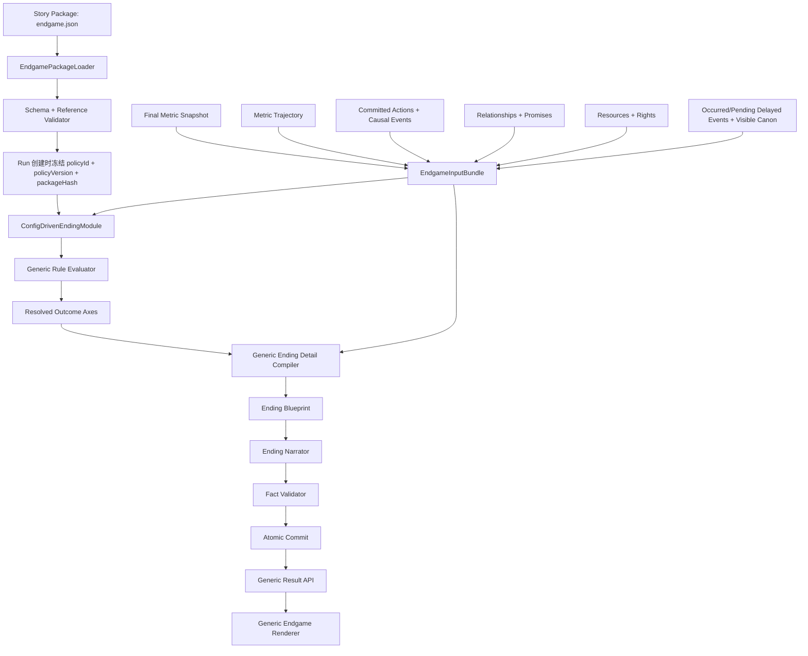

# Our Many Worlds Generic Endgame MVP
# 配置驱动通用终局引擎、动态结局细节与跨世界复用完整实现、测试与验收方案 v3.0

> 目标仓库：`forwardFish/aiStoryRoom`
> 建议仓库落点：`docs/Our_Many_Worlds_Generic_Endgame_MVP_配置驱动通用终局引擎_完整实现测试方案_v3.0.md`
> 来源方案：`Our_Many_Worlds_Solo_Endgame_MVP_宏观结局与动态细节_完整实现测试方案_v2.0.md`
> 文档性质：可独立开发、独立测试、独立验收的通用 Solo / OpenNovel 终局实施规范。
> 本文只定义后续开发，不代表代码已经修改、测试已经执行或真实玩家已经验收。
> **S0 冻结说明（2026-08-10）**：本文件保留完整 v3 最终目标、S1—S9 实施步骤、两世界要求、测试矩阵和最终 Definition of Done；S0 只冻结合同，不代表 S1—S9 已实现。
> **S0 解释优先级**：本文件对应章节、正式 JSON Schema、参考合同实现、两个世界示例、中性合成 fixture 与 S0 测试必须一致；若自然语言示例与正式 Schema 冲突，以经过 Schema、引用完整性和 S0 测试共同验证的封闭合同为准，并必须同步修正文档，不允许长期保留双重语义。
> **S0 正式合同路径**：`packages/shared/schemas/endgame/endgame-package-v1.schema.json`、`packages/shared/src/endgame/endgame-package-v1.contract.mjs`、`packages/shared/tests/generic-endgame-package-v1.s0.spec.mjs`。
> **S0 正式示例路径**：`packages/templates/config/endgame/examples/sangtian.endgame.example.json`、`packages/templates/config/endgame/examples/caesar.endgame.example.json`、`packages/templates/config/endgame/fixtures/neutral-synthetic.endgame.fixture.json`。

---

# 0. 关键结论：v2 不是通用版本

v2 已经解决了“同一个大结局下，细节过于固定”的问题方向，但它仍然是《桑田诏》专用方案，不满足“换一个世界只改 JSON”的目标。

v2 中仍然硬编码了：

- `SangtianFinalMetricsV2`；
- `SangtianEndingAdjudicationV2`；
- `SangtianEndingPolicyV2`；
- `SangtianEndingDetailCompiler`；
- `zhejiangOutcome`；
- `governorFate`；
- 皇帝信任、朝中支持、改桑进度、粮价、民心；
- 改桑成局、奉旨失民、保民缓桑等结局；
- 御旨抵达、总督衙门、粮市、桑田等场景原型；
- 借势周旋、奉旨推进、保民缓行等执政印记；
- 《桑田诏》专用测试路线和文件名。

所以 v2 的准确定位是：

```text
通用思路已经出现
+
《桑田诏》专用实现仍然占主导
```

它还不能实现：

```text
新增一个游戏
→ 只增加或修改 endgame.json
→ 不新增 TypeScript 裁定器
→ 不修改 API
→ 不修改 Web
→ 自动得到新的指标、结局、动态细节和最后一幕
```

v3 的目标就是把 v2 中所有世界专用内容全部移入配置，把代码收敛成一个世界无关的通用终局引擎。

---

# 1. v3 的最终目标

开发完成后，一个新世界接入终局系统时，开发者只需要：

1. 为该世界增加一个版本化 `endgame.json`；
2. 让该世界的 Settlement 按通用合同写入 `metricChanges` 和分类事实；
3. 增加该世界的配置夹具和验收路线；
4. 不新增世界专用终局 TypeScript；
5. 不修改通用 Result API；
6. 不修改通用终局页面。

以《桑田诏》为例：

```text
皇帝信任｜朝中支持｜改桑进度｜粮价｜民心
```

来自《桑田诏》的 `endgame.json`。

换成《凯撒：共和国最后的春天》时，可以改成：

```text
凯撒权势｜元老院支持｜共和国稳定｜街头秩序｜个人嫌疑
```

并把结局改成：

```text
共和国暂存｜凯撒独掌｜内战爆发｜权力僵局
```

通用代码不发生变化。

## 1.1 “只改 JSON”成立的边界

本方案保证的是：

> **终局系统只改 JSON。**

它不表示一个完整的新游戏只需要一个 JSON。新游戏仍然需要角色、场景、事件、行动、世界状态和 Story Package。

终局系统能够做到只改 JSON 的前提是：

- Settlement 使用通用 `metricChanges`；
- 事件使用通用 `EndgameFactV1` 分类；
- 人物关系、承诺、资源、权利和延迟事件使用通用合同；
- 世界专用含义通过 `metricId`、`tag`、标题和规则表达，而不是写入通用代码。

---

# 2. 核心产品原则

```text
通用引擎固定
+
世界终局包可配置
+
运行数据动态变化
+
宏观结局确定性裁定
+
结局细节读取完整路径
+
AI 只负责小说化
```

## 2.1 固定的内容

通用代码固定：

- 终局生命周期；
- 配置加载和 Schema 校验；
- 数值快照与轨迹读取；
- 安全规则表达式执行；
- 多轴结局裁定；
- 分类事实收集；
- 动态细节槽位编译；
- 结局指纹；
- Narrator 输入合同；
- Fact Validator；
- 原子提交；
- Result API；
- 通用 Web 渲染；
- 幂等、恢复、版本兼容和权限。

## 2.2 可配置的内容

每个世界通过 `endgame.json` 配置：

- 显示哪些数值；
- 数值名称、方向、范围和显示格式；
- 哪些数值参与结局；
- 是否存在派生指标；
- 何时结束；
- 有几条结局轴；
- 每条轴有哪些结果；
- 每个结果的判定条件和优先级；
- 哪些动态细节需要展示；
- 每个细节从哪些事实类别中选择；
- 事实如何评分和去重；
- 玩家风格或“执政印记”；
- 最后一幕场景原型；
- Narrator 的语气、长度和段落结构；
- 事实安全规则；
- 结果页标题、顺序和按钮；
- 重玩提示规则。

## 2.3 不允许固定的内容

开局时不得固定：

- 玩家最终命中哪个结局；
- 最终数值；
- 关键盟友与对手；
- 最大成果；
- 最大代价；
- 决定性选择；
- 最后一幕具体事实；
- 未解决问题；
- 最终文学文本。

---

# 3. 通用终局流水线



终局链路中不允许再出现：

```text
if (worldId === "sangtian")
if (worldId === "caesar")
switch (roleKey)
new SangtianEndingDetailCompiler()
```

历史兼容适配器除外；新世界不得依赖世界专用代码。

---

# 4. 通用代码与世界配置的边界

| 能力 | 通用代码负责 | `endgame.json` 负责 |
|---|---|---|
| 数值存储 | `Record<metricId, value>`、范围校验、轨迹 | 数值 ID、标题、初始值、方向、格式 |
| 数值变化 | 接收和持久化 `metricChanges` | 每项数值允许的变化范围和标签 |
| 结束条件 | 执行安全表达式 | T20、章节完成、危机触发等条件 |
| 结局裁定 | 执行规则、按优先级选唯一结果 | 结局轴、结果、条件、标题、摘要 |
| 细节编译 | 分类、筛选、评分、去重、稳定选择 | 槽位、事实类别、权重、上限、文案标签 |
| 人物余波 | 从通用关系事实中选取 | 是否展示、显示标题、选择条件 |
| 场景选择 | 稳定选择一个原型与锚点 | 场景原型、条件、提示词 |
| Narrator | 调用模型、结构化输出、重试 | 语气、长度、段落结构、禁止项 |
| Fact Validator | 验证引用、可见性、状态、范围 | 世界附加约束和必要事实 |
| API | 返回数组化通用合同 | 结果页标签和顺序 |
| Web | 根据数组渲染 | 不含世界逻辑；只显示 API 返回内容 |
| 重玩 | 创建新 Run、保留旧 Run | 提示方向与 CTA 文案 |

---

# 5. 一份世界终局包的结构

MVP 的生产包继续使用一个文件：

```text
packages/templates/config/<worldId>/endgame.json
```

S0 阶段不直接切换生产默认包，而是在以下正式目录冻结 Schema、示例和中性合成 fixture：

```text
packages/shared/schemas/endgame/endgame-package-v1.schema.json
packages/shared/src/endgame/endgame-package-v1.contract.mjs
packages/shared/tests/generic-endgame-package-v1.s0.spec.mjs
packages/templates/config/endgame/examples/sangtian.endgame.example.json
packages/templates/config/endgame/examples/caesar.endgame.example.json
packages/templates/config/endgame/fixtures/neutral-synthetic.endgame.fixture.json
```

`endgame_package_v1` 是封闭文档：顶层和所有受控子对象均使用 `additionalProperties: false`。完整顶层结构如下：

```json
{
  "schemaVersion": "endgame_package_v1",
  "policyId": "sangtian_governor_part1",
  "policyVersion": "1.0.0",
  "worldId": "sangtian",
  "profileId": "zhejiang_governor_part1",
  "scope": "PART",
  "stateVariables": [
    {
      "stateId": "turnNumber",
      "type": "NUMBER"
    },
    {
      "stateId": "partCompletionStatus",
      "type": "STRING"
    }
  ],
  "completion": {},
  "metrics": [],
  "derivedMetrics": [],
  "outcomeAxes": [],
  "combinationOverrides": [],
  "factTaxonomy": {},
  "detailCompilation": {},
  "narrative": {},
  "validation": {},
  "presentation": {},
  "replay": {}
}
```

顶层全部字段必填；`policyVersion` 使用 SemVer；ID 使用：

```regex
^[A-Za-z0-9][A-Za-z0-9._:-]*$
```

`stateVariables[].type` 仅允许：

```text
NUMBER
STRING
BOOLEAN
```

`metrics` 为 2—8 项，`outcomeAxes` 为 1—3 条。每条 outcome axis 必须恰好有一个 `fallback=true` 且该 fallback 不得带 `when`；每个非 fallback outcome 必须带 `when`。`sceneArchetypes` 同样必须恰好有一个无 `when` 的 fallback。

**package 文档本身禁止出现 `packageHash` 字段。** `packageHash` 是验证后由加载器计算并写入 Run 引用的派生身份，不是作者填写的配置字段。

## 5.1 后续拆分

当单文件过大时，可以在后续 schemaVersion 中改成 manifest：

```text
endgame/
├── endgame.manifest.json
├── metrics.json
├── outcomes.json
├── details.json
├── narrative.json
├── presentation.json
└── locales/zh-CN.json
```

但 `endgame_package_v1` 和 P0 生产接入继续使用一个完整 JSON 文档，减少接入、哈希、部署与历史冻结复杂度。若未来拆分，必须先定义“组合后的 package document”及其新的 canonical hash 规则，不得悄悄沿用本版本哈希语义。

# 6. 终局输入必须分类

v2 中的链路必须改成通用分类，而不是直接读取《桑田诏》字段。

## 6.1 `EndgameInputBundleV1`

```ts
export type EndgameInputBundleV1 = {
  schemaVersion: "endgame_input_bundle_v1";

  run: {
    runId: string;
    worldId: string;
    roleId: string;
    partId: string;
    scope: "PART" | "STORY";
    sourceRevision: number;
  };

  packageRef: {
    policyId: string;
    policyVersion: string;
    packageHash: string;
  };

  metrics: {
    final: Record<string, number>;
    trajectory: MetricChangeRecordV1[];
  };

  actions: EndgameFactV1[];
  causalEvents: EndgameFactV1[];
  relationships: EndgameFactV1[];
  promises: EndgameFactV1[];
  resources: EndgameFactV1[];
  rights: EndgameFactV1[];
  delayedEvents: EndgameFactV1[];
  canonFacts: EndgameFactV1[];
};
```

## 6.2 分类一：最终数值快照

用途：

- 宏观结局；
- 个人命运；
- 结果页最终状态；
- 结局规则。

格式：

```ts
Record<MetricId, number>
```

通用引擎不知道 `imperialTrust` 是什么，只知道它是配置注册的一个 `metricId`。

## 6.3 分类二：整局数值轨迹

用途：

- 找出最大改善；
- 找出最大恶化；
- 找出逆转；
- 找出哪次行动真正改变结果；
- 为动态副标题和重玩提示提供依据。

```ts
export type MetricChangeRecordV1 = {
  changeId: string;
  metricId: string;
  before: number;
  delta: number;
  after: number;
  stageIndex: number;
  sourceActionId: string | null;
  sourceFactIds: string[];
  reasonCode: string;
  reasonText: string;
  committedRevision: number;
};
```

## 6.4 分类三：已提交行动与因果事件

用途：

- 决定性选择；
- 玩家风格；
- 最大成果和最大代价的原因；
- 最终复盘。

只允许 committed 数据。

## 6.5 分类四：人物关系与承诺

用途：

- 谁支持玩家；
- 谁与玩家决裂；
- 谁履行或破坏了承诺；
- 人物余波；
- 个人命运细节。

关系和承诺必须分开：

```text
关系 = 当前态度和持久变化
承诺 = 有提出、接受、期限、履行、违背、过期的生命周期
```

## 6.6 分类五：资源、筹码与权利

用途：

- 玩家保住了什么；
- 玩家消耗了什么；
- 某个组织获得了什么长期权利；
- 结局中的结构性代价。

资源与权利必须分开：

```text
资源 = 银两、粮食、军力、证据、筹码、权限次数
权利 = 定价权、指挥权、投票权、运粮权、任命权、公开发言权
```

## 6.7 分类六：延迟事件

Delayed Event 与所有可进入终局选择器的事实统一使用唯一状态集合：

```text
PENDING
OCCURRED
RESOLVED
CANCELLED
EXPIRED
```

语义冻结：

| 状态 | 是否已经发生 | 是否可以写入已发生结果 | 终局用途 |
|---|---:|---:|---|
| `PENDING` | 否 | 否 | 只可作为未来义务、风险或 `UNRESOLVED_HOOK` |
| `OCCURRED` | 是 | 是 | 已经发生，但可能仍需处理、追责或收束 |
| `RESOLVED` | 是 | 是 | 已经发生且已经完成解决 |
| `CANCELLED` | 否/不再发生 | 否 | 已取消，不得继续制造威胁 |
| `EXPIRED` | 否/窗口已失效 | 否 | 机会或期限失效，不得写成仍将发生 |

硬约束：

- `PENDING` 不得被 Narrator 写成已经发生；
- `OCCURRED` 不等于 `RESOLVED`，不得擅自补写后续已解决；
- `CANCELLED` 和 `EXPIRED` 不得继续作为未来威胁；
- Schema、事实合同、selector、两个示例、fixture、Validator 和测试只允许上述五个值；
- 不再存在任何其他中间状态别名。

## 6.8 分类七：可见 Canon

用途：

- 最后一幕地点；
- 真实人物；
- 真实物件；
- 已发生公共事件；
- Narrator 的事实边界。

---

# 7. 通用事实合同

## 7.1 `EndgameFactV1`

```ts
export type EndgameFactV1 = {
  schemaVersion: "endgame_fact_v1";
  factId: string;

  sourceType:
    | "PLAYER_ACTION"
    | "METRIC_CHANGE"
    | "CAUSAL_EVENT"
    | "RELATIONSHIP_CHANGE"
    | "PROMISE"
    | "RESOURCE_CHANGE"
    | "RIGHT_CHANGE"
    | "DELAYED_EVENT"
    | "CANON_FACT";

  category:
    | "ACTION"
    | "ACHIEVEMENT"
    | "COST"
    | "RELATIONSHIP"
    | "OBLIGATION"
    | "ASSET"
    | "RIGHT"
    | "PUBLIC_AFTERMATH"
    | "POLITICAL_AFTERMATH"
    | "POLICY_AFTERMATH"
    | "SCENE_ANCHOR"
    | "UNRESOLVED_HOOK"
    | "CUSTOM";

  title: string;
  text: string;
  tags: string[];

  polarity: "POSITIVE" | "NEGATIVE" | "MIXED" | "NEUTRAL";
  status: "PENDING" | "OCCURRED" | "RESOLVED" | "CANCELLED" | "EXPIRED";
  magnitude: number;

  actorIds: string[];
  targetIds: string[];
  locationIds: string[];
  objectIds: string[];

  metricImpacts: Array<{
    metricId: string;
    delta: number;
  }>;

  visibility: "PLAYER" | "PUBLIC" | "PRIVATE_OTHER" | "INTERNAL";
  stageIndex: number | null;
  sourceActionId: string | null;
  sourceRevision: number;
};
```

## 7.2 世界专用信息只能放在标签中

允许：

```text
strategy:leverage
strategy:cooperate
strategy:force
world:grain
world:reform
actor:governor
actor:caesar
scene:market
scene:senate
```

不允许把这些词写入通用 TypeScript enum。

## 7.3 事实必须在产生时分类

不能等到终局再对小说正文做中文关键词分析。

正确流程：

```text
Settlement / Event Commit
→ 同时写入结构化 EndgameFact
→ 终局直接读取
```

错误流程：

```text
最后读取二十轮小说正文
→ 用大模型猜哪些是成果、代价和关键人物
```

---

# 8. 数值模板

## 8.1 数值数量不固定

通用引擎不得假设固定为五项。

每个 profile 允许：

```text
最少 2 项
建议 3—6 项
硬上限 8 项
```

Web 根据 `presentation.metricOrder` 渲染。

## 8.2 `MetricDefinitionV1`

```ts
export type MetricDefinitionV1 = {
  metricId: string;
  label: string;
  description: string;

  min: number;
  max: number;
  initialValue: number;

  direction: "HIGH_GOOD" | "LOW_GOOD" | "CONTEXTUAL";

  format: {
    kind: "INTEGER" | "PERCENT" | "DECIMAL" | "CURRENCY";
    suffix: string;
    decimals: number;
  };

  display: {
    visibleDuringRun: boolean;
    visibleAtEnding: boolean;
    order: number;
    showTrend: boolean;
  };

  changePolicy: {
    maxAbsoluteDeltaPerSettlement: number;
    clamp: boolean;
  };
};
```

## 8.3 通用数值变化合同

Settlement 只提交：

```ts
export type MetricChangeRequestV1 = {
  metricId: string;
  delta: number;
  reasonCode: string;
  reasonText: string;
  sourceFactIds: string[];
};
```

Runtime 必须校验：

- `metricId` 存在；
- `delta` 未超过配置上限；
- `sourceFactIds` 均已提交；
- 最终值在范围内；
- 同一 submission 不重复应用；
- 每次变化均写入 trajectory。

## 8.4 粮价这种“越高越坏”的数值

不需要在代码中硬编码反转。

配置：

```json
{
  "metricId": "grain_price",
  "label": "粮价",
  "direction": "LOW_GOOD"
}
```

规则可以直接写：

```json
{
  "lte": [
    { "metric": "grain_price" },
    { "constant": 60 }
  ]
}
```

## 8.5 可选派生指标

某些世界需要把多个数值组合成一个裁定维度，可以配置派生指标：

```json
{
  "derivedMetricId": "livelihood_stability",
  "expression": {
    "average": [
      {
        "invert": {
          "value": { "metric": "grain_price" },
          "min": { "constant": 0 },
          "max": { "constant": 100 }
        }
      },
      {
        "metric": "public_support"
      }
    ]
  }
}
```

派生指标：

- 只用于裁定和调试；
- 默认不在页面显示；
- 不得覆盖原始指标；
- 不得形成循环依赖。

---

# 9. 安全规则表达式 DSL

不能在 JSON 中放 JavaScript，也不能使用 `eval()`。S0 冻结为一个封闭、世界无关、确定性的表达式语言；文档、Schema、参考执行合同、两个示例、neutral fixture 和测试必须使用同一 allowlist。

表达式对象必须**恰好只有一个 operator key**。数值、字符串和布尔常量不能裸写，必须使用 `{"constant": ...}`。所有表达式在 package 启动校验时做引用、形状、参数个数和类型检查，在运行时再次 fail closed。

## 9.1 数值表达式 allowlist

| operator | 唯一 JSON 形状 | 参数个数与类型 | 返回类型 |
|---|---|---|---|
| `metric` | `{"metric":"metric_id"}` | 1 个已注册 base/derived metric ID | number |
| `state` | `{"state":"state_id"}` | 1 个声明为 `NUMBER` 的 state ID | number |
| `constant` | `{"constant":12.5}` | 1 个有限 number | number |
| `add` | `{"add":[Num, ...]}` | 1 个以上 Num | number |
| `subtract` | `{"subtract":[Num, Num]}` | 恰好 2 个 Num | number |
| `multiply` | `{"multiply":[Num, ...]}` | 1 个以上 Num | number |
| `divide` | `{"divide":[Num, Num]}` | 恰好 2 个 Num | number |
| `average` | `{"average":[Num, ...]}` | 1 个以上 Num | number |
| `min` | `{"min":[Num, ...]}` | 1 个以上 Num | number |
| `max` | `{"max":[Num, ...]}` | 1 个以上 Num | number |
| `invert` | `{"invert":{"value":Num,"min":Num,"max":Num}}` | 恰好 `value/min/max` | number |
| `clamp` | `{"clamp":{"value":Num,"min":Num,"max":Num}}` | 恰好 `value/min/max` | number |
| `tagCount` | `{"tagCount":{"selector":Selector,"tag":"registered:tag"}}` | 恰好 selector + 已注册 tag | non-negative integer |
| `factCount` | `{"factCount":Selector}` | 恰好 1 个 Selector | non-negative integer |

`invert` 的定义固定为：

```text
min + max - value
```

它不是隐式的 `100 - value`。例如把 0—100 的粮价方向反转：

```json
{
  "invert": {
    "value": { "metric": "grain_price" },
    "min": { "constant": 0 },
    "max": { "constant": 100 }
  }
}
```

`clamp` 使用闭区间：

```text
max(min, min(max, value))
```

`invert` 与 `clamp` 的三个参数都可以是数值表达式，但求值后的 `min` 必须小于或等于 `max`。

## 9.2 布尔表达式 allowlist

| operator | 唯一 JSON 形状 | 参数个数与类型 | 返回类型 |
|---|---|---|---|
| `constant` | `{"constant":true}` | 1 个 boolean | boolean |
| `state` | `{"state":"state_id"}` | 1 个声明为 `BOOLEAN` 的 state ID | boolean |
| `all` | `{"all":[Bool, ...]}` | 1 个以上 Bool | boolean |
| `any` | `{"any":[Bool, ...]}` | 1 个以上 Bool | boolean |
| `not` | `{"not":Bool}` | 恰好 1 个 Bool | boolean |
| `gt` | `{"gt":[Num, Num]}` | 恰好 2 个 Num | boolean |
| `gte` | `{"gte":[Num, Num]}` | 恰好 2 个 Num | boolean |
| `lt` | `{"lt":[Num, Num]}` | 恰好 2 个 Num | boolean |
| `lte` | `{"lte":[Num, Num]}` | 恰好 2 个 Num | boolean |
| `eq` | `{"eq":[Scalar, Scalar]}` | 恰好 2 个 Scalar | boolean |
| `neq` | `{"neq":[Scalar, Scalar]}` | 恰好 2 个 Scalar | boolean |
| `in` | `{"in":[Scalar,{"constant":[ScalarLiteral,...]}]}` | 左侧 1 个 Scalar；右侧非空常量数组 | boolean |
| `factExists` | `{"factExists":Selector}` | 恰好 1 个 Selector | boolean |
| `axisOutcomeIs` | `{"axisOutcomeIs":["axisId","outcomeId"]}` | 恰好 2 个已注册 ID | boolean |

`Scalar` 仅允许：

- 数值表达式；
- 已声明的 `state`；
- `{"constant": null|string|boolean|finite number}`。

`in` 的右侧必须是显式常量数组，不能读取任意对象路径，也不能执行动态函数。

## 9.3 Fact Selector

Selector 是封闭对象，只允许：

```text
sourceTypes
categories
statuses
polarities
visibility
includeTagsAny
includeTagsAll
excludeTags
minMagnitude
```

`sourceTypes`、`categories`、`statuses`、`polarities` 与 `visibility` 都由 Schema enum 限定；tag 必须存在于 `factTaxonomy.recommendedTags`。玩家可见 selector 的 visibility 只允许 `PLAYER` 与 `PUBLIC`。

## 9.4 完整示例

```json
{
  "all": [
    {
      "gte": [
        { "metric": "reform_progress" },
        { "constant": 70 }
      ]
    },
    {
      "lte": [
        { "metric": "grain_price" },
        { "constant": 60 }
      ]
    },
    {
      "gte": [
        { "metric": "public_support" },
        { "constant": 55 }
      ]
    },
    {
      "factExists": {
        "statuses": ["OCCURRED", "RESOLVED"],
        "visibility": ["PLAYER", "PUBLIC"],
        "includeTagsAny": ["domain:public"]
      }
    }
  ]
}
```

## 9.5 错误语义与安全边界

以下全部 fail closed，不能回退为 `false`、`0`、随机值或模型判断：

- 未知 operator；
- 表达式对象包含 0 个或多个 operator key；
- 参数个数不符合上表；
- 参数类型不匹配；
- 未知 metric、state、tag、axis 或 outcome；
- 数值 state 读取非 NUMBER；布尔 state 读取非 BOOLEAN；
- `divide` 的分母在求值后等于 0；
- 输入上下文或任意中间结果出现 NaN、`Infinity` 或 `-Infinity`；
- `invert` / `clamp` 的边界不是有限数，或求值后 `min > max`；
- 递归深度超过 20；
- 单个表达式节点数超过 500；
- 任何派生指标形成自环或间接循环。

派生指标循环规则：建立 `derivedMetricId -> referenced derivedMetricId` 有向图；在 package 验证阶段执行完整拓扑检查。任何 strongly connected component 大于 1，或单节点自引用，均拒绝整个 package。不得依靠运行时递归超限来“发现”循环。

严格禁止：

```text
eval
任意 JavaScript 或函数名调用
随机数
当前时间
文件读取
网络访问
环境变量
反射或任意对象路径
世界专用 TypeScript 分支
```

同一 package、同一输入 context 必须得到完全相同的结果。

# 10. 结局模板：多轴裁定

v2 固定为：

```text
浙江局势
+
总督命运
```

v3 改为通用的 `outcomeAxes[]`。

一个世界可以拥有：

- 1 条轴：只有世界结局；
- 2 条轴：世界结局 + 主角命运；
- 3 条轴：世界结局 + 主角命运 + 核心关系；
- P0 建议最多 3 条轴。

## 10.1 `OutcomeAxisDefinitionV1`

```ts
export type OutcomeAxisDefinitionV1 = {
  axisId: string;
  label: string;
  order: number;

  outcomes: Array<{
    outcomeId: string;
    title: string;
    summary: string;
    priority: number;
    when?: RuleExpressionV1;
    fallback?: boolean;
    narrativeTags: string[];
  }>;
};
```

## 10.2 裁定规则

每条轴：

1. 按 `priority DESC` 排序；
2. 选择第一条 `when=true` 的结果；
3. 若无规则命中，使用唯一 `fallback=true`；
4. 每条轴必须恰好返回一个结果；
5. 配置缺少 fallback 时启动失败；
6. 引擎不得随机选择。

## 10.3 组合修饰

同一组轴结果可以有额外组合标题或 Narrator 指导：

```json
{
  "combinationId": "reform_success_but_removed",
  "when": {
    "all": [
      {
        "axisOutcomeIs": [
          "world_outcome",
          "reform_with_stability"
        ]
      },
      {
        "axisOutcomeIs": [
          "protagonist_fate",
          "removed_for_inquiry"
        ]
      }
    ]
  },
  "subtitleHint": "事情办成了，但主政者没有留下。"
}
```

组合修饰不能改变轴结果，只能补充动态表达。

## 10.4 候选结局与正式结局

每次 Settlement 后可以内部计算 candidate：

```text
更新数值
→ 重新计算各轴 candidate
→ 不创建正式 Ending
```

只有 `completion.when=true` 时：

```text
冻结 packageHash
冻结 final metrics
冻结 outcome axes
编译细节
原子提交
```

页面默认不显示候选结局名称，只显示数值和局势。

---

# 11. 完成条件也必须配置

不允许通用引擎硬编码 `T20` 或 `HANDOFF_READY`。

《桑田诏》可以配置：

```json
{
  "scope": "PART",
  "when": {
    "all": [
      {
        "gte": [
          { "state": "turnNumber" },
          { "constant": 20 }
        ]
      },
      {
        "eq": [
          { "state": "partCompletionStatus" },
          { "constant": "HANDOFF_READY" }
        ]
      }
    ]
  }
}
```

另一个世界可以配置：

```text
危机计时归零
或
核心事件已经解决
或
玩家主动退出并满足可结算条件
```

允许读取的 state 必须由 Runtime 白名单提供，不能让 JSON 任意访问服务端对象路径。

---

# 12. 动态结局细节也必须模板化

## 12.1 通用 Detail Compiler

新增世界无关模块：

```text
ConfigDrivenEndingDetailCompiler
```

它只知道：

- slotId；
- slotKind；
- selector；
- scoringProfile；
- required；
- min/max items；
- dedupe rule；
- fallback policy。

它不知道：

- 浙江；
- 改桑；
- 凯撒；
- 元老院；
- 商会；
- 皇帝；
- 总督。

## 12.2 通用槽位分类

允许的 `slotKind`：

```text
ACHIEVEMENT
COST
CAUSE
ENTITY_EPILOGUE
WORLD_AFTERMATH
ASSET_AFTERMATH
OBLIGATION_AFTERMATH
UNRESOLVED_HOOK
SCENE_ANCHOR
STYLE_MARKER
CUSTOM
```

具体 `slotId` 完全由世界配置决定。

例如《桑田诏》：

```text
dominant_achievement
political_aftermath
policy_aftermath
```

例如《凯撒》：

```text
republic_aftermath
senate_epilogue
caesar_relationship
```

## 12.3 `DetailSlotDefinitionV1`

```ts
export type DetailSlotDefinitionV1 = {
  slotId: string;
  slotKind: string;
  label: string;

  required: boolean;
  minItems: number;
  maxItems: number;

  selector: {
    sourceTypes?: string[];
    categories?: string[];
    statuses?: string[];
    polarities?: string[];
    visibility?: Array<"PLAYER" | "PUBLIC">;
    includeTagsAny?: string[];
    includeTagsAll?: string[];
    excludeTags?: string[];
    minMagnitude?: number;
  };

  scoringProfileId: string;
  dedupeBy: Array<
    "factId" | "sourceActionId" | "actorId" | "targetId" | "locationId"
  >;

  fallback: "FAIL" | "ALLOW_EMPTY" | "USE_TEMPLATE";
};
```

## 12.4 评分模板

```json
{
  "scoringProfileId": "default_impact",
  "weights": {
    "causalStrength": 40,
    "metricImpact": 25,
    "relationshipImpact": 15,
    "terminalRelevance": 10,
    "recency": 5,
    "uniqueness": 5
  }
}
```

不同槽位可以使用不同评分：

```text
最大成果：更重视 metricImpact
人物余波：更重视 relationshipImpact
决定性原因：更重视 causalStrength
未解问题：更重视 terminalRelevance 和 pending status
场景锚点：更重视 visible Canon 和 location/object
```

## 12.5 稳定平局规则

分数相同时：

```text
sourceRevision DESC
stageIndex DESC
sourceActionId ASC
factId ASC
```

禁止随机数。

## 12.6 变化下限

配置可以规定正式结局最低内容：

```json
{
  "minimumVariation": {
    "requiredSlots": [
      "dominant_achievement",
      "dominant_cost",
      "decisive_causes",
      "world_aftermath",
      "scene_anchor",
      "unresolved_hooks"
    ],
    "minimumDistinctSourceFacts": 5,
    "minimumDistinctSourceActions": 2
  }
}
```

若数据不足：

- 非核心槽位可以为空；
- 核心槽位不足则不能完成候选；
- 不得用 AI 补造事实。

---

# 13. 玩家风格也必须配置

v2 的“奉旨推进、保民缓行、借势周旋”等不是通用枚举。

v3 使用可选的 `styleProfiles[]`：

```json
{
  "styleId": "leverage_broker",
  "label": "借势周旋",
  "priority": 100,
  "when": {
    "gte": [
      {
        "tagCount": {
          "selector": {
            "sourceTypes": ["PLAYER_ACTION"]
          },
          "tag": "strategy:leverage"
        }
      },
      { "constant": 3 }
    ]
  }
}
```

另一个世界可以定义：

```text
坚定共和派
谨慎调停者
现实合谋者
公开对抗者
```

引擎只返回 `styleId + label + evidenceRefs`。

证据不足时：

```text
style = null
```

不为了页面完整强行贴标签。

---

# 14. 最后一幕场景也必须配置

v2 中的御旨、总督衙门、粮市、桑田全部移入世界配置。

## 14.1 `SceneArchetypeDefinitionV1`

```ts
export type SceneArchetypeDefinitionV1 = {
  sceneId: string;
  label: string;
  priority: number;
  when?: RuleExpressionV1; // 非 fallback 必填；fallback=true 时禁止

  anchorSelector: DetailSlotDefinitionV1["selector"];
  promptHint: string;
  fallback?: boolean;
};
```

## 14.2 《桑田诏》可以配置

```text
御旨抵达
总督衙门夜议
粮市天明
运河码头
雨后桑田
官印交接
```

## 14.3 《凯撒》可以配置

```text
元老院散场
罗马广场黎明
布鲁图斯书房
阿庇亚大道
军团营地
凯撒宅邸
```

通用代码只选择 `sceneId`，不包含任何场景名称。

---

# 15. Narrator 模板也必须配置

Narrative 不是自由文本提示词，而是 `endgame_package_v1` 的结构化、安全、可验证合同。Schema 必须真实表达语言、人称、语气、节奏、长度、段落职责、世界意象、禁止表达、PART/STORY 边界以及确定性 fallback；全部字段必填，不使用隐式默认值。

## 15.1 完整字段合同

| 字段 | 类型与边界 | 语义 |
|---|---|---|
| `language` | BCP-47 风格字符串 | 例如 `zh-CN`、`en-US` |
| `pointOfView` | 固定 enum | `FIRST_PERSON` / `SECOND_PERSON` / `THIRD_PERSON_LIMITED` / `THIRD_PERSON_OMNISCIENT` |
| `tone.tags` | 1—8 个非空、唯一字符串 | 世界允许的叙事语气标签 |
| `pacing.tempo` | enum | `SLOW` / `MODERATE` / `FAST` / `VARIED` |
| `pacing.sentenceRhythm` | enum | `SHORT` / `MIXED` / `LONG` |
| `pacing.transitionStyle` | enum | `CONTINUOUS` / `SCENE_CUTS` / `REFLECTIVE` |
| `length` | 三个整数 | `80 <= minChars <= targetChars <= maxChars <= 5000` |
| `paragraphPlan` | 1—8 个封闭对象 | 段落 ID、职责、适用 scope、所需 slot/axis、是否允许纯氛围 |
| `worldImagery` | 封闭对象 | required/preferred/forbidden tags；每段最多 0—8 个意象引用 |
| `forbiddenPhrases` | 最多 50 个唯一 literal | 每项 1—120 字符；只做字面禁止，不允许正则或代码 |
| `scopeConstraints` | PART/STORY 均必填 | 明确阶段结局与完整故事结局边界 |
| `fallback` | `TEMPLATE_ONLY` | 白名单 placeholder；PART/STORY 分开的确定性模板 |

`paragraphPlan[].purpose` 仅允许：

```text
WORLD_RESULT
PROTAGONIST_RESULT
COST_AND_RELATIONSHIP
UNRESOLVED_HOOK
STORY_CLOSURE
CUSTOM
```

每个段落必须包含：

```text
paragraphId
purpose
appliesTo[]
requiredSlots[]
requiredAxes[]
allowAtmosphereOnly
```

所有 slot、axis 和 imagery tag 引用都必须在同一 package 中存在。

## 15.2 PART 与 STORY 的不同约束

PART 固定安全边界：

```json
{
  "endingLabel": "第一部分结局",
  "allowLifetimeClosure": false,
  "requireUnresolvedHook": true
}
```

因此 `scope=PART` 的 package：

- 必须至少有一个 `purpose=UNRESOLVED_HOOK` 且 `appliesTo` 包含 `PART` 的段落；
- 不得把阶段结果写成人物一生命运；
- 不得虚构后续 Part 已经发生；
- 必须保留真实、权限安全的未解钩子或使用确定性模板降级。

STORY 固定边界要求 `allowLifetimeClosure=true`，并且 `requireUnresolvedHook` 必须显式给出布尔值、不得依赖默认值。例如完整收束型故事可以配置：

```json
{
  "endingLabel": "故事结局",
  "allowLifetimeClosure": true,
  "requireUnresolvedHook": false
}
```

需要保留开放尾声的 STORY 也可以显式设为 `true`。无论取值如何，STORY 仍不能新增未获授权事实。

## 15.3 完整配置示例

以下结构与 S0 的《桑田诏》正式示例同步；具体值属于世界配置，通用 Schema 只冻结字段、类型与安全边界：

```json
{
  "language": "zh-CN",
  "pointOfView": "THIRD_PERSON_LIMITED",
  "tone": {
    "tags": [
      "克制",
      "政治现实感"
    ]
  },
  "pacing": {
    "tempo": "MODERATE",
    "sentenceRhythm": "MIXED",
    "transitionStyle": "REFLECTIVE"
  },
  "length": {
    "minChars": 200,
    "targetChars": 420,
    "maxChars": 700
  },
  "paragraphPlan": [
    {
      "paragraphId": "world",
      "purpose": "WORLD_RESULT",
      "appliesTo": [
        "PART",
        "STORY"
      ],
      "requiredSlots": [
        "scene_anchor"
      ],
      "requiredAxes": [
        "world_outcome"
      ],
      "allowAtmosphereOnly": false
    },
    {
      "paragraphId": "fate",
      "purpose": "PROTAGONIST_RESULT",
      "appliesTo": [
        "PART",
        "STORY"
      ],
      "requiredSlots": [
        "dominant_cost"
      ],
      "requiredAxes": [
        "protagonist_fate"
      ],
      "allowAtmosphereOnly": false
    },
    {
      "paragraphId": "open",
      "purpose": "UNRESOLVED_HOOK",
      "appliesTo": [
        "PART"
      ],
      "requiredSlots": [
        "unresolved_hooks"
      ],
      "requiredAxes": [],
      "allowAtmosphereOnly": false
    },
    {
      "paragraphId": "closure",
      "purpose": "STORY_CLOSURE",
      "appliesTo": [
        "STORY"
      ],
      "requiredSlots": [],
      "requiredAxes": [
        "protagonist_fate"
      ],
      "allowAtmosphereOnly": false
    }
  ],
  "worldImagery": {
    "requiredTags": [
      "scene:yamen"
    ],
    "preferredTags": [
      "scene:yamen",
      "scene:market",
      "strategy:people_first",
      "result:formed",
      "result:open"
    ],
    "forbiddenTags": [],
    "maxReferencesPerParagraph": 2
  },
  "forbiddenPhrases": [
    "多年以后，一切早已注定",
    "这是整个人生的最终定论"
  ],
  "scopeConstraints": {
    "PART": {
      "endingLabel": "《桑田诏》第一部分结局",
      "allowLifetimeClosure": false,
      "requireUnresolvedHook": true
    },
    "STORY": {
      "endingLabel": "《桑田诏》故事结局",
      "allowLifetimeClosure": true,
      "requireUnresolvedHook": false
    }
  },
  "fallback": {
    "mode": "TEMPLATE_ONLY",
    "allowedPlaceholders": [
      "scene_anchor.0.text",
      "dominant_achievement.0.text",
      "axis.protagonist_fate.summary",
      "dominant_cost.0.text",
      "unresolved_hooks.0.text"
    ],
    "paragraphTemplates": {
      "PART": [
        "{{scene_anchor.0.text}}。{{dominant_achievement.0.text}}。",
        "{{axis.protagonist_fate.summary}}",
        "{{dominant_cost.0.text}}。",
        "仍未解决的是：{{unresolved_hooks.0.text}}。"
      ],
      "STORY": [
        "{{scene_anchor.0.text}}。{{dominant_achievement.0.text}}。",
        "{{axis.protagonist_fate.summary}}",
        "{{dominant_cost.0.text}}。"
      ]
    }
  }
}
```

正式两个示例与中性 fixture 以仓库 S0 路径为准；任何 Narrative 修改都必须同时通过 Schema、引用完整性、placeholder 与 scope 负例测试。

## 15.4 Narrator 输出必须结构化

```ts
export type NarratedEndingV1 = {
  paragraphs: Array<{
    paragraphId: string;
    text: string;
    factRefs: string[];
  }>;
};
```

每一段必须对应允许的 `paragraphId`，并声明使用了哪些 `factId`。只有 `allowAtmosphereOnly=true` 的段落可以没有 factRef，且 Validator 必须限制其数量和内容边界。

Narrator 不得返回或修改：

- completion 结果；
- outcomeId；
- 最终数值；
- packageHash；
- visibility；
- 新人物、组织、地点或物件；
- 未引用、未发生或无权限事实。

## 15.5 确定性模板降级

连续受控生成失败后，只能使用 `fallback.mode=TEMPLATE_ONLY`。模板渲染器必须：

1. 根据本 Run 的 `scope` 只选择 PART 或 STORY 模板；
2. 只接受 `allowedPlaceholders` 白名单；
3. placeholder 只能读取已经编译进 Blueprint 的 axis/slot 文本；
4. 未知、越权、为空且不可降级的 placeholder 必须 fail closed；
5. 不执行表达式、函数、条件语句、循环、文件或网络操作；
6. 相同 Blueprint 必须生成相同 fallback 文本。

# 16. Fact Validator 分类

## 16.1 通用确定性校验

必须验证：

1. `factRefs` 均在 Blueprint 的 `allowedFactRefs` 中；
2. 所有人物、组织、地点、物件真实存在；
3. `PRIVATE_OTHER` 和 `INTERNAL` 不得进入玩家结果；
4. `PENDING` 不得写成已发生；
5. `CANCELLED` 不得写成后续威胁；
6. Narrative 不得修改最终数值；
7. Narrative 不得修改 outcome axes；
8. `PART_END` 不得写成人物一生命运；
9. 未知数字不得出现；
10. 每段至少有一个合法 factRef，纯氛围段除外且最多一段。

## 16.2 配置附加校验

世界配置可以增加：

```text
必须提到某个轴结果
禁止宣布某类事件
某个 outcome 必须包含特定 tag 的事实
某个 scene 必须有 location 或 object anchor
```

## 16.3 不允许的校验方式

- 不用中文关键词决定结局；
- 不用模型“感觉是否合理”替代结构化校验；
- 不用最终小说反推结果；
- 不因文学更精彩而放宽权限。

---

# 17. 通用终局蓝图

## 17.1 `EndgameAdjudicationV3`

```ts
export type EndgameAdjudicationV3 = {
  schemaVersion: "endgame_adjudication_v3";

  packageRef: {
    policyId: string;
    policyVersion: string;
    packageHash: string;
  };

  scope: "PART" | "STORY";
  finalMetrics: Record<string, number>;

  resolvedAxes: Array<{
    axisId: string;
    outcomeId: string;
  }>;

  combinationId: string | null;
  sourceRevision: number;
};
```

## 17.2 `EndingDetailBlueprintV2`

```ts
export type EndingDetailBlueprintV2 = {
  schemaVersion: "ending_detail_blueprint_v2";
  endingFingerprint: string;

  resolvedAxes: Array<{
    axisId: string;
    outcomeId: string;
    title: string;
    summary: string;
  }>;

  style: null | {
    styleId: string;
    label: string;
    evidenceRefs: string[];
  };

  slots: Record<
    string,
    Array<{
      title: string;
      text: string;
      evidenceRefs: string[];
    }>
  >;

  scene: {
    sceneId: string;
    label: string;
    anchorFactRefs: string[];
  };

  allowedFactRefs: string[];
  sourceRevision: number;
};
```

蓝图不再包含：

```text
zhejiangOutcome
governorFate
policyAftermath
politicalAftermath
```

这些都成为配置中的 axisId 或 slotId。

---

# 18. 通用 Result API

继续复用：

```http
GET /api/v4/rooms/:runId/result
```

## 18.1 `EndgamePresentationV3`

```ts
export type EndgamePresentationV3 = {
  schemaVersion: "endgame_presentation_v3";
  resultType: "SOLO_PART_END" | "SOLO_STORY_END" | "LEGACY_ENDING";

  world: {
    worldId: string;
    worldTitle: string;
    roleId: string;
    roleTitle: string;
  };

  axes: Array<{
    axisId: string;
    label: string;
    outcomeId: string;
    title: string;
    summary: string;
  }>;

  metrics: Array<{
    metricId: string;
    label: string;
    value: number;
    formattedValue: string;
    direction: "HIGH_GOOD" | "LOW_GOOD" | "CONTEXTUAL";
    initialValue: number | null;
  }>;

  dynamicSubtitle: string;
  style: null | {
    styleId: string;
    label: string;
  };

  narrative: string;

  sections: Array<{
    sectionId: string;
    label: string;
    layout: "LIST" | "TWO_COLUMN" | "TIMELINE" | "CARDS";
    items: Array<{
      title: string;
      text: string;
      actorName: string | null;
      stageIndex: number | null;
    }>;
  }>;

  replayHint: string;
  endingFingerprint: string;

  replayActions: Array<{
    type:
      | "RESTART_SAME_STORY"
      | "CHANGE_ROLE"
      | "CONTINUE_NEXT_PART"
      | "BACK_TO_WORLDS";
    label: string;
    href: string | null;
    enabled: boolean;
    disabledReason: string | null;
  }>;
};
```

API 不再返回世界专用字段。

错误示例：

```json
{
  "zhejiangOutcome": "REFORM_WITH_STABILITY",
  "governorFate": "RETAINED_BUT_CONSTRAINED"
}
```

正确示例：

```json
{
  "axes": [
    {
      "axisId": "world_outcome",
      "outcomeId": "reform_with_stability"
    },
    {
      "axisId": "protagonist_fate",
      "outcomeId": "retained_but_constrained"
    }
  ]
}
```

---

# 19. 通用 Web 展示

Web 只根据数组渲染：

```text
axes[]
metrics[]
sections[]
replayActions[]
```

Web 不知道：

- 五项数值是什么；
- 有几条结局轴；
- 哪个轴叫浙江局势；
- 哪个结局是好或坏；
- 哪些栏目叫政治余波；
- 哪种场景是桑田或元老院。

## 19.1 配置控制页面顺序

```json
{
  "presentation": {
    "axisOrder": [
      "world_outcome",
      "protagonist_fate"
    ],
    "metricOrder": [
      "imperial_trust",
      "court_support",
      "reform_progress",
      "grain_price",
      "public_support"
    ],
    "sections": [
      {
        "sectionId": "gain",
        "label": "你保住了",
        "slotIds": [
          "dominant_achievement"
        ],
        "layout": "LIST"
      },
      {
        "sectionId": "loss",
        "label": "你付出了",
        "slotIds": [
          "dominant_cost"
        ],
        "layout": "LIST"
      }
    ]
  }
}
```

换世界时页面无需改代码。

---

# 20. 世界终局包版本冻结

## 20.1 packageHash 的唯一算法

`packageHash` 冻结为：

```text
lowercaseHex(
  SHA-256(
    UTF-8(
      RFC 8785 JCS(
        validated full original package document
      )
    )
  )
)
```

精确流程：

```text
读取完整原始 package JSON
→ 解析为 JSON data model
→ 通过 endgame_package_v1 Schema
→ 通过引用完整性、fallback、循环、Narrative 和 DSL 校验
→ 确认 package 文档中不存在 packageHash 字段
→ RFC 8785 JCS canonicalize 完整 package document
→ 编码为 UTF-8 bytes
→ SHA-256
→ 小写十六进制
```

哈希覆盖**通过校验后的完整原始 package 文档**。禁止：

- 先写入占位 `packageHash` 再计算；
- 删除某些字段后计算；
- 只计算 metrics/outcomes 子集；
- 依赖 JavaScript 对象插入顺序；
- 对未通过 Schema 或引用校验的文档计算正式 hash；
- 用普通 `JSON.stringify` 的偶然属性顺序冒充 canonicalization。

JCS 输入只允许 JSON data model。必须拒绝：

```text
NaN
Infinity / -Infinity
undefined
function
symbol / bigint
循环对象
稀疏数组
未配对 UTF-16 surrogate / 非法 Unicode
```

`-0` canonicalize 为 `0`。对象 key 按 RFC 8785 规则排序；数组顺序保持不变。

## 20.2 Run 创建时冻结

```ts
export type EndgamePackageRefV1 = {
  policyId: string;
  policyVersion: string;
  packageHash: string;
};
```

Run 必须保存：

- `policyId`；
- `policyVersion`；
- 64 字符小写十六进制 `packageHash`；
- 不可变 canonical package snapshot，或能通过 `packageHash` 取回完全相同 canonical UTF-8 bytes 的内容寻址引用。

推荐快照合同：

```ts
export type EndgamePackageSnapshotV1 = {
  schemaVersion: "endgame_package_snapshot_v1";
  policyId: string;
  policyVersion: string;
  packageHash: string;
  canonicalPackage: string;
  packageDocument: EndgamePackageV1;
};
```

`packageDocument` 必须由 `canonicalPackage` 解析得到并视为不可变。内容寻址实现必须验证取回 bytes 的 SHA-256 与 Run 保存的 hash 完全一致。

## 20.3 修改 JSON 后的行为

```text
已经开始的 Run
→ 继续读取创建时冻结的 package snapshot / content-addressed bytes

已经完成的 Run
→ 永不重算

新创建的 Run
→ 验证并冻结新 policyVersion + packageHash
```

禁止：

```text
编辑当前 endgame.json
→ 进行中 Run 或历史 Run 改变裁定
```

## 20.4 版本规则

任何以下变化必须提升 `policyVersion` 并产生新 `packageHash`：

- 增删指标或 state variable；
- 修改阈值或 DSL；
- 修改 outcome 规则；
- 修改完成条件；
- 修改 required slot；
- 修改事实 selector、状态或可见性；
- 修改 Narrative 结构、scope 约束或 fallback；
- 修改 presentation / replay 行为。

纯文案修正即使不改变事实含义，也会改变 package bytes 和 hash，因此必须按发布策略提升 patch 版本，不能覆盖同一 `policyVersion + packageHash` 身份。

# 21. 《桑田诏》如何变成一个纯配置

v3 中，《桑田诏》不再拥有新 Run 专用裁定器。

它只提供：

```text
packages/templates/config/sangtian/endgame.json
```

其中配置：

## 21.1 数值

```text
imperial_trust   皇帝信任
court_support    朝中支持
reform_progress  改桑进度
grain_price      粮价
public_support   民心
```

## 21.2 结局轴

```text
world_outcome
- reform_with_stability
- reform_at_public_cost
- people_protected_reform_delayed
- crisis_unresolved
- both_fronts_lost

protagonist_fate
- retained_in_control
- retained_but_constrained
- removed_for_inquiry
```

## 21.3 动态槽位

```text
dominant_achievement
dominant_cost
decisive_causes
relationship_epilogues
public_aftermath
policy_aftermath
political_aftermath
promise_outcome
resource_outcome
scene_anchor
unresolved_hooks
```

## 21.4 场景和风格

全部写入 JSON，不进入 Runtime enum。

---

# 22. 《凯撒》如何只改 JSON 接入

同一个通用引擎读取：

```text
packages/templates/config/caesar/endgame.json
```

## 22.1 数值示例

```text
caesar_power          凯撒权势
senate_support        元老院支持
republic_stability    共和国稳定
public_order          街头秩序
personal_suspicion    个人嫌疑
```

## 22.2 结局轴示例

```text
republic_outcome
- republic_preserved
- caesar_dominance
- civil_conflict
- power_struggle_unresolved

protagonist_fate
- trusted_statesman
- divided_noble
- isolated_conspirator
```

## 22.3 动态槽位示例

```text
republic_aftermath
senate_epilogue
caesar_relationship
public_aftermath
dominant_cost
decisive_causes
scene_anchor
unresolved_hooks
```

Runtime、API 和 Web 不新增任何 Caesar 专用分支。

---

# 23. 从 v2 迁移到 v3

## 23.1 保留

继续保留：

- `EndingModule` 生命周期；
- 最终 Settlement 后执行；
- 原子提交；
- 完成后拒绝普通行动；
- Result API 路由；
- 重开；
- `PART_END` / `STORY_END`；
- Narrator 不判结局；
- Fact Validator；
- `endingFingerprint`；
- 同路径稳定、不同路径变化；
- v1 历史 Run 不重算。

## 23.2 替换

| v2 | v3 |
|---|---|
| `SangtianFinalMetricsV2` | `Record<metricId, number>` |
| `SangtianEndingAdjudicationV2` | `EndgameAdjudicationV3` |
| `SangtianEndingPolicyV2` | `ConfigDrivenOutcomeEvaluator` |
| `SangtianEndingDetailCompiler` | `ConfigDrivenEndingDetailCompiler` |
| `zhejiangOutcome` | `resolvedAxes[]` |
| `governorFate` | `resolvedAxes[]` |
| 固定 scene enum | `sceneArchetypes[]` 配置 |
| 固定 governanceStyle enum | `styleProfiles[]` 配置 |
| 固定 detail 字段 | `slots: Record<slotId, items[]>` |
| `EndgamePresentationV2` | `EndgamePresentationV3` |
| 世界专用 Web 字段 | 通用 `axes/metrics/sections` 数组 |

## 23.3 历史兼容

- 历史 `sangtian_endgame_v1` 继续使用旧模块读取；
- 已经完成的 v1 Run 不重算；
- 若 v2 尚未上线，则不创建 v2 新 Run；
- 新 Run 直接使用 `config_endgame_v1`；
- 若已有 v2 进行中 Run，必须继续按其冻结版本完成，不得中途迁移。

## 23.4 新模块注册

建议：

```text
EndingModuleRegistry
├── legacy:sangtian_endgame_v1 -> SangtianEndingModuleLegacy
└── config:*                   -> ConfigDrivenEndingModule
```

新世界只能走 `config:*`。

---

# 24. 建议文件结构

实施前必须根据最新仓库核实路径。建议：

## 24.1 Shared

S0 已冻结并必须保留的正式文件：

```text
packages/shared/schemas/endgame/endgame-package-v1.schema.json
packages/shared/src/endgame/endgame-package-v1.contract.mjs
packages/shared/tests/generic-endgame-package-v1.s0.spec.mjs
```

后续 S1—S6 可以在不破坏上述合同的前提下增加类型化实现：

```text
packages/shared/src/endgame/
├── endgame-package.schema.ts
├── endgame-input.schema.ts
├── endgame-fact.schema.ts
├── endgame-adjudication.schema.ts
├── endgame-blueprint.schema.ts
└── endgame-presentation.schema.ts
```

若 TypeScript schema 与正式 JSON Schema 同时存在，必须加入一致性测试，禁止形成两套 allowlist、status 或 Narrative 结构。

## 24.2 Runtime

```text
apps/openovel-runtime/src/endgame/
├── config-driven-ending-module.ts
├── endgame-package-loader.ts
├── endgame-package-validator.ts
├── rule-expression-evaluator.ts
├── derived-metric-evaluator.ts
├── outcome-axis-evaluator.ts
├── ending-fact-collector.ts
├── ending-detail-compiler.ts
├── ending-scene-selector.ts
├── ending-style-resolver.ts
├── ending-narrator.ts
├── ending-fact-validator.ts
├── ending-template-renderer.ts
└── ending-fingerprint.ts
```

## 24.3 世界配置

S0 示例与中性 fixture：

```text
packages/templates/config/endgame/examples/sangtian.endgame.example.json
packages/templates/config/endgame/examples/caesar.endgame.example.json
packages/templates/config/endgame/fixtures/neutral-synthetic.endgame.fixture.json
```

S7/S8 的生产目标路径：

```text
packages/templates/config/sangtian/endgame.json
packages/templates/config/caesar/endgame.json
packages/templates/config/neutral-synthetic/endgame.json
```

S0 示例不得被 Runtime 当作生产默认包。S7/S8 把已经冻结的合同迁入生产路径时，必须重新验证、计算各自 packageHash，并证明未修改通用 Runtime/API/Web 来适配第二世界。

## 24.4 API

```text
apps/api/src/openovel-adapter/config-driven-ending-presentation.ts
apps/api/src/openovel-adapter/config-driven-ending-presentation.spec.ts
```

API Mapper 必须通用，不得复制一个 Sangtian Mapper 和一个 Caesar Mapper。

## 24.5 Web

```text
apps/web/public/endgame-result-renderer.js
apps/web/tests/endgame-result-renderer.test.mjs
```

只渲染 `EndgamePresentationV3`。

## 24.6 Acceptance / E2E

```text
scripts/acceptance/endgame-config-validator.mts
scripts/acceptance/endgame-genericity.mts
scripts/e2e/solo-endgame-config-driven.ts
```

---

# 25. 分阶段实施

## S0：冻结通用合同

S0 只冻结合同与证据，不接入产品运行时。必须完成：

- 恢复并保留本 v3 完整正文、S1—S9、数据合同、测试矩阵、两世界要求和最终 DoD；
- 冻结 `endgame_package_v1` 顶层结构与正式路径；
- 冻结 stateVariables 的 NUMBER/STRING/BOOLEAN 白名单；
- 冻结数值 DSL：metric/state/constant/add/subtract/multiply/divide/average/min/max/invert/clamp/tagCount/factCount；
- 冻结布尔 DSL：constant/state/all/any/not/gt/gte/lt/lte/eq/neq/in/factExists/axisOutcomeIs；
- 明确每个 operator 的 JSON 形状、arity、类型、深度、节点、除零、非有限数、clamp/invert 边界与派生循环规则；
- 冻结 Delayed Event 状态：PENDING/OCCURRED/RESOLVED/CANCELLED/EXPIRED；
- 冻结结构化 Narrative：语言、人称、语气、节奏、长度、段落职责、意象、禁止表达、PART/STORY 和 deterministic fallback；
- 冻结 `packageHash = SHA-256(UTF-8(RFC 8785 JCS(validated full package document)))`；
- 冻结 Run 以后必须保存 policyId/policyVersion/packageHash 与不可变 snapshot/内容寻址引用；
- 冻结两个世界示例与 neutral synthetic 最小合同；
- 增加 Schema、引用完整性、示例、JCS/hash、Narrative、status 与负例测试；
- 不改 UI、不实现 S1—S9。

正式退出门：

```bash
node --test packages/shared/tests/generic-endgame-package-v1.s0.spec.mjs
pnpm --filter @ai-story/shared typecheck
pnpm --filter @ai-story/shared build
git diff --check
```

要求：测试总数至少 92，`pass=tests`，`fail=skip=todo=0`，全部退出码为 0；精确远程 SHA 的全新 clone 必须再次运行 install、测试、typecheck、build 和 diff-check。

退出条件：Schema、参考合同、两个示例、neutral fixture、完整 v3 文档与测试共同评审通过。S0 通过不代表任何 Generic Endgame Runtime 已实现。

## S1：配置加载与冻结

- JSON Schema 校验；
- ID 引用校验；
- packageHash；
- Run 创建时冻结；
- 未知版本 fail closed；
- 配置热修改不影响进行中 Run。

退出条件：同一 Run 始终读取同一 packageHash。

## S2：通用数值与轨迹

- `metrics: Record<string, number>`；
- `metricChanges`；
- 范围、delta 和幂等校验；
- trajectory 持久化；
- 通用页面投影。

退出条件：合成世界可定义任意 3—6 个指标，无代码变更。

## S3：安全规则与多轴裁定

- DSL evaluator；
- derived metrics；
- completion rule；
- outcome axes；
- priority 和 fallback；
- candidate projection；
- final freeze。

退出条件：桑田与凯撒配置均能得到确定性多轴结果。

## S4：分类事实与动态细节

- EndgameFact 写入；
- 通用 fact collector；
- slots；
- selectors；
- scoring profiles；
- dedupe；
- style；
- scene；
- fingerprint。

退出条件：同大类不同路线至少三项细节不同，同路线重复 100 次不变。

## S5：Narrator 与 Validator

- 配置驱动 Prompt；
- 结构化段落 + factRefs；
- 确定性校验；
- 一次受控重试；
- 模板降级。

退出条件：相反结局、虚构事实、越权事实无法提交。

## S6：通用 API 与 Web

- Presentation V3；
- 通用 `axes/metrics/sections`；
- 正式 `/result`；
- 现有主页面终局区域；
- 无世界专用 UI 分支。

退出条件：更换 JSON 后页面标题、指标、结局和栏目自动变化。

## S7：迁移《桑田诏》

- 把五项指标移入 JSON；
- 把结局规则移入 JSON；
- 把槽位、场景、风格和文案移入 JSON；
- 保留旧 Run；
- 新 Run 使用通用引擎。

退出条件：《桑田诏》没有新 Run 专用终局代码。

## S8：第二世界与中性合成世界

- 增加 Caesar 配置；
- 增加 neutral synthetic 配置；
- 不修改通用 Runtime/API/Web；
- 只增加配置和夹具。

退出条件：证明跨世界复用成立。

## S9：候选与真实玩家验收

- 固定 candidate SHA；
- 全量测试；
- E2E；
- 配置审计；
- 至少 5 名玩家；
- 对比同大类不同路线；
- 对比两个世界。

---

# 26. 配置校验

## 26.1 启动前静态校验

必须拒绝：

- 顶层或封闭子对象出现未知字段；
- package 文档包含 `packageHash`；
- policyVersion 非 SemVer；
- 重复 metricId、derivedMetricId、stateId、axisId、outcomeId、slotId 或 scoringProfileId；
- metric 范围非法、initialValue 越界或非有限数；
- 规则引用不存在或类型错误的 metric/state/tag/axis/outcome；
- 每条 axis 不是恰好一个 fallback，或 fallback 仍含 `when`；
- scene 不是恰好一个 fallback；
- derived metric 自循环或间接循环；
- required slot 没有 selector 或合法 fallback；
- `USE_TEMPLATE` 缺失 slot fallback template；
- presentation、Narrative、validation 或 replay 引用不存在的 slot/metric/axis/tag；
- 不受支持的 DSL operator；
- operator 形状、参数个数或类型错误；
- 表达式超过深度 20 或节点 500；
- 静态可见的除零或 `min > max`；
- selector 使用未冻结的 status；
- Narrative 缺字段、长度边界非法、段落 ID 重复、PART 缺 unresolved hook；
- fallback placeholder 未在白名单或引用未知 axis/slot；
- JCS 输入含非 JSON 值、非有限数、循环、稀疏数组或非法 Unicode。

`packageHash` 不由作者提供，因此不存在“读取 JSON 中 policyVersion/packageHash 是否一致”的逻辑。正确流程是：验证 package → canonicalize → 计算 hash → 与不可变 registry/snapshot 身份核对。

## 26.2 配置预演

提供命令：

```bash
pnpm endgame:validate --world=sangtian
pnpm endgame:validate --world=caesar
```

输出：

- 指标清单；
- 结局轴和 outcome；
- 规则优先级；
- fallback；
- required slot；
- scene；
- presentation section；
- packageHash；
- 警告和错误。

## 26.3 配置模拟

```bash
pnpm endgame:simulate \
  --world=sangtian \
  --metrics='{"imperial_trust":61,"court_support":43,"reform_progress":82,"grain_price":58,"public_support":57}'
```

只用于开发和测试，不进入玩家产品。

---

# 27. 自动化测试

## 27.1 S0 Schema、引用与 package 身份

| ID | 场景 | 期望 |
|---|---|---|
| CS01 | 合法 Sangtian 示例 | PASS |
| CS02 | 合法 Caesar 示例 | PASS |
| CS03 | 合法 neutral synthetic fixture | PASS |
| CS04 | 未知/重复 metric、state、axis、outcome、slot、profile | FAIL CLOSED |
| CS05 | axis 无 fallback / 两个 fallback / fallback 有 when | FAIL CLOSED |
| CS06 | scene 无 fallback / 两个 fallback | FAIL CLOSED |
| CS07 | derived metric 自环或间接循环 | FAIL CLOSED |
| CS08 | presentation/narrative/validation/replay 引用未知 ID | FAIL CLOSED |
| CS09 | 未知 status、tag、source type、category | FAIL CLOSED |
| CS10 | package 内嵌 packageHash | FAIL CLOSED |
| CS11 | 非 SemVer policyVersion、非法 ID、未知字段 | FAIL CLOSED |
| CS12 | Narrative 缺必填字段、PART 缺 unresolved hook | FAIL CLOSED |
| CS13 | JCS 对象插入顺序不同但语义相同 | canonical bytes/hash 相同 |
| CS14 | package 任一有效字段变化 | hash 变化 |
| CS15 | -0、Unicode、数组顺序 | 按 RFC 8785 / JSON 语义稳定处理 |
| CS16 | NaN/Infinity/undefined/function/cycle/sparse array/非法 Unicode | FAIL CLOSED |
| CS17 | snapshot policyId/version/hash/document | 全部一致且不可变 |
| CS18 | neutral fixture 世界词扫描 | 通用性 PASS |

## 27.2 Rule DSL

| ID | 场景 | 期望 |
|---|---|---|
| RL01 | metric/state/constant | 类型与引用正确 |
| RL02 | add/subtract/multiply/divide | arity 与结果正确 |
| RL03 | average/min/max | 1+ 参数且结果正确 |
| RL04 | invert/clamp | 公式、闭区间与动态边界正确 |
| RL05 | tagCount/factCount/factExists | selector 与计数正确 |
| RL06 | all/any/not | 布尔组合正确 |
| RL07 | gt/gte/lt/lte | 仅数值比较 |
| RL08 | eq/neq/in | scalar 与常量数组合同正确 |
| RL09 | axisOutcomeIs | 已注册 axis/outcome 正确 |
| RL10 | 表达式对象多 key、未知 operator、错误 arity/type | FAIL CLOSED |
| RL11 | 求值后除零 | FAIL CLOSED |
| RL12 | NaN/Infinity 输入或中间结果 | FAIL CLOSED |
| RL13 | invert/clamp `min > max` | FAIL CLOSED |
| RL14 | 深度 >20 或节点 >500 | FAIL CLOSED |
| RL15 | 派生指标自环/间接循环 | package 校验 FAIL CLOSED |
| RL16 | 同输入重复 100 次 | 完全一致 |
| RL17 | eval、函数、随机、时间、文件、网络、环境访问 | 不存在执行入口 |

## 27.2A Delayed Event 与 Narrative 合同

| ID | 场景 | 期望 |
|---|---|---|
| DN01 | PENDING/OCCURRED/RESOLVED/CANCELLED/EXPIRED | Schema 与 selector 接受 |
| DN02 | 任何未冻结状态别名 | FAIL CLOSED |
| DN03 | PENDING 被写成已发生 | Validator 拒绝 |
| DN04 | OCCURRED 被擅自写成已解决 | Validator 拒绝 |
| DN05 | CANCELLED/EXPIRED 继续制造未来威胁 | Validator 拒绝 |
| DN06 | language/POV/tone/pacing/length 完整合法 | PASS |
| DN07 | `min <= target <= max` 失败 | FAIL CLOSED |
| DN08 | paragraph 引用未知 slot/axis 或重复 paragraphId | FAIL CLOSED |
| DN09 | PART allowLifetimeClosure=true 或无 unresolved hook | FAIL CLOSED |
| DN10 | fallback 非 TEMPLATE_ONLY 或 placeholder 越权 | FAIL CLOSED |
| DN11 | PART 与 STORY 使用各自模板 | 确定且不串用 |
| DN12 | 相同 Blueprint fallback 重复 100 次 | 完全一致 |

## 27.3 多轴裁定

| ID | 场景 | 期望 |
|---|---|---|
| OA01 | 一条轴 | 唯一 outcome |
| OA02 | 两条轴 | 每轴唯一 outcome |
| OA03 | 三条轴 | 每轴唯一 outcome |
| OA04 | 多规则同时命中 | 高 priority 获胜 |
| OA05 | 无规则命中 | fallback |
| OA06 | completion=false | 不创建正式 Ending |
| OA07 | completion=true | 冻结一次 |

## 27.4 动态细节

| ID | 场景 | 期望 |
|---|---|---|
| DC01 | 同 macro，不同行动 | fingerprint 不同 |
| DC02 | 同最终数值，不同关系 | 人物余波不同 |
| DC03 | 同最终数值，不同权利让渡 | cost/unresolved 不同 |
| DC04 | 同一路径 100 次 | blueprintHash 相同 |
| DC05 | 未提交草稿 | 不进入 |
| DC06 | 私密他人事实 | 不进入 |
| DC07 | pending 事件 | 只进入 unresolved |
| DC08 | cancelled 事件 | 不进入 unresolved |
| DC09 | required slot 数据不足 | FAIL 或模板降级，按配置 |
| DC10 | 同一 action 重复填槽 | dedupe 生效 |

## 27.5 Narrator / Validator

| ID | 场景 | 期望 |
|---|---|---|
| NV01 | 改变 outcome | 拒绝 |
| NV02 | 改变数值 | 拒绝 |
| NV03 | 新增人物 | 拒绝 |
| NV04 | pending 写成已发生 | 拒绝 |
| NV05 | 泄漏 PRIVATE_OTHER | 拒绝 |
| NV06 | PART 写成人生结局 | 拒绝 |
| NV07 | 第一次失败、第二次成功 | 提交第二次 |
| NV08 | 两次失败 | 模板降级 |

## 27.6 API / Web

| ID | 场景 | 期望 |
|---|---|---|
| AW01 | Sangtian | 读取五项指标与两条轴 |
| AW02 | Caesar | 自动显示另一组指标和结局 |
| AW03 | 无 world 专用字段 | PASS |
| AW04 | Result 未准备 | `RESULT_NOT_READY` |
| AW05 | 刷新 | hash 不变 |
| AW06 | 重启 | hash 不变 |
| AW07 | 历史 v1 | 原结果可读 |
| AW08 | 未知版本 | fail closed |

---

# 28. 通用性专项验收

这是 v3 最关键的验收，不得省略。

## 28.1 中性合成世界

S0 冻结路径：

```text
packages/templates/config/endgame/fixtures/neutral-synthetic.endgame.fixture.json
```

S8 生产接入目标路径：

```text
packages/templates/config/neutral-synthetic/endgame.json
```

最小合同要求：

- 不出现桑田、浙江、皇帝、改桑、凯撒、元老院等世界专用词；
- 定义 4 个任意指标；
- 定义 2 条任意 outcome axis；
- 定义自己的 state variables、slots、style、scenes、Narrative 与 replay；
- 使用完全相同的 DSL、status、Narrative 和 packageHash 合同；
- S0 只证明 package 合同世界无关；
- S8 才要求同一通用 Runtime 完成真实裁定与结果展示。

## 28.2 源码世界词扫描

对以下通用目录执行扫描：

```text
apps/openovel-runtime/src/endgame/**
apps/api/src/openovel-adapter/config-driven-ending-*
apps/web/public/endgame-result-renderer.js
```

禁止出现：

```text
sangtian
zhejiang
governor
imperialTrust
reformProgress
grainPrice
caesar
senate
```

允许出现在：

- 测试夹具；
- 世界 JSON；
- legacy adapter；
- 迁移测试。

## 28.3 “只改 JSON”验收

步骤：

1. 固定通用代码 SHA；
2. 添加 `caesar/endgame.json` 和测试数据；
3. 不修改 Runtime/API/Web 源码；
4. 执行 typecheck、unit、E2E；
5. 页面显示 Caesar 指标、结果、细节和场景；
6. 保存 diff 证明只有配置和夹具变化。

通过后才可以声明：

```text
GENERIC_ENDGAME_CONFIG_READY
```

---

# 29. E2E 路线

## 29.1 《桑田诏》

至少四条：

```text
A. 改桑成局 + 商路换粮
B. 改桑成局 + 县衙复核
C. 奉旨失民 + 强硬推进
D. 保民缓桑 + 延后改桑
```

A/B 必须：

- 相同 outcome axes；
- 不同 fingerprint；
- 至少三个动态细节槽位不同。

## 29.2 《凯撒》

至少三条：

```text
E. 元老院联盟路线
F. 私下合谋路线
G. 公开调停路线
```

其中至少两条命中同一大类但细节不同。

## 29.3 通用页面

真实 `/game` 验证：

- 指标标题来自 JSON；
- 结局轴标题来自 JSON；
- 结果栏目来自 JSON；
- 场景和风格来自 JSON；
- 没有世界专用前端条件；
- 刷新、重启、重放一致；
- 重开创建新 Run；
- 旧 Run 保留。

---

# 30. 真实玩家验收

至少 5 名未参与开发的玩家。

其中：

- 至少 3 人体验《桑田诏》两条同大类路线；
- 至少 2 人体验第二世界；
- 所有人使用同一通用结果页。

问题：

1. 你能说出最终有哪些结局维度吗？
2. 你能理解每个页面数值与结局的关系吗？
3. 你能说出本局最大成果和最大代价吗？
4. 你能指出至少一个决定性选择吗？
5. 同大类两局是否明显不同？
6. 两个世界的结果页是否都像同一产品，但又符合各自世界？
7. 结局是否与实际选择基本一致？
8. 是否愿意更换路线重玩？

门槛：

| 指标 | 目标 |
|---|---:|
| 正确识别结局轴 | ≥80% |
| 理解数值含义 | ≥80% |
| 能说出独有成果/代价 | ≥80% |
| 能指出真实原因 | ≥80% |
| 同大类两局被认为明显不同 | ≥80% |
| 两世界均无明显模板错位 | 100% |
| 愿意重玩 | ≥60% |

---

# 31. P0、P1 与明确不做

## 31.1 P0

必须完成：

1. 一个通用 `ConfigDrivenEndingModule`；
2. 一个通用 `endgame_package_v1`；
3. 通用数值 map 和轨迹；
4. 通用 Rule DSL；
5. 通用 completion；
6. 通用 outcome axes；
7. 通用 fact taxonomy；
8. 通用 slots；
9. 通用 style profiles；
10. 通用 scene archetypes；
11. 通用 Narrator policy；
12. 通用 Validator；
13. 通用 Presentation V3；
14. 通用 Web；
15. package version/hash 冻结；
16. 历史兼容；
17. 《桑田诏》配置；
18. Caesar 或第二真实世界配置；
19. 中性合成配置；
20. 通用性专项验收。

## 31.2 P1

- 多语言独立 locale 文件；
- 世界配置编辑器；
- 可视化规则测试器；
- 结局组合预览；
- 配置热预览但不影响正式 Run；
- 结局收藏；
- 分享卡；
- 多段尾声；
- 多角色共用 world config + role override；
- Multiplayer 共用同一个配置包但使用不同生命周期。

## 31.3 明确不做

- 不在 JSON 中运行 JavaScript；
- 不允许 `eval`；
- 不让 AI 判断 outcome；
- 不让 Web 判断 outcome；
- 不为每个世界新建 EndingModule；
- 不把世界专用名词写入通用 schema enum；
- 不用最终小说正文反推事实；
- 不用随机数制造细节变化；
- 不让配置变化重算历史 Run；
- 不显示内部阈值攻略；
- 不把加权总分作为唯一裁定方式；
- 不用未授权秘密增加“惊喜”；
- 不把 PART_END 写成一生结局。

---

# 32. Definition of Done

只有满足以下条件，才算真正实现用户要求的通用模板。S0 合同门与最终产品门必须同时成立，不能互相替代：

```text
完整 v3 文档保留 S1—S9、完整数据合同、两世界要求、测试矩阵与最终验收标准
AND S0 Schema/参考合同/示例/fixture/测试使用同一封闭 DSL allowlist
AND Delayed Event status 只有 PENDING/OCCURRED/RESOLVED/CANCELLED/EXPIRED
AND Narrative 完整表达语言、人称、语气、节奏、长度、段落、意象、禁止项、PART/STORY 与 fallback
AND packageHash = SHA-256(UTF-8(RFC 8785 JCS(validated full package document)))
AND Run 冻结 policyId/policyVersion/packageHash 与不可变 package snapshot/内容寻址引用
AND 通用 Runtime 不包含世界专用指标名
AND 通用 Runtime 不包含世界专用结局名
AND 通用 API 不返回世界专用字段
AND 通用 Web 不包含 worldId 分支
AND 指标数量和名称由 JSON 决定
AND 完成条件由 JSON 决定
AND 结局轴数量由 JSON 决定
AND 每条结局规则由 JSON 决定
AND 动态细节槽位由 JSON 决定
AND 事实类别和选择规则由 JSON 决定
AND 玩家风格由 JSON 决定
AND 场景原型由 JSON 决定
AND Narrator 风格和结构由 JSON 决定
AND 结果页栏目和顺序由 JSON 决定
AND 新 Run 冻结 policyId/policyVersion/packageHash 与不可变 package 内容
AND 旧 Run 不重算
AND 同一路径结果稳定
AND 同大类不同路径细节明显不同
AND 《桑田诏》通过
AND 第二真实世界通过
AND 中性合成世界通过
AND 第二世界接入时未修改通用 Runtime/API/Web
```

不能以以下内容代替：

- 把 Sangtian 类改名成 Generic；
- 只把五个数值放进 JSON；
- 结局规则仍写在 TypeScript；
- 细节槽位仍固定；
- Web 仍读取 `zhejiangOutcome`；
- 新世界仍需复制一份裁定器；
- 只有单元测试，没有第二世界证明；
- 让 AI 自由解释 JSON 并决定结果。

---

# 33. 可直接交给开发 Agent 的完整提示词

```text
仓库：forwardFish/aiStoryRoom
任务：实现 docs/Our_Many_Worlds_Generic_Endgame_MVP_配置驱动通用终局引擎_完整实现测试方案_v3.0.md

基线规则：
1. 先读取最新 origin/main，报告真实 SHA。
2. 只在批准分支开发，不修改、合并或推送 main。
3. 先读 AGENTS.md、CLAUDE.md、README、package.json、终局 v1、v2 和本 v3 文档。
4. 本任务首先实现通用 Solo / OpenNovel 终局；不得进入未经批准的 Multiplayer 重构。

核心纠偏：
5. v2 是《桑田诏》专用方案，不得直接按 v2 的 Sangtian 类型落地。
6. 新实现必须是 ConfigDrivenEndingModule，不得为新 Run 创建 SangtianEndingPolicyV2 或 CaesarEndingPolicy。
7. 《桑田诏》五项指标、结局、场景、风格、动态槽位和展示栏目全部进入 endgame.json。
8. 通用 Runtime/API/Web 不得出现桑田、浙江、皇帝、改桑、凯撒、元老院等世界专用词。

配置合同：
9. 复用并保持 S0 已冻结的 endgame_package_v1 Schema、引用校验、参考合同和 92 项以上合同测试。
10. packageHash 必须是 SHA-256(UTF-8(RFC 8785 JCS(通过验证的完整原始 package document)))；package JSON 禁止内嵌 packageHash。Run 创建时冻结 policyId、policyVersion、packageHash 与不可变 snapshot/内容寻址引用。
11. 已开始或已完成 Run 不得因 JSON 修改而重新裁定。
12. 指标使用 Record<metricId, number>，数量和标题由 JSON 决定。
13. Settlement 使用通用 metricChanges，并持久化 trajectory。
14. completion、derived metrics、outcome axes 和 combination overrides 只能使用 S0 封闭 DSL；不得增加未版本化 operator。
15. DSL 必须执行固定 JSON 形状、arity、类型、深度 20、节点 500、除零、非有限数、clamp/invert 边界与派生循环 fail-closed；禁止 eval、随机数、时间、网络、文件和环境访问。
16. 每条 outcome axis 必须有唯一 fallback，并确定性返回一个结果。

动态细节：
17. 使用通用 EndgameFactV1 分类 Action、Metric、Event、Relationship、Promise、Resource、Right、Delayed Event 和 Canon；status 仅允许 PENDING/OCCURRED/RESOLVED/CANCELLED/EXPIRED。
18. 事实必须在提交时结构化，禁止终局从小说正文反推。
19. 使用 ConfigDrivenEndingDetailCompiler；slotId、selector、scoring、dedupe、required、fallback 均由 JSON 决定。
20. styleProfiles 和 sceneArchetypes 均由 JSON 决定。
21. 同一路径重复 100 次，blueprintHash 必须一致。
22. 同 outcome axes 的不同路线，至少三个动态槽位不同。
23. 未提交草稿、失败生成和未授权秘密不得进入蓝图。

Narrator 与安全：
24. Narrator 只接收 resolved axes、final metrics、blueprint 和 allowed facts；Narrative 必须使用 S0 结构化 language/POV/tone/pacing/length/paragraphPlan/worldImagery/forbiddenPhrases/scopeConstraints/fallback 合同。
25. Narrator 输出每段必须带 factRefs。
26. Validator 必须拒绝修改 outcome、修改数值、新增人物、把 pending 写成已发生、泄密和 PART/STORY 混淆。
27. 连续两次失败时只使用 JSON 中 `TEMPLATE_ONLY` 的 PART/STORY 确定性 fallback，并校验 placeholder 白名单。

API 与 Web：
28. Result API 返回 EndgamePresentationV3 的 axes、metrics、sections 数组。
29. 不得返回 zhejiangOutcome、governorFate 等世界专用字段。
30. Web 只渲染数组，不得按 worldId 或 outcomeId 写业务分支。
31. 重开创建新 Run 并保留旧 Run。
32. 历史 v1 Run 继续读取，不重算。

通用性验收：
33. 增加 Sangtian endgame.json。
34. 增加 Caesar 或另一真实世界 endgame.json。
35. 增加 neutral-synthetic endgame.json。
36. 第二世界接入时不得修改通用 Runtime/API/Web；只允许配置、locale 和测试夹具变化。
37. 对通用源码执行世界词扫描并作为候选证据。
38. 使用真实 Result API 和真实 /game 完成两个世界 E2E。
39. 固定 candidate SHA 后才能声明 CANDIDATE_READY。
40. 真实玩家通过后才能声明 RELEASE_READY。

最终报告：
41. 报告基线 SHA、最终 SHA、提交列表、修改文件、全部命令和退出码。
42. 提供 Sangtian、第二世界、中性世界的配置路径和 packageHash。
43. 提供“第二世界只改配置未改通用代码”的 Git diff 证据。
44. 提供同一路径稳定、同大类不同路径变化的 hash 证据。
45. 任何未完成项必须明确列出，不得把设计文档当作代码完成。
```
