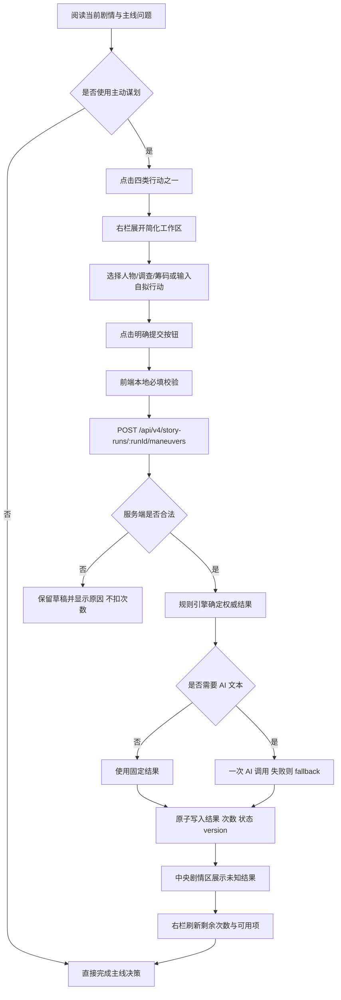

# Our Many Worlds：MVP 主动谋划四按钮页面与分阶段开发实施方案 v2.0

> 文档状态：可直接进入开发  
> 产品范围：当前 Web 单人 MVP，《桑田诏：嘉靖财政危局》  
> 正式页面：现有 `/game?runId=<runId>` 三栏主游戏页  
> 审计仓库：`forwardFish/aiStoryRoom`  
> 审计基线：远程 `main@e60dfd8fc9dda0459edbd37fe6be52ecd8dff1d6`  
> 建议开发分支：`feat/mvp-four-maneuver-actions`  
> 文档日期：2026-08-06  
> 文档用途：交给 ChatGPT Pro / Codex，按阶段开发、测试、提交并推送远程分支

---

# 0. 文档结论

本方案正式锁定 MVP 的四个主动谋划入口：

```text
人物交谈
派遣调查
使用筹码
自拟谋划
```

四个入口在玩家心智上是**平级、独立、简单的四种行动**：

| 入口 | 玩家在做什么 | 主要乐趣 |
|---|---|---|
| 人物交谈 | 找一个当前相关人物说话 | 不知道对方会怎样回应、是否说真话 |
| 派遣调查 | 调查当前剧情预先提供的一件事 | 不知道调查后会发现什么 |
| 使用筹码 | 打出一张私有的一次性暗牌 | 不知道现在是不是最佳出牌时机 |
| 自拟谋划 | 自己提出一项当前阶段可执行的行动 | 不知道系统会怎样裁定和反馈 |

玩家只需要记住：

```text
交谈：问人
调查：查事
筹码：出牌
自拟：自己想办法
```

本版本明确取消旧方案中的以下复杂设计：

```text
AI 行动预演；
人物接触渠道分类；
调查痕迹—路线—执行者—异步返回；
筹码附加、伏置、应变、冷却、触发脚本；
证据等级、证据组合、复杂卡牌状态；
人物交谈前展示预计回应、暴露风险等信息；
调查前展示“可能查明什么、不能证明什么”等结果提示。
```

MVP 的核心不是让规则看起来完整，而是快速验证：

```text
人物回应是否有意思；
调查得到的新信息是否会改变主线选择；
一次性筹码是否会制造“现在用还是留到以后”的纠结；
自拟谋划是否能让玩家感到自己有主动性。
```

---

# 1. 本文档与旧方案的关系

本方案替代《Our Many Worlds：人物交谈、派遣调查、筹码布局页面与开发规则 v1.0》中针对 MVP 的以下内容：

| 旧方案 | 本方案 |
|---|---|
| “筹码布局”包含 ATTACH / ACTIVE / SET / REACTION | 只保留“使用一张一次性筹码” |
| 所有行动先预演再确认 | 直接提交，不做 AI 预演 |
| 人物有 PRESENT / SUMMON / MESSAGE / INTERMEDIARY | 列表里的人即可交谈，不再展示渠道分类 |
| 调查从痕迹进入多条路线 | 当前剧情直接提供 0—2 个固定调查项 |
| 调查可能下一轮或事件触发后返回 | 调查提交后立即返回固定结果 |
| 筹码附加到交谈、调查或自拟行动 | 筹码本身就是一次独立行动 |
| 筹码有锁定、冷却、伏置、过期 | 只保留 AVAILABLE / USED |
| 复杂中央工作台 | 复用当前右栏简化工作区 |

保留旧方案中仍然必要的工程保护：

```text
服务端权威扣减次数；
乐观锁 version；
幂等键；
双击保护；
ActionGuard；
失败不扣次数；
筹码消耗与结果写入必须原子完成；
结果写入同一剧情时间线；
AI 不能直接修改权威状态。
```

---

# 2. 当前代码审计结论

## 2.1 已经存在的能力

当前远程 `main` 已经具备以下基础，不需要重建：

```text
现有 /game 三栏主页面；
右栏“谋划中枢”；
人物交谈 / 派遣调查 / 使用筹码 / 自拟谋划四个入口；
POST /api/v4/story-runs/:runId/maneuvers；
每天 2 次谋划机会；
version 乐观锁；
idempotencyKey 幂等提交；
ActionGuard 拒绝自拟越权行为；
StoryRun 快照 + StoryEvent 事件流；
文件存储与 Prisma 存储的原子保存；
谋划结果写回中央剧情流；
AI 失败后的确定性 fallback；
现有 Web JSDOM 测试和 `pnpm test:maneuver` 验收入口。
```

## 2.2 当前主要文件

| 文件 | 当前职责 | 本次处理 |
|---|---|---|
| `apps/web/public/app.js` | `/game` 页面、四按钮、右栏工作区、提交与结果流 | 重点修改 |
| `apps/web/public/api-story-storage.js` | 浏览器 API 适配器 | 修正四类请求字段 |
| `apps/web/public/main-game.css` | 主游戏页面和谋划面板基础样式 | 重点修改 |
| `apps/web/public/game-premium.css` | 高级视觉覆盖 | 只做必要兼容，避免重复规则 |
| `apps/web/tests/maneuver-ui.test.mjs` | 主动谋划 JSDOM 测试 | 重写并扩展 |
| `apps/api/src/story.controller.ts` | `/maneuvers` 控制器 | 尽量保持路由不变 |
| `apps/api/src/story.service.ts` | 委托 `MvpStoryEngine` | 基本保持不变 |
| `apps/api/src/mvp-causal-runtime.ts` | 谋划校验、结算、事件、投影 | 重点重构 |
| `apps/api/src/mvp-types.ts` | MVP 运行态类型 | 扩展 |
| `apps/api/src/mvp-narrative-provider.ts` | DeepSeek 剧情表达 | 增加人物交谈/筹码回应方法 |
| `apps/api/src/mvp-storage.ts` | 文件原子存储 | 不改合同，做回归 |
| `apps/api/src/prisma-mvp-storage.ts` | `stateJson + StoryEvent` 持久化 | 不需要数据库迁移 |
| `scripts/e2e/mvp-acceptance-matrix.ts` | MVP 谋划、并发、失败验收 | 扩展 |

建议新增：

```text
apps/api/src/mvp-maneuver-config.ts
```

该文件只保存《桑田诏》当前 12 个剧情环节的：

```text
可交谈人物；
固定调查项；
当前可打出的筹码；
对应固定规则补丁与 fallback 文案。
```

不要把这些内容继续硬编码在 `apps/web/public/app.js`。

## 2.3 当前必须修复的问题

### 问题 A：可交谈人物和调查项写死在前端

当前 `app.js` 无论剧情走到哪一天，都可能显示同一批人物和同一批调查项。

结果：

```text
页面内容与当前剧情脱节；
客户端可以伪造本场景不该出现的调查；
换世界时必须改前端代码；
前端成为规则来源。
```

修复：

> 服务端根据当前 `activeDecision.decisionKey` 生成 `maneuverPanel` 投影，前端只负责展示。

### 问题 B：人物交谈输入可能在 API 适配器中丢失

当前浏览器适配器只在 `maneuverType === "custom"` 时保留 `customText`，人物交谈虽然有输入框，真实请求可能被清空。

修复：

```text
人物交谈使用独立字段 messageText；
自拟谋划继续使用 customText；
调查不发送自由文本；
筹码不发送自由文本。
```

### 问题 C：调查结果没有真正使用玩家选择的调查项

当前后端无论选择哪个 `intentKey`，都会返回接近同一段“调查驿站与粮路”的通用结果。

修复：

> 每个 `investigationKey` 必须绑定一个预设结果、事实标记、状态补丁和时间线文案。

### 问题 D：调查会自动制造无关关键事件

当前调查成功后可能统一触发一个固定关键事件，与所选调查内容没有严格关系。

修复：

```text
MVP 默认调查不自动创建关键事件；
只有某个调查配置明确声明 followUpEventKey 时才允许触发；
第一版建议所有固定调查都不创建额外关键事件。
```

### 问题 E：筹码只记录“用过”，但前台仍可能继续显示

当前使用筹码后写入 `usedLeverageKeys`，但左栏 `player.leverage` 和右栏 fallback 数据仍可能继续显示该筹码。

修复：

```text
服务端投影只返回尚未使用且当前场景允许使用的筹码；
左栏“我的筹码”只显示整局仍未使用的筹码；
使用成功后立即从手牌中消失；
刷新页面或重新登录后仍然消失。
```

### 问题 F：人物交谈目前不是“人物真实回应”

当前结果主要是统一模板：“对方没有立即表态，只留下一条线索”。

修复：

> 人物交谈正式提交后，允许一次 AI 调用生成目标人物的具体回应；规则引擎提前确定所有状态变化，AI 只写人物回应和剧情表达。

---

# 3. MVP 唯一全局规则

## 3.1 每日谋划次数

当前项目继续采用：

```text
第 1—6 天：每天 2 次主动谋划；
第 7 天：不能再使用主动谋划；
成功提交：消耗 1 次；
ActionGuard 拒绝：不消耗；
版本冲突或请求失败：不消耗；
未使用机会：日终失效，不结转；
进入下一天：恢复为 2 / 2。
```

必须区分两个概念：

```text
当前剧情环节决定“现在有什么可以做”；
每日谋划额度决定“今天还能做几次”。
```

第一项主线决策完成后，如果当天还有第二项主线决策：

```text
剩余谋划次数保留；
可交谈人物、调查项和可用筹码根据新剧情环节刷新。
```

第二项主线决策完成、进入日终后：

```text
剩余谋划立即失效；
四个按钮全部禁用；
不能在 awaiting_day_advance 阶段补用谋划。
```

## 3.2 每种行动每天最多一次

MVP 固定：

```text
人物交谈：每天最多 1 次；
派遣调查：每天最多 1 次；
使用筹码：每天最多 1 次；
自拟谋划：每天最多 1 次；
总计仍然只能成功使用 2 次。
```

例如：

```text
今天已经使用人物交谈；
剩余 1 次谋划；
玩家只能从调查、筹码、自拟谋划中再选一个。
```

这样做的原因：

```text
控制 AI 调用成本；
避免玩家把两次机会都变成连续追问；
鼓励玩家在“问人、查事、出牌、自由行动”之间取舍；
页面禁用逻辑简单；
内容产能可控。
```

## 3.3 不做 AI 预演

四类主动谋划都不采用：

```text
输入
→ AI 预演
→ 再确认
→ 再调用 AI
→ 正式结果
```

统一采用：

```text
选择 / 输入
→ 点击明确提交按钮
→ 服务端校验
→ 正式结算
→ 展示未知结果
```

提交按钮就是最终确认：

```text
发送给卢象升
开始调查
使用并消耗“田契暗账（半页）”
执行谋划
```

提交前只做本地必填校验，不调用 AI，不展示结果预测。

## 3.4 四种行动是否调用 AI

| 行动 | 正常 AI 调用 | 说明 |
|---|---:|---|
| 人物交谈 | 1 次 | 生成目标人物的具体回应 |
| 派遣调查 | 0 次 | 结果由剧情配置预先确定 |
| 使用筹码 | 0 或 1 次 | 固定效果 0 次；人物特殊回应 1 次 |
| 自拟谋划 | 保留当前规则 | ActionGuard + 确定性 fallback；本阶段不重建完整自由行动引擎 |

任何动作都不能为了“预演”增加第二次 AI 调用。

这里的“一次 AI 调用”指一次正式的逻辑生成任务。Provider 可以沿用当前最多 2 次的短暂网络重试，但不能先调用一次预演、再调用一次正式结果。验收需要分别记录逻辑任务数和底层 HTTP attempt 数。

---

# 4. `/game` 页面总体 UI

## 4.1 继续使用现有三栏结构

```text
┌──────────────┬─────────────────────────────────┬───────────────────┐
│ 左栏         │ 中央剧情区                      │ 右栏主动谋划      │
│              │                                 │                   │
│ 我的身份     │ 连续剧情                        │ 今日谋划 2 / 2    │
│ 当前目标     │ 主线决策                        │ 人物交谈          │
│ 我的资源     │ 谋划结果                        │ 派遣调查          │
│ 我的筹码     │ AI 推演状态                     │ 使用筹码          │
│ 当前风险     │ 日终与结局                      │ 自拟谋划          │
└──────────────┴─────────────────────────────────┴───────────────────┘
```

不新增：

```text
/maneuver 路由；
独立全屏谋划页；
平行主游戏页；
测试专用页面；
复杂中央谋划工作台；
新的 React / Next.js 页面。
```

## 4.2 为什么继续使用右栏工作区

当前代码已经在右栏切换四类工作区。为了最快实现 MVP，本次不再引入新的模态框或中央工作台。

右栏工作区只保留最少字段：

```text
人物交谈：人物列表 + 一个输入框；
派遣调查：固定调查卡 + 一个提交按钮；
使用筹码：筹码卡 + 可选目标 + 一个提交按钮；
自拟谋划：一个 200 字输入框 + 一个提交按钮。
```

由于表单已经被压缩，不再存在“在狭小右栏塞复杂表单”的问题。

## 4.3 右栏最终线框

```text
主动谋划                                  2 / 2
未使用机会将在今日结束时失效

┌────────────────────────────────────┐
│ 人物交谈                       3 人 │
│ 与当前相关人物交谈                  │
└────────────────────────────────────┘

┌────────────────────────────────────┐
│ 派遣调查                       1 项 │
│ 调查当前剧情提供的异常              │
└────────────────────────────────────┘

┌────────────────────────────────────┐
│ 使用筹码                       2 张 │
│ 打出一张秘密筹码，用后消失          │
└────────────────────────────────────┘

┌────────────────────────────────────┐
│ 自拟谋划                            │
│ 自己决定要推进的一件事              │
└────────────────────────────────────┘

当前选择对应的简化工作区
```

四张行动卡采用纵向排列，不再使用过小的 2×2 文字按钮。

## 4.4 初始状态

进入新的剧情环节时：

```text
四张行动卡可见；
默认不展开任何工作区；
activeManeuverType = null；
玩家先阅读中央剧情，再决定是否打开某种谋划。
```

旧代码默认打开“自拟谋划”，本次改为默认全部收起。

## 4.5 点击后的行为

```text
点击一张行动卡
→ 该卡高亮
→ 右栏下方展开对应简化工作区
→ 其他三张行动卡仍然可见
→ 不跳转页面
→ 不调用 AI
→ 不扣次数
→ 玩家可随时切换到另一类行动
```

选择人物、调查项或筹码时也不自动提交。

## 4.6 成功提交后的行为

```text
提交按钮进入 loading；
四张行动卡临时禁用，防止双击和并发重复操作；
AI 动作显示现有“AI 正在推演局势……”；
固定调查显示短暂“正在核对……”；
服务端返回最新 GameProjection；
中央区域播放谋划结果；
右栏更新剩余次数；
已使用的行动类型变为“今日已使用”；
已消耗筹码从左栏和右栏消失；
activeManeuverType 重置为 null。
```

## 4.7 统一按钮状态

### 全局可用条件

四类行动都必须满足：

```text
run.currentDay 在 1—6；
run.status === "awaiting_decision"；
当前存在 activeDecision；
maneuverOpportunitiesRemaining > 0；
页面不在 busy / resolving；
当前客户端持有最新 version。
```

### 每类额外条件

| 行动 | 额外可用条件 |
|---|---|
| 人物交谈 | 今日未使用；当前场景至少 1 个可交谈人物 |
| 派遣调查 | 今日未使用；当前场景至少 1 个调查项 |
| 使用筹码 | 今日未使用；至少 1 张未消耗且当前场景允许使用的筹码 |
| 自拟谋划 | 今日未使用；当前场景允许自拟谋划 |

### 页面禁用文案

优先级从高到低：

```text
AI 正在推演局势……
今日谋划机会已用完
今日已使用人物交谈 / 派遣调查 / 使用筹码 / 自拟谋划
当前没有可交谈人物
当前没有可调查事项
当前剧情没有合适的出牌时机
当前阶段不能自拟谋划
今日剧情已经结束
```

禁用原因直接显示在卡片副标题中，不依赖 tooltip。

---

# 5. 人物交谈

## 5.1 使用场景

当玩家想解决的是下面这些问题时，使用人物交谈：

```text
他愿不愿意支持我？
他如何解释刚才的行为？
他会不会承认某件事？
他愿意提出什么条件？
我要怎样试探他？
我要不要把某条信息告诉他？
```

人物交谈改变的是：

```text
对方获得了玩家的信息；
对方对玩家作出一次具体回应；
双方关系或警惕度可能发生规则预设的小幅变化；
该回应成为后续剧情可引用的事实。
```

人物交谈不保证：

```text
对方说真话；
对方接受条件；
对方立即执行玩家要求；
对方公开自己全部信息；
玩家输入的话自动变成已经发生的世界事实。
```

## 5.2 MVP 不再区分联络渠道

正式规则：

> 出现在当前“人物交谈”列表里的人，现在就能联系；没有出现在列表里的人，现在不能联系。

不再向玩家展示：

```text
当前在场；
召见；
传信；
中间人；
回应时间；
暴露风险。
```

人物是否当面、通过召见或口信回应，由 AI 在结果叙事中自然表达。

## 5.3 人物卡显示内容

每张卡只显示：

```text
头像；
姓名；
公开身份；
为什么当前值得联系。
```

示例：

```text
卢象升
清流县令
掌管本次复核涉及的县衙原册
```

不要显示：

```text
接触方式；
预计回应；
可能暴露；
证据权限；
可见范围；
关系计算明细。
```

## 5.4 页面点击顺序

```text
1. 玩家点击【人物交谈】。
2. 右栏展开当前场景可交谈人物。
3. 玩家点击一个人物卡。
4. 人物卡高亮，显示输入框。
5. 玩家输入最多 200 字。
6. 玩家点击【发送给卢象升】。
7. 前端做必填和长度校验。
8. 前端提交一次正式请求。
9. 服务端验证目标、次数、场景、version 和幂等键。
10. 服务端确定权威状态补丁。
11. 服务端调用一次 AI 生成该人物回应；失败则使用固定 fallback。
12. 服务端原子写入结果、事件、次数和 version。
13. 中央剧情区展示回应。
14. 人物交谈卡显示“今日已使用”。
```

## 5.5 页面线框

```text
人物交谈
选择一个当前相关人物

┌──────────────────────────────────┐
│ [头像] 卢象升                    │
│        清流县令                  │
│        掌管本次复核涉及的原册    │
└──────────────────────────────────┘

┌──────────────────────────────────┐
│ [头像] 江南商会会首              │
│        商会代表                  │
│        掌握近期田亩与粮路交易    │
└──────────────────────────────────┘

你想对卢象升说什么？
┌──────────────────────────────────┐
│ 原始底册是否完整？明日之前能否   │
│ 全部送交总督府？                 │
└──────────────────────────────────┘
                                  38 / 200

[发送给卢象升]
```

## 5.6 前端请求

```ts
interface ContactManeuverCommand {
  maneuverType: "contact";
  targetRoleKey: string;
  messageText: string;
  version: number;
  idempotencyKey: string;
}
```

示例：

```json
{
  "maneuverType": "contact",
  "targetRoleKey": "county_magistrate",
  "messageText": "原始底册是否完整？明日之前能否全部送交总督府？",
  "version": 12,
  "idempotencyKey": "d56d7d99-9b30-4c40-9ca2-7c644be32939"
}
```

人物交谈不再复用 `customText`。

## 5.7 后端处理流程

```text
读取 StoryRun
→ 检查同一 idempotencyKey 是否已完成
→ 检查 version
→ 检查 run.status === awaiting_decision
→ 检查剩余谋划 > 0
→ 检查 contact 今日未使用
→ 读取当前 sceneKey
→ 检查 targetRoleKey 是否存在于服务端当前 contact options
→ 检查 messageText 非空且 ≤ 200 字
→ 读取该人物的固定 statePatch 与可见事实范围
→ 构建权威 ContactResolutionPlan
→ 调用 AI 生成 replyText / narrative
→ AI 输出校验，失败使用 fallback
→ 应用规则补丁
→ 写入 maneuver_result 与 contact_resolved 事件
→ usedTypesToday 加入 contact
→ 剩余谋划 -1
→ version +1
→ 原子保存
→ 返回新的完整公共投影
```

## 5.8 AI 权责边界

规则引擎在调用 AI 前已经决定：

```text
目标是谁；
玩家说了什么；
目标依法知道哪些事实；
关系或状态怎样变化；
这次回应能否产生新事实；
哪些事实不能被确认；
fallback 回应是什么。
```

AI 只返回：

```ts
interface ContactNarrativeCandidate {
  title: string;
  narrative: string;
  replyText: string;
}
```

AI 不能返回或修改：

```text
statePatch；
关系数值；
证据真实性；
筹码状态；
主线选项；
结局；
下一天；
角色未依法知道的秘密。
```

系统提示至少包含：

```text
你只扮演指定人物作出一次回应；
可以回避、拒绝、试探、说部分真话或提出条件；
不能替玩家作决定；
不能宣布未提供的世界事实；
不能直接完成玩家要求的世界行动；
只输出 JSON。
```

## 5.9 AI 失败

AI 超时、返回非法 JSON 或预算耗尽时：

```text
使用场景配置中的 fallbackReply；
人物交谈仍然成功；
只消耗一次谋划；
记录 AiTask.status = fallback；
不向玩家显示技术错误；
不重复扣次数。
```

## 5.10 结果示例

```text
人物回应

你派人向卢象升递去口信。

卢象升回道：
“原册大体还在，只是几册昨日才从库房送回。
若总督大人一定要明日查验，我可以先交出清单，
但原件是否齐全，我现在不敢作保。”
```

乐趣来自：

```text
他说的是否真实？
为什么不敢保证原件齐全？
“昨日才送回”意味着什么？
我接下来要调查，还是先做主线选择？
```

---

# 6. 派遣调查

## 6.1 使用场景

派遣调查不是自由提问框。

它只在剧情设计者预先配置的环节出现：

```text
到了某个剧情节点；
系统提供 0—2 个具体调查项；
玩家可以选择调查；
也可以完全跳过并继续主线故事。
```

玩家不能输入：

```text
巡抚是不是幕后主使？
哪个主线选项最好？
商会到底是不是坏人？
```

## 6.2 调查卡显示内容

只显示：

```text
调查标题；
一句当前原因；
开始调查按钮。
```

不显示：

```text
调查路线；
执行者；
预计返回时间；
风险；
可能查明什么；
不能证明什么；
结果等级；
成功率。
```

示例：

```text
核对田亩底册
复核清单与县衙旧册存在差异。

[开始调查]
```

## 6.3 页面点击顺序

### 当前只有一个调查项

```text
1. 玩家点击【派遣调查】。
2. 右栏直接展示唯一调查卡，并自动选中。
3. 玩家点击【开始调查】。
4. 服务端验证并立即返回预设结果。
5. 中央剧情区展示调查结果。
6. 派遣调查卡显示“今日已使用”。
```

### 当前有两个调查项

```text
1. 玩家点击【派遣调查】。
2. 右栏展示两张调查卡。
3. 玩家选择其中一张。
4. 选中卡高亮。
5. 玩家点击【开始调查】。
6. 服务端立即返回该调查项的预设结果。
```

## 6.4 前端请求

继续复用现有字段 `intentKey`，避免无意义改名：

```ts
interface InvestigationManeuverCommand {
  maneuverType: "investigate";
  intentKey: string;
  version: number;
  idempotencyKey: string;
}
```

示例：

```json
{
  "maneuverType": "investigate",
  "intentKey": "inspect_land_register_binding",
  "version": 13,
  "idempotencyKey": "719698e1-8207-4949-b35c-831759404d52"
}
```

不发送：

```text
targetRoleKey；
customText；
路线；
执行者；
成功率；
玩家自己编造的调查结果。
```

## 6.5 后端处理流程

```text
读取 StoryRun
→ 幂等检查
→ version 检查
→ 全局谋划窗口检查
→ investigate 今日未使用
→ 读取当前 sceneKey
→ 检查 intentKey 是否属于当前场景
→ 读取预设 resultText / factKeys / statePatch / traces
→ 应用固定规则结果
→ 写入 discoveredFactKeys
→ 写入时间线 maneuver_result
→ 写入 investigation_resolved / state_patch / fact_discovered 事件
→ usedTypesToday 加入 investigate
→ 剩余谋划 -1
→ version +1
→ 原子保存
→ 返回最新投影
```

## 6.6 不调用 AI

首版调查：

```text
事实：预先配置；
结果：预先配置；
状态补丁：预先配置；
剧情文案：预先配置；
AI 调用：0 次。
```

这样可以保证：

```text
调查结果稳定；
不会越权生成事实；
没有额外等待；
没有额外模型成本；
每个结果都能测试；
同一事实不会在不同运行中自相矛盾。
```

## 6.7 调查立即返回

MVP 不创建长期调查任务。

统一：

```text
点击开始调查
→ 短暂 loading
→ 立即获得结果
```

不做：

```text
下一轮返回；
主线锁定前返回；
事件触发时返回；
后台异步调查；
调查进度 1 / 3。
```

## 6.8 调查是可选的，但必须有价值

不调查：

```text
不会卡住故事；
不会阻止主线选择；
不会导致任务失败提示；
故事正常继续。
```

调查后至少产生：

```text
一条玩家此前不知道的具体信息；
一个 discoveredFactKey；
一段可被后续 AI 和结局引用的记录；
一个小幅、规则固定的状态补丁。
```

第一版不要求调查解锁隐藏主线选项，避免扩大范围。

## 6.9 不再自动触发固定关键事件

当前代码中调查可能统一触发一个固定“巡抚怀疑”关键事件。本次删除这种通用联动。

MVP 规则：

```text
调查只产生自身结果；
后续主线根据 discoveredFactKeys 自然引用；
不额外插入关键事件；
不改变每天固定 2 次主线决策。
```

## 6.10 结果示例

```text
调查结果 · 核对田亩底册

幕僚逐页比对后发现，其中三页纸张明显较新，
装订孔也与整册其他页面不一致。

原始底册曾被拆开并重新装订。
```

这里不需要再告诉玩家：

```text
“不能证明谁授意”；
“证据等级为佐证”；
“调查可能惊动谁”。
```

这些复杂边界由后台事实合同控制，不需要全部显示在 MVP 页面上。

---

# 7. 使用筹码

## 7.1 筹码定义

MVP 的筹码是：

> 玩家私下持有、整局数量有限、由玩家选择时机打出、使用后永久消失的一次性暗牌。

暗牌只包含三层含义：

```text
其他角色不知道玩家手里有哪些筹码；
玩家自己决定什么时候打出；
成功使用后从手牌中永久消失。
```

暗牌不等于：

```text
提前伏置；
自动触发；
脚本条件；
应变卡；
冷却卡；
可重复技能。
```

## 7.2 整局数量

当前浙江总督首版拥有 3 张筹码：

```text
田契暗账（半页）
清流县令密信
巡抚与商会旧约传闻
```

整局不刷新，不恢复，不合成，不交易。

状态只有：

```text
AVAILABLE
USED
```

## 7.3 左栏显示

左栏“我的筹码”只显示未使用筹码：

```text
我的筹码 3

田契暗账（半页）
清流县令密信
巡抚与商会旧约传闻
```

使用成功后立即从左栏移除。

所有筹码用完后：

```text
我的筹码
已无可用筹码
```

不显示灰色已用卡，使用记录已经存在于中央剧情和历史记录中。

## 7.4 右栏筹码卡显示内容

每张卡只显示：

```text
名称；
一句用途；
“使用后消失”。
```

示例：

```text
田契暗账（半页）
向相关人物出示暗账，触发一次围绕具体地号的特殊回应。
使用后消失
```

不显示：

```text
卡牌类型；
规则枚举；
冷却；
持续时间；
反制；
复杂目标范围；
成功率；
隐藏数值补丁。
```

## 7.5 当前什么时候可以使用

筹码必须同时满足：

```text
仍在玩家手中；
当前剧情环节配置允许该筹码；
今日尚未使用“使用筹码”；
仍有谋划次数；
如果需要目标，当前至少有一个合法目标。
```

玩家左栏可能仍然持有某张筹码，但当前右栏不允许打出。

此时【使用筹码】卡显示：

```text
当前剧情没有合适的出牌时机
```

不需要展示复杂的规则原因。

## 7.6 页面点击顺序

```text
1. 玩家点击【使用筹码】。
2. 右栏展示当前场景允许使用且尚未消耗的筹码。
3. 玩家点击一张筹码。
4. 筹码卡高亮。
5. 如果该筹码需要目标，显示合法目标列表。
6. 玩家选择目标。
7. 页面显示不可逆提交按钮。
8. 玩家点击【使用并消耗“筹码名称”】。
9. 服务端验证持有权、场景、目标、次数、version 和幂等键。
10. 服务端生成固定结果或一次人物特殊回应。
11. 筹码状态原子变为 USED。
12. 剩余谋划 -1。
13. 中央剧情区展示结果和“筹码已消耗”。
14. 该筹码从左栏和右栏消失。
```

## 7.7 页面线框

```text
使用筹码
选择一张秘密筹码

┌──────────────────────────────────┐
│ 田契暗账（半页）                 │
│ 向相关人物出示暗账，触发一次     │
│ 围绕具体地号的特殊回应。         │
│                                  │
│ 使用后消失                       │
└──────────────────────────────────┘

使用对象
[卢象升] [江南商会会首]

[使用并消耗“田契暗账（半页）”]
```

筹码不再出现自由文本框。

玩家选择的是：

```text
用哪张牌；
必要时对谁用；
现在是否值得消耗。
```

系统不再要求玩家额外解释“准备用这张牌迫使对方做什么”。

## 7.8 前端请求

继续保留现有 API 命名 `maneuverType: "leverage"` 和 `leverageKey`，避免无收益的迁移：

```ts
interface LeverageManeuverCommand {
  maneuverType: "leverage";
  leverageKey: string;
  targetRoleKey?: string;
  version: number;
  idempotencyKey: string;
}
```

示例：

```json
{
  "maneuverType": "leverage",
  "leverageKey": "land_contract_fragment",
  "targetRoleKey": "merchant",
  "version": 14,
  "idempotencyKey": "cf26e960-eafb-4306-a392-80e4340f94fc"
}
```

不发送 `customText`。

## 7.9 后端原子流程

```text
读取 StoryRun
→ 幂等检查
→ version 检查
→ 全局谋划窗口检查
→ leverage 今日未使用
→ 检查筹码属于玩家且未使用
→ 检查当前 sceneKey 允许该筹码
→ 检查目标合法
→ 读取筹码固定 statePatch / fact / fallback
→ 如需人物回应，调用一次 AI
→ AI 失败时使用 fallback
→ 在同一个待保存快照中：
   - 应用状态补丁
   - usedLeverageKeys 加入 leverageKey
   - usedTypesToday 加入 leverage
   - 剩余谋划 -1
   - 写入结果和事件
   - version +1
→ 原子保存
→ 返回最新投影
```

必须保证：

```text
不能先消耗筹码再生成结果；
不能结果失败但筹码已经消失；
不能重复请求消耗两次；
不能两个标签页同时使用同一张筹码；
不能版本冲突后仍扣筹码。
```

## 7.10 固定效果与人物回应

后端支持两种内部解析模式：

```ts
type LeverageResolutionMode = "FIXED" | "AI_REACTION";
```

### FIXED

```text
不调用 AI；
使用预设结果文本；
应用预设状态补丁；
适合传递消息、调用渠道、解锁固定信息。
```

### AI_REACTION

```text
规则引擎先确定补丁和事实边界；
AI 只生成目标人物的一次特殊回应；
失败使用固定 fallback；
逻辑调用最多一次。
```

## 7.11 三张首发筹码

### 田契暗账（半页）

```text
chipId：land_contract_fragment
模式：AI_REACTION
目标：清流县令 / 江南商会会首 / 浙江巡抚
玩家说明：向相关人物出示暗账，触发一次围绕具体地号的特殊回应。
保证：目标必须围绕暗账作出一次反应。
不保证：目标承认责任；暗账证明完整交易链。
```

### 清流县令密信

```text
chipId：county_letter
模式：AI_REACTION
目标：浙江巡抚 / 江南商会会首 / 内阁财政派 / 司礼监织造使
玩家说明：出示县令密信，触发一次围绕经手人与日期的特殊回应。
保证：目标看到密信涉及的具体事项并回应。
不保证：密信内容自动成为已确认事实。
```

### 巡抚与商会旧约传闻

```text
chipId：xunfu_merchant_old_pact_rumor
模式：AI_REACTION
目标：浙江巡抚 / 江南商会会首
玩家说明：以旧约传闻试探巡抚或商会，观察一次特殊反应。
保证：获得目标的一次特殊反应。
不保证：传闻升级为事实；目标说真话。
```

## 7.12 结果示例

```text
筹码已打出 · 田契暗账（半页）

你把那半页暗账放到商会会首面前。

会首扫过其中几个地号，原本从容的神情停了一瞬：
“总督大人既然已经看到了这些编号，
便也该知道，这件事不可能只由商会一家决定。”

筹码已消耗：田契暗账（半页）
```

---

# 8. 自拟谋划

## 8.1 保留原因

自拟谋划必须保留，因为它承担三个作用：

```text
给玩家真正的主动表达空间；
覆盖人物交谈、固定调查和筹码无法表达的行动；
验证玩家是否会提出系统未预设但合理的策略。
```

本阶段不删除、不隐藏、不降级。

## 8.2 适用场景

玩家想做下面这些事情时，使用自拟谋划：

```text
派人调动资源；
下达有限命令；
安排幕僚；
转移某项物资；
控制一条公开口径；
采取当前三个固定入口无法表达的具体行动。
```

## 8.3 页面点击顺序

```text
1. 玩家点击【自拟谋划】。
2. 右栏展开 200 字输入框。
3. 玩家写下一项具体行动。
4. 玩家点击【执行谋划】。
5. 前端校验非空和长度。
6. 服务端执行 ActionGuard。
7. 被拒绝：显示原因和改写建议，不扣次数，保留原文。
8. 被接受：规则引擎生成有限结果，扣 1 次谋划。
9. 中央剧情区展示结果。
10. 自拟谋划卡显示“今日已使用”。
```

## 8.4 页面线框

```text
自拟谋划
写下你准备推进的一件事

┌──────────────────────────────────┐
│ 派幕僚核对驿站登记，确认巡抚急奏 │
│ 的经手人员。                     │
└──────────────────────────────────┘
                                  31 / 200

[执行谋划]
```

## 8.5 前端请求

```ts
interface CustomManeuverCommand {
  maneuverType: "custom";
  customText: string;
  version: number;
  idempotencyKey: string;
}
```

## 8.6 ActionGuard

必须继续拒绝：

```text
超越当前身份和资源；
直接命令其他独立角色认罪或服从；
直接跳到未来阶段；
直接宣布调查结论；
一次输入包含多个互不相关的主要行动；
超过 200 字。
```

拒绝后：

```text
run.version 不变；
谋划次数不变；
usedTypesToday 不变；
输入内容保留；
页面显示可执行的改写建议。
```

## 8.7 本阶段范围

本次开发只要求：

```text
保留现有自拟谋划闭环；
接入新的统一按钮状态和每日类型限制；
修复请求合同；
保证 ActionGuard 拒绝不扣次数；
保证结果写入中央剧情流。
```

不要求在本分支内重建通用自然语言行动编译器。

---

# 9. 四类行动统一页面流程



---

# 10. 服务端投影合同

## 10.1 原则

前端不能再自行定义：

```text
谁可以交谈；
当前有哪些调查；
当前能打出哪些筹码；
某个按钮为什么禁用；
某个筹码有哪些目标。
```

所有可用项由服务端随 `GET /api/v4/story-runs/:runId` 返回。

## 10.2 投影结构

```ts
export type MvpManeuverType =
  | "contact"
  | "investigate"
  | "leverage"
  | "custom";

export interface MvpManeuverPanelProjection {
  sceneKey: string | null;
  enabled: boolean;
  disabledReason: string | null;

  quota: {
    perDay: 2;
    usedToday: number;
    remaining: number;
    usedTypesToday: MvpManeuverType[];
  };

  contact: {
    enabled: boolean;
    usedToday: boolean;
    count: number;
    disabledReason: string | null;
    options: MvpContactOptionProjection[];
  };

  investigate: {
    enabled: boolean;
    usedToday: boolean;
    count: number;
    disabledReason: string | null;
    options: MvpInvestigationOptionProjection[];
  };

  leverage: {
    enabled: boolean;
    usedToday: boolean;
    count: number;
    disabledReason: string | null;
    options: MvpLeverageOptionProjection[];
  };

  custom: {
    enabled: boolean;
    usedToday: boolean;
    disabledReason: string | null;
    maxLength: 200;
  };
}
```

## 10.3 人物投影

```ts
export interface MvpContactOptionProjection {
  roleKey: string;
  displayName: string;
  publicIdentity: string;
  relevance: string;
  portrait?: string;
}
```

不返回：

```text
隐藏目标；
真实动机；
AI 私有上下文；
联络渠道枚举；
预计回应；
内部状态补丁。
```

## 10.4 调查投影

```ts
export interface MvpInvestigationOptionProjection {
  intentKey: string;
  title: string;
  summary: string;
}
```

不返回调查结果和隐藏 factKey。

## 10.5 筹码投影

```ts
export interface MvpLeverageOptionProjection {
  leverageKey: string;
  label: string;
  description: string;
  consumptionLabel: "使用后消失";
  requiresTarget: boolean;
  targets: Array<{
    roleKey: string;
    displayName: string;
  }>;
}
```

只返回：

```text
仍未使用；
当前场景允许；
属于当前玩家；
当前至少有合法目标的筹码。
```

## 10.6 左栏筹码手牌投影

右栏 `maneuverPanel.leverage.options` 只表示“当前场景现在能打出的筹码”，不能直接拿来渲染左栏。左栏必须显示玩家整局仍未消耗的全部手牌，即使某张牌当前不能使用。

新增：

```ts
export interface MvpLeverageHandProjection {
  availableCount: number;
  items: Array<{
    leverageKey: string;
    label: string;
    description: string;
  }>;
}
```

公共投影：

```ts
result.leverageHand = projectLeverageHand(view);
```

区别：

```text
leverageHand：所有尚未使用的筹码，用于左栏；
maneuverPanel.leverage.options：当前场景可立即打出的筹码，用于右栏。
```

`renderLeverage(view)` 必须改为读取 `view.leverageHand.items`，不得继续直接渲染静态 `player.leverage`。

---

# 11. 服务端剧情配置合同

## 11.1 新文件

```text
apps/api/src/mvp-maneuver-config.ts
```

该文件是当前《桑田诏》主动谋划内容的唯一来源。

## 11.2 场景配置

```ts
export interface MvpManeuverSceneConfig {
  sceneKey: string;
  contacts: MvpContactDefinition[];
  investigations: MvpInvestigationDefinition[];
  playableLeverageKeys: string[];
  customEnabled: boolean;
}
```

`sceneKey` 直接使用当前 `activeDecision.decisionKey`：

```text
d1_1
d1_2
d2_1
...
d6_2
```

不新建另一套“场景 ID”。

## 11.3 人物配置

```ts
export interface MvpContactDefinition {
  roleKey: string;
  displayName: string;
  publicIdentity: string;
  relevance: string;
  portrait?: string;

  statePatch: Record<string, number>;
  allowedFactKeys: string[];
  fallbackTitle: string;
  fallbackReply: string;
}
```

`statePatch` 是规则权威，AI 不能修改。

## 11.4 调查配置

```ts
export interface MvpInvestigationDefinition {
  intentKey: string;
  title: string;
  summary: string;

  resultTitle: string;
  resultText: string;
  factKeys: string[];
  statePatch: Record<string, number>;
  traces: string[];
}
```

## 11.5 筹码配置

```ts
export interface MvpLeverageDefinition {
  leverageKey: string;
  label: string;
  description: string;
  resolutionMode: "FIXED" | "AI_REACTION";

  requiresTarget: boolean;
  targetRoleKeys: string[];
  availableSceneKeys: string[];

  statePatch: Record<string, number>;
  factKeys: string[];
  resultTitle: string;
  fixedResultText?: string;
  fallbackReply?: string;
}
```

不增加：

```text
触发脚本；
冷却；
持续时间；
伏置状态；
任意条件 DSL；
多筹码组合。
```

---

# 12. 客户端统一请求合同

```ts
export type MvpManeuverCommand =
  | {
      maneuverType: "contact";
      targetRoleKey: string;
      messageText: string;
      version: number;
      idempotencyKey: string;
    }
  | {
      maneuverType: "investigate";
      intentKey: string;
      version: number;
      idempotencyKey: string;
    }
  | {
      maneuverType: "leverage";
      leverageKey: string;
      targetRoleKey?: string;
      version: number;
      idempotencyKey: string;
    }
  | {
      maneuverType: "custom";
      customText: string;
      version: number;
      idempotencyKey: string;
    };
```

浏览器 API 适配器必须显式构造字段，不再使用无边界的 `{ ...input }` 后再覆盖。

示意：

```js
async submitManeuver(view, input) {
  const common = {
    maneuverType: input.maneuverType,
    version: view.run.version,
    idempotencyKey: input.idempotencyKey || crypto.randomUUID()
  };

  const body = input.maneuverType === "contact"
    ? { ...common, targetRoleKey: input.targetRoleKey, messageText: input.messageText }
    : input.maneuverType === "investigate"
      ? { ...common, intentKey: input.intentKey }
      : input.maneuverType === "leverage"
        ? { ...common, leverageKey: input.leverageKey, targetRoleKey: input.targetRoleKey || undefined }
        : { ...common, customText: input.customText };

  return this.request(`/v4/story-runs/${encodeURIComponent(view.run.id)}/maneuvers`, {
    method: "POST",
    body
  });
}
```

---

# 13. 运行态数据结构

## 13.1 `maneuverState`

```ts
export interface MvpManeuverState {
  maneuverOpportunitiesPerDay: 2;
  maneuversUsedToday: number;
  maneuverOpportunitiesRemaining: number;
  totalManeuversUsed: number;

  usedTypesToday: MvpManeuverType[];
  usedLeverageKeys: string[];
  discoveredFactKeys: string[];
}
```

## 13.2 初始化

```ts
maneuverState: {
  maneuverOpportunitiesPerDay: 2,
  maneuversUsedToday: 0,
  maneuverOpportunitiesRemaining: 2,
  totalManeuversUsed: 0,
  usedTypesToday: [],
  usedLeverageKeys: [],
  discoveredFactKeys: []
}
```

玩家初始筹码使用稳定 ID 保存：

```ts
player: {
  // 其他现有字段……
  leverageKeys: [
    "land_contract_fragment",
    "county_letter",
    "xunfu_merchant_old_pact_rumor"
  ]
}
```

旧的 `player.leverage: string[]` 可在一个兼容周期内保留，但不能继续作为筹码持有权的权威来源。公共页面改读 `leverageHand`。

## 13.3 日终与下一天

第二个主线决策完成时：

```ts
maneuverState.maneuverOpportunitiesRemaining = 0;
```

进入下一天时：

```ts
maneuverState.maneuversUsedToday = 0;
maneuverState.maneuverOpportunitiesRemaining = 2;
maneuverState.usedTypesToday = [];
```

整局保留：

```text
usedLeverageKeys；
discoveredFactKeys；
totalManeuversUsed。
```

## 13.4 旧存档兼容

`ensureMvpCausalView()` 必须补全新字段。

如果旧存档没有 `player.leverageKeys`，按旧显示名称迁移：

```text
田契暗账（半页） → land_contract_fragment
清流县令密信 → county_letter
巡抚与商会旧约 / 巡抚与商会旧约传闻 → xunfu_merchant_old_pact_rumor
海防军报 → coastal_report（仅兼容旧数据，不作为首版默认手牌）
```

不能简单把 `usedTypesToday` 初始化为空，否则升级前已经使用过谋划的当日存档会获得额外机会。

建议：

```text
如果 usedTypesToday 缺失：
→ 从当前日 maneuver_submitted 事件恢复类型；
→ 去重后写入。

如果 discoveredFactKeys 缺失：
→ 从 fact_discovered 事件恢复；
→ 没有则空数组。

usedLeverageKeys 继续沿用旧字段。
```

---

# 14. 统一后端结算算法

```ts
async function submitManeuver(runId, input) {
  const stored = await storage.load(runId);

  // 1. 幂等重放
  const previous = findManeuverByIdempotency(stored, input.idempotencyKey);
  if (previous) return projectPublicMvpView(stored);

  // 2. 全局守卫
  assertVersion(stored, input.version);
  assertManeuverWindowOpen(stored);
  assertOpportunityRemaining(stored);
  assertTypeUnusedToday(stored, input.maneuverType);

  // 3. 服务端当前可用投影
  const panel = projectManeuverPanel(stored);
  assertCommandExistsInProjection(panel, input);

  // 4. 类型守卫与权威计划
  const plan = compileManeuverResolutionPlan(stored, input);

  // 5. 只在需要时调用一次 AI
  const narrative = await resolveManeuverNarrative(plan, narrativeProvider)
    .catch(() => plan.fallbackNarrative);

  // 6. 在克隆快照内一次性落账
  const view = structuredClone(stored);
  applyPatch(view, plan.statePatch);
  applyFacts(view, plan.factKeys);
  consumeLeverageIfNeeded(view, plan);
  writeManeuverEvents(view, plan, narrative, input.idempotencyKey);
  markManeuverTypeUsed(view, input.maneuverType);
  decrementOpportunity(view);
  bumpVersion(view, stored.run.version);

  // 7. 原子保存
  await storage.save(view, stored.run.version);

  // 8. 返回最新完整投影
  return projectPublicMvpView(view);
}
```

## 14.1 幂等键必须绑定请求指纹

当前实现只按 `idempotencyKey` 查找历史事件。新版本必须同时保存稳定请求指纹：

```ts
requestFingerprint = sha256(canonicalJson({
  maneuverType,
  targetRoleKey,
  messageText,
  intentKey,
  leverageKey,
  customText
}));
```

重放规则：

```text
同一 idempotencyKey + 同一 requestFingerprint：返回原结果；
同一 idempotencyKey + 不同 requestFingerprint：拒绝，错误码 IDEMPOTENCY_KEY_REUSED；
不得把不同动作误当成同一次请求。
```

前端一次点击只生成一次 idempotencyKey；网络重试复用该 key，玩家重新修改并提交则生成新 key。

## 14.2 任何失败都不能部分写入

下列情况全部不扣次数、不消耗筹码、不写 statePatch：

```text
目标不在当前投影；
调查项不在当前投影；
筹码不在手中；
筹码当前不可用；
目标不合法；
类型今日已使用；
没有剩余次数；
version 冲突；
ActionGuard 拒绝；
存储 CAS 失败。
```

AI 失败不属于业务失败，因为有确定性 fallback。

---

# 15. 事件设计

继续以 `StoryEvent` 作为追加式账本，不新增物理表。

## 15.1 通用事件

```text
maneuver_submitted
maneuver_result
state_patch
```

## 15.2 类型事件

### 人物交谈

```text
contact_resolved
```

建议 payload：

```ts
{
  day,
  sceneKey,
  originEventId,
  targetRoleKey,
  messageText,
  idempotencyKey,
  narrativeProvider,
  fallbackUsed
}
```

### 派遣调查

```text
investigation_resolved
fact_discovered
```

### 使用筹码

```text
leverage_used
```

### 自拟谋划

```text
custom_maneuver_resolved
```

## 15.3 可见结果

中央时间线继续使用：

```text
message.type = "maneuver_result"
```

增加：

```ts
{
  maneuverType,
  originEventId,
  consumedLeverageKey?,
  discoveredFactKeys?
}
```

前台不显示内部 factKey，只显示剧情结果。

## 15.4 因果关联

所有谋划结果继续保存 `originEventId`，后续：

```text
主线剧情；
角色反应；
日终回响；
最终裁决；
个人故事总结
```

都可以引用这次谋划。

玩家应该感知到：

```text
我刚才做的事情进入了后面的故事；
不是一次与主线无关的小游戏。
```

---

# 16. AI Provider 扩展

## 16.1 类型扩展

当前 `MvpNarrativeProvider` 只有 `generateDecisionCandidate()`。

建议增加可选方法：

```ts
export interface MvpNarrativeProvider {
  readonly name: string;
  readonly lastCall?: MvpProviderCallMeta;

  generateDecisionCandidate(context: Record<string, unknown>): Promise<unknown>;

  generateManeuverCandidate?(
    context: MvpManeuverNarrativeContext
  ): Promise<MvpManeuverNarrativeCandidate>;
}
```

## 16.2 统一候选结构

```ts
export interface MvpManeuverNarrativeCandidate {
  title: string;
  narrative: string;
  replyText?: string;
}
```

## 16.3 上下文

只给 AI 必要信息：

```ts
interface MvpManeuverNarrativeContext {
  maneuverType: "contact" | "leverage";
  scene: {
    sceneKey: string;
    title: string;
    body: string;
  };
  player: {
    roleName: string;
  };
  target: {
    roleKey: string;
    publicIdentity: string;
    publicGoal: string;
    informationStyle: string;
  };
  playerMessage?: string;
  leverage?: {
    label: string;
    description: string;
  };
  visibleFacts: string[];
  authoritativeResult: {
    stateChangeSummary: string[];
    forbiddenClaims: string[];
  };
}
```

不要发送完整隐藏账本和与目标无关的秘密。

## 16.4 AiTask

人物交谈和 AI_REACTION 筹码记录：

```text
taskType = resolve_maneuver_narrative
```

必须记录：

```text
provider；
status = completed / fallback；
attempts；
elapsedMs；
inputTokens；
outputTokens；
fallbackReason；
originEventId。
```

调查不创建 AiTask。

---

# 17. 《桑田诏》首版场景配置

本表给出可直接落地的第一版内容。文案以后可以调整，但数据结构和规则不应随意改变。

## 17.1 角色目录

```ts
const MANEUVER_ACTORS = {
  xunfu: {
    displayName: "浙江巡抚",
    publicIdentity: "巡抚",
    portrait: "art-avatar-xunfu"
  },
  county_magistrate: {
    displayName: "卢象升",
    publicIdentity: "清流县令",
    portrait: "art-avatar-county"
  },
  merchant: {
    displayName: "江南商会会首",
    publicIdentity: "商会代表",
    portrait: "art-avatar-merchant"
  },
  sili_jian: {
    displayName: "司礼监织造使",
    publicIdentity: "内廷使者",
    portrait: "art-avatar-sili"
  },
  cabinet: {
    displayName: "内阁财政派",
    publicIdentity: "京师阁臣"
  }
};
```

## 17.2 12 个剧情环节内容矩阵

| sceneKey | 当前主线问题 | 可交谈人物 | 固定调查 | 可使用筹码 |
|---|---|---|---|---|
| `d1_1` | 是否准许巡抚立即推进 | 巡抚、县令 | 核对首批名册形成时间 | 暂无 |
| `d1_2` | 如何回应商会 | 商会会首、县令 | 查商会垫粮来源 | 旧约传闻 |
| `d2_1` | 如何处理县令密信 | 县令、巡抚 | 核对密信所列地号 | 县令密信、田契暗账 |
| `d2_2` | 是否公开压巡抚 | 巡抚、县令、商会会首 | 比对三县催报文书 | 县令密信、旧约传闻、田契暗账 |
| `d3_1` | 如何处理巡抚急奏 | 巡抚、县令 | 查验驿站登记 | 县令密信、田契暗账 |
| `d3_2` | 如何处理商会控粮 | 商会会首、县令、巡抚 | 清点商会可放粮库存 | 旧约传闻、田契暗账 |
| `d4_1` | 如何使用暗账 | 县令、商会会首 | 核对田亩底册装订 | 田契暗账、旧约传闻 |
| `d4_2` | 是否制止巡抚灭证 | 巡抚、县令 | 寻找被撤换书吏 | 县令密信、田契暗账 |
| `d5_1` | 如何回应内阁催问 | 内阁财政派、巡抚、县令 | 复核浙江见银进度 | 县令密信、田契暗账 |
| `d5_2` | 如何对待司礼监 | 司礼监织造使、商会会首、巡抚 | 查织造使入府前接触记录 | 旧约传闻、县令密信 |
| `d6_1` | 最终奏报方向 | 内阁财政派、司礼监织造使、县令 | 复核最终奏报证据目录 | 所有仍未使用筹码 |
| `d6_2` | 最后见谁 | 巡抚、县令、商会会首 | 比对三方最后来函 | 所有仍未使用筹码 |

## 17.3 固定调查结果

### `inspect_first_register_timing`

```text
标题：核对首批名册形成时间
说明：首批名册提交得过于迅速。
结果：两份名册初稿的落款时间早于诏令正式送达浙江。
factKey：first_registers_prepared_early
statePatch：暗账完整度 +4，巡抚敌意 +1
```

### `inspect_merchant_grain_source`

```text
标题：查商会垫粮来源
说明：商会承诺的银粮来路并不透明。
结果：三家出粮仓号中，两家与改桑地号存在交叉。
factKey：merchant_grain_linked_to_land_deals
statePatch：暗账完整度 +4，商会清算风险 +2
```

### `inspect_letter_parcels`

```text
标题：核对密信所列地号
说明：县令密信列出了三处可疑田亩。
结果：其中两处在正式报册前已经被改换田类。
factKey：letter_parcels_reclassified_early
statePatch：暗账完整度 +7
```

### `inspect_county_orders`

```text
标题：比对三县催报文书
说明：三县收到的催报格式极为相似。
结果：三份文书的关键批注出自巡抚府同一名书吏。
factKey：county_orders_share_xunfu_clerk
statePatch：暗账完整度 +6，巡抚敌意 +2
```

### `inspect_courier_registry`

```text
标题：查验驿站登记
说明：巡抚急奏离杭的时间和经手人仍不清楚。
结果：急奏子时离杭，登记经手人不是正常驿丞，而是巡抚亲随。
factKey：memorial_handled_by_xunfu_aide
statePatch：暗账完整度 +6，总督权威 +1
```

### `inspect_merchant_grain_store`

```text
标题：清点商会可放粮库存
说明：商会公开的可放粮数量可能被刻意压低。
结果：商会能够立即放出的粮食明显高于其公开承诺。
factKey：merchant_withheld_available_grain
statePatch：粮价 -2，商会清算风险 +4
```

### `inspect_land_register_binding`

```text
标题：核对田亩底册装订
说明：复核清单与县衙旧册存在差异。
结果：三页纸张明显较新，装订孔也与整册其他页面不一致。
factKey：land_register_was_rebound
statePatch：暗账完整度 +9
```

### `inspect_removed_clerk`

```text
标题：寻找被撤换书吏
说明：巡抚突然撤换了参与名册的书吏。
结果：其中一名书吏离开前保存了带编号的抄页。
factKey：removed_clerk_kept_numbered_copy
statePatch：暗账完整度 +8，县令信任 +2
```

### `inspect_reported_silver`

```text
标题：复核浙江见银进度
说明：内阁催问的“见银”数字可能混入尚未兑现的承诺。
结果：上报金额中包含尚未兑付的商会票据。
factKey：reported_silver_includes_unpaid_notes
statePatch：暗账完整度 +3，内阁疑心 +2
```

### `inspect_sili_contacts`

```text
标题：查织造使入府前接触记录
说明：织造使抵达杭州前已经有人先行接触。
结果：织造使入府前曾与商会管事短暂会面。
factKey：sili_met_merchant_before_governor
statePatch：司礼监警惕 +3，商会清算风险 +3
```

### `inspect_final_memorial_evidence`

```text
标题：复核最终奏报证据目录
说明：最后奏报中的每一项说法都必须经得起御前追问。
结果：清弊方向的两项关键指控目前只有抄件，稳局与粮价数据可以核验。
factKey：final_memorial_evidence_gap_known
statePatch：暗账完整度 +5，清算风险 -2
```

### `inspect_last_petitions`

```text
标题：比对三方最后来函
说明：巡抚、县令和商会同时求见，各自都在回避某些内容。
结果：三封来函都没有解释同一批田契编号。
factKey：three_petitions_avoid_same_parcels
statePatch：暗账完整度 +5
```

上述结果是第一版内容基线。开发时可以微调数值，但必须满足：

```text
每项调查有唯一 intentKey；
结果不依赖 AI；
结果不自动制造新关键事件；
结果不直接替玩家决定主线；
结果有稳定 factKey；
不调查也能继续故事。
```

---

# 18. 前端详细实现

## 18.1 状态结构

将当前单一扁平草稿改为四类明确字段：

```js
const state = {
  // 其他现有状态……
  activeManeuverType: null,
  maneuverDraft: {
    contact: {
      targetRoleKey: "",
      messageText: ""
    },
    investigate: {
      intentKey: ""
    },
    leverage: {
      leverageKey: "",
      targetRoleKey: ""
    },
    custom: {
      customText: ""
    }
  },
  maneuverGuard: null
};
```

切换类型不提交动作。

提交成功后只清空成功类型的草稿；ActionGuard 拒绝或网络错误保留草稿。

## 18.2 `renderManeuverPanel()`

不再定义前端常量：

```js
const contacts = [...];
const investigationChoices = [...];
const leverage = [...];
```

改为读取：

```js
const panel = view.maneuverPanel;
```

渲染顺序：

```text
标题与 2 / 2
四张纵向行动卡
当前工作区
错误区
```

删除当前硬编码的“正在推进 2 项”示例内容，除非它来自真实服务端投影。

## 18.3 四个工作区

建议拆为 `app.js` 内四个纯渲染函数，先不引入新的前端框架：

```js
renderContactWorkbench(panel, draft, state)
renderInvestigationWorkbench(panel, draft, state)
renderLeverageWorkbench(panel, draft, state)
renderCustomWorkbench(panel, draft, state)
```

左栏筹码区域：

```js
renderLeverage(view)
```

改为消费 `view.leverageHand.items`；右栏只消费 `view.maneuverPanel.leverage.options`。两者不能混用。

## 18.4 事件绑定

```text
[data-maneuver-type]：只切换 activeManeuverType；
[data-contact-role]：选择人物；
#contactMessageText：保存 messageText；
[data-investigation-key]：选择调查；
[data-leverage-key]：选择筹码；
[data-leverage-target]：选择筹码目标；
#customManeuverText：保存 customText；
#maneuverSubmit：根据 activeManeuverType 构建明确请求。
```

不要继续让多个不同动作共用 `#maneuverCustomText`。

## 18.5 本地校验

```text
contact：人物已选、messageText 非空、≤200；
investigate：intentKey 已选；
leverage：leverageKey 已选，需要目标时目标已选；
custom：customText 非空、≤200。
```

本地校验失败：

```text
不请求 API；
不改变 busy；
显示简短文案；
焦点移到缺失字段。
```

## 18.6 成功与错误

### 成功

```text
acceptView(result)；
startManeuverResultStream(result)；
activeManeuverType = null；
清空成功草稿；
滚动中央结果到顶部；
更新右栏投影。
```

### `VERSION_CONFLICT`

```text
刷新最新 StoryRun；
保留当前草稿；
提示“局势已更新，请重新提交”；
不自动重放动作。
```

### `ACTION_BLOCKED`

```text
展示 reason 和 rewriteSuggestion；
保留输入；
不扣次数。
```

### 筹码不可用

```text
刷新投影；
提示“这张筹码已经使用或当前不能打出”；
不自动选择另一张牌。
```

## 18.7 CSS

主要修改：

```text
apps/web/public/main-game.css
```

必要时在：

```text
apps/web/public/game-premium.css
```

增加同名主题覆盖，但不能维护两套完全不同布局。

建议类名：

```text
.maneuver-action-list
.maneuver-action-card
.maneuver-action-card.is-active
.maneuver-action-card.is-disabled
.maneuver-action-count
.maneuver-workbench
.maneuver-option-card
.maneuver-option-card.is-selected
.maneuver-submit
.maneuver-inline-error
.chip-consumption-note
```

视觉规则：

```text
四张卡全宽纵向排列；
选中卡使用现有金色/紫色强调体系；
禁用卡降低对比度但文字仍清楚；
每张卡高度约 58—68px；
工作区与行动卡之间有 10—12px 间距；
右栏可以滚动；
提交按钮全宽；
危险操作“使用并消耗”文案清楚，但不使用警告红色制造误导；
不改变主游戏整体明亮浅色风格。
```

## 18.8 英文页面兼容

当前代码有 `renderEnglishManeuverPanel()`。

本次不能继续让中文、英文各自硬编码一份人物和调查数据。

统一使用同一个服务端投影，仅替换 UI 标签：

```text
人物交谈 / Contacts
派遣调查 / Investigate
使用筹码 / Use Leverage
自拟谋划 / Custom Maneuver
```

当前《桑田诏》中文内容可保持中文；英文页面至少不能报错或丢失四按钮。

---

# 19. 后端详细实现

## 19.1 `mvp-types.ts`

增加：

```text
MvpManeuverType；
MvpManeuverState 新字段；
MvpManeuverPanelProjection；
人物、调查、筹码投影类型；
MvpManeuverNarrativeCandidate；
MvpNarrativeProvider.generateManeuverCandidate?。
```

## 19.2 `mvp-maneuver-config.ts`

导出：

```ts
export function getManeuverSceneConfig(sceneKey: string): MvpManeuverSceneConfig | null;
export function getLeverageDefinition(leverageKey: string): MvpLeverageDefinition | null;
export function getManeuverActor(roleKey: string): MvpManeuverActorDefinition | null;
```

不得在这个文件里访问数据库或调用 AI。

## 19.3 `projectManeuverPanel(view)`

在 `mvp-causal-runtime.ts` 中增加纯函数：

```ts
export function projectManeuverPanel(view: MvpView): MvpManeuverPanelProjection;
```

输入只读，输出不修改 view。

计算步骤：

```text
sceneKey = activeDecision?.decisionKey || null；
全局窗口是否开启；
当天已使用类型；
当前场景配置；
过滤已使用筹码；
生成每类 enabled / disabledReason / count / options。
```

`projectPublicMvpView()` 返回：

```ts
result.maneuverPanel = projectManeuverPanel(view);
```

不再简单等于 `maneuverState`。

## 19.4 类型校验

建议拆函数：

```ts
assertManeuverWindowOpen(view)
assertManeuverTypeAvailable(view, maneuverType)
assertContactCommand(view, input, panel)
assertInvestigationCommand(view, input, panel)
assertLeverageCommand(view, input, panel)
assertCustomCommand(view, input)
```

错误码：

```text
MANEUVER_WINDOW_CLOSED
MANEUVER_LIMIT_REACHED
MANEUVER_TYPE_ALREADY_USED
CONTACT_TARGET_UNAVAILABLE
CONTACT_MESSAGE_REQUIRED
CONTACT_MESSAGE_TOO_LONG
INVESTIGATION_UNAVAILABLE
LEVERAGE_NOT_AVAILABLE
LEVERAGE_TARGET_REQUIRED
LEVERAGE_TARGET_INVALID
MANEUVER_CUSTOM_TEXT_REQUIRED
ACTION_BLOCKED
VERSION_CONFLICT
```

## 19.5 结果编译

删除当前一个 `buildManeuverResult()` 处理所有动作的通用模板，改为：

```ts
buildContactResolutionPlan(view, command, definition)
buildInvestigationResolutionPlan(view, command, definition)
buildLeverageResolutionPlan(view, command, definition)
buildCustomResolutionPlan(view, command)
```

统一返回：

```ts
interface MvpManeuverResolutionPlan {
  maneuverType: MvpManeuverType;
  originEventId: string;
  sceneKey: string;
  title: string;
  fallbackNarrative: string;
  statePatch: Record<string, number>;
  factKeys: string[];
  traces: string[];
  consumedLeverageKey?: string;
  targetRoleKey?: string;
  needsAiNarrative: boolean;
}
```

## 19.6 调查自动关键事件

删除：

```ts
if (maneuverType === "investigate" && !(view.pendingCriticalEvents || []).length) {
  enqueueCriticalEvent(view, result.originEventId);
}
```

不要用另一个通用条件替代。

## 19.7 数据库

本次不需要 Prisma schema migration，原因：

```text
MVP 权威快照保存在 StoryRun.stateJson；
新增字段属于 stateJson 内部结构；
事件继续写入 StoryEvent.payloadJson；
现有 PrismaMvpStoryStorage 已支持保存完整 stateJson 和新增事件类型。
```

只需要：

```text
回归文件存储；
回归 Prisma 存储；
验证旧 stateJson 经 ensureMvpCausalView 后可读。
```

---

# 20. 分阶段开发与提交计划

## 20.1 分支授权与基线

仓库 `AGENTS.md` 默认要求在 `main` 开发，创建其他分支需要项目所有者提前授权。

本次项目所有者已经在当前需求中明确要求：

```text
基于远程 main 创建新分支；
分阶段实现；
每完成一个阶段提交并推送远程分支。
```

本授权只适用于：

```text
分支：feat/mvp-four-maneuver-actions
范围：本文档定义的主动谋划四按钮 MVP
```

不得据此创建其他分支。

## 20.2 开始前命令

```bash
git fetch origin
git switch main
git pull --ff-only origin main
git status --short
git rev-parse HEAD
```

审计基线为：

```text
e60dfd8fc9dda0459edbd37fe6be52ecd8dff1d6
```

如果执行时 `origin/main` 已经前进：

```text
以当时最新 origin/main 为真实基线；
先审计新提交是否修改本文涉及文件；
不得把分支建在旧 SHA；
最终报告实际 base SHA。
```

创建分支：

```bash
git switch -c feat/mvp-four-maneuver-actions
git push -u origin feat/mvp-four-maneuver-actions
```

禁止：

```text
修改或推送 main；
修改或推送 release；
force push；
创建指向 main 的 PR；
覆盖其他任务未提交修改；
用 reset --hard 清理未知修改。
```

---

## 阶段 P0：文档与基线锁定

### 目标

把本文档放入仓库，形成唯一开发范围。

### 建议文件

```text
docs/Our_Many_Worlds_MVP主动谋划四按钮_页面与分阶段开发实施方案_v2.0.md
```

### 验证

```text
确认工作树仅新增文档；
确认 base SHA；
确认现有四按钮相关测试基线结果。
```

### 提交

```bash
git add docs/Our_Many_Worlds_MVP主动谋划四按钮_页面与分阶段开发实施方案_v2.0.md
git commit -m "docs(maneuver): lock simplified four-action MVP"
git push
```

---

## 阶段 P1：服务端配置与权威投影

### 目标

先让服务端真正告诉页面：

```text
当前能和谁谈；
当前能调查什么；
当前能使用哪些筹码；
每个按钮为什么可用或禁用。
```

### 修改文件

```text
apps/api/src/mvp-types.ts
apps/api/src/mvp-causal-runtime.ts
apps/api/src/mvp-maneuver-config.ts（新增）
apps/api/src/story.service.spec.ts 或对应 runtime 测试
scripts/e2e/mvp-acceptance-matrix.ts
```

### 实现内容

```text
新增四类投影类型；
新增 12 个 sceneKey 配置；
新增 usedTypesToday / discoveredFactKeys；
实现旧存档恢复；
实现 projectManeuverPanel(view)；
projectPublicMvpView 返回完整 maneuverPanel；
日终剩余次数清零；
下一天重置 usedTypesToday；
暂不改变现有 UI。
```

### 必须测试

```text
每个 sceneKey 返回正确人物和调查；
筹码按场景与已使用状态过滤；
日终按钮投影全部禁用；
下一天恢复 2 / 2；
旧状态缺字段可以恢复；
公共投影不返回隐藏结果和状态补丁。
```

### 提交

```bash
git commit -m "feat(maneuver): add scene-driven action projection"
git push
```

---

## 阶段 P2：固定调查与一次性筹码后端闭环

### 目标

完成不依赖 AI 的稳定规则层。

### 修改文件

```text
apps/api/src/mvp-causal-runtime.ts
apps/api/src/mvp-maneuver-config.ts
apps/api/src/mvp-types.ts
scripts/e2e/mvp-acceptance-matrix.ts
apps/api 相关单元测试
```

### 实现内容

```text
四类命令分别校验；
调查使用预设结果；
调查写 factKeys / traces / statePatch；
删除调查自动创建通用关键事件；
筹码校验当前场景、持有权和目标；
筹码成功后原子写入 usedLeverageKeys；
筹码从投影消失；
同一筹码不能重复使用；
每类行动每天最多一次；
自拟 ActionGuard 保持不变。
```

### 必须测试

```text
调查不调用 provider；
不同 intentKey 得到不同结果；
不调查仍可提交主线；
筹码成功后刷新仍消失；
重复幂等请求只消费一次；
并发使用同一筹码只有一个成功；
无效筹码不扣次数；
ActionGuard 拒绝不扣次数。
```

### 提交

```bash
git commit -m "feat(maneuver): resolve fixed investigations and one-use leverage"
git push
```

---

## 阶段 P3：四按钮前端 UI 与请求合同

### 目标

让真实 `/game` 完成四类清晰、最少点击的操作。

### 修改文件

```text
apps/web/public/app.js
apps/web/public/api-story-storage.js
apps/web/public/main-game.css
apps/web/public/game-premium.css（仅必要覆盖）
apps/web/tests/maneuver-ui.test.mjs
```

### 实现内容

```text
四张纵向行动卡；
默认不展开工作区；
服务端 projection 驱动列表和禁用原因；
人物交谈使用 messageText；
调查无自由输入框；
筹码无自由输入框；
筹码提交按钮明确“使用并消耗”；
自拟谋划保留；
四类独立草稿；
提交成功写入中央结果流；
失败保留草稿；
当前硬编码人物、调查和 fallback 筹码从 app.js 删除。
```

### 必须测试

```text
四按钮均存在；
默认无工作区；
点击只展开，不提交；
人物选择不提交；
人物请求保留 messageText；
唯一调查自动选中但仍需点击开始；
筹码不出现文本框；
需要目标时必须选目标；
自拟谋划仍存在；
禁用原因正确；
结果进入同一中央剧情流。
```

### 提交

```bash
git commit -m "feat(web): implement simplified four-maneuver flows"
git push
```

---

## 阶段 P4：人物回应与筹码特殊回应 AI

### 目标

让“人物交谈”真正产生有角色差异的回应，同时保持一次调用和确定性 fallback。

### 修改文件

```text
apps/api/src/mvp-types.ts
apps/api/src/mvp-narrative-provider.ts
apps/api/src/mvp-causal-runtime.ts
apps/api 相关 provider/runtime 测试
scripts/e2e/mvp-acceptance-matrix.ts
```

### 实现内容

```text
MvpNarrativeProvider 增加 generateManeuverCandidate；
DeepSeek 增加严格 JSON 谋划提示词；
人物交谈一次 AI 调用；
AI_REACTION 筹码一次 AI 调用；
调查保持 0 次；
AI 只能写文案；
规则补丁先确定；
输出校验和 fallback；
AiTask 记录；
复用现有 AI budget。
```

### 必须测试

```text
人物交谈 provider 只调用一次；
调查 provider 0 次；
固定筹码 provider 0 次；
AI_REACTION 筹码 provider 1 次；
provider 失败仍成功并使用 fallback；
AI 返回 statePatch 等越权字段被忽略；
无 API Key 时完整闭环仍可用。
```

### 提交

```bash
git commit -m "feat(maneuver-ai): add one-call character responses"
git push
```

---

## 阶段 P5：真实页面、并发与完整回归

### 目标

证明功能不是测试夹具，而是在真实 `/game`、真实 API 与持久化上工作。

### 修改文件

```text
scripts/e2e/mvp-acceptance-matrix.ts
apps/web/tests/maneuver-ui.test.mjs
必要的新 browser acceptance 脚本
docs/auto-execute/evidence/**
package.json（只有新增明确测试命令时）
```

### 必须覆盖

```text
真实页面四按钮；
四类完整提交；
日内 2 次总额度；
每类一天 1 次；
日终清零；
第二天重置；
调查可跳过；
筹码刷新后仍消失；
双击提交；
两个标签争抢最后一次机会；
同一筹码并发；
version conflict；
旧存档迁移；
AI 失败 fallback；
七天完整跑通；
现有主线决策、结局、关键事件不回归。
```

### 最终提交

```bash
git commit -m "test(maneuver): complete four-action MVP acceptance"
git push
```

---

# 21. 自动化测试矩阵

## 21.1 服务端单元测试

### 投影

- [ ] `d1_1` 只返回该场景人物和调查。
- [ ] 切换到 `d1_2` 后可用项刷新。
- [ ] 前端无法通过旧人物 ID 绕过场景限制。
- [ ] 当前没有调查时 `investigate.enabled === false`。
- [ ] 已使用筹码不会再次投影。
- [ ] `awaiting_day_advance` 四类全部禁用。

### 人物交谈

- [ ] `messageText` 必填。
- [ ] 超过 200 字拒绝。
- [ ] 非当前人物拒绝。
- [ ] 成功只扣一次。
- [ ] 同一天第二次 contact 被拒绝。
- [ ] AI 失败使用 fallback。
- [ ] AI 不可修改状态补丁。

### 派遣调查

- [ ] 非当前 `intentKey` 拒绝。
- [ ] 每个调查返回其唯一结果。
- [ ] 固定 factKey 写入。
- [ ] provider 调用次数为 0。
- [ ] 不再自动创建固定关键事件。
- [ ] 跳过调查不影响主线提交。

### 使用筹码

- [ ] 未持有筹码拒绝。
- [ ] 已使用筹码拒绝。
- [ ] 当前场景不可用拒绝。
- [ ] 缺少必需目标拒绝。
- [ ] 非法目标拒绝。
- [ ] 成功后投影消失。
- [ ] 幂等重放不重复消耗。
- [ ] version conflict 不消耗。

### 自拟谋划

- [ ] 空文本拒绝。
- [ ] 超过 200 字拒绝。
- [ ] 越权文本被 ActionGuard 拒绝。
- [ ] 拒绝不扣次数。
- [ ] 成功结果仍进入中央剧情流。

## 21.2 Web JSDOM 测试

- [ ] 初始显示四张卡。
- [ ] 默认没有工作区。
- [ ] 点击人物交谈才显示人物区。
- [ ] 点击人物不自动提交。
- [ ] 请求中存在 `messageText`。
- [ ] 调查无自由文本框。
- [ ] 只有一个调查时自动选中。
- [ ] 选择筹码不自动提交。
- [ ] 筹码无自由文本框。
- [ ] 提交按钮包含“使用并消耗”。
- [ ] 自拟谋划按钮仍存在。
- [ ] ActionGuard 结果可见。
- [ ] 禁用卡不会打开工作区。
- [ ] 成功后工作区收起、次数刷新。

## 21.3 API / E2E

- [ ] `POST /maneuvers` 四种 payload 均可工作。
- [ ] 同一个 idempotencyKey 重放返回原状态。
- [ ] 同一个 idempotencyKey 不得被不同 payload 复用。
- [ ] 两个请求使用同一 version，只有一个保存成功。
- [ ] 服务器重启后筹码仍然已用。
- [ ] 文件存储通过。
- [ ] Prisma 存储通过。
- [ ] 旧存档通过迁移函数恢复。

## 21.4 真实模型验收

只做少量真实模型调用：

```text
人物交谈 3 例：县令、巡抚、商会；
筹码人物回应 2 例；
provider 超时 fallback 1 例。
```

检查：

```text
角色语气不同；
不替玩家作决定；
不宣布未提供事实；
不泄露隐藏信息；
不输出状态补丁；
单次逻辑行动没有预演调用。
```

---

# 22. 必须执行的测试命令

每个阶段运行对应目标测试，最终至少运行：

```bash
pnpm install --frozen-lockfile
pnpm typecheck
pnpm --filter @apps/api test
pnpm --filter @apps/web test
pnpm test:maneuver
pnpm test:concurrency
pnpm test:ai-failure
pnpm test:config
```

最终条件允许时再运行：

```bash
pnpm test:acceptance
```

不得为了让测试通过：

```text
跳过失败测试；
删除现有断言；
把真实页面测试改成玩具 HTML；
把 API 测试改成纯内存假路由；
把固定调查结果写在测试文件而不是正式配置；
关闭 version 或幂等保护。
```

---

# 23. 玩家验收流程

## 场景 A：人物交谈

```text
进入 d2_1；
右栏显示“人物交谈 2 人”；
点击人物交谈；
选择卢象升；
输入“原始底册是否完整？”；
点击发送；
看到具体人物回应；
剩余谋划从 2 / 2 变为 1 / 2；
人物交谈显示“今日已使用”。
```

验收重点：

```text
没有预演；
只有一次正式等待；
回应具有角色感；
不能提前知道他会怎样回答。
```

## 场景 B：派遣调查

```text
进入 d4_1；
点击派遣调查；
看到“核对田亩底册装订”；
点击开始调查；
立即得到三页重新装订的结果；
不出现调查路线、执行者和等待节点；
不自动弹出无关关键事件。
```

## 场景 C：使用筹码

```text
进入允许使用暗账的场景；
点击使用筹码；
选择田契暗账（半页）；
选择商会会首；
点击“使用并消耗”；
看到特殊回应；
左栏筹码消失；
刷新页面后仍然消失；
再次伪造相同筹码请求被拒绝。
```

## 场景 D：自拟谋划

```text
点击自拟谋划；
输入“派幕僚查驿站登记”；
执行成功；
中央剧情区展示结果。
```

再输入：

```text
命令巡抚立即认罪
```

结果：

```text
ActionGuard 拒绝；
显示改写建议；
不扣次数；
原文仍在输入框中。
```

## 场景 E：每日取舍

```text
先使用人物交谈；
再使用派遣调查；
剩余 0 / 2；
使用筹码和自拟谋划禁用；
筹码保留到后续日；
进入下一天后恢复 2 / 2，类型限制清空。
```

## 场景 F：完全不使用谋划

```text
玩家连续完成两次主线决策；
故事正常进入日终；
没有“必须完成谋划”的阻塞；
未用次数失效；
下一天正常开始。
```

---

# 24. 玩家可理解性与趣味性验收

首轮 5—10 名玩家测试时，不先讲规则，让玩家自行操作。

记录：

```text
是否能说出四个按钮分别做什么；
是否知道调查可以跳过；
是否知道筹码使用后会消失；
是否因为保存筹码而产生纠结；
人物回应是否让玩家产生怀疑或继续追问欲望；
调查结果是否改变主线选择；
是否有人把自拟谋划理解成“万能改剧情”；
是否有人寻找不存在的预演按钮。
```

MVP 通过建议：

```text
≥80% 玩家无需说明即可完成人物交谈；
≥80% 玩家知道调查是可选信息；
≥90% 玩家在打出筹码前理解“使用后消失”；
≥60% 玩家至少一次因为调查或人物回应改变原主线选择；
≥50% 玩家会主动保留至少一张筹码到后续日；
自拟谋划 ActionGuard 拒绝后，≥70% 玩家能按建议改写并成功。
```

---

# 25. Definition of Done

只有同时满足以下条件，才算完成：

```text
真实 /game 页面保留四个按钮；
四个按钮均由服务端投影驱动；
人物、调查和筹码不再硬编码在 app.js；
人物交谈文本不会在 API 适配器中丢失；
人物交谈一次正式提交最多一次 AI 逻辑调用；
调查结果固定、即时、零 AI；
调查可完全跳过且不阻塞故事；
筹码成功后永久消失；
筹码不存在附加、伏置、冷却和应变；
自拟谋划完整保留；
四类动作都不做 AI 预演；
每天总共 2 次，每类每天最多 1 次；
日终剩余次数失效；
失败不扣次数；
版本冲突不产生部分写入；
双击和幂等重放不重复结算；
结果进入中央持续剧情流；
现有主线决策、关键事件、日终和结局不回归；
文件存储、Prisma 存储、旧存档都可工作；
每个阶段有独立提交并已推送远程分支；
最终提供完整提交列表和测试证据。
```

---

# 26. 明确禁止的实现偏移

ChatGPT Pro / Codex 不得擅自加入：

```text
行动预演；
第二次确认弹窗；
新主游戏路由；
独立谋划全屏页；
React / Next.js 重写；
人物接触渠道系统；
调查路线和执行者系统；
异步调查队列；
筹码附加到其他行动；
伏置牌；
应变牌；
冷却；
卡牌合成；
通用触发 DSL；
成功率；
复杂证据等级；
真人多人主动谋划；
数据库新表；
支付或 Credits 改造；
与本功能无关的主页面重设计。
```

发现未来扩展需求时，只记录到文档“后续项”，不得在当前分支实现。

---

# 27. ChatGPT Pro 完整执行提示词

以下内容可以直接交给 ChatGPT Pro：

```text
请在具有 GitHub 仓库读写权限的编码环境中打开：

https://github.com/forwardFish/aiStoryRoom

任务目标：
基于远程最新 main，严格实施：

docs/Our_Many_Worlds_MVP主动谋划四按钮_页面与分阶段开发实施方案_v2.0.md

项目所有者已明确授权本任务创建并只使用分支：

feat/mvp-four-maneuver-actions

不得修改、推送或合并 main；不得修改或推送 release；不得创建指向 main 的 PR；不得 force push。

开始前必须：
1. 阅读 AGENTS.md、README.md、package.json 和上述开发文档。
2. git fetch origin，确认远程最新 main SHA。
3. 当前文档审计基线为 e60dfd8fc9dda0459edbd37fe6be52ecd8dff1d6。
4. 如果 origin/main 已前进，以最新 origin/main 为真实基线，并先审计新提交是否修改相关文件。
5. 检查工作树和并发任务，不得覆盖、丢弃或擅自合并他人修改。
6. 从最新 origin/main 创建 feat/mvp-four-maneuver-actions 并推送远程。

严格按 P0—P5 分阶段完成。每个阶段必须：
- 实际修改源码或文档；
- 运行该阶段测试；
- 修复失败；
- 创建一个语义清楚的提交；
- 立即推送同一远程分支；
- 记录提交 SHA 和测试结果；
- 然后再进入下一阶段。

核心产品规则不可改变：
- 四个平级按钮：人物交谈、派遣调查、使用筹码、自拟谋划。
- 第 1—6 天每天 2 次成功谋划，每种类型每天最多一次。
- 未使用次数日终失效。
- 四种行动直接提交，不做 AI 预演。
- 人物交谈列表由当前 sceneKey 配置，输入 messageText，正式提交后一次 AI 回应。
- 调查由当前剧情提供固定选项，立即返回预设结果，零 AI，可跳过，不自动触发通用关键事件。
- 筹码是一次性暗牌，使用后永久消失；没有附加、伏置、应变、冷却和触发脚本。
- 自拟谋划必须保留，ActionGuard 拒绝不扣次数。
- 结果继续写入现有中央持续剧情流。
- 服务端是次数、选项、筹码、目标、状态补丁和事实的唯一权威。
- AI 只写人物回应和剧情表达，不得修改状态、事实和结局。

必须复用现有：
- /game 页面；
- POST /api/v4/story-runs/:runId/maneuvers；
- StoryRun.stateJson + StoryEvent；
- version 乐观锁；
- idempotencyKey；
- MvpStoryEngine；
- ApiStoryStorage；
- 现有结果流；
- 现有 AI budget 和 fallback。

禁止扩大范围：
- 不开发真人多人；
- 不增加新数据库表；
- 不重写框架；
- 不做复杂卡牌系统；
- 不创建平行测试页面；
- 不用 toy HTML 或内存假路由冒充真实浏览器验收。

最终必须交付：
1. 实际 base SHA。
2. 远程分支名称。
3. P0—P5 每个提交 SHA、标题和修改摘要。
4. 修改文件清单。
5. 所有测试命令、通过/失败数量和日志位置。
6. 四类动作真实 /game 操作证据。
7. 人物交谈模型调用次数证据。
8. 调查零 AI 证据。
9. 筹码一次性消费、刷新恢复和并发幂等证据。
10. ActionGuard 拒绝不扣次数证据。
11. 旧存档兼容证据。
12. 未完成项、风险和明确原因。
13. 最终远程 HEAD SHA。

完成后只报告远程分支已准备好，不合并 main。
```

---

# 28. 最终产品规则摘要

可以把当前 MVP 正式定义为：

> 每天玩家拥有 2 次可选主动谋划。当前剧情决定现在能联系谁、能调查什么、哪些一次性暗牌可以打出。玩家也可以自拟一项行动。四种行动直接提交，不做预演；人物交谈产生一次未知回应，调查立即返回固定信息，筹码使用后永久消失，自拟谋划由 ActionGuard 校验。所有结果都进入同一剧情时间线，并为后续主线和结局留下可见因果。

最终页面心智：

```text
人物交谈：我不知道他会怎么回答。
派遣调查：我不知道会发现什么。
使用筹码：我不知道现在是不是最佳出牌时机。
自拟谋划：我想试试自己真正的办法。
```
