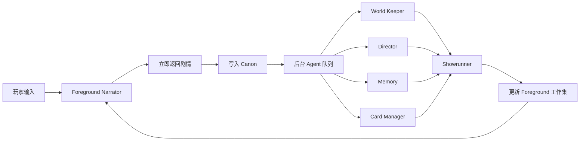
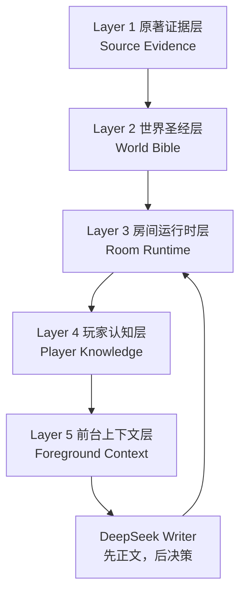
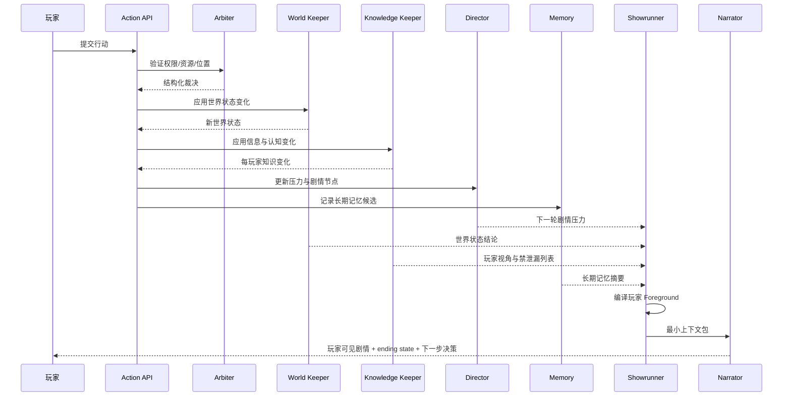

# Our Many Worlds：原著证据拆解层 × Openovel 式运行时上下文系统融合架构设计

> 文档版本：v1.1（剧情生成合同修订）  
> 适用项目：AI 多人剧情推演 / Our Many Worlds  
> 核心目标：让历史或文学原著“不能被 AI 写错”，同时让多人互动剧情“能够长期、流畅、可分支地持续推演”。
> 本次修订边界：只定义怎样向 DeepSeek 提供正确、精简、连续的剧情工作集，以及怎样用一次正常模型调用产出下一段剧情与真实决策；不以本文档替代人物交谈、派遣调查、使用筹码、自拟谋划等产品功能的代码实现。

---

## 目录

1. [文档目的](#1-文档目的)
2. [核心结论](#2-核心结论)
3. [两类拆解系统的本质差异](#3-两类拆解系统的本质差异)
4. [Openovel 上下文流畅的关键机制](#4-openovel-上下文流畅的关键机制)
5. [Our Many Worlds 的目标架构](#5-our-many-worlds-的目标架构)
6. [第一层：原著证据层](#6-第一层原著证据层)
7. [第二层：世界圣经层](#7-第二层世界圣经层)
8. [第三层：房间运行时状态层](#8-第三层房间运行时状态层)
9. [第四层：玩家认知与信息隔离层](#9-第四层玩家认知与信息隔离层)
10. [第五层：前台上下文编译层](#10-第五层前台上下文编译层)
11. [后台 Agent 分工设计](#11-后台-agent-分工设计)
12. [单轮完整执行流程](#12-单轮完整执行流程)
13. [多人异步推演机制](#13-多人异步推演机制)
14. [事实、认知、传言与秘密的统一模型](#14-事实认知传言与秘密的统一模型)
15. [原著未来信息泄漏防护](#15-原著未来信息泄漏防护)
16. [上下文卡片与选择性加载](#16-上下文卡片与选择性加载)
17. [上下文预算与压缩策略](#17-上下文预算与压缩策略)
18. [推荐目录结构](#18-推荐目录结构)
19. [核心数据结构](#19-核心数据结构)
20. [数据库与文件系统的职责划分](#20-数据库与文件系统的职责划分)
21. [API 与后台任务设计](#21-api-与后台任务设计)
22. [冲突处理与事实优先级](#22-冲突处理与事实优先级)
23. [质量审计与可追溯机制](#23-质量审计与可追溯机制)
24. [测试与验收方案](#24-测试与验收方案)
25. [MVP 分阶段实施计划](#25-mvp-分阶段实施计划)
26. [风险与约束](#26-风险与约束)
27. [完整示例：从原著证据到玩家下一轮上下文](#27-完整示例从原著证据到玩家下一轮上下文)
28. [最终建议](#28-最终建议)

---

# 1. 文档目的

本设计解决两个不同但必须同时成立的问题：

1. **原著准确性问题**
   - 人物说法不能自动成为客观事实。
   - 传言、认知、推断、未知必须严格区分。
   - 后文秘密不能提前进入前期人物认知。
   - 每一项基础设定应能追溯到原著章节和行号。
   - AI 生成内容不能悄悄改写人物关系、制度、地点和事件因果。

2. **运行时连续性问题**
   - 多轮游戏后仍能记住人物、资源、承诺、秘密和未兑现后果。
   - 每轮不需要把整本小说和全部历史回合塞给模型。
   - 不同玩家只能看到自己应当知道的信息。
   - AI 控制角色必须在幕后持续行动，而不是等待玩家触发。
   - 玩家选择可以改变结果，但不能让世界失去内部逻辑。

这两个问题分别对应：

```text
原著证据层：回答“什么内容可以被认为有依据？”
运行时上下文层：回答“下一轮 AI 必须知道什么？”
```

二者不能互相替代。

---

# 2. 核心结论

最适合 Our Many Worlds 的系统不是单纯复制 Openovel，也不是只做原著证据拆解，而是采用以下组合：

```text
原著文本
  ↓
证据型拆解
  ↓
世界圣经编译
  ↓
房间初始状态
  ↓
玩家行动与系统裁决
  ↓
房间独立 Canon
  ↓
World Keeper / Director / Memory / Card Manager 持续维护
  ↓
Showrunner 压缩整理
  ↓
为每个玩家单独编译 Foreground Context
  ↓
Narrator 生成该玩家可见的下一段剧情
```

一句话概括：

> 原著证据层负责“不能写错”，运行时状态层负责“能够持续写下去”，玩家认知层负责“不能让不该知道的人知道”。

---

# 3. 两类拆解系统的本质差异

## 3.1 原著证据型拆解

原著证据型拆解面向的是固定文本。

它关心：

- 原文在哪里发生场景切换；
- 哪句话是谁说的；
- 哪件事是客观发生的；
- 哪件事只是角色声称发生；
- 某个角色在某一时刻是否已经知道某个秘密；
- 某件物品当前由谁持有；
- 信息如何从一个角色传给另一个角色；
- 一项因果结论由哪些原文证据支持。

典型输出：

```text
source-evidence/
├─ scenes/
├─ claims/
├─ continuity/
├─ characters/
├─ institutions/
├─ causal-arcs/
└─ reviews/
```

这一层的重点是：

```text
来源可追溯
事实可核验
认知不串线
秘密不提前
结论不猜测
```

## 3.2 Openovel 式运行时拆解

Openovel 式拆解面向的是不断新增的游戏剧情。

它关心：

- 当前场景是谁在场；
- 玩家刚才做了什么；
- 哪些状态发生了变化；
- 哪些角色关系需要更新；
- 哪个伏笔正在接近回收；
- 哪个后台角色正在行动；
- 下一轮 Narrator 应加载哪些卡片；
- 哪些长期信息应当记住；
- 哪些过期信息应当从前台上下文移除。

典型输出：

```text
story/frontend/
story/context-cards/
story/state/
story/memory/
story/director/
story/canon/
```

这一层的重点是：

```text
状态持续更新
上下文保持精简
剧情节奏可控
长期承诺不丢失
下一轮生成稳定
```

## 3.3 对比表

| 维度 | 原著证据层 | Openovel 式运行时层 |
|---|---|---|
| 输入 | 固定原著文本 | 玩家行动与新生成剧情 |
| 主要目标 | 证明事实来源 | 维护连续生成 |
| 是否需要行号 | 必须 | 通常不需要原著行号 |
| 是否区分人物说法与事实 | 必须 | 默认较弱，需要强化 |
| 是否维护角色认知边界 | 必须 | 单人场景通常较弱 |
| 是否持续更新 | 原著拆解完成后基本只读 | 每轮更新 |
| 是否允许分支 | 不改变原著事实 | 每个房间可产生独立分支 |
| 是否直接供 Narrator 使用 | 不应全部直接加载 | 是，但需要压缩后加载 |
| 是否是最终 Canon | 否，是历史基线 | 房间 Canon 才是当前游戏事实 |

---

# 4. Openovel 上下文流畅的关键机制

Openovel 的流畅性主要不是来自“模型更聪明”，而是来自上下文工程。

## 4.1 双循环运行时



前台循环要求：

- 低延迟；
- 不调用复杂工具；
- 不修改大量文件；
- 只使用已经整理好的工作集；
- 尽快给玩家返回故事。

后台循环要求：

- 可以较慢；
- 可以读取 Canon；
- 可以做一致性检查；
- 可以维护状态和记忆；
- 可以更新下一轮需要的上下文。

## 4.2 Narrator 只读最小工作集

Narrator 不直接读取所有后台文件。

它只需要：

```text
当前场景
当前可见角色
当前人物关系
不可违反的常量
开放线索
当前压力
待兑现后果
触发的 Context Cards
长期记忆摘要
最近 Canon
玩家本轮行动
```

这使得模型看到的是“本轮拍摄通告”，而不是“整个资料馆”。

## 4.3 Canon 使用连续小说形式

运行时不应让 Narrator 看到大量：

```text
玩家：……
AI：……
玩家：……
AI：……
```

而应尽可能编译为连续叙事：

```text
上一段正式剧情
+
当前角色状态
+
本轮玩家行动
```

这会显著减少模型复述聊天记录、重复开场或机械解释玩家动作的问题。

## 4.4 后台角色职责隔离

Openovel 将职责拆分为：

```text
World Keeper：世界事实与状态
Director：剧情节奏、伏笔和困难节点
Memory：长期记忆
Card Manager：实体卡片
Showrunner：压缩并写入前台上下文
Narrator：只负责当前叙事
```

这种设计避免一个 Agent 同时做：

- 查历史；
- 判断世界状态；
- 设计剧情；
- 写正文；
- 更新记忆；
- 控制文风；
- 生成选择。

单 Agent 同时承担这些职责时，很容易出现状态遗漏和上下文污染。

这里的“角色职责隔离”是**逻辑职责隔离**，不代表每个职责都必须调用一次大模型。Our Many Worlds 的正常玩家回合中：

```text
Arbiter / World Keeper / Knowledge Keeper / Director / Memory / Showrunner
= 本地代码、数据库查询、规则计算和确定性上下文编译

DeepSeek
= 一次前台 Writer 调用
```

不得把六个逻辑职责实现成六次串行 DeepSeek 请求。后台模型只能用于非阻塞的离线整理、内容审核或长期维护，不能卡住玩家本轮下一剧情。

## 4.5 一次 DeepSeek 调用的前台生成合同

正常回合只允许一次 DeepSeek 请求。请求中按固定顺序提供：

```text
System Narrative Contract
→ 本轮精简 Foreground
→ 相关人物/地点/物件卡
→ 不可丢失的事实、压力、承诺和待兑现后果
→ Recent Canon Excerpt
→ 已确定的本轮规则裁决
→ Player Action（必须放在最后）
```

同一次返回按固定顺序生成：

```text
1. 下一段真实剧情正文
2. 剧情结束时的可见末态
3. 从该末态出发的 2—4 个真实决策
```

正文和决策在职责上隔离，但不要求拆成两次模型调用。模型先完成正文，再依据自己刚写出的最终末态生成决策。决策不得反过来污染正文，也不得预告选择后的成功、失败或奖励。

---

# 5. Our Many Worlds 的目标架构

Our Many Worlds 建议采用五层结构。



五层职责如下：

| 层级 | 职责 | 是否可修改 |
|---|---|---|
| 原著证据层 | 保存原文证据、场景、说法、认知和因果 | 只读 |
| 世界圣经层 | 将证据编译成可运行的角色、机构、规则、秘密 | 版本化修改 |
| 房间运行时层 | 保存某一局实际发生的事件和世界状态 | 每轮更新 |
| 玩家认知层 | 保存每个玩家知道、相信、怀疑和误解什么 | 每轮更新 |
| 前台上下文层 | 为某一玩家的下一轮生成最小上下文包 | 每轮重建 |

---

# 6. 第一层：原著证据层

## 6.1 设计原则

原著证据层是不可变的 Source of Truth。

它必须满足：

1. 每项事实有章节与行号。
2. 人物说法不得自动升级为客观事实。
3. 推断必须明确标记为推断。
4. 未知保持 unknown。
5. 后文信息不得修改前期认知。
6. 同一事件允许存在多个角色版本。
7. 所有实体采用稳定 ID，不依赖名称字符串。
8. 原著证据层不能被房间运行时覆盖。

## 6.2 推荐目录

```text
docs/剧本/嘉靖财政危局/source-evidence/
├─ source/
│  ├─ DM1566.raw.txt
│  └─ DM1566.lines.txt
├─ chapters/
│  ├─ DM1566-C01.txt
│  └─ DM1566-C02.txt
├─ scenes/
│  ├─ DM1566-C01.scenes.json
│  └─ DM1566-C02.scenes.json
├─ claims/
│  ├─ DM1566-C01.claims.jsonl
│  └─ DM1566-C02.claims.jsonl
├─ continuity/
│  ├─ DM1566-C01.continuity.json
│  └─ DM1566-C02.continuity.json
├─ characters/
│  ├─ DM1566-CHAR-jiajing.json
│  └─ DM1566-CHAR-yan-song.json
├─ institutions/
├─ objects/
├─ causal-arcs/
├─ reviews/
└─ manifests/
```

## 6.3 Claim 类型

建议固定以下类型：

```text
objective_event
objective_state
character_statement
character_belief
character_intention
rumor
document_claim
narrator_inference
analyst_inference
unknown
```

其中：

- `objective_event`：原文叙述明确发生的事件；
- `objective_state`：原文明确呈现的持续状态；
- `character_statement`：人物公开或私下说的话；
- `character_belief`：人物心中认定的内容；
- `character_intention`：人物计划、企图或决定；
- `rumor`：社会传言或未证实消息；
- `document_claim`：奏疏、信件、账本等文书中的说法；
- `narrator_inference`：原著叙述者明确做出的判断；
- `analyst_inference`：拆解系统根据证据推断，必须低于原文事实；
- `unknown`：当前无法确认。

## 6.4 Claim 示例

```json
{
  "claim_id": "DM1566-C01-CL012",
  "chapter_id": "DM1566-C01",
  "scene_id": "DM1566-C01-S04",
  "type": "character_statement",
  "speaker_id": "DM1566-CHAR-yan-shifan",
  "subject_id": "DM1566-CHAR-gao-gong",
  "predicate": "is_accused_of",
  "object": "being_connected_to_zhou_yunyi",
  "truth_status": "unverified",
  "epistemic_status": "asserted_by_speaker",
  "evidence": {
    "line_start": 682,
    "line_end": 689
  },
  "valid_from_scene": "DM1566-C01-S04",
  "known_by": [
    "DM1566-CHAR-yan-shifan",
    "DM1566-CHAR-gao-gong",
    "DM1566-CHAR-jiajing"
  ],
  "notes": "人物指控，不能直接视为客观事实。"
}
```

## 6.5 Continuity 接力棒

每章结束时需要输出：

```json
{
  "chapter_id": "DM1566-C01",
  "time_anchor": "嘉靖四十年正月十五",
  "active_locations": [],
  "character_positions": [],
  "object_holders": [],
  "known_facts_by_character": [],
  "open_claims": [],
  "unresolved_questions": [],
  "institutional_decisions": [],
  "causal_changes": [],
  "next_chapter_constraints": []
}
```

这个文件不是剧情摘要，而是下一章拆解时必须继承的连续性约束。

---

# 7. 第二层：世界圣经层

原著证据层不适合直接给运行时使用，因为它过于细碎、包含大量证据定位和互相矛盾的说法。

因此需要一个编译过程：

```text
Evidence Compiler
```

将证据层编译为世界圣经。

## 7.1 世界圣经的职责

世界圣经负责回答：

- 这个世界有哪些稳定规则；
- 角色有哪些公开身份与私密身份；
- 角色当前目标是什么；
- 哪些秘密客观成立；
- 哪些秘密只是阵营认知；
- 哪些关系在起始时成立；
- 哪些机构拥有何种权力；
- 哪些历史事件在开局前已经发生；
- 哪些未来事件只是原著未来，不应自动发生；
- 哪些压力会在没有玩家介入时自然发展。

## 7.2 推荐目录

```text
world-bible/
├─ meta/
│  ├─ world.json
│  ├─ start-points.json
│  └─ truth-policy.json
├─ characters/
├─ factions/
├─ institutions/
├─ locations/
├─ objects/
├─ relationships/
├─ secrets/
├─ timelines/
├─ causal-rules/
├─ conflict-arcs/
├─ scene-templates/
└─ source-map/
```

## 7.3 世界圣经不是原著摘要

世界圣经应包含可执行结构，例如：

```json
{
  "character_id": "DM1566-CHAR-hu-zongxian",
  "display_name": "胡宗宪",
  "public_roles": [
    "浙直总督"
  ],
  "private_commitments": [
    {
      "content": "避免浙江因改稻为桑激起大乱",
      "source_claim_ids": [
        "DM1566-C02-CL144",
        "DM1566-C03-CL031"
      ]
    }
  ],
  "resources": {
    "official_authority": 82,
    "military_access": 70,
    "court_influence": 48,
    "local_legitimacy": 75
  },
  "constraints": [
    "不能公开与严嵩阵营彻底决裂",
    "不能容忍浙江出现大规模民乱",
    "必须维持东南抗倭体系"
  ],
  "default_ai_policy": [
    "优先维持大局",
    "避免公开站队",
    "在民生危机达到阈值时违抗下级强制措施"
  ],
  "source_claim_ids": []
}
```

## 7.4 原著未来与可玩未来分离

这是最重要的规则之一。

世界圣经必须区分：

```text
historical_baseline：原著中已经发生到开局时点的事实
source_future：原著中开局之后发生的事件
runtime_future：游戏房间中尚未发生的未来
```

`source_future` 只能作为：

- 剧情压力参考；
- NPC 倾向参考；
- 因果可能性参考；
- 隐藏的原著路线测试基线。

不能直接作为当前房间事实。

例如：

```json
{
  "event_id": "DM1566-FUTURE-E017",
  "event_type": "source_future",
  "content": "原著后续某项政治变化",
  "availability": "planner_only",
  "must_happen": false,
  "can_be_prevented": true,
  "can_be_replaced": true,
  "source_claim_ids": []
}
```

---

# 8. 第三层：房间运行时状态层

每个房间都拥有自己的 Canon。

原著只是初始世界，不是房间未来。

## 8.1 房间 Canon

房间 Canon 是：

> 在这一局中已经被系统裁定并正式发生的事件集合。

它包括：

- 玩家公开行动；
- 玩家秘密行动；
- NPC 行动；
- 系统裁决；
- 公开后果；
- 私密后果；
- 信息传播；
- 资源变化；
- 角色位置变化；
- 关系变化；
- 已经兑现的剧情节点。

## 8.2 房间目录

```text
rooms/<room-id>/
├─ meta/
│  ├─ room.json
│  ├─ participants.json
│  └─ runtime-config.json
├─ canon/
│  ├─ public-events.jsonl
│  ├─ private-events/
│  ├─ narration.md
│  └─ provenance.jsonl
├─ actions/
│  ├─ submitted/
│  ├─ validated/
│  └─ resolved/
├─ state/
│  ├─ world.json
│  ├─ characters.json
│  ├─ institutions.json
│  ├─ objects.json
│  ├─ relationships.json
│  └─ resources.json
├─ knowledge/
├─ context-cards/
├─ director/
├─ memory/
├─ pending-consequences/
├─ agent-inbox/
├─ foreground/
└─ snapshots/
```

## 8.3 Event Sourcing

建议将房间运行时设计成事件溯源模型。

状态不是唯一事实来源，事件日志才是。

```text
事件日志 → 状态投影 → 玩家认知投影 → 前台上下文
```

事件示例：

```json
{
  "event_id": "ROOM-8F-TURN-006-E03",
  "room_id": "ROOM-8F",
  "turn_id": 6,
  "event_type": "private_order_sent",
  "actor_id": "CHAR-yan-shifan",
  "targets": [
    "CHAR-zheng-michang"
  ],
  "payload": {
    "order": "加速执行地方方案"
  },
  "visibility": {
    "mode": "restricted",
    "visible_to": [
      "PLAYER-yan-shifan"
    ]
  },
  "state_effects": [
    {
      "op": "inc",
      "path": "institutions.zhejiang.enforcement_pressure",
      "value": 12
    }
  ],
  "source": {
    "type": "player_action",
    "action_id": "ACTION-8F-006-01"
  }
}
```

## 8.4 状态快照

每若干轮生成快照：

```json
{
  "snapshot_id": "ROOM-8F-SNAPSHOT-006",
  "based_on_event": "ROOM-8F-TURN-006-E07",
  "time": {},
  "locations": {},
  "characters": {},
  "relationships": {},
  "resources": {},
  "institutions": {},
  "open_threads": [],
  "pending_consequences": []
}
```

快照用于快速恢复，但不能替代事件日志。

---

# 9. 第四层：玩家认知与信息隔离层

多人游戏最关键的不是“世界发生了什么”，而是：

> 每个角色知道什么、相信什么、怀疑什么，以及这些认知来自哪里。

## 9.1 认知状态分类

每个玩家对一项信息的状态建议分为：

```text
known
believed
suspected
rumored
disbelieved
unknown
forgotten
```

其中：

- `known`：有直接可靠证据；
- `believed`：角色当前相信，但未必客观正确；
- `suspected`：存在怀疑；
- `rumored`：听说过；
- `disbelieved`：明确不相信；
- `unknown`：不知道；
- `forgotten`：曾经知道，但当前前台不再主动保持，可被提醒恢复。

## 9.2 玩家知识记录

```json
{
  "player_id": "PLAYER-hu-zongxian",
  "character_id": "CHAR-hu-zongxian",
  "fact_id": "FACT-dike-sabotage",
  "epistemic_state": "suspected",
  "confidence": 0.72,
  "acquired_at_turn": 5,
  "acquisition_type": "circumstantial_evidence",
  "source_event_ids": [
    "ROOM-8F-TURN-005-E02"
  ],
  "may_share": true,
  "is_private": true
}
```

## 9.3 信息传播事件

任何秘密传播都必须成为正式事件。

```json
{
  "event_type": "information_transfer",
  "sender_id": "CHAR-tan-lun",
  "receiver_id": "CHAR-yu-wang",
  "content_fact_ids": [
    "FACT-zhejiang-pressure"
  ],
  "channel": "private_letter",
  "reliability": 0.85,
  "interception_risk": 0.25,
  "visibility": {
    "mode": "restricted",
    "visible_to": [
      "PLAYER-tan-lun",
      "PLAYER-yu-wang"
    ]
  }
}
```

没有信息传播事件，就不能直接更新其他玩家的认知。

## 9.4 客观事实与玩家认知分离

系统中必须同时存在：

```text
objective_world_state
player_epistemic_state
```

例如：

```text
客观事实：堤坝被人为破坏
胡宗宪：高度怀疑
海瑞：尚不知道
严世蕃：知道并参与
普通百姓：认为是天灾或官府失修
```

Narrator 给不同玩家生成内容时，必须使用不同认知层。

---

# 10. 第五层：前台上下文编译层

前台上下文不是一个长期保存的真相文件，而是每轮为特定玩家动态构建的 Context Packet。

## 10.1 Context Packet 内容

```text
1. 当前场景
2. 当前时间
3. 玩家角色身份
4. 玩家角色目标
5. 当前在场人物
6. 当前可见关系
7. 玩家已知事实
8. 玩家相信或怀疑的内容
9. 当前持有物品和资源
10. 当前风险
11. 尚未兑现的后果
12. 与本轮有关的开放线索
13. 触发的 Context Cards
14. 文风与叙述规则
15. 禁止泄漏的信息
16. 最近相关 Canon
17. 本轮已经确定的规则裁决
18. 本轮玩家行动（整个 User Prompt 的最后一块）
```

顺序是合同，不只是展示习惯：

- `Recent Canon` 是当前场景连续性的最高文本权威；若较早的摘要与最近正式正文冲突，以最近正文为准；
- 规则裁决告诉 Writer 哪些结果已经确定、哪些结果仍未知，Writer 不得自行重新裁决；
- 玩家行动必须放在最后，使模型把它当作当前回合的直接指令；
- 原著未来、未触发真相和其他角色不可知信息不得进入这个 Packet，不能只依靠 Prompt 要求模型“不要说”。

## 10.2 每玩家独立编译

同一场景下：

```text
compileContext(roomId, playerId, turnId)
```

返回不同结果。

胡宗宪玩家可能获得：

```text
- 当前官府公开局势
- 对地方官员的怀疑
- 军事调动权限
- 对民变的风险判断
- 与严嵩关系的压力
```

严世蕃玩家可能获得：

```text
- 自己下达过的秘密命令
- 地方执行进度
- 事情暴露风险
- 严嵩当前并不知道的部分
- 对胡宗宪忠诚度的判断
```

两者不能共享同一 `FOREGROUND.md`。

## 10.3 Context Packet 示例

```json
{
  "room_id": "ROOM-8F",
  "turn_id": 6,
  "player_id": "PLAYER-hu-zongxian",
  "scene": {
    "location": "浙江总督署",
    "time": "深夜",
    "present_characters": [
      "CHAR-hu-zongxian",
      "CHAR-tan-lun"
    ]
  },
  "identity": {},
  "known_facts": [],
  "beliefs": [],
  "suspicions": [],
  "relationships": [],
  "resources": [],
  "open_threads": [],
  "active_pressures": [],
  "pending_consequences": [],
  "triggered_cards": [],
  "recent_canon": [],
  "forbidden_disclosures": [],
  "deterministic_resolution": {
    "accepted_intent": "秘密核查河道账册，不惊动地方官员",
    "confirmed_effects": [],
    "unresolved_questions": []
  },
  "player_action": "召见河道官员并秘密检查修堤账册"
}
```

真正发送给 DeepSeek 时不应把数据库对象原样倾倒为一个巨大 JSON。Context Compiler 应把上述结构编译成“最小充分 Writer Context”。`Recent Canon` 位于工作集前部并确定镜头起点，`Player Action` 仍必须是整个 User Prompt 的最后一块：

```text
【Recent Canon Excerpt】
最近一次已经正式通过、且与当前冲突直接相关的最小充分剧情尾部，从其最后一刻继续。

【Player Action】
玩家本轮实际提交的行动原文或等义、不可改写的意图。
```

## 10.4 Writer Context 与 Server Validation Policy 必须分层

DeepSeek Writer 只接收创作所需的语义上下文。机器校验策略不得进入模型输入。

```text
Writer Context
├─ Minimum Sufficient Canon Tail
├─ Current Scene
├─ Confirmed Effects
├─ Unresolved Facts
├─ Semantic Fact Boundary
├─ NPC Agenda
├─ Dramatic Task
├─ Required End Change
├─ Narrative Ceiling
├─ Decision Access
├─ Narrative Budget
└─ Player Action（最后）

Server Validation Policy
├─ 原始 State Locks
├─ 状态转换断言
├─ 正则表达式
├─ 错误代码与错误说明
├─ 首段和重复度检测
├─ Canon 差异检测
├─ 决策类型、权限与对象校验
├─ 事实严重度
└─ 禁止泄漏匹配
```

以下内容绝不发送给 Writer：

```text
validationPatterns
stateLockAssertions
正则表达式
错误代码
失败示例原句
禁词匹配规则
firstCharacters
firstParagraphOnly
```

State Locks 的机器字段留在服务端，但与当前回合有关的事实边界必须编译成简短自然语言发送给 Writer。例如：

```text
两类册据尚未送到总督府。
目前不能确认册据是否已经编成、由谁保管、是否已经送出。
核对尚未开始，也没有任何差异、数字或结果。
```

原则是：**隐藏机器结构，不隐藏必要的语义边界。**

## 10.5 Minimum Sufficient Canon Tail

不能机械地只取最后一段，也不能把多个历史回合的等待状态持续累加。Context Compiler 应：

1. 只读取已经正式通过的 Canon，失败或被拒绝的 Shadow artifact 永不进入 Canon；
2. 使用 `canonCursor/turnId` 防止同一段重复拼接；
3. 保留最近一次与当前冲突直接相关的有效节拍、最新可见场景状态和尚未兑现的承诺；
4. 删除已经被新玩家行动覆盖的旧等待状态；
5. 对重复段落做确定性去重，并受独立字符/token 预算约束。

## 10.6 动态 Narrative Budget

固定五段和逐段字数会迫使 Writer 重复同一条件。篇幅改由 Context Compiler 根据回合复杂度生成，并由服务器使用同一预算校验：

| 回合类型 | 建议正文长度 | 建议段落 |
|---|---:|---:|
| 简短交锋、回应上一命令 | 180—550 字 | 3—5 段 |
| 普通决策场景 | 450—750 字 | 3—6 段 |
| 关键事件、多人冲突 | 650—1,000 字 | 4—8 段 |
| 幕终结果 | 800—1,400 字 | 5—10 段 |

```json
{
  "kind": "short_confrontation",
  "minChars": 180,
  "maxChars": 550,
  "minParagraphs": 3,
  "maxParagraphs": 5
}
```

Writer 只看到这份预算，不看到逐段分镜或逐段字数。服务器不得继续使用与本轮 `Narrative Budget` 冲突的全局固定长度。

## 10.7 Decision Entrances 与服务端绑定

Writer Context 只以自然语言提供语义行动入口，不倾倒人物 ID、对象 ID、`affordanceId`、`targetRefs` 或 `decisionClass`，也不提供三条最终决策原句。

```text
【DECISION_ENTRANCES】
- 责任承担：处理巡抚刚提出但尚未生效的具名责任条件；可直接作用于巡抚
- 条件协商：重新约定督抚之间的分责条件；可直接作用于巡抚
- 行政处置：处置仍未落印的放行文书；可直接作用于放行文书、总督印
```

Writer 只输出三个玩家可见的决策文字：

```json
{
  "decisions": [
    { "text": "……" },
    { "text": "……" },
    { "text": "……" }
  ]
}
```

服务器根据决策文字和已编译的行动入口绑定稳定 ID、动作类型、目标引用与 affordance。它同时验证对象存在、权限成立、行动立即可执行、没有重复已完成行动，并且三个选项至少覆盖两条真实权力路径。服务器只绑定机器元数据，不得修改 Writer 生成的玩家可见文字。

## 10.8 Grounding 由服务器绑定

Writer 不填写 Claim、Runtime Fact、Context Card、人物、物件或决策路由 ID。Context Compiler 已经知道本轮选择了哪些事实、卡片、现场对象和行动入口，生成结束后由服务器自动绑定：

```text
Writer 输出：剧情 + 可见末态摘要 + 三个决策文字
Server 追加：固定场景引用 + 在场实体 + 可用物件 + 决策 ID/类型/目标 + affordances
Server 追加：compiled Claim IDs + Runtime Fact IDs + Card IDs + Source Map hash
```

这样可以避免 Writer 把大部分注意力花在机器 Schema 上，也能避免模型自报未实际使用的证据 ID、漏绑目标或把 NPC 填成玩家行动者。Grounding 与实际编译输入保持一致，玩家可见正文和决策则保持模型原文不变。

## 10.9 事实严重度

| 等级 | 示例 | 处理 |
|---|---|---|
| Canon 硬事实 | 人物离场、册据送达、文书落印、调查结果 | 不符即拒绝 |
| 因果性细节 | 新文书、新官署、期限、册据字段、物件转移 | 未授权即拒绝 |
| 非因果纹理 | 笔尖含墨、呼吸略沉、衣袖轻动 | 默认允许或记录 warning |

非因果纹理不能成为新的行动对象、证据来源、持久状态或后续剧情依据。一旦纹理改变了可用资源、物件归属或因果能力，就升级为因果性细节并执行硬校验。

---

# 11. 后台 Agent 分工设计

## 11.1 World Keeper

职责：

```text
维护客观世界状态
维护角色位置
维护资源和物件
维护机构状态
维护后台 NPC 行动
检查地理、时间、制度和因果一致性
```

输入：

- 最新房间 Canon；
- 已裁决行动；
- 现有状态；
- 世界圣经；
- 待兑现后果；
- 机构规则。

输出：

- 状态变更；
- 后台世界发展；
- 一致性问题；
- 对 Showrunner 的最小结论。

禁止：

- 直接写玩家可见正文；
- 凭空修改状态；
- 用原著未来替代房间未来；
- 让角色知道未传播的信息。

## 11.2 Director

职责：

```text
维护剧情弧
维护张力曲线
维护伏笔和回收
维护困难节点
判断是否停滞
控制关键事件最晚触发点
```

Director 不决定玩家做什么，只决定世界应施加什么压力。

建议维护：

```text
ARC.md
PRESSURE_NODES.json
SETUPS.json
PAYOFFS.json
TENSION.jsonl
```

关键字段：

```json
{
  "node_id": "NODE-zhejiang-food-crisis",
  "status": "open",
  "opened_at_turn": 4,
  "pressure": 68,
  "floor_turn": 8,
  "preconditions": [
    "food_reserve_below_threshold"
  ],
  "possible_payoffs": [],
  "must_not_force_player_response": true
}
```

## 11.3 Memory Agent

职责：

```text
保存跨场景长期记忆
保存关系历史
保存承诺和背叛
保存玩家长期行为倾向
保存反复出现的主题
```

Memory 不应重复保存实时世界状态。

例如：

```text
实时状态：某角色目前在杭州
长期记忆：某角色曾在关键时刻背弃玩家
```

## 11.4 Card Manager

职责：

```text
维护人物卡
维护地点卡
维护机构卡
维护物件卡
维护事件卡
决定本轮触发哪些卡
```

每个实体只能有一个稳定卡片 ID。

名称、别名、官称、昵称只作为触发词。

## 11.5 Knowledge Keeper

这是 Our Many Worlds 相比 Openovel 必须新增的 Agent。

职责：

```text
维护每个玩家知道什么
维护信息传播
维护误解、怀疑和传言
阻止秘密串线
生成每玩家 forbidden_disclosures
```

Knowledge Keeper 不修改客观事实，只修改角色认知投影。

## 11.6 Rules / Arbiter

多人推演中还需要独立裁决层。

职责：

```text
验证行动是否可执行
检查角色权限、资源和位置
处理行动冲突
计算隐蔽性与暴露风险
生成结构化结果
禁止 Narrator 自行裁决关键数值
```

输出示例：

```json
{
  "action_id": "ACTION-8F-006-01",
  "valid": true,
  "execution_status": "partial_success",
  "public_effects": [],
  "private_effects": [],
  "state_effects": [],
  "knowledge_effects": [],
  "new_risks": []
}
```

## 11.7 Showrunner

Showrunner 是唯一负责编译前台上下文的逻辑组件。MVP 中它应优先实现为确定性 Context Compiler，而不是一次独立的大模型调用。

它读取：

- World Keeper 结论；
- Director 结论；
- Memory 结论；
- Card Manager 结论；
- Knowledge Keeper 结论；
- Arbiter 裁决；
- 当前玩家视角。

然后写入：

```text
foreground/<player-id>/
├─ scene.md
├─ identity.md
├─ active-characters.md
├─ relationships.md
├─ known-facts.md
├─ beliefs.md
├─ open-threads.md
├─ active-pressures.md
├─ pending-consequences.md
├─ cards.md
├─ forbidden.md
└─ FOREGROUND.md
```

## 11.8 Narrator

Narrator 只负责：

```text
把已经裁定的世界结果写成自然叙事
从 Recent Canon 的最后一刻无缝继续
保持角色视角
保持文风
不增加未经裁定的关键事实
不泄漏隐藏信息
在正文完成后，从正文最终末态生成 2—4 个真实决策
```

Narrator 不负责：

- 决定关键行动是否成功；
- 修改资源数值；
- 给未出场角色安排关键秘密行动；
- 判断某人是否已经知道某事；
- 重新解释原著证据。

正常回合的 DeepSeek 输出必须是一个可解析的单次生成包，并保证正文出现在决策之前：

```json
{
  "narration": {
    "title": "本段剧情标题",
    "body": "只包含玩家可阅读的连续故事正文",
    "ending_state": "人物此刻在哪里、面对谁、刚发生什么、仍能做什么"
  },
  "decisions": [
    {
      "text": "玩家在当前情境下可以直接采取的自然语言行动",
      "intent": "该行动想改变什么",
      "target_refs": [],
      "required_resource_refs": []
    }
  ]
}
```

决策必须满足：

- 从 `ending_state` 立即可执行；
- 符合当前角色身份、权限、位置、资源和认知；
- 彼此在方法、风险、承诺或信息价值上有真实差异；
- 使用正常人能够理解的具体语言，不使用“推进方案”“协调资源”“说明代价”等系统摘要；
- 不重复玩家刚完成的行动；
- 不替玩家宣布成功结果；
- 不引入正文中不存在且 Context Packet 未允许的人物、地点、物件或事实。

---

# 12. 单轮完整执行流程

下图中的 Arbiter、World Keeper、Knowledge Keeper、Director、Memory 和 Showrunner 表示逻辑步骤。MVP 正常路径应在一次本地事务/任务中完成这些确定性步骤，只有 Narrator 节点调用一次 DeepSeek。



## 12.1 行动提交

玩家可以提交：

```text
公开行动
秘密行动
与角色互动
调查
命令
资源投入
立场表达
自定义谋划
```

每个行动必须带：

```json
{
  "actor_id": "CHAR-hu-zongxian",
  "action_type": "investigate",
  "target": "river_accounts",
  "visibility_intent": "secret",
  "resource_commitments": [],
  "free_text": "秘密核查河道账册，不惊动地方官员。"
}
```

## 12.2 裁决

裁决应优先输出结构化结果，再生成叙事。

```text
行动是否合法
行动是否成功
成功到什么程度
谁察觉到了
消耗了什么资源
制造了什么新风险
哪些信息被发现
哪些后果延迟兑现
```

## 12.3 写入 Canon

只有经过裁决并正式生成结果的内容才能进入 Canon。

未选择的选项不是 Canon。

模型内部推断不是 Canon。

后台规划不是 Canon。

## 12.4 更新上下文

后台 Agent 更新完成后，不应把全部结果直接塞给 Narrator，而是由 Showrunner 生成精简结论。

正常回合的发布边界为：

```text
本地粗校验
→ 本地确定性裁决
→ 编译最小 Context Packet
→ 一次 DeepSeek 生成“正文 + 决策”
→ 本地硬合同校验
→ 原子写入 Canon、状态、正文和下一组决策
```

不得先发布状态、再等待正文，也不得先发布正文、再等待第二次模型调用生成决策。玩家读到新剧情时，下一步可用决策必须已经与该剧情属于同一个发布版本。

---

# 13. 多人异步推演机制

Our Many Worlds 不应完全采用所有玩家等待同一轮提交的传统回合制。

建议采用：

```text
持续叙事流 + 局部同步节点
```

## 13.1 普通阶段

每个玩家可以独立行动：

- 发送私信；
- 调查；
- 接触 NPC；
- 调动自己的资源；
- 做秘密准备；
- 推进个人目标。

这些行动可以立即裁决，不必等待全部玩家。

## 13.2 冲突阶段

当多个行动影响同一个关键资源或同一场景时，进入局部同步：

```text
冲突窗口
议事窗口
公开会议
战争节点
审判节点
投票节点
重大危机
```

只要求相关玩家进入同步，不要求全房间所有人等待。

## 13.3 异步行动队列

```json
{
  "action_window_id": "WINDOW-08",
  "type": "asynchronous",
  "opens_at": "2026-07-21T10:00:00Z",
  "soft_deadline": "2026-07-21T18:00:00Z",
  "participants": [],
  "resolution_policy": "resolve_on_submit_unless_conflict",
  "conflict_keys": [
    "zhejiang_grain",
    "court_memorial"
  ]
}
```

## 13.4 冲突键

行动可以声明影响对象：

```text
location:<id>
institution:<id>
resource:<id>
person:<id>
document:<id>
decision:<id>
```

如果两个行动命中同一冲突键，则延迟到联合裁决。

## 13.5 未行动玩家处理

未行动玩家不应阻塞世界。

系统可按照角色默认策略执行：

```text
defensive
status_quo
protect_core_interest
delegate_to_subordinate
follow_previous_plan
```

默认策略必须来自角色卡和当前状态，不能由 Narrator 随意编造。

---

# 14. 事实、认知、传言与秘密的统一模型

建议将所有信息统一为 `Fact Record`。

```ts
export type TruthStatus =
  | "objective_true"
  | "objective_false"
  | "unverified"
  | "contested"
  | "unknown";

export type EpistemicState =
  | "known"
  | "believed"
  | "suspected"
  | "rumored"
  | "disbelieved"
  | "unknown";

export interface FactRecord {
  factId: string;
  content: string;
  truthStatus: TruthStatus;
  sourceClaimIds: string[];
  validFrom?: string;
  validUntil?: string;
  roomOverrides?: RoomFactOverride[];
}
```

玩家认知另存：

```ts
export interface CharacterKnowledge {
  roomId: string;
  characterId: string;
  factId: string;
  epistemicState: EpistemicState;
  confidence: number;
  sourceEventIds: string[];
  acquiredAtTurn: number;
  private: boolean;
}
```

这样同一个 Fact 可以拥有多个不同角色认知。

---

# 15. 原著未来信息泄漏防护

## 15.1 时间门

任何原著 Claim 都要带：

```text
available_from_scene
available_to_characters
```

如果当前房间起始时点早于该 Claim 的发生时点，则：

- 不能作为客观状态；
- 不能进入角色认知；
- 不能进入前台卡片；
- 只能进入 Director 的隐藏参考区；
- 不得被 Narrator 直接使用。

## 15.2 原著未来的权限分级

```text
runtime_visible
planner_only
evidence_only
disabled_after_divergence
```

- `runtime_visible`：开局前已经发生；
- `planner_only`：可作为压力和倾向参考；
- `evidence_only`：仅供开发与审核；
- `disabled_after_divergence`：房间明显分支后，不再作为剧情规划依据。

## 15.3 分支距离

建议计算房间与原著路线的偏离程度：

```text
divergence_score: 0 - 100
```

参考因素：

- 关键人物是否死亡或失势；
- 核心制度决策是否改变；
- 原著关键事件是否被阻止；
- 阵营关系是否发生根本变化；
- 关键资源归属是否改变。

当偏离超过阈值后：

```text
原著未来只保留为历史参考
不再作为“应当发生”的剧情节点
```

---

# 16. 上下文卡片与选择性加载

## 16.1 卡片类型

```text
character
location
institution
faction
object
document
secret
procedure
historical-background
active-task
```

## 16.2 卡片示例

```yaml
id: char-hu-zongxian
name: 胡宗宪
kind: character
description: 浙直总督；当前涉及浙江民变风险、抗倭与朝廷派系压力时使用。
triggers:
  - 胡宗宪
  - 胡部堂
  - 浙直总督
  - 部堂大人
max_chars: 1800
source_entity_id: DM1566-CHAR-hu-zongxian
```

卡片正文只放：

- 当前稳定身份；
- 当前关系；
- 当前可持续状态；
- 本视角可知信息；
- 与当前剧情有关的语气和行为约束。

不放：

- 全部历史；
- 长篇人物传记；
- 后文秘密；
- 与当前场景无关的所有支线。

## 16.3 触发机制

建议采用多级触发：

```text
1. 精确名称触发
2. 别名与官称触发
3. 当前场景自动触发
4. 当前行动目标触发
5. 关系一跳触发
6. Director 强制触发
7. Knowledge Keeper 限制过滤
```

触发后还必须经过权限过滤：

```text
card is relevant
AND
card is visible to this player
AND
card does not contain future leakage
```

## 16.4 卡片去重

同一实体只能有一个稳定主卡。

玩家差异不应通过复制多张人物卡实现，而应通过：

```text
主卡
+
玩家知识投影
+
本轮动态遮罩
```

---

# 17. 上下文预算与压缩策略

## 17.1 推荐预算

MVP 不应以模型上下文上限作为默认预算。应先以较小工作集验证连续性，再按真实缺失扩容：

| 区块 | 建议字符预算 |
|---|---:|
| 系统叙事合同 | 1,500—2,500 |
| 当前 Foreground P0 事实 | 3,000—5,000 |
| 本轮触发卡片 | 2,000—4,000 |
| 最近完整 Canon | 4,000—7,000 |
| 相关长期记忆 | 1,000—2,000 |
| 已确定规则裁决 | 500—1,500 |
| 玩家行动 | 200—1,000 |
| 合计目标 | 约 12,000—23,000 字符 |

这不是硬上限。若关键 P0 内容确实超过预算，可以扩展到约 32,000 字符，但不得用无关背景、全部人物卡或整章原著填满上下文。任何扩容都必须能指出是哪一项具体事实在较小工作集中缺失。

## 17.2 最近 Canon 不等于最近所有文本

多人模式下应选择：

```text
与当前玩家有关的最近事件
+
当前地点最近事件
+
当前开放线索相关事件
+
全局重大公共事件
```

不应机械截取房间最后 N 个字符。

## 17.3 相关性评分

```text
relevance =
  角色关联 × 0.30
+ 地点关联 × 0.20
+ 线索关联 × 0.20
+ 时间接近 × 0.15
+ 当前行动目标关联 × 0.15
```

## 17.4 压缩层级

```text
L0 原始事件
L1 单事件摘要
L2 场景摘要
L3 章节/阶段摘要
L4 长期记忆
```

近期使用 L0/L1，较远历史使用 L2/L3，只有真正长期有效的内容进入 L4。

## 17.5 不应压缩丢失的内容

以下内容不能只保留模糊摘要：

- 关键承诺；
- 秘密来源；
- 物件归属；
- 角色明确立场；
- 法律或制度限制；
- 资源数量；
- 时间截止点；
- 已公开与未公开的区别；
- 信息传播路径。

---

# 18. 推荐目录结构

```text
docs/剧本/嘉靖财政危局/
├─ source/
│  ├─ original/
│  └─ normalized/
├─ source-evidence/
│  ├─ scenes/
│  ├─ claims/
│  ├─ continuity/
│  ├─ characters/
│  ├─ institutions/
│  ├─ objects/
│  ├─ causal-arcs/
│  ├─ reviews/
│  └─ manifests/
├─ world-bible/
│  ├─ meta/
│  ├─ characters/
│  ├─ factions/
│  ├─ institutions/
│  ├─ locations/
│  ├─ objects/
│  ├─ relationships/
│  ├─ secrets/
│  ├─ timelines/
│  ├─ causal-rules/
│  ├─ conflict-arcs/
│  └─ source-map/
├─ runtime-templates/
│  ├─ room-state/
│  ├─ context-cards/
│  ├─ agent-prompts/
│  ├─ foreground/
│  └─ director/
├─ generated/
│  ├─ indexes/
│  ├─ validators/
│  └─ reports/
└─ tests/
```

生产环境房间数据建议不放在 `docs` 下，而放在数据库和对象存储中。

---

# 19. 核心数据结构

## 19.1 Scene

```ts
export interface EvidenceScene {
  sceneId: string;
  chapterId: string;
  lineStart: number;
  lineEnd: number;
  time: {
    explicit?: string;
    inferred?: string;
    confidence: number;
  };
  locationIds: string[];
  presentCharacterIds: string[];
  entryEvents: string[];
  exitEvents: string[];
  objectChanges: string[];
  informationTransfers: string[];
  claimIds: string[];
}
```

## 19.2 Claim

```ts
export interface EvidenceClaim {
  claimId: string;
  sceneId: string;
  type:
    | "objective_event"
    | "objective_state"
    | "character_statement"
    | "character_belief"
    | "character_intention"
    | "rumor"
    | "document_claim"
    | "narrator_inference"
    | "analyst_inference"
    | "unknown";
  subjectId?: string;
  predicate: string;
  object?: unknown;
  speakerId?: string;
  truthStatus: "supported" | "unverified" | "contested" | "unknown";
  evidence: {
    chapterId: string;
    lineStart: number;
    lineEnd: number;
  };
}
```

## 19.3 Room Event

```ts
export interface RoomEvent {
  eventId: string;
  roomId: string;
  turnId: number;
  eventType: string;
  actorIds: string[];
  targetIds: string[];
  payload: Record<string, unknown>;
  visibility: {
    mode: "public" | "restricted" | "private";
    visibleTo?: string[];
  };
  stateEffects: StateEffect[];
  knowledgeEffects: KnowledgeEffect[];
  causedBy: {
    type: "player_action" | "npc_action" | "system_rule" | "pending_consequence";
    id: string;
  };
  createdAt: string;
}
```

## 19.4 Pending Consequence

```ts
export interface PendingConsequence {
  consequenceId: string;
  roomId: string;
  createdAtTurn: number;
  sourceEventIds: string[];
  trigger:
    | { type: "turn"; at: number }
    | { type: "condition"; expression: string }
    | { type: "event"; eventType: string };
  visibility: "hidden" | "foreshadowed" | "known";
  affectedEntities: string[];
  status: "pending" | "triggered" | "resolved" | "cancelled";
  effectTemplate: Record<string, unknown>;
}
```

## 19.5 Context Packet

```ts
export interface PlayerContextPacket {
  roomId: string;
  turnId: number;
  playerId: string;
  characterId: string;
  scene: SceneContext;
  identity: IdentityContext;
  goals: GoalContext[];
  knownFacts: FactContext[];
  beliefs: FactContext[];
  suspicions: FactContext[];
  activeCharacters: CharacterContext[];
  relationships: RelationshipContext[];
  resources: ResourceContext[];
  openThreads: ThreadContext[];
  activePressures: PressureContext[];
  pendingConsequences: ConsequenceContext[];
  contextCards: ContextCard[];
  recentCanon: CanonExcerpt[];
  forbiddenDisclosures: string[];
  styleGuide: StyleContext;
  playerAction: PlayerAction;
}
```

---

# 20. 数据库与文件系统的职责划分

Openovel 采用文件原生方式，适合单机和可审计原型。

Our Many Worlds 是多人在线系统，建议采用：

```text
PostgreSQL：生产运行时 Source of Truth
对象存储：原著、导出包、长文本、快照
文件目录：开发、审核、版本控制、剧本发布包
Redis / 队列：后台 Agent 任务和锁
```

## 20.1 PostgreSQL 保存

```text
worlds
world_versions
evidence_claims
evidence_scenes
world_entities
world_relationships
world_secrets
rooms
room_participants
room_events
room_state_snapshots
player_actions
player_knowledge
pending_consequences
agent_jobs
context_packets
narration_outputs
```

## 20.2 文件保存

```text
可版本控制的世界圣经
Agent Prompt
剧本模板
证据拆解结果
人工审核报告
测试用例
导入导出包
```

## 20.3 为什么不能只用文件

多人在线环境中只用文件会遇到：

- 并发写冲突；
- 权限隔离困难；
- 房间数量增加后检索困难；
- 事务一致性不足；
- 后台任务重试困难；
- 多实例部署时共享状态复杂。

## 20.4 为什么不能只用数据库

只用数据库会降低：

- 剧本人工审核体验；
- Git 版本控制能力；
- Prompt 和世界圣经可读性；
- 离线导出能力；
- 调试透明度。

因此建议采用：

> 数据库运行，文件发布，二者可相互导入导出。

---

# 21. API 与后台任务设计

## 21.1 提交行动

```http
POST /api/rooms/:roomId/actions
```

请求：

```json
{
  "characterId": "CHAR-hu-zongxian",
  "type": "investigate",
  "targetIds": ["OBJ-river-ledger"],
  "visibilityIntent": "secret",
  "text": "秘密核查河道账册。"
}
```

## 21.2 获取行动状态

```http
GET /api/rooms/:roomId/actions/:actionId
```

## 21.3 获取玩家剧情

```http
GET /api/rooms/:roomId/players/:playerId/feed
```

只返回该玩家可见内容。

## 21.4 编译上下文

内部接口：

```http
POST /internal/rooms/:roomId/context/compile
```

请求：

```json
{
  "playerId": "PLAYER-hu-zongxian",
  "turnId": 6
}
```

## 21.5 后台任务

```text
validate_action
resolve_action
apply_world_state
apply_knowledge_state
advance_npc_world
update_director
update_memory
update_cards
compile_player_context
generate_narration
quality_audit
snapshot_room
```

## 21.6 幂等性

所有任务必须有：

```text
job_id
room_id
turn_id
idempotency_key
input_version
output_version
```

避免重试时重复扣资源、重复写入事件或重复触发后果。

---

# 22. 冲突处理与事实优先级

## 22.1 事实优先级

建议采用：

```text
1. 已确认房间 Canon 事件
2. 当前房间状态投影
3. 开局前原著客观证据
4. 世界圣经规则
5. 玩家认知
6. 人物说法
7. 传言
8. Agent 推断
9. Narrator 修辞
```

Narrator 写出的未经裁决新事实不能自动覆盖前四级。

## 22.2 原著与房间冲突

如果玩家行动改变了原著未来：

```text
房间 Canon 优先
原著未来降级为未发生参考
```

如果玩家行动违反原著开局前既定事实：

```text
拒绝或修正行动
```

例如开局时已死亡的人物不能被玩家直接召见。

## 22.3 状态冲突

若状态快照与事件日志冲突：

```text
事件日志优先
重新投影状态
```

## 22.4 认知冲突

如果角色认知与客观事实冲突：

```text
保留冲突
不要自动纠正角色认知
```

因为错误认知本身是剧情的一部分。

---

# 23. 质量审计与可追溯机制

## 23.1 每段 Narration 记录来源

```json
{
  "narration_id": "NARR-8F-006-HU",
  "context_packet_id": "CTX-8F-006-HU",
  "source_event_ids": [],
  "model": "deepseek-v4-pro",
  "prompt_version": "narrator-v3",
  "generated_at": "2026-07-21T10:10:00Z"
}
```

## 23.2 自动审计项

```text
是否泄漏玩家不可知秘密
是否出现不存在的人物位置
是否修改未经裁决的资源
是否把人物说法写成客观事实
是否重复上一轮开场
是否忘记待兑现后果
是否违反世界规则
是否出现名称漂移
是否改变物件持有人
是否提前使用原著未来
正文是否从 Recent Canon 最后一刻继续
玩家行动的已确定后果是否进入正文
决策是否从正文 ending_state 出发
决策是否具体、可执行且使用自然人类语言
```

## 23.3 审计结果

```json
{
  "review_id": "REVIEW-8F-006-HU",
  "status": "warning",
  "issues": [
    {
      "type": "knowledge_leak",
      "severity": "high",
      "fact_id": "FACT-dike-sabotage",
      "message": "当前玩家尚未确认该事实，但叙事使用了确定语气。"
    }
  ]
}
```

## 23.4 生成后修复策略

质量检查必须区分“硬合同错误”和“主观质量问题”。它们不能都触发自动重新调用模型。

硬合同错误：

```text
输出无法解析
泄漏禁止信息
修改未经裁决的资源或客观状态
遗漏正文或没有任何可执行决策
决策引用不存在的目标或资源
```

处理方式：

```text
不发布半成品
将本次 attempt 标记为 GENERATION_FAILED_RETRYABLE
保留玩家原始行动和确定性裁决
允许以同一行动显式重试
```

主观质量问题：

```text
文风不够精彩
句式普通
张力不足
局部措辞可以更自然
```

处理方式：正文满足硬合同就发布，同时记录到质量日志，供后续 Prompt 和内容包优化；不得因为主观评分不足在同一 attempt 内连续调用 DeepSeek。

正常 attempt 必须满足：

```text
provider_call_count = 1
```

显式重试属于新的 generation attempt，但必须引用同一个 `action_id` 和同一个不可变玩家意图。系统不得在后台悄悄完整生成五次，也不得在失败后用默认选项替换玩家行动。

---

# 24. 测试与验收方案

## 24.1 原著证据测试

- 每个 Claim 必须有有效行号；
- 行号必须位于对应章节范围；
- `character_statement` 不得默认 `objective_true`；
- `unknown` 不得被编译成确定事实；
- 后文 Claim 不得出现在前期人物知识中；
- 同一物件在同一时间不能有两个互斥持有人。

## 24.2 世界圣经测试

- 每个实体必须有来源 Claim；
- 每项秘密必须配置 `known_by`；
- 每项未来事件必须标记是否强制；
- 每项角色目标必须有来源或明确标记为游戏化设计；
- 世界规则不得与原著客观证据冲突。

## 24.3 运行时测试

- 重放事件日志可以恢复同一状态；
- 同一行动重复提交不会重复结算；
- 私密行动不会出现在其他玩家 Feed；
- 玩家认知不会因客观状态变化自动更新；
- pending consequence 到期能触发；
- 未满足前置条件时不能强制触发剧情节点。

## 24.4 上下文测试

- 同一房间不同玩家 Context Packet 必须不同；
- 禁止信息不会进入 Narrator 输入；
- 当前场景人物卡必须加载；
- 无关人物卡不得大量进入；
- Context Packet 超预算时应按优先级裁剪；
- 关键承诺和物件归属不可被裁剪。
- Recent Canon 必须作为最高连续性文本权威；
- 已确定裁决必须位于 Recent Canon 之后；
- Player Action 必须是 User Prompt 最后一块；
- Prompt 记录中不得出现当前角色无权知道的原著未来或他人秘密。

## 24.5 叙事验收

- 正常回合只能产生一次 DeepSeek provider call；
- 同一次返回必须同时包含正文、ending state 和 2—4 个下一步决策；
- 正文必须从最近 Canon 的最后一刻继续，不能复述上一幕或重置场景；
- 玩家上一行动的已确定后果必须在正文中发生或明确进入待兑现状态；
- 每个决策必须从 ending state 立即可执行；
- 决策必须是具体的人类语言，不能是规则摘要、产品术语或固定模板改写；
- 决策之间必须存在真实方法、风险、承诺或信息价值差异；
- 连续 20 轮无明显人物失忆；
- 连续 20 轮无秘密串线；
- 连续 20 轮无物件持有人漂移；
- 连续 20 轮无角色瞬移；
- 连续 20 轮至少回收主要伏笔；
- 玩家自由输入后仍能维持主要因果链；
- 不同玩家看到的同一公共事件描述一致，但私密信息不同。

---

# 25. MVP 分阶段实施计划

## Phase 0：证据拆解稳定化

目标：

```text
完成章节拆解规范
完成 Claim Schema
完成 Continuity Schema
完成自动校验器
```

交付：

- 第一章至核心章节证据包；
- JSON Schema；
- 行号检查工具；
- Claim 类型检查；
- 人工 Review 工作流。

## Phase 1：世界圣经编译器

目标：

```text
Evidence → World Bible
```

交付：

- 人物；
- 机构；
- 关系；
- 秘密；
- 起始状态；
- 角色目标；
- 原著未来隔离；
- Source Map。

## Phase 2：单人运行时

目标：

```text
单人 + AI 控制其他角色
```

交付：

- Room Event Store；
- World Keeper；
- Director；
- Memory；
- Context Cards；
- Showrunner；
- Narrator Context Compiler；
- 20 轮连续性测试。

## Phase 3：多人信息隔离

目标：

```text
5—6 人同局
```

交付：

- Player Knowledge；
- Private Actions；
- Information Transfers；
- Per-player Context Compiler；
- Public / Private Narration；
- Knowledge Leak Audit。

## Phase 4：异步持续叙事流

目标：

```text
减少等待感
```

交付：

- 异步行动窗口；
- 冲突键；
- 局部同步；
- NPC 默认策略；
- 离线玩家处理；
- 延迟后果系统。

## Phase 5：原著偏离与世界分支

目标：

```text
真正做到“原著只定义起点，不锁死结局”
```

交付：

- Divergence Score；
- 原著未来降级；
- 分支世界快照；
- 多结局生成；
- 世界复盘与因果报告。

---

# 26. 风险与约束

## 26.1 Agent 数量过多

风险：

- 成本上升；
- 后台延迟；
- Agent 结论互相冲突；
- 调试困难。

建议：

MVP 先采用逻辑组件，而不是多个在线模型 Agent：

```text
本地 Action Validator / Arbiter
本地 World State Reducer
本地 Knowledge Projector
本地 Director + Memory 状态维护
本地 Context Compiler（Showrunner）
一次 DeepSeek Writer（Narrator + Decisions）
```

稳定后再考虑把 Card Manager、长期 Memory 整理或内容审计拆成异步后台任务。后台任务不得成为玩家获得下一剧情的前置屏障。

## 26.2 过度结构化

风险：

- 每个行动都需要大量 JSON；
- 内容生产速度过慢；
- 叙事变成状态机；
- 创造力下降。

建议：

只结构化：

```text
会影响未来正确性的内容
```

普通气氛、表情、修辞不进入复杂状态。

## 26.3 原著证据被误当成固定剧情

风险：

- 玩家无法真正改变世界；
- AI 强行拉回原著路线；
- 自由选择变成伪选择。

规则：

```text
开局前事实固定
开局后未来可改变
```

## 26.4 玩家认知模型过于复杂

MVP 不需要对所有普通事实维护完整认知。

优先维护：

```text
秘密
指控
传言
阵营计划
关键证据
未公开行动
身份
物件
承诺
```

## 26.5 Narrator 越权

Narrator 最容易自行补充：

- 某人其实已经知道；
- 某项调查成功；
- 某角色暗中做了某事；
- 某项资源已经耗尽。

必须在 Prompt 中明确：

```text
关键事实只允许复述 Context Packet 和已裁决结果。
```

---

# 27. 完整示例：从原著证据到玩家下一轮上下文

## 27.1 原著证据

证据层记录：

```json
{
  "claim_id": "CL-001",
  "type": "character_statement",
  "speaker_id": "CHAR-A",
  "content": "角色 A 指控角色 B 与某事件有关",
  "truth_status": "unverified",
  "evidence": {
    "chapter_id": "C01",
    "line_start": 100,
    "line_end": 106
  }
}
```

## 27.2 世界圣经

编译结果：

```json
{
  "fact_id": "FACT-001",
  "content": "角色 B 是否参与该事件尚未确认",
  "truth_status": "unknown",
  "known_by": [
    {
      "character_id": "CHAR-A",
      "state": "believed"
    }
  ],
  "source_claim_ids": [
    "CL-001"
  ]
}
```

## 27.3 房间行动

玩家 B 提交：

```json
{
  "action_type": "seek_evidence",
  "text": "秘密调查指控来源。"
}
```

## 27.4 裁决

```json
{
  "execution_status": "partial_success",
  "knowledge_effects": [
    {
      "character_id": "CHAR-B",
      "fact_id": "FACT-001",
      "new_state": "suspected"
    }
  ],
  "risk_effects": [
    {
      "risk": "调查行动可能被角色 A 的下属察觉",
      "value": 35
    }
  ]
}
```

## 27.5 Knowledge Keeper

角色 B 的知识变为：

```text
知道有人在指控自己
尚不知道证据来源
怀疑角色 A 正在推动指控
不知道角色 A 是否掌握真实证据
```

## 27.6 Director

新增压力：

```text
下一轮应让调查成本显现
不能直接揭示真相
可通过一名中间人物表现有人正在监视
```

## 27.7 Showrunner 编译

```text
当前场景：角色 B 的私宅书房
已知：有人在公开会议中提出指控
怀疑：角色 A 可能是推动者
未知：指控是否有真实证据
风险：秘密调查可能暴露
禁止：不能写成角色 A 确实掌握证据
禁止：不能写成角色 B 已经知道幕后真相
```

## 27.8 Narrator 输出

Narrator 可以写：

```text
调查没有带回结论，但一名负责递送文书的小吏在离开时多看了书房一眼。
```

Narrator 不能写：

```text
角色 B 已经确认角色 A 正在栽赃自己。
```

因为裁决和认知层都不支持这个结论。

---

# 28. 最终建议

Our Many Worlds 应采用以下原则：

## 28.1 原著是证据基线，不是固定未来

```text
原著决定开局时世界为什么变成这样
玩家决定开局以后世界将变成什么
```

## 28.2 Canon、事实和认知必须分开

```text
客观世界发生了什么
不等于
某个角色知道发生了什么
也不等于
某个角色相信发生了什么
```

## 28.3 Narrator 不应承担系统裁决

Narrator 是表现层，不是规则层。

关键行动结果先结构化裁决，再生成故事。

## 28.4 每个玩家必须有独立上下文

多人游戏不能使用全房间共享的单一 Prompt。

必须按玩家编译：

```text
公共世界
+
角色身份
+
角色认知
+
角色秘密
+
角色资源
+
角色后果
```

## 28.5 上下文流畅的关键不是无限上下文

真正有效的是：

```text
稳定 Canon
选择性卡片
长期记忆
世界状态
剧情压力
玩家知识隔离
最小前台工作集
```

## 28.6 推荐最终架构

```text
Evidence Layer
  → World Bible Compiler
    → Room Event Store
      → Arbiter
      → World Keeper
      → Knowledge Keeper
      → Director
      → Memory
      → Showrunner
        → Per-player Context Compiler
          → One-call DeepSeek Writer
            → Narration
            → Ending State
            → Decisions
```

其中 Arbiter 到 Context Compiler 的箭头在正常回合中优先由本地确定性代码完成；只有 `One-call DeepSeek Writer` 是玩家等待的模型调用。

这套系统同时解决：

- 原著证据可追溯；
- AI 不提前泄漏秘密；
- 多人信息不对称；
- 角色长期状态稳定；
- 剧情能够持续推进；
- 玩家可以改变原著结局；
- 20 轮内上下文仍保持清晰；
- 每轮不需要加载完整原著；
- 正常回合只调用一次 DeepSeek；
- 正文与决策来自同一个版本化输出，决策严格读取正文最终末态；
- 出错后可以追查到事件、状态和证据来源。

最终产品不应只是“AI 根据原著续写故事”，而应成为：

> 一个以原著证据为世界底座、以系统裁决为因果核心、以每个玩家独立认知为叙事边界、由 AI 持续推动的多人活世界。

---

## 附录 A：Openovel 参考模块

本设计参考了 Openovel 当前公开实现中的以下思想：

```text
双循环前台/后台架构
Foreground Narrator
Showrunner
World Keeper
Director
Memory Agent
Card Manager
Context Cards
Canon
State
ARC / Quality Ledger
Foreground Context Compiler
```

Our Many Worlds 在此基础上新增或强化：

```text
原著行号证据层
Claim 类型系统
玩家认知模型
秘密传播模型
每玩家独立 Context
多人异步行动
系统裁决层
原著未来隔离
房间分支 Canon
```

## 附录 B：首个 MVP 的最小文件集合

```text
source-evidence/
├─ scenes.json
├─ claims.jsonl
└─ continuity.json

world-bible/
├─ characters.json
├─ relationships.json
├─ secrets.json
├─ institutions.json
├─ start-state.json
└─ rules.json

room/
├─ events.jsonl
├─ state.json
├─ player-knowledge.json
├─ pending-consequences.json
├─ director.json
└─ foreground/<player-id>.json
```

先把这套最小闭环跑通，再扩展为完整多 Agent 文件体系。
