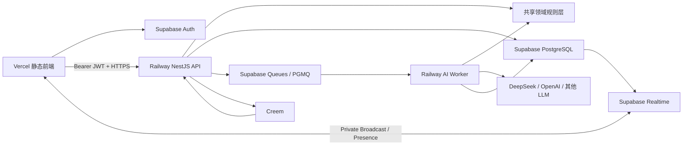
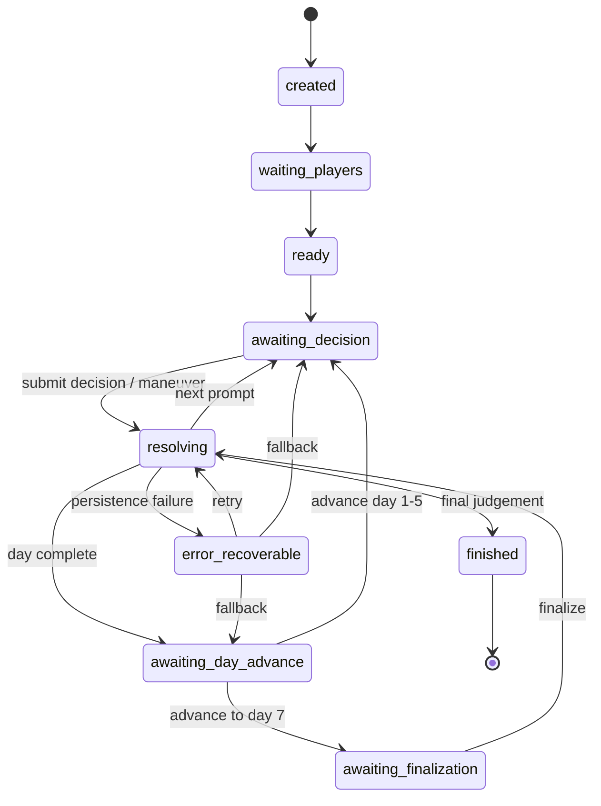

# Our Many Worlds｜Web MVP 与早期多人版完整技术架构方案 v1.1

> 文档类型：系统架构 / 部署方案 / 数据与任务架构 / 实施基线  
> 适用项目：`forwardFish/aiStoryRoom`  
> 适用阶段：Web 单人 MVP → 5—6 人异步多人局 → 早期正式运营  
> 首个故事局：《桑田诏：嘉靖财政危局》  
> 核心目标：在不重写现有前端和 NestJS 后端的前提下，完成可部署、可恢复、可扩展、可计费的 AI 剧情推演平台。

> 文档状态：目标架构与部署实施基线。当前本地代码和本地测试链路已经存在，但 Railway、Supabase 云端项目、Worker 和生产迁移尚未全部执行完成。
>
> 环境原则：本地数据库、Supabase Staging 和 Supabase Production 是三个隔离环境；申请 Supabase 不代表立即删除本地数据库。

---

## 0. 最终结论

当前项目建议锁定为：

> **Vercel 静态前端 + Railway NestJS API + Railway AI Worker + Supabase PostgreSQL/Auth/Queues/Realtime + Creem + LLM API**



核心原则：

```text
PostgreSQL 是唯一事实来源。
NestJS API 是用户命令入口。
AI Worker 是耗时任务执行者。
API 与 Worker 必须共用同一套领域规则。
Supabase Realtime 只负责通知，不负责保存权威状态。
LLM 只生成候选叙事，不直接决定权威状态。
浏览器不得直接修改 StoryRun、Credits、支付记录和 AI 结果。
```

---

# 1. 架构目标

本方案必须同时满足：

1. 当前静态 Web 可以继续部署，不强制迁移 Next.js；
2. NestJS 继续承担核心后端；
3. 单人 MVP 可以尽快上线；
4. AI 推演不会阻塞普通 API 请求；
5. 5—6 人异步多人局可以在同一架构上扩展；
6. 玩家刷新、断线、API 重启、Worker 重启后可以恢复；
7. 同一局不会发生重复推演和状态覆盖；
8. Credits、Creem、退款、争议和游戏解锁可追溯；
9. 角色秘密和私密剧情不会泄露；
10. 后续可以平滑迁移到 AWS ECS/Fargate，而不重写核心业务。

---

# 2. 当前项目技术现状

根据当前仓库结构，项目已经具备以下基础：

```text
apps/web
  静态 HTML / CSS / JavaScript Web 前端

apps/api
  NestJS API

prisma
  PostgreSQL 数据模型

packages/shared
  共享类型与通用逻辑

packages/templates
  剧本与配置
```

当前已经存在：

- NestJS API 入口；
- Prisma PostgreSQL 配置；
- 用户、房间、角色、行动、AI 任务模型；
- Credits、Credits Ledger、CreemPurchase、PaymentWebhookEvent；
- Creem Webhook 签名、幂等和事务处理；
- 规则引擎控制状态、LLM 只负责叙事润色的基础方向。

当前仍需要修复的核心问题：

```text
1. v4 MVP 在配置 DATABASE_URL 且 MVP_STORY_STORAGE != file 时可以使用 Prisma；仍需确认所有入口都不再回退到本地文件，并完成生产数据迁移验收。
2. StoryEvent、快照和公共投影仍需统一为生产级 append-only 事件与可恢复投影。
3. AI 调用仍在 API 请求中同步执行。
4. 当前 Auth 仍使用 openid 字符串作为 Bearer Token。
5. 部分 v4 接口缺少统一认证与对象级权限。
6. API 和 Worker 的共享领域服务尚未拆出。
7. Realtime、队列、自愈和任务租约尚未形成闭环。
8. AiTask 当前还需要补齐幂等键、租约、重试和失效任务字段。
9. 当前静态前端在非本地环境默认使用同源 `/api`；如果 API 使用 Railway 独立域名，必须补充构建时 API Base URL 或 Vercel Rewrite。
10. 生产启动仍偏开发模式，缺少编译后运行、独立迁移和可执行的 Worker 入口。
```

---

# 3. 不采用的方案

## 3.1 当前不整体迁移 Next.js

当前不建议：

```text
静态 Web
→ 全部重写为 Next.js
→ API 一并迁入 Vercel Functions
```

原因：

- 当前前端已经是可运行的静态 Web；
- Next.js 迁移属于前端重写，不是简单部署调整；
- 当前最大风险在数据库运行态、AI 异步任务和认证，而不是 SSR；
- 迁移不能直接提升 AI 游戏玩法验证质量。

Next.js 可以在以下阶段再评估：

- SEO 需要明显增强；
- 用户中心和多路由复杂度大幅提高；
- 需要 SSR 或服务端组件；
- 需要统一 Web 应用工程体系；
- 核心玩法和商业模型已经验证。

## 3.2 不让浏览器直写核心 Supabase 表

禁止：

```text
浏览器
→ Supabase Client
→ 直接 update StoryRun
→ 直接 update CreditWallet
→ 直接 insert PaymentWebhookEvent
```

浏览器只能：

- 调用 Supabase Auth；
- 订阅 Realtime；
- 上传被允许的非敏感文件；
- 读取明确公开的数据。

所有权威业务写入必须由可信后端完成。

## 3.3 不把所有后端部署成 Vercel Serverless Function

不建议把以下内容全部放入 Vercel Functions：

- 长时间 AI 推演；
- Worker 消费循环；
- 多玩家状态事务；
- Creem 支付账本；
- 队列重试；
- 任务自愈；
- 长时间后台维护。

这些更适合 Railway 的长期运行容器。

---

# 4. 服务职责边界

## 4.1 Vercel：静态前端

负责：

```text
首页
登录页
注册页
故事大厅
角色选择
创建房间
加入房间
主游戏页面
结局页面状态
图片、CSS、JavaScript
CDN 和 HTTPS
```

不负责：

```text
游戏状态权威写入
AI 推演
Credits 账本
Creem Webhook
后台队列消费
```

推荐域名：

```text
https://ourmanyworlds.com
https://www.ourmanyworlds.com
```

## 4.2 Railway NestJS API：用户命令入口

负责：

```text
认证后的 API 访问
业务 User 映射
房间创建与加入
邀请码
角色选择
房主权限
StoryRun 查询
StoryEvent 公共投影
玩家主线决策
主动谋划
关键事件延后
进入下一天
最终裁决任务创建
Credits 查询和扣减
Creem Checkout
Creem Webhook
退款和争议处理
管理后台 API
限流、审计和日志
```

API 不负责在 HTTP 请求中等待完整 LLM 推演。

## 4.3 Railway AI Worker：耗时任务执行者

负责：

```text
消费 Supabase Queue
领取 AiTask 租约
读取权威 StoryRun 与 StoryEvent
构建 AI 上下文
调用 LLM
解析和 Schema 校验
业务规则校验
规则 fallback
事务写回结果
更新 StoryRun
追加 StoryEvent
更新 AiTask
发送 Realtime 通知
执行任务自愈扫描
```

Worker 不提供公开业务 API。

Worker 不应复制一套 StoryRun 状态更新逻辑。Worker 负责消费任务、调用模型和提交候选结果；最终状态必须由 API 与 Worker 共用的领域应用服务校验并落账。

## 4.4 Shared Domain Layer：共享领域规则层

API 与 Worker 必须共享：

```text
StoryRun 状态机
ActionGuard
主线决策规则
主动谋划规则
状态补丁校验
角色知识边界
公共投影
StoryEvent 生成
FateSeed
结局候选计算
幂等处理
Credits 扣减规则
成本限制
fallback
```

推荐目录：

```text
apps/api/src/
  api/
  worker/
  domain/
    auth/
    story-run/
    story-event/
    story-player/
    ai-task/
    rules/
    guard/
    projection/
    credits/
    billing/
```

必须避免：

```text
API 中复制一套状态更新逻辑
Worker 中再复制另一套状态更新逻辑
```

## 4.5 Supabase PostgreSQL：唯一事实来源

保存：

```text
用户业务资料
StoryRun 当前快照
StoryPlayer 房间成员
StoryRole 角色状态
StoryEvent 事件流
AiTask 任务账本
Credits 余额和流水
Creem 订单和 Webhook
邀请和推荐
用户反馈
审计日志
```

任何客户端显示状态都必须可由 PostgreSQL 恢复。

## 4.6 Supabase Queues：任务唤醒与分发

负责：

```text
AI 决策推演任务
主动谋划推演任务
日终总结任务
最终裁决任务
章节/分享卡生成任务
后台补偿任务
```

Queue 不保存完整业务事实。

> `AiTask` 是任务事实来源，Queue 只是通知 Worker“有任务需要处理”。

## 4.7 Supabase Realtime：即时通知

负责：

```text
玩家加入
玩家离开
玩家准备
角色被占用
玩家已提交
StoryRun 状态更新
AI 推演完成
关键事件产生
房间版本变化
在线 Presence
```

Realtime 不负责：

```text
传输完整角色秘密
保存故事状态
直接修改游戏状态
保证事件一定送达
```

## 4.8 Creem：支付

负责：

```text
Checkout
收款
退款
争议
税务与 Merchant of Record 能力
支付事件 Webhook
```

Creem Webhook 直接进入 Railway：

```text
https://api.ourmanyworlds.com/api/v4/webhooks/creem
```

## 4.9 LLM：非权威候选输出

LLM 可以：

```text
理解合法的玩家意图
生成角色反应
润色结果故事
生成日终故事
生成最终裁决文案
生成多角色视角叙事
```

LLM 不可以：

```text
直接写数据库
直接修改 Credits
自行越界修改状态
编造不存在的证据来源
决定用户权限
跳过状态机
决定支付结果
```

---

# 5. 部署拓扑

## 5.1 生产域名

```text
ourmanyworlds.com
  Vercel 静态前端

api.ourmanyworlds.com
  Railway NestJS API

Worker
  Railway 私有服务，无公网域名
```

## 5.2 API 访问

前端使用：

```text
PUBLIC_API_BASE_URL=https://api.ourmanyworlds.com/api
```

建议初期直接使用独立 API 域名，不经过 Vercel Rewrite。

优点：

- Creem 签名链路清晰；
- Railway 日志更容易排查；
- API 与静态前端边界明确；
- 后续移动端和其他客户端可复用；
- CORS 问题可显式处理。

## 5.3 部署区域

若首批用户主要在亚洲或东南亚：

```text
Vercel：全球 CDN
Railway API：Singapore
Railway Worker：Singapore
Supabase：Singapore
```

如果后续主要用户在美国，再评估迁移到美国区域。

API、Worker 和数据库尽量保持同区域，减少数据库网络延迟。

---

# 6. 核心数据模型

## 6.1 User

业务 User 与 Supabase Auth 用户分离：

```prisma
model User {
  id         String   @id @default(cuid())
  authUserId String   @unique @db.Uuid
  email      String?  @unique
  nickname   String?
  avatarUrl  String?
  status     String   @default("active")
  createdAt  DateTime @default(now())
  updatedAt  DateTime @updatedAt
}
```

原因：

- Supabase Auth 负责身份；
- 业务 User 负责产品关系；
- 现有 Credits、支付和 StoryRun 外键可继续使用 CUID；
- 避免把所有业务外键改为 UUID。

## 6.2 StoryRun

表示一局游戏的当前权威快照：

```prisma
model StoryRun {
  id                     String   @id @default(cuid())
  templateKey            String
  templateVersion        String
  ownerUserId            String
  mode                   String
  status                 String
  currentDay             Int
  totalDays              Int
  version                Int      @default(1)
  lastEventSequence      Int      @default(0)
  decisionsCompletedToday Int     @default(0)
  totalDecisionsCompleted Int     @default(0)
  stateJson              Json
  visibility             String   @default("private")
  inviteCode             String?  @unique
  createdAt              DateTime @default(now())
  updatedAt              DateTime @updatedAt

  events                 StoryEvent[]
  players                StoryPlayer[]
  aiTasks                AiTask[]

  @@index([ownerUserId])
  @@index([status, updatedAt])
  @@index([templateKey])
}
```

`stateJson` 保存：

```text
worldState
roleState
relationships
risks
clues
traces
fateSeeds
evidenceLedger
responsibilityLedger
narrativeFrames
activePrompt
pendingCriticalEvents
maneuverState
pursuits
availableLeverage
daySummaries
finalJudgementInputs
```

## 6.3 StoryPlayer

```prisma
model StoryPlayer {
  id           String   @id @default(cuid())
  runId        String
  userId       String
  roleKey      String?
  playerType   String   @default("human")
  status       String   @default("active")
  readyState   String   @default("not_ready")
  joinedAt     DateTime @default(now())
  lastActiveAt DateTime?

  run          StoryRun @relation(fields: [runId], references: [id], onDelete: Cascade)

  @@unique([runId, userId])
  @@unique([runId, roleKey])
  @@index([userId])
  @@index([runId, status])
}
```

## 6.4 StoryEvent

必须新增真正的 append-only 事件表：

```prisma
model StoryEvent {
  id            String   @id @default(cuid())
  runId         String
  sequence      Int
  day           Int
  type          String
  roleKey       String?
  visibility    String   @default("private")
  payloadJson   Json
  originEventId String?
  createdAt     DateTime @default(now())

  run           StoryRun @relation(fields: [runId], references: [id], onDelete: Cascade)

  @@unique([runId, sequence])
  @@index([runId, day, sequence])
  @@index([runId, type])
  @@index([originEventId])
}
```

为什么必须有 `sequence`：

```text
不能只依赖 createdAt 排序。
并发写入可能出现相同时间戳。
sequence 可以稳定恢复叙事顺序。
客户端可以使用 afterSequence 拉取增量。
```

建议事件类型：

```text
run_created
player_joined
player_left
role_claimed
role_released
room_started

story_block
decision_prompt
decision_submitted
decision_result
change_summary

maneuver_submitted
maneuver_result
leverage_used
pursuit_updated

critical_event
critical_event_deferred
critical_response_submitted

state_patch
role_reaction
fate_seed_created
fate_seed_triggered
causal_recall
day_end
final_judgement

ai_task_created
ai_task_completed
system
```

## 6.5 AiTask

```prisma
model AiTask {
  id               String   @id @default(cuid())
  idempotencyKey   String   @unique
  runId            String
  originEventId    String
  taskType         String
  status           String   @default("PENDING")
  baseVersion      Int
  attempt          Int      @default(0)
  maxAttempts      Int      @default(2)
  lockedAt         DateTime?
  lockedBy         String?
  leaseExpiresAt   DateTime?
  nextAttemptAt    DateTime?
  inputDigest      String
  inputJson        Json?
  resultJson       Json?
  rawResponse      String?  @db.Text
  normalizedJson   Json?
  fallbackUsed     Boolean  @default(false)
  fallbackReason   String?
  errorCode        String?
  errorMessage     String?  @db.Text
  inputTokens      Int?
  outputTokens     Int?
  estimatedCost    Decimal? @db.Decimal(12, 6)
  startedAt        DateTime?
  completedAt      DateTime?
  createdAt        DateTime @default(now())
  updatedAt        DateTime @updatedAt

  run              StoryRun @relation(fields: [runId], references: [id], onDelete: Cascade)

  @@index([status, nextAttemptAt])
  @@index([runId])
  @@index([leaseExpiresAt])
}
```

状态建议：

```text
PENDING
RUNNING
RETRYING
SUCCESS
FALLBACK_SUCCESS
FAILED
STALE
ABANDONED
```

## 6.6 EventDelivery

多人阶段增加：

```prisma
model EventDelivery {
  id          String   @id @default(cuid())
  eventId     String
  runId       String
  userId      String
  roleKey     String
  status      String   @default("unread")
  deliveredAt DateTime @default(now())
  readAt      DateTime?
  actedAt     DateTime?

  @@unique([eventId, userId])
  @@index([runId, roleKey, status])
  @@index([userId, status])
}
```

用于控制：

```text
某条事件发给谁
是否已读
是否需要回应
是否已处理
```

---

# 7. StoryRun 状态机

建议状态：

```text
created
waiting_players
ready
awaiting_decision
resolving
awaiting_day_advance
awaiting_finalization
finished
abandoned
error_recoverable
```

状态转移：



关键不变量：

```text
同一时刻最多一个 activePrompt。
第 1—6 天每天固定 2 次主线决策。
关键事件回应占用主线决策槽位。
主动谋划不替代主线决策。
每次权威写入 version 只增加 1。
同一 runId 同时最多一个活跃 AI 裁决任务。
finished 必须存在 finalJudgement。
```

---

# 8. API 与 Worker 的完整流程

## 8.1 玩家提交主线决策

```text
浏览器
→ POST NestJS API
→ 验证 JWT
→ 验证 StoryRun 成员和角色
→ 验证 version
→ 验证 activePrompt
→ ActionGuard
→ 数据库事务
```

事务内：

```text
1. 追加 decision_submitted StoryEvent
2. 创建 AiTask(PENDING)
3. StoryRun.status = resolving
4. StoryRun.version + 1
5. pgmq.send(taskId)
6. 提交事务
```

API 返回：

```http
202 Accepted
```

```json
{
  "accepted": true,
  "runId": "run_xxx",
  "taskId": "task_xxx",
  "status": "resolving",
  "version": 8
}
```

## 8.2 Worker 消费任务

```text
1. 从 pgmq 读取消息
2. 条件更新 AiTask：PENDING → RUNNING
3. 设置 lockedBy、lockedAt、leaseExpiresAt
4. 读取 StoryRun 与事件上下文
5. 检查 StoryRun.version == AiTask.baseVersion
6. 调用 LLM
7. 解析 JSON
8. Schema validate
9. 业务规则 validate
10. 规则引擎生成权威补丁
11. 数据库事务落账
12. AiTask → SUCCESS / FALLBACK_SUCCESS
13. 提交事务
14. 发送 Realtime Broadcast
15. 删除或归档 Queue 消息
```

## 8.3 Worker 落账事务

事务内：

```text
再次锁定 StoryRun
再次检查 version
应用 statePatch
追加 decision_result
追加 change_summary
追加 role_reaction
追加隐藏因果事件
生成下一个 activePrompt 或 day_end
StoryRun.version + 1
更新 lastEventSequence
AiTask 标记完成
```

## 8.4 主动谋划流程

同样使用：

```text
maneuver_submitted
→ AiTask
→ Queue
→ Worker
→ maneuver_result
→ change_summary
```

成功谋划后：

```text
maneuversUsedToday + 1
remainingToday - 1
```

Guard 拒绝时：

```text
不写 AiTask
不扣机会
不增加 version
不产生状态补丁
```

---

# 9. Queue、事务与 Outbox

## 9.1 推荐方式：事务事实 + Outbox 唤醒

Supabase Queues 基于 PostgreSQL/PGMQ。

默认实现基线：

```text
同一个数据库事务：
  写 StoryEvent
  写 AiTask
  更新 StoryRun
  写 AiTaskOutbox
事务提交
Outbox Relay 发送 Queue
```

这样不存在：

```text
AiTask 已创建
Queue 写入失败
Worker 永远收不到
```

只有在 Prisma/PGMQ 的真实集成测试证明 `pgmq.send` 可以稳定参与同一数据库事务时，才允许将 `pgmq.send` 放进上述事务。不能把“网络请求写 Queue”当作事务的一部分。

Queue 不是业务事实来源。`AiTask` 和 `AiTaskOutbox` 必须能在 Queue 暂时不可用时支持补投、重试和对账。

## 9.2 备用方式：Outbox

如果 Prisma 与 `pgmq.send` 无法稳定放在同一事务，则增加：

```prisma
model AiTaskOutbox {
  id          String   @id @default(cuid())
  taskId      String   @unique
  status      String   @default("PENDING")
  attempt     Int      @default(0)
  nextRetryAt DateTime?
  createdAt   DateTime @default(now())
  sentAt      DateTime?
}
```

Outbox Relay：

```text
扫描 PENDING
→ 发送 Queue
→ 标记 SENT
→ 失败重试
```

---

# 10. 同一 StoryRun 串行推演

必须保证：

```text
同一局不能同时运行两个裁决任务。
不同局可以并发。
```

推荐部分唯一索引：

```sql
CREATE UNIQUE INDEX uq_active_ai_task_per_run
ON "AiTask" ("runId")
WHERE status IN ('PENDING', 'RUNNING', 'RETRYING');
```

任务创建时保存：

```text
baseVersion
```

Worker 落账时检查：

```text
StoryRun.version == baseVersion
```

不一致时：

```text
AiTask → STALE
不覆盖新状态
必要时重新生成任务
```

---

# 11. Worker 租约、重试与自愈

## 11.1 租约

领取任务时：

```text
lockedBy = worker instance id
lockedAt = now
leaseExpiresAt = now + 60s
```

长任务执行期间定期续租。

## 11.2 重试

建议：

```text
第一次失败：
RETRYING，短延迟重试

第二次失败：
规则 fallback

fallback 失败：
FAILED + error_recoverable
```

禁止无限重试。

## 11.3 Reconciler

Worker 每分钟扫描：

```text
PENDING 太久
RUNNING 租约过期
StoryRun 卡在 resolving
resultJson 已存在但未落账
Queue 消息丢失
```

处理：

```text
重新入队
接管过期任务
继续落账
执行 fallback
标记 FAILED
```

---

# 12. Realtime 与多人连接

## 12.1 是否需要 Socket

需要实时连接效果，但当前不需要自己开发 Socket.IO。

使用：

```text
Supabase Realtime Broadcast
Supabase Realtime Presence
```

底层已经是 WebSocket。

## 12.2 HTTP 与 Realtime 分工

HTTP API 负责：

```text
创建房间
加入房间
选择角色
准备
开始
提交决策
提交谋划
推进天数
支付
Credits
```

Realtime 负责：

```text
玩家上线/离线
角色占用变化
准备状态变化
有玩家提交
AI 开始
AI 完成
房间版本更新
```

## 12.3 频道

```text
run:<runId>
```

可扩展：

```text
run:<runId>:role:<roleKey>
user:<authUserId>
```

## 12.4 广播内容

只发送轻量通知：

```json
{
  "event": "run.updated",
  "runId": "run_xxx",
  "version": 18,
  "lastEventSequence": 137,
  "reason": "resolution_completed"
}
```

不要广播：

```text
完整故事
角色秘密
状态补丁
Credits
支付信息
LLM 原始输出
```

## 12.5 Realtime 权限

浏览器：

```text
可以订阅私有房间频道
可以发送 Presence
不允许发送 run.updated
```

API / Worker：

```text
使用服务端权限发送 Broadcast
```

RLS 根据：

```text
auth.uid()
StoryPlayer
runId
topic
```

判断是否允许订阅。

## 12.6 断线恢复

Realtime 不是可靠事件账本。

前端必须：

```text
收到 Broadcast → GET 最新状态
页面重新 focus → GET 最新状态
Realtime 断线 → 每 3—5 秒轮询
resolving 状态 → 低频轮询兜底
重新连接 → afterSequence 增量拉取
```

API 返回：

```json
{
  "run": {
    "version": 18
  },
  "lastEventSequence": 137
}
```

增量接口：

```http
GET /api/v4/story-runs/:runId/messages?afterSequence=137
```

---

# 13. Supabase Auth 方案

## 13.1 认证流程

```text
浏览器
→ Supabase Auth 注册/登录
→ 获得 Access Token
→ Authorization: Bearer <JWT>
→ NestJS 验证 JWT
→ 使用 sub 查询业务 User
```

## 13.2 NestJS 验证

NestJS：

```text
验证签名
验证 issuer
验证 audience
验证 exp
验证 sub
检查业务 User.status
```

## 13.3 生产必须移除

```text
openid 直接作为 Bearer Token
x-mock-openid
开发用 mock 登录
旧自定义 Token
```

可以保留本地测试适配器，但生产构建必须禁用。

---

# 14. 对象级权限

仅验证登录不够。

必须增加：

```text
AuthGuard
StoryRunMemberGuard
StoryRunOwnerGuard
RoleVisibilityService
```

权限矩阵：

| 操作 | 房主 | 房间成员 | 非成员 |
|---|---:|---:|---:|
| 读取自己的游戏投影 | 是 | 是 | 否 |
| 凭邀请码加入 | 是 | 是 | 否 |
| 开始游戏 | 是 | 否 | 否 |
| 选择空闲角色 | 是 | 是 | 否 |
| 提交自己的决策 | 是 | 是 | 否 |
| 提交他人角色决策 | 否 | 否 | 否 |
| 读取其他角色秘密 | 否 | 否 | 否 |
| 解散房间 | 是 | 否 | 否 |
| 查询 Credits | 本人 | 本人 | 否 |

公共投影必须根据当前用户角色裁剪：

```text
visibility=public
visibility=private
visibility=role_only
visibility=hidden
```

---

# 15. Creem 与 Credits

## 15.1 支付路径

```text
浏览器
→ NestJS 创建本地 CreemPurchase(PENDING)
→ NestJS 调 Creem Checkout
→ 用户支付
→ Creem Webhook
→ NestJS 验签
→ Serializable 事务
→ 更新订单
→ CreditGrant
→ CreditLedger
→ CreditWallet
```

## 15.2 Webhook 原则

必须保留：

```text
原始请求体
签名验证
eventId 幂等
产品、金额、货币校验
订单状态机
Serializable 事务
退款和争议反向账本
```

## 15.3 支付不依赖 Queue 的 Exactly Once

支付最终一致性依赖：

```text
PaymentWebhookEvent.eventId 唯一约束
CreemPurchase 唯一字段
CreditLedger.idempotencyKey 唯一约束
数据库事务
```

Queue 只能用于非关键异步通知。

---

# 16. AI 上下文和成本控制

## 16.1 不传完整历史

每次 AI 调用只传：

```text
当前 StoryRun 快照
当前 activePrompt
玩家提交
最近 N 条事件
当天摘要
关键历史决策摘要
触发的 ContextCard
角色可知事实
隐藏暗线摘要
```

## 16.2 AI 输出流水线

```text
buildContext
→ callProvider
→ parseJson
→ normalize
→ JSON Schema validate
→ business validate
→ clamp
→ rule approve
→ transaction apply
```

## 16.3 成本限制

环境变量：

```text
AI_RUN_MAX_CALLS
AI_RUN_MAX_TOTAL_TOKENS
AI_RUN_COST_SOFT_LIMIT
AI_RUN_COST_HARD_LIMIT
AI_TIMEOUT_MS
AI_MAX_RETRIES
```

降级顺序：

```text
1. ActionGuard 改确定性规则
2. 结构化谋划改规则模板
3. 日终摘要改模板
4. 主线保留有限 AI
5. 最终裁决使用规则候选 + 模板文案
```

---

# 17. 生产构建与启动

## 17.1 API

开发：

```text
tsx src/main.ts
```

生产：

```text
pnpm build
node dist/main.js
```

建议脚本：

```json
{
  "scripts": {
    "build": "tsc -p tsconfig.build.json",
    "start:api": "node dist/main.js",
    "start:worker": "node dist/worker.js",
    "migrate:deploy": "prisma migrate deploy"
  }
}
```

## 17.2 Railway 服务

### API Service

```text
名称：ourmanyworlds-api
域名：api.ourmanyworlds.com
启动：pnpm --filter @apps/api start:api
健康检查：/api/health/ready
```

### Worker Service

```text
名称：ourmanyworlds-worker
无公网域名
启动：pnpm --filter @apps/api start:worker
```

### Migration Service / Release Command

生产数据库迁移必须是单独的一次性执行单元，不能让 API 和 Worker 启动时同时执行迁移：

```text
名称：ourmanyworlds-migration
类型：一次性部署/Release Command
命令：pnpm prisma migrate deploy
执行成功后，才允许发布或重启 API 与 Worker
```

Railway 的实际使用顺序：

```text
1. 在 Railway 创建 Project，并创建 Staging Environment。
2. 从 GitHub 连接 forwardFish/aiStoryRoom。
3. 创建 API Persistent Service，设置 API 启动命令和公网域名。
4. 基于同一个仓库创建 Worker Persistent Service，设置 Worker 启动命令，不分配公网域名。
5. 创建 Migration Service 或受保护的 Release Command，只运行 prisma migrate deploy。
6. 在 API、Worker、Migration 三个服务分别注入所需环境变量。
7. 先执行 Migration，再部署 API，再部署 Worker。
8. 用 API Health Check、Worker 心跳和 Queue 延迟确认部署状态。
```

Vercel 发布前还必须完成前端 API 地址接入：

```text
PUBLIC_API_BASE_URL=https://api.ourmanyworlds.com/api
```

该变量必须真正被静态前端构建产物读取；仅在 Railway 设置它不会改变浏览器代码。另一种方案是在 `vercel.json` 配置 `/api/*` 到 Railway 的 rewrite。两者只能选一种，不能让前端在生产环境继续默认请求不存在的 Vercel `/api`。

Railway 服务不是数据库。Railway 只负责运行 API、Worker 和迁移命令；数据库仍由 Supabase PostgreSQL 提供。Railway 支持长期运行 Service，Worker 应使用 Persistent Service，而不是 Cron Job。[Railway Services](https://docs.railway.com/services)

当前仓库尚未提供可直接部署的 `start:worker`、编译后的 `dist/worker.js` 和完整生产 `build` 脚本。因此本节是部署目标，不代表现在已经可以直接点击 Deploy 完成生产部署；必须先完成 Worker 入口、生产构建和健康检查实现。

Railway CLI 仅作为可选工具，常用流程为：

```powershell
railway login
railway link
railway up
railway service status --all
railway service logs --all
```

正式部署优先使用 GitHub 自动部署；CLI 适合本地手动验证和查看日志。

## 17.4 端口

```ts
const port = Number(
  process.env.PORT ??
  process.env.API_PORT ??
  3001
);
```

## 17.5 优雅退出

API：

```text
停止接受新请求
完成当前事务
断开 Prisma
退出
```

Worker：

```text
停止领取新任务
完成或释放当前租约
完成当前数据库事务
断开 Prisma
退出
```

---

# 18. 数据库连接与迁移

Railway API 和 Worker 是常驻服务。

连接方式：

```text
Railway API/Worker：优先 Direct Connection 5432；如果 Railway 网络无法访问 Supabase IPv6，则使用 Supavisor Session Pooler 5432。
Migration / pg_dump / restore：优先 Direct Connection 5432；IPv4 环境可使用 Session Pooler 5432。
不要给常驻 Prisma API、Worker 或迁移命令使用 Transaction Pooler 6543。
```

Supabase 官方对连接方式的建议是：Direct Connection 适合迁移、备份和长期连接；Session Pooler 适合 IPv4 网络中的持久后端；Transaction Pooler 主要面向 Serverless/Edge 临时连接。[Supabase 连接 PostgreSQL](https://supabase.com/docs/guides/database/connecting-to-postgres)、[Supabase Prisma](https://supabase.com/docs/guides/database/prisma)

迁移单独执行：

```text
Release Job
→ prisma migrate deploy
→ 成功后部署 API
→ 成功后部署 Worker
```

禁止：

```text
API 启动自动 migrate
Worker 启动自动 migrate
多个副本并发 migrate
生产使用 prisma db push
生产使用 prisma migrate dev
```

---

# 19. 环境划分

| 环境 | 前端 | API/Worker | Supabase | Creem | AI |
|---|---|---|---|---|---|
| local | 本地静态 Web | 本地 NestJS/Worker | 本地 Docker 或开发库 | Test | mock/rules |
| test | CI | 隔离测试进程 | 隔离数据库 | Mock | 固定 Mock |
| staging | Vercel Preview/Staging | Railway Staging | 独立 Staging 项目 | Test | 真实模型+限额 |
| production | 正式域名 | Railway Production | 独立 Production 项目 | Live | 真实模型+告警 |

## 19.1 本地数据库是否保留

需要保留本地 PostgreSQL，至少保留到生产上线稳定之后：

```text
本地 Docker PostgreSQL：离线开发、快速回归、破坏性迁移验证、测试数据重置
Supabase Staging：云端连接、Railway API/Worker 联调、备份恢复和 Realtime 验证
Supabase Production：正式用户、正式支付、正式数据
```

申请 Supabase 后，不要立刻把本地 `.env` 永久改成 Production 数据库。正确顺序是：

```text
本地测试通过
→ 创建 Supabase Staging 项目
→ 用 Prisma migration deploy 建立 Staging schema
→ Railway Staging API/Worker 联调
→ 完成备份、恢复、Queue、Auth、Realtime 和支付 Test 验收
→ 再创建 Production 项目
```

本地数据库不是多余的生产数据库替代品，而是可重复开发和故障演练环境。所有环境必须使用不同的数据库、Auth 项目、Queue、Realtime 房间和密钥。

不得共用：

```text
数据库
Supabase Service Role Key
Creem Secret
AI Key
Queue
Realtime 房间
```

---

# 20. 环境变量

## 20.1 前端

```bash
PUBLIC_API_BASE_URL=https://api.ourmanyworlds.com/api
SUPABASE_URL=
SUPABASE_ANON_KEY=
APP_ENV=production
```

## 20.2 API

```bash
NODE_ENV=production
PORT=
DATABASE_URL=
SUPABASE_URL=
SUPABASE_JWT_ISSUER=
SUPABASE_JWKS_URL=
SUPABASE_SERVICE_ROLE_KEY=

CORS_ALLOWED_ORIGINS=https://ourmanyworlds.com,https://www.ourmanyworlds.com

CREEM_API_KEY=
CREEM_WEBHOOK_SECRET=
PUBLIC_WEB_URL=https://ourmanyworlds.com
PUBLIC_API_URL=https://api.ourmanyworlds.com

AI_QUEUE_NAME=ai-resolution
API_WRITE_RATE_LIMIT_PER_MINUTE=120

LOG_LEVEL=info
SENTRY_DSN=
```

## 20.3 Worker

```bash
NODE_ENV=production
DATABASE_URL=
SUPABASE_URL=
SUPABASE_SERVICE_ROLE_KEY=

AI_QUEUE_NAME=ai-resolution
WORKER_ID=
WORKER_CONCURRENCY=2
TASK_LEASE_SECONDS=90
TASK_RECONCILE_INTERVAL_MS=60000

AI_PROVIDER=deepseek
AI_API_KEY=
AI_BASE_URL=
AI_MODEL=
AI_TIMEOUT_MS=25000
AI_MAX_RETRIES=1
AI_RUN_MAX_CALLS=55
AI_RUN_MAX_TOTAL_TOKENS=260000
AI_RUN_COST_SOFT_LIMIT=
AI_RUN_COST_HARD_LIMIT=

LOG_LEVEL=info
SENTRY_DSN=
```

---

# 21. 健康检查

## 21.1 API

```text
GET /api/health/live
```

只判断进程存活。

```text
GET /api/health/ready
```

检查：

```text
数据库连接
必要环境变量
Supabase 配置
Creem 配置状态
```

## 21.2 Worker

Worker 不需要公网接口，但应在日志/指标中暴露：

```text
lastHeartbeatAt
lastTaskCompletedAt
activeTaskCount
queueLag
expiredLeaseCount
```

---

# 22. 日志与可观测性

结构化日志字段：

```text
requestId
userIdHash
runId
eventId
aiTaskId
idempotencyKey
versionBefore
versionAfter
queueLatencyMs
llmLatencyMs
transactionLatencyMs
fallbackUsed
inputTokens
outputTokens
estimatedCost
errorCode
```

核心指标：

```text
API 5xx
API P95
Queue oldest age
PENDING count
RUNNING lease expired
StoryRun resolving too long
AI timeout rate
AI invalid JSON rate
fallback rate
single-run cost
VERSION_CONFLICT rate
duplicate submission rate
Realtime broadcast failure
Creem Webhook failure
```

禁止普通日志记录：

```text
Authorization Header
Supabase Service Role Key
Creem Secret
完整 Prompt
完整角色秘密
完整自定义决策文本
数据库密码
```

---

# 23. 备份与恢复

建议目标：

```text
RPO ≤ 15 分钟
RTO ≤ 2 小时
```

必须具备：

```text
每日数据库备份
至少 7—30 天保留
每月恢复演练
StoryEvent append-only
StoryRun 可从 StoryEvent 重建
AiTask 可自愈
Creem Webhook 可重复投递
```

恢复流程：

```text
1. 恢复数据库
2. 校验 StoryRun.version 与 lastEventSequence
3. 重放 StoryEvent
4. 扫描 PENDING/RUNNING AiTask
5. 重入队或 fallback
6. 校验 Credits 与 Ledger
7. 恢复 Realtime 通知
```

---

# 24. CI/CD

## 24.1 CI

```bash
pnpm install --frozen-lockfile
pnpm db:generate
pnpm typecheck
pnpm test:causal
pnpm test:story:e2e
pnpm test:world-credits
pnpm test:security-projection
pnpm test:paths
```

## 24.2 CD

推荐顺序：

```text
1. Merge main
2. CI 通过
3. Staging migrate deploy
4. Staging API/Worker 部署
5. Staging E2E
6. Production migrate deploy
7. Production API 部署
8. Production Worker 部署
9. Vercel 前端发布
10. Smoke Test
```

---

# 25. 安全基线

必须完成：

```text
Supabase JWT 验证
对象级权限
角色级信息隔离
输入长度限制
HTML escape
Prompt 注入隔离
JSON Schema 校验
状态补丁白名单
Credits 幂等
Creem Webhook 验签
Service Role Key 不进入前端
生产关闭 x-mock-openid
CORS 白名单
Rate Limit
管理员接口权限
安全日志脱敏
```

---

# 26. 多人房间流程

```text
房主创建房间
→ 生成 inviteCode
→ 玩家加入
→ Presence 显示在线
→ 玩家选择角色
→ 数据库唯一约束防止重复占用
→ 玩家准备
→ 房主开始
→ 每个玩家获得角色专属投影
→ 玩家分别提交
→ StoryEvent 记录已提交状态
→ 满足裁决条件
→ 创建唯一 AiTask
→ Worker 统一推演
→ 分别生成角色视角事件
→ Realtime 通知
→ 客户端重新 GET
```

当前适合异步多人，不适合强同步秒级玩法。

---

# 27. 分阶段实施计划

## P0：生产阻断项

```text
1. 新建 StoryEvent。
2. v4 FileMvpStoryStorage 迁移 PostgreSQL。
3. 统一 StoryRun 运行态。
4. 提取 Shared Domain Layer。
5. AiTask 增加幂等、租约、重试和 baseVersion。
6. Supabase Queue 事务化入队。
7. Railway Worker 消费闭环。
8. 同一 StoryRun 串行任务约束。
9. Supabase Auth JWT。
10. 所有 v4 API 权限保护。
11. 生产编译后运行。
12. 健康检查、迁移和环境变量。
13. Railway API Service、Worker Service 和 Migration Service 可独立启动。
14. Railway API 公网 HTTPS、Creem Webhook 和 Vercel API Base URL 联通。
15. Supabase Staging 的 Prisma migration、Queue、Auth 和 Realtime 验收完成。
```

## P1：单人公开 MVP

```text
1. Vercel 静态前端。
2. Railway API。
3. Railway Worker。
4. Supabase PostgreSQL/Auth/Queue。
5. resolving 轮询恢复。
6. 20 局连续模拟。
7. AI 超时和 fallback。
8. Creem Test。
9. 日志和告警。
10. 备份恢复测试。
```

单人阶段 Realtime 可后置，先轮询也可以上线。

## P2：5—6 人异步多人

```text
1. 房间和邀请码。
2. StoryPlayer。
3. 角色占用。
4. 准备状态。
5. Supabase Broadcast。
6. Presence。
7. 私有频道 RLS。
8. EventDelivery。
9. 多角色投影。
10. 全员提交后统一裁决。
```

## P3：正式增长阶段

```text
Redis/BullMQ（只有需要时）
独立 Socket Gateway（只有强同步时）
API 多实例
Worker 自动扩容
读写优化
对象存储
更完整监控
AWS ECS/Fargate 迁移评估
```

---

# 28. MVP 成本级别

开发和内部测试：

```text
Vercel Hobby
Railway Hobby
Supabase Free
Creem Test
少量 LLM
```

正式早期 MVP：

```text
Vercel Pro
Railway API + Worker
Supabase Pro
Creem 无固定月费
LLM 按局计费
```

真正需要重点控制的不是 Socket 成本，而是：

```text
每局 AI 调用数
上下文 Token
输出长度
失败重试率
Railway Worker 常驻内存
```

---

# 29. 发布前最终检查表

## 数据

```text
[ ] v4 不再使用本地文件作为生产权威
[ ] StoryEvent 可按 sequence 重放
[ ] StoryRun 有 version
[ ] 同一局只有一个活动 AI 任务
[ ] AiTask 有租约和自愈
[ ] Credits 与支付幂等
```

## 认证与权限

```text
[ ] Supabase Auth 生效
[ ] 生产关闭 mock token
[ ] 所有 v4 接口需要 JWT
[ ] 房间成员权限生效
[ ] 角色私密投影验证通过
```

## Worker

```text
[ ] API 返回 202
[ ] Worker 可消费 Queue
[ ] 超时可重试
[ ] 双失败可 fallback
[ ] Worker 重启不重复落账
[ ] StoryRun 不会永久卡 resolving
```

## Realtime

```text
[ ] 私有频道
[ ] 浏览器不可广播权威事件
[ ] Broadcast 只发轻量通知
[ ] 断线轮询生效
[ ] afterSequence 可补事件
```

## 部署

```text
[ ] API 使用 PORT
[ ] API 编译后运行
[ ] Worker 编译后运行
[ ] migrate deploy 独立执行
[ ] Railway API Service 已部署并有公网 HTTPS 域名
[ ] Railway Worker Service 已部署且无公网域名
[ ] Railway Migration Service/Release Command 已执行成功
[ ] health/live 正常
[ ] health/ready 正常
[ ] Worker heartbeat 正常
[ ] Queue oldest age 和 resolving 超时可观测
[ ] Vercel PUBLIC_API_BASE_URL 指向 Railway API
[ ] Staging 与 Production 隔离
```

## 支付

```text
[ ] Creem Webhook 直接指向 Railway
[ ] rawBody 正常
[ ] 签名验证正常
[ ] 重复 Webhook 不重复入账
[ ] Refund/Dispute 可逆转 Credits
```

---

# 30. 最终架构决策

| 问题 | 最终选择 |
|---|---|
| 前端是否迁移 Next.js | 当前不迁移 |
| 前端部署 | Vercel |
| 核心后端 | Railway NestJS |
| AI 任务 | Railway Worker |
| 数据库 | Supabase PostgreSQL |
| 本地开发数据库 | Docker PostgreSQL，继续保留 |
| ORM | Prisma |
| 登录 | Supabase Auth |
| 队列 | Supabase Queues / PGMQ |
| 实时连接 | Supabase Realtime |
| 是否自建 Socket.IO | 当前不需要 |
| 是否使用 Redis | 当前不需要 |
| 支付 | Creem → Railway API |
| 业务事实权威 | PostgreSQL |
| 用户命令入口 | NestJS API |
| AI 执行者 | Worker |
| AI 权威程度 | 非权威候选输出 |
| 未来云迁移 | AWS ECS/Fargate 可平滑迁移 |

---

# 31. 一句话总结

> **Vercel 负责展示，Supabase Auth 负责身份，NestJS API 负责用户命令和权限，PostgreSQL 保存唯一事实，Queue 唤醒 Worker，Worker 执行 AI 并按共享规则落账，Realtime 只通知客户端刷新，Creem 负责支付，LLM 只生成非权威候选叙事。**

这套方案可以支撑：

```text
当前单人 Web MVP
→ 5—6 人异步多人局
→ 早期正式收费
→ 后续 AWS 容器化迁移
```
