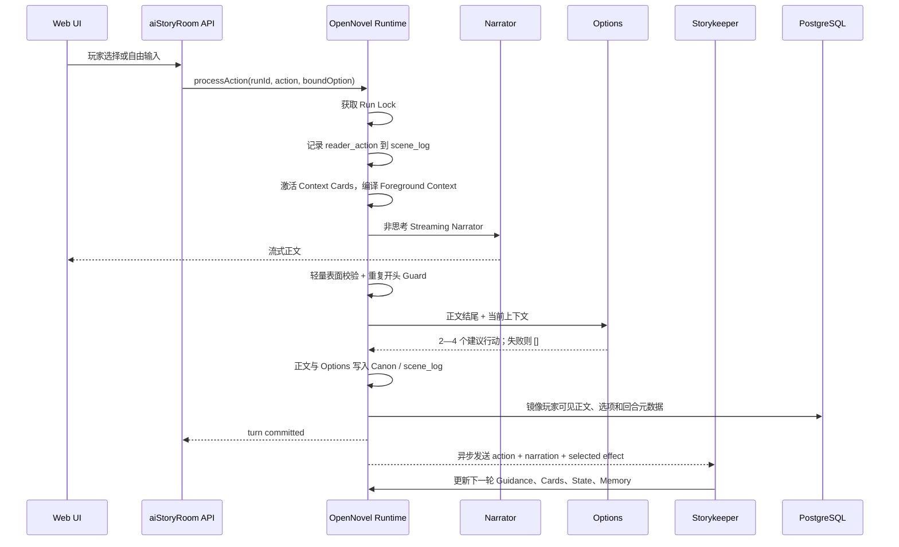

# Our Many Worlds：《桑田诏》OpenNovel-First 运行时迁移与验证方案

> 文档版本：v2.0
> 日期：2026-07-27
> 替代文档：`Our_Many_Worlds_桑田诏剧情生成链反复失败根因与OpenNovel融合整改方案_v1.0.md`
> 当前决策：**停止沿原有“确定性结算 → 严格正文语义校验 → 失败拒绝发布”的路线继续修补，新增独立的 `OPENOVEL_V1` 运行模式，优先验证 OpenNovel 的真实前景/后台双循环。**
> 首个验证范围：`《桑田诏》Solo / 浙江总督 / G00—T05`，通过后再扩展至 `T20`。
> 上游参考：`https://github.com/Feed-Scription/openovel`
> 上游许可证：Apache License 2.0。

---

## 1. 最终结论

过去两天的失败已经证明，原路线无法通过继续增加 Prompt、禁词、中文正则和物件专用规则收敛。

原路线要求系统同时做到：

```text
服务器先完整确定本轮事实
→ Narrator 将事实逐项写成小说
→ Validator 从开放中文中反向恢复主语、动作、对象和持久状态
→ 恢复结果必须与服务器事实完全一致
→ 任一歧义或误判都拒绝整回合
```

其中最不可行的部分是：

> **要求本地程序可靠地从任意中文小说表达中反向恢复持久因果事实。**

“目光移到已经合拢的回文匣上”被误判为“总督操作了回文匣”，不是一个孤立 Bug，而是该架构无法穷举自然语言语义的决定性证据。

因此，本次不再继续设计“更聪明的严格 Validator”，而是直接试验 OpenNovel 已经验证可玩的核心思路：

```text
前景循环优先保证玩家立即得到连续正文
→ Recent Canon 决定故事现在停在哪里
→ Options 是辅助行动建议，失败不阻断自由输入
→ 正文进入 Canon 后，后台 Storykeeper / World Keeper 再维护状态、压力、记忆和下一轮工作集
→ 后台可能滞后一轮，但当前镜头始终以 Recent Canon 为准
```

本次试验的目标不是证明 OpenNovel 的方式在理论上完美，而是回答一个产品问题：

> **当我们停止逐句拦截小说正文，改用 OpenNovel 的双循环后，《桑田诏》能否先连续、自然、可玩地运行 5—20 回合？**

---

## 2. 本文相对 v1.0 的根本变化

v1.0 的结论仍然保留一半 OpenNovel、一半严格因果运行时：

```text
OpenNovel 小工作集
+ 服务器预计算 Causal Delta
+ 发布前持久因果硬校验
+ Narrator 失败不进入 Canon
```

这仍然会把主要工程投入放在“怎样准确理解正文有没有越权”上。

v2.0 改为真正的 OpenNovel-First：

```text
第一阶段：尽量原样移植 OpenNovel 的前景生成与后台慢循环
第二阶段：只观察错误，不在玩家主链中阻断
第三阶段：玩家体验验证完成后，再决定是否需要添加极少数持久事实锁
```

### 2.1 本次明确删除的前置要求

在 `OPENOVEL_V1` 模式中，以下内容不再作为正文发布前硬门：

- 不再通过中文正则判断物件持有人是否改变；
- 不再跨 clause 推断 `activeActor`；
- 不再根据“递、放、移、合拢、打开”等词推断持久状态；
- 不再要求正文逐项覆盖完整 Settlement；
- 不再要求一次 Narrator 调用必须同时满足所有 Section、Kernel、Causal Arc 和 Pending Consequence；
- 不再因轻微人物站位、物件描写和指代歧义中止整回合；
- 不再要求正式验证零重试；
- 不再要求 Options 失败时整回合失败；
- 不再要求 Storykeeper 在下一次玩家操作前完成；
- 不再要求每次失败都从全新 G00 重跑，开发阶段允许从新 Run 快速验证根因。

### 2.2 当前保留的资产

以下已有工作不是作废，而是从“每轮施工合同”降为“世界初始化与后台维护材料”：

```text
Part Contract
Section Contract
StoryCapabilityRequirement
Actor Policy
Institution Capability
Causal Rule / Causal Arc
Decision Kernel
Narrative Style Profile
原著 Evidence
Approved Adaptation
现有 opening.json
角色、地点、文书和关键物件资产
```

这些资产将用于：

1. 初始化 OpenNovel Story Workspace；
2. 生成 `FOREGROUND.md` 的初始内容；
3. 生成角色卡、背景卡和导演笔记；
4. 给 Storykeeper 提供长期方向；
5. 在后台影子审计中判断剧情偏移。

它们不再原样倾倒给每轮 Narrator。

---

## 3. 为什么选择直接移植，而不是继续模仿

OpenNovel 当前已经实现了完整可玩的核心链路：

```text
Reader Action
→ Append-only Scene Log
→ Trigger Context Cards
→ Compile Foreground Context
→ Stream Narrator Prose
→ Generate Optional Choices
→ Append Canon
→ Queue Background Work
→ Storykeeper / Resident Agents 更新下一轮工作集
```

它的关键价值不只在 Prompt，而在各组件之间的职责关系：

- `Recent Canon` 是当前镜头权威；
- `Foreground Guidance` 是小型、可能滞后的持久指导；
- Narrator 只负责写一个前景 beat；
- Options 是 UI affordance，不是 Canon；
- Storykeeper 在正文发布之后处理维护；
- 后台失败不会让已完成的前景正文消失；
- Options 失败时仍可自由输入；
- 精确重复上一回合开头时可以定向重试；
- 不使用语义正则逐句否决小说正文。

如果只抄它的 Prompt，但继续使用当前的严格发布门，仍然无法得到 OpenNovel 的真实行为。

因此本次应优先复用代码和运行顺序，而不是继续抽象一套“类似 OpenNovel”的新架构。

---

## 4. 推荐实施方式：独立运行时服务，不直接揉进旧引擎

### 4.1 新增独立模式

每个 Solo Run 在创建时冻结运行时模式：

```ts
export type SoloRuntimeMode =
  | "LEGACY_DETERMINISTIC"
  | "OPENOVEL_V1";
```

首批只为《桑田诏》新建测试 Run 使用：

```json
{
  "worldId": "sangtian",
  "roleId": "zhejiang_governor",
  "runtimeMode": "OPENOVEL_V1"
}
```

原则：

- 旧 Run 不迁移；
- 旧运行时不删除；
- 两种模式不共享本轮编排代码；
- `OPENOVEL_V1` 失败不能回退到旧 Narrator；
- 通过 Feature Flag 控制测试用户和世界；
- 实验成功后再讨论统一运行时。

### 4.2 推荐仓库结构

不要把 OpenNovel 文件散落复制到现有 `solo-story-engine` 中。应建立清晰的上游快照和适配层：

```text
aiStoryRoom/
├─ third_party/
│  └─ openovel/
│     ├─ LICENSE
│     ├─ UPSTREAM_COMMIT
│     ├─ UPSTREAM_SOURCE.md
│     └─ src/                    # 只复制本次使用的上游核心文件，尽量保持原样
├─ apps/
│  ├─ api/
│  │  └─ src/openovel-adapter/   # 鉴权、Credits、数据库映射、SSE 转发
│  └─ openovel-runtime/          # 独立 Node 运行时服务
│     ├─ src/
│     │  ├─ upstream/            # 从 third_party 导入或构建时同步
│     │  ├─ adapters/
│     │  │  ├─ provider.adapter.ts
│     │  │  ├─ workspace.adapter.ts
│     │  │  ├─ event-mirror.adapter.ts
│     │  │  └─ auth.adapter.ts
│     │  ├─ http/
│     │  └─ workers/
│     └─ package.json
└─ docs/
   └─ third-party/
      └─ openovel-attribution.md
```

### 4.3 为什么使用独立服务

OpenNovel 原项目是 Node/Electron + 本地文件工作区 + 常驻后台 Agent。当前 aiStoryRoom 是 Web/API/数据库架构。

若直接把它塞进现有 NestJS 请求链，会遇到：

- Serverless 或短生命周期进程无法持续运行 Storykeeper；
- 本地文件工作区与多用户请求混杂；
- 同一 Run 的并发操作需要互斥；
- Background Agent 可能在 HTTP 请求结束后继续运行；
- 旧引擎类型与 OpenNovel 文件模型发生大量耦合。

独立 Railway Runtime Service 更接近 OpenNovel 的真实运行环境：

```text
Web UI
→ aiStoryRoom API（鉴权、房间、Credits）
→ OpenNovel Runtime Service（前景生成、文件工作区、后台 Agent）
→ Railway Persistent Volume
→ 关键玩家可见数据镜像到现有 PostgreSQL / Supabase
```

本地开发可以直接启动：

```text
pnpm dev:api
pnpm dev:web
pnpm dev:openovel-runtime
```

---

## 5. 上游代码复用与许可证处理

OpenNovel 使用 Apache License 2.0，允许复制、修改、制作衍生作品和商业分发，但必须履行许可证和署名要求。

### 5.1 必须执行

1. 在仓库保留上游完整 `LICENSE`；
2. 在复制或修改的源文件顶部保留原版权与许可证声明；
3. 修改过的文件增加显著说明，例如：

```text
Modified for Our Many Worlds on 2026-07-27.
Changes: provider adapter, workspace isolation, database mirror, HTTP runtime integration.
```

4. 建立：

```text
third_party/openovel/UPSTREAM_COMMIT
third_party/openovel/UPSTREAM_SOURCE.md
docs/third-party/openovel-attribution.md
```

5. `UPSTREAM_COMMIT` 写入实际复制时使用的 commit SHA；
6. 分发代码或部署包时保留 Apache-2.0 许可证；
7. 不把 OpenNovel 名称、Logo 或产品外观当作 Our Many Worlds 自有商标使用。

### 5.2 推荐的署名文件

```md
# OpenNovel attribution

Portions of this software are derived from Feed-Scription/openovel.
Upstream: https://github.com/Feed-Scription/openovel
License: Apache License 2.0
Upstream commit: <PINNED_COMMIT_SHA>

Copyright 2026 Jacob Zhou and OpenNovel contributors.
Modified by the Our Many Worlds project.
```

### 5.3 不建议的做法

- 不复制后删除版权头；
- 不把复制代码伪装成完全独立原创；
- 不直接跟随 `main` 浮动更新；
- 不在没有记录上游 commit 的情况下做二次修改；
- 不复制不需要的 Electron、图片、TTS 和导出模块扩大维护面。

---

## 6. 上游模块迁移清单

### 6.1 第一批：尽量原样复制

| OpenNovel 文件/模块 | 本项目用途 | 处理方式 |
|---|---|---|
| `src/context/contextCapsule.js` | 构造 Foreground Guidance、Memory、Recent Canon、Reader Action | 原样复制后改 TypeScript 类型和 Adapter 引用 |
| `src/context/contextCompiler.js` | 预算、截取 Recent Canon、组合小工作集 | 原样复制核心逻辑 |
| `src/lib/narrator.js` 中 Narrator 部分 | Streaming 正文、重复开头 Guard、Prompt Builder | 拆出为 `foreground-narrator.ts` |
| `src/lib/narrator.js` 中 Options 部分 | 正文完成后生成 2—4 个可选行动 | 拆出为 `foreground-options.ts` |
| `src/prompts/agentContracts.js` 相关合同 | Narrator、Options 和后台 Agent 输出合同 | 复制使用到的函数，不复制无关渲染合同 |
| `src/runtime/postNarrationRegistrations.js` | Narration 后并行生成 Options | 复制注册/并行思路 |
| `src/workflows/storykeeperContext.js` | 给慢循环构造上下文 | 复制核心上下文组织 |
| `src/workflows/storykeeperWorkflow.js` | Storykeeper 读取正文并维护下一轮工作集 | 复制主循环，适配工具和存储 |
| `src/lib/foregroundCompose.js` | 通过模板组合 `FOREGROUND.md` | 复制 |
| `src/context/foregroundInserts.js` | 根据触发词激活 Context Cards | 第一版可复制确定性触发部分 |

### 6.2 第二批：复制思想，重写适配

| OpenNovel 模块 | 原因 | 本项目适配 |
|---|---|---|
| `src/runtime/sessionProcessor.js` | 与 Electron、本地事件总线、后台任务绑定较深 | 只迁移一回合顺序，重写 HTTP/Queue 包装 |
| `src/lib/storyStore.js` | 上游直接读写本地文件 | 保留文件工作区语义，增加 Run 隔离和数据库镜像 |
| Provider Registry | 当前项目已有模型提供方抽象 | 写 `OpenNovelProviderAdapter` 对接现有 GLM/DeepSeek/Kimi 配置 |
| BackgroundJob / Bus | 当前部署需要跨请求运行 | 使用独立 Runtime 进程内队列，后续再接 Redis/BullMQ |
| Memory Store | 当前用户记忆和故事状态在数据库 | 第一版先使用 Run 本地文件，必要字段镜像数据库 |

### 6.3 本次不复制

```text
src/electron/**
图片生成与 Character Sheets
Comic Mode
TTS
EPUB/TXT Export
Web Search 与 Research Agent
富文本 ovl 自定义 Block
macOS/Windows/Linux 打包代码
桌面 Story Library
```

首个目标只是恢复稳定的互动小说主循环。

---

## 7. 《桑田诏》如何转换成 OpenNovel Story Workspace

### 7.1 每个 Run 一个隔离工作区

```text
/data/openovel/stories/<run-id>/
├─ BRIEF.md
├─ canon/
│  ├─ chapters.md
│  └─ scene_log.jsonl
├─ guidance/
│  ├─ FG_template.md
│  ├─ FOREGROUND.md
│  ├─ cards.md
│  └─ cards.auto.md
├─ frontend/
│  ├─ header.md
│  ├─ scene.md
│  ├─ tone.md
│  ├─ active-characters.md
│  ├─ relationships.md
│  ├─ constants.md
│  ├─ open-threads.md
│  ├─ active-pressures.md
│  ├─ directed-beat.md
│  ├─ pending-consequence.md
│  └─ forbidden.md
├─ context-cards/
├─ director/
│  ├─ ARC.md
│  ├─ OPTIONS.md
│  └─ QUALITY.md
├─ worldkeeper/
├─ state/
├─ memory/
└─ inbox/
```

### 7.2 现有资产到文件的映射

| 现有资产 | OpenNovel Workspace |
|---|---|
| World/Part 概述 | `BRIEF.md` |
| `opening.json` | `canon/chapters.md` 初始开场 + `frontend/scene.md` |
| Narrative Style Profile | `frontend/tone.md` |
| 角色声音、目标、关系 | `frontend/active-characters.md`、`relationships.md`、角色 Context Card |
| 原著不可改变事实 | `frontend/constants.md` |
| 当前 Section 核心问题 | `frontend/open-threads.md` |
| 三日期限、粮价、责任压力 | `frontend/active-pressures.md` |
| 当前必须进入前景的唯一世界动作 | `frontend/directed-beat.md` |
| 已选择行动未来影响 | `frontend/pending-consequence.md` |
| 明确不能提前揭晓的事实 | `frontend/forbidden.md` |
| 证据、人物、机构、地点 | `context-cards/*.md` |
| Part/Section 长期节奏 | `director/ARC.md` |
| 选项风格和假选择约束 | `director/OPTIONS.md` |
| 机器文风、重复和体验问题 | `director/QUALITY.md` |
| 当前结构化状态 | `state/*.json` 或 `state/*.md` |

### 7.3 初始 `FG_template.md`

```md
@include story/frontend/header.md
@include story/frontend/scene.md
@include story/frontend/tone.md
@include story/frontend/active-characters.md
@include story/frontend/relationships.md
@include story/frontend/constants.md
@include story/frontend/open-threads.md
@include story/frontend/active-pressures.md
@include story/frontend/directed-beat.md
@include story/frontend/pending-consequence.md
@include story/guidance/cards.auto.md
@include story/guidance/cards.md
@include story/frontend/forbidden.md
```

### 7.4 初始工作集原则

Narrator 不读取：

```text
完整 Runtime Story Package
完整原著 Evidence
完整 Settlement
数据库路径
Validator Rule
Section Exit Gate JSON
全部 Pending Consequence
全部角色秘密
下一组选项
```

Narrator 只读取：

```text
Foreground Guidance
必要 Context Cards
Durable Memory
Recent Canon
Reader Action（最后）
```

---

## 8. `OPENOVEL_V1` 一回合正式执行顺序



### 8.1 前景循环

1. 为同一 `runId` 获取互斥锁；
2. 读取当前 Snapshot；
3. 将玩家行为写入 append-only scene log；
4. 若选择来自上一轮 Options，验证 Option ID 和 Label 绑定；
5. 自由输入不附带预生成 Effect；
6. 根据 Action 确定性激活 Context Card；
7. 重新组合 `FOREGROUND.md`；
8. 编译小型 Context；
9. Narrator Streaming 生成一个新 beat；
10. 仅执行轻量表面校验；
11. 若开头完整重复上一轮前 50 字，允许一次带定向提示的重试；
12. Narration 完成后调用 Options；
13. Options 失败返回空数组，仍然提交正文；
14. 写入 Canon 和事件日志；
15. 立即返回玩家，不等待 Storykeeper。

### 8.2 后台慢循环

正文提交后：

1. 将本轮 Action、Narration、Options、Selected Effect 写入 Inbox；
2. 若 Storykeeper 未运行，启动一个常驻 Drain Loop；
3. Storykeeper 读取真实 Canon 和当前工作集；
4. 维护 Scene、Characters、Relationships、Constants、Open Threads、Pressures；
5. 更新结构化状态和 Context Cards；
6. 将下一轮最重要的一个外部动作写入 `directed-beat.md`；
7. 将已选择 Option 的 Consequence 写入 `pending-consequence.md`；
8. 记录质量、重复和节奏问题；
9. 不修改已经发布的 Canon 正文。

### 8.3 Storykeeper 允许滞后

若玩家在 Storykeeper 尚未完成时提交下一行动：

- 不阻断；
- 使用最近一次已完成的 Foreground Guidance；
- 当前时间、地点、姿势、人物在场和刚发生的事情以 Recent Canon 为准；
- Guidance 只约束持久事实、角色关系、语气和未来方向；
- Storykeeper 完成后作用于之后的回合。

---

## 9. Narrator 合同

### 9.1 Narrator 只负责

```text
从 Recent Canon 最后一刻继续
把玩家最新行动圆入当前状态
推进一个自然的新 beat
让角色按照当前关系、压力和语气回应
保持小说语言
停在新的可行动时刻
```

### 9.2 玩家行为与当前状态冲突时

采用 OpenNovel 的“从现在圆回去”原则：

```text
不拒绝玩家
不重置时间线
不回放旧场景
不假装字面动作已经成功
从当前 Canon 末态重新解释玩家真实意图
让尝试受阻、部分实现、转化为可执行步骤，或自然过渡到目标
```

示例：

玩家输入：

```text
立即把已经离开的巡抚叫回来。
```

允许的 Narrator 处理：

```text
总督没有追出辕门，只让门下快步赶上巡抚仪仗，递去一句请其暂缓回署的话。
```

不允许：

```text
错误：把巡抚瞬移回内厅。
错误：输出“该行动无法执行”。
错误：回到巡抚尚未离开的上一幕。
```

### 9.3 Narrator Prompt 结构

System Prompt 只保留：

```text
角色定义
纯正文输出合同
Recent Canon 当前镜头优先
不新增无来源具名人物
不泄漏主角无法知道的幕后信息
玩家动作冲突时从当前状态圆回去
不重复上一 beat
```

User Message：

```text
# Foreground Context

## Foreground Guidance
...

## Durable Memory
...

## Story Memory
...

## Recent Canon Excerpt
...

## Reader Action
玩家刚刚输入的内容
```

`Reader Action` 必须放最后。

### 9.4 推荐模型参数

第一批尽量复现 OpenNovel 的调用风格：

```text
thinking: disabled
stream: true
temperature: 0.82—0.88
maxTokens: 使用高上限，依靠 Prompt 控制长度，不用过低硬截断
```

初始建议：

```text
Narrator：GLM-5.2 或 DeepSeek V4-Pro，temperature 0.86，关闭思考
Options：同一大模型或较快模型，temperature 0.55，关闭思考
Storykeeper：较稳定模型，temperature 0.35，可使用工具
```

本次先固定一组配置连续验证，不同时改模型、工作集和 Storykeeper。

---

## 10. Options 合同

### 10.1 Options 是建议，不是硬门

- 每轮建议 2—4 个行动；
- 玩家永远可以忽略并自由输入；
- Options 失败时页面只保留自由输入框；
- Options 不进入 Canon；
- 不要求每轮都是关键决策；
- 不要求所有 Options 都推进主线；
- 不允许重复玩家刚做完或上一轮明确拒绝的方向。

### 10.2 第一版输出格式

```ts
interface OpenNovelOption {
  id: string;
  label: string;
  key?: boolean;
  effect?: {
    intent: string;
    consequence: string;
    stateHints?: Array<{
      key: string;
      op: "set" | "inc" | "dec" | "flag";
      value: unknown;
      note?: string;
    }>;
    risk?: "low" | "medium" | "high";
    difficulty?: string;
    reversible?: boolean;
  };
}
```

### 10.3 隐藏 Effect 的处理

为真实复现 OpenNovel，第一阶段允许 Options 模型提出隐藏 Effect：

- Effect 不直接修改数据库业务状态；
- 玩家选中后传递给 Storykeeper；
- Storykeeper 将其解释成下一轮 Pending Consequence、Pressure 或 State 候选；
- 自由输入没有预绑定 Effect，由 Storykeeper 根据正文和行动维护；
- 旧确定性引擎可在影子模式对该 Effect 做风险分析，但不得阻断。

这与当前“所有选项必须先绑定固定 Affordance”不同，是本次试验的重要组成部分。

---

## 11. 发布前校验：只保留表面和系统安全

`OPENOVEL_V1` 不再运行旧的语义因果 Validator。

### 11.1 仍然阻断的错误

```text
模型请求失败且没有任何正文
正文为空
正文是 JSON、XML、调试信息或纯选项菜单
正文包含明显内部数据库字段、Prompt 或密钥
正文发生危险的渲染格式破坏
正文完整重复上一轮开头且定向重试后仍未前进
正文因网络截断而明显未结束
```

### 11.2 不再自动阻断

```text
人物目光、影子、衣袖、普通纸张和场景纹理
可能存在歧义的物件位置
轻微主语不清
后台 Guidance 与最新 Canon 的场面差异
普通指代漂移
未达到理想文风
某项长期压力本轮没有出现
Options 数量不足或 Options 调用失败
Storykeeper 暂时失败
```

### 11.3 对重大剧情错误的处理

第一阶段发现下面问题时：

```text
凭空出现关键证据
关键秘密无来源泄漏
重要人物身份突然改变
正式文书无过程直接送达
玩家被替代作出重大承诺
关键物件被明确销毁或转移但后续矛盾
```

处理方式是：

1. 当前正文仍保留为实验 Canon；
2. 后台 Shadow Auditor 记录 `CRITICAL_CONTINUITY_WARNING`；
3. Storykeeper 在后续工作集尝试圆回或限制影响；
4. 开发者评估是否需要回滚该 Run；
5. 同类错误达到阈值后，才讨论增加结构化硬锁；
6. 不重新启用原有中文词组正则。

本阶段的目的就是测量：没有严格拦截后，这些重大错误实际发生多频繁、玩家是否明显感知。

---

## 12. 现有确定性运行时的处理

### 12.1 不删除，改为 Shadow Mode

旧组件继续计算：

```text
Normalized Intent
Legacy Resolution
Expected State Delta
Knowledge / Authority Warning
Section / Causal Arc Progress
```

但计算结果不进入 Narrator Prompt，也不阻断 OpenNovel Turn。

### 12.2 Shadow Audit 输出

```ts
interface OpenNovelShadowAudit {
  runId: string;
  turnId: string;
  legacyExpected?: Record<string, unknown>;
  observedCanonClaims?: string[];
  suspectedDurableConflicts: string[];
  knowledgeWarnings: string[];
  authorityWarnings: string[];
  sectionDriftWarnings: string[];
  severity: "NONE" | "LOW" | "MEDIUM" | "HIGH";
  blocksPlayer: false;
}
```

### 12.3 Shadow Mode 的价值

- 保留已有工程资产；
- 用真实 OpenNovel Run 判断哪些严格规则真的有价值；
- 区分“玩家可接受的小说自由”和“真正破坏玩法的状态冲突”；
- 为未来多人模式积累需要硬锁的最小事实集合；
- 避免在没有数据前重新构建一套复杂 Validator。

---

## 13. 数据存储与镜像

### 13.1 文件工作区为 OpenNovel Runtime 的主存储

为尽量保持上游行为，首个版本继续使用文件工作区：

```text
canon/chapters.md
canon/scene_log.jsonl
guidance/FOREGROUND.md
frontend/*.md
context-cards/*.md
state/*
inbox/*
```

这些文件放在 Railway Persistent Volume，不放在 Vercel 临时文件系统。

### 13.2 PostgreSQL 继续保存产品数据

需要镜像到现有数据库的内容：

```text
runId / userId / worldId / roleId
runtimeMode
当前 turnNumber
玩家可见 Canon
当前 Options
Run 状态
Credits 消耗记录
模型调用记录
最近错误
workspace version / upstream commit / package version
```

### 13.3 文件与数据库的权威关系

第一阶段：

```text
OpenNovel Workspace：剧情运行时权威
PostgreSQL：产品账号、账单、查询和 UI 恢复镜像
```

每次 Turn Commit 后：

1. 先原子写入 Workspace 的 Canon 与 Scene Log；
2. 再镜像数据库；
3. 数据库镜像失败进入重试队列，不回滚已经展示给玩家的正文；
4. UI 恢复优先读取数据库，缺失时由 Runtime 重新镜像；
5. Run Lock 防止同一房间并发执行两个 Turn。

正式上线前再评估是否将 Story Store 重写成数据库原生实现。

---

## 14. API 合同

### 14.1 创建 Run

```http
POST /internal/openovel/runs
```

```json
{
  "runId": "solo_xxx",
  "worldId": "sangtian",
  "roleId": "zhejiang_governor",
  "storyPackageVersion": "...",
  "openingVersion": "..."
}
```

### 14.2 提交行动并流式生成

```http
POST /internal/openovel/runs/:runId/actions
Accept: text/event-stream
```

```json
{
  "action": "...",
  "boundOption": {
    "id": "...",
    "label": "..."
  }
}
```

SSE：

```text
event: narration.delta
event: narration.complete
event: options.complete
event: turn.committed
event: runtime.warning
```

### 14.3 查询 Run

```http
GET /internal/openovel/runs/:runId
```

返回玩家可见字段，不返回 Storykeeper 内部笔记和隐藏 Effect。

### 14.4 Runtime 健康检查

```http
GET /internal/openovel/health
GET /internal/openovel/providers
GET /internal/openovel/runs/:runId/jobs
```

---

## 15. 并发、后台任务和故障恢复

### 15.1 Run Lock

同一 `runId` 同时只能有一个前景 Action：

```text
IDLE
→ FOREGROUND_RUNNING
→ COMMITTING
→ IDLE
```

Storykeeper 可以并行，但每个 Run 只能有一个 Storykeeper Drain Loop。

### 15.2 Options 故障

```text
Narration 已完成
Options 超时或解析失败
→ 记录 options error
→ options = []
→ 提交正文
→ 玩家继续自由输入
```

### 15.3 Storykeeper 故障

```text
正文已经提交
Storykeeper 失败
→ Inbox 保留未解决任务
→ Run 仍可继续
→ 下一次 Run 打开或新 Turn 时 kickstart drain
```

### 15.4 Narrator 故障

允许：

- Provider 网络层有限重试；
- 完整重复上一回合开头时一次定向重试；
- 不从多个候选中人工挑选；
- 不使用旧严格引擎自动代写。

若最终没有可用正文，本回合失败，但此前 Canon 不回滚。

### 15.5 Runtime 重启

启动时：

1. 扫描未完成的 Run；
2. 标记中断中的 Foreground Job；
3. 恢复 Scene Log；
4. 对未解决 Inbox 启动 Storykeeper Drain；
5. 不重复提交已经存在 `turn.committed` 事件的回合。

---

## 16. 实施阶段

## Phase 0：冻结旧路线

1. 当前 `solo-story-engine` 不再增加新的中文语义正则；
2. 保存失败 Run 和测试数据；
3. 创建或继续使用独立分支：

```text
branch: codex/openovel-runtime-architecture
worktree: D:\lyh\agent\agent-frame\aiStoryRoom-openovel-runtime
```

4. 为新 Run 添加 `runtimeMode`；
5. 旧系统保持可运行，但不再是本轮主要开发目标。

完成标准：

```text
旧 Run 行为不变
新 Run 可选择 OPENOVEL_V1
两套编排完全隔离
```

## Phase 1：Vendor 上游核心代码

1. 记录上游 commit；
2. 复制 Apache-2.0 LICENSE；
3. 复制第 6.1 节核心模块；
4. 建立 Third-party attribution；
5. 保留版权和修改声明；
6. 为复制代码建立最小原样单元测试。

完成标准：

```text
上游 Context Capsule、Context Compiler、Narrator Prompt 和 Options Prompt 测试可运行
许可证文件完整
所有修改可与上游快照对比
```

## Phase 2：建立独立 Runtime Service

1. 创建 `apps/openovel-runtime`；
2. 接入现有模型 Provider；
3. 创建 per-run Workspace；
4. 实现 Run Lock；
5. 实现 Action SSE；
6. 实现 Canon / Scene Log；
7. 实现 Options 失败不阻断；
8. 把 Turn 镜像到数据库。

完成标准：

```text
不用 Storykeeper 也能从 G00 连续生成 T01—T03
每轮正文能流式显示
Options 失败仍可继续自由输入
页面刷新后能恢复 Canon
```

## Phase 3：导入《桑田诏》Workspace

1. 将 opening.json 转成初始 Canon；
2. 将剧情资产编译成 BRIEF、Frontend Guidance 和 Context Cards；
3. 保持 Recent Canon 为当前镜头权威；
4. 固定 Narrator 模型和参数；
5. 关闭旧语义 Validator。

完成标准：

```text
T01 不复写开场
Narrator Context 不含内部状态路径和完整 Settlement
玩家行动位于最后
正文像连续小说
```

## Phase 4：接入 Storykeeper 慢循环

1. 复制 Storykeeper Context 和 Workflow；
2. 注册受限文件工具；
3. 实现单 Run 单 Drain Loop；
4. 将 Action、Narration 和 Option Effect 写入 Inbox；
5. 更新 Foreground Guidance、Cards、State 和 Director Notes；
6. Storykeeper 失败不影响前景。

完成标准：

```text
上一选择的 Consequence 能进入后续工作集
角色、压力和开放线程能跨回合变化
Storykeeper 延迟时游戏仍可继续
```

## Phase 5：Shadow Audit 与数据评估

1. 旧确定性结算改为后台 Shadow；
2. 禁止 Shadow 结果进入 Narrator；
3. 记录真实重大矛盾和误报；
4. 统计哪些错误玩家实际能感知；
5. 决定未来是否增加少量结构化锁。

完成标准：

```text
每轮有 Shadow Audit 报告
blocksPlayer 永远为 false
能够区分表面纹理、可圆连续性和真正持久矛盾
```

---

## 17. 新的验证方法

本次不再使用“20 回合零重试 + 任一错误从 G00 重跑 + 完整密码学验收链”作为开发前提。

### 17.1 第一级：G00—T03 技术烟雾测试

只验证：

- 开场能进入；
- 正文流式生成；
- Canon 能提交；
- Options 可以出现；
- Options 失败不阻断；
- 自由输入可用；
- Storykeeper 可在后台更新 Guidance；
- 页面刷新可恢复。

### 17.2 第二级：G00—T05 玩家体验测试

真实玩家逐轮回答：

1. 上一行动有没有得到明确回应？
2. 这一段像不像小说，而不是系统报告？
3. 人物是否有自己的目的和反应？
4. 当前局势是否仍然连贯？
5. Options 是否容易理解且不重复？
6. Options 不好时，自由输入是否仍然顺畅？
7. 是否愿意继续下一轮？

允许存在：

- 不影响理解的轻微细节漂移；
- Storykeeper 一轮延迟；
- 某轮没有 Options；
- 一次重复开头定向重试；
- 少量后台 Warning。

不允许存在：

- 玩家无法继续；
- 连续两轮复写同一场景；
- 主角身份或核心目标丢失；
- 每轮人物只等待玩家；
- 关键秘密直接无来源揭晓；
- 明显替玩家完成不可逆重大决定；
- 正文频繁像状态报告。

### 17.3 第三级：三条独立 10 回合 Run

目的不是挑出一条完美 Run，而是统计稳定性：

```text
Run 数：3
每条：G00—T10
人工选择：自然选择，不按测试矩阵
模型和配置：固定
```

统计：

```text
Foreground 成功率
重复开头重试率
Options 失败率
Storykeeper 平均延迟
玩家可感知连续性错误数
关键因果错误数
玩家愿意继续率
每轮平均成本和耗时
```

建议试验放行阈值：

```text
正文导致玩家无法继续：0
正文生成成功率：>= 98%
Options 失败不阻断率：100%
玩家可感知重大连续性错误：每 10 回合 <= 1
玩家愿意继续：>= 80% 回合
状态报告感：<= 10% 回合
```

### 17.4 第四级：单条 20 回合自然 Run

前三条短 Run 通过后，再测试：

```text
G00—T20
允许上游式重复保护和故障降级
不要求零 Warning
不要求零 Storykeeper 延迟
不要求所有 Section 严格按五回合结束
```

T20 只需要证明：

- 故事连续可玩；
- 玩家选择能持续改变局势；
- NPC 有主动行动；
- 核心矛盾没有消失；
- 能自然形成第二部分入口；
- 玩家愿意继续。

---

## 18. 成功与失败的决策标准

### 18.1 OpenNovel-First 试验成功

满足下面条件即可判定方向可行：

```text
G00—T05 连续可玩
三条 T10 Run 主要体验稳定
重大因果漂移频率可接受
Storykeeper 能修正多数轻微连续性问题
用户明显感到比旧引擎自然、顺畅和愿意继续
```

之后进入：

```text
优化 Story Workspace
改进角色卡和 Storykeeper
增加多人前必须锁定的最小 Durable Facts
```

### 18.2 试验失败

出现以下情况，说明 OpenNovel 原样方式不足以支持本产品：

- 关键证据、知识和权限每几轮就漂移；
- Storykeeper 无法稳定维护多人所需状态；
- 玩家选择经常没有真实后果；
- Section 主矛盾快速丢失；
- 主要人物行为严重失真；
- 玩家虽然能继续，但认为故事随机、没有谋略和可见因果。

失败后不能回到旧的逐词正则路线，而应基于真实错误数据增加：

```text
少量结构化 Durable Fact Locks
关键秘密 ACL
关键证据和正式文书状态机
多人角色独立 Knowledge Projection
```

只锁定真正频繁破坏体验的事实。

---

## 19. 第一版必须完成的代码清单

### 19.1 Runtime Mode

- [ ] `SoloRuntimeMode` 增加 `OPENOVEL_V1`；
- [ ] Run 创建时冻结模式；
- [ ] UI 测试入口可选择 OpenNovel 实验模式；
- [ ] 旧 Run 不迁移。

### 19.2 Third-party

- [ ] 上游 commit 已固定；
- [ ] Apache-2.0 LICENSE 已复制；
- [ ] Attribution 文档已创建；
- [ ] 修改文件已标记；
- [ ] 不需要的模块未复制。

### 19.3 Runtime Service

- [ ] 独立 Node 服务；
- [ ] Railway Volume；
- [ ] Run Workspace；
- [ ] Run Lock；
- [ ] SSE Streaming；
- [ ] Provider Adapter；
- [ ] Canon/Scene Log；
- [ ] DB Mirror；
- [ ] Restart Recovery。

### 19.4 Foreground

- [ ] Context Capsule；
- [ ] Context Compiler；
- [ ] Recent Canon 权威；
- [ ] Reader Action 最后；
- [ ] Narrator 非思考高温度；
- [ ] Exact-repeat Guard；
- [ ] Options Post-Narration；
- [ ] Options 失败返回空数组；
- [ ] 自由输入始终存在；
- [ ] 旧语义 Validator 对本模式关闭。

### 19.5 Background

- [ ] Storykeeper Context；
- [ ] Inbox；
- [ ] 单 Drain Loop；
- [ ] Guidance 更新；
- [ ] Context Cards；
- [ ] State/Memory；
- [ ] Pending Consequence；
- [ ] Failure Recovery；
- [ ] 不修改已发布 Canon。

### 19.6 Sangtian Workspace

- [ ] BRIEF；
- [ ] Opening Canon；
- [ ] Tone；
- [ ] Characters；
- [ ] Relationships；
- [ ] Constants；
- [ ] Open Threads；
- [ ] Active Pressures；
- [ ] Forbidden；
- [ ] Director ARC/OPTIONS；
- [ ] 必要 Context Cards。

### 19.7 验证

- [ ] G00—T03 技术测试；
- [ ] G00—T05 玩家测试；
- [ ] 三条 T10 稳定性测试；
- [ ] 单条 T20 自然运行；
- [ ] 成本、延迟、错误和继续意愿统计。

---

## 20. 此后不再采用的做法

1. 不再为每种自然中文动作增加专用正则；
2. 不再要求程序从正文可靠恢复所有因果状态；
3. 不再让完整 Settlement 进入 Narrator；
4. 不再因普通纹理和歧义阻断玩家；
5. 不再让 Options 失败导致正文失败；
6. 不再让 Storykeeper 成为前景同步依赖；
7. 不再以单元测试全绿代替真实连续游玩；
8. 不再以一次完美 T20 Run 代替稳定性统计；
9. 不再同时修改模型、Prompt、资产、Validator 和运行顺序；
10. 不在没有真实 OpenNovel Run 数据前重新设计复杂因果硬门。

---

## 21. 最终目标

本次试验不是立即完成最终多人因果引擎，而是先恢复产品最基础的生命力：

```text
玩家用自己的话行动
→ AI 立即写出连续、自然的新场景
→ 玩家可以选择建议行动，也可以继续自由输入
→ 正文不会因为一句普通中文被本地规则误杀
→ 后台 Agent 维护角色、压力、记忆和后果
→ 故事可以连续运行
→ 玩家愿意继续
```

在 OpenNovel-First 路线经过真实运行验证之前，不再继续投入旧的逐句语义校验架构。

最终原则改为：

> **先证明故事可以连续、自然、可玩；再用真实错误数据决定哪些持久事实必须硬锁。**

当前放行状态：

```text
OPENOVEL_V1_ARCHITECTURE_APPROVED_FOR_IMPLEMENTATION
```

当前产品状态仍是：

```text
尚未正式交给玩家；先完成 G00—T05 OpenNovel-First 实验。
```
