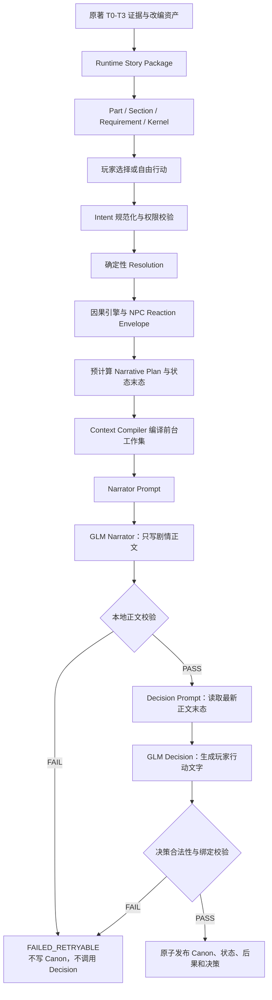

# Our Many Worlds：《桑田诏》剧情生成链反复失败根因与 OpenNovel 融合整改方案

> 文档版本：v1.0
> 日期：2026-07-27
> 当前结论：**NO-GO，尚不能交给玩家正式测试**
> 当前验证范围：`G00—T05` 第一节专项验证，随后才允许进入 `G00—T20`
> 当前冻结模型：`zai-org/GLM-5.2`，在完成本文的架构整改前不继续消耗模型调用
> 本文用途：解释当前剧情怎样生成、两天反复失败的真实原因，以及怎样用一套可复用于其他世界的通用架构解决，而不是继续增加《桑田诏》专用禁词和特殊规则。

## 1. 结论

运行两天、调用多次 GLM 后，系统仍然无法稳定生成 `T01—T05`，说明当前方法已经失败。

最新一次失败不是 GLM 写错了剧情，而是本地校验器把一句正常的小说描写：

> “把目光从总督脸上移到那只已经合拢的回文匣上”

误判成：

> “正文改写了已经确定的物件持有关系”

这条证据来自失败 Run：

```text
runId: solo_2647eeadd446dc16ef4e12a0cead1762
attemptId: solo_attempt_2d16814c9c7e408c95f736b5bc3a92a7
status: FAILED_RETRYABLE
issueCode: PART_ONE_CONTINUITY_CONTRADICTION
providerCallCount: 1
failedStage: NARRATOR
model: zai-org/GLM-5.2
```

在这句话中：

- “目光移到”只是视觉动作；
- 回文匣仍由巡抚书吏持有；
- 匣子没有发生新的物理转移；
- 没有新增证据、文书、命令或知情关系；
- 正文与运行时已经批准的匣子状态并不矛盾。

但当前校验器通过“句首附近出现总督 + 后面出现回文匣 + 又出现合拢/移到”等表面词组，错误推断总督操作了回文匣。这证明：

> 当前主要问题不是“模型还不够强”，也不是“再补一个禁词就能解决”，而是系统没有在架构上区分普通叙事纹理与持久因果事实。

两天反复失败的根因由高到低是：

1. **校验粒度错误**：把自然语言名词和动作词直接映射成因果状态；
2. **中文正则承担了不具备的语义职责**：用词序和邻近字符猜主语、宾语、持有人和权限；
3. **前台工作集过载**：把确定性结算、物件操作步骤、结果上限和多个待兑现后果一起交给 Narrator；
4. **Prompt 与校验器相互放大**：Prompt 越像施工说明，正文越像程序扩写；校验越细，正常小说表达越容易被误杀；
5. **测试样例过拟合已见表达**：单元测试覆盖了已有句式，却不能证明下一种自然中文不会触发新的误判；
6. **模型能力存在差异，但不是当前首要根因**：GLM、Kimi、DeepSeek 会以不同概率擅自补充事实，但更换模型不能修复本地误判；
7. **数据库连接池等工程问题会影响取证，却不是剧情失败原因**：Supabase 本身就是托管 PostgreSQL；连接池耗尽与本次 T02 被拒绝是两类问题，必须分开处理。

正确方案不是完全复制 OpenNovel，也不是保留当前逐词硬拦截，而是：

> **OpenNovel 的叙事自由 +《桑田诏》的因果事实硬边界。**

硬边界必须作用于“持久因果变化”，不能作用于每一个自然语言名词。

---

## 2. 本文的权威来源

本文不另起一套平行架构，而是纠正当前代码对已有设计的偏离。

权威顺序：

1. [Our_Many_Worlds_原著证据层与Openovel工作集及因果推演运行时闭环设计_v3.0_Final.md](./Our_Many_Worlds_原著证据层与Openovel工作集及因果推演运行时闭环设计_v3.0_Final.md)
2. [Our_Many_Worlds_桑田诏第一部分剧情资产拆解与DeepSeek连续20回合验证实施方案_v1.0.md](./Our_Many_Worlds_桑田诏第一部分剧情资产拆解与DeepSeek连续20回合验证实施方案_v1.0.md)
3. [Our_Many_Worlds_原著证据层与Openovel运行时架构融合设计_v1.0.md](./Our_Many_Worlds_原著证据层与Openovel运行时架构融合设计_v1.0.md)
4. `D:\lyh\AI\openovel` 当前代码，只作为工作集、Narrator、Options 和 Storykeeper 机制参考
5. 当前 aiStoryRoom 实现与真实 Run 数据

已有设计其实已经明确写出：

- Canon 硬事实不符才拒绝；
- 因果性细节未经授权才拒绝；
- 笔尖、呼吸、衣袖等非因果纹理默认允许或只记录 warning；
- 微小描写不应全部当硬事实；
- 主观质量问题不能与硬合同错误使用同一种处理方式。

对应位置：

- [融合设计 v1.0：事实严重度](./Our_Many_Worlds_原著证据层与Openovel运行时架构融合设计_v1.0.md#109-事实严重度)
- [融合设计 v1.0：生成后修复策略](./Our_Many_Worlds_原著证据层与Openovel运行时架构融合设计_v1.0.md#234-生成后修复策略)
- [v3.0 Final：微小描写不应全部当硬事实](./Our_Many_Worlds_原著证据层与Openovel工作集及因果推演运行时闭环设计_v3.0_Final.md#264-微小描写不应全部当硬事实)

因此这次整改不是降低事实要求，而是让实现重新符合设计：

> 只对真正改变世界的事实严格，不对承载小说感的普通纹理逐词执法。

---

## 3. 当前系统是怎样生成一回合剧情的

当前 Solo 主线并不是让 GLM 自由决定世界结果。实际链路是：



### 3.1 静态剧情资产

静态资产用于回答：

- 本部分必须持续处理什么矛盾；
- 当前 Section 的退出条件是什么；
- 哪些 NPC 会主动反制；
- 玩家拥有哪些制度能力；
- 哪些行动可形成真实决策；
- 哪些因果规则会在后续回合兑现；
- 原著依据、强推断与新增改编分别是什么。

关键类型包括：

```text
Part Contract
Section Contract
StoryCapabilityRequirement
Actor Policy
Institution Capability
Causal Rule
Causal Arc
Decision Kernel
Scene Pattern
Style Profile
Adaptation Gap
```

### 3.2 动态运行时状态

动态状态用于回答：

- 玩家刚才真的做了什么；
- 哪些状态已经提交；
- 谁在当前现场；
- 谁知道什么；
- 哪些文书、证据和物件具有持久身份；
- 哪些后果正在等待兑现；
- 当前因果弧处于什么阶段；
- 哪一项问题已经关闭、升级或转化。

状态变化应该只来自已经提交的事件，不应从 Narrator 的修辞中反向猜测。

### 3.3 确定性结算

玩家作出选择后，服务器先计算：

- 行动是否合法；
- 哪个 Kernel 被采用；
- 玩家承担什么责任；
- NPC 采取什么反制；
- 本回合必须显现什么后果；
- 哪些新状态在正文结束后提交；
- 哪些事实仍然未知。

这是正确方向。问题不是“服务器先算结果”，而是服务器把结算写得过细，并要求 Narrator 逐项复现物件操作过程。

### 3.4 Context Compiler

Compiler 当前会组合：

```text
Action Resolution
Pending Consequence
Current Scene
Recent Canon
Role Knowledge
Active Pressures
Runtime Settlement
Script Cards
Directed Beat
Player Action
```

玩家行动位于最后，这一点符合 OpenNovel。

但失败 Run 的 T02 Context 约为 `5400` tokens，其中单个 `PART_ONE_SETTLEMENT` 估算约 `2575` tokens；同时存在多个 Pending Consequence 和多个 Recent Canon 条目。这说明当前“最小工作集”仍然过于接近内部结算报告。

### 3.5 Narrator 与 Decision 分离

当前实现已经采用两阶段：

1. Narrator 只生成剧情正文；
2. 正文通过后，Decision 再读取最新正文末态并生成选择。

失败 Run 也证明这条边界实际生效：

```text
T01：Narrator 1 次 + Decision 1 次，发布
T02：Narrator 1 次后被本地校验拒绝，Decision 0 次
```

因此“正文与决策分开”不是本次主要缺口，应继续保留。

### 3.6 本地校验与发布

当前校验器试图检查：

- 未授权人物；
- 未授权文书、证据和内容；
- 玩家未作出的承诺；
- NPC 越权；
- 物件持有和开合状态；
- 文书写成、移交、封存和公开；
- 时间推进；
- 知情关系；
- 必须出现的结算结果；
- 文风、重复和玩家可见内部术语。

其中一部分是必要的 P0 校验；另一部分却使用大量中文短语正则猜测自然语言语义，导致正常小说表达被判为事实变化。

---

## 4. 两天真实失败说明了什么

### 4.1 已经出现过的失败类型

这两天遇到的代表性问题包括：

| 表面现象 | 当时处理 | 真实说明 |
|---|---|---|
| 模型复写开场 | 缩短 Prompt、加禁止复写 | Recent Canon 与行动边界没有稳定成为唯一镜头起点 |
| 模型让人物提前离场或追加承诺 | 增加时间线和禁止项 | Context 中同时存在行动、结算和未来结果，模型在替系统补桥 |
| “空白笺纸”被当成新文书 | 新增写作承载物规则 | 校验器没有区分创作过程纹理与持久文书实体 |
| 书吏对白被当成总督发言 | 修正人物归属正则 | 中文正则无法可靠完成说话人语义分析 |
| “目光移到回文匣”被判持有人变化 | 尚未修复 | 最新决定性证据：问题仍在校验架构，不在该句正文 |

每次只修一个词或句式后，下一种自然表达又触发新问题。这种模式不会收敛，因为中文小说表达是开放集合，不可能穷举。

### 4.2 最新失败的代码机制

当前物件校验大致采用：

```text
把正文按逗号、分号、句号拆成 clause
→ 在 clause 前四个字符附近寻找人物称谓
→ 把这个人物记为 activeActor
→ 只要后面出现物件名称和“搁、放、推、递、打开、合拢”等词
→ 就推断 activeActor 操作了物件
```

在句子：

```text
把目光从总督脸上移到那只已经合拢的回文匣上
```

中，“总督”是目光的起点对象，不是动作主语；“合拢”是回文匣已有状态的定语，不是本句发生的新动作。但当前算法同时误判了主语和谓词。

对应实现：

- [output-validator.ts：物件持有矛盾入口](../apps/api/src/solo-story-engine/output-validator.ts)
- `findObjectHolderContradiction`
- `findObjectManipulationByNonHolder`
- `findLeadingObjectActor`

这不是增加一个：

```text
如果前面出现“目光从”，则跳过
```

就能根治的问题。下一次还可能出现：

```text
声音落在匣上
影子掠过匣盖
书吏的话绕回那只空匣
总督没有碰匣子，只看着它
```

继续加例外只会形成更多规则冲突。

### 4.3 单元测试为什么全部通过，真实运行仍失败

整改前后相关测试曾达到：

```text
第二世界因果边界测试：3/3
相关 Guard 与 Runtime Integration：179/179
Solo Story Engine 全套：216/216
Templates typecheck：PASS
API typecheck：PASS
API build：PASS
```

但真实 T02 仍失败。

原因不是测试没有价值，而是测试只证明：

> 已经写进 fixture 的表达能够被当前规则正确处理。

它不能证明：

> 所有自然中文中包含同样词语但语义不同的表达都能被正确理解。

当前集成测试中已经有大量围绕“回文匣”“总督”“书吏”“合拢”“递送”的定向句子。这提高了已知样例覆盖，却也暴露出实现正在围绕一个具体物件和一批具体句式生长，不再是通用叙事因果边界。

### 4.4 为什么更换模型不能根治

此前统一上下文对比显示：

| 模型 | 优点 | 实际问题 |
|---|---|---|
| DeepSeek V4-Pro | 文风较浓 | 容易追加程序、承诺和未授权细节 |
| Kimi K2.6 | 流畅 | 容易补充新札纸、具复和程序 |
| GLM-5.2 | 事实边界和时间线相对稳定 | 仍可能补细节，但当前最新失败是本地误判 |

模型会影响：

- 文风；
- 指令遵循；
- 越权概率；
- 延迟；
- token 与价格。

模型不能修复：

- 校验器把“目光移到”当成“物件移交”；
- Context Compiler 把内部结算报告倾倒给 Narrator；
- 状态实体划分过细；
- 工程测试只覆盖已知短语；
- Prompt 与校验器职责冲突。

因此当前结论是：

> GLM-5.2 暂时仍是最合适的固定验证模型，但在架构整改前继续调用它没有价值。

只有在同一套冻结 Context、Prompt、资产和新校验器下，GLM 仍然反复产生真实 P0 越权，才重新开启模型对比。

---

## 5. OpenNovel 实际怎样解决这类问题

OpenNovel 不是给每一种纸、匣子、书信建立生命周期，而是采用：

> **因果事实严格管理，普通叙事细节自由生成。**

这正是当前 aiStoryRoom 实现缺少的边界。

### 5.1 前景上下文只保留当前真正有用的内容

OpenNovel 给 Narrator 的主要内容是：

```text
Foreground Guidance
Durable Memory
Recent Canon
Reader Action
```

Reader Action 放在最后，作为本回合立即指令。前面的上下文是约束和叙事纹理，不是要求模型逐条复述的施工命令。

参考：

- [contextCapsule.js](D:/lyh/AI/openovel/src/context/contextCapsule.js)
- [agentContracts.js](D:/lyh/AI/openovel/src/prompts/agentContracts.js)

它尤其强调：

- Constants 只约束一致性，不必每回合盘点；
- Active Pressures 是人物正在承受的重量，不是剧情清单；
- Open Threads 是角色知道仍未解决的问题，不是固定大纲；
- This Turn 只提供一个世界主动带入的外部动作；
- Recent Canon 决定故事真正停在哪里；
- Reader Action 决定玩家此刻实际做什么。

### 5.2 普通叙事物件不会自动升级为状态实体

OpenNovel 的 Card Manager 会在实体进入持续叙事或持久状态变化时创建或更新 Context Card，而不是看见每一个名词都建对象。

例如：

```text
提笔在一张空白笺纸上写成回文
```

合理解释是：

```text
空白笺纸 = 写作过程中的叙事纹理
落字完成后 = 同一份已获准生成的回文
```

系统不需要同时创建：

```text
object.blank_paper
document.reply
```

只有下面这种情况，纸张才需要成为独立因果实体：

```text
书吏从袖中取出一张已有字迹的笺纸
```

因为它可能具有：

- 独立来源；
- 已有内容；
- 保管人；
- 证据作用；
- 后续再次引用价值。

### 5.3 正文和决策完全分开

OpenNovel 的 Narrator 只写剧情正文。正文完成后，再由独立 Options 生成器读取最新正文结尾并生成选择。

这样 Narrator 不必同时处理：

```text
小说正文
JSON 状态
决策选项
代价解释
后台校验字段
```

aiStoryRoom 当前已经实现两阶段，应保留并进一步缩小 Narrator 的职责。

参考：

- [narrator.js：前景正文生成](D:/lyh/AI/openovel/src/lib/narrator.js)
- [narrator.js：Options 生成](D:/lyh/AI/openovel/src/lib/narrator.js)

### 5.4 OpenNovel 没有当前这种逐词硬拦截器

OpenNovel 在前台生成后主要处理：

- 是否重复上一回合开头；
- 特殊渲染 Fence 是否损坏；
- 快节奏模式是否超长。

通过后，正文进入 Canon。

它不会仅仅因为正文出现：

```text
空白笺纸
脚步声
衣袖
案几
灯火
移到
合拢
```

就推断模型新增了未经授权的因果实体。

### 5.5 Storykeeper 读取真实正文并修根因

OpenNovel 的 Storykeeper 每回合读取 Narrator 实际写出的 Canon，检查：

- 前后矛盾；
- 名称漂移；
- 持久状态变化；
- 重复句式；
- 机器文风；
- 当前场景与人物关系；
- 哪些内容需要进入长期记忆；
- 哪些 Foreground Guidance 或 Context Card 需要修正。

发现问题后，它主要修改：

```text
Foreground Guidance
Context Card
Tone / Forbidden
Active Pressure
Open Thread
```

而不是把已发布正文逐词改写，也不是不断在主 Prompt 里叠加禁词。

参考：

- [storyStore.js](D:/lyh/AI/openovel/src/lib/storyStore.js)
- [storykeeperContext.js](D:/lyh/AI/openovel/src/workflows/storykeeperContext.js)

### 5.6 OpenNovel 的不足

OpenNovel 更优先保证叙事流畅。正文通常先进入 Canon，再由后台纠偏。因此它可能允许某些已经生成的错误因果事实进入历史。

《桑田诏》不能完全照搬，因为这些事实必须在发布前严格：

```text
县册证据是否真的存在
谁看过密信
谁保管原件
哪份奏报已经送出
玩家是否真的签署命令
NPC 是否有权限执行某项动作
文书是否已经写成、移交、公开、封存或损毁
```

所以目标不是把所有校验删除，而是把发布前硬校验缩到真正的因果事实。

---

## 6. 正确组合：叙事自由与因果硬边界

### 6.1 四层内容分类

| 层级 | 例子 | 是否建 ID | 发布前处理 |
|---|---|---:|---|
| L0 叙事纹理 | 笔墨、普通纸张、脚步、衣袖、案几、灯火、目光 | 否 | 默认允许；只做文风与重复审查 |
| L1 场景临时对象 | 茶盏、临时座次、无后续作用的门帘 | 默认否 | 允许；一旦产生持久作用再升级 |
| L2 持久因果实体 | 已批准生成的回文、奏报、县册副本、封缄令牌 | 是 | 检查身份、状态迁移、权限与保管 |
| L3 证据与权力实体 | 原册、密信、仓单、正式命令、关键证人、奏报 | 必须 | 严格检查来源、内容、知情、保管、公开与销毁 |

### 6.2 何时把普通名词升级为因果实体

一个对象只有满足下列至少一项，才值得进入持久因果层：

1. 后续回合必须再次准确找到它；
2. 所有权、保管人或所在地会影响剧情；
3. 它携带证据、秘密或可传播的信息；
4. 它改变人物能力、资源、关系、权限或任务；
5. 它会成为未来决策的合法目标；
6. 它会被移交、公开、封存、损毁、伪造或质证；
7. 它的存在与否决定某项因果规则能否成立。

如果全部为“否”，它就是叙事纹理，不建 ID、不建生命周期、不逐词拦截。

### 6.3 “同一对象写成”的通用规则

写作承载物不应成为《桑田诏》专用例外，而应使用世界无关的通用语义：

```text
普通承载物
→ 在当前连续动作中被写成一个已经获准创建的目标实体
→ 承载物不再保留独立身份
→ 后续只引用目标实体
```

可以表述为：

```text
CREATION_SUBSTRATE
→ CONSUMED_INTO_TARGET
```

但这只是“实体升级判定”的一个例子，不应该继续扩展成：

```text
空白笺纸规则
宣纸规则
信笺规则
折纸规则
墨迹规则
回文匣规则
```

### 6.4 因果变化以服务器事件为权威

Narrator 正文不应成为状态写入来源。

正确方向：

```text
服务器先批准 Causal Delta
→ Narrator 把已批准变化写成故事
→ 校验器只检查正文是否宣称了额外持久变化
→ 状态仍按服务器事件提交
```

不能采用：

```text
正文出现“移到”
→ 推断物件移动
→ 再拿这个推断拒绝正文
```

### 6.5 本轮 Causal Delta Ledger

每次 Narrator 调用前，服务器只生成一份小型因果账本：

```ts
interface CausalDeltaLedger {
  requiredDeltas: CausalDelta[];
  allowedDeltas: CausalDelta[];
  forbiddenDeltas: CausalBoundary[];
  durableEntityRefs: string[];
  activeKnowledgeBoundaries: KnowledgeBoundary[];
  activeAuthorityBoundaries: AuthorityBoundary[];
}
```

示例：

```json
{
  "requiredDeltas": [
    "document.reform_reply: NOT_PRESENT -> WRITTEN",
    "document.reform_reply: holder -> actor.xunfu_clerk",
    "object.xunfu_reply_box: EMPTY -> CONTAINS_DOCUMENT"
  ],
  "allowedDeltas": [
    "actor.xunfu_aide may appear as the authorized counter-move representative"
  ],
  "forbiddenDeltas": [
    "no report has been dispatched to the capital",
    "no new county-register evidence is discovered",
    "the governor does not handle the clerk's reply box"
  ]
}
```

Narrator 不读取内部 ID 版账本，而是读取它的短自然语言投影。

Validator 则按“持久谓词变化”检查，不按“出现了哪些词”检查。

---

## 7. Validator 必须怎样整改

### 7.1 先把现有检查分级

所有现有规则必须登记到一张 `ValidatorRuleInventory`：

```ts
interface ValidatorRuleInventoryItem {
  ruleId: string;
  concern:
    | "CAUSAL_FACT"
    | "CONTINUITY"
    | "PLAYER_AGENCY"
    | "KNOWLEDGE"
    | "AUTHORITY"
    | "STYLE";
  severity: "P0_REJECT" | "P1_REVIEW" | "P2_QUALITY";
  detectionMethod:
    | "STRUCTURED_STATE"
    | "EXPLICIT_ASSERTION"
    | "SURFACE_REGEX";
  falsePositiveRisk: "LOW" | "MEDIUM" | "HIGH";
  worldSpecific: boolean;
}
```

凡是同时满足：

```text
P0_REJECT
+ SURFACE_REGEX
+ falsePositiveRisk=HIGH
```

的规则，一律先退出发布硬门，直到改为真正的因果断言检查。

### 7.2 P0 发布前硬拒绝

只保留这些类型：

- 新增未授权的具名人物或具有权力作用的新角色；
- 新增未授权证据、正式文书、命令、机构或期限；
- 明确改变持久实体的保管人、所在地、可见性或状态；
- 明确让人物知道其无来源获知的秘密；
- 明确替玩家签署、承诺、定罪或执行未选择的行动；
- 明确让 NPC 执行其无权限完成的制度动作；
- 明确把仍未知结果写成已确认事实；
- 明确漏写本轮必须兑现的 P0 因果变化。

“明确”要求句子具有可识别的事实断言，不允许仅凭关键词邻近拒绝。

### 7.3 P1 连续性审查

这些问题应记录并用于停止开发候选 Run，但不由脆弱词组正则直接当 P0：

- 轻微人物指代歧义；
- 场面调度不够清楚；
- 某个已批准动作没有写得足够可感；
- 时间过渡生硬但没有实际改写期限；
- 对持久实体的描述可能产生歧义。

正式候选仍然可以因此 FAIL，但必须由可靠规则或玩家审查判定，不能由“看见某个词”自动判定。

### 7.4 P2 文风与体验

交给玩家验收和 Storykeeper：

- 像报告而不像小说；
- 机器式复述；
- 人物声音同质化；
- 节奏拖沓；
- 句式重复；
- 官场语言不自然；
- 选项像规则说明；
- 正文虽然合法但不好看。

P2 不能通过自动重试不断消耗模型，也不能被包装成“事实矛盾”。

### 7.5 不再跨 clause 猜测 activeActor

当前 `activeActor` 跨短句延续，再结合人物称谓在前四个字符内出现的做法必须退出 P0。

最低要求：

- 识别人物是主语、宾语、介词对象还是修饰对象；
- 识别动作词是本句谓词、已有状态定语还是比喻；
- 只有显式“人物执行动作作用于持久对象”的断言才可生成候选因果变化；
- 无法可靠判断时不自动升级成 P0。

最新句子的正确解析应是：

```text
主语：巡抚来人/他（承接上句）
谓词：把目光移到
视觉起点：总督脸上
视觉终点：回文匣上
回文匣状态定语：已经合拢
持久因果变化：无
```

### 7.6 必须新增的通用回归样例

以下必须在《桑田诏》和第二世界中同时测试：

| 正文 | 期望 |
|---|---|
| “他的目光移到已经合拢的回文匣上” | PASS，视觉纹理 |
| “窗光从案角移到匣盖上” | PASS，光影纹理 |
| “总督没有碰回文匣，只看了它一眼” | PASS，否定操作 |
| “总督拿过书吏手里的回文匣并打开” | FAIL，未授权保管与操作变化 |
| “提笔在空白笺纸上写成获准生成的回文” | PASS，同一目标实体的创建过程 |
| “书吏从袖中取出一张已有字迹的纸” | FAIL 或 REVIEW，可能是新证据 |
| “幕僚另写了一份奏报并送出” | FAIL，新增文书且改变报送状态 |
| “幕僚说若仍被排除，抚院会另具一稿” | PASS，威胁，不等于已经写成送出 |

第二世界不能换皮复用“纸、匣、巡抚”，应使用例如：

```text
加密电报
数据芯片
实验样本
董事会决议
```

证明规则识别的是因果类型，而不是古代文书词汇。

---

## 8. Context Compiler 必须怎样整改

### 8.1 使用 OpenNovel 式小工作集

Narrator 每回合只需要：

```text
1. Durable Constants
2. Active Pressure
3. Open Threads
4. Active Characters
5. Current Scene
6. This Turn World Move
7. Recent Canon
8. Reader Action（最后）
```

### 8.2 每块只回答一个问题

| 区块 | 只回答 |
|---|---|
| Durable Constants | 哪些跨回合事实不能改变 |
| Active Pressure | 此刻人物真正承受什么 |
| Open Threads | 哪些问题仍未解决 |
| Active Characters | 谁在行动、想要什么、能做什么 |
| Current Scene | 镜头现在在哪里、谁在场 |
| This Turn World Move | 世界本轮主动带来哪一个动作 |
| Recent Canon | 上一段正文实际停在哪里 |
| Reader Action | 玩家刚刚真正做了什么 |

### 8.3 不再把 Runtime Settlement 原样倾倒给 Narrator

当前一个 Settlement 条目就可能超过两千 tokens，并包含：

- 状态前后值；
- 物件生命周期；
- 必须出现词组；
- 结果上限；
- 未授权动作；
- NPC 操作步骤；
- 后台 ID。

这些属于服务器 Validation Policy，不属于前台小说工作集。

Narrator 只需要自然语言投影，例如：

```text
总督已经决定准清流县先办一批，并把“不得趁急难压价买田”写进给巡抚的回文。
巡抚书吏仍在内厅，回文匣始终由他捧着；写成的回文可以由他收入匣中。
巡抚一方本轮会争取参与复核，并追问可见材料范围；只能形成公开威胁，不能写成奏报已经送出。
```

而不是把所有状态字段和验证逻辑交给模型。

### 8.4 每回合只激活一个前景世界动作

建议上限：

```text
This Turn World Move：最多 1 个
P0 Pending Consequence：最多 1 个
当前 Decision Kernel：最多 1 个主焦点
Recent Canon：最近 1—2 个连续正文尾部
显式禁止项：只保留本轮最可能误写的 3—5 个 P0
```

其余后果继续保存在服务器状态，不等于必须本轮全部写入正文。

### 8.5 Recent Canon 必须只有一个连续镜头尾部

Recent Canon 是正文连续性的最高文本权威，不应同时提供：

- 多个相互重叠的正文条目；
- 已被新正文覆盖的旧等待状态；
- 机器生成的状态摘要；
- 本轮尚未发生的结算结果。

### 8.6 Prompt 的职责

Prompt 应告诉 Narrator：

```text
从哪里继续
玩家刚做了什么
世界本轮怎样回应
谁在场、谁想要什么
哪些因果事实绝不能改变
写成怎样的小说语言
在哪里停下
```

Prompt 不应告诉 Narrator：

```text
必须按哪些物件步骤逐项施工
每个名词是否允许出现
后台状态路径
下一组选项答案
每项 Validator 正则在找什么
```

---

## 9. Storykeeper 应怎样进入 aiStoryRoom

### 9.1 Storykeeper 不替代 P0 Validator

发布前仍由因果硬门阻止：

- 新证据；
- 新命令；
- 新人物；
- 越权；
- 知情泄漏；
- 文书与保管状态矛盾。

Storykeeper 负责的是：

- 读取实际生成正文；
- 判断哪些细节只是纹理；
- 判断哪些新内容已产生持续影响；
- 记录名称漂移、重复、机器文风和场景问题；
- 修正下一回合工作集和卡片；
- 为开发者指出根因层。

### 9.2 Storykeeper 的输出

```ts
interface StorykeeperAudit {
  turnId: string;
  durableFactsObserved: DurableFactCandidate[];
  textureOnlyObservations: string[];
  continuityWarnings: ContinuityWarning[];
  styleWarnings: StyleWarning[];
  contextRepairs: ContextRepairProposal[];
  cardPromotions: EntityPromotionProposal[];
}
```

### 9.3 不允许的做法

- 不直接重写已经发布的玩家正文；
- 不把所有正文名词转成 Context Card；
- 不用 Storykeeper 结果覆盖服务器事件；
- 不把玩家评价发送回 Narrator 让模型迎合测试；
- 不因为文风问题在同一个 attempt 内自动反复调用 GLM。

### 9.4 根因修复日志

每次失败必须记录：

```text
失败正文
失败码
判定层
是否真实 P0
是否误报
触发的 Context Item
触发的 Validator Rule
修复层
第二世界回归
下一次模型调用的唯一验证假设
```

如果没有“唯一验证假设”，不允许再次调用模型。

---

## 10. 具体整改步骤

### Phase 0：停止无效调用并冻结证据

状态：正在执行。

1. 停止继续跑 GLM；
2. 冻结失败 Run `solo_2647...`；
3. 保存 Narrator 原文、Context Report、失败码和运行时状态；
4. 明确最新失败是 Validator false positive；
5. 不提交“测试通过”结论。

### Phase 1：盘点并降级高误报规则

1. 为 `output-validator.ts`、`part-one-prose-guard.ts` 和玩家可见 Guard 建立规则清单；
2. 标出所有 `P0_REJECT + SURFACE_REGEX + HIGH_RISK`；
3. 暂停跨 clause 的人物/物件操作者推断；
4. 删除以普通词语出现为依据的因果实体判定；
5. 保留结构化状态、显式断言和稳定实体 ID 的硬校验。

完成标准：

```text
“目光移到回文匣” PASS
“总督拿走回文匣” FAIL
两者由同一通用规则区分
```

### Phase 2：实现统一 Narrative Causality Boundary

1. 建立 L0—L3 内容分层；
2. 建立实体升级判定函数；
3. 建立 `CausalDeltaLedger`；
4. 所有文书、物件、人物、知识、权限 Validator 统一读取 Ledger；
5. 删除各模块重复维护的物件专用正则；
6. 当前已经增加的 `CREATION_SUBSTRATE -> CONSUMED_INTO_TARGET` 只作为通用分类的一种，不继续扩展成新例外系统。

完成标准：

- 古代文书世界通过；
- 科幻或现代第二世界通过；
- 不依赖“回文匣、笺纸、巡抚”等故事专有词。

### Phase 3：重构前台工作集

1. 按 OpenNovel 顺序输出工作集；
2. `Reader Action` 保持最后；
3. 把 `PART_ONE_SETTLEMENT` 从两千多 token 的操作报告压缩成前景自然语言；
4. 每回合只选一个 This Turn World Move；
5. 清理重复 Recent Canon；
6. 服务器硬规则不进入 Narrator 文字指导；
7. 生成 Context Report，证明每个条目为什么被选中。

完成标准：

```text
Narrator Context 中没有内部 ID、状态路径和正则提示
玩家行动最后
最近正文只有一个连续镜头尾部
P0 事实没有丢失
Context 不再要求逐项盘点和施工
```

### Phase 4：保留两阶段并简化职责

Narrator：

```text
只写正文
从 Recent Canon 继续
表现已结算因果
不生成决策
```

Decision：

```text
只读最新正文末态
只读取合法 Affordance
只输出玩家可见 description
不写剧情、不解释代价、不泄漏后台字段
```

### Phase 5：增加 Storykeeper 慢循环

先实现最小版本：

1. 每回合读取真实正文；
2. 记录纹理与持久事实候选；
3. 检查重复、名称漂移和机器文风；
4. 提出 Context/Card 修复；
5. 不影响本回合状态提交；
6. 在开发验证中给出根因报告。

### Phase 6：工程验证

必须通过：

```text
Narrative Causality Boundary 单元测试
第二世界回归
Context Compiler 快照测试
Narrator/Decision 分离测试
P0 因果硬拒绝测试
普通纹理不误杀测试
一次正文 + 一次决策调用计数测试
失败不入 Canon 测试
原子发布与状态回放测试
```

### Phase 7：有上限的真实模型验证

工程验证通过后，只允许一次新的验证批次：

```text
固定 GLM-5.2
固定 Prompt
固定 Runtime Package
固定 Style Profile
固定 Validator
固定 G00
只跑到 T02
```

若 T02 失败：

1. 停止；
2. 判断是资产、因果、工作集、Prompt、Validator 还是模型；
3. 必须形成新的根因假设；
4. 完成工程回归后才能再调用一次。

不得连续尝试多个新 Prompt。

### Phase 8：第一节真实玩家验收

T02 通过后，从全新 G00 连续跑到 T05：

- 由真实玩家逐屏阅读；
- 每回合自然选择；
- 上一决定必须在下一回合产生可感知回应；
- NPC 必须主动行动；
- 正文必须像小说；
- 前端只显示正文与决策 `description`；
- 任一回合失败，从新的 G00 重跑。

### Phase 9：连续 20 回合

只有 G00—T05 完整通过，才进入 G00—T20。

20 回合仍遵循原实施文档，不因本文降低标准。

---

## 11. 下一次真实调用前的硬门

以下全部满足才允许再调用 GLM：

- [ ] 最新失败已保存为固定回归；
- [ ] “目光移到回文匣”不再触发物件持有变化；
- [ ] “总督拿走回文匣”仍被拒绝；
- [ ] “普通纸写成已授权文书”不创建第二实体；
- [ ] “已有字迹的来源不明纸张”能升级为新证据候选；
- [ ] 第二世界同类测试通过；
- [ ] 所有现有 P0 正则已完成风险分级；
- [ ] 高误报正则不再直接拒绝发布；
- [ ] Context 中 Settlement 已压缩；
- [ ] Recent Canon 已去重；
- [ ] Reader Action 位于最后；
- [ ] Narrator 只写正文；
- [ ] Decision 只在正文通过后调用；
- [ ] 同一 attempt 不自动重试 Narrator；
- [ ] 数据库连接池和取证脚本能够稳定读回本次 Run。

少一项都不再调用模型。

---

## 12. 验收标准

### 12.1 工程验收

工程验收只证明具备进入玩家测试的资格：

- Schema 与类型检查通过；
- 因果账本与事件状态一致；
- 普通纹理不写入持久状态；
- 真正越权仍能发布前拒绝；
- Narrator 与 Decision 各一次；
- 失败正文不进入 Canon；
- 发布时正文、决策、状态和后果原子提交；
- 第二世界证明规则可复用。

工程 PASS 不等于剧情可用。

### 12.2 每回合真实玩家验收

每个回合必须由玩家回答：

1. 我能否用自己的话说清刚才发生了什么？
2. 这一段是否像人物正在场景中行动，而不是系统报告？
3. 上一选择是否真正改变了这一回合？
4. NPC 是否在为自己的利益行动？
5. 是否出现未经铺垫的新证据、新人物、新命令或新承诺？
6. 每项决策是否第一次阅读就看得懂？
7. 两项决策是否真的是不同做法，而非同义改写？
8. 我是否会因为局势本身想继续，而不是为了测试配额继续？

任一项否定，当前 Run FAIL。

### 12.3 第一节 G00—T05

必须达到：

- 开场两封文书的压力已经真实落地；
- 玩家第一道行动产生可观察结果；
- 改桑执行方式出现真实边界；
- 巡抚至少一次主动反制、条件合作或责任转移；
- 责任记录或待兑现后果形成；
- 不能通过机械重复催办拖满五回合；
- 每回合正文与决策都通过玩家体验。

### 12.4 G00—T20

沿用实施方案：

- 21 个玩家可见检查点全部验收；
- 20 次自然选择；
- 20 次 Narrator；
- 20 次 Decision；
- 0 次同 attempt 自动重试；
- 任一失败后从全新 G00 重跑；
- 四节自然推进；
- T20 形成第二部分合法入口；
- 真实 UI 登录、返回选角、新游戏和前端字段全部通过；
- 通过后才允许提交和发布。

---

## 13. 当前已经完成和没有完成的内容

### 13.1 已完成

- 已确认 Narrator 与 Decision 两阶段实际分离；
- 已确认失败 Narrator 不进入 Canon、也不会继续调用 Decision；
- 已读回最新失败 Run 的原始正文、失败码、调用次数和状态；
- 已确认最新失败是 Validator false positive；
- 已对照 OpenNovel 的 Context Capsule、Narrator、Options、Card Manager 和 Storykeeper；
- 已确认三份设计文档本来就要求区分因果事实和非因果纹理；
- 已增加“普通承载物写成同一已批准目标”的初步通用类型与第二世界测试；
- 相关工程测试、类型检查和构建曾通过。

### 13.2 部分完成但不能视为解决

当前新增的：

```text
NarrativeTextureAllowance
CREATION_SUBSTRATE
CONSUMED_INTO_TARGET
```

只解决了“空白纸是否是第二份文书”的一个类别。

真实 T02 随后又被“目光移到回文匣”误杀，证明：

> 只给某一种纹理增加 allowance，仍然是在现有逐词校验架构上打补丁，不能作为最终方案。

这部分代码可以保留为未来统一分类器的一项能力，但必须纳入 L0—L3 因果分层，不能继续独立生长。

### 13.3 尚未完成

- P0 Validator 规则总盘点；
- 高误报正则退出硬门；
- `CausalDeltaLedger`；
- 世界无关实体升级判定；
- Context Compiler 的 OpenNovel 式重构；
- Settlement 自然语言压缩；
- 单一 This Turn World Move；
- Recent Canon 去重；
- Storykeeper 最小慢循环；
- 第二世界完整回归；
- 全新 G00—T02 实模验证；
- 全新 G00—T05 玩家验收；
- 全新 G00—T20 正式验收；
- 真实登录与 UI 全链路；
- 本地 main 提交与远程发布。

因此当前不能说“已经基本完成，只差多跑几轮”。

---

## 14. 此后不再采用的做法

1. 不再看到一个失败词就增加一个禁词；
2. 不再为每张纸、每个匣子、每次目光移动建立生命周期；
3. 不再以单元测试全绿代替真实剧情通过；
4. 不再连续调用 GLM 等待偶然出现一条能过正则的正文；
5. 不再同时修改模型、Prompt、资产和 Validator 后做不可比较测试；
6. 不再把主观文风问题伪装成 P0 事实错误；
7. 不再让 Narrator 读取后台完整结算报告；
8. 不再让自然语言正文反向成为状态写入来源；
9. 不再用下一节内容掩盖第一节尚未解决的问题；
10. 不在 G00—T05 玩家验收通过前提交“可用”代码。

---

## 15. 最终目标

真正需要实现的不是：

```text
让某一次 GLM 输出碰巧通过所有正则
```

而是：

```text
原著证据决定事实边界
→ 剧情需求决定需要哪些可玩能力
→ 服务器事件决定实际发生什么
→ OpenNovel 式小工作集只提供当前有用内容
→ Narrator 在因果边界内自由写成小说
→ Decision 从最新正文末态生成正常人可懂的行动
→ Validator 只拒绝真正的持久因果矛盾
→ Storykeeper 读取真实正文并修复后续工作集根因
→ 玩家逐回合体验并决定产品是否真正好玩
```

最终可复用原则是：

> **普通叙事细节默认自由；只有产生持续影响的内容才晋升为因果实体；只有明确改变因果实体、角色知识、制度权限或玩家承诺的断言，才进入发布前硬校验。**

当这条边界实现后，《桑田诏》不需要为每一种自然语言写特殊规则；后续历史、谍战、科幻、商战和原创世界也可以复用同一套引擎。

在完成本文整改并通过全新 `G00—T05` 之前，产品状态保持：

> **尚未稳定，不能交给玩家正式测试。**
