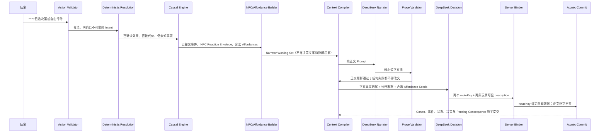

# Our Many Worlds：《桑田诏》第一部分剧情资产拆解与 DeepSeek 连续 20 回合验证实施方案

> 文档版本：v1.3（在原 v1.0 文件内修订）
> 编制日期：2026-07-23
> 首个验收世界：《桑田诏：嘉靖财政危局》
> 首个验收模式：Solo Play，浙江总督
> 验收范围：从真实开场开始，验收 `G00` 开场屏与 `T01—T20` 连续 20 个生成回合，共 21 个玩家可见检查点；`G00—T19` 产生 20 次玩家选择，`T01—T20` 每回合固定执行 1 次 DeepSeek Narrator 调用和 1 次 DeepSeek Decision 调用，共 40 次专职调用
> 唯一架构总纲：[Our_Many_Worlds_原著证据层与Openovel工作集及因果推演运行时闭环设计_v3.0_Final.md](./Our_Many_Worlds_原著证据层与Openovel工作集及因果推演运行时闭环设计_v3.0_Final.md)
> 原著拆解子规范：[Our_Many_Worlds_大明王朝1566上下文资产生成最终方案_v1.0.md](./Our_Many_Worlds_大明王朝1566上下文资产生成最终方案_v1.0.md)
> 本文定位：把上述两份文档收敛成“只拆第一部分所需原著、编译最小剧情包、用真实 DeepSeek 连续验证 20 回合”的开发与验收执行合同。
> 放行目标：开发完成后，不以脚本 PASS 代替产品体验；必须由 Codex 作为盲测真实玩家，从开场在真实产品界面连续玩完 20 回合，逐屏验收剧情、文风和决策文字，才能判定《桑田诏》Solo 第一部分可正式使用。

---

## 1. 最终目标

本阶段不是拆完整部《大明王朝1566》，也不是预写一篇固定的《桑田诏》第一部分小说。

本阶段只完成一个可以被真实证据验证的最小闭环：

```text
冻结《桑田诏》四部分主脊梁
→ 详细定义第一部分四节的剧情合同
→ 从《大明王朝1566》中只寻找第一部分需要的原著材料
→ 中立拆解证据与玩法机制候选
→ 审批必要的游戏改编
→ 编译第一部分 Runtime Story Package
→ 从真实产品界面进入现有开场
→ G00 开场先通过盲测玩家体验门
→ Codex 只依据玩家可见内容自然作出 20 次选择
→ T01—T20 每回合一次 Narrator 正文调用和一次 Decision 决策调用
→ 每个生成回合先验收小说化剧情与正常人可懂的决策
→ 玩家评价封存后再验收事件、状态、来源与因果
→ 第 20 回合形成可进入第二部分的真实末态
```

只有工程闭环和从 `G00` 到 `T20` 的正式玩家运行同时通过，才允许判定第一部分 Solo 可正式使用，并继续拆解第二部分所需原著材料。

本阶段要证明的不是“模型能写二十段文字”，而是：

1. 每一段剧情都有当前状态、角色利益、制度能力和既有因果支撑；
2. 每一个玩家决定都能立即执行，并改变至少一个真实状态维度；
3. NPC 会根据自己的知识、目标、筹码和风险主动回应；
4. 后果会跨回合延续、到期、兑现或转化；
5. 玩家可以改变路径，但不能让剧情丢失第一部分的核心矛盾；
6. 所有原著事实、跨章推断和游戏改编都能反向追溯；
7. DeepSeek 只负责把合法因果写成自然故事，不负责自由决定世界真相；
8. 剧情正文读起来是连贯的历史政治小说场景，不是状态报告、规则摘要或 AI 套话；
9. 每项决策都使用正常人第一次阅读就能理解的中文，玩家无需查看说明书或内部字段；
10. Codex 以真实玩家身份愿意继续读、继续选择，而不是为了完成测试配额机械点击。

### 1.1 项目所有者指定的最高玩家验收标准

本条是正式放行的最高体验标准，优先于“接口成功、Schema 合法、20 次调用完成、自动评分通过”等工程结果：

> 验收时，Codex 必须把自己当作一名第一次进入《桑田诏》的真实玩家，亲自从开场 `G00` 连续体验到 `T20`。它必须逐回合阅读真实 UI 中出现的完整剧情与全部决策，用正常玩家的理解作出真实选择，并分别判断这一回合是否像真正发生的故事、人物是否像在为自己的利益行动、上一决定是否产生可感知后果、当前选择是否看得懂且值得犹豫。只有 21 个检查点全部通过，才可以替项目所有者签署玩家验收 PASS。

这项标准必须按以下不可替代规则执行：

1. `G00` 与 `T01—T20` 共 21 个玩家可见检查点，Codex 一个都不能跳过；
2. 每个检查点必须先亲眼读取当时真实 UI，随后独立写出本回合第一手玩家结论，不能在 T20 后批量补写；
3. `G00—T19` 的 20 次选择必须由 Codex 根据当时剧情自然作出，不能预先按覆盖矩阵、推荐答案或固定 A/B 序列点击；
4. Codex 必须逐项说明每个选择“要对谁做什么、用什么办法、直接代价是什么”，任何一项无法复述即 FAIL；
5. 每一回合都必须确认剧情连续、上一选择有回应、人物有主动目的、文字像小说、决定像正常人会面对的真实取舍；
6. 任意一回合出现“像状态报告而不像故事、人物只等玩家推动、选项只是同义改写、选项文字看不懂、决定不改变局面、为了凑回合而拖延”之一，当前候选 Run 整体 FAIL；
7. 自动化脚本、DeepSeek 自评、隐藏审计、最终总评或开发者解释都不能代替上述逐回合玩家体验；
8. 修复任何失败后必须创建全新候选 Run，从 `G00` 重新连续体验 20 回合，旧 Run 的通过回合不得拼接复用。

因此，“我替项目所有者验收通过”的含义只能是：Codex 已逐屏真实玩过同一条连续故事，20 次都作出了自己能够理解并愿意承担后果的选择，并且 `G00—T20` 没有一个体验检查点失败。否则只能报告尚未通过，不能宣称产品已经可以正式使用。

---

## 2. 文档权威与冲突处理

### 2.1 权威顺序

发生冲突时，按以下顺序处理：

本文后续出现的 `v3.0 Final`，均专指 [Our_Many_Worlds_原著证据层与Openovel工作集及因果推演运行时闭环设计_v3.0_Final.md](./Our_Many_Worlds_原著证据层与Openovel工作集及因果推演运行时闭环设计_v3.0_Final.md)；`上下文资产生成 v1.0` 均专指 [Our_Many_Worlds_大明王朝1566上下文资产生成最终方案_v1.0.md](./Our_Many_Worlds_大明王朝1566上下文资产生成最终方案_v1.0.md)。不得用旧版、下载目录副本或同名草稿替换。

```text
1. v3.0 Final：架构、职责、运行时因果和原子提交总纲；其中“正文与决策单次调用”的旧优化约束由本文第 16 节依据项目所有者 2026-07-23 的决定改为两阶段专职调用
2. 本文：第一部分与连续 20 回合的范围、步骤和验收合同
3. 上下文资产生成 v1.0：T0—T5 证据拆解、审核和发布子规范
4. 已发布原著 Evidence：能够声称什么
5. 已批准 Adaptation Decision：游戏允许新增或重组什么
6. Runtime Story Package：当前版本世界具备什么能力和规则
7. RoomEvent 与状态投影：本房间实际发生了什么
8. Recent Canon：正文从哪一刻继续
9. DeepSeek 输出：待验证的叙事与事件提案
```

### 2.2 两份上游文档的职责

| 文档 | 本阶段职责 | 不负责什么 |
|---|---|---|
| v3.0 Final | 唯一总纲；定义剧情需求驱动拆解、Part/Section、因果运行时、上下文检索和原子提交；正文/决策调用拆分按本文第 16 节执行 | 不提供每个离线拆解作业的完整执行包 |
| 上下文资产生成 v1.0 | 证据子规范；定义 T0、T1、T2、T3、发布门、来源追溯和候选区 | 不单独决定《桑田诏》需要什么剧情 |
| 本文 | 把两者接成第一部分 20 回合的可执行流程 | 不替代将来的第二至第四部分实施文档 |

### 2.3 本文对目录冲突的裁定

作者源文件和编译产物必须分开：

```text
packages/templates/authoring/sangtian/        # 人工可审查的作者资产
packages/templates/config/sangtian/story-package/  # 编译生成的运行时包
```

现有 Runtime Loader 已从 `packages/templates/config/sangtian/story-package/` 读取文件，所以第一阶段保留这个运行时路径；不得把 ChatGPT 原始输出直接写入该目录。

---

## 3. 范围与明确不做

### 3.1 本阶段范围

- 冻结四部分 Part Contract 的主脊梁，但只详细实现第一部分；
- 第一部分固定为四个 Section；
- 使用现有浙江总督开场作为 `G00/T00`，先做开场玩家体验验收；
- 从开场作出第一次自然选择，验证 `T01—T20` 20 次 Narrator 生成与 20 次 Decision 生成；
- 正式候选运行共验收 21 个玩家可见检查点：1 个开场屏和 20 个生成回合；
- 每个成功回合固定只有一次 Narrator Provider Call 和一次 Decision Provider Call；两阶段各自禁止重试、候选择优和 Provider fallback；
- 只拆第一部分需求命中的原著候选场景；
- 只实现 Solo 浙江总督视角；
- 正式放行必须从真实产品入口和真实可见 UI 完成，不以 CLI、直接 API 或数据库注入替代；
- 第 20 回合必须形成一个真实、可编译的第二部分入口状态；
- 本阶段最终放行范围准确命名为 `PART_ONE_FORMAL_USE_READY`，不冒充整部四部分游戏已经完成。

### 3.2 本阶段不做

- 不拆完整本原著；
- 不要求楔子和 39 章全部完成；
- 不把原著后续情节编成必播节点；
- 不预写 20 回合固定台词和固定选择；
- 不要求第一部分揭晓全部暗账或幕后主使；
- 不实现第二至第四部分的完整运行时资产；
- 不同时接管 Multiplayer；
- 不用多次自动重写掩盖同一回合失败；
- 不把结构校验 PASS 当成剧情质量 PASS；
- 不因 20 回合通过就宣称整部游戏已经完成。

### 3.3 “只拆前面一部分”的准确含义

允许对全书 T0 索引做确定性检索，但不对全书执行完整 T1/T2 拆解。

```text
全书 T0 索引：允许，用于找到候选场景
第一部分候选场景 T1/T2：执行
与第一部分无关的场景：不拆
第二至第四部分完整资产：不生成
```

初始候选范围按 v3.0 Final 执行：

```text
C01：财政危机、政策形成、京师权力结构、兼并预警
C02：强制执行、百姓压力、总督责任、奏疏路径
C03—C04：官商合作、隐秘指令、证据问责、责任切割
C05—C07：以改兼赈、粮食交易、田价、地方权限、地方抗令
后续精选场景：只补证据公开、京师介入和政治定性机制
```

这只是候选假设，不是预设证据结论。是否采用必须由 Source Requirement Resolver 和独立 Reviewer 决定。

---

## 4. 当前仓库基线

截至 2026-07-22，仓库已有以下可复用基础：

| 资产 | 当前状态 | 本阶段处理 |
|---|---|---|
| `docs/剧本/嘉靖财政危局/大明王朝1566 (刘和平).txt` | T0 唯一原著真源 | 保持只读 |
| `derived/source-manifest.json`、`chapter-index.json`、`paragraphs/`、`chunks/` | 已有确定性索引 | 继续复用 |
| `chatgpt生成/DM1566-C01_chatgpt_handoff_v2/` | C01 的 10 个场景候选和逐场景证据候选 | 只作标定与人工参考，不能发布 |
| `incoming/chatgpt/` | 已有七类旧候选 | 保留，不直接加载到 Runtime |
| `opening.json` | 已有“两封文书，一道急令”开场与两个初始决策 | 作为 `T00` 固定 Canon Seed |
| 当前 Runtime Story Package | 2 个节点、9 张卡、2 个主线问题、1 个 Floor Obligation、1 个潜在真相 | 只能证明最小结构可加载，不能支撑 20 回合 |
| `validate-runtime-story-package.mjs` | 当前结构与 source-map 校验 PASS | 保留为基础门，不代表语义和剧情 PASS |
| `validate-chatgpt-import.mjs` | 当前候选与旧 Schema 不一致，校验 FAIL | 仅作旧格式诊断，不能作为 Evidence v2 发布器 |

当前 Runtime Story Package 的 PASS 只证明：

```text
JSON 可读
hash 对齐
sourceId 可解析
改编条目有基本绑定
```

它没有证明：

```text
第一部分四节已经齐全
每项剧情需求已经覆盖
NPC Policy 和制度能力足够
20 回合不会停滞
决策一定能改变状态
每轮主线推进记录真实可信
```

因此当前包属于 `BOOTSTRAP_BASELINE`，不得作为 20 回合验收包。

---

## 5. 不可变产品合同

### 5.1 一回合的玩家体验

```text
读到上一回合形成的真实局面
→ 作出一项明确决定或自由行动
→ 系统确定性判断行动是否合法、如何开始、直接代价是什么
→ 因果引擎找出被触动的角色、压力和后果
→ NPC 在自身知识和筹码范围内回应
→ DeepSeek Narrator 只把这些合法变化写成连续小说正文
→ 服务端只校验正文，不补句、不拼接、不改写
→ DeepSeek Decision 读取正文真实结尾，只为已开放 Affordance 写两项自然行动
→ 服务端把玩家可见行动绑定到隐藏后果
→ 服务端验证正文、事件、末态和决策一致
→ 原子提交
→ 下一回合从新 Canon 与新状态继续
```

### 5.2 真剧情的定义

一回合只有同时满足以下条件，才算真剧情：

1. 从 Recent Canon 最后一刻继续；
2. 玩家上一行动已经真实发生、受阻或产生待兑现后果；
3. 至少一名被触动的 NPC 作出符合利益和认知的回应；
4. 至少一项责任、关系、知识、资源、承诺、线程、因果弧或后果发生变化；
5. 变化能在正文、事件、状态投影和下一回合 Context 中一致复现；
6. 本轮至少推进、升级、质证、兑现或转化一个当前主线对象；
7. 未知事实仍保持未知；
8. 剧情停在新的可行动末态，而不是程序等待或背景复述。

### 5.3 真决策的定义

每项决策必须：

- 绑定当前开放的 `DecisionAffordance`；
- 属于当前玩家制度上能采取的行动；
- 有明确对象、方法和即时目标；
- 能从当前末态立即开始；
- 不预告结果和成功率；
- 不使用玩家不知道的事实；
- 不重复已经完成的行动；
- 与其他选项在控制变量、风险、公开程度或信息价值上真正不同；
- 有具体代价和可解释的可能反制；
- 被玩家实际选择后，能够改变至少一个状态路径。

如果不同选项被选择后得到相同结算、相同状态和相同下一局势，则这一组决策为假决策，本回合 FAIL。

### 5.4 小说化剧情文字合同

运行包必须冻结一个版本化的 `NarrativeStyleProfile`。它约束的是《桑田诏》的历史政治小说表达，不要求逐句模仿或大段复制原作者文字。

正文必须同时满足：

1. 使用稳定叙事视角，从上一刻的具体场景继续；
2. 以人物动作、对话、文书、环境细节和利益压力推进，不用解释规则代替演出；
3. 语言克制、具体，有明代官场和财政危局的时代语感，但不堆砌生硬假古文；
4. 人物语言由身份、立场、知识和眼下风险决定，巡抚、县令、书吏、商人不能说成同一种声音；
5. 对话有目的和潜台词，不能人人主动把自己的全部盘算解释给玩家；
6. 第一次阅读就能分清谁在何处做了什么、上一选择得到什么回应、局势为何改变；
7. 生僻官称、文书或制度词必须在场景中有足够语境让普通玩家理解；
8. 正文无截断、乱码、病句、指代漂移、机械重复和段落拼接痕迹；
9. 不出现“系统提示”“状态更新”“本回合”“任务目标”“数值提升”等产品或内部状态语言；
10. 不使用现代网络腔、企业汇报腔、空泛鸡汤、网文口号或“局势愈发扑朔迷离”式 AI 总结句代替真实变化。

以下任一情况为玩家体验硬失败：正文主要是摘要而不是场景；人物声音同质化；主客体读不清；时代语感被现代用语打断；连续复述上一回合；为了显得古雅而无法顺畅理解。

### 5.5 正常人可懂的决策文字合同

展示给玩家的每项决策必须让玩家不用 ID、说明书或开发文档，就能用自己的话复述：

```text
我要通过什么方式
对谁或什么对象
立即准备做什么
主要想解决什么
明显会承担哪一类风险或政治代价
```

决策文案应使用自然中文短标题加一条动作说明，通常不超过两句。它可以保留结果不确定性，但必须说清动作，不得：

- 展示 `affordanceId`、状态路径、枚举值、成功率或测试术语；
- 用“强硬路线”“善良选项”“调查一下”“继续推进”等抽象标签代替行动；
- 使用玩家当前不知道的人名、秘密或证据；
- 把必然结果提前写进选项；
- 让两个选项在普通玩家复述后实质相同；
- 依赖鼠标提示、隐藏说明或技术人员解释才能理解。

任何一个展示选项无法被盲测玩家准确复述，整组决策 FAIL，不允许用其他好选项抵消。

### 5.6 Codex 真实玩家逐回合体验门

这是本文最高优先级的正式放行标准。

项目所有者在本阶段明确委托 Codex 代为执行玩家验收。因此，“Codex 验收”不是检查 JSON 是否齐全，也不是替项目方证明预设路线，而是由 Codex 暂时代入一个第一次接触本故事的真实用户：亲自读完每一屏、用普通玩家能够理解的语言判断局势、在不知道隐藏答案的前提下作出自己真正愿意作出的决定，并对该决定带来的后果负责。Codex 不得因为已经参与开发就降低标准；一旦无法维持盲测隔离，必须更换全新的盲测 Context 并从 `G00` 重跑。

这一委托覆盖全部 21 个玩家可见检查点，而不是只抽查开场、转折或结尾：`G00` 必须实际体验一次，`T01—T20` 必须逐回合实际体验二十次。任何一屏没有留下“本屏可见内容 → 首读玩家感受 → 每项决策复述 → 自然选择理由 → 后续可见回应”的可核验证据，都视为该屏没有测到，不能用总评、自动评分或其他回合的通过结果补足。

正式候选运行使用一条从 `G00` 连续保留到 `T20` 的全新 Codex 玩家会话。它不得继承开发对话、本文、逐轮矩阵、旧失败路线或隐藏审计记忆。Codex 必须真正把自己当作玩家：连续记住自己实际看过的剧情和自己的选择，感受人物与压力如何变化，并依据当下故事作出自己愿意承担后果的决定。它不是替开发者勾选测试表的执行器。

在每次选择封存前，Codex 玩家只能看到真实玩家 UI 中可见的：

```text
开场或本轮正文
公开的末态与提示
展示给玩家的决策
自己此前看过的剧情和选择
```

不得看到 Section 目标、逐轮审计矩阵、Affordance、状态路径、来源引用、隐藏事实、预期分支、测试配额或机器判定。这个禁令覆盖整个 Run，不只是选择前：`blindHiddenReadCount` 必须始终为 0。Codex 必须选择自己在当前故事里真正想做的动作，并记录自然理由；不得轮换选项序号或为了覆盖测试类型而选择。DeepSeek Narrator 与 Decision 都是内容生成者，不能为自己的剧情和决策打分。

Hidden Auditor 必须运行在另一个 context/process，且 `auditorContextId !== blindContextId`。Auditor 结果不得回传给盲玩家；Orchestrator 只能接收并执行 `CONTINUE` 或 `STOP` 控制信号。盲玩家下一回合只能从新 UI 内容和自己的可见历史继续。

### 5.7 通用复用合同：引擎规则与故事资产必须分离

本方案以《桑田诏》作为首个验收世界，但以下能力必须是世界无关的公共能力，可反复用于另一部历史故事、谍战、科幻、商战或原创世界：

- `PartContract → SectionContract → StoryCapabilityRequirement` 的需求反推；
- 原著索引、候选场景检索、轨道 A 证据抽取、轨道 B 机制抽取和 Adaptation Gap 审批；
- `ActorPolicy`、`InstitutionCapability`、`CausalRule`、`DecisionKernel`、Continuity 和 Pending Consequence；
- `NarrativeScenePattern` 的场景动作节奏、对白策略、空间调度、关键物件和反应节奏；
- Runtime Working Set 的按需检索、玩家权限过滤、事实绑定、因果结算和连续状态；
- 玩家正文不泄漏后台规则、不把决策菜单改写进旁白、不用机器摘要填充失败正文的门禁；
- 从真实开场连续体验、逐回合真实选择、逐回合玩家感受验收的放行流程。
- Narrator 与 Decision 的两阶段专职调用：Narrator 只写小说正文，Decision 只在正文完成后生成玩家行动文字，二者不得共享输出职责；
- 玩家可见正文零后处理改写、决策隐藏效果服务端绑定、选中效果进入下一回合 Pending Consequence 的闭环。

下列内容必须留在每个世界自己的 Story Package 中，不得写死进公共 Schema、选择器、验证器或 Prompt Builder：

- 《桑田诏》、浙江总督、改桑、县册、巡抚、三日期限等专有 ID 和剧情事实；
- 明代官场语体、人物称谓、角色声音和该故事的禁用词；
- 四部分、四节、具体 Decision Kernel、状态枚举和 Narrative Ceiling；
- 原著段落、证据 Claim、改编决议和该世界的场景模板内容。

因此，“通用”不等于把《大明王朝1566》的资产原样用于所有故事，也不等于新故事可以零配置启动。准确含义是：**新故事只需按同一合同生成自己的故事资产和编译适配器，不需要重写运行时检索、因果结算、前台叙事门禁和玩家验收机制。**

公共契约必须使用中性字段，例如 `registerRules`、`minCharacters/maxCharacters`、`worldId`、`scopeId`、`actorRole`，不得使用 `historicalRegisterRules`、`minChineseChars`、`DM1566-*`、`PART-01` 等题材或首个世界专用假设。一个世界可以只提交一张获批 Scene Pattern；需要三张是《桑田诏》第一节编译器的覆盖要求，不是公共 Schema 的要求。

任何声称通用的新版本，至少必须同时通过：

1. 《桑田诏》真实 Runtime Package 的完整回归；
2. 一个不含《桑田诏》、明代和 `PART-01` 标识的第二世界 Schema Fixture；
3. 第二世界使用同一 Scene Pattern Selector 能按 Section、Requirement、Decision Kernel 检索正确模板；
4. 公共层源码扫描不得出现首个故事专有 ID；
5. 前台正文不足时必须 FAIL，不得由绑定器自动补成“若选 A……若选 B……”的规则说明并伪装成剧情；
6. 第二世界必须复用同一套 Narrator → Decision 两阶段编排，且 Narrator Prompt 中不得出现该回合的候选决策文案或隐藏后果。

换新故事时的固定入口为：

```text
冻结新故事 Part / Section Contract
→ 建立该故事 StoryCapabilityRequirement
→ 按需求检索和拆解自己的来源材料
→ 生成并审批 Actor / Institution / Causal / Decision / Scene Pattern / Style Profile
→ 用公共 Compiler Contract 编译该世界 Runtime Story Package
→ 运行第二世界回归与该世界真实连续玩家验收
```

`G00` 开场与 `T01—T20` 每一个生成回合都必须单独通过本门。每一屏都要回答：

1. 我第一次读是否知道发生了什么；
2. 我是否看见上一选择造成的回应或后果；
3. 人物是否像有自身利益和手段的人，而不是等候按钮的 NPC；
4. 文字是否像可以继续读下去的小说场景；
5. 我是否理解现在为什么必须决定；
6. 我是否能逐项复述每个决策在做什么；
7. 我是否感到这些选择有真实取舍；
8. 如果没有测试任务，我是否仍愿意继续读并作出下一次选择。

**不可替代规则：**上述八个问题必须由我（Codex Blind Player）在亲自看到该回合真实 UI 后，以该回合的第一手玩家感受逐项回答。`G00` 需要 1 份、`T01—T20` 需要 20 份，共 21 份相互独立且可追溯到对应可见画面的个人玩家结论；少一份、跳过一回合、事后批量补写、由 DeepSeek/脚本/Hidden Auditor 代答，或只给整段总评，整条候选 Run 立即 FAIL。这里验收的不是“系统有没有生成文字”，而是我作为真实玩家在每一回合是否确实看懂剧情、看懂所有决策、愿意作出其中一个选择，并在下一回合真实感受到该选择产生的回应。

只要其中任何一项无法确认，本检查点 FAIL。玩家评价和选择意图通过 hash 封存后，独立 Hidden Auditor 才能打开隐藏证据；隐藏审计不得回写、美化或推翻已经封存的首次玩家感受，也不得把任何事实反馈给盲玩家。Auditor 向 Orchestrator 返回 CONTINUE 后，系统才允许把同一个已封存选择意图通过正常 UI 提交。

---

## 6. 四部分 Part Contract 冻结

四部分只冻结主脊梁和禁止提前揭晓内容；本阶段只实现 `PART-01` 的详细资产。

| Part | 标题 | 前景权力 | 核心不可逆决定 | 第一阶段处理 |
|---|---|---|---|---|
| `PART-01` | 急令与暗册 | 执行权、证据权、首份奏报权 | 改桑执行模式与复核程序 | 完整实现并验证 20 回合 |
| `PART-02` | 粮荒与卖田 | 粮食分配权、土地定价权、债务契约权 | 谁出粮、是否允许抵押或出售土地 | 只定义入口状态，不生成完整资产 |
| `PART-03` | 毁证与弹劾 | 证据控制权、问责权、京师定性权 | 公开什么、保护谁、牺牲谁 | 只登记禁止提前揭晓内容 |
| `PART-04` | 御前裁决 | 官方叙述权、财政与政治代价分配权 | 哪一版事实进入最终记录 | 只登记最终多维裁决维度 |

`PART-01` 的退出状态必须至少确定：

```text
reform.executionMode             改桑如何开始
review.authority                 谁主持复核
evidence.chainStatus             第一条证据链是否成立
grain.reliefChannel              粮食救急走什么渠道
report.firstNarrativeController  谁控制首份奏报
relations.governorXunfu          督抚责任关系
merchant.entryStatus             商会是否已获得政策入口
land.riskLevel                    土地抵押或兼并风险
```

`PART-01` 禁止提前完成：

- 不得直接宣布巡抚是幕后主使；
- 不得确认暗账全部内容；
- 不得完成大规模土地兼并；
- 不得进入正式御前裁决；
- 不得把原著后续结果写成房间必然未来；
- 不得让玩家凭开场密信直接定罪任何人。

---

## 7. 第一部分四个 Section Contract

20 回合验收采用四个目标窗口：

```text
T01—T05：SEC-P1-01 急令压案
T06—T10：SEC-P1-02 县册无主
T11—T15：SEC-P1-03 一仓米的价钱
T16—T20：SEC-P1-04 一纸入京
```

这些是最迟完成门，不是固定五场戏。Section 只能在退出条件满足后转换；不得因为到达某个回合数而伪造状态。若到最迟回合仍未满足退出门，Director 只能使用符合既有状态的 Floor Obligation 施加世界压力，不能替玩家作决定或凭空给出关键证据。

### 7.1 `SEC-P1-01`：急令压案

**剧情任务**

把开场的两封文书转化为真实的执行模式和责任关系。玩家必须面对“先执行、先复核、附条件执行、共同担责”之间的取舍。

**主要人物**

浙江总督、浙江巡抚、巡抚书吏、清流县令亲随；其他人物只能通过既有文书或合规信息传播进入。

**开放 Decision Kernel**

```text
DK-P1-EXECUTION-SCOPE       改桑范围与速度
DK-P1-REVIEW-INITIATION     是否以及怎样启动复核
DK-P1-RESPONSIBILITY-RECORD 谁在正式记录上承担什么责任
```

**必须建立**

- 玩家第一次命令已形成正式或可追踪记录；
- 巡抚已对玩家行动作出一次主动反制、条件合作或责任转移；
- 改桑不是抽象口号，已经形成具体执行状态；
- 三日期限、粮价压力或县册风险至少有一项变成待兑现后果；
- 玩家不能同时获得“立即执行”和“零责任、零风险”的结果。

**退出门**

```text
reform.executionMode != UNKNOWN
review.initiationStatus != NOT_STARTED
responsibility.firstRecordStatus != EMPTY
至少一个督抚相关 PendingConsequence 已建立
```

**不得提前出现**

暗账实物、完整商会链条、巡抚定罪、京师正式问责结论。

### 7.2 `SEC-P1-02`：县册无主

**剧情任务**

建立县册、旧册、田契、副本、封条、经手书吏之间的证据保管链和知识差。核心不是立即破案，而是谁有权接触、复制、封存、解释和提交材料。

**主要人物**

浙江总督、浙江巡抚、清流县令、改桑书吏、巡抚幕僚；商会只能作为尚未证实的关联方或资源方出现。

**开放 Decision Kernel**

```text
DK-P1-REVIEW-AUTHORITY      谁主持复核
DK-P1-EVIDENCE-CUSTODY      原件、副本和封存方式
DK-P1-WITNESS-ACCESS        谁能接触和保护关键书吏
DK-P1-DISCLOSURE-SCOPE      调查是否公开以及公开到什么程度
```

**必须建立**

- 至少一种县册异常被确认，但异常不等于定罪；
- 原件、副本、封条或经手人的保管状态可追踪；
- 至少一次知识传播写入事件，不能让角色无故知道秘密；
- 巡抚或其幕僚对复核权作出主动争夺；
- 玩家选择导致证据链变强、受损或转移，不能保持原样。

**退出门**

```text
review.authority != UNDECIDED
evidence.chainStatus in [TRACEABLE, FRAGILE, COMPROMISED]
evidence.primaryCustodianRef != null
witness.accessStatus != UNKNOWN
至少一个县册相关 Claim 仍保持 CONTESTED 或 UNKNOWN
```

**不得提前出现**

完整暗账、幕后主使自认、所有田契与商会一一对应、京师完成定性。

### 7.3 `SEC-P1-03`：一仓米的价钱

**剧情任务**

让粮食救急成为一个真实有效、但可能产生土地和政策代价的选择。商会入局不是单纯反派登场，而是带着官府暂时无法替代的粮食、银子或运输能力。

**主要人物**

浙江总督、浙江巡抚、清流县令、江南商会会首、巡抚幕僚；织造体系只能作为压力或文书来源有限露面。

**开放 Decision Kernel**

```text
DK-P1-GRAIN-SOURCE          粮食由谁提供
DK-P1-MERCHANT-CONDITIONS   商会交换条件
DK-P1-LAND-SAFEGUARD        是否限制抵押、购田和优先权
DK-P1-RELIEF-PRIORITY       完成指标、稳粮价和保民田的优先级
```

**必须建立**

- 当前官仓、粮价和可调粮渠道形成可验证状态；
- 商会提出一项短期有效且附带代价的方案；
- 玩家有接受、限制、替代或拒绝的合法能力入口；
- 商会、巡抚、县令至少两方对粮食方案作出不同利益回应；
- 土地风险只形成入口或上升，不得在第一部分完成大规模兼并。

**退出门**

```text
grain.reliefChannel != UNDECIDED
grain.immediatePressure 已发生可观察变化
merchant.entryStatus in [REJECTED, CONDITIONAL, ACTIVE]
land.riskLevel != UNKNOWN
至少一个粮食或交易后果进入 PendingConsequence
```

**不得提前出现**

全县卖田完成、商会控制全部丝粮路线、最终土地结局。

### 7.4 `SEC-P1-04`：一纸入京

**剧情任务**

把前三节形成的执行状态、证据强度、粮食代价和督抚关系压缩成首份可以入京的政治叙述。争夺的不是文笔，而是谁署名、附什么材料、承认什么责任、隐去什么不确定性。

**主要人物**

浙江总督、浙江巡抚、清流县令、巡抚幕僚、江南商会会首；司礼监织造使或京师渠道可通过文书施压，但不成为本部分主角。

**开放 Decision Kernel**

```text
DK-P1-REPORT-AUTHORSHIP     共同奏报、分裂奏报或单方奏报
DK-P1-EVIDENCE-ATTACHMENT   附哪些证据及如何标注强度
DK-P1-RESPONSIBILITY-SCOPE  承认、共享或转移哪些责任
DK-P1-CAPITAL-CHANNEL       通过什么制度渠道送出
```

**必须建立**

- 至少形成一份首报草案或已送出的首报事件；
- 奏报内容只能使用当前可证明材料；
- 分歧必须落在署名、附件、责任或渠道上，而不是空泛争吵；
- 首报选择改变京师未来能够看到的事实版本；
- 第一部分的主要因果弧至少有一条完成或转化；
- 形成一个可进入第二部分的真实末态。

**退出门**

```text
report.firstNarrativeController != UNDECIDED
report.authorshipMode != UNKNOWN
report.attachmentStrength 已计算
report.dispatchStatus in [READY, DISPATCHED, SPLIT]
PART-01 所有必填 handoffStatePaths 已有值
```

**允许的第二部分入口示例**

```text
有限改桑 + 总督掌握副本 + 商会尚未正式入局
全面改桑 + 巡抚掌握复核权 + 粮价暂时稳定
暂缓改桑 + 证据较完整 + 民生秩序继续恶化
共同奏报 + 商会提供粮食 + 土地抵押风险上升
分裂奏报 + 书吏不可接触 + 织造体系开始施压
```

这些是软汇合状态，不是固定结局。首轮 20 回合只要求实际形成并验证其中一种合法入口。其余入口保留为 `PartOneState` 的静态状态形状和后续多运行覆盖目标；本阶段不为它们生成第二部分事件池。

---

## 8. 第一部分最小共享状态

第一部分不得只用自然语言记忆。至少需要以下状态路径：

```ts
interface PartOneState {
  partId: "PART-01";
  sectionId: "SEC-P1-01" | "SEC-P1-02" | "SEC-P1-03" | "SEC-P1-04";
  turnNumber: number;

  reform: {
    executionMode: "UNKNOWN" | "PAUSED" | "LIMITED" | "FULL" | "CONDITIONAL";
    scopeStatus: "UNSET" | "RECORDED" | "CONTESTED";
    progress: "NOT_STARTED" | "ORDERED" | "STARTED";
  };

  review: {
    initiationStatus: "NOT_STARTED" | "ORDERED" | "ACTIVE" | "BLOCKED";
    authority: "UNDECIDED" | "GOVERNOR" | "XUNFU" | "JOINT" | "COUNTY";
    procedureStatus: "UNSET" | "RECORDED" | "CONTESTED";
  };

  evidence: {
    chainStatus: "UNKNOWN" | "TRACEABLE" | "FRAGILE" | "COMPROMISED";
    primaryCustodianRef: string | null;
    copyStatus: "NONE" | "REQUESTED" | "CREATED" | "DISPUTED";
    archiveSealStatus: "UNKNOWN" | "INTACT" | "BROKEN" | "RESEALED";
  };

  witness: {
    accessStatus: "UNKNOWN" | "AVAILABLE" | "PROTECTED" | "MISSING" | "CONTROLLED_BY_OTHER";
  };

  grain: {
    immediatePressure: "STABLE" | "RISING" | "ACUTE";
    officialStockStatus: "UNKNOWN" | "INSUFFICIENT" | "LIMITED" | "AVAILABLE";
    reliefChannel: "UNDECIDED" | "OFFICIAL" | "MERCHANT" | "MIXED" | "EXTERNAL_TRANSFER";
  };

  merchant: {
    entryStatus: "ABSENT" | "OFFERED" | "REJECTED" | "CONDITIONAL" | "ACTIVE";
    grantedRights: string[];
  };

  land: {
    riskLevel: "UNKNOWN" | "LOW" | "RISING" | "HIGH";
    safeguardStatus: "NONE" | "PROPOSED" | "ACTIVE" | "BYPASSED";
  };

  report: {
    authorshipMode: "UNKNOWN" | "JOINT" | "GOVERNOR_ONLY" | "XUNFU_ONLY" | "SPLIT";
    firstNarrativeController: "UNDECIDED" | "GOVERNOR" | "XUNFU" | "SHARED";
    attachmentStrength: "NONE" | "LEAD_ONLY" | "PARTIAL" | "TRACEABLE";
    dispatchStatus: "NOT_STARTED" | "DRAFTING" | "READY" | "DISPATCHED" | "SPLIT";
  };

  responsibility: {
    firstRecordStatus: "EMPTY" | "RECORDED" | "DISPUTED";
    governorExposure: number;
    xunfuExposure: number;
  };
}
```

枚举负责语义边界，数值只用于压力、关系和暴露程度。所有状态变化必须来自已提交事件，禁止 Writer 直接修改状态。

---

## 9. StoryCapabilityRequirement 最小集合

第一部分先冻结以下 12 项需求。后续可以补充，但任何新增项必须说明它服务哪个 Section 和 Decision Kernel。

| Requirement ID | Section | 剧情能力 | 必须寻找的原著机制 | 主要运行时资产 |
|---|---|---|---|---|
| `REQ-P1-EXECUTION-BOUNDARY` | S1 | 玩家能决定改桑范围、速度和附加条件 | 国策形成、地方执行责任、拖延与抗命边界 | Institution Capability、Decision Kernel |
| `REQ-P1-RESPONSIBILITY-RECORD` | S1 | 决定谁留下具名责任 | 奏疏、票拟、公文、上级催办、责任切割 | Evidence/Document Rule、Causal Rule |
| `REQ-P1-XUNFU-COUNTERMOVE` | S1 | 巡抚会主动争夺速度与解释权 | 地方官僚自保、执行压力、责任转移 | Actor Policy、NPC Tactic |
| `REQ-P1-REGISTER-CUSTODY` | S2 | 原件、副本、封条和经手人可追踪 | 账册、田契、文书保管、抄录、封存 | Evidence Card、Custody Rule |
| `REQ-P1-REVIEW-AUTHORITY` | S2 | 玩家可争夺复核主持权 | 总督、巡抚、知府、知县制度权限 | Institution Capability、Decision Kernel |
| `REQ-P1-KNOWLEDGE-CHAIN` | S2 | 秘密只能通过事件传播 | 密报、口供、文书送达、解释权 | Knowledge Rule、Secret ACL |
| `REQ-P1-GRAIN-RELIEF` | S3 | 官粮不足时存在多个救急渠道 | 官仓、借粮、调粮、以改兼赈 | Resource Card、Causal Rule |
| `REQ-P1-MERCHANT-CONDITIONS` | S3 | 商会方案短期有效但有交换条件 | 商人粮路、银子、丝路、官商合作 | Actor Policy、Resource Card |
| `REQ-P1-LAND-RISK` | S3 | 粮食与改桑选择会改变失田风险 | 买田、田价、抵押、兼并风险 | Pressure Arc、Delayed Consequence |
| `REQ-P1-REPORT-AUTHORSHIP` | S4 | 决定共同、单方或分裂奏报 | 奏疏渠道、署名、官员责任 | Decision Kernel、Institution Capability |
| `REQ-P1-EVIDENCE-ATTACHMENT` | S4 | 决定附什么、怎样标注证据强度 | 原册、副本、口供、仓单、田契的证明边界 | Evidence Rule、Report Package |
| `REQ-P1-CAPITAL-FRAMING` | S4 | 首报改变京师看到的第一版事实 | 内阁、司礼监、织造体系、政治定性机制 | Causal Rule、Pending Consequence |

每个 Requirement 必须最终处于以下一种状态：

```text
SATISFIED_BY_SOURCE       有足够原著证据和机制支撑
SATISFIED_BY_ADAPTATION   原著只提供机制，玩法缺口已由 T3 审批
BLOCKED_MISSING_EVIDENCE  缺乏足够依据，不能编译
REJECTED_OUT_OF_SCOPE     与第一部分 20 回合无关
```

`BLOCKED_MISSING_EVIDENCE` 不得通过“让 DeepSeek自己发挥”绕过。

---

## 10. 目录、版本与发布边界

### 10.1 推荐目录

```text
docs/剧本/嘉靖财政危局/
├─ 大明王朝1566 (刘和平).txt                 # T0 唯一真源，只读
├─ derived/
│  ├─ source-manifest.json
│  ├─ chapter-index.json
│  ├─ paragraphs/
│  ├─ chunks/
│  └─ evidence-v2/
│     ├─ candidates/<run-id>/
│     │  ├─ job-manifest.json
│     │  ├─ source-requirement-resolution/
│     │  ├─ scene-boundaries/
│     │  ├─ track-a-evidence/
│     │  ├─ track-b-mechanisms/
│     │  ├─ continuity/
│     │  ├─ reducers/
│     │  └─ reviews/
│     ├─ published/<evidence-version>/
│     └─ reports/
├─ chatgpt生成/                              # 旧人工交付保留，不作为发布源
└─ incoming/chatgpt/                         # 旧候选区保留，不作为 Runtime 源

packages/templates/authoring/sangtian/
├─ manifest.json
├─ world-start.json
├─ core-state.schema.json
├─ parts/
│  ├─ part-01.contract.json
│  ├─ part-02.contract.json
│  ├─ part-03.contract.json
│  └─ part-04.contract.json
├─ sections/part-01/
│  ├─ sec-p1-01-urgent-order.contract.json
│  ├─ sec-p1-02-ownerless-register.contract.json
│  ├─ sec-p1-03-price-of-grain.contract.json
│  └─ sec-p1-04-report-to-capital.contract.json
├─ requirements/part-01.requirements.json
├─ source-resolution/part-01.coverage.json
├─ mechanisms/part-01.mechanisms.jsonl
├─ actors/
├─ institutions/
├─ evidence/
├─ resources/
├─ adaptation/
├─ decision-kernels/
├─ causal-rules/
├─ retrieval/
└─ tests/

packages/templates/config/sangtian/story-package/
├─ manifest.json                              # 编译产物
├─ story-package.json                         # 编译产物
├─ source-map.json                            # 编译产物
├─ opening.json                               # 已有 T00 开场
└─ runtime-story-index.json                   # 新增：状态/Section/Kernel 索引

docs/acceptance/sangtian/part-01-20-turn/<run-id>/
├─ run-manifest.json
├─ blind-session-manifest.json
├─ auditor-session-manifest.json
├─ formal-run-integrity.json
├─ test-integrity.json
├─ access-log.jsonl
├─ context-isolation-report.json
├─ initial-state.json
├─ G00/
│  ├─ visible-ui-G00.png
│  ├─ player-visible-view.json
│  ├─ codex-player-review.json
│  ├─ checkpoint-player-gate.json
│  ├─ machine-integrity-report.json
│  ├─ decision-contrast-report.json
│  ├─ choice-commit.json
│  ├─ opening-technical-audit.json
│  ├─ choice-submission-receipt.json
│  ├─ choice-binding-proof.json
│  ├─ test-integrity-slice.json
│  └─ checkpoint-acceptance-gate.json
├─ turn-01/
│  ├─ visible-ui.png
│  ├─ player-visible-view.json
│  ├─ codex-player-review.json
│  ├─ checkpoint-player-gate.json
│  ├─ machine-integrity-report.json
│  ├─ decision-contrast-report.json
│  ├─ choice-commit.json
│  ├─ hidden-adjudication.json
│  ├─ choice-submission-receipt.json
│  ├─ choice-binding-proof.json
│  ├─ test-integrity-slice.json
│  ├─ checkpoint-acceptance-gate.json
│  ├─ state-before.json
│  ├─ player-action.json
│  ├─ deterministic-resolution.json
│  ├─ selected-assets.json
│  ├─ context-report.json
│  ├─ narrator-prompt-record.json
│  ├─ narrator-raw-output.txt
│  ├─ narrator-validated-output.txt
│  ├─ decision-prompt-record.json
│  ├─ decision-raw-output.json
│  ├─ validated-output.json
│  ├─ committed-events.jsonl
│  ├─ state-after.json
│  ├─ next-context-report.json
│  └─ turn-progress-report.json
├─ ...
├─ turn-20/
├─ codex-final-player-report.json
├─ final-hidden-audit.json
├─ formal-use-acceptance-report.json
└─ artifact-hashes.json
```

### 10.2 生命周期

```text
MODEL_CANDIDATE
→ SCHEMA_VALIDATED
→ SOURCE_VALIDATED
→ CONTINUITY_VALIDATED
→ REQUIREMENT_COVERED
→ INDEPENDENT_REVIEW_APPROVED
→ PUBLISHED_EVIDENCE
→ APPROVED_ADAPTATION
→ COMPILED_PACKAGE
→ PACKAGE_DOCTOR_PASS
→ ENGINEERING_READY
→ FORMAL_PLAYER_ACCEPTANCE_PASS
→ PART_ONE_FORMAL_USE_READY
```

任何人工修复都生成新 revision；候选、原始响应、错误报告和旧版本不得静默覆盖。

---

## 11. 必须新增或补齐的数据合同

### 11.1 `SectionContract`

```ts
interface SectionContract {
  sectionId: string;
  partId: string;
  title: string;
  dramaticPurpose: string;
  targetTurnWindow: { earliest: number; latest: number };
  entryRequirements: ConditionRule[];
  requiredRequirementIds: string[];
  activeDecisionKernelIds: string[];
  activeCausalArcIds: string[];
  foregroundActorRefs: string[];
  mustEstablish: ConditionRule[];
  requiredMaterialChangeClasses: string[];
  forbiddenEarlyReveals: string[];
  allowedNextSectionIds: string[];
  exitGates: ConditionRule[];
  floorObligationIds: string[];
  handoffStatePaths: string[];
}
```

Section 转换只能由 `exitGates` 的状态投影触发，不能由 DeepSeek 标题、回合数或一句“数日后”触发。

### 11.2 扩展后的 `StoryCapabilityRequirement`

```ts
interface StoryCapabilityRequirement {
  requirementId: string;
  partId: string;
  sectionIds: string[];
  dramaticFunction: string;
  decisionKernelIds: string[];
  playerAuthorityRefs: string[];
  opposingActorRefs: string[];
  requiredResourceRefs: string[];
  requiredEvidenceMechanisms: string[];
  sourceCandidateQueryTerms: string[];
  sourceCandidateChapterIds: string[];
  sourceSceneIds: string[];
  sourceClaimIds: string[];
  mechanismCandidateIds: string[];
  evidenceStrength: "EXPLICIT" | "STRONG_INFERENCE" | "WEAK_INFERENCE" | "NONE";
  adaptationGapIds: string[];
  adaptationDecisionIds: string[];
  runtimeAssetIds: string[];
  stateEffects: string[];
  delayedConsequenceRuleIds: string[];
  retrievalTags: string[];
  mustNotAssume: string[];
  coverageStatus:
    | "SATISFIED_BY_SOURCE"
    | "SATISFIED_BY_ADAPTATION"
    | "BLOCKED_MISSING_EVIDENCE"
    | "REJECTED_OUT_OF_SCOPE";
}
```

### 11.3 `SourceRequirementResolution`

这是 v3.0 Final 中 `Source Requirement Resolver` 的正式输出合同：

```ts
interface SourceRequirementResolution {
  resolutionId: string;
  requirementId: string;
  sourceSha256: string;
  queryVersion: string;
  searchedSectionIds: string[];
  candidateScenes: Array<{
    candidateId: string;
    chapterId: string;
    sourceRefs: StorySourceRefV2[];
    matchedMechanisms: string[];
    relevance: "HIGH" | "MEDIUM" | "LOW";
    selection: "SELECTED" | "REJECTED" | "NEEDS_REVIEW";
    reason: string;
  }>;
  coveredMechanisms: string[];
  missingMechanisms: string[];
  mustNotAssume: string[];
  recommendedAdaptationGaps: string[];
  reviewerStatus: "PENDING" | "PASS" | "FAIL";
}
```

剧情需求只能决定搜索范围和候选排序，不能决定原著必须证明某个预设结论。

### 11.4 轨道 A：中立证据

轨道 A 继续使用“上下文资产生成 v1.0”的 Evidence v2 原则，至少输出：

```text
Scene Boundary
Objective Event / Objective State
Character Statement / Belief / Intention
Rumor / Document Claim / Inference / Unknown
Knowledge Delta
Information Transfer
Relationship Delta
Custody Delta
Commitment / Threat
Opening State / Closing State
Unresolved Question
Paragraph Disposition
```

轨道 A 不得输出：

```text
这个场景应该怎样改编
玩家应该选什么
谁应当是幕后主使
游戏里一定发生什么
```

### 11.5 轨道 B：玩法机制候选

```ts
interface GameplayMechanismCandidate {
  mechanismCandidateId: string;
  requirementIds: string[];
  sourceSceneIds: string[];
  sourceClaimIds: string[];
  candidateType:
    | "CONFLICT_MECHANISM"
    | "ACTOR_POLICY"
    | "INSTITUTION_CAPABILITY"
    | "DECISION_KERNEL"
    | "CAUSAL_RULE"
    | "RESOURCE_CONSTRAINT"
    | "KNOWLEDGE_RULE"
    | "CUSTODY_RULE"
    | "ADAPTATION_GAP";
  dramaticFunction: string;
  preconditions: string[];
  actorRefs: string[];
  authorityOrResourceRefs: string[];
  allowedMoves: string[];
  likelyCountermoves: string[];
  immediateStateEffects: string[];
  delayedConsequences: string[];
  invariantsToPreserve: string[];
  evidenceStrength: "EXPLICIT" | "STRONG_INFERENCE" | "WEAK_INFERENCE";
  limitations: string[];
  proposedAdaptationGapId: string | null;
  status: "CANDIDATE_ONLY" | "APPROVED_FOR_T3" | "REJECTED";
}
```

轨道 B 永远是候选层，不能直接成为 Runtime Rule。

### 11.6 `RuntimeStoryAsset` 必须保留需求链

```ts
interface RuntimeStoryAsset {
  assetId: string;
  assetType: string;
  partIds: string[];
  sectionIds: string[];
  requirementIds: string[];
  decisionKernelIds: string[];
  causalArcIds: string[];
  actorRefs: string[];
  stateDependencies: string[];
  visibilityRules: VisibilityRule[];
  sourceClaimIds: string[];
  adaptationDecisionIds: string[];
  retrievalTags: string[];
  payload: Record<string, unknown>;
}
```

没有 `requirementIds` 和 `decisionKernelIds` 的资产无法证明服务了什么剧情与决策，不得进入 20 回合验收包。

### 11.7 `TurnProgressReport`

本报告必须由服务端根据前后状态、已提交事件和因果弧计算，不能相信模型自报“已推进主线”。

```ts
interface TurnProgressReport {
  runId: string;
  turnNumber: number;
  partId: string;
  sectionBefore: string;
  sectionAfter: string;
  playerActionId: string;
  consumedAffordanceId: string | null;
  materialChanges: Array<{
    statePath: string;
    before: unknown;
    after: unknown;
    sourceEventId: string;
  }>;
  npcReactionEventIds: string[];
  advancedRequirementIds: string[];
  advancedDecisionKernelIds: string[];
  causalArcTransitions: Array<{
    arcId: string;
    fromStage: string;
    toStage: string;
  }>;
  paidPendingConsequenceIds: string[];
  mainlineContributions: Array<
    "ADVANCE_GATE" | "ESCALATE_PRESSURE" | "REVEAL_EVIDENCE" |
    "CONTEST_EVIDENCE" | "PAY_CONSEQUENCE" | "TRANSFORM_ARC"
  >;
  sectionExitGateDelta: string[];
  hardValidationStatus: "PASS" | "FAIL";
  strength: "STRONG" | "BRIDGE" | "FAIL";
}
```

当前代码中把所有已选入 Context 的主线 ID 自动绑定为“已推进”，只能用于引用合法性，不能作为 `TurnProgressReport` 的证据。20 回合验收必须使用真实状态差异和事件归因。

`mainlineContributions` 不能由 Writer 或 Reviewer 凭观感填写。每一项贡献必须至少命中以下一种客观证据，并记录对应 ID：`sectionExitGateDelta`、`advancedDecisionKernelIds`、`causalArcTransitions` 或 `paidPendingConsequenceIds`。只改变文案、气氛或未提交的推测，不得标记为主线推进。

### 11.8 `NarrativeStyleProfile`

```ts
interface NarrativeStyleProfile {
  profileId: string;
  version: string;
  pointOfView: string;
  registerRules: string[];
  sceneConstructionRules: string[];
  characterVoiceAnchors: Record<string, string[]>;
  dialogueAndSubtextRules: string[];
  terminologyRules: string[];
  forbiddenModernPhrases: string[];
  forbiddenSystemPhrases: string[];
  forbiddenAiSummaryPatterns: string[];
  narrativeBudget: {
    minCharacters: number;
    maxCharacters: number;
  };
  reviewerId: string;
  approvedAt: string;
}
```

该 Profile 必须作为 Package Version 的组成部分进入 hash。正式运行期间不得静默替换文风规则。

`NarrativeStyleProfile` 只回答“这个世界如何说话”，还不足以回答“一个冲突如何在场景中发生”。每个世界还必须从获批来源场景中抽取可迁移的 `NarrativeScenePattern`：

```ts
interface NarrativeScenePattern {
  patternId: string;
  sourceSceneId: string;
  sectionIds: string[];
  requirementIds: string[];
  decisionKernelIds: string[];
  dramaticFunction: string;
  openingPressure: string;
  orderedBeats: Array<{
    ordinal: number;
    actorRole: string;
    observableMove: string;
    sceneFunction: string;
    reactionCue: string;
  }>;
  dialogueTactics: Array<{
    actorRole: string;
    surfaceMove: string;
    hiddenRisk: string;
    cadenceRule: string;
  }>;
  blockingPrinciples: string[];
  objectPowerMoves: Array<{
    objectLabel: string;
    observableUse: string;
    powerMeaning: string;
  }>;
  transferableTechniques: string[];
  forbiddenFlattening: string[];
  verbatimPolicy: "MECHANISM_ONLY_NO_VERBATIM_REUSE";
  reviewStatus: "APPROVED";
}
```

运行时只能迁移场景机制，不能复制原著句子、人物和原事件。Narrator 可以用已批准人物的短问、回答、沉默、递交、拒绝和在场反应把锁定事件演出来。Reference Binder 只能给未展示的服务器对象绑定 ID、来源和隐藏效果，**不得改变 Narrator 正文的任何可见字符**，包括补写已确认事实、拼接 NPC 反应、删除对白、替换句子、生成标题或用制度摘要和决策对比填满正文。正文达不到小说场景标准时，该回合必须被 Validator 拒绝；只能在开发运行中以新 Attempt 诊断，正式候选中直接使整个 Run FAIL。

### 11.9 玩家体验、上下文隔离与测试诚信合同

```ts
type TurnCheckpoint =
  | "T01" | "T02" | "T03" | "T04" | "T05"
  | "T06" | "T07" | "T08" | "T09" | "T10"
  | "T11" | "T12" | "T13" | "T14" | "T15"
  | "T16" | "T17" | "T18" | "T19" | "T20";

type AcceptanceCheckpoint = "G00" | TurnCheckpoint;
type ChoiceCheckpoint = "G00" | Exclude<TurnCheckpoint, "T20">;
type Score = 1 | 2 | 3 | 4 | 5;

interface VisibleEvidenceRef {
  viewHash: string;
  fieldPath: string;
  startOffset: number;
  endOffset: number;
  quoteHash: string;
}

interface ScoredDimension {
  score: Score;
  evidenceRefs: VisibleEvidenceRef[];
  reason: string;
}

interface PlayerVisibleView {
  runId: string;
  checkpoint: AcceptanceCheckpoint;
  story: string;
  publicEndingState: string;
  displayDecisions: Array<{
    visibleOrdinal: number;
    title: string;
    actionText: string;
  }>;
  screenshotRefs: string[];
  viewHash: string;
}

interface DecisionOptionReview {
  visibleOrdinal: number;
  titleQuote: string;
  naturalLanguageParaphrase: string;
  target: string;
  method: string;
  immediateIntent: string;
  perceivedTradeoff: string;
  evidenceRefs: VisibleEvidenceRef[];
  readability: ScoredDimension;
}

interface DecisionSetScores {
  whyDecisionNow: ScoredDimension;
  actionParaphrasability: ScoredDimension;
  naturalLanguage: ScoredDimension;
  meaningfulDifference: ScoredDimension;
  perceptibleTradeoffWithoutSpoiler: ScoredDimension;
  roleAndKnowledgeLegality: ScoredDimension;
}

interface PlayerReviewBase {
  runId: string;
  contextId: string;
  reviewMode: "BLIND_REAL_PLAYER";
  viewHash: string;
  whatHappened: string;
  whatChanged: string;
  currentPressure: string;
  knownUnknownBoundary: string;
  decisionSetScores: DecisionSetScores;
  decisionReviews: DecisionOptionReview[];
  notFiller: {
    value: boolean;
    evidenceRefs: VisibleEvidenceRef[];
    reason: string;
  };
  wantsToContinue: {
    value: boolean;
    continueReason: string;
    strongestPull: string;
    evidenceRefs: VisibleEvidenceRef[];
  };
  problems: string[];
  reviewerAssessment: "PASS" | "FAIL";
  reviewSealedAt: string;
  immutableHash: string;
}

interface OpeningPlayerReview extends PlayerReviewBase {
  checkpoint: "G00";
  openingScores: {
    roleClarity: ScoredDimension;
    pressureClarity: ScoredDimension;
    knowledgeBoundary: ScoredDimension;
    sceneQuality: ScoredDimension;
    historicalNovelStyle: ScoredDimension;
    naturalChineseAndPacing: ScoredDimension;
    initialDecisionClarity: ScoredDimension;
    desireToEnterStory: ScoredDimension;
  };
}

interface TurnPlayerReview extends PlayerReviewBase {
  checkpoint: TurnCheckpoint;
  storyScores: {
    continuity: ScoredDimension;
    choiceResponse: ScoredDimension;
    sceneAndDetail: ScoredDimension;
    characterCredibility: ScoredDimension;
    causalClarity: ScoredDimension;
    historicalNovelStyle: ScoredDimension;
    naturalChineseAndPacing: ScoredDimension;
  };
}

type CodexPlayerReview = OpeningPlayerReview | TurnPlayerReview;

interface CheckpointPlayerGate {
  runId: string;
  checkpoint: AcceptanceCheckpoint;
  playerReviewHash: string;
  reviewQualityStatus: "PASS" | "FAIL";
  experienceAverage: number; // G00=openingScores；T01—T20=storyScores
  decisionAverage: number;
  computedVerdict: "PASS" | "FAIL";
  validatorVersion: string;
  validatorSignature: string;
}

interface ChoiceCommit {
  runId: string;
  checkpoint: ChoiceCheckpoint;
  blindContextId: string;
  playerReviewHash: string;
  actionOrdinal: number;
  visibleViewHash: string;
  chosenVisibleOrdinal: number | null;
  chosenActionQuote: string | null;
  freeActionText: string | null;
  naturalReason: string;
  expectedImmediateEffect: string;
  acceptedRisk: string;
  committedAt: string;
  immutableHash: string;
}

interface ChoiceSubmissionReceipt {
  runId: string;
  checkpoint: ChoiceCheckpoint;
  actionOrdinal: number;
  choiceCommitHash: string;
  boundActionReceiptHash: string;
  submittedThroughVisibleUi: true;
  submittedAt: string;
}

interface ChoiceBindingProof {
  runId: string;
  checkpoint: ChoiceCheckpoint;
  actionOrdinal: number;
  nextTurnCheckpoint: TurnCheckpoint;
  choiceCommitHash: string;
  playerReviewHash: string;
  visibleViewHash: string;
  submittedActionReceiptHash: string;
  submittedNormalizedIntentHash: string;
  nextTurnPlayerActionHash: string;
  nextTurnNormalizedIntentHash: string;
  boundAffordanceId: string;
  sameIntent: boolean;
  playerActionAcceptedAt: string;
  verifiedAt: string;
  validatorVersion: string;
  validatorSignature: string;
  immutableHash: string;
}

interface FormalRunManifest {
  schemaVersion: "formal-run-manifest-v1";
  runId: string;
  generatedBy: "RUN_MANIFEST_VALIDATOR";
  gitCommitSha: string;
  packageVersion: string;
  packageHash: string;
  promptHash: string;
  styleProfileHash: string;
  provider: "deepseek";
  modelAndConfigHash: string;
  blindSessionManifestHash: string;
  auditorSessionManifestHash: string;
  blindContextId: string;
  initialBlindContextHash: string;
  auditorContextId: string;
  expectedAcceptanceCheckpointCount: 21;
  expectedPlayerChoiceCount: 20;
  expectedNarrationProviderCallCount: 20;
  expectedDecisionProviderCallCount: 20;
  expectedProviderCallCountTotal: 40;
  sealedAt: string;
  validatorVersion: string;
  validatorSignature: string;
  immutableHash: string;
}

interface FormalRunIntegrity {
  runId: string;
  runManifestHash: string;
  gitCommitSha: string;
  packageHash: string;
  promptHash: string;
  styleProfileHash: string;
  modelAndConfigHash: string;
  blindContextId: string;
  initialBlindContextHash: string;
  auditorContextId: string;
  contextIsolationVerified: true;
  contextIsolationReportHash: string;
  allPlayerReviewContextIdsMatchBlindContext: true;
  blindAllowedResources: string[];
  blindAllowedTools: string[];
  blindForbiddenResources: string[];
  principalAccessLogHash: string;
  accessLogThroughSequence: number;
  blindHiddenReadCount: 0;
  auditResultsDeliveredToBlindCount: 0;
  orchestratorControlSignalsOnly: true;
  checkpointSequence: Array<{
    checkpoint: AcceptanceCheckpoint;
    machineIntegrityReportGeneratedAt: string;
    reviewSealedAt: string;
    choiceSealedAt: string | null;
    hiddenAuditOpenedAt: string;
    hiddenAuditSealedAt: string;
    hiddenAdjudicationHash: string;
    hiddenAdjudicationVerdict: "PASS";
    choiceSubmittedAt: string | null;
    nextPlayerActionAcceptedAt: string | null;
    choiceBindingVerifiedAt: string | null;
    testIntegritySliceGeneratedAt: string;
    checkpointAcceptanceGateGeneratedAt: string;
    nextProviderCallStartedAt: string | null;
  }>;
  generationAttemptCountTotalByTurn: Record<TurnCheckpoint, 1>;
  narrationProviderCallCountByTurn: Record<TurnCheckpoint, 1>;
  decisionProviderCallCountByTurn: Record<TurnCheckpoint, 1>;
  providerCallCountTotalByTurn: Record<TurnCheckpoint, 2>;
  providerSwitchCount: 0;
  regenerateCount: 0;
  fallbackCount: 0;
  manualEditCount: 0;
  directApiOrDbBypassCount: 0;
  checkpointEvidenceMerkleRoot: string;
  sealedAt: string;
  validatorVersion: string;
  validatorSignature: string;
  immutableHash: string;
}

interface FinalPlayerAnswer {
  answer: string;
  checkpointRefs: Array<{
    checkpoint: AcceptanceCheckpoint;
    viewHash: string;
    playerReviewHash: string;
  }>;
}

interface CodexFinalPlayerReport {
  runId: string;
  blindContextId: string;
  answersFromPlayerPerspective: {
    storyRetelling: FinalPlayerAnswer;
    hardestChoices: FinalPlayerAnswer;
    believableCharactersAndPull: FinalPlayerAnswer;
    fillerOrForcedTransitions: FinalPlayerAnswer;
    characterVoiceConsistency: FinalPlayerAnswer;
    decisionClarityAndDistinctness: FinalPlayerAnswer;
    agencyAndPathChange: FinalPlayerAnswer;
    desireForPartTwo: FinalPlayerAnswer;
  };
  citedCheckpointHashes: string[];
  sealedAt: string;
  immutableHash: string;
}

interface HiddenAuditAnswer {
  conclusion: string;
  hiddenEvidenceHashes: string[];
}

interface FinalHiddenAudit {
  runId: string;
  auditorContextId: string;
  codexFinalPlayerReportHash: string;
  openedAt: string;
  auditItems: {
    playerActionsAndStateChanges: HiddenAuditAnswer;
    npcActionNecessity: HiddenAuditAnswer;
    npcAuthorityResourcesAndKnowledge: HiddenAuditAnswer;
    pendingConsequenceLifecycle: HiddenAuditAnswer;
    sectionContinuity: HiddenAuditAnswer;
    sourceTraceability: HiddenAuditAnswer;
    adaptationTraceability: HiddenAuditAnswer;
    forbiddenEarlyRevealCompliance: HiddenAuditAnswer;
    partTwoHandoffCausality: HiddenAuditAnswer;
  };
  verdict: "PASS" | "FAIL";
  sealedAt: string;
  immutableHash: string;
}

interface FormalUseAcceptanceReport {
  runId: string;
  generatedBy: "RELEASE_GATE_VALIDATOR";
  runManifestHash: string;
  codexFinalPlayerReportHash: string;
  finalHiddenAuditHash: string;
  formalRunIntegrityHash: string;
  principalAccessLogHash: string;
  artifactHashManifestHash: string;
  contextIsolationReportHash: string;
  openingTechnicalAuditHash: string;
  turnHiddenAdjudicationHashes: Record<TurnCheckpoint, string>;
  checkpointMachineIntegrityReportHashes: string[];
  checkpointTestIntegritySliceHashes: string[];
  testIntegrityReportHash: string;
  checkpointPlayerGateHashes: string[];
  checkpointAcceptanceGateHashes: string[];
  choiceBindingProofHashes: string[];
  releaseVerdict: "PART_ONE_FORMAL_USE_READY" | "FAIL";
  generatedAt: string;
  validatorSignature: string;
}
```

评分锚点固定为：

```text
5：成熟成品，几乎无需修改
4：普通玩家可顺畅理解并愿意继续，只有不影响体验的小瑕疵
3：能看懂，但明显像草稿或产生困惑，必须修改
2：严重妨碍理解、代入或选择
1：内容失效
```

每个评分维度都必须是 `ScoredDimension`，包括 5 分；Schema 必须对 `evidenceRefs` 强制 `minItems=1`。每个引用必须通过 `viewHash + fieldPath + offset + quoteHash` 证明来自本轮玩家可见内容，并校验 offset 合法、截取文本和 `quoteHash` 一致。空引用、跨 View 引用、越界、理由与引用无关，均使 `reviewQualityStatus=FAIL`。

`G00` 必填全部 `openingScores` 和 `decisionSetScores`；`T01—T20` 必填全部 `storyScores` 和 `decisionSetScores`。`DecisionOptionReview` 必须与 `PlayerVisibleView.displayDecisions` 按 `visibleOrdinal` 一一对应，不能缺项、重复或多项；每个选项的 readability 也必须不低于 4。不得使用 optional 字段逃避评分。

固定计算口径为：`G00.experienceAverage` 取全部 `openingScores`；`T01—T20.experienceAverage` 取各自全部 `storyScores`；全局剧情平均分只取 T01—T20 的 140 个剧情维度；全局决策平均分取 G00—T20 的 126 个 `decisionSetScores` 维度。逐选项 readability 是独立硬门，不重复计入决策均分。

`notFiller` 必须给出证据和理由；`wantsToContinue` 必须给出继续原因、最强吸引点和证据。`reviewerAssessment=FAIL` 是真实玩家的单向否决权，Validator 必须输出 `computedVerdict=FAIL`；`reviewerAssessment=PASS` 只是一项必要输入，不能替代逐维证据、评分和机器校验。均分和正式 PASS 只能由版本化 Validator 从必填字段派生，不能由 Reviewer 或发布者手填。

玩家盲测记录不得包含内部 `decisionId` 或 `affordanceId`。Codex 先封存 `ChoiceCommit`，独立隐藏审计 PASS 后再通过正常 UI 提交同一意图并生成 `ChoiceSubmissionReceipt`。提交后必须由 Choice Binding Validator 生成 `ChoiceBindingProof`，把 Commit、View、Player Review、实际规范化 Intent、内部 Affordance 和 UI Receipt 绑定起来；只有 `sameIntent=true` 才能继续。

`blindContextId` 和 `auditorContextId` 必须不同；21 份 Player Review 的 `contextId` 必须全部等于冻结的 `blindContextId`。上下文隔离结果必须由 principal ACL 和访问日志计算，不能接受手填布尔值。Blind Player 在整个 Run 内的隐藏读取数必须为 0，Auditor 的任何结果不得进入玩家上下文。

G00—T19 必须各有一组 Commit、Receipt 和 Binding Proof，并满足 `reviewSealedAt < choiceSealedAt < hiddenAuditOpenedAt <= hiddenAuditSealedAt < choiceSubmittedAt <= nextPlayerActionAcceptedAt <= choiceBindingVerifiedAt <= testIntegritySliceGeneratedAt <= checkpointAcceptanceGateGeneratedAt < nextProviderCallStartedAt`。每个 Proof 必须证明 `Commit Intent = UI Submitted Intent = next-turn PlayerAction.normalizedIntent`，并按固定映射覆盖 `G00/A01→T01`、`T01/A02→T02`……`T19/A20→T20`。T20 的 Choice、Receipt、NextPlayerActionAccepted、Binding 和 NextProviderCallStarted 时间必须全部为 null，只校验 `reviewSealedAt < hiddenAuditOpenedAt <= hiddenAuditSealedAt <= testIntegritySliceGeneratedAt <= checkpointAcceptanceGateGeneratedAt < CodexFinalPlayerReport.sealedAt`。20 个生成回合的计数按 T01—T20 唯一键控且全部为 1；20 个 Binding Proof 必须唯一覆盖 actionOrdinal 1—20 和 nextTurnCheckpoint T01—T20。

最终顺序必须是：

```text
FormalRunManifest.sealedAt
< PrincipalAccessLog.firstG00VisibleReadAt
T20.CheckpointAcceptanceGate.generatedAt
< CodexFinalPlayerReport.sealedAt
< FinalHiddenAudit.openedAt
<= FinalHiddenAudit.sealedAt
< PrincipalAccessLog.sealedAt
<= ContextIsolationReport.sealedAt
< FormalRunIntegrity.sealedAt
< ArtifactHashManifest.sealedAt
< FormalUseAcceptanceReport.generatedAt
TestIntegrityReport.sealedAt
< PrincipalAccessLog.sealedAt
```

`CodexFinalPlayerReport` 的八个具名回答全部必填，每项至少引用一个可见 Checkpoint；`citedCheckpointHashes` 必须唯一覆盖 G00—T20 的 21 个 Player Review。`FinalHiddenAudit` 的九个具名审核项也全部必填，每项 `hiddenEvidenceHashes` 必须 `minItems=1` 且可解析；空项、空证据数组或未写 `sealedAt` 不允许得到 PASS。

最终 `releaseVerdict` 只能由 Release Gate Validator 根据 1 个已封存 FormalRunManifest、1 个 G00 OpeningTechnicalAudit、20 个已封存 Turn HiddenAdjudication、21 个 MachineIntegrity Report、21 个独立 TestIntegrity Slice、1 个最终 TestIntegrity Report、恰好覆盖 G00—T20 的 21 个 CheckpointPlayerGate 与 21 个 CheckpointAcceptanceGate、恰好覆盖 G00—T19/A01—A20/T01—T20 的 20 个 ChoiceBindingProof、两份已封存的最终报告、已封存 Access Log、最终 ContextIsolationReport、FormalRunIntegrity 和 ArtifactHashManifest 计算。最终隐藏审计未封存、数组缺项/重复、顺序异常、Provider 切换或人工指定 Verdict，只能得到 FAIL。

### 11.10 参与硬门与放行的证据合同

以下工件都参与正式硬门；不能只有文件名而没有 Schema。实现时所有字段均 `required`，Schema 使用 `additionalProperties: false`，所有 hash 都必须可解析到同一 Run 的不可变工件。

```ts
interface ContextIsolationReport {
  runId: string;
  blindContextId: string;
  auditorContextId: string;
  initialBlindContextHash: string;
  computedFromPrincipalAccessLogHash: string;
  differentContexts: true;
  all21PlayerReviewContextIdsMatchBlindContext: true;
  blindHiddenReadCount: 0;
  auditResultsDeliveredToBlindCount: 0;
  orchestratorControlSignalsOnly: true;
  verdict: "PASS" | "FAIL";
  sealedAt: string;
  validatorVersion: string;
  validatorSignature: string;
  immutableHash: string;
}

interface CheckpointTestIntegritySlice {
  runId: string;
  checkpoint: AcceptanceCheckpoint;
  visibleUiObserved: true;
  blindHiddenReadCount: 0;
  auditResultsDeliveredToBlindCount: 0;
  directApiOrDbBypassCount: 0;
  narrationProviderCallCount: 0 | 1; // G00=0；T01—T20=1
  decisionProviderCallCount: 0 | 1; // G00=0；T01—T20=1
  providerCallCountTotal: 0 | 2; // G00=0；T01—T20=2
  providerSwitchCount: 0;
  regenerateCount: 0;
  fallbackCount: 0;
  manualEditCount: 0;
  computedVerdict: "PASS" | "FAIL";
  generatedAt: string;
  validatorVersion: string;
  validatorSignature: string;
  immutableHash: string;
}

interface CheckpointMachineIntegrityReport {
  runId: string;
  checkpoint: AcceptanceCheckpoint;
  packageBindingStatus: "PASS" | "FAIL";
  providerAttemptStatus: "PASS" | "NOT_APPLICABLE" | "FAIL"; // G00=N/A；T01—T20=PASS
  inboundActionStatus: "PASS" | "NOT_APPLICABLE" | "FAIL"; // G00=N/A；T01—T20=PASS
  continuityStatus: "PASS" | "NOT_APPLICABLE" | "FAIL"; // G00=N/A；T01—T20=PASS
  eventNarrativeStatus: "PASS" | "FAIL";
  atomicCommitStatus: "PASS" | "FAIL";
  nextContextStatus: "PASS" | "FAIL";
  evidenceHashes: string[];
  computedVerdict: "PASS" | "FAIL";
  generatedAt: string;
  validatorVersion: string;
  validatorSignature: string;
  immutableHash: string;
}

interface TestIntegrityReport {
  runId: string;
  usedRealVisibleUi: true;
  provider: "deepseek";
  generationAttemptCountTotalByTurn: Record<TurnCheckpoint, 1>;
  narrationProviderCallCountByTurn: Record<TurnCheckpoint, 1>;
  decisionProviderCallCountByTurn: Record<TurnCheckpoint, 1>;
  providerCallCountTotalByTurn: Record<TurnCheckpoint, 2>;
  providerSwitchCount: 0;
  regenerateCount: 0;
  fallbackCount: 0;
  manualEditCount: 0;
  directApiOrDbBypassCount: 0;
  principalAccessLogPrefixHash: string;
  accessLogThroughSequence: number;
  checkpointSliceHashes: Record<AcceptanceCheckpoint, string>;
  verdict: "PASS" | "FAIL";
  sealedAt: string;
  validatorSignature: string;
  immutableHash: string;
}

interface OpeningTechnicalAudit {
  runId: string;
  checkpoint: "G00";
  openingVersionHash: string;
  playerVisibleViewHash: string;
  checkpointPlayerGateHash: string;
  decisionContrastReportHash: string;
  initialStateHash: string;
  openingToPartOneStateMappingValid: boolean;
  displayDecisionsBoundToLegalAffordances: boolean;
  visibleUiIntegrity: "PASS" | "FAIL";
  hiddenAdjudicationVerdict: "PASS" | "FAIL";
  machineIntegrityReportHash: string;
  openedAt: string;
  sealedAt: string;
  computedVerdict: "PASS" | "FAIL";
  validatorSignature: string;
  immutableHash: string;
}

interface HiddenAdjudication {
  runId: string;
  checkpoint: TurnCheckpoint;
  playerReviewHash: string;
  choiceCommitHash: string | null; // T01—T19 必填；T20 必须为 null
  sourceAndAdaptationEvidenceHashes: string[];
  eventAndStateEvidenceHashes: string[];
  knowledgeAndCustodyEvidenceHashes: string[];
  causalAndNpcPolicyEvidenceHashes: string[];
  affordanceEvidenceHashes: string[];
  sourceStatus: "PASS" | "FAIL";
  knowledgeStatus: "PASS" | "FAIL";
  causalStatus: "PASS" | "FAIL";
  eventStateStatus: "PASS" | "FAIL";
  affordanceStatus: "PASS" | "FAIL";
  openedAt: string;
  sealedAt: string;
  computedVerdict: "PASS" | "FAIL";
  auditorContextId: string;
  auditorSignature: string;
  immutableHash: string;
}

interface PlayerAction {
  runId: string;
  turnCheckpoint: TurnCheckpoint;
  actionOrdinal: number;
  sourceChoiceCheckpoint: ChoiceCheckpoint;
  choiceCommitHash: string;
  choiceSubmissionReceiptHash: string;
  rawPlayerInputHash: string;
  normalizedIntentHash: string;
  acceptedAt: string;
  immutableHash: string;
}

interface DecisionContrastReport {
  runId: string;
  checkpoint: AcceptanceCheckpoint;
  playerVisibleViewHash: string;
  optionBindings: Array<{
    visibleOrdinal: number;
    decisionId: string;
    affordanceId: string;
    semanticDimensions: string[];
    consequenceDimensions: string[];
  }>;
  pairResults: Array<{
    leftVisibleOrdinal: number;
    rightVisibleOrdinal: number;
    differingSemanticDimensions: string[];
    differingConsequenceDimensions: string[];
    verdict: "PASS" | "FAIL";
  }>;
  allPairsPass: boolean;
  validatorSignature: string;
  immutableHash: string;
}

type LoggedPrincipalRole =
  | "BLIND_PLAYER"
  | "HIDDEN_AUDITOR"
  | "PLAYER_OBSERVER"
  | "EVIDENCE_COLLECTOR"
  | "RELEASE_GATE_VALIDATOR";

type LoggedResourceClass =
  | "PLAYER_VISIBLE"
  | "HIDDEN_EVIDENCE"
  | "AUDIT_RESULT"
  | "DEVELOPMENT_SPEC"
  | "CONTROL_SIGNAL"
  | "RUN_ARTIFACT";

interface PrincipalAccessLogEntry {
  schemaVersion: "principal-access-log-entry-v1";
  runId: string;
  sequence: number;
  occurredAt: string;
  principalRole: LoggedPrincipalRole;
  principalContextId: string | null;
  operation: "READ" | "WRITE" | "DELIVER" | "CONTROL_SIGNAL" | "SEAL";
  resourcePath: string;
  resourceClass: LoggedResourceClass;
  targetContextId: string | null;
  result: "ALLOWED" | "DENIED";
  payloadHash: string | null;
  previousEntryHash: string | null;
  entryHash: string;
  collectorSignature: string;
}

interface ArtifactHashEntry {
  relativePath: string;
  mediaType: string;
  byteLength: number;
  sha256: string;
  checkpoint: AcceptanceCheckpoint | "RUN";
  requiredByReleaseGate: boolean;
}

interface ArtifactHashManifest {
  schemaVersion: "artifact-hash-manifest-v1";
  runId: string;
  hashAlgorithm: "SHA-256";
  canonicalization: "RFC8785_JSON_OR_RAW_BYTES";
  merkleAlgorithm: "BINARY_SHA256_DUPLICATE_LAST";
  artifacts: ArtifactHashEntry[];
  requiredArtifactPaths: string[];
  missingRequiredArtifactPaths: string[];
  duplicateArtifactPaths: string[];
  excludedPaths: [
    "artifact-hashes.json",
    "formal-use-acceptance-report.json"
  ];
  principalAccessLogHash: string;
  runManifestHash: string;
  formalRunIntegrityHash: string;
  preReleaseEvidenceMerkleRoot: string;
  computedVerdict: "PASS" | "FAIL";
  sealedAt: string;
  validatorVersion: string;
  validatorSignature: string;
  immutableHash: string;
}

interface CheckpointAcceptanceGate {
  runId: string;
  checkpoint: AcceptanceCheckpoint;
  generatedBy: "CHECKPOINT_ACCEPTANCE_GATE_VALIDATOR";
  machineIntegrityReportHash: string;
  checkpointPlayerGateHash: string;
  hiddenAdjudicationHash: string; // G00 指向 OpeningTechnicalAudit；T01—T20 指向 HiddenAdjudication
  testIntegritySliceHash: string;
  decisionContrastReportHash: string;
  choiceBindingProofHash: string | null; // G00—T19 必填；T20 必须为 null
  machineIntegrity: "PASS" | "FAIL";
  codexPlayerExperience: "PASS" | "FAIL";
  hiddenAdjudication: "PASS" | "FAIL";
  testIntegrity: "PASS" | "FAIL";
  choiceConsistency: "PASS" | "NOT_APPLICABLE" | "FAIL"; // G00—T19 必须 PASS；T20 必须 NOT_APPLICABLE
  computedVerdict: "PASS" | "FAIL";
  generatedAt: string;
  validatorVersion: string;
  validatorSignature: string;
  immutableHash: string;
}
```

`access-log.jsonl` 的每一行都必须通过 `PrincipalAccessLogEntry` Schema，`sequence` 从 1 严格连续，`previousEntryHash` 与上一行 `entryHash` 相接；末行必须是唯一 `SEAL`，此后禁止追加。Blind Player 对 `HIDDEN_EVIDENCE`、`AUDIT_RESULT` 和 `DEVELOPMENT_SPEC` 的任何成功读取，或 Auditor 结果向 `blindContextId` 的任何投递，均使隔离结论永久 FAIL。`context-isolation-report.json` 必须在该日志封存后从完整日志重新计算。

`run-manifest.json` 与 `formal-run-integrity.json` 职责不得混用。先创建并封存两份 Session Manifest，再由 Run Manifest Validator 在 Blind Player 首次读取 G00 前生成唯一 `FormalRunManifest`，冻结 commit、Package、Narrator Prompt、Decision Prompt、Style Profile、DeepSeek 两个调用配置、两个 Context 及 `21 个检查点 / 20 次选择 / 20 次 Narrator / 20 次 Decision / 40 次总 Provider Call` 预期计数；其 `sealedAt` 必须早于 Access Log 中第一条 G00 玩家可见读取。Run 开始后该文件不得修改或替换。

`FormalRunIntegrity` 是运行结束后的证明，不是开场冻结工件。待 T20、最终玩家报告、最终隐藏审计、全局 TestIntegrity Report、Access Log 和最终 Context Isolation 全部封存后，Formal Run Integrity Validator 才根据 `runManifestHash` 生成 `formal-run-integrity.json`；其重复记录的 commit、Package、Narrator/Decision Prompt、Style Profile、两阶段模型配置和 Context 字段必须逐项等于已封存 Manifest。其中 `checkpointEvidenceMerkleRoot` 只覆盖已列明的 Run 输入和 G00—T20 检查点证据，不包含自身、`artifact-hashes.json` 或 `formal-use-acceptance-report.json`。

`artifact-hashes.json` 必须由 `ArtifactHashManifest` Schema 和独立脚本生成：逐一枚举正式放行所需的全部既有工件，禁止通配遗漏、重复路径和未声明额外文件；必需路径必须由冻结的 FormalRunManifest、Schema 版本和 `G00—T20` 固定集合推导，不能信任候选自己填写的 `requiredArtifactPaths`；它包含已封存 FormalRunManifest、Access Log、Context Isolation、TestIntegrity、FormalRunIntegrity、两份最终报告以及 G00—T20 全部证据，但明确排除自身和尚未生成的 `formal-use-acceptance-report.json`。Release Gate 必须验证每个叶子 hash、必需路径全集和 Merkle Root，并把 `artifactHashManifestHash` 写入正式报告，不能接受任意字符串充当完整性证明。所有 `immutableHash` 均按 Schema 规定的规范化内容计算，排除自身 hash 与签名字段。

`CheckpointMachineIntegrityReport` 必须在每个检查点独立生成、签名并在玩家评价/隐藏审计期间保持不可变。G00 的 Provider、入站 Action 和 Continuity 只能是 `NOT_APPLICABLE`，T01—T20 对应项必须 PASS；其他项不得用 N/A 逃避。`OpeningTechnicalAudit` 在提交 A01 前封存，只引用已封存的 G00 MachineIntegrity Report 与 Decision Contrast；`HiddenAdjudication` 在 T01—T20 提交下一动作前封存。

`CheckpointTestIntegritySlice` 必须在当前隐藏审计结束后独立生成：G00—T19 要等 UI Submission、下一 Turn PlayerAction 接收和 Binding Proof 完成后生成，T20 要在 HiddenAdjudication 封存后生成。这样 Slice 才能覆盖本检查点是否向 Blind Player 泄露审计结果、是否绕过 UI 以及提交是否一致。G00 的三项调用计数均为 0；T01—T20 的 Narrator 与 Decision 分别为 1、总调用为 2。任何早期 Gate 都不得引用尚未完成的全局 `test-integrity.json`。

`CheckpointAcceptanceGate` 是 G00—T20 每个检查点四道门与选择一致性的统一聚合工件：G00—T19 必须在 TestIntegrity Slice 封存后且下一次 Provider Call 开始前生成；T20 必须在 Slice 封存后、最终玩家报告前生成。全局 `TestIntegrityReport` 只能在 T20 后聚合恰好 21 份独立 Slice 并封存，不能反向改变早期 Slice。

Release Gate 必须验证一个且仅一个 FormalRunManifest、一个 G00 Audit、20 个唯一 Turn HiddenAdjudication、21 个唯一 MachineIntegrity Report、21 个唯一 TestIntegrity Slice、21 个唯一 CheckpointAcceptanceGate、21 个唯一 Player Gate、20 个唯一 Binding Proof、一个最终 TestIntegrity Report、一份已封存且 hash 链连续的 Access Log、一份最终 ContextIsolationReport、一份 FormalRunIntegrity 和一份 ArtifactHashManifest。PlayerAction 必须把上一个 Choice Checkpoint、Commit、Receipt 和规范化 Intent 绑定到当前 Turn。G00 Slice 的 Narrator、Decision 与总 Provider Call 必须均为 0；T01—T20 必须分别为 1、1、2；全局 Report 的 21 个 `checkpointSliceHashes` 必须逐项匹配。MachineIntegrity 的 evidenceHashes 与 HiddenAdjudication 的五组 Evidence Hash 数组都必须 `minItems=1`；DecisionContrast 的 optionBindings 必须与可见选项一一对应，pairResults 必须覆盖全部无序选项对。任何参与硬门的工件若没有对应合同、Schema、签名或可解析 hash，结论只能是 FAIL。

---

## 12. 选择性拆解的完整执行流程

### Step 0：冻结版本与输入

输入：原著 source SHA-256、v3.0 Final、本文件、Evidence Schema、Prompt Pack、模型和生成参数版本。输出 `job-manifest.json`。任何 hash 不一致，旧缓存不得复用。

### Step 1：冻结四部分 Part Contract

只冻结四部分前景权力、核心不可逆决定、禁止提前揭晓和交接状态。第二至第四部分不生成完整事件池。

**硬门**：每个 Part 必须有 Entry、Exit、Forbidden Early Reveals 和 Handoff State Paths。

### Step 2：冻结第一部分四个 Section Contract

使用第 7 章合同落本地 JSON。

**硬门**：

- 四节顺序可解释；
- 每节至少一个真实 Decision Kernel；
- 每节必须有状态退出门；
- 禁止用回合数替代退出门；
- S4 至少能形成一种已验证的第二部分入口；另外两种以上入口只作为状态模型设计检查和后续多运行覆盖目标，不作为首轮 20 回合硬门。

### Step 3：冻结 StoryCapabilityRequirement

先实现第 9 章的 12 项需求。

**硬门**：每个 Section 的必需剧情功能都能映射到 Requirement；每个 Requirement 都能映射到 Kernel、状态路径和预期 Runtime Asset 类型。

### Step 4：按 Requirement 检索原著候选场景

```text
Requirement
→ T0 全文关键词、人物、机构和章节索引召回
→ 按章/Chunk 交给候选定位 Prompt
→ 合并候选
→ 人工或独立 Reviewer 审批
→ 形成 SourceRequirementResolution
```

不允许一次把 C01—C07 全部交给 ChatGPT。按章节或 Chunk 运行，候选只返回 source refs 和机制匹配，不先生成结论。

**硬门**：

- 12 项 Requirement 全部拥有候选或明确 Missing；
- 每个候选引用合法 paragraph/line/span；
- `mustNotAssume` 完整；
- 低相关候选不得因为“故事好看”被提升。

### Step 5：只对选中候选做场景边界识别

场景边界仍按时间、地点、在场人物、行动中心和即时目标闭合判断。

**硬门**：

- 被选中范围内的主段落恰好归属一个 Scene；
- overlap 只读；
- 不因字符长度机械切断长对话；
- 未选中范围无需生成 Scene，但必须在 scope manifest 中记录为 `OUT_OF_SELECTED_SCOPE`。

### Step 6：轨道 A 中立证据抽取

每次调用只处理一个 Scene，生成候选文件，不直接发布。

**硬门**：

- source refs 100% 可解析；
- 人物说法不升级为客观事实；
- knownBy 有获得路径；
- unknown 不被补全；
- 文书、物件和人物位置没有无来源漂移；
- selected scope 的每个段落有 disposition。

### Step 7：轨道 B 玩法机制候选抽取

输入为已通过来源校验的轨道 A Scene/Claim、相关 Requirement 和少量必要原文引用。

**硬门**：

- 每个候选引用 Requirement 和 Claim；
- 明确 precondition、actor、authority/resource、countermove、state effect 和 limitation；
- 弱推断不能编译成强制 Causal Rule；
- 所有新增设定只登记为 Adaptation Gap。

### Step 8：Continuity、实体和跨章归并

```text
场景内证据校验
→ 章内按 Scene 顺序 Reconcile
→ 选中章节之间按原著顺序 Reconcile
→ 实体消歧
→ 人物时间化档案
→ 制度与资源归并
→ 证据保管链
→ 因果机制归并
```

后续精选场景属于 `source_future`，只能为 Policy、Mechanism 和 Reviewer 提供参考，不能进入开局角色知识或房间必然未来。

### Step 9：审批 Adaptation Gap

第一部分已知的游戏新增内容，例如清流县、县册改痕、三日期限、独立巡抚位和潜在暗账，必须逐项有 Adaptation Decision。

**硬门**：

- 原著支持的 invariant 写清楚；
- 游戏故意改变的内容写清楚；
- `invent_for_gameplay` 不冒充原著事实；
- 不用游戏改编预先宣布幕后主使；
- 每项 Adaptation Decision 有 Reviewer 和版本。

### Step 10：生成可执行作者资产

由已发布 Evidence + 已批准 Adaptation 编写：

```text
Actor Policy
Institution Capability
Causal Rule / Causal Arc
Decision Kernel
Decision Affordance Template
Evidence / Resource Card
Knowledge / Custody Rule
Pressure / Pending Consequence Rule
Section Floor Obligation
Retrieval Rule
NarrativeStyleProfile / Character Voice Anchor
```

**硬门**：每项资产有 Requirement、Claim 或 Adaptation 追溯链；角色策略必须有时间有效性；制度能力必须说明权限、渠道、资源、延迟和责任。

### Step 11：编译、工程验收并进入正式玩家运行

```text
Authoring JSON/JSONL
→ JSON Schema
→ ID 与引用校验
→ Requirement Coverage
→ Source/Adaptation 审批校验
→ Section Exit Gate 可达性
→ NarrativeStyleProfile
→ Runtime Index
→ Runtime Story Package
→ packageHash
→ ENGINEERING_READY 分支与故障测试
→ 冻结正式候选版本
→ Codex 从真实 UI 的 G00 开场进入
→ T01—T20 真实 DeepSeek 与逐回合玩家体验验收
→ PART_ONE_FORMAL_USE_READY
```

Package Doctor 全部 PASS 只允许进入 `ENGINEERING_READY`；工程门全部通过后，正式候选仍必须从 `G00` 开场完成独立玩家验收。

---

## 13. 离线 ChatGPT 拆解 Prompt Pack

以下 Prompt 是合同模板。实际执行时必须附上 `jobId`、版本、Schema 和输入 artifact hash。ChatGPT 只返回 JSON，不返回 Markdown 解释。

### 13.1 Prompt A：Requirement → 原著候选场景

```text
你是《大明王朝1566》原著证据定位员。你的任务不是证明预设剧情，也不是创作《桑田诏》，而是在本次提供的原著段落中，寻找可能支撑指定 StoryCapabilityRequirement 的候选材料。

【唯一任务】
对每个 Requirement：
1. 找出直接支持 requiredEvidenceMechanisms 的段落范围；
2. 说明该范围支持的是事实、制度做法、人物策略、资源约束还是冲突机制；
3. 标记证据强度；
4. 明确它不能证明什么；
5. 若没有材料，返回 missing，不得凑候选。

【禁止】
- 不得假定商会、巡抚或任何人物是幕后主使；
- 不得把后续发生的结果写成游戏开局事实；
- 不得生成玩家选项；
- 不得改写剧情；
- 不得引用输入外段落；
- 不得为了满足 Requirement 扭曲原文。

【输入】
JOB_ENVELOPE
STORY_CAPABILITY_REQUIREMENTS
CHAPTER_OR_CHUNK_PARAGRAPHS
OUTPUT_SCHEMA: SourceRequirementResolution[]

【输出规则】
只输出一个 JSON 对象；每个候选必须给出 paragraphStartId、paragraphEndId、lineStart、lineEnd、matchedMechanisms、relevance、limitations 和 mustNotAssume。
```

### 13.2 Prompt B：选中范围的场景边界

```text
你是原著场景边界分析员。只处理已由 Requirement Resolver 选中的段落范围。

按以下变化判断新场景：时间跳转、地点切换、核心在场人物组改变、行动中心或叙事视角改变、一个即时目标闭合并开始新目标。

硬规则：
1. 段落顺序不可改变；
2. selected scope 内每个主段落恰好属于一个场景；
3. overlap 只读，不拥有主 Claim；
4. 长对话不能因字数机械切场；
5. 不总结事实、不生成 Claim、不生成玩法机制；
6. 不得扩展 selected scope。

输入：JOB_ENVELOPE、SELECTED_SCOPE、PARAGRAPHS、SCENE_BOUNDARY_SCHEMA。
输出：只输出 JSON，包含 scenes、ownedParagraphIds、overlapParagraphIds、boundaryReasonCodes 和 scopeCoverage。
```

### 13.3 Prompt C：轨道 A 中立证据

```text
你是原著证据抽取员。一次只处理一个 Scene。你的输出必须能够被独立 Reviewer 按原文逐项核验。

你只回答：
- 原文明确发生了什么；
- 人物说了什么、相信什么、打算什么；
- 哪些只是传言、推断、文书主张或未知；
- 谁在何时何地；
- 信息怎样传播；
- 文书、物件和证据怎样流转；
- Scene 开始与结束之间发生了什么可观察 Delta。

硬规则：
1. 人物说法不能写成 objective fact；
2. 非客观 Claim 必须 mustNotBeTreatedAsObjectiveFact=true；
3. knownBy 只能来自在场、收到信息或上一 Baton；
4. 不得使用后文知识解释当前人物；
5. 未知保持 unknown；
6. 每条 Claim 使用最小充分 source refs；
7. 气氛和修辞使用 SCENE_TEXTURE_ONLY，不强行生成长期状态；
8. 不讨论游戏改编和玩家决策。

输入：JOB_ENVELOPE、SCENE、OWNED_PARAGRAPHS、READ_ONLY_OVERLAP、PREVIOUS_BATON、EVIDENCE_SCHEMA。
输出：只输出符合 Evidence v2 Schema 的 JSON。
```

### 13.4 Prompt D：轨道 B 玩法机制候选

```text
你是可玩剧情机制分析员。你只能基于已通过来源校验的 Track A Evidence，为指定 Requirement 提炼候选机制。你的输出不是正式运行时规则，必须标记 CANDIDATE_ONLY。

对每个候选说明：
- 它服务哪个 Requirement 和 Section；
- 冲突为什么会发生；
- 哪个角色会推动；
- 角色拥有何种权力、资源或信息；
- 玩家为什么必须决定；
- 玩家可能控制哪个变量；
- 谁会反制，能使用什么筹码；
- 哪些状态立即变化；
- 哪些后果延迟出现；
- 哪些原著 invariant 必须保留；
- 原著没有提供什么，需要 Adaptation Gap；
- 该候选不能证明什么。

禁止：
- 不得直接创建 Runtime Rule；
- 不得编造具体数值、暗账内容或幕后主使；
- 不得把原著事件顺序写成必播节点；
- 不得给玩家预写固定 A/B/C；
- 不得引用未提供的 Claim。

输入：JOB_ENVELOPE、REQUIREMENT、APPROVED_TRACK_A_EVIDENCE、MECHANISM_SCHEMA。
输出：只输出 GameplayMechanismCandidate[] JSON。
```

### 13.5 Prompt E：独立证据与需求覆盖审核

```text
你是独立审核员。你没有参与候选生成。只指出问题，不直接替生成器改写答案。

逐项检查：
1. sourceRefs 是否真的支持 Claim；
2. 人物说法是否被当成事实；
3. 是否使用了后文知识；
4. knownBy 是否有传播路径；
5. 物件、文书和人物是否漂移；
6. Track B 是否超出了 Track A；
7. Requirement 是否真的覆盖，而不是只有关键词相似；
8. mustNotAssume 是否被违反；
9. Adaptation Gap 是否被隐藏成原著结论；
10. 是否存在会让 20 回合缺少玩家能力、NPC 反制或因果后果的空洞需求。

输出 verdict：PASS、FAIL 或 NEEDS_HUMAN_REVIEW；每个问题必须含 artifactId、severity、sourceRefs 和 reason。存在 BLOCKER/HIGH 时不得发布。
```

---

## 14. Requirement Coverage 与发布门

第一部分不是按“拆了多少章”验收，而是按“剧情需求是否有足够资产”验收。

### 14.1 Coverage Matrix

每个 Requirement 必须能完整反查：

```text
Requirement
→ SourceRequirementResolution
→ Source Scene
→ Track A Claim
→ Track B Mechanism Candidate
→ Adaptation Gap / Decision（如需要）
→ Actor/Institution/Causal/Decision Runtime Asset
→ Retrieval Rule
→ Section Contract
→ 20 回合实际使用记录
```

### 14.2 发布条件

- 12/12 Requirement 均非 `BLOCKED_MISSING_EVIDENCE`；
- authority、knowledge、custody、causal 和 delayed consequence 不得只由弱推断支撑；
- 100% 选中段落有 disposition；
- 100% Scene/Claim 有合法 source refs；
- 0 个后文秘密倒灌；
- 0 个无传播事件的知识扩散；
- 0 个无来源的物件转移；
- 每个游戏新增项有已批准 Adaptation Decision；
- 每个 Runtime Asset 有 Requirement 与 Source/Adaptation 链；
- Reviewer 无 BLOCKER/HIGH；
- Evidence Release 和 Story Package 都有不可变版本与 hash。

---

## 15. Runtime Story Package 编译与检索

### 15.1 编译输入

```text
Part Contract
Section Contract
StoryCapabilityRequirement
Published Evidence
Approved Gameplay Mechanism
Approved Adaptation Decision
Actor Policy
Institution Capability
Decision Kernel
Causal Rule
Knowledge/Custody Rule
Resource/Evidence Card
Retrieval Rule
Game Balance Rule
NarrativeStyleProfile
```

### 15.2 Runtime Index

```ts
interface RuntimeStoryIndex {
  byPart: Record<string, string[]>;
  bySection: Record<string, string[]>;
  byRequirement: Record<string, string[]>;
  byDecisionKernel: Record<string, string[]>;
  byCausalArc: Record<string, string[]>;
  byActor: Record<string, string[]>;
  byLocation: Record<string, string[]>;
  byStateDependency: Record<string, string[]>;
  byRetrievalTag: Record<string, string[]>;
  byVisibilityClass: Record<string, string[]>;
}
```

### 15.3 每回合检索顺序

```text
当前 package binding
→ 固定 NarrativeStyleProfile 与本轮人物语言锚点
→ 当前 Part / Section
→ 未满足的 Section Exit Gate
→ 当前开放 Decision Kernel
→ Active Causal Arc
→ 当前 Room State Dependencies
→ 当前人物、地点、物件
→ 玩家与 NPC Knowledge Projection
→ P0 Pending Consequence
→ Actor Policy / Institution Capability
→ Evidence / Resource / Pressure Card
→ 文本 trigger 补充
→ ACL、时间门、source_future 过滤
→ P0/P1/P2 预算裁剪
```

### 15.4 上下文优先级

**P0：不可丢失**

```text
Part / Section 与 Narrative Ceiling
NarrativeStyleProfile、当前人物语言锚点与玩家可见文字禁用规则
玩家行动与确定性结算
当前 Scene State
当前玩家已知事实和未知边界
当前必须兑现的 Pending Consequence
相关 NPC Reaction Envelope
当前开放 Decision Affordance
会影响本轮合法性的制度和资源约束
```

P0 超预算时整个回合失败，禁止静默截断。

**P1：高相关**

```text
Active Causal Arc
相关 Actor Policy
证据与资源卡
最近 Canon 尾部
当前 Section 的主线压力
```

**P2：纹理**

额外的时代氛围、地点质感和非因果描写。预算不足时可以丢弃。

文风 Profile、人物声音锚点、正确称谓和禁用系统/现代/AI 套话规则属于 P0，不能作为“纹理”被裁剪。

### 15.5 Context Report

每个选入或排除项必须记录：

```text
itemId
requirementIds
sectionIds
includedBecause
visibilityBasis
currentRelevance
stateDependencies
sourceStrength
excludedReason
chars/tokens
truncated
```

DeepSeek 不读取完整原著、不读取全部 T1/T2、不读取其他角色秘密，也不接收 Context Report 的内部调试字段。

---

## 16. 单个生成回合的 DeepSeek 两阶段正式执行顺序

现有 `opening.json` 作为 `G00/T00`，不消耗本次正式运行的 DeepSeek 调用，但必须先通过 Codex 开场玩家体验门。`T01—T20` 每回合是一个不可拆分的 `generationAttempt`，其中固定包含两次职责互斥的 DeepSeek 调用：

```text
Narrator Call：只写玩家可见的连续小说正文
Decision Call：正文完成后，只写绑定合法 Affordance 的玩家行动文字
```

两阶段拆分是玩家文风质量的硬合同，不是可选性能配置。不得再要求同一个响应同时顾及小说、事件 JSON、末态 JSON、内部引用和决策菜单。



### 16.1 Narrator 调用前必须已经确定

```text
玩家行动是否有效以及如何开始
立即可观察的结果和直接代价
仍未知的结果
本轮实际提交的事件与状态变化
本轮允许出现的 NPC 反应
NPC 知道和不知道什么
NPC 能用的权力、资源与策略
本轮叙事上限
NarrativeStyleProfile、NarrativeScenePattern 与相关人物语言锚点
玩家可见文字禁用规则
公开 Ending State
末态可开放的 Decision Affordance 候选
```

事件、状态、知识传播、关系变化、因果弧和 Pending Consequence 都由服务端在 Narrator 调用前根据已确认行动与规则确定。Narrator 不再输出可被当作权威状态的 `eventDrafts` 或 `endingState`。

### 16.2 DeepSeek Narrator 只负责

```text
从 Recent Canon 最后一句的时间、地点、在场人物和动作继续
把已确认结果与合法 NPC 反应演成完整场景
按照 NarrativeStyleProfile 写成历史政治小说正文
用动作、短问、答复、沉默、文书和空间关系表现权力
让人物语言体现身份、利益、知识和潜台词
停在真实的新局势中，不列选项、不总结路线、不向玩家提问
```

Narrator 的输出合同是纯文本正文。Narrator Prompt 不得包含候选选项的 `description`、内部 `affordanceId`、隐藏 effect、直接代价清单或“若选 A/若选 B”的决策对比。上下文中的状态、压力和证据是无声约束，不是必须逐项复述的报告提纲。

### 16.3 DeepSeek Narrator 不负责

```text
生成或解释下一组选项
决定世界真相
判断秘密是否已经被角色知道
自由修改资源、关系或责任数值
创建未批准的人物、机构、文书和证据
决定 Section 是否完成
把原著未来搬进当前房间
输出 JSON、内部 ID、状态表或调试说明
直接写数据库
```

Prose Validator 只能判定 PASS/FAIL。除统一换行和去除首尾空白外，任何服务端组件都不得修改正文。绑定前正文 hash、验证后正文 hash、提交 Canon hash 必须证明玩家可见正文逐字一致。

### 16.4 DeepSeek Decision 的输入与职责

Decision Call 必须在 Narrator 正文完整结束并通过 Prose Validator 后启动。它读取：

```text
Recent Canon 尾部
本轮玩家行动
刚刚通过的完整 Narrator 正文
正文结尾时的公开地点、在场人物、可见事实和未决压力
服务端当前开放的 2—4 个 Legal Affordance Seeds
本世界 Decision Copy Profile
上一回合展示但未选择的方向
```

它不继续写小说，只从 Legal Affordance Seeds 中选择两个语义和后果轴均不同的 `routeKey`，并为每个 route 写一条正常人第一次就能看懂的 `description`。`routeKey` 只供服务器绑定，不进入页面。Decision Call 不得创建新 Affordance、改变 hidden effect、泄漏成功率、剧透后果或重复已经完成/拒绝的动作。

玩家页面唯一展示字段为：

```ts
interface DisplayDecision {
  description: string;
}
```

标题、intent、method、cost、countermove、risk、statePatch、source、decisionKernelId、affordanceId 和 routeKey 全部是后台字段，不得进入玩家页面。

### 16.5 两阶段输出、绑定与原子提交合同

Narrator Call 返回：

```text
纯正文 NarrativeText
```

Decision Call 返回严格 JSON：

```json
{
  "decisions": [
    { "routeKey": "服务器提供的候选键", "description": "玩家可见行动" },
    { "routeKey": "服务器提供的候选键", "description": "玩家可见行动" }
  ]
}
```

服务端随后：

1. 校验两个 `routeKey` 均来自本轮 Legal Affordance Seeds 且不重复；
2. 校验两条 `description` 与各自 route 的对象、方法和即时意图一致；
3. 校验文字自然、可执行、不剧透，并完成 Decision Contrast；
4. 按 `routeKey` 绑定内部 decisionId、Affordance、来源、代价、反制、状态效果和 Pending Consequence；
5. 证明正文在 Binder 前后逐字一致；
6. 一次事务提交 Narrator Canon、确定性事件、状态投影、知识/关系/线程/后果和已绑定决策。

无法匹配的 route、Decision Call 额外发明的行动、只有一个有效决策、同义选项或任何需要服务器代写才能发布的文案都使本回合 FAIL。不得生成假的兜底选项。正文可在客户端暂存并流式显示，但在两阶段全部验证通过前不得成为可继续消费的最终 Canon；Decision 生成期间页面只显示中性的“正在形成可选行动”状态。

服务端不得把“所有进入 Context 的资产”记录成“实际被剧情使用或主线已推进”。实际使用与推进只能由已提交事件、正文对应关系和前后状态差异确认。

### 16.6 开发失败与正式放行零重试规则

开发阶段允许针对同一输入创建新的显式诊断 Attempt，但每个 Attempt 内仍固定只执行一次 Narrator Call 和一次 Decision Call；每次必须使用新的 `generationAttemptId`，并永久保存失败证据。开发重试只能帮助定位问题，不能计入正式放行成绩。

正式候选运行的每个 `T01—T20` 必须同时满足：

```text
generationAttemptCountTotal = 1
narrationProviderCallCount = 1
decisionProviderCallCount = 1
providerCallCountTotal = 2
fallbackCount = 0
regenerateCount = 0
manualEditCount = 0
providerSwitchCount = 0
playerFacingNarrativeMutationCount = 0
```

两次专职调用属于一个正式 Attempt，不算重试。禁止重复 Narrator、重复 Decision、从多个候选中挑最好的一份、手工润色正文或决策、切换 Provider、用服务器补写正文/选项、直接改状态，或者从检查点把失败候选接着跑。

任一阶段失败，整个候选 Run 立即 FAIL。修复代码、Prompt、资产或配置后必须生成新的版本 hash、新 `runId`、新房间和新的 Codex 盲测 `contextId`，从 `G00` 开场重新开始。失败证据不得删除。

---

## 17. 连续 20 回合验证方案

### 17.1 两层测试定义

本文把验证严格分成两层：

| 层级 | 允许做什么 | 能证明什么 | 不能证明什么 |
|---|---|---|---|
| `ENGINEERING_READY` | 使用脚本、隐藏状态、分支微测试、故障注入和定向动作覆盖 | 资产、因果、状态、回放和调用链具备进入玩家盲测的资格 | 产品剧情已经好看、决策已经好懂 |
| `FORMAL_PLAYER_ACCEPTANCE` | Codex 从真实产品 UI 开场连续玩完 20 回合，先做盲测玩家评价，再做隐藏审计 | 《桑田诏》Solo 第一部分可以正式使用 | 第二至第四部分、多人模式或未测试分支已经完成 |

正式候选的计数如下：

```text
G00/T00：固定开场“两封文书，一道急令”；0 次 DeepSeek，但必须通过开场玩家体验门
A01：Codex 从开场自然选择第一项行动
T01：A01 触发第一次 Narrator 正文生成和第一次 Decision 决策生成；验收剧情和下一组决策
A02—A20：Codex 依次从 T01—T19 的玩家可见内容自然选择
T02—T20：继续生成并逐回合验收
T20：仍必须验收正文和下一组决策，但无需执行 T21
T20 结束：PART-01 Exit Gate 满足，形成 PART-02 Handoff State
```

因此正式验收包含 21 次玩家可见内容验收、20 次玩家选择、20 次真实 DeepSeek Narrator 调用和 20 次真实 DeepSeek Decision 调用，共 40 次专职 Provider Call。少验任何一个检查点，或任何回合缺少其中一个阶段，都不能放行。

### 17.2 测试前置条件

开始运行前必须全部满足：

- `ENGINEERING_READY` 全部通过；
- Evidence Release 已发布且不可变；
- Adaptation Version 已批准；
- Story Package、Index、Source Map、Compiler 和 `NarrativeStyleProfile` 都有版本与 hash；
- 12/12 Requirement Coverage PASS；
- 四个 Section Contract 通过 Schema 与可达性校验；
- Actor Policy、Institution Capability、Decision Kernel 和 Causal Rule 引用完整；
- `opening.json` 的 ending state 能映射到 `PartOneState`；
- 冻结一个实际候选 `gitCommitSha`、Package、Prompt、Style Profile、DeepSeek 模型和参数；
- 从真实产品入口使用全新验收账号或隔离账号创建全新 Solo 房间；
- 玩家必须在真实可见 UI 中读到 `opening.json`，不能由 Harness 伪造开场；
- 真实 DeepSeek 配置可用，禁用 Mock、缓存正文、预生成正文和备用 Writer；
- 正常回合自动重试、重生成和 Provider fallback 全部关闭；
- 为 Blind Player 创建一条全新、连续且可复核初始 hash 的 Codex 玩家上下文；它不得继承开发对话、本文正文、测试矩阵、目标窗口、失败路线、隐藏状态或审计结论；
- 为 Hidden Auditor 创建另一个独立上下文或独立进程；`auditorContextId` 必须与 `blindContextId` 不同，二者 ACL 在 G00 前冻结；
- Blind Player 只允许访问真实 UI、玩家评价表单、Choice Commit 表单及自己的可见历史；禁止访问原著后台、Runtime Asset、Prompt、事件、状态、来源、Affordance、审计目录和 Auditor 输出；
- 从 G00 首屏到 `CodexFinalPlayerReport` 封存，principal 级访问日志必须持续证明 `blindHiddenReadCount=0`、`auditResultsDeliveredToBlindCount=0`；
- Hidden Auditor 的详细结果不得回传玩家上下文；编排器只允许向 Blind Player 发出不含原因和提示的 `CONTINUE` 或 `STOP` 控制信号；
- 每回合审计目录可写，并能分别记录 Blind Player、Hidden Auditor、Observer 与 Release Gate Validator 的 principal；
- 数据库或隔离候选库能够保存 RoomEvent、Canon、Knowledge、Pending Consequence 和版本绑定；
- 真实 UI 不显示原始 JSON、内部 ID、乱码、截断正文或被遮挡的决策。

### 17.3 技术能力覆盖不得操纵真实玩家选择

以下能力必须在 `ENGINEERING_READY` 的真实 UI 分支微测试中分别覆盖：

```text
系统正式 Decision 的选择与结算
每个 Section 的合法自由行动
调查、公开制度行动、有限或私密行动
谈判或附条件行动
BLOCKED 或只启动程序、不能立即得到结果的行动
至少三个不同 Decision Kernel
```

这些是产品能力门，不是正式玩家路线配额。

`FORMAL_PLAYER_ACCEPTANCE` 中不得规定选择第几项、使用几次自由行动、必须走哪类动作或何时触发某个 Kernel。Codex 只能依据刚刚读到的剧情选择自己真正想做的动作。系统记录实际覆盖，但不得把覆盖缺口反馈给玩家、不得因此改变后续选项，也不得因玩家没有“配合测试”而判体验 Run 失败。

如果正式自然路线没有覆盖某项能力，由开发层分支微测试补证，不能强塞进 T01—T20。自由行动无论在哪一层，都必须经过同一 Action Validator、权限校验和因果闭环。

### 17.4 四个目标窗口：只供隐藏 Auditor 使用

目标窗口只规定最迟必须解决的剧情问题，不规定固定台词和固定事件。整张窗口表及其完成情况不得发送给 DeepSeek Narrator、Decision 或 Codex 玩家；它只能在玩家评价和本次选择封存后，由隐藏 Auditor 事后检查。玩家不得为了赶上 T05、T10、T15 或 T20 而改变自己自然选择。

| 回合窗口 | 主导 Section | 到窗口结束必须证明 |
|---|---|---|
| T01—T05 | 急令压案 | 玩家第一道命令入局；改桑执行模式已确定；督抚首次反制已经发生；形成正式责任或待兑现后果 |
| T06—T10 | 县册无主 | 复核权有归属或争议；证据链处于 TRACEABLE/FRAGILE/COMPROMISED；至少一次知识传播和保管链变化成立 |
| T11—T15 | 一仓米的价钱 | 粮食渠道已经决定；商会条件被接受、限制、替代或拒绝；土地风险和延迟后果形成 |
| T16—T20 | 一纸入京 | 首份奏报形成 READY/DISPATCHED/SPLIT；一条主因果弧解决或转化；第二部分入口完整 |

若玩家较早满足 Section Exit Gate，可以提前进入下一节。已满足的 Exit Gate 不得无事件依据回退；若后续新事件重新打开旧节问题，必须提交 reopening event，并在 Milestone Report 记录 `reopenedSectionId`、`reason`、`sourceEventId` 和受影响状态路径。重开的旧问题只能成为当前节的因果压力，不能无理由替代当前节主焦点。若玩家在最迟回合仍未满足退出门，Director 只能使用一个符合前置条件的世界行动制造可行动压力。Floor 不能：

- 替玩家选择；
- 凭空给出关键证据；
- 宣布调查成功；
- 让 NPC 知道不该知道的秘密；
- 强制写出某个预设结局。

### 17.5 从开场到每回合必须保存的证据

Run 级别保存（Manifest/ACL 在 G00 前冻结；全局汇总报告在 T20 后封存）：

1. `blind-session-manifest.json`：`blindContextId`、`initialBlindContextHash`、允许资源/工具、禁止资源和不继承开发上下文的声明；
2. `auditor-session-manifest.json`：不同的 `auditorContextId`、隐藏资源 ACL、允许输出对象和禁止向 Blind Player 传递结果的声明；
3. `run-manifest.json`：两份 Session Manifest 后、Blind Player 首次读取 G00 前，由 Run Manifest Validator 按 `FormalRunManifest` Schema 封存 commit、Package、Narrator Prompt、Decision Prompt、Style Profile、两阶段 DeepSeek 模型配置、Context 和 `21/20/20/20/40` 计数；它是唯一开场输入冻结工件；
4. `access-log.jsonl`：每行采用 `PrincipalAccessLogEntry`，按 principal 记录读取、写入、投递、控制信号和最终 SEAL；hash 链必须连续，证明 Blind Player 隐藏读取始终为 0、Auditor 结果投递给玩家始终为 0；
5. `test-integrity.json`：只能在 T20 后聚合 21 个已封存 Slice，汇总 UI 操作、调用次数、Provider 切换、重试、fallback、人工编辑和所有证据 hash；它记录生成时的 Access Log 前缀 hash 和序号，必须在最终 Access Log SEAL 前生成，早期 Gate 不得引用它；
6. `context-isolation-report.json`：由已封存完整 Access Log 计算两个 Context 的隔离、21 份 Review 的 Context 归属和全程零泄露，不能手填 PASS；逐检查点 Test Slice 使用当时的日志前缀，最终报告使用封存日志全集；
7. `formal-run-integrity.json`：结束时由独立 Formal Run Integrity Validator 生成，必须引用并逐项匹配 `run-manifest.json`，记录完整 checkpoint 时序、最终日志快照、最终 Context Isolation 和检查点证据 Merkle Root。

`G00` 开场最少保存：

1. `visible-ui-G00.png`：真实产品界面原始截图；
2. `player-visible-view.json`：开场、公开状态、展示决策和 `viewHash`；
3. `codex-player-review.json`：Codex 首读理解、文风、决策复述和继续游玩意愿；
4. `checkpoint-player-gate.json`：版本化 Validator 对必填评分、逐维可见证据和玩家体验门计算出的结果；
5. `machine-integrity-report.json`：独立签名的 G00 Package/UI/状态映射/下一上下文机器门；Provider、入站 Action、Continuity 为 N/A；
6. `decision-contrast-report.json`：G00 全部展示选项的语义与后果差异，必须 allPairsPass；
7. `choice-commit.json`：A01 的自然选择意图、理由、预期直接效果、愿意承担的风险和 immutable hash；
8. `opening-technical-audit.json`：在提交 A01 前引用已封存 Machine Report 与 Decision Contrast，并封存状态映射、合法 Affordance 和 UI 完整性；它就是 G00 HiddenAdjudication；
9. `choice-submission-receipt.json`：Opening Technical Audit 封存 PASS 后，通过真实 UI 提交同一意图的收据；
10. `choice-binding-proof.json`：在 T01 的 PlayerAction 被接收后、T01 Narrator Call 前，证明 Commit、UI 提交和 T01 实际消费的是同一 Intent；
11. `test-integrity-slice.json`：在 Opening Audit、UI 提交、T01 PlayerAction 接收和 Binding Proof 完成后独立封存，覆盖 G00 隔离、零泄露、零绕过，且 Narrator/Decision/总调用计数均为 0；
12. `checkpoint-acceptance-gate.json`：在 Binding Proof 和 Test Slice 封存后、T01 Narrator Call 前聚合 G00 的 Machine、Player、Hidden、Test Slice 与 ChoiceConsistency。

每个 `T01—T20` 最少保存：

1. `visible-ui.png`：玩家实际读到的正文、末态和决策；
2. `player-visible-view.json`：只含玩家可见字段和 `viewHash`；
3. `codex-player-review.json`：在任何隐藏审计打开前写入并封存；
4. `checkpoint-player-gate.json`：Validator 从本轮必填评分与逐维引用计算；`reviewerAssessment=FAIL` 必须否决；
5. `machine-integrity-report.json`：本检查点独立签名的 Package、Provider Attempt、入站 Action、Continuity、Event/Narrative、Atomic Commit 与 Next Context 机器报告；
6. `decision-contrast-report.json`：所有展示选项的语义维度与后果维度两两对比；
7. `choice-commit.json`：T01—T19 保存下一次自然选择意图；T20 不创建；
8. `hidden-adjudication.json`：在 Review 和适用的 Commit 封存后打开并封存，审核来源、知识、因果、事件和 Affordance；未封存 PASS 不得提交选择；
9. `choice-submission-receipt.json`：仅 T01—T19 适用；Hidden Adjudication 封存 PASS 后通过真实 UI 提交，T20 不创建；
10. `choice-binding-proof.json`：仅 T01—T19 适用；下一 Turn 的 PlayerAction 被接收后、下一 Narrator Call 前，证明 Commit、UI Intent 和下一 Turn 实际消费的 Intent 相同；
11. `test-integrity-slice.json`：在本检查点 Hidden Audit 以及适用的提交/Binding 完成后独立封存，覆盖 UI、隔离、零泄露、零绕过和调用诚信；
12. `checkpoint-acceptance-gate.json`：T01—T19 在 Binding Proof 和 Test Slice 封存后、下一 Narrator Call 前聚合独立 Machine Report、Player Gate、Hidden Audit、Test Slice 与 ChoiceConsistency；T20 在 Hidden Audit 和 Test Slice 封存后、最终玩家报告前生成；
13. `state-before.json`：回合开始状态与版本；
14. `player-action.json`：生成本回合的入站行动，必须引用上一 Choice Checkpoint、Commit、Receipt 和规范化 Intent hash；
15. `deterministic-resolution.json`：合法性、已确认结果、未知结果、代价和待兑现后果；
16. `selected-assets.json`：检索到的 Runtime Asset IDs；
17. `context-report.json`：选入、排除、ACL、预算和理由；
18. `narrator-prompt-record.json`：实际发送给 Narrator 的 Prompt hash、模型、调用序号和 `providerCallStartedAt`；
19. `narrator-raw-output.txt`：Narrator 原始纯正文响应；
20. `narrator-validated-output.txt`：通过 Prose Validator 且与原始响应逐字一致的正文；
21. `decision-prompt-record.json`：正文通过后发送给 Decision 的 Prompt hash、合法 route keys、模型、调用序号和 `providerCallStartedAt`；
22. `decision-raw-output.json`：Decision 原始 JSON 响应；
23. `validated-output.json`：服务端绑定后的正文、确定性末态、事件和隐藏决策；其中正文 hash 必须等于第 19、20 项；
24. `committed-events.jsonl`：真正落库的事件；
25. `state-after.json`：Reducer 计算的回合后状态；
26. `next-context-report.json`：下一回合重新编译的上下文；
27. `turn-progress-report.json`：真实 Material Change 和主线贡献。

Run 结束还必须按顺序保存：

1. `codex-final-player-report.json`：Blind Player 只凭 21 个可见检查点形成并先行封存的总体验；
2. `final-hidden-audit.json`：不同 Auditor Context 在玩家总体验封存后形成的隐藏总审计；
3. `test-integrity.json`：聚合恰好 21 个 Slice，并记录生成时的 Access Log 前缀 hash 和序号；
4. `access-log.jsonl` 最终 `SEAL` 与 `context-isolation-report.json`：把最终玩家报告、隐藏总审计和 TestIntegrity 生成阶段也纳入隔离证明；
5. `formal-run-integrity.json`：绑定完整时序、最终日志快照、最终 Context Isolation 和检查点证据根；
6. `artifact-hashes.json`：按 ArtifactHashManifest Schema 枚举并验证全部放行前证据，排除自身和尚未生成的正式放行报告；
7. `formal-use-acceptance-report.json`：Release Gate Validator 最后根据前述不可变工件计算，且 `artifactHashManifestHash` 必须等于第 6 项的 immutable hash。

这里的 Turn 目录同时跨越两个动作边界：`turn-N/player-action.json` 与结算证据记录“生成 T0N 的入站行动 A0N”；同目录的 Choice Commit、Receipt 和 Binding Proof 记录“玩家在 T0N 末尾选择的出站行动 A(N+1)”。因此 G00 保存 A01，T01 保存 A02，依次到 T19 保存 A20；T20 没有出站行动，也绝不能创建 T21。实现和 Reviewer 不得把入站 Action 与出站 Choice 当成同一工件。

只保存最终正文、截图或 Provider 日志，均不能证明回合闭环。只有首次玩家感受、自然选择、可见 UI、独立隐藏审计、最终报告和状态回放按时间顺序连成一条链，才算完整证据。

`decision-contrast-report.json` 至少记录：

```text
每项：decisionId、affordanceId、actionType、targetEntityIds、
      controlledStatePaths、costKinds、visibility、expectedCounterActorIds、delayClass
每一对：differingSemanticDimensions、differingConsequenceDimensions、PASS/FAIL
```

任意两个展示选项必须至少有一个语义差异（对象、方法、权限渠道或公开度），并至少有一个会承担后果的差异（状态路径、成本、反制者或延迟）。只换措辞、顺序或语气，一律 FAIL。

### 17.6 每个检查点的四道硬门

`G00` 必须通过玩家可见 UI、Codex 玩家体验、开场技术审计和测试诚信四道门。`T01—T20` 每回合必须同时通过：

```text
MachineIntegrity
AND CodexPlayerExperience
AND HiddenAdjudication
AND TestIntegrity
```

机器与隐藏审计至少检查：

| 检查 | PASS 条件 |
|---|---|
| Visible UI | 正文和决策来自真实产品界面，无原始 JSON、内部 ID、截断、遮挡或乱码 |
| Package Binding | packageId/version/hash 与房间创建时冻结值一致 |
| Machine Artifact | 当前检查点存在已签名、已封存且 `computedVerdict=PASS` 的 `machine-integrity-report.json`，所有状态均有证据 hash |
| Test Slice | 当前检查点存在独立 `test-integrity-slice.json`；G00 的 Narrator/Decision/总调用均为 0，T01—T20 分别为 1/1/2，且零隐藏读取、零审计结果回传、零绕过、零重试/fallback/人工改写 |
| Provider Attempt | 本回合 generationAttemptCountTotal=1、narrationProviderCallCount=1、decisionProviderCallCount=1、providerCallCountTotal=2，整个 Run 的 providerSwitchCount=0、fallbackCount=0 |
| Action | 玩家行动合法、明确、未被 Writer 重演或追加 |
| Continuity | 正文从 Recent Canon 最后一刻继续 |
| Knowledge | 玩家和 NPC 只使用各自已知事实；unknown 未被确认 |
| Source Future | 原著后续没有进入当前事实或必然未来 |
| NPC Agency | 至少一名相关 NPC 有符合目标、知识和筹码的实际回应 |
| Material Change | 至少一个状态路径由已提交事件发生真实变化 |
| Mainline Contribution | 至少一项 ADVANCE/ESCALATE/REVEAL/CONTEST/PAY/TRANSFORM |
| Event/Narrative | 正文中的关键变化与服务端已提交的 Deterministic Event Envelope、Committed Event 一致 |
| Ending State | 未新增无事件支撑的事实；时间、地点、人物和物件一致 |
| Narrative Surface | 无系统术语、开发字段、结构化报告或明显禁用 AI 套话 |
| Decision Binding | 2—4 个自然决策全部绑定合法 Affordance |
| Decision Diversity | `decision-contrast-report.json` 中所有选项对均 PASS |
| Review Quality | 所有必填评分均存在；每个 `ScoredDimension` 都引用本轮 View；引用 hash、范围和理由有效；`CheckpointPlayerGate` 由版本化 Validator 计算 |
| Blind Sequence | `contextIsolationVerified=true`、两个 contextId 不同且 21 份 Review 全属于 Blind Context；G00—T19 满足 `reviewSealedAt < choiceSealedAt < hiddenAuditOpenedAt <= hiddenAuditSealedAt < choiceSubmittedAt <= nextPlayerActionAcceptedAt <= choiceBindingVerifiedAt <= testIntegritySliceGeneratedAt <= checkpointAcceptanceGateGeneratedAt < nextProviderCallStartedAt`；T20 满足 `reviewSealedAt < hiddenAuditOpenedAt <= hiddenAuditSealedAt <= testIntegritySliceGeneratedAt <= checkpointAcceptanceGateGeneratedAt` 且全部 Choice 时间为 null；整个 Run 的隐藏读取和审计结果投递计数都为 0 |
| Choice Consistency | 适用检查点存在已签名 `ChoiceBindingProof`，Commit、Review、View、UI Intent、下一 Turn PlayerAction Intent、Affordance 和 Receipt 一致且 `sameIntent=true`，真实 UI 没有被 Observer 或 Auditor 改选 |
| Checkpoint Acceptance | G00—T20 各有一个签名聚合 Gate；Machine、Player、Hidden、TestIntegrity 与 ChoiceConsistency 全部 PASS，且 Gate 生成时间符合 Blind Sequence |
| Narrative Immutability | Narrator 原始正文、Validator 通过正文、Binder 后正文与 Canon 正文逐字一致，`playerFacingNarrativeMutationCount=0` |
| Atomic Commit | 两阶段均通过后，Canon、事件、状态、知识、关系、线程、后果和决策一次事务提交 |
| Next Context | 新状态能重新编译下一回合，关键 P0 信息没有丢失 |

机器硬门不能替代 Codex 玩家体验门；“Schema 正确但人读起来不像小说”仍然 FAIL。

### 17.7 每回合 Codex 真实玩家体验验收

这是我替项目所有者进行正式验收时必须亲自执行的步骤，不能交给 DeepSeek 自评，也不能只读审计 JSON。

我在这里承担的是“玩家验收人”而不是“开发验收脚本的观察者”：从开场到第一部分结束，我必须实际坐在玩家位置上连续体验同一条故事，亲自做完 20 次选择，并对 `G00—T20` 每一回合分别给出真实体验结论。机器完整性、来源正确性和隐藏状态审核即使全部 PASS，只要我在任意一回合认为剧情不真实、人物不像活人、文字不像小说、选择看不懂、选择没有真正取舍、上一决定没有可感知后果，或我不愿继续玩，该回合和整条候选 Run 都必须判为 FAIL。

每个检查点按以下顺序执行：

1. 在真实 UI 截取玩家可见画面并生成 `viewHash`；
2. Codex Blind Player 在同一条连续盲测上下文中第一次阅读；该上下文只能看到 UI 和自己的可见历史；
3. 用自己的话记录发生了什么、什么发生变化、现在为什么要决定；
4. 对每个选项逐项复述“对谁、用什么办法、立即做什么、取舍是什么”；
5. 为每个评分维度引用当前 View 的具体文字或选项范围，完成问题记录与 `wantsToContinue`，再封存 `codex-player-review.json`；
6. 版本化 Validator 校验必填字段、逐维引用、均分和硬门，生成 `checkpoint-player-gate.json`；玩家本人填写的 `reviewerAssessment` 不能直接决定 PASS；
7. `G00—T19` 再按剧情自然选择并封存 `choice-commit.json`；T20 只在最终玩家报告中说明如果继续最关心什么，不创建也不执行 T21；
8. 之后才由另一个 `auditorContextId` 的 Hidden Auditor 打开事件、状态、来源、因果和 Affordance，并把本检查点 Hidden Adjudication 封存为 PASS 或 FAIL；Blind Player 仍不得读取内容；
9. 只有隐藏审计已封存 PASS，编排器才发 `CONTINUE`；Blind Player 再通过真实 UI 提交与 Commit 完全相同的选择并保存 Receipt。FAIL 时只发 `STOP` 并终止候选 Run，不泄露原因；T20 不提交选择；
10. 引擎接收动作后先生成下一 Turn 的 `player-action.json`。Choice Binding Validator 在下一次 Narrator Call 前核对 Commit、Review、View、UI Receipt、下一 Turn PlayerAction 的规范化 Intent 与 Affordance，并封存 `sameIntent=true` 的 Proof；
11. 当前 Hidden Audit 及适用的提交/Binding 完成后，先封存独立 TestIntegrity Slice；Checkpoint Acceptance Gate Validator 再聚合 Machine、Player、Hidden、Test Slice、Decision Contrast 与 Choice Consistency，并在下一次 Narrator Call 前生成 PASS；T20 则在 Slice 封存后、最终玩家报告前生成；
12. 只有当前 Checkpoint Acceptance Gate 已 PASS，才允许下一次 Narrator Call 或 T20 最终玩家报告。Decision Call 只允许在同一回合 Narrator 正文通过后启动。

Blind Player 与 Hidden Auditor 从 G00 到最终报告始终是两个不同上下文；“先盲读、后来把隐藏结果告诉同一个 Codex”不算盲测。编排器的 `CONTINUE/STOP` 只控制流程，不得包含正确答案、目标窗口、漏测提示或下一步建议。

`G00` 开场必须确认：

| 开场维度 | PASS |
|---|---|
| 身份清楚 | 第一次读就知道自己是浙江总督，能做什么、要承担什么 |
| 压力清楚 | 两封文书、三日期限、改桑与县册冲突能被普通玩家说清 |
| 信息边界 | 知道哪些只是密报或疑点，没有把嫌疑当定罪 |
| 决策清楚 | 每个开场选项都能自然复述，且至少有两个真实取舍 |
| 进入欲望 | 不是因为测试任务，而是真想知道第一道命令会造成什么 |

`T01—T20` 的剧情逐项评分：

| 剧情维度 | 4 分及以上的最低含义 |
|---|---|
| 连续衔接 | 从上一屏自然继续，没有跳场、失忆或重复 |
| 回应选择 | 能具体看见上一决定开始生效、受阻或形成后果 |
| 场景与细节 | 有人物、地点、动作、文书或环境，不是情况汇报 |
| 人物可信 | 角色有自己的目的、知识边界、语气和主动反应 |
| 因果与利害 | 普通玩家能感到为什么现在变成这样、谁在承压 |
| 历史政治小说文风 | 时代语感、官场张力和潜台词成立，不是现代腔或假古文 |
| 自然中文与节奏 | 句子顺畅、主客体清楚、无 AI 总结腔、无机械拼接 |

`G00—T20` 的每组决策逐项评分：

| 决策维度 | 4 分及以上的最低含义 |
|---|---|
| 决策缘由 | 玩家知道为什么现在必须决定 |
| 动作可复述 | 每项都能说清对谁、通过什么办法、立即做什么 |
| 文字自然 | 像正常人能读懂的行动，不含 ID、状态字段或设计术语 |
| 差异真实 | 逐项复述后仍是不同动作、不同对象或不同风险 |
| 取舍可感知 | 能感到政治、证据、资源或时间代价，但不剧透必然结果 |
| 身份与知识合法 | 符合浙江总督权限和当前已知信息 |

另有两项体验硬门：

```text
notFiller = true
wantsToContinue = true
```

所有核心评分必须为 4 或 5，任何单项低于 4 都是当前检查点 FAIL，总均分不能抵消。任何一个选项无法准确复述、任何系统/状态术语进入正文、玩家不知道为何现在要决定、上一选择没有得到可感知回应，均立即 FAIL。

每个 `ScoredDimension`（包括 5 分）都必须引用本检查点的具体可见句子、选项标题或 `visibleOrdinal`，并保存 `viewHash + fieldPath + offset + quoteHash`；空泛写“很好、合理、符合风格”、跨回合借证、只有总评没有逐维证据，都会令 `reviewQualityStatus=FAIL`。玩家评价不得进入后续 Narrator 或 Decision Context，防止 DeepSeek 迎合测试。

技术强度另标记：

```text
STRONG：重要责任、关系、知识、资源、制度动作、因果弧或后果发生变化
BRIDGE：戏剧强度较小，但仍有真实变化，所有玩家体验项仍为 4 或 5
FAIL：任何机器、玩家体验、隐藏审计或测试诚信门失败
```

BRIDGE 不能豁免玩家体验标准。

### 17.8 怎样允许分支但不偏离主线

主线不是固定事件顺序，而是以下锚点的持续演化：

```text
当前 Section Exit Gate
执行与责任关系
证据链与知识边界
粮食、商会与土地风险
首份奏报控制权
Active Causal Arc
Pending Consequence
```

玩家可以改变：

```text
调查顺序
公开或私密方式
合作、限制、拒绝或附条件执行
谁主持程序
谁承担或共享责任
使用何种粮食与证据渠道
```

玩家不能无事件依据改变：

```text
原著证据强度
角色知识 ACL
制度能力边界
物件当前持有人
已经作出的承诺
未到期或未触发的因果结果
```

每五回合必须生成一次 Section Milestone Report，回答：

1. 当前核心压力为什么仍成立或如何转化；
2. 哪条证据链仍在、变强、受损或关闭；
3. 哪个责任关系发生变化；
4. 玩家最近五回合改变了哪些状态；
5. 下一节为什么自然成立；
6. 是否出现了与当前四节无关的新主线。

Milestone Report 还必须列出 `reopenedSections`；每项包含 `reopenedSectionId`、`reason`、`sourceEventId`、`affectedStatePaths` 和 `currentSectionRelation`。

旧主线在有完整事件和因果依据时可以 `RESOLVED`、`FAILED`、`TRANSFORMED` 或 `REOPENED`；不能被一个突然出现的新谜团覆盖。标记 `REOPENED` 时必须满足上一段的事件与状态证据要求。

---

## 18. 从开场到 20 回合的逐屏验收矩阵

本表是隐藏开发覆盖与事后审计参考，不是给 Codex 玩家照着走的剧本。它不得进入玩家上下文或 DeepSeek Prompt。实际事件由当前状态与玩家自然选择决定；如果较早或较晚满足某个焦点，只按真实 Section Exit Gate 判断，不能为了凑回合伪造剧情。

每一行都必须同时完成玩家体验门和隐藏技术门：

| 检查点 | 当前节目标 | 隐藏技术焦点 | Codex 玩家必须真实感受到 | 不能接受 |
|---|---|---|---|---|
| G00 | 开场 | opening 状态、角色权限、两封文书与首组选项绑定正确 | 我明白自己是谁、为何只有三日、两封文书为何冲突，并真想作出第一道命令 | 只能看懂背景，看不懂现在要做什么 |
| T01 | 急令压案 | A01 真实开始并产生第一次可观察结果 | 第一选择已经改变了局面，而不是又把开场说一遍 | 重写开场、替玩家追加命令 |
| T02 | 急令压案 | 巡抚或相关 NPC 作出利益驱动回应 | 对方像在维护自己的权力和风险，不是等待我点下一步 | NPC 只复述命令或无限等候 |
| T03 | 急令压案 | 首个责任、程序或期限后果进入事件状态 | 我能指出哪项责任或期限正在逼近，知道为什么又必须决定 | 只说“正在办理”，状态不变 |
| T04 | 急令压案 | 系统开放至少两个不同状态轴的合法动作 | 我看到的选项不再只是同一种催办，能按自己的判断选 | 为满足覆盖强迫玩家用自由行动 |
| T05 | 急令压案 | S1 Exit Gate 由真实状态满足 | 这一小段像剧情自然转折到县册，而不是测试脚本换章节 | 仅凭回合数切换到县册剧情 |
| T06 | 县册无主 | 县册风险成为可接触、可行动对象 | 县册、封条或经手人作为具体场景对象出现，我知道可以查什么 | 凭空得到完整暗账或只读说明书 |
| T07 | 县册无主 | 原件、副本、封条或经手人的 custody 变化 | 我能跟得上东西现在在谁手里、为什么可靠或危险 | 物件持有人不明或同时互斥持有 |
| T08 | 县册无主 | 知识传播通过事件写入 | 我能分清谁知道什么、谁只是猜测，人物没有突然全知 | NPC 无传播路径突然知情 |
| T09 | 县册无主 | 多方争夺程序或解释权 | 巡抚、县令、幕僚或书吏的说话方式和利益明显不同 | 所有人都同一种口气或无条件配合 |
| T10 | 县册无主 | S2 Exit Gate、证据链强度和复核权可计算 | 我感到取得了真实进展，但疑点仍是疑点，愿意继续追查 | 把异常直接写成定罪事实 |
| T11 | 一仓米的价钱 | 官仓、粮价或调粮渠道进入状态 | 粮价不是抽象数值，而是对百姓、官府和我当前选择的现实压力 | 只说粮价上涨，不提供场景和行动入口 |
| T12 | 一仓米的价钱 | 商会提出有效且有条件的方案 | 商会条件确实诱人也确实危险，会让我犹豫，而不是纯反派自曝 | 商会只作为脸谱反派露面 |
| T13 | 一仓米的价钱 | 玩家选择改变资源、权利或承诺 | 我能感到自己究竟拿什么换来了什么，并承担哪类风险 | 不同选择得到同一结算 |
| T14 | 一仓米的价钱 | 土地、粮价、承诺或关系后果兑现/延期 | 当前变化能让我想起是此前哪个决定种下的，不是旁白突然宣布 | 后果只存在于旁白，不进入事件 |
| T15 | 一仓米的价钱 | S3 Exit Gate，粮食渠道与土地风险明确 | 民生、改桑和官商交易已经连成一条危机，转入奏报争夺自然成立 | 第一部分直接完成大规模兼并 |
| T16 | 一纸入京 | 奏报进入起草、署名或渠道争夺 | 我感到“谁先写、写什么、谁署名”本身就是权力，不是文书科普 | 突然收到京师最终裁决 |
| T17 | 一纸入京 | 证据附件及其强度被决定 | 我知道哪些能写、哪些只能作为疑点，选择有真实政治风险 | 把线索包装成确认事实 |
| T18 | 一纸入京 | 督抚围绕责任或叙述反制/妥协 | 对手的反应让我重新权衡，而不是只有态度表态 | 冲突没有行动、筹码和场景 |
| T19 | 一纸入京 | 奏报 READY、DISPATCHED 或 SPLIT | 我能感到这份奏报已经改变责任与后续政治局势 | 文书无事件送达或凭空失踪 |
| T20 | 一纸入京 | PART-01 Exit Gate 与 Handoff State 完整 | 第一部分有阶段性收束，但仍有真实未决问题；下一组决策让我确实想继续第二部分 | 完整破案、御前裁决、无下一行动，或只为留悬念而故弄玄虚 |

每五回合由隐藏 Auditor 完成一次 Milestone Report 和 Section Review；不得向 Codex 玩家透露“还差哪个门”。任一 Section 未通过，不允许用下一节内容掩盖。矩阵 21 行必须逐行留存玩家评价，不能只写一份总评代替。

---

## 19. 失败、停止与修复循环

### 19.1 任一检查点立即停止的 P0

出现以下任一项，当前内容不得发布，正式候选 Run 立即中止：

```text
G00 开场玩家体验未通过
Codex 玩家第一次阅读后无法准确说明发生了什么、什么改变、为何现在要决定
任一剧情核心评分低于 4
任一决策无法用普通中文准确复述
notFiller = false 或 wantsToContinue = false
正文主要是状态报告、规则摘要、现代网络腔、假古文或 AI 总结腔
人物声音同质化、主客体不清、正文截断、乱码或明显机械重复
玩家可见正文或决策出现内部 ID、状态路径、系统术语或原始 JSON
决策看似不同但玩家复述后实质相同
玩家选择前访问了隐藏状态、审计矩阵、预期分支或测试配额
不可知秘密泄漏
unknown / rumor / statement 被写成 confirmed fact
无来源关键人物、机构、文书、证据或资源
原著 source_future 被写成房间已发生事实
玩家行动被 Writer 重演、篡改或追加
NPC 使用自己不知道的事实或不存在的筹码
正文与 Deterministic Event Envelope/Committed Event 冲突
状态变化没有事件来源
Decision 无法绑定 Affordance
没有至少两个可执行决策
P0 Context 被裁剪
Section 越级或突破 Narrative Ceiling
Atomic Commit 断裂
generationAttemptCountTotal、Narrator/Decision Provider Call、fallback、regenerate、playerFacingNarrativeMutation 或 manualEdit 违反正式零重试规则
真实 UI 无法继续、吞掉选择、重复提交或显示未处理错误
```

玩家体验 P0 不允许因为机器结构校验 PASS 而降级，也不允许等到第二次出现才停止。

### 19.2 开发层 P1 与正式候选规则

开发 Shadow 中，以下问题连续两回合出现必须停止：

```text
没有真正 Material Change
同一压力被反复口头描述但状态不变
连续两个 BRIDGE 回合
NPC 一直等待玩家，没有主动回应
Context Report 无法解释关键资产为何进入或被排除
```

正式候选不使用“连续两次才失败”的宽限：任何未关闭 P1、任何一个同质决策组或任何玩家体验评分低于 4，都立即停止。

### 19.3 修复应回到哪一层

| 失败表现 | 首先修复 |
|---|---|
| 原著事实、人物说法或来源错误 | Track A Evidence / Reviewer |
| 角色行为不合利益或忽然全知 | Actor Policy / Knowledge Rule |
| 玩家没有真实可做的动作 | Institution Capability / Decision Kernel / Affordance |
| 选择不同但结果相同 | Causal Rule / Deterministic Resolution |
| 剧情停滞或偏离四节 | Section Contract / Active Arc / Floor Obligation |
| 证据、文书或人物漂移 | Custody / Presence / Continuity Reducer |
| 上下文取回无关材料或漏关键材料 | Runtime Index / Retrieval Rule / ACL |
| 正文和事件对不上 | Deterministic Event Envelope / Narrator Context / Prose Validator |
| 文风、节奏、人物声音或小说感不成立 | NarrativeStyleProfile / Narrator Context / Narrative Budget |
| 决策文字正常人看不懂 | Affordance 展示合同 / Decision Copy Profile / Decision Prompt |
| 玩家看不出上一选择的回应 | Deterministic Resolution / Causal Rule / Event Envelope |
| 玩家不想继续或觉得只是填充 | Section Pressure / NPC Agency / Scene Construction |
| UI 截断、原始 JSON、选择无法点击或状态不恢复 | Web UI / API Contract / Persistence / Idempotency |
| 盲测顺序或零重试被破坏 | Acceptance Harness / Access Control / Test Integrity |

禁止先用 Prompt 热修复掩盖 T1—T4 资产错误。修复完成后：

```text
新 revision
→ 重跑相应 Validator
→ 重新编译 Package
→ 新 packageVersion/packageHash
→ 开发 Shadow 可从批准检查点做定向诊断
→ 正式候选必须新建 runId、房间和 Codex contextId，从 G00 重新开始
```

旧房间不得在中途静默切换新 Package。任何人工修改过的正文、选项、事件或状态都只能作为调试样本，永远不能进入正式 PASS 证据。

---

## 20. 正式可用总 PASS 与产品放行

### 20.1 硬性总门

只有以下全部满足，才能签发正式放行结论：

1. `ENGINEERING_READY` 的资产、分支微测试、自由行动、失败注入、回放和真实 DeepSeek 契约全部 PASS；
2. 两份 Session Manifest 先封存，随后唯一 `run-manifest.json` 在 G00 首次可见读取前按 Schema 冻结 commit、Package、Narrator/Decision Prompt、Style Profile、两阶段 DeepSeek 模型配置和两个 Context；其后同一组合完成一条全新的正式候选 Run；
3. 候选 Run 从真实产品入口、新房间和 `G00` 开场开始，不使用直接 API、DOM 注入或数据库写入代替玩家操作；
4. Blind Player 使用全新、连续且不继承开发资料的上下文；Hidden Auditor 使用另一个上下文或进程，`blindContextId != auditorContextId`；
5. `contextIsolationVerified=true`，整个 Run 满足 `blindHiddenReadCount=0`、`auditResultsDeliveredToBlindCount=0`、`orchestratorControlSignalsOnly=true`；
6. 两个 Session Manifest、principal ACL、`initialBlindContextHash` 和全程 Access Log 均完整且 hash 可验证；
7. `G00` 的玩家体验、Decision Contrast、独立 Machine Report、独立 Test Slice、Checkpoint Player Gate、已封存 Opening Technical Audit 和 Checkpoint Acceptance Gate 全部 PASS；
8. G00—T20 的 21 份 Machine Report 与 21 份 Test Slice 唯一、已签名且 PASS；`T01—T20` 的 20 份 Hidden Adjudication 已封存 PASS，20/20 回合四道门全部 PASS；
9. 共 21 份 `codex-player-review.json`、21 份 `checkpoint-player-gate.json` 和 21 份 `checkpoint-acceptance-gate.json` 均唯一覆盖 G00—T20、顺序正确、hash 可验证，且两个 Gate 的 `computedVerdict=PASS`；
10. 所有必填评分维度都有本检查点可见证据，`reviewQualityStatus=PASS`，适用的剧情与决策核心评分全部不低于 4；
11. 全局剧情平均分与决策平均分分别不低于 4.2，但平均分不能抵消任何单项低于 4；
12. `G00—T20` 的 `notFiller=true` 且 `wantsToContinue=true`；
13. 所有展示决策都能被 Codex 玩家准确复述，且 `G00—T20` 的 Decision Contrast 全部 PASS；
14. `G00—T19` 的 20 次玩家行动都在隐藏审计打开前自然选择并封存；Hidden Audit 封存 PASS 后才提交 UI。20 份 Binding Proof 唯一覆盖 actionOrdinal 1—20 与 T01—T20，证明 Commit Intent、UI Intent 和下一 Turn 实际消费的 PlayerAction Intent 相同，且均在对应 Narrator Call 前完成；
15. 正式玩家路线不存在轮换序号、追求覆盖率、按目标窗口走或根据 Auditor 提示改选；
16. 正式 Run 中 `providerSwitchCount=0`、`regenerateCount=0`、`fallbackCount=0`、`manualEditCount=0`、`directApiOrDbBypassCount=0`；
17. `T01—T20` 每回合 `generationAttemptCountTotal=1`、`narrationProviderCallCount=1`、`decisionProviderCallCount=1` 且 `providerCallCountTotal=2`；全 Run 总计 20 次 Narrator、20 次 Decision 和 40 次 Provider Call；
18. 20 回合总计至少 17 个 STRONG，最多 3 个 BRIDGE；
19. BRIDGE 不得连续，且仍必须满足全部玩家体验评分；
20. 四个 Section Exit Gate 全部由真实状态满足；
21. 至少一条主 Causal Arc 经历 OPEN → PRESSURED/ESCALATED → RESOLVED/FAILED/TRANSFORMED；
22. 至少三次 Pending Consequence 在后续回合真实兑现、合法延期或转化；
23. 所有已消费决策都能指出其改变的状态路径；
24. 没有角色失忆、秘密串线、瞬移、物件持有人漂移或无事件跳场；
25. 没有重复玩家已经完成的行动；
26. T20 形成一个合法 `PART-02` Handoff State；
27. 实际形成的第二部分入口通过 Schema、Invariant 和下一上下文可编译校验；
28. Context Report 能解释每轮为什么选择这些材料并排除其他材料；
29. 任一最终状态、角色认知和责任都能通过 RoomEvent 只读回放重建；
30. 从 T20 能反查所有关键内容属于原著证据、跨章归并、T3 改编或房间事件中的哪一类；
31. T20 的 Checkpoint Acceptance Gate 已在 Hidden Adjudication 封存后生成 PASS；随后 `CodexFinalPlayerReport` 才由同一 Blind Player Context 只凭可见历史生成并封存，hash 与 21 个 Checkpoint 一致；
32. `FinalHiddenAudit` 由不同 Auditor Context 在最终玩家报告封存后打开并封存，且引用前者 hash；
33. 全局 `TestIntegrityReport` 在 T20 后聚合并封存恰好 21 个 Slice，全部调用与零绕过计数一致；`FormalUseAcceptanceReport` 只能在它和 `FinalHiddenAudit` 都封存后由 Release Gate Validator 计算，不能由 Reviewer、Observer、DeepSeek 或人工指定 Verdict；
34. 0 次 P0、0 个未关闭 P1、0 个审核质量 FAIL；
35. `access-log.jsonl` 每行通过 Schema、序号连续且唯一 SEAL；`artifact-hashes.json` 无缺项、重复或 hash 不符；`formal-run-integrity.json`、最终三份报告、全部玩家评价和技术证据的 hash 链完整。

正式玩家路线不要求固定数量的自由行动或特定 Kernel；这些能力由 `ENGINEERING_READY` 分支微测试证明，不能操纵玩家选择。

### 20.2 Codex 最终玩家报告必须回答

T20 的逐回合玩家评价封存后，同一条 Blind Player Context 必须只凭 G00—T20 的可见 UI 历史生成 `codex-final-player-report.json`。它不得读取隐藏状态、来源、审计结论或本文目标矩阵；报告一经封存不得增补或改写。Codex 必须先用玩家口吻回答：

1. 如果把这 20 回合讲给另一个玩家，故事到底发生了什么；
2. 哪三次选择最难，自己为什么犹豫，最后为何这样选；
3. 哪几处人物反应最像“活人”，哪几处最吸引继续；
4. 是否有任何一轮像填充、复述、情况汇报或强行转场；
5. 是否有任何人物说话不像自己的身份，或者所有人说成同一种声音；
6. 是否有任何决策第一次看不懂、必须猜动作，或复述后其实相同；
7. 是否感到系统强推预设主线，还是自己的选择真的改变了路径；
8. T20 之后是否真想继续第二部分，具体想解决什么。

只有 `CodexFinalPlayerReport.sealedAt` 已写入且 immutable hash 校验通过后，才允许不同 `auditorContextId` 的 Hidden Auditor 打开最终隐藏证据并生成 `final-hidden-audit.json`。Auditor 回答：

1. 玩家 20 次行动分别改变了什么；
2. 主要 NPC 为什么在相应回合必须行动；
3. NPC 使用的权力、资源和信息从哪里来；
4. 哪些后果是何时种下、何时兑现的；
5. 四节之间为什么自然衔接；
6. 哪些内容来自原著，精确来源在哪里；
7. 哪些内容是游戏改编，批准记录在哪里；
8. 为什么没有提前进入土地兼并完成、毁证弹劾或御前裁决；
9. 当前第二部分入口为什么由本局选择产生。

九项隐藏审核必须逐项引用已封存隐藏工件的 hash；全部完成后写入 `FinalHiddenAudit.sealedAt`，在此之前即使临时结论为 PASS 也不得运行 Release Gate。

任何玩家问题只能用“为了测试所以继续”，或者任何技术问题只能用“DeepSeek 自己补的”回答，最终总评 FAIL。

唯一 FormalRunManifest、两份最终报告、全局 TestIntegrity Report、最终 Access Log 与 ContextIsolationReport、FormalRunIntegrity 和 ArtifactHashManifest 都按时序封存后，Release Gate Validator 才能读取其 hash、1 个 G00 Opening Technical Audit、20 个已封存 Turn Hidden Adjudication、21 个 Machine Report、21 个 Test Slice、21 个 Checkpoint Player Gate、21 个 Checkpoint Acceptance Gate 和 20 个 Choice Binding Proof，生成 `formal-use-acceptance-report.json`。顺序必须严格满足：

```text
FormalRunManifest.sealedAt
< PrincipalAccessLog.firstG00VisibleReadAt
T20.CheckpointAcceptanceGate.generatedAt
< CodexFinalPlayerReport.sealedAt
< FinalHiddenAudit.openedAt
<= FinalHiddenAudit.sealedAt
< PrincipalAccessLog.sealedAt
<= ContextIsolationReport.sealedAt
< FormalRunIntegrity.sealedAt
< ArtifactHashManifest.sealedAt
< FormalUseAcceptanceReport.generatedAt
TestIntegrityReport.sealedAt
< PrincipalAccessLog.sealedAt
```

### 20.3 真实产品 UI 放行门

自动 Harness 只能采集和核对证据，不能代替玩家。最终候选必须满足：

- 同一个候选 commit 已部署或运行在同一套 Web、API、Worker 和数据库契约上；
- Codex 通过普通玩家可以到达的 Solo 路径进入《桑田诏》，真实看到开场；
- 使用可见浏览器页面阅读、点击和提交，不使用 headless 脚本作为体验结论；
- 每轮页面完整显示小说正文和全部决策，无内部字段、原始 JSON、乱码、截断、重叠或不可点击；
- 加载态、提交态和失败态不会重复提交玩家行动；
- 刷新、退出再进入后的 Canon、公开状态和待选择决策可恢复；该恢复能力在同一候选版本的独立 UI 测试中 PASS；
- UI 展示的故事、数据库事件、Reducer 状态和只读回放完全一致；
- 截图、可见文本 hash、选择提交、Provider 记录和数据库证据能组成同一条时间线。

API 测试、DOM 注入、数据库直写、旧截图或历史 PASS 都不能替代这一门。

### 20.4 放行结论的准确含义

全部通过后，最终报告只能签发：

```text
releaseVerdict = PART_ONE_FORMAL_USE_READY
scope = Sangtian Solo / 浙江总督 / 第一部分 / G00 + T01—T20
```

`releaseVerdict` 只能由版本化 Release Gate Validator 从冻结证据计算并签名。Player Reviewer、Hidden Auditor、Observer、DeepSeek 和人工报告都无权手填或覆盖；任何缺件、顺序异常、hash 不一致或人工改 Verdict 都只能输出 `FAIL`。

它意味着项目所有者可以把《桑田诏》Solo 第一部分作为正式可用的阶段产品亲自使用，而不只是观看技术演示；也意味着可以按同一质量门继续拆解第二部分。

不得签发“基本通过”“带限制通过”或“先上线再修”。任一玩家体验项不合格，结论就是 FAIL。

本结论仍不表示所有第一部分分支、第二至第四部分或多人模式已经完成。如果正式产品在 T20 后承诺可以继续，而第二部分尚未部署，就不能宣称整部《桑田诏》或整个产品已经正式完成；必须明确停在第一部分阶段结尾。

---

## 21. 开发实施清单

### 21.1 现有命令：只能证明当前基线

```powershell
# T0 重新索引并校验原著
node scripts/story-decomposition/index-source.mjs
node --test scripts/story-decomposition/index-source.test.mjs

# 旧 ChatGPT 候选诊断；当前格式不一致时会 FAIL
node scripts/story-decomposition/validate-chatgpt-import.mjs

# 当前 Runtime Story Package 的 hash/source-map 基础校验
node scripts/story-decomposition/validate-runtime-story-package.mjs

# 当前模板故事包单元测试
pnpm --dir packages/templates test:story-package
```

不得使用：

```powershell
node scripts/story-decomposition/validate-chatgpt-import.mjs --require-complete
```

原因是本阶段明确不要求全书 40 个叙事 Section；验收范围应由 Requirement Scope Manifest 决定。

### 21.2 必须新增的离线脚本

以下名称是本文规定的建议命令，当前不存在，开发时必须实现或提供等价命令：

```text
scripts/story-decomposition/
├─ schemas/
│  ├─ section-contract-v1.schema.json
│  ├─ story-capability-requirement-v1.schema.json
│  ├─ source-requirement-resolution-v1.schema.json
│  ├─ scene-evidence-v2.schema.json
│  ├─ evidence-claim-v2.schema.json
│  ├─ gameplay-mechanism-candidate-v1.schema.json
│  ├─ continuity-baton-v2.schema.json
│  ├─ adaptation-decision-v2.schema.json
│  ├─ turn-progress-report-v1.schema.json
│  ├─ narrative-style-profile-v1.schema.json
│  ├─ player-visible-view-v1.schema.json
│  ├─ codex-player-review-v1.schema.json
│  ├─ checkpoint-player-gate-v1.schema.json
│  ├─ checkpoint-machine-integrity-report-v1.schema.json
│  ├─ checkpoint-test-integrity-slice-v1.schema.json
│  ├─ checkpoint-acceptance-gate-v1.schema.json
│  ├─ player-action-v1.schema.json
│  ├─ decision-contrast-report-v1.schema.json
│  ├─ choice-commit-v1.schema.json
│  ├─ choice-submission-receipt-v1.schema.json
│  ├─ choice-binding-proof-v1.schema.json
│  ├─ blind-session-manifest-v1.schema.json
│  ├─ auditor-session-manifest-v1.schema.json
│  ├─ context-isolation-report-v1.schema.json
│  ├─ principal-access-log-entry-v1.schema.json
│  ├─ artifact-hash-manifest-v1.schema.json
│  ├─ opening-technical-audit-v1.schema.json
│  ├─ hidden-adjudication-v1.schema.json
│  ├─ test-integrity-v1.schema.json
│  ├─ formal-run-manifest-v1.schema.json
│  ├─ formal-run-integrity-v1.schema.json
│  ├─ codex-final-player-report-v1.schema.json
│  ├─ final-hidden-audit-v1.schema.json
│  └─ formal-use-acceptance-report-v1.schema.json
├─ resolve-story-requirements.mjs
├─ validate-evidence-v2.mjs
├─ reconcile-continuity.mjs
├─ reduce-selected-evidence.mjs
├─ review-evidence-v2.mjs
├─ report-requirement-coverage.mjs
├─ promote-evidence-release.mjs
├─ validate-narrative-style-profile.mjs
├─ compile-sangtian-story-package.mjs
└─ doctor-sangtian-part-one.mjs
```

建议命令合同：

```powershell
node scripts/story-decomposition/resolve-story-requirements.mjs --world sangtian --part PART-01
node scripts/story-decomposition/validate-evidence-v2.mjs --scope part-01
node scripts/story-decomposition/report-requirement-coverage.mjs --part PART-01
node scripts/story-decomposition/promote-evidence-release.mjs --scope part-01 --version <version>
node scripts/story-decomposition/validate-narrative-style-profile.mjs --world sangtian --part PART-01
node scripts/story-decomposition/compile-sangtian-story-package.mjs --part PART-01
node scripts/story-decomposition/doctor-sangtian-part-one.mjs
```

### 21.3 模板包需要补齐

重点模块：

```text
packages/templates/src/story-package/types.ts
packages/templates/src/story-package/validation.ts
packages/templates/src/story-package/retrieval.ts
packages/templates/src/story-package/director.ts
```

必须补齐：

- Part/Section/Requirement/Kernel/Arc 的类型和引用；
- `byRequirement`、`bySection`、`byDecisionKernel`、`byStateDependency` 索引；
- Section Exit Gate 计算；
- Requirement Coverage 和静态可达性 Doctor；
- Floor Obligation 只能在前置条件满足时激活；
- Runtime Asset 必须保留 source/adaptation/requirement 链；
- `NarrativeStyleProfile`、人物语言锚点和禁用表达进入 Package hash；
- opening 与每个 Runtime Node 都能生成只含玩家可见字段的 `PlayerVisibleView`；
- 当前 2 节点启动包扩展为四节需要的状态驱动节点与资产，不能简单复制二十个固定节点。

### 21.4 Solo Engine 需要补齐

重点模块：

```text
apps/api/src/solo-story-engine/context-compiler.ts
apps/api/src/solo-story-engine/narrator-prompt-builder.ts
apps/api/src/solo-story-engine/decision-prompt-builder.ts
apps/api/src/solo-story-engine/two-stage-executor.ts
apps/api/src/solo-story-engine/output-validator.ts
apps/api/src/solo-story-engine/reference-binder.ts
apps/api/src/solo-story-engine/solo-story-engine.service.ts
apps/api/src/solo-story-engine/types.ts
```

必须补齐：

1. `partId/sectionId` 与 Section Exit Gate 投影；
2. Decision Kernel → Affordance Builder；
3. Actor Policy + Knowledge + Resource → NPC Reaction Envelope；
4. Deterministic Event Envelope、Committed Event 与 Narrator 可见事实投影；
5. Narrative/Event/State 一致性校验；
6. `TurnProgressReport`，由前后状态与事件计算；
7. Context Report 的 requirement/section/includedBecause/visibilityBasis；
8. P0 Context 超预算失败；
9. 不得将所有选入 Context 的主线问题自动标记为已推进；
10. 决策必须绑定具体 Affordance，而不只是绑定一个可见目标；
11. Narrator Context 必须包含版本化小说文风规则和人物语言锚点；
12. 玩家可见正文与决策必须过滤内部字段，并接受正常中文与禁用表达校验；
13. 生成 `decision-contrast-report.json` 和只含公开内容的 `player-visible-view.json`；
14. Canon、事件、状态、知识、关系、线程、后果和决策原子提交；
15. Package Version、Style Profile、Prompt 和 Run 的不可变绑定；
16. Narrator 只输出纯正文、Decision 只输出 routeKey 与 description 的两阶段专职调用；
17. Narrator Context 不含决策文案和隐藏后果，Decision Context 必须以刚通过的正文真实结尾为当前 `now`；
18. Reference Binder 对玩家正文零字符修改，并提供原始/验证/绑定/Canon 四段 hash 等值证明；
19. 正式 Run 的零 Provider 切换、零阶段重试、零 fallback、零人工改写和 principal 级盲测访问顺序审计；
20. Choice Commit、真实 UI Receipt、规范化 Intent 和 Affordance 的提交后 Binding Proof。

### 21.5 验收工具只能辅助取证，不能代替玩家

建议新增：

```text
scripts/acceptance/sangtian-part-one-engineering-20-turn.ts
scripts/acceptance/sangtian-part-one-run-manifest.ts
scripts/acceptance/sangtian-part-one-player-observer.ts
scripts/acceptance/sangtian-part-one-player-review-validator.ts
scripts/acceptance/sangtian-part-one-machine-integrity.ts
scripts/acceptance/sangtian-part-one-test-integrity-slice.ts
scripts/acceptance/sangtian-part-one-audit.ts
scripts/acceptance/sangtian-part-one-checkpoint-acceptance-gate.ts
scripts/acceptance/sangtian-part-one-choice-binding.ts
scripts/acceptance/sangtian-part-one-context-isolation.ts
scripts/acceptance/sangtian-part-one-access-log.ts
scripts/acceptance/sangtian-part-one-replay.ts
scripts/acceptance/sangtian-part-one-test-integrity.ts
scripts/acceptance/sangtian-part-one-formal-run-integrity.ts
scripts/acceptance/sangtian-part-one-artifact-hashes.ts
scripts/acceptance/sangtian-part-one-release-gate.ts
```

建议命令合同：

```powershell
# 开发层能力覆盖，可使用定向动作
pnpm test:story:sangtian-part1-engineering -- --provider deepseek

# 正式候选启动全新房间/两个 Context；Observer 必须在展示 G00 前内部调用 Run Manifest Validator
pnpm accept:story:sangtian-part1 -- --provider deepseek --surface visible-ui --reviewer codex-blind-player

# 独立校验：run-manifest 已在首次 G00 玩家可见读取前封存
pnpm test:story:sangtian-part1-run-manifest -- --run-id <run-id> --verify-frozen-before-g00
pnpm test:story:sangtian-part1-player-review -- --run-id <run-id>
pnpm test:story:sangtian-part1-machine-integrity -- --run-id <run-id>
pnpm test:story:sangtian-part1-test-integrity-slice -- --run-id <run-id>
pnpm test:story:sangtian-part1-audit -- --run-id <run-id>
pnpm test:story:sangtian-part1-choice-binding -- --run-id <run-id>
pnpm test:story:sangtian-part1-checkpoint-gate -- --run-id <run-id>
pnpm test:story:sangtian-part1-replay -- --run-id <run-id>
pnpm test:story:sangtian-part1-test-integrity -- --run-id <run-id> --seal
pnpm test:story:sangtian-part1-access-log -- --run-id <run-id> --seal
pnpm test:story:sangtian-part1-context-isolation -- --run-id <run-id> --final-from-sealed-log
pnpm test:story:sangtian-part1-formal-run-integrity -- --run-id <run-id> --seal
pnpm test:story:sangtian-part1-artifact-hashes -- --run-id <run-id> --seal
pnpm accept:story:sangtian-part1-release-gate -- --run-id <run-id>
```

正式 Player Observer 必须：

- 观察 Codex 通过正常 Solo UI 进入真实 `opening.json`，不能自己创建假开场；
- 创建并锁定一条从 G00 连续到最终玩家报告的全新 Blind Player Context，记录初始 hash，并证明它不继承开发对话、本文或审计资料；
- 另建不同 `auditorContextId` 的 Hidden Auditor Context，先封存两份 Session Manifest；再在 Blind Player 首次读取 G00 前调用 Run Manifest Validator 生成唯一 `run-manifest.json`，冻结两者 ACL、输入 hash 与 `21/20/20/20/40` 计数，随后持续保存 principal 访问日志；
- 每个检查点只向 Blind Player 暴露真实 UI 可见内容和自己的可见历史；
- 等待 Codex 亲自阅读、逐维引用、写玩家评价并自然选择，不能自动轮换、代选或手填 Checkpoint PASS；
- 在 Player Review 和适用的 Choice Commit 封存前阻止 Hidden Auditor 打开证据；
- Auditor 的详细结果永不进入 Blind Context；编排器只传递无提示的 `CONTINUE/STOP`；
- Hidden Adjudication 必须先封存 PASS；之后才允许 Blind Player 通过真实 UI 提交已封存选择。引擎接收下一 PlayerAction 后、Narrator Call 前，必须取得绑定 Commit/UI/实际消费 Intent 的 `ChoiceBindingProof.sameIntent=true`；
- 每个检查点先生成不可变 Machine Report；Hidden Audit 和适用的提交/Binding 完成后再独立封存 Test Slice，不能让早期 Gate 引用 T20 后才完成的全局报告；
- 每个检查点生成统一 `checkpoint-acceptance-gate.json`；G00—T19 的 Gate 在 Binding Proof 后、下一 Narrator Call 前 PASS，T20 的 Gate 在 Hidden Audit 后、最终玩家报告前 PASS；
- 采集 21 个可见检查点、21 个 Machine Report、21 个 Test Slice、21 个 Player Gate、21 个 Acceptance Gate、20 次选择、20 个 Binding Proof、20 次 Narrator、20 次 Decision、40 次总 Provider Call 及第 17.5 节全部证据；
- T20 Acceptance Gate PASS 后，先让同一 Blind Context 生成并封存 `codex-final-player-report.json`，再允许独立 Auditor 打开并封存 `final-hidden-audit.json`；
- 不直接修改数据库、DOM、前端状态或响应内容制造结果；
- 一旦任一玩家体验门或技术门失败立即停止；
- 支持只读事件回放和完整 hash 链校验；
- 在 Final Hidden Audit 与 TestIntegrity Report 后封存 Access Log，重新计算最终 Context Isolation，再调用独立 Formal Run Integrity Validator 生成并封存引用 `runManifestHash` 的 `formal-run-integrity.json`；随后调用独立 Artifact Hash Validator 枚举必需工件并封存 Manifest；
- 只负责观察、隔离、编排和取证，无权生成、修改或指定正式放行结论。

正式三份最终工件的唯一责任人固定为：

```text
Blind Player Context   → codex-final-player-report.json
Hidden Auditor Context → final-hidden-audit.json
Release Gate Validator → formal-use-acceptance-report.json
Player Observer        → 不拥有 releaseVerdict
```

Codex 玩家必须亲自通过可见 UI 阅读和作决策。Harness、API 脚本或自动浏览器可以检查技术事实，但不能替代 `CodexPlayerExperience PASS`。

### 21.6 推荐开发顺序

```text
Phase A  Part/Section/Requirement Schema 与静态 JSON
Phase B  Source Requirement Resolver 与 Track A/Track B Pipeline
Phase C  Evidence v2 Validator、Reviewer、Coverage 与 Release
Phase D  Authoring Assets、NarrativeStyleProfile 与 Compiler/Index/Doctor
Phase E  Section State、Causal Engine、NPC Envelope、Affordance
Phase F  Context Report、Deterministic Event、Progress Report、Atomic Commit
Phase G  5 回合技术 Shadow，发现工程错误
Phase H  真实 UI 分支微测试、自由行动、失败恢复与 ENGINEERING_READY
Phase I  新版本、新房间、新 Codex 会话，从 G00 开始连续 20 回合正式玩家验收
```

Phase G/H 都不能作为最终玩家体验 PASS。Phase I 必须固定 commit、Package、Prompt、Style Profile、模型与配置，任何失败修复后都从 G00 创建全新候选 Run。

---

## 22. 20 回合通过后的扩展规则

通过后先冻结：

```text
evidenceVersion
adaptationVersion
packageVersion
packageHash
compilerVersion
narrativeStyleProfileVersion
formal 20-turn runId
blind player contextId
auditor contextId
codex-final-player-report hash
final-hidden-audit hash
formal-use-acceptance-report hash
```

然后按运行证据决定下一步：

1. 统计 20 回合真正使用和从未使用的 Requirement/Asset；
2. 删除或降级无关资产，不因“已经生成”就保留；
3. 记录第一部分仍未验证的替代路径；
4. 为第二部分先建立 Part/Section/Requirement，再定向寻找新原著材料；
5. 只扩展新的 Requirement 命中场景，不回到机械拆全书；
6. 新 Package 只用于新房间，旧 20 回合 Run 继续绑定旧版本；
7. 在扩大正式流量或进入下一发布阶段前，至少再选择两条显著不同的第一部分路径做分支验证；这不能反过来操纵首条 Codex 自然玩家路线。

扩展循环保持不变：

```text
下一部分剧情需求
→ 定向原著候选
→ Track A / Track B
→ Continuity 与 Adaptation
→ Runtime Package
→ 连续回合验证
→ 通过后再扩展
```

---

## 23. 最终完成定义

本文件指导的第一阶段只有在以下全部完成时结束：

- [ ] v3.0 Final 已声明为唯一架构总纲；
- [ ] 上下文资产生成 v1.0 已声明为证据拆解子规范；
- [ ] 四部分 Part Contract 已版本化；
- [ ] 第一部分四个 Section Contract 已版本化；
- [ ] 12 项 StoryCapabilityRequirement 已冻结；
- [ ] C01—C07 与后续精选场景已按 Requirement 定向检索；
- [ ] 只对选中范围完成 Track A/Track B；
- [ ] Continuity、实体、人物、制度、资源、证据和因果归并通过；
- [ ] 所有玩法缺口有批准的 Adaptation Decision；
- [ ] Actor Policy、Institution Capability、Causal Rule、Decision Kernel 和 Affordance 已生成；
- [ ] `NarrativeStyleProfile`、人物语言锚点、现代词和 AI 套话禁用规则已冻结；
- [ ] Runtime Story Package 和 Index 可重复编译，hash 稳定；
- [ ] Package Doctor 和 Requirement Coverage 全部 PASS；
- [ ] 正式 Decision、自由行动、BLOCKED、失败恢复、刷新恢复等 `ENGINEERING_READY` 微测试全部 PASS；
- [ ] 候选 commit、Package、Narrator/Decision Prompt、Style Profile、两阶段 DeepSeek 模型和配置 hash 已冻结；两份 Session Manifest 先封存，唯一 `run-manifest.json` 已按 Schema 在 Blind Player 首次读取 G00 前生成并不可变；
- [ ] 通过真实产品入口和可见 UI 创建了全新《桑田诏》Solo 房间；
- [ ] G00 开场能初始化真实 PartOneState，并通过 Codex 玩家体验、独立 Machine Report、独立 Test Slice、Decision Contrast、已封存 Opening Technical Audit 和 Checkpoint Acceptance Gate；
- [ ] 一条全新、非继承开发资料的 Blind Player Context 从 G00 连续保留到最终玩家报告，并有 `initialBlindContextHash`；
- [ ] Hidden Auditor 使用不同 Context/进程；两份 Session Manifest、ACL 和 `context-isolation-report.json` 均冻结并通过；
- [ ] 从 G00 到最终玩家报告封存，`blindHiddenReadCount=0`、`auditResultsDeliveredToBlindCount=0`、`orchestratorControlSignalsOnly=true`，且全部由 principal Access Log 计算；
- [ ] G00—T20 共 21 个检查点逐一完成独立 `machine-integrity-report.json`、`test-integrity-slice.json`、`codex-player-review.json`、`checkpoint-player-gate.json` 和统一 `checkpoint-acceptance-gate.json`；
- [ ] Codex Blind Player 已亲自体验 G00 与 T01—T20 的每一屏，逐回合留下 21 份第一手玩家结论；不存在抽查、跳回合、批量补写、脚本代答或只写最终总评；
- [ ] 21 份 Review 的 Context 全等于 `blindContextId`；每个必填评分都有当前 View 的有效证据引用，21 个 `reviewQualityStatus` 与 `computedVerdict` 全部 PASS；
- [ ] 所有适用的剧情、决策和逐选项 readability 都不低于 4；T01—T20 全局剧情均分与 G00—T20 全局决策均分都不低于 4.2；
- [ ] 21 个检查点全部 `notFiller=true` 且 `wantsToContinue=true`；
- [ ] 每一个展示决策都能被 Codex 用正常中文准确复述，并通过 Decision Contrast；
- [ ] G00—T19 共 20 次自然选择均有不可变 Commit、真实 UI Receipt 和签名 Binding Proof；Proof 唯一覆盖 A01—A20/T01—T20，且 Commit、UI 与下一 Turn 实际消费的 Intent 相同；
- [ ] T20 不存在 Choice Commit、Submission Receipt 或 Binding Proof，也没有提交 T21；
- [ ] T01—T20 每回合只有一次生成 Attempt，且各自恰好一次 Narrator 与一次 Decision；全 Run 为 20 次 Narrator、20 次 Decision、40 次总 Provider Call；
- [ ] 正式 Run 为零 Provider 切换、零重生成、零 fallback、零人工改文、零 API/DB 绕过；T20 后封存的全局 TestIntegrity Report 与 21 个独立 Slice 完全一致；
- [ ] 1 个 G00 Opening Technical Audit 和 T01—T20 的 20 个 Hidden Adjudication 均已封存 PASS；21 个 Checkpoint Acceptance Gate 全部 PASS；
- [ ] 20/20 生成回合四道硬门通过，至少 17 个 STRONG、最多 3 个不连续 BRIDGE；
- [ ] 四节退出门全部由真实事件和状态满足；
- [ ] 至少一条主因果弧完成或转化，至少三次延迟后果得到处理；
- [ ] T20 形成一个合法、可继续但不提前揭晓的第二部分入口；
- [ ] 全部回合可以事件回放并反向追溯来源；
- [ ] 真实 UI 截图、可见文本、选择、Provider、事件和数据库状态属于同一条证据时间线；
- [ ] T20 Checkpoint Acceptance Gate 先 PASS；同一 Blind Player Context 再封存 `codex-final-player-report.json`，明确确认剧情像小说、决策能看懂、选择有真实取舍并愿意继续；
- [ ] 不同 Hidden Auditor Context 后打开并封存 `final-hidden-audit.json`，确认不存在“因为模型自己补了所以剧情成立”的关键环节；
- [ ] 严格满足 `T20.CheckpointAcceptanceGate.generatedAt < CodexFinalPlayerReport.sealedAt < FinalHiddenAudit.openedAt <= FinalHiddenAudit.sealedAt < PrincipalAccessLog.sealedAt <= ContextIsolationReport.sealedAt < FormalRunIntegrity.sealedAt < ArtifactHashManifest.sealedAt < FormalUseAcceptanceReport.generatedAt`，且 `TestIntegrityReport.sealedAt < PrincipalAccessLog.sealedAt`；
- [ ] `access-log.jsonl` 每行符合 Schema、序号和 hash 链连续、末行唯一 SEAL；独立 Formal Run Integrity Validator 已验证 `formal-run-integrity.json.runManifestHash` 及全部重复冻结字段；`artifact-hashes.json` 覆盖 FormalRunManifest 与其他全部必需工件且无缺失、重复或 hash 不符；
- [ ] 只有 Release Gate Validator 根据完整证据签发 `formal-use-acceptance-report.json` 的 `releaseVerdict=PART_ONE_FORMAL_USE_READY`，且 `artifactHashManifestHash` 精确指向已封存 Manifest。

最终闭环：

```text
剧情需求决定去哪里找
→ 原著证据决定能够声称什么
→ Adaptation 决定允许新增什么
→ Runtime Package 决定世界具备什么能力
→ 真实 UI 把开场和当前故事交给 Codex 玩家
→ Codex 玩家只凭剧情理解局势并自然作出选择
→ RoomEvent 决定本局实际发生什么
→ Section/Arc/State 决定本轮为什么必须推进
→ Context Compiler 决定 DeepSeek 当前看见什么
→ DeepSeek Narrator 把合法变化写成小说正文，Decision 再根据正文真实结尾写出正常人可懂的行动
→ Codex 玩家先验收首读感受、文风、人物、取舍和继续意愿
→ 隐藏 Validator 与 Reducer 再决定哪些内容能够成为下一回合现实
→ 下一回合继续由同一个真实玩家体验和选择
```

只有这条链从 G00 到 T20 每一屏都没有断裂，而且我作为真实玩家确实看得懂、愿意选、感到选择有后果并想继续，才算实现本项目一直追求的“真正的剧情、真正的用户决策和正式可用的玩家体验”。
