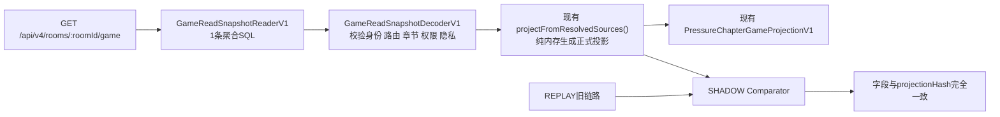

# Pressure GET `/game` SQL7 式聚合快照性能优化开发任务书 v1.0

## 1. 文档用途

本文档用于把 Pressure 普通 `GET /api/v4/rooms/:roomId/game` 从旧的多读取器权威重建链路，改造成与 SQL7 提交路径一致的“单次权威快照读取 + 内存投影”模式。

本文档是交给另一个 Codex 的开发任务书。当前任务只编写文档，不实施性能代码、不提交、不推送、不部署、不执行数据库迁移。

实施者必须先阅读仓库根目录 `AGENTS.md` 和：

- `docs/standards/高内聚低耦合与模块化开发标准_v1.0.md`
- `docs/auto-execute/pressure-performance-v1/03-architecture-plan.md`
- `docs/auto-execute/pressure-performance-v1/verification-results.md`
- `docs/auto-execute/pressure-performance-v1/agent-fast-reader.md`

## 2. 目标结论

当前一次最短前台链路：

```text
玩家点击决策
  -> SQL7 提交与六席结算
  -> 普通 GET /game 回读
  -> 页面展示下一状态
```

已知诊断基线：

| 阶段 | 应用 SQL | Supabase 协议往返 | 事务尝试 |
|---|---:|---:|---:|
| SQL7 提交与六席结算 | 7 | 10 | 1 |
| 一次普通 GET `/game` | 约 40 | 约 80 | 约 11 |
| 最短完整前台链路 | 约 47 | 约 90 | 约 12 |

SQL7 的真实 non-production 证据为：7 条应用 SQL、10 次协议往返、1 次事务、1 次提交、0 回滚、0 重试。普通 GET 的约 40/80/11 来自当前诊断日志，是优化基线，不是稳定公共合同，实施前必须重新测量并保存原始证据。

本次优化目标：

| 范围 | 当前 | 硬门目标 | 理想目标 |
|---|---:|---:|---:|
| 单次 GET 应用 SQL | 约 40 | 不超过 2 | 1 |
| 单次 GET 协议往返 | 约 80 | 不超过 4 | 1–2 |
| 单次 GET 事务 | 约 11 | 不超过 1 | 0 |
| SQL7 POST + 一次 GET 应用 SQL | 约 47 | 不超过 9 | 8 |
| SQL7 POST + 一次 GET 协议往返 | 约 90 | 不超过 14 | 11–12 |

如果达到硬门目标，理论访问量改善为：

- 单次 GET 应用 SQL 减少约 **95%–97.5%**；
- 单次 GET 协议往返减少约 **95%–98.75%**；
- 最短完整前台链路应用 SQL 减少约 **80.9%–83.0%**；
- 最短完整前台链路协议往返减少约 **84.4%–87.8%**；
- 最短完整前台链路事务尝试减少约 **83.3%–91.7%**。

这些百分比是访问数量目标，不是已经证明的延迟提升。只有真实 Supabase warm p50/p95 才能证明延迟结果。

## 3. 这个优化能解决什么，不能解决什么

### 3.1 能解决

- 普通 `/game` 为同一页面分别读取访问权、路由、玩家、章节、世界、Narrative、能力、资源、Feed造成的大量数据库往返；
- Prisma 小事务附带的 `BEGIN`、`COMMIT`、`SET` 等协议开销；
- AI等待期间每次轮询都重复完整权威重建的问题；
- 页面回读数据库约 9 秒这一类远程数据库延迟放大问题。

### 3.2 不能单独解决

- DeepSeek 单次冷生成约 22 秒；
- Narrative Worker 排队和模型服务端排队；
- 模型输出长度、Provider重试和Truth Guard重试；
- 未命中 `contextHash` 缓存时的AI冷生成时间。

因此必须分别验收：

```text
数据库快速回读 PASS
不等于
AI剧情冷生成 6 秒 PASS
```

对于已经生成或缓存命中的“剧情＋决策”，本优化有机会把页面数据库回读从约 9 秒压缩到目标 1–2 秒内；对于冷AI生成，最终等待仍主要由模型耗时决定。

## 4. 当前根因

当前 HTTP GET 流程：

```text
PressureChapterHttpFacade.game()
  -> resolveContext()
     -> access.authorize()
     -> route dispatch
     -> readStoredRoute()
  -> PressureChapterGameProjectionService.read()
     -> 再次 readStoredRoute()
     -> viewers.readViewer()
     -> chapters.readCurrent()
     -> worlds.readWorld()
     -> narratives.readCurrent()
     -> capabilities.readCapabilities()
     -> feed.list()
  -> projectResolvedSources()
```

主要代码位置：

- `apps/api/src/pressure-chapter/http/pressure-chapter-http.facade.ts`
- `apps/api/src/pressure-chapter/game-projection/game-projection.service.ts`
- `apps/api/src/pressure-chapter/live-adapters/`
- `apps/api/src/pressure-chapter/seat-control-persistence/`
- `apps/api/src/pressure-chapter/integration/`

问题不是单条 SQL 本身很慢，而是同一请求把一份页面投影拆成多个小Reader；Reader内部又可能开启各自事务或继续读取事件重放。远程 Supabase 网络延迟被每次读取和事务控制语句重复放大。

已有 `WorkingProjectionFastReaderV1` 只优化 Working Ledger 的单行缓存读取，不包含完整玩家 `/game` 投影；它不能代替本任务的完整聚合读取器。

## 5. 设计原则

1. PostgreSQL/Supabase继续是运行时唯一权威。
2. 不新增数据库表，不新增Migration，不新增本地数据库。
3. 不修改公开 `/game` 响应合同 `PressureChapterGameProjectionV1`。
4. 不新增API endpoint，不修改正式 `/game` 页面。
5. 不复制Settlement、权限、Narrative或决策表达规则。
6. 聚合Reader只读取和解码；不裁定业务结果。
7. 最终投影复用现有 `PressureChapterGameProjectionService.projectFromResolvedSources()`。
8. FAST只服务普通在线读取；恢复、审计、修复、事件回放继续使用REPLAY。
9. SHADOW出现任何字段、hash、权限或隐私差异，立即停止FAST启用。
10. 应用SQL、协议往返、事务和延迟必须分别报告。

## 6. 目标架构



聚合SQL必须在同一数据库语句中读取当前页面所需的权威材料：

- `runId`、`roomId` 与当前用户成员关系；
- 存储的 route snapshot、`routeHash`；
- 当前玩家 `viewerSeatId`、角色、控制模式、epoch和fence；
- 当前 `PressureChapterRuntime` 与 `ledgerProjectionJson`；
- 当前世界状态与五条指标；
- 当前玩家可见资源、tokens和situation；
- 当前章节与决策合同；
- 当前玩家对应的Narrative投影；
- 当前玩家可见的A-Emotion Feed页；
- 生成capabilities所需的权威字段。

允许在硬门范围内把Feed作为第2条查询，但必须先证明无法安全纳入聚合SQL；不得为了追求1条SQL返回错误、越权或过时Feed。

## 7. 模块清单与实施顺序

必须一次只实现和验收一个模块。当前模块未通过，不得进入下一模块。

### 模块一：Game Read Snapshot合同与解码

| 项目 | 内容 |
|---|---|
| 用户目标 | 定义一份足够生成正式 `/game`、但不包含数据库实现细节的只读权威快照 |
| 唯一职责 | 定义、校验、解码 `GameReadSnapshotV1` |
| 明确不负责 | 不查询数据库、不生成页面投影、不决定权限、不回退REPLAY |
| 权威输入 | 数据库聚合Reader返回的原始JSON |
| 输出 | 冻结、viewer-safe、route-bound的Resolved Sources |
| 允许依赖 | shared验证器、现有route/viewer/chapter/world/narrative合同 |
| 禁止依赖 | Prisma、HTTP、页面、Provider、Settlement |
| 建议生产文件 | 新增 `apps/api/src/pressure-chapter/game-projection/game-read-snapshot.ts`；必要时最小扩展 `game-projection/contracts.ts` |
| 建议测试文件 | 新增 `game-projection/game-read-snapshot.spec.ts` |
| 失败归属 | 快照合同或解码层 |
| 回滚 | 删除新合同文件，不影响旧GET |

必须测试：缺失成员、跨run、错误seat、routeHash不一致、过期revision、错误Narrative audience、重复资源、非法Feed cursor、错误fence、未知字段。

### 模块二：Prisma聚合快照Reader

| 项目 | 内容 |
|---|---|
| 用户目标 | 用1条PostgreSQL语句读取完整GET权威材料 |
| 唯一职责 | 参数化查询并返回原始快照 |
| 明确不负责 | 不重新实现业务规则、不生成最终投影、不调用Provider |
| 输入 | `roomId/runId/subjectId/viewerId/feedCursor/feedLimit/capturedAtMs` |
| 输出 | 模块一可解码的原始快照 |
| 允许依赖 | Prisma `$queryRaw`、`Prisma.sql`、现有表和JSON投影缓存 |
| 禁止依赖 | 页面、Narrator、Settlement写入、第二数据库权威 |
| 建议生产文件 | 新增 `apps/api/src/pressure-chapter/persistence/game-read-snapshot.prisma-adapter.ts` |
| 建议测试文件 | 新增同名 `.spec.ts` |
| 参考实现 | `sql7-fast-path/prisma-snapshot.ts`，但不得直接复制其提交专用字段和规则 |
| 失败归属 | 持久化读取层 |
| 回滚 | Product Root不接线即可完全停用 |

硬门：正常成功路径最多2条应用SQL；不得开启多个嵌套Prisma事务；不得读取另一个run或另一个seat的私人数据。

### 模块三：现有正式投影复用

| 项目 | 内容 |
|---|---|
| 用户目标 | 从快照直接生成与旧GET逐字段一致的正式响应 |
| 唯一职责 | 把模块一输出交给现有投影函数 |
| 明确不负责 | 不复制sanitize、capability或projectionHash规则 |
| 输入 | 解码后的Resolved Sources |
| 输出 | 现有 `PressureChapterGameProjectionV1` |
| 允许依赖 | `projectFromResolvedSources()`、现有Decision Presentation |
| 禁止依赖 | 重新查数据库、重新计算Settlement、另建Projection类型 |
| 准确生产文件 | 修改 `game-projection/game-projection.service.ts`；必要时最小修改 `game-projection/contracts.ts` |
| 准确测试文件 | 修改 `game-projection/game-projection.service.spec.ts` |
| 失败归属 | Projection Adapter |
| 回滚 | 删除新的fast read入口，旧 `read()` 不动 |

要求：不要新写第二个Projector。SQL7已经证明 `projectFromResolvedSources()` 可以从权威材料直接生成正式投影，本任务必须复用它。

### 模块四：REPLAY/SHADOW/FAST选择与正式接线

| 项目 | 内容 |
|---|---|
| 用户目标 | 可控验证并切换普通GET，不影响恢复和审计 |
| 唯一职责 | 选择读取模式、执行SHADOW对比、接入正式HTTP GET |
| 明确不负责 | 不修改投影内容、不修改数据库、不修改页面 |
| 输入 | `PRESSURE_GAME_READ_MODE=REPLAY|SHADOW|FAST` |
| 输出 | 与当前完全相同的HTTP响应 |
| 准确生产文件 | 修改 `product/product-root.ts`、`http/pressure-chapter-http.facade.ts`；建议新增 `game-projection/game-read-selector.ts` |
| 准确测试文件 | 修改对应spec，新增selector spec |
| 失败归属 | 应用编排/HTTP接线层 |
| 回滚 | 环境变量切回REPLAY；代码保留但不执行 |

模式定义：

- `REPLAY`：只运行旧链路，作为修改前基线和恢复路径；
- `SHADOW`：返回旧链路结果，同时运行FAST并逐字段比较；
- `FAST`：只运行聚合读取和现有Projector；快照非法时fail-closed，不静默返回可能错误的投影。

SHADOW对比至少覆盖：完整响应深相等、`projectionHash`、seat、routeHash、chapterRuntimeId、workingRevision、Narrative source、capabilities、资源、tokens、决策选项和Feed audience。

### 模块五：请求级观测与验收工具

| 项目 | 内容 |
|---|---|
| 用户目标 | 准确知道单次GET实际访问了多少数据库、用了多久 |
| 唯一职责 | 记录请求级SQL、协议、事务和阶段耗时 |
| 明确不负责 | 不改变业务路径、不把调试字段返回玩家 |
| 输入 | 单次请求的内部trace/context |
| 输出 | 脱敏metrics和验收报告 |
| 建议生产修改 | 优先复用现有Prisma query event统计；不得引入公共响应字段 |
| 建议测试/脚本 | 新增独立non-production验收脚本或扩展现有pressure performance脚本 |
| 失败归属 | Observability/Acceptance |
| 回滚 | 删除验收脚本或关闭内部指标，不影响产品 |

计数必须隔离后台Worker。不得使用混有Narrative Worker、A-Emotion Worker或其他请求的全局Prisma统计冒充单次GET证据。

## 8. 准确的禁止范围

本任务禁止：

- 修改 `apps/web/` 下任何玩家页面、CSS、JS或轮询逻辑；
- 新增平行 `/game` 页面或测试页面进入正式流程；
- 修改 `PressureChapterGameProjectionV1` 公共字段；
- 新增API endpoint；
- 新增数据库表、列、索引或Migration；
- 修改Settlement、Action Guard、AI席位策略或Narrator Prompt；
- 让页面、Provider或数据库适配器重新裁定capabilities；
- 把Feed、Narrative或私人资源错误地改成PUBLIC以减少查询；
- 用内存缓存、静态fixture或本地文件作为第二权威；
- 为了过测试而对N1写特殊分支；实现必须适用于N1–N7和六个席位；
- 在未获得当前授权时提交、推送、部署或修改真实用户数据。

如果实现必须越过以上边界，立即停止并向项目所有者说明，不得自行扩大范围。

## 9. 开发步骤

### Gate 0：重新建立基线

1. 确认当前分支是 `main`。
2. 保存当前HEAD、远程基线和工作树状态；工作树可能存在其他任务修改，禁止reset、cleanup、广泛stash或覆盖。
3. 用一个隔离non-production run记录：
   - 单次普通GET应用SQL；
   - 协议往返；
   - 事务attempt/commit/rollback；
   - API服务端总耗时；
   - 各Reader阶段耗时。
4. 保存原始日志；如果统计混入后台任务，基线无效。

### Gate 1：只完成模块一

完成合同和恶意/错误输入测试，不接Prisma，不改HTTP。

### Gate 2：只完成模块二

用fixture验证聚合SQL、绑定参数、唯一行、跨run/跨seat隔离和query budget。

### Gate 3：只完成模块三

证明快照输出交给现有Projector后，与旧链路的固定fixture逐字段一致。

### Gate 4：SHADOW真实对照

在N1–N7、六个身份上对照。至少覆盖：

- HUMAN_ACTIVE和AI_ACTIVE；
- 当前有/无决策；
- Narrative PENDING/PUBLISHED/FALLBACK_PUBLISHED；
- 有/无tokens和私人资源；
- Feed为空、分页和仅私人可见；
- 路由、revision、epoch、fence变化；
- 章节冻结和终局前状态。

任何差异都归到唯一模块修复；禁止直接忽略字段或修改旧链路迎合FAST。

### Gate 5：FAST真实Supabase验收

只在SHADOW完全一致后启用FAST。执行：

1. 一次真实non-production普通GET；
2. 一次真实N1提交到N2回读；
3. 至少10次warm GET采样，计算p50/p95；
4. 清理fixture；
5. 保存原始、未混入后台任务的metrics。

### Gate 6：玩家真实流程

使用正式 `/game?runId=...` 验证：

- 页面内容与修改前相同；
- 身份、资源、剧情、决策和Feed没有串席；
- 刷新后内容一致；
- 点击决策后能进入下一章节；
- 玩家页面没有出现内部hash、Provider、SQL或错误码。

## 10. 必须执行的测试

聚焦测试建议：

```powershell
pnpm exec tsc --noEmit -p apps/api/tsconfig.json
node --import tsx --test <新增快照合同spec>
node --import tsx --test <新增Prisma聚合Reader spec>
node --import tsx --test apps/api/src/pressure-chapter/game-projection/game-projection.service.spec.ts
node --import tsx --test apps/api/src/pressure-chapter/http/pressure-chapter-http.facade.spec.ts
```

最终离线回归：

```powershell
pnpm test:pressure-chapter:final
```

真实环境验收必须单独报告，不得用离线测试代替。

## 11. 验收标准

### 11.1 架构PASS

- PostgreSQL仍是唯一权威；
- 没有新表/Migration/endpoint/页面；
- 没有第二套Projection或权限规则；
- 普通读取使用聚合快照，恢复与审计保留REPLAY。

### 11.2 功能PASS

- N1–N7、六席SHADOW结果完全一致；
- `projectionHash`完全一致；
- 私人Narrative、资源、tokens和Feed没有泄露；
- 原正式 `/game` 合同和页面不变。

### 11.3 数据库访问PASS

- 单次FAST GET应用SQL不超过2；
- 协议往返不超过4；
- 事务不超过1；
- SQL7 POST + 一次FAST GET应用SQL不超过9；
- 没有后台Worker污染计数。

### 11.4 延迟PASS

必须真实测量并分别报告：

- 单次FAST GET warm p50/p95；
- SQL7提交耗时；
- 首次权威N2投影耗时；
- AI Narrative等待耗时；
- 玩家最终看到“剧情＋决策”的总耗时。

建议目标：FAST GET warm p95不超过1.5秒；SQL7提交到首次权威投影不超过6秒。该目标只有真实样本通过后才能声明PASS。

AI冷生成不纳入本任务的1.5秒GET硬门，但必须在最终报告中单列，不能从总耗时中隐藏。

## 12. 轮询影响

当前页面等待Narrative时会重复GET。若轮询 `k` 次：

当前近似：

```text
应用SQL = 7 + 40k
协议往返 = 10 + 80k
事务 = 1 + 11k
```

FAST硬门下：

```text
应用SQL <= 7 + 2k
协议往返 <= 10 + 4k
事务 <= 1 + k
```

本任务先优化每次GET，不修改前端轮询。只有FAST GET通过后，才能另开玩家可见审批，讨论指数退避、SSE或其他等待策略。不要把前端轮询修改混入本任务。

## 13. 预计工时和参与节点

通用版本预计3–4小时：

- 60–90分钟：快照合同、聚合Reader和聚焦测试；
- 45–60分钟：复用现有Projector并完成SHADOW对比；
- 30–60分钟：真实Supabase访问量和延迟测量；
- 30–60分钟：差异修复、N1–N7/六席回归和报告。

项目所有者参与节点：

1. Gate 0确认修改前基线；
2. SHADOW完全一致后确认是否启用FAST；
3. FAST真实Supabase通过后，在正式 `/game` 亲自测试一次；
4. 未认可前不得提交、推送或进入轮询优化。

## 14. 完成交付格式

另一个Codex最终必须按模块报告：

```text
模块：
修改文件：
解决的问题：
修改后的行为：
明确未改范围：
聚焦测试：
SHADOW差异：
真实Supabase SQL/协议/事务：
warm p50/p95：
完整点击到下一剧情耗时：
已知问题：
回滚点：
代码状态：仅本地 / 已提交 / 已推送 / 已部署
```

不得仅以“测试通过”或“SQL减少”声明整体完成。只有架构、功能、访问量、延迟和真实玩家流程分别通过，才能声明本优化完成。
