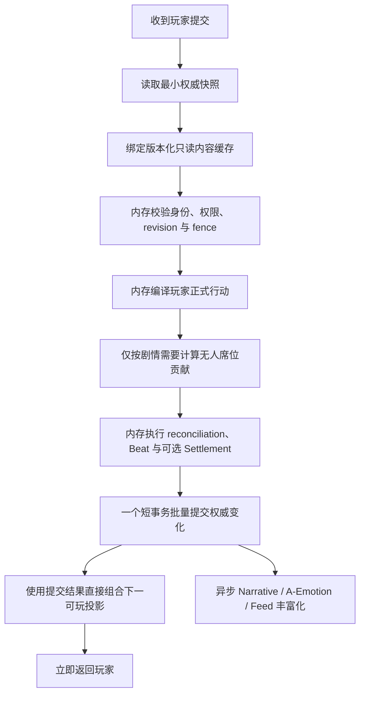

# Pressure 单次决策约 10 次 Supabase 访问性能优化实施与验收规范 v1.0

> 状态：目标冻结，待网页版 ChatGPT Pro 按本规范实现并由本地独立验收
> 适用范围：Pressure 主游戏 `提交决策 → 下一可玩投影` 关键路径
> 数据库：获授权的非生产 Supabase
> 事实来源：当前 `main` 代码、Pressure 冻结发布包与本规范
> 本规范不授权修改玩家页面、Prisma Schema 或 migration

> 本次实施基线：从 `main` 的 `b5c3b95afc6b9994332cf6aed7928e9ce5a76ffd` 创建专用分支 `codex/pressure-phased-performance-v1`。现有工作树中的其他未提交改动不属于本性能任务，必须保留且不得被暂存、覆盖或清理。

## 1. 背景与问题

当前 Pressure 决策链首先保证了：

- Working Ledger 单一权威；
- route、revision、control epoch 和 fence 校验；
- 幂等、CAS、崩溃恢复与审计；
- 五个无人席位零大模型、零 Provider；
- Beat、Settlement、Narrative 与 A-Emotion 的权威边界。

但当前实现没有把一次玩家决策的数据库往返数量作为硬性设计约束。静态代码路径估算显示，一次跨章节决策可能触发约 170–210 条 SQL 命令。该数字只是待实测基线，不能作为最终证据；正式验收必须使用 Prisma 查询计数和真实非生产 Supabase 分阶段计时。

主要重复开销包括：

1. 提交前构造或读取超出命令校验所需的完整游戏投影；
2. 不同模块重复读取相同的 route、runtime、decision、seat、ledger 和 world 状态；
3. 五个无人席位各自重新校验并分别开启数据库事务；
4. Orchestrator、Beat、Settlement 在同一请求中重复读取刚刚产生的状态；
5. 提交完成后再次从数据库完整重建 `/game` 投影；
6. Narrative、A-Emotion、Feed 等非必要表现层工作进入玩家等待路径；
7. 为正常请求重复重放完整 StoryEvent 历史，而不是读取当前快照。

对于 MVP，这会造成明显的并发风险：玩家数量增加时，数据库连接、网络往返、事务竞争和尾延迟会同时上升。

## 2. 冻结目标

### 2.1 玩家体验目标

- 玩家点击“提交决策”到收到下一份页面数据：**最多 6 秒**；
- 后端从接收请求到生成“下一可玩投影”：非生产 Supabase **warm p95 ≤ 5 秒**；
- 超过 6 秒判定为失败，不得通过增加等待时间、轮询次数或重试次数掩盖。

### 2.2 数据库目标

- 普通 Beat 决策：应用 SQL 目标 **≤ 6 条**，计入 `BEGIN/COMMIT` 后数据库协议往返目标 **≤ 8 次**；
- 章节结束并产生 Settlement：应用 SQL 目标 **≤ 7 条**，计入 `BEGIN/COMMIT` 后数据库协议往返目标 **≤ 9 次**；
- 只有 CAS 冲突调查、显式 recovery/audit、故障注入或数据修复可以超出；正常成功路径不得超出；
- “一次”指真实发往 Supabase/PostgreSQL 的数据库命令或批量命令；
- 把几十条 SQL 放进一个 `$transaction`，不能计为一次访问；
- 性能报告必须同时给出：
  - 数据库命令总数；
  - 事务次数；
  - 各命令耗时；
  - 后端端到端耗时；
  - 玩家端端到端耗时。

### 2.3 权威与安全目标

- Working Ledger 仍为唯一行动权威；
- Supabase 仍为运行状态唯一持久化权威；
- 不新增本地数据库，不形成双写或第二权威；
- 保留幂等、CAS、routeHash、revision、controlEpoch 与 fence；
- Solo 无人席位严格零 LLM、零 Provider、零模型网络；
- 无人席位确定性计算应在内存中毫秒级完成；
- 只有当前 authored Beat 确实需要的无人席位贡献才能进入关键路径；
- 不得为了凑齐六条记录而强制写入与当前剧情因果无关的行动；
- Narrative、A-Emotion、Feed 丰富化不得阻塞下一可玩投影；
- 不得修改 `apps/web/**`、正式玩家页面、路由或文案；
- 不得修改 `prisma/schema.prisma` 或 `prisma/migrations/**`。

## 3. 三类数据及存放位置

### 3.1 API 进程共享的版本化只读缓存

以下数据属于发布内容，而不是单个玩家的运行状态。它们可以由同一 API 进程内的全部玩家、全部房间共享：

- N1–N7 章节内容；
- 决策点、决策选项及展示映射；
- Action Effect Policy；
- 零模型 AI 确定性策略；
- Narrative 模板和叙事权威目录；
- 角色公开资料；
- 事实、规则、章节配置；
- 路由对应的冻结内容版本。

缓存规则：

1. 缓存键必须至少包含 `routeHash` 和/或 `contentHash`；
2. 缓存值加载后必须保持不可变，不允许请求内修改共享对象；
3. 首次加载时校验发布 manifest、自哈希和依赖哈希；
4. 同一哈希只加载一次，并共享同一个已解析结果或 Promise；
5. 加载失败必须 fail closed，不允许返回未校验内容；
6. 新旧 routeHash 可以同时存在，旧运行继续使用旧版本；
7. 可以设置有界 LRU/引用计数，但不得在运行仍引用某版本时误删；
8. 缓存只能减少文件解析或静态内容装载，不能绕过运行时权限过滤。

角色私密事实即使来自共享只读缓存，也必须在返回玩家前按服务器确认的 viewer seat 过滤，不能整体下发到浏览器。

### 3.2 单次请求共享的权威快照

玩家提交决策后，从 Supabase 集中读取本轮所需的最小运行时权威数据：

- StoryRun/房间与玩家成员关系；
- 玩家绑定席位；
- 当前 seat control、controlEpoch、submission fence；
- frozen route 与 routeHash；
- 当前 chapter runtime；
- 当前 decisionPoint、requiredSeatIds、allowedActionTypes；
- workingRevision；
- Ledger head 和当前投影；
- 当前世界指标、承诺状态及本轮必需事实；
- 请求幂等记录或已接受行动的最小信息。

这份快照只在当前请求内存在，必须：

- 深度只读或类型层面 readonly；
- 带有 snapshot hash；
- 记录读取时的 revision、ledger head、control epoch 和 routeHash；
- 被命令校验、无人席位计算、Beat、Settlement 和下一投影共同复用；
- 禁止各模块为了“确认一下”再次读取同一状态；
- 在最终提交时通过 CAS 条件验证仍未过期。

请求结束后快照自然释放，不跨请求作为权威复用。

### 3.3 必须保存在 Supabase 的权威数据

以下数据不能只存在 API 内存或浏览器存储：

- 当前 revision 与 Ledger head；
- 玩家已提交并被接受的行动；
- 席位控制权、epoch 与 fence；
- 请求幂等记录；
- 当前章节和决策运行状态；
- Settlement 与最终权威结果；
- 必要的 StoryEvent/Outbox 记录；
- 重启后必须继续存在的承诺、事实、资源和责任状态。

浏览器 `localStorage/sessionStorage` 只允许保存草稿、展开状态等非权威 UI 状态，不得保存已成功执行的行动或替代 Supabase 权威状态。

## 4. 目标关键路径



目标形态是：

> 一次集中读快照 → 整轮内存计算 → 一次短事务批量提交 → 直接返回下一可玩投影。

## 5. 目标数据库预算

以下是设计预算，不是要求机械制造固定十条 SQL。实现可以少于该预算，但不得通过隐式 N+1 或事务内大量命令规避计数。

| 序号 | 阶段 | 目标数据库命令 | 说明 |
|---:|---|---:|---|
| 1 | 请求上下文 | 1 | 合并读取 run、membership、viewer seat 与 frozen route |
| 2 | 权威快照 | 1 | 集中读取 runtime、decision、seat control、revision、ledger head、必要状态 |
| 3 | 幂等检查 | 0–1 | 可合并进快照；若独立查询则最多一次 |
| 4 | 权威事件批量写入 | 1 | 玩家行动与必要无人席位贡献使用批量/集合式写入 |
| 5 | Ledger/Runtime CAS | 1 | 条件更新 revision、head、runtime 状态 |
| 6 | Chapter/Settlement | 0–1 | 仅章节结束时写入 |
| 7 | StoryEvent | 1 | 写入本轮完整、可重放的权威事件 |
| 8 | Outbox | 1 | 使用 `createMany` 或等价集合写入，不能逐项 N+1 |
| 9 | 必要一致性校验 | 0–1 | 尽量依赖受影响行数和 RETURNING，禁止完整重读 |
| 10 | 投影兜底读取 | 0–1 | 首选使用提交返回值；只有不能安全构造时才轻量读取 |
|  | **合计** | **6–10** | 普通决策应靠近 6–8，跨章节决策不超过约 10 |

上述表是按职责拆分的上限预算。实现时应进一步合并：

- idempotency 进入 Authority Snapshot；
- player 与 required AI action 使用一次集合插入；
- Ledger 与 Orchestrator events 使用一次集合插入；
- Runtime、Working State、Decision State 与 Ledger Projection 使用一次 CAS 更新；
- PUBLIC + 六席 Narrative Projection 使用一次集合插入；
- Narrative + A-Emotion Outbox 使用一次集合插入；
- 章节边界可使用一个 writable CTE 原子完成 Settlement、World、当前 Runtime 与下一 Runtime 变化，但必须保持 SQL 可审查且不得复制领域规则到 SQL。

因此验收时同时报告两个数字：

```text
application_sql_statement_count
database_protocol_roundtrip_count_including_begin_commit
```

事务次数目标：

- 快照读取：最多一个只读一致性事务；
- 权威提交：一个短写事务；
- Narrative/A-Emotion worker：不计入玩家关键路径，在独立事务执行。

## 6. 具体实现要求

### 6.1 版本化只读内容缓存

建立进程级内容注册表，例如概念接口：

```ts
interface PressurePublishedContentCacheV1 {
  get(routeHash: string, contentHash: string): Promise<Readonly<PressurePublishedContentV1>>;
}
```

要求：

- 复用现有冻结 loader 和验证器；
- 不复制一套内容解析逻辑；
- 缓存成功验证后的不可变对象；
- 并发首次请求共享同一加载 Promise，避免缓存击穿；
- 记录 cache hit、miss、loadMs 和 hash；
- 测试 hash 漂移、加载失败、并发首次加载和多版本并存。

### 6.2 最小权威快照读取器

当前已有 decision convergence snapshot 思路，但必须扩展为整条提交链共享，而不是只供无人席位计算。

目标接口示意：

```ts
interface PressureDecisionRequestSnapshotReaderV1 {
  read(input: {
    runId: string;
    subjectId: string;
    expectedRouteHash: string;
  }): Promise<Readonly<PressureDecisionRequestSnapshotV1>>;
}
```

快照必须包含命令编译、权限、AI、Beat、Settlement 和下一投影真正需要的最小字段。不得把完整 Prisma row、Provider、Narrative 原文或其他玩家私密数据作为方便字段塞入快照。

为了让“一次读取”成为可证明的硬合同，优先采用一个参数化 PostgreSQL CTE/LATERAL JOIN 查询，返回一个严格解码的 JSON envelope。普通 Prisma `include` 只有在查询日志证明它确实生成单条 SQL 时才能接受。不得创建新 View、表或 migration。

Snapshot 可以直接读取并验证现有 `PressureChapterRuntime.ledgerProjectionJson`，把它作为正常运行时的 query-oriented cache。普通玩家请求不得每次 `StoryEvent.findMany()` 后从头执行完整 Ledger replay。只有以下显式路径允许重放历史：

- projection 缺失或 hash 无效；
- recovery、audit 或 repair 命令；
- replay/acceptance test。

正常路径发现 projection 损坏时应 fail closed，不得在玩家 POST 中静默执行昂贵恢复。

### 6.3 内存命令与结算计划

读取快照后，纯函数生成一个提交计划：

```ts
interface PressureDecisionCommitPlanV1 {
  snapshotHash: string;
  expectedWorkingRevision: number;
  expectedLedgerHeadHash: string;
  playerAction: DecisionActionV1;
  requiredAutomationActions: readonly DecisionActionV1[];
  beatEvent: WorkingLedgerEventV1;
  nextRuntime: PressureChapterRuntimeProjectionV1;
  settlement: PressureChapterSettlementV1 | null;
  storyEvents: readonly StoryEventWriteV1[];
  outboxMessages: readonly OutboxWriteV1[];
  playableProjection: PressurePlayableProjectionSeedV1;
}
```

计划生成阶段：

- 不访问 Prisma/Supabase；
- 不调用 Provider/LLM/OpenNovel 网络；
- 不执行 Narrative/A-Emotion 投影；
- 只使用请求快照和版本化内容缓存；
- 输出可哈希、可测试、确定性的完整计划；
- 相同输入必须产生相同 plan hash。

### 6.4 无人席位处理

不得再把五个无人席位模拟成五个独立在线玩家请求。

必须先读取 authored decision 的 `requiredSeatIds` 和因果依赖：

- 若本轮结果只依赖玩家席位，则不生成无关 AI 行动；
- 若确实依赖部分无人席位，只计算这些席位；
- 若 authored Beat 确实要求全部六席，则一次快照后在内存批量计算五席；
- 所有 AI 行动按稳定 seat order 生成；
- AI 计算阶段数据库访问数必须为零；
- AI Provider/LLM/model-network 调用数必须为零；
- 持久化必须使用批量或同一短事务内的集合式写入；
- 不允许每席重复 route、runtime、seat、ledger、content 校验；
- Ledger 顺序由提交计划提前确定，最终事务一次校验旧 head 并提交整段新链。

特别说明：本优化不擅自改变已发布决策的 `requiredSeatIds`。如果当前 authored decision 明确要求六席，则五个 AI 逻辑行动仍然存在；删除的是五次独立数据库工作流，而不是删除剧情所需的五方逻辑贡献。只有 authored contract 标记 `NOT_REQUIRED` 的席位才不生成、不写入。

### 6.5 一次短事务提交

提交器必须：

1. 校验 `routeHash`、`workingRevision`、`ledgerHeadHash`、`controlEpoch` 和 fence；
2. 校验幂等键是否已存在；
3. 批量写入玩家行动与必要无人席位行动；
4. 写入完整 Ledger/StoryEvent；
5. CAS 更新 runtime；
6. 仅在章节结束时写 Settlement；
7. 批量写最小 Outbox 信号；
8. 返回已提交的下一状态种子和受影响行数；
9. 任一条件失配则整笔零写入并返回明确冲突；
10. 不在事务内加载静态内容、调用网络、生成 Narrative 或重新构建完整投影。

事务应尽量短，不允许在持有数据库锁时进行大量纯计算。

### 6.6 直接生成下一可玩投影

提交计划已包含下一 runtime、当前 viewer 和已验证的冻结内容。提交成功后，应使用：

- commit 返回的权威字段；
- 请求内 viewer/seat；
- 版本化内容缓存；
- 下一决策的最小可玩状态；

直接组合响应，不再完整调用一次当前重型 `game.read()`。

若 Narrative 或 A-Emotion 新投影尚未完成：

- 返回上一份仍合法的已发布 Narrative，或冻结内容提供的安全基础叙事；
- 明确标识表现层状态，但不得暴露内部 debug 字段；
- 下一决策按钮和必要上下文必须可用；
- 不得因等待新 Narrative 而阻塞玩家。

公共 HTTP response schema 不得随意改变；需要调整合同时必须先提交独立审批。

### 6.7 异步表现层

权威事务只写最小 Outbox 信号。事务提交后由 worker 异步完成：

- Narrative 投影；
- A-Emotion 聚合与投递；
- Feed 丰富化；
- 非必要诊断与统计。

这些任务失败不得回滚已提交的玩家行动，也不得使下一决策不可玩。worker 必须保持幂等和可重试，但玩家 HTTP 请求不能等待它们完成。

Durable Outbox 本身不能异步丢失：最小 Outbox rows 必须与权威变更在同一事务中批量落库；异步的是消费 Outbox、Provider Narrative、A-Emotion 编译和 Feed hydrate。现有逐个创建七份 Narrative Projection 与七份 Outbox 的循环应在不改变 dedupeKey 和逻辑 job 数量的前提下合并为集合写入。

### 6.8 最小接入策略：不重构整个系统

为避免过度设计，本轮只优化 `POST 提交决策` 的关键路径：

- 保留现有普通 `GET /game` 读模型；
- 保留现有表结构、领域合同和 recovery/audit 路径；
- 不新建第二套长期并行的权威链；
- 可以新增窄的 snapshot reader、pure planner、unit of work 和 commit-receipt assembler，但它们必须复用现有权威类型与 reducers；
- 不复制 Orchestrator、Beat 或 Settlement 规则；
- 不以新目录数量、接口数量或抽象层数量作为完成指标；
- 若可在现有服务中以更少文件安全实现，应优先采用更少改动；
- 旧慢路径可留作显式 recovery/audit 工具，但不能与新路径同时拥有生产写权。

不采用“上线前必须积累 1000 次 shadow 普通决策和 100 次章节边界”的重型前置条件。MVP 采用确定性 parity fixtures、真实非生产 Supabase 小样本和用户参与首轮测试逐步放量；任何 shadow 验证都必须只读、不得双写，也不得成为长期维护的平行产品实现。

### 6.9 分阶段实施与多 ChatGPT Pro 协作

本任务必须采用“小步慢走、每次只改一个问题”的方式实施。14 个阶段的边界如下：

| 阶段 | 内容 | 通过条件 |
|---|---|---|
| S0.0 | 冻结基线：记录 `BASE_HEAD`、工作树状态、脏文件和允许修改文件 | 能证明后续没有污染其他改动 |
| S0.1 | 增加观测能力：阶段耗时、SQL 数、事务尝试/提交/重试次数 | 不改变业务行为 |
| S0.2 | 只跑基线：1 次真实提交、5 次冒烟、20 次暖机观察 | 找到真实热点；状态只能是 `PERF_MEASURED` |
| S1.1 | 实现 `WorkingProjectionFastReader` 数据契约和纯校验 | 字段、hash、revision、head 测试通过 |
| S1.2 | 接入 Fast Reader，先进行非生产 shadow compare | shadow 只读，返回结果仍使用旧逻辑 |
| S1.3 | 只替换 Projection-only 路径 | Beat、恢复、审计、修复、回放仍保留事件重放 |
| S2.1 | 定义 `DecisionSubmitSnapshotV1` | 权限、跨 run/seat、过期 revision、fence、幂等性 parity 通过 |
| S2.2 | 移除提交前完整 `game.read()` | 保留提交后的 `game.read()`，行为和错误边界正确 |
| S3A | AI 批量提交契约、排序、hash、链计算 | 纯函数测试通过；无数据库、Provider 或模型网络调用 |
| S3B | 批量持久化适配器，暂不接生产 | 一次事务具备原子性、幂等性和冲突处理 |
| S3C | 正式接入 AI 批量提交 | 5 个 AI 从 5 次事务变为 1 次事务 |
| S3.5 | 使用 S0 同场景立即重新测量 | 对比 p50/p95、SQL、事务、AI append 和总耗时 |
| S4 | 仅在测量证明仍有明显收益时处理 Outbox/Narrative 批量写入 | 不因方案中存在该项就提前实施 |
| P1 | 只选择一个最大剩余热点继续优化 | 不得同时改 Feed、Orchestrator 和最终 Projection |

阶段之间不得提前混合：S1 不顺便改提交逻辑，S2 不顺便做 AI 批量，S3A/S3B 不提前接生产，S4/P1 必须等待 S3.5 测量后决定。

每个阶段最多进行三类测试：

1. 一次问题定位，先确认唯一性能或正确性假设；
2. 一次最小正确性测试，覆盖本阶段新增或改变的边界；
3. 一次与基线同场景的性能对比。

若测试失败，必须先分类为代码错误、数据/环境错误、并发冲突、事务重试或观测错误，再只重跑失败的最小用例。不得在问题未分类前反复运行整套测试。

性能对比必须固定接口、数据规模、Supabase 区域、连接池和 AI 数量，保留失败、超时和事务重试，并同时报告绝对值、p50、p95、SQL 数、事务尝试数、提交数和重试数。

#### 多 ChatGPT Pro 并发边界

多个 ChatGPT Pro 可以并发工作，但只能并发处理互不重叠的工作包；生产链集成、真实数据库写入测试和性能验收必须由单一协调者串行执行。

允许并发的工作包括：

- 只读分析热点、SQL 调用链和现有测试覆盖；
- 盘点测试 fixture、基准脚本和验收数据；
- S1.1 的 Projection 契约、纯校验和测试；
- S3A 的 AI Batch 契约、排序、hash 和纯函数测试。

不允许并发修改或测试的工作包括：

- 同时修改 `decision-command.compiler.ts`、`convergence.service.ts` 或 AI 持久化适配器；
- 同时接入 S1.2/S1.3、S2.2 或 S3C；
- 多个 Pro 同时对同一批 Supabase 数据执行写入性能测试；
- S4 与 P1 同时改持久化、Outbox、Feed 或 Orchestrator；
- 多个 Pro 同时提交、重写、覆盖或解决同一文件冲突。

每个 Pro 工作包必须明确提供：

- 基准提交 SHA；
- 唯一的允许修改文件清单；
- 明确的禁止修改范围；
- 输入、输出和完成条件；
- 测试命令、原始结果、失败分类和未解决风险。

本分支采用“一个集成者、多个工作者”模式。工作者不得自行 `git add -A`、reset、清理脏文件或宣布 `PERF_PASS`；集成者逐项审查 diff、文件范围、测试结果和准确 SHA 后，才能把工作包合入当前分支。若发生文件重叠或无法确认改动归属，必须停止该工作包，不得通过覆盖或强制合并解决。

推荐波次如下：

1. 协调者完成 S0.0；
2. 多个 Pro 并发做只读分析、测试盘点和 S1.1/S3A 纯契约准备；
3. 协调者串行集成 S0.1 并完成 S0.2 基线；
4. 按 S1 → S2 → S3A → S3B → S3C 顺序集成和验证；
5. 完成 S3.5 后，只选择 S4 或 P1 其中一个继续。

S0～S3 只能报告 `PERF_MEASURED`，不能提前报告 `PERF_PASS`。只有后端 warm p95 ≤ 5 秒、玩家端 ≤ 6 秒，且正确性、幂等、并发、隐私、恢复和下一投影可玩性全部通过，才允许报告最终 `PERF_PASS`。

## 7. 崩溃、重启与多实例

### 7.1 API 重启

API 进程崩溃后：

1. 内存中的只读内容缓存消失；
2. 服务启动或首次请求时从发布包重新加载并校验内容；
3. 玩家运行进度从 Supabase 的 runtime、Ledger、Settlement 等权威记录恢复；
4. 未完成的表现层任务从 Outbox 恢复；
5. 不丢失已提交行动，不需要本地数据库恢复。

### 7.2 提交中途崩溃

- 写事务提交前崩溃：整笔回滚，玩家可以使用相同幂等键安全重试；
- 写事务提交后响应前崩溃：相同幂等键必须返回原提交结果或可重建的等价结果；
- Outbox 尚未消费：worker 重启后继续处理，不影响权威进度；
- 不得产生“行动已写但 runtime 未推进”的部分成功状态。

### 7.3 多 API 实例

- 每个实例各自持有相同 hash 对应的只读缓存；
- 缓存之间不需要同步写入；
- Supabase 通过 CAS、唯一键和幂等记录处理并发；
- 任何实例都不能把内存快照当成跨请求锁；
- 快照过期时应快速返回冲突并让客户端刷新，不得盲目重试多次。

## 8. 阶段计时与查询计数

每次提交必须生成结构化、脱敏的阶段诊断：

```text
request_context_ms
authority_snapshot_ms
content_cache_ms
player_compile_ms
ai_compute_ms
commit_transaction_ms
orchestrator_ms
beat_ms
settlement_ms
projection_ms
backend_total_ms
db_command_count
db_transaction_count
provider_call_count
model_network_call_count
```

要求：

- 计时使用单调时钟；
- 不记录 cookie、token、DATABASE_URL、玩家私密内容或原始 Narrative；
- 查询计数必须覆盖 Prisma 产生的全部数据库命令；
- 标明命令发生在哪个阶段；
- 诊断写入不得阻塞玩家响应；
- 超过预算时报告最慢阶段和最重查询，而不是只给总时间；
- 生产环境可以采样，但验收环境必须 100% 记录。

## 9. 测试与验收方案

### 9.1 静态与类型门禁

- API full TypeScript 检查通过；
- 禁止范围 diff 为零：
  - `apps/web/**`
  - `prisma/schema.prisma`
  - `prisma/migrations/**`
- AI 依赖图中不存在 Provider、LLM、OpenAI、OpenNovel Narrative 或模型网络 capability；
- 缓存与快照类型保持 readonly；
- 提交计划生成器不导入 Prisma repository。

### 9.2 内容缓存测试

- 相同 routeHash/contentHash 的 100 个并发请求只加载一次；
- 缓存命中不访问 Supabase；
- 不同内容版本可以并存；
- hash 漂移立即拒绝；
- API 重启后能够重新加载；
- viewer 私密数据仍被正确过滤。

### 9.3 请求快照测试

- 整条命令、AI、Beat、Settlement 使用同一个 snapshot hash；
- 各阶段不会再次调用 snapshot reader；
- 快照与提交间 revision/head/epoch 变化时 CAS 零写入；
- 旧页面、跨 run、跨 seat、篡改 fence 全部 fail closed；
- 快照中不存在未授权其他席位私密字段。

### 9.4 无人席位测试

- 只需玩家席位的 Beat：AI 行动数为 0；
- 需要两个无人席位：只生成两条；
- 必须六席的 Beat：一次内存计算生成五条；
- AI compute 阶段数据库命令数为 0；
- Provider/LLM/model-network 调用数严格为 0；
- 相同快照重复计算得到相同 hash；
- seat order 改变不会改变最终确定性结果。

### 9.5 原子提交测试

- 玩家行动、必要 AI、Ledger、runtime、Settlement 和 Outbox 要么全部成功，要么全部失败；
- 相同 idempotencyKey 返回同一结果，不增加行；
- 相同 idempotencyKey 不同 payload 拒绝；
- 并发两个玩家提交时只有符合 revision/fence 的命令成功；
- 提交后响应前模拟崩溃，重试可恢复原结果；
- 不出现部分 Ledger 链或断裂 head。

### 9.6 数据库访问预算测试

必须在真实 Prisma Client 上安装查询计数器，不得用 mock repository 证明数据库预算。

验收场景至少包括：

| 场景 | 数据库命令目标 | 事务目标 |
|---|---:|---:|
| Solo，当前 Beat 只需要玩家 | 应用 SQL ≤ 6；含 BEGIN/COMMIT 往返 ≤ 8 | ≤ 2 |
| Solo，当前 Beat 确实需要五个 AI | 应用 SQL ≤ 6；含 BEGIN/COMMIT 往返 ≤ 8 | ≤ 2 |
| 3 真人 + 3 无人席位 | 应用 SQL ≤ 6；含 BEGIN/COMMIT 往返 ≤ 8 | ≤ 2 |
| 6 真人并发提交 | 单请求应用 SQL ≤ 6；含事务往返 ≤ 8 | 单请求 ≤ 2 |
| 章节结算并打开下一章 | 应用 SQL ≤ 7；含 BEGIN/COMMIT 往返 ≤ 9 | ≤ 2 |

任何 N+1 查询都判失败。若数据库驱动因批量插入产生可证明不可合并的额外协议命令，必须在报告中单独列出，不能静默放宽预算。

### 9.7 真实非生产 Supabase 分阶段计时

执行顺序遵循“用户参与第一次测试”的要求：

1. 先由用户参与第一次真实后端提交；
2. 展示本次总耗时、数据库命令数和各阶段耗时；
3. 首次失败立即定位具体阶段，不先进行 30 次隐藏测试；
4. 修复并获得用户同意后，再进行 warm 样本统计；
5. p95 测试必须记录样本数量、每次耗时和环境；
6. 冷启动样本与 warm 样本分开；
7. 玩家端 ≤ 6 秒与后端 ≤ 5 秒分别报告。

正式性能通过条件：

- 后端 warm p95 ≤ 5,000 ms；
- 玩家端提交至收到响应 ≤ 6,000 ms；
- 数据库命令数符合场景预算；
- AI compute 为毫秒级且 DB/Provider/model-network 均为 0；
- Narrative/A-Emotion 不在阻塞阶段；
- 下一投影真实可玩，不是仅返回 HTTP 200；
- 数据库权威、幂等、隐私和恢复回归全部通过。

## 10. 不接受的伪优化

以下做法不能视为完成：

- 只给内容 loader 加缓存，但保留其他 150 多条 SQL；
- 把大量 SQL 放进一个事务后声称“只访问一次数据库”；
- 增大 timeout、轮询间隔或重试次数；
- 提前返回 202，但玩家仍无法看到并操作下一决策；
- 删除 fence、revision、幂等或 Ledger 校验来换速度；
- 在浏览器或 API 内存中保存玩家权威进度；
- 五个 AI 仍分别重新读取并各开事务；
- 将 Narrative/A-Emotion 错误吞掉，但下一投影仍依赖它们；
- 只用 mock、单元测试或本地 PostgreSQL 宣称 Supabase p95 通过；
- 只测平均值，不报告 p95 和最慢阶段；
- 为桑田 N1 写死捷径而破坏 Solo/2–6 人通用性。

## 11. 代码边界与预计改动

### 11.1 允许的主要后端范围

预计可能涉及：

- `apps/api/src/pressure-chapter/http/**`
- `apps/api/src/pressure-chapter/decision-command/**`
- `apps/api/src/pressure-chapter/decision-automation/**`
- `apps/api/src/pressure-chapter/orchestrator/**`
- `apps/api/src/pressure-chapter/working-ledger/**`
- `apps/api/src/pressure-chapter/persistence/**`
- `apps/api/src/pressure-chapter/game-projection/**`
- `apps/api/src/pressure-chapter/observability/**`
- `apps/api/src/pressure-chapter/product/**`
- `packages/templates/src/pressure-chapter/**` 中仅限通用只读缓存/loader，且不得改发布内容语义。

### 11.2 禁止范围

- `apps/web/**`
- 玩家页面、布局、路由、文案、图片和交互
- `prisma/schema.prisma`
- `prisma/migrations/**`
- N1–N7 剧情语义、决策文案和规则结果
- OpenNovel/Provider 权威边界
- `main` 之外未经批准的新开发分支

### 11.3 预计工作量

仅增加版本化内容缓存是小改动，预计 3–6 个文件、约 100–300 行，但无法单独解决性能问题。

完成请求级共享快照、内存提交计划、批量提交、直接投影和异步表现层属于中等偏大后端改造，预计：

- 约 8–15 个生产文件；
- 约 500–1,000 行生产与测试调整；
- 网页版 ChatGPT Pro 第一版约 1 个工作日；
- 本地审查、类型与回归测试、首次 Supabase 计时约半天；
- 若首次没有达到目标，再按分阶段耗时交回 Pro 修正。

上述数字是计划估算，不是完成证明。

范围控制原则：如果第一版超过约 15 个生产文件、引入新状态机、复制领域规则或要求修改 Schema，应立即暂停并重新审查是否发生过度设计。允许因为测试文件、类型合同或批量适配器造成合理的文件数增加，但必须逐项说明它如何直接减少关键路径数据库访问或保证等价性。

## 12. 交付与验证流程

1. 网页版 ChatGPT Pro 基于当前准确 `main` 实现生产代码；
2. 只提交到已批准的专用远程分支；
3. Pro 必须提供准确 commit SHA、parent、tree、文件清单和测试日志；
4. 本地只下载并审查该准确 SHA，不接受自述作为 PASS；
5. 检查禁止范围 diff；
6. 机械应用到本地 `main`；
7. 运行 API full typecheck 和定向/回归测试；
8. 与项目所有者共同执行第一次真实非生产 Supabase 提交；
9. 展示数据库命令数和全阶段耗时；
10. 未达标则把准确失败证据发回同一 Pro 对话继续修正；
11. 只有真实关键路径、性能、权威、隐私和恢复全部通过后，才允许声明完成。

## 13. 最终完成定义

只有同时满足以下条件，本任务才完成：

- 所有版本化静态内容可由全部玩家共享进程内缓存；
- API 重启后缓存可重建，玩家进度从 Supabase 恢复；
- 每次决策只读取一份请求级权威快照；
- 后续命令、AI、Beat、Settlement 和 Projection 复用该快照；
- AI 内存计算无数据库、Provider、LLM 和模型网络调用；
- 权威变化在一个短事务中批量、原子提交；
- 普通决策约 6–9 次、复杂跨章节决策约 10 次数据库命令；
- 更严格的验收口径为：普通 Beat 应用 SQL ≤ 6/含事务往返 ≤ 8，章节边界应用 SQL ≤ 7/含事务往返 ≤ 9；
- Narrative/A-Emotion/Feed 不阻塞下一可玩投影；
- 后端真实非生产 Supabase warm p95 ≤ 5 秒；
- 玩家提交至新页面数据 ≤ 6 秒；
- Working Ledger、幂等、CAS、fence、隐私和崩溃恢复没有退化；
- `apps/web/**`、Prisma Schema 和 migrations 均无改动；
- 项目所有者参与首次真实测试并看到完整分阶段证据。
