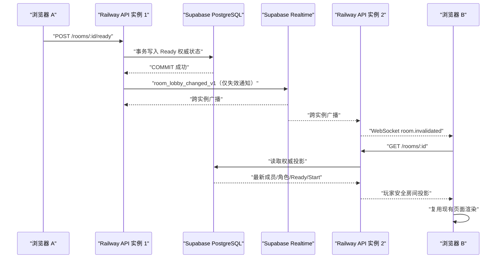

# RoomLobby 生产级 WebSocket 状态同步与 Supabase Realtime 跨实例广播

## ChatGPT Pro 完整开发任务书 v1.0

- 文档日期：2026-08-15
- 仓库：`forwardFish/aiStoryRoom`
- 本地仓库参考路径：`D:\lyh\agent\agent-frame\aiStoryRoom`
- 源码基线分支：`main`
- 源码基线提交：`30c7b061cffdfd22ad0581ce57b9784008579fc6`
- 关联需求文档：`docs/RoomLobby_临时大厅与正式StoryRun生命周期重构_ChatGPT_Pro完整开发任务书_v1.0.md`
- 目标协作者：网页版 ChatGPT Pro 普通 Chat 模式
- 文档性质：开发任务书，不是代码交付、数据库迁移授权、部署授权、生产配置授权或验收通过证明

---

## 1. 任务结论

为多人临时大厅增加生产级状态同步链：

```text
用户通过现有 HTTP API 完成大厅操作
  -> Supabase PostgreSQL 事务成功提交权威状态
  -> API 发布不含玩家隐私的“房间已变化”失效通知
  -> Supabase Realtime 把通知传播到所有 Railway API 实例
  -> 每个 API 实例仅向本机已鉴权、已订阅该房间的 WebSocket 连接转发
  -> 浏览器收到通知后重新 GET 权威房间投影
  -> 现有大厅页面用最新投影更新人数、角色、Ready 和 Start Game
```

WebSocket 只承担“状态变化通知”，不得承载或决定大厅权威状态。Supabase PostgreSQL 仍是成员、角色、Ready、启动资格和房间生命周期的唯一权威。

浏览器断线后必须自动重连；WebSocket 或 Supabase Realtime 不可用时，使用 30 秒低频轮询恢复最终一致性。现有 5 秒轮询只能在 WebSocket 尚未完成前作为临时行为，不能与生产 WebSocket 永久叠加造成无意义的数据库读取压力。

本任务不是把错误投影更快地推送给玩家。当前已经观察到“房间显示 2 名真人，但角色和 Ready 仍为 0，房主不能点击 Start Game”的现象。WebSocket 开发前必须先通过第 7 节的权威链前置验收门。

---

## 2. 用户目标与最终可见行为

### 2.1 两名真人同步

1. 用户 A 创建房间并进入现有 `/rooms/:roomId` 页面。
2. 用户 B 从 `Open Rooms` 加入同一个房间。
3. A、B 分别选择不同角色。
4. A 或 B 完成一次成功操作后，另一方无需手动刷新，并在正常网络下 2 秒内看到最新结果。
5. A、B 分别 Ready 后，双方页面均显示 `2 ready`。
6. 房主 A 的 `Start Game` 自动变为可点击。
7. 房主成功启动后，双方均从现有大厅流程进入现有 `/game`，不得创建平行游戏页。

### 2.2 必须同步的大厅变化

- 房间创建和关闭。
- 真人加入。
- 真人选择角色或换角色。
- Ready / 取消 Ready。
- 普通成员离开。
- 房主离开导致未开始大厅被删除。
- 等待期延长、过期或服务端清理。
- 大厅进入启动中、启动失败可重试、正式游戏启动成功。

### 2.3 断线和恢复

- 浏览器短暂断网或 WebSocket 被代理关闭后自动重连。
- 重连使用指数退避并带随机抖动，禁止毫秒级无限重试。
- 重连成功后立即执行一次权威 GET，不依赖错过事件的补发才能恢复。
- WebSocket 连续不可用时，30 秒轮询必须继续恢复状态。
- 页面隐藏时允许降低活动频率；页面恢复可见时必须立即重新校验连接并 GET 一次。

---

## 3. 当前代码事实（基线 `30c7b061`）

ChatGPT Pro 必须实际阅读所提供源码，并在报告中回填准确行号。若代码已经变化，立即报告基线不一致，不得根据本文臆造补丁。

### 3.1 当前前端

- `apps/web/public/platform.js`
  - `/rooms/:roomId` 初始化时调用 `hydrateSharedRoom(roomId)`。
  - 当前用 `setInterval(..., 5000)` 每 5 秒重新 GET 房间。
  - `hydrateSharedRoom` 请求 `GET /api/v4/rooms/:roomId`，再用现有房间投影重渲染页面。
  - 选角、Ready、Start、Leave 等操作仍通过 HTTP API 完成。
  - `Start Game` 是否可用来自服务端 `room.startEnabled`，前端不得自行重新裁定。
- `apps/web/public/room-role-selection-view.js`
  - 只负责已有选角/Ready/启动视图，不应成为 WebSocket 状态权威。
- `apps/web/public/platform.html`
  - 使用 ES module 加载现有页面脚本。
- `apps/web/src/server.mjs`
  - 当前只代理普通 `/api` HTTP 请求。
  - 当前没有处理 HTTP Upgrade，没有本地 WebSocket 代理。

### 3.2 当前 API

- `apps/api/src/rooms.controller.ts`
  - 已有房间 HTTP 路由。
  - 已有部分正式游戏用途的 SSE 路由，但没有临时大厅 WebSocket Gateway。
- `apps/api/src/rooms.service.ts`
  - 是现有房间应用入口，包含创建、加入、选角、Ready、Leave、Start 和投影入口。
  - Pressure 房间会继续委托给现有 Pressure Rooms Gateway；不得建立第二套大厅命令实现。
- `apps/api/src/pressure-chapter/rooms-entry/adapter.ts`
  - 适配现有 Pressure 房间 Join、Select Role、Ready、Leave、Start 和投影。
- `apps/api/src/pressure-chapter/production-prisma/lobby.prisma-adapter.ts`
  - 从 Supabase PostgreSQL 权威读写 Pressure 大厅状态。
- `apps/api/src/pressure-chapter/rooms-entry/projection.ts`
  - 由权威大厅状态生成安全的玩家投影和启动资格。

### 3.3 当前认证

- `apps/api/src/auth/auth.guard.ts`
  - HTTP 请求通过 HttpOnly `many_worlds_session` Cookie 或 Bearer Token 鉴权。
- `apps/api/src/auth/auth-cookie.ts`
  - `sessionTokenFromRequest` 可以从 Cookie Header 读取会话 Token。
- `apps/api/src/auth/auth.service.ts`
  - `verifyAccessToken` 校验签名、受众和过期时间。
- 现有认证还会读取用户、检查用户状态、邮箱验证状态和 Google Identity。
- WebSocket 握手必须复用等价认证规则，禁止只验证 Token 签名而跳过用户状态和邮箱验证。

### 3.4 当前依赖和部署

- `apps/api/package.json` 当前没有正式大厅 WebSocket 和 Supabase Realtime 客户端依赖。
- `apps/web` 是静态 ES module 页面，没有前端打包器。
- `apps/api/src/main.ts` 当前没有安装 WebSocket Adapter。
- `apps/api/src/app.module.ts` 当前没有大厅实时模块/Gateway。
- 项目已有 `SUPABASE_URL` 项目识别逻辑，但不得假设已经配置可用的 Realtime 服务端凭据。
- 本地开发常用 Web `5177`、API `3102`；生产路由和测试域名必须以部署配置为准。

---

## 4. 不可破坏边界

### 4.1 Supabase 是唯一状态权威

- WebSocket 消息、Supabase Realtime Broadcast、进程内订阅表、客户端内存和 localStorage 都不是大厅真相。
- Join、角色唯一占用、Ready、容量、过期、房主权限和 Start 资格继续由现有服务端权威链裁定。
- 浏览器收到通知后必须重新 GET 玩家安全投影。
- 页面不得根据收到的事件自行把某玩家改成 Ready，或自行打开 Start Game。

### 4.2 WebSocket 不是命令通道

第一版只允许：

```text
WebSocket: 鉴权、订阅、退订、心跳、状态失效通知
HTTP API: Create、Join、Select Role、Ready、Leave、Start 等全部业务命令
```

禁止把现有 HTTP 命令复制到 WebSocket Handler。否则会产生第二套校验、幂等和错误合同。

### 4.3 不修改正式游戏权威

- 不修改 Settlement、Pressure 正式运行、Genesis、N1 或 `/game` 三栏架构。
- 大厅启动成功后继续使用现有正式游戏进入链。
- 本任务只通知大厅投影发生变化，不负责重新设计正式游戏事件流。

### 4.4 不新增平行玩家页面

- 继续使用 `/rooms`、`/rooms/:roomId` 和 `/game`。
- 不创建 WebSocket 测试版大厅页面、替代选角页或测试专用正式入口。
- 自动测试工具可以在隔离测试边界建立客户端，但不得出现在真实导航和产品路由。

### 4.5 不泄露内部数据

WebSocket 和 Realtime 消息禁止包含：

- 邮箱、昵称、头像、角色私密信息。
- Session Token、Cookie、Supabase Key、数据库连接串。
- 完整房间投影、Pressure 原始状态、Provider 信息。
- 内部错误堆栈、SQL、证据载荷或服务端私有 Hash。

广播只携带触发重新 GET 所需的最小失效信息。

---

## 5. 目标架构



### 5.1 为什么不能只用进程内广播

Railway 可能运行多个 API 实例。A 的 HTTP 操作可能由实例 1 处理，而 B 的 WebSocket 连接在实例 2。仅在实例 1 的内存中 `emit` 会导致 B 永远收不到通知。

Supabase Realtime 是跨实例通知总线；每个 API 实例订阅同一个服务端私有广播主题，并只把与本机连接订阅匹配的 `roomId` 转发出去。

### 5.2 为什么浏览器不能直接把 Realtime 当权威

- 当前产品认证不是 Supabase Auth。
- 直接把服务端 Realtime 凭据下发浏览器会形成严重安全问题。
- 玩家能否查看某个房间仍须由现有 API 权限和投影决定。
- 因此浏览器只连接本产品 WebSocket Gateway；Supabase Realtime 只在服务端之间传播最小失效通知。

### 5.3 推荐协议

优先使用原生 WebSocket 语义，不依赖前端打包器：

- API：NestJS WebSocket Gateway + `ws` Adapter，或具有等价原生 WebSocket 行为的窄实现。
- Web：浏览器原生 `WebSocket`。
- 跨实例：Supabase Realtime Broadcast 服务端客户端。

如果 Pro 选择 Socket.IO，必须先说明其额外客户端资产、HTTP polling fallback、代理协议和 Railway 兼容性；不得在未说明的情况下引入第二种长轮询。

---

## 6. 最小消息合同

### 6.1 客户端订阅

```json
{
  "type": "room.subscribe",
  "schemaVersion": "room_lobby_socket_v1",
  "roomId": "room_xxx"
}
```

约束：

- 一个大厅页面连接默认只允许订阅一个房间。
- `roomId` 必须满足现有房间 ID 约束和长度上限。
- Gateway 必须用当前已认证用户调用现有安全投影/访问检查确认其有权进入该房间。
- 客户端提供的 `userId`、`isHost`、`roleId` 一律不可信，也不应出现在订阅请求中。

### 6.2 订阅确认

```json
{
  "type": "room.subscribed",
  "schemaVersion": "room_lobby_socket_v1",
  "roomId": "room_xxx"
}
```

订阅确认只说明通知通道可用，不说明本地页面数据已经最新。客户端仍需执行一次 GET。

### 6.3 房间失效通知

```json
{
  "type": "room.invalidated",
  "schemaVersion": "room_lobby_changed_v1",
  "eventId": "evt_random_or_uuid",
  "roomId": "room_xxx",
  "reason": "READY_CHANGED",
  "occurredAt": "2026-08-15T00:00:00.000Z"
}
```

`reason` 使用闭合集合：

- `ROOM_CREATED`
- `MEMBER_JOINED`
- `ROLE_CHANGED`
- `READY_CHANGED`
- `MEMBER_LEFT`
- `WAITING_EXTENDED`
- `ROOM_EXPIRED`
- `ROOM_CLOSED`
- `START_STATE_CHANGED`
- `GAME_STARTED`

`reason` 只用于日志、聚合和选择安全导航，不能替代权威 GET。

### 6.4 访问失效和认证失效

```json
{
  "type": "room.access_revoked",
  "schemaVersion": "room_lobby_socket_v1",
  "roomId": "room_xxx"
}
```

```json
{
  "type": "session.expired",
  "schemaVersion": "room_lobby_socket_v1"
}
```

- 房间删除、成员被移除或 GET 返回 404/403 时，页面走现有安全返回路径。
- Session 失效后必须关闭连接，并沿用现有登录流程，不得把内部认证错误码直接做成新的玩家文案。

### 6.5 大小和频率限制

- 单条客户端消息建议不超过 2 KiB。
- 非法 JSON、未知字段、未知消息类型、超长 ID 必须拒绝。
- 每连接订阅/退订和消息频率必须限制。
- 服务端 Ping/Pong 建议 20–30 秒，超时连接应释放。
- 禁止无限增长的事件去重 Set；使用有界 TTL/LRU，且它只能优化重复通知。

---

## 7. Gate 0：权威链前置验收（必须先做）

### 7.1 已知症状

已观察到：

- 页面显示两名真人已经在同一房间。
- 用户声称双方已经选角并 Ready。
- 页面投影仍显示双方 `No role selected`、`Not Ready`。
- 顶部仍为 `0 ready`。
- 房主 `Start Game` 不可点击。

### 7.2 WebSocket 不能修复该症状

如果 HTTP 写入或 GET 投影错误，WebSocket 只会更快通知浏览器重新读取同一个错误结果。因此 Pro 在添加任何实时代码前必须保存以下证据：

1. A 选择角色的 POST 返回成功。
2. 紧接着 A、B 分别 GET 同一 `roomId`，都看到 A 的同一角色占用。
3. B 选择另一角色后，A、B 的 GET 都看到两个不同真人席位。
4. A Ready 后，A、B 的 GET 都返回 `readyHumanCount = 1`。
5. B Ready 后，A、B 的 GET 都返回 `readyHumanCount = 2`。
6. 房主投影返回 `startEnabled = true`；非房主投影不能获得启动权限。
7. Supabase 权威状态与安全投影一致。

### 7.3 Gate 0 失败处理

若任一步失败：

- 立即标记 `AUTHORITY_GATE_FAIL`。
- 给出失败属于 HTTP 命令、幂等、Pressure Lobby 持久化、安全投影或用户会话中的哪一层。
- 不得用客户端状态、WebSocket Payload 或 UI 条件判断覆盖错误投影。
- 把权威链修复作为独立模块提交范围和测试，等待项目所有者批准后再修改。
- 权威链修复通过并独立验收后，才能进入本 WebSocket 模块。

---

## 8. 模块清单与依赖方向

依赖方向固定为：

```text
Rooms HTTP 应用命令
  -> Supabase 权威事务
  -> RoomLobbyChangePublisher 窄端口
  -> Supabase Realtime Bus
  -> 本机 WebSocket Gateway
  -> 浏览器 Invalidation Client
  -> GET 安全投影
  -> 现有页面渲染
```

不得反向依赖：

- Supabase Realtime Bus 不得修改房间。
- Gateway 不得调用 Join/Ready/Start 命令。
- 页面不得从通知推导权威状态。
- Persistence Adapter 不得依赖 WebSocket 类。

### 模块 A：大厅变化事件合同

```text
模块名称：RoomLobby Change Contract
用户目标：所有实例用同一最小、安全、可版本化的失效通知通信
唯一职责：定义并校验事件 Schema、Reason、ID、时间和 Room ID
明确不负责：数据库写入、发布、网络连接、页面渲染
输入及权威来源：已成功提交的房间操作结果
输出及其消费者：Realtime Bus、Gateway、测试
允许依赖：纯 TypeScript/Node 标准库
禁止依赖：Prisma、Nest Controller、浏览器 DOM
失败归属：EVENT_CONTRACT_INVALID
回滚方式：移除合同及其消费者
```

建议新增：

- `apps/api/src/room-lobby-realtime/room-lobby-change.contract.ts`
- `apps/api/src/room-lobby-realtime/room-lobby-change.contract.spec.ts`

### 模块 B：认证复用和 WebSocket Gateway

```text
模块名称：Authenticated Room Lobby WebSocket Gateway
用户目标：玩家只能订阅自己有权查看的大厅
唯一职责：握手鉴权、Origin 校验、订阅授权、心跳和本机转发
明确不负责：房间业务命令、权威投影裁定、跨实例发布
输入及权威来源：HttpOnly Session Cookie、现有用户数据、现有房间访问检查
输出及其消费者：本机浏览器连接
允许依赖：共享认证解析器、Rooms 安全访问入口、Realtime Bus 订阅端口
禁止依赖：Pressure 内部表、浏览器 localStorage、完整 Supabase 原始状态
失败归属：SOCKET_AUTH / SOCKET_SUBSCRIPTION / SOCKET_TRANSPORT
回滚方式：关闭 Gateway Feature Flag，恢复 5/30 秒 HTTP 轮询
```

必须避免复制 `AuthGuard` 的数据库校验。建议抽出可供 HTTP Guard 和 WebSocket 握手共同使用的内部认证解析服务，再让两个适配器分别设置请求上下文。

建议新增/修改：

- 新增 `apps/api/src/auth/authenticated-user-resolver.ts`
- 修改 `apps/api/src/auth/auth.guard.ts`
- 修改 `apps/api/src/auth/auth.module.ts`
- 新增 `apps/api/src/room-lobby-realtime/room-lobby-websocket.gateway.ts`
- 新增 `apps/api/src/room-lobby-realtime/room-lobby-websocket.gateway.spec.ts`
- 修改 `apps/api/src/app.module.ts`
- 修改 `apps/api/src/main.ts`

### 模块 C：Supabase Realtime 跨实例总线

```text
模块名称：Supabase Room Lobby Realtime Bus
用户目标：连接到不同 Railway 实例的玩家仍收到通知
唯一职责：发布/订阅最小失效事件、重连、健康状态和指标
明确不负责：保存房间真相、认证玩家、渲染 UI
输入及权威来源：RoomLobbyChange Contract
输出及其消费者：各 API 实例本机 Gateway
允许依赖：Supabase Realtime SDK、配置解析、Operational Metrics
禁止依赖：页面、Pressure 领域内部对象、玩家邮箱/昵称
失败归属：REALTIME_CONNECT / REALTIME_PUBLISH / REALTIME_SUBSCRIBE
回滚方式：关闭 Realtime Feature Flag，Gateway 仅保留本实例通知，客户端轮询兜底
```

推荐单一服务端私有广播主题，例如 `room-lobby-invalidation-v1`。每个实例收到所有最小事件后，只向本机订阅了对应 `roomId` 的连接转发。

建议新增/修改：

- 新增 `apps/api/src/room-lobby-realtime/supabase-room-lobby-realtime.service.ts`
- 新增对应聚焦测试
- 新增 `apps/api/src/room-lobby-realtime/room-lobby-realtime.module.ts`
- 修改 `apps/api/package.json`
- 修改根 `pnpm-lock.yaml`
- 修改部署环境变量校验和示例文件

### 模块 D：提交后发布编排

```text
模块名称：Room Lobby Change Publisher Port
用户目标：每次权威大厅操作成功后发出失效通知
唯一职责：在成功提交后发布一条最小事件
明确不负责：改变事务结果、重试业务命令、页面状态
输入及权威来源：现有 Rooms 应用命令成功结果
输出及其消费者：Supabase Realtime Bus
允许依赖：RoomLobby Change Contract、发布端口
禁止依赖：WebSocket 连接对象、DOM、Pressure Persistence 私有状态
失败归属：CHANGE_PUBLISH
回滚方式：注入 Noop Publisher 并依赖轮询
```

修改建议：

- 新增 `apps/api/src/room-lobby-realtime/room-lobby-change.publisher.ts`
- 修改 `apps/api/src/rooms.service.ts`
- 修改现有 Rooms 聚焦测试或新增发布合同测试

发布必须发生在权威操作成功之后。Realtime 发布失败不能把已经提交的 Supabase 业务事务伪装成失败并诱导客户端重复操作；应记录可观测失败，由 30 秒轮询恢复。若 Pro 要求“零丢通知”，必须另行提出事务 Outbox 方案、Migration 和扩大后的时间预算，不能暗中增加数据库表。

### 模块 E：浏览器实时客户端与现有页面适配

```text
模块名称：Room Lobby Live Invalidation Client
用户目标：无需手动刷新看到其他真人的最新大厅状态
唯一职责：连接、订阅、重连、合并通知、触发权威 GET、低频轮询兜底
明确不负责：Ready/Start 裁定、角色占用、修改大厅权威
输入及权威来源：Gateway 失效通知、GET 安全投影
输出及其消费者：现有 sharedMultiplayerRoomMarkup/页面渲染
允许依赖：浏览器 WebSocket、现有 request/hydrateSharedRoom
禁止依赖：Supabase Key、服务端内部状态、第二套 UI
失败归属：CLIENT_SOCKET / CLIENT_REFRESH / CLIENT_RENDER
回滚方式：Feature Flag 关闭后恢复已有轮询
```

建议新增/修改：

- 新增 `apps/web/public/room-lobby-live-client.js`
- 新增 `apps/web/tests/room-lobby-live-client.test.mjs`
- 修改 `apps/web/public/platform.js`
- 仅在确有必要时修改 `apps/web/public/platform.html` 的版本引用
- 不修改 CSS，不重做大厅视觉

客户端必须：

- 同一时刻最多只有一个房间刷新请求在途。
- 多条连续通知在短窗口内合并成一次 GET。
- 使用请求代次/AbortController，禁止较旧响应覆盖较新响应。
- 进入其他路径时清理 Socket、Timer 和事件监听。
- WebSocket 正常时不继续每 5 秒轮询；改为 30 秒兜底。
- WebSocket 断开、连接失败、订阅失败时保留 30 秒兜底。
- 重新可见、重新在线、重连成功时立即 GET。

### 模块 F：本地代理和部署配置

```text
模块名称：Room Lobby WebSocket Transport Configuration
用户目标：本地、测试和生产入口都能完成 WebSocket Upgrade
唯一职责：URL 推导、Upgrade 代理、Origin/CORS、Feature Flag 和环境校验
明确不负责：房间业务、页面渲染、数据库状态
输入及权威来源：现有 Web/API Origin 配置和部署环境
输出及其消费者：Gateway 与浏览器客户端
允许依赖：Node HTTP Server、部署配置脚本
禁止依赖：硬编码 localhost 作为生产地址、在页面暴露服务端 Key
失败归属：PROXY_UPGRADE / CONFIGURATION
回滚方式：关闭 Feature Flag 并回退轮询
```

建议新增/修改：

- 修改 `apps/web/src/server.mjs`，为批准路径代理 Upgrade
- 修改 `scripts/deploy/prepare-env-files.mjs`
- 修改 `deploy/env/test.railway.env.example`
- 修改 `deploy/env/production.railway.env.example`
- 修改 `scripts/deploy/railway-config.test.mjs`
- 修改 `apps/web/tests/deployment-routes.test.mjs`

---

## 9. WebSocket 鉴权与安全要求

### 9.1 握手认证

- 浏览器原生 WebSocket 不能安全地自行设置任意 Authorization Header；默认使用现有 HttpOnly Session Cookie。
- Gateway 从握手 Header 中读取 Cookie，并复用现有 Token、用户状态、邮箱验证和 Google Identity 规则。
- 缺失、过期、伪造或用户已停用的会话必须在订阅前拒绝。
- 不接受 Query String 中的 Session Token。
- 不在日志中记录 Cookie 或 Token。

### 9.2 Origin 校验

- 只允许现有 `CORS_ALLOWED_ORIGINS` 或专门的 WebSocket Origin Allowlist。
- 本地允许的 Origin 必须明确限制到开发地址。
- `Origin: null`、未知域名和 Host/Origin 不匹配默认拒绝。
- 生产不得使用 `*`。

### 9.3 房间授权

- 连接通过认证不等于可以订阅任意房间。
- 每次订阅必须调用现有玩家安全访问入口验证当前用户。
- 房间关闭、用户离开或正式游戏启动后，重新 GET/重新订阅必须按新状态处理。
- 禁止直接查询另一个模块的私有表来绕过 Rooms 权限。

### 9.4 资源限制

- 每用户、每 IP 和每实例设置合理连接上限。
- 每连接默认一个大厅订阅。
- 限制消息大小、消息频率和握手速率。
- 断开时立即删除本机订阅映射。
- 有界去重和重连状态不得成为内存泄漏源。

---

## 10. Supabase Realtime 配置要求

### 10.1 配置项

准确命名由现有配置规范决定，但至少需要表达：

- Supabase 项目 URL。
- 服务端 Realtime 发布/订阅凭据。
- 大厅实时能力开关。
- 广播 Topic/版本。
- 实例标识。
- 连接、发布和重连超时。

建议命名仅供 Pro 评估：

```text
ROOM_LOBBY_REALTIME_ENABLED
SUPABASE_URL
SUPABASE_SERVICE_ROLE_KEY
ROOM_LOBBY_REALTIME_TOPIC
ROOM_LOBBY_SOCKET_PATH
ROOM_LOBBY_SOCKET_ALLOWED_ORIGINS
```

不得把任何真实值写入源码、测试、报告、补丁、日志或交付 ZIP。测试使用明显的假值和注入式 Fake Client。

### 10.2 失效和降级

- Realtime 未配置时，本地开发可在明确降级模式下启动，但必须输出不含密钥的 readiness 状态。
- 生产启用开关但缺少配置时必须 fail closed 或 readiness fail，不能静默宣称实时可用。
- Realtime 断线时自动重连，并记录连接状态指标。
- 发布失败不得回滚已经成功的房间事务；记录失败并依靠轮询恢复。
- 禁止把 Supabase Realtime 连接数和 Prisma 数据库连接池混为一谈。

### 10.3 多实例去重

同一实例可能同时收到自己发布后经 Realtime 回传的事件。重复通知允许发生，但必须安全：

- `eventId` 全局唯一。
- Gateway 或客户端使用有界 TTL 去重。
- 即使重复 GET，也不能重复加入、重复 Ready 或重复启动，因为业务命令仍在 HTTP 幂等链。
- 去重丢失只会增加一次 GET，不应改变业务结果。

---

## 11. 本地代理和 URL 推导

### 11.1 本地

典型本地流程：

```text
浏览器 http://localhost:5177
  -> ws://localhost:5177/<approved-socket-path>
  -> apps/web/src/server.mjs Upgrade proxy
  -> ws://127.0.0.1:3102/<api-socket-path>
```

代理必须：

- 只允许准确 WebSocket 路径。
- 转发 Cookie、Origin 和必要握手 Header。
- 不把普通任意 Upgrade 请求代理到 API。
- 正确处理上游连接失败和双向关闭。
- 不影响现有 HTTP `/api` 代理。

### 11.2 测试和生产

- 从当前页面的已配置 API Base 推导 `ws:`/`wss:`，不得硬编码 `localhost:3102`。
- HTTPS 页面必须使用 `wss:`。
- 保留测试域名和生产域名隔离。
- 如果 Vercel/Web 与 Railway/API 分离，必须验证目标平台是否允许长连接、Cookie Host 和 Origin。
- 不得因为本地通过就声称生产代理通过。

---

## 12. 失败语义

| 失败 | 首要归属 | 玩家行为 | 服务端行为 |
|---|---|---|---|
| HTTP Ready 写入成功但 GET 仍为 0 | 权威写入/投影 | 保持服务端投影，不伪造 Ready | `AUTHORITY_GATE_FAIL`，停止 WebSocket 开发 |
| WebSocket 握手 401 | 认证 | 打开现有登录流程 | 不建立订阅 |
| WebSocket 订阅 403/404 | 房间访问 | 返回房间目录或现有安全路径 | 不泄露房间存在性详情 |
| Realtime 发布失败 | 跨实例通知 | 30 秒轮询最终恢复 | 事务仍成功，记录指标和日志 |
| Realtime 订阅断线 | 跨实例通知 | 已连接客户端可能暂时只靠轮询 | 自动重连，readiness 降级 |
| WebSocket 断线 | 客户端传输 | 自动重连并继续低频轮询 | 清理本机订阅 |
| 连续事件风暴 | 客户端刷新 | 合并为有限 GET | 限流、去重、记录指标 |
| 房间已删除 | 生命周期 | 返回 `/rooms` 并使用已有提示 | 关闭该房间订阅 |
| 游戏已开始 | 生命周期 | GET 后进入现有 `/game` | 不再把 Lobby 当权威 |

---

## 13. 可观测性和 SLO

### 13.1 必须新增指标

复用现有 `operationalMetrics` 风格，至少提供：

- `room_lobby_socket_connections` Gauge。
- `room_lobby_socket_auth_reject_total` Counter，按安全错误类别聚合。
- `room_lobby_socket_subscriptions` Gauge。
- `room_lobby_realtime_connected` Gauge。
- `room_lobby_realtime_publish_total` Counter。
- `room_lobby_realtime_publish_failure_total` Counter。
- `room_lobby_socket_invalidations_sent_total` Counter。
- `room_lobby_client_refresh` 无法由服务端直接统计时，可通过测试证据而不是增加追踪用户的遥测。

标签必须低基数，禁止使用 `roomId`、`userId`、邮箱或 Event ID 作为 Prometheus Label。

### 13.2 目标 SLO

- 正常网络下，从权威事务提交到另一玩家页面完成最新 GET 渲染：p95 ≤ 2 秒。
- 跨两个 API 实例的通知丢失率：正式压测中为 0；任何丢失必须能在 35 秒内被兜底轮询恢复。
- 100 次连续 Join/Role/Ready 变化不得产生重复业务写入。
- WebSocket/Realtime 故障不得导致 Prisma `P2024` 增加。
- 运行 30 分钟后连接数、订阅数和内存不持续无界增长。

---

## 14. 测试要求

### 14.1 合同与单元测试

- 事件合同接受全部合法 `reason`，拒绝未知字段、超长字段、无效时间和危险载荷。
- 握手接受有效 Cookie，拒绝缺失/过期/伪造/未验证邮箱/停用用户。
- Origin Allowlist 正常和拒绝路径。
- 未加入/无权用户不能订阅房间。
- 同一连接重复订阅幂等。
- 断开后订阅映射被清理。
- Supabase Realtime Fake 验证跨实例发布和订阅。
- 发布失败不把已提交 HTTP 命令变成业务失败。
- 有界去重不会无限增长。

### 14.2 前端测试

- 初次进入房间：连接、订阅、立即 GET。
- 收到一条失效通知：只触发权威 GET，不直接改 DOM 业务字段。
- 短时间多条通知：合并请求。
- 较旧 GET 后返回：不能覆盖更新投影。
- WebSocket 正常：不再每 5 秒请求。
- WebSocket 失败：30 秒兜底仍运行。
- 重新在线/可见/重连成功：立即 GET。
- 离开房间路由：Socket 和 Timer 全部释放。
- `startEnabled` 只取服务端投影。

### 14.3 本地代理测试

- 正确路径 Upgrade 成功。
- 非批准路径 Upgrade 被拒绝。
- Cookie 和 Origin 被转发。
- API 不可用时连接快速失败且无进程崩溃。
- 普通 HTTP API 回归通过。

### 14.4 两实例集成测试

必须用同一测试 Supabase、两个独立 API 进程：

```text
API-1: 3102
API-2: 3103
Web/Proxy-1: 5177 -> API-1
Web/Proxy-2: 5178 -> API-2
```

验证：

1. A 连接 Proxy-1/API-1。
2. B 连接 Proxy-2/API-2。
3. A 操作经 API-1 写入。
4. Supabase Realtime 把事件送到 API-2。
5. B 的 WebSocket 收到失效通知并经 API-2 GET 最新状态。
6. 反向由 B 操作、A 接收同样成立。

禁止把两个客户端都连到同一 API 实例后声称跨实例通过。

### 14.5 两真实账号浏览器验收

使用两个隔离浏览器会话和两个已验证测试账号，不得共享 Cookie：

1. A 创建大厅。
2. B 在 `Open Rooms` 看到并 Join。
3. A/B 都看到 `2 / 6 players`。
4. A 选角，B 在 2 秒内看到。
5. B 选角，A 在 2 秒内看到。
6. A Ready，双方为 `1 ready`。
7. B Ready，双方为 `2 ready`。
8. A 的 Start Game 自动可用；B 不获得房主启动权。
9. A Start 后双方进入同一个正式游戏。
10. 强制断开 B 的 Socket，验证 30 秒兜底；恢复网络后验证立即重连和刷新。

证据必须包含：

- 两端页面截图或视频。
- Network 中 WebSocket 握手、订阅和失效消息。
- 两端相同 Room ID；不得公开 Session/Cookie。
- 两实例日志中的同一安全 Event ID 和不同 Instance ID。
- Supabase 权威投影只作辅助证据，不能替代真实页面。

---

## 15. 推荐测试命令

Pro 应根据实际新增测试文件补充精确命令，至少执行：

```bash
pnpm --filter @apps/api typecheck
pnpm --filter @apps/web typecheck
pnpm --filter @apps/api test
pnpm --filter @apps/web test
pnpm test:deploy-config
pnpm build:api
```

新增聚焦测试必须提供可独立运行命令。真实 Supabase、两个 API 实例和两个浏览器账号的验收不能用 Fake 或单元测试冒充。

未运行的测试必须明确写 `TESTS_NOT_RUN`；失败测试不能省略或用“与本改动无关”直接跳过，必须给出证据和归属。

---

## 16. 实施顺序与模块门

严格一次只实现一个可独立验收模块：

1. Gate 0：权威角色/Ready/Start 投影闭环。
2. 模块 A：事件合同。
3. 模块 B：共享认证解析和单实例 Gateway。
4. 模块 C：Supabase Realtime 跨实例 Bus。
5. 模块 D：HTTP 成功提交后的发布端口。
6. 模块 F：本地 Upgrade 代理和部署配置。
7. 模块 E：前端连接、重连、GET 和 30 秒兜底。
8. 两实例测试。
9. 两真实账号浏览器验收。

每个模块必须：

- 开始前给出模块卡和准确文件。
- 通过聚焦测试后才能进入下一模块。
- 不得在同一提交混入未验收的后续模块。
- 玩家可见文件修改前必须获得项目所有者明确批准。
- 出现公共合同、数据库、路由或三个以上既有模块之外的新范围时停止并重新说明。

---

## 17. 预计改动文件

这是基于 `30c7b061` 的候选清单。Pro 必须阅读源码后输出最终准确 Manifest，不得为了匹配清单而创建无用文件。

### 17.1 预计新增生产文件

- `apps/api/src/auth/authenticated-user-resolver.ts`
- `apps/api/src/room-lobby-realtime/room-lobby-change.contract.ts`
- `apps/api/src/room-lobby-realtime/room-lobby-change.publisher.ts`
- `apps/api/src/room-lobby-realtime/supabase-room-lobby-realtime.service.ts`
- `apps/api/src/room-lobby-realtime/room-lobby-websocket.gateway.ts`
- `apps/api/src/room-lobby-realtime/room-lobby-realtime.module.ts`
- `apps/web/public/room-lobby-live-client.js`

### 17.2 预计修改生产文件

- `apps/api/src/auth/auth.guard.ts`
- `apps/api/src/auth/auth.module.ts`
- `apps/api/src/rooms.service.ts`
- `apps/api/src/app.module.ts`
- `apps/api/src/main.ts`
- `apps/api/package.json`
- `apps/web/public/platform.js`
- `apps/web/src/server.mjs`
- `scripts/deploy/prepare-env-files.mjs`
- `deploy/env/test.railway.env.example`
- `deploy/env/production.railway.env.example`
- `pnpm-lock.yaml`

### 17.3 预计测试文件

- 各新增 API 模块同目录聚焦 `*.spec.ts`
- `apps/web/tests/room-lobby-live-client.test.mjs`
- `apps/web/tests/deployment-routes.test.mjs`
- `scripts/deploy/railway-config.test.mjs`
- 可新增隔离的两实例验收脚本，但不得新增产品页面

### 17.4 明确禁止修改

- `docs/主游戏最终版/` 下权威视觉和规范。
- `/game` 正式页面布局、图片和 CSS。
- Story Package、角色内容、剧情文本。
- Settlement、Narrative、Genesis、N1 领域规则。
- Prisma Schema/Migration，除非项目所有者另行批准事务 Outbox 方案。
- 真实 `.env`、API Key、Token、Cookie、账号或密码。

---

## 18. 时间和工作量预算

在 Gate 0 已通过、无需另修权威链的前提下：

| 工作 | 预计用时 |
|---|---:|
| WebSocket 服务端、鉴权、订阅 | 3–4 小时 |
| Supabase Realtime 跨实例广播 | 3–5 小时 |
| 前端连接、重连、权威 GET、30 秒兜底 | 2–3 小时 |
| 本地 Upgrade 代理和生产配置 | 1–2 小时 |
| 自动测试、两个实例和两个真实账号联调 | 3–5 小时 |
| 合计 | 12–19 小时，约 2 个工作日；稳妥验收预留到 3 天 |

不包含：

- 当前角色/Ready/Start 权威链若失败后的修复时间。
- 新增事务 Outbox 和数据库 Migration。
- Railway/Vercel/Supabase 控制台人工配置等待。
- 生产部署观察期。
- 正式 UI 重设计。

若 Gate 0 失败或必须增加事务 Outbox，Pro 必须重新估时，不得继续沿用 12–19 小时承诺。

---

## 19. ChatGPT Pro 必须交付

### 19.1 开发前

1. 基线 SHA 和工作树状态。
2. Gate 0 实证结果。
3. 最终模块卡。
4. 最终准确文件清单。
5. Supabase Realtime 服务端架构和密钥边界。
6. WebSocket 路径、Origin、Cookie 和代理合同。
7. 不修改范围。

### 19.2 代码工件

- 可机械应用的 Git Patch。
- Changed-files ZIP，只包含实际新增/修改文件。
- `manifest.json`，记录每个文件相对路径、用途、字节数和 SHA-256。
- 测试报告。
- 配置变量清单，只含变量名、用途和是否必需，不含真实值。
- 回滚说明。

### 19.3 报告必须区分

- `IMPLEMENTED`：源码中已实现。
- `UNIT_VERIFIED`：单元/合同测试通过。
- `LOCAL_E2E_VERIFIED`：本地真实进程通过。
- `CROSS_INSTANCE_VERIFIED`：两个 API 实例通过。
- `REAL_SUPABASE_VERIFIED`：真实测试 Supabase Realtime 通过。
- `TWO_USER_BROWSER_VERIFIED`：两个真实账号浏览器通过。
- `DEPLOYED`：只有实际部署并回读后才能使用。
- `TESTS_NOT_RUN`：任何未执行测试。

不得把前四项中的任一项写成整体生产验收通过。

---

## 20. 禁止操作与禁止声称

- 不得读取、复制、输出或提交真实密钥、Cookie、密码和 Token。
- 不得直接修改生产 Supabase 数据。
- 未获授权不得运行 Migration、修改 Supabase 控制台、Railway 或 Vercel 配置。
- 未获授权不得提交、推送、创建 PR、合并 `main`、修改 `release` 或部署。
- 不得用单实例测试声称跨实例通过。
- 不得用 Fake Supabase 声称真实 Realtime 通过。
- 不得用 WebSocket 消息中的前端状态声称 Supabase 权威正确。
- 不得用 HTTP 200、代码编译或 Pro 自述替代两个真实玩家页面验收。
- 不得为了实时效果绕过服务端 `startEnabled`、角色唯一性或 Ready 权威。
- 不得把现有 5 秒轮询和 WebSocket 永久并行作为“完成”；最终应是 WebSocket 主通知 + 30 秒容灾轮询。

---

## 21. 验收判定

### 21.1 PASS

全部满足才可判定：

- Gate 0 权威链通过。
- WebSocket 鉴权和房间授权通过。
- Supabase Realtime 跨两个 API 实例传递通知。
- 客户端收到通知后重新 GET，而不是使用消息作为状态权威。
- 两真实账号在正常网络下 2 秒内互相看到角色和 Ready。
- 两人 Ready 后房主 Start Game 自动可用，非房主不能启动。
- WebSocket 断线自动恢复；禁用实时链后 30 秒兜底有效。
- 无隐私、凭据或内部状态泄露。
- 无无界连接、订阅、Timer 或去重缓存泄漏。
- 全部聚焦测试、类型检查和生产构建通过。
- 玩家现有页面和 `/game` 未被重新设计或替换。

### 21.2 FAIL

任一情况即 FAIL：

- Ready 写入/GET 权威仍不一致。
- 同实例通过但跨实例不通过。
- WebSocket Payload 被页面当作 Ready/Start 权威。
- 未授权用户能订阅或推断房间。
- 连接失败后页面永久不更新。
- Start Game 仍需手动刷新或仍错误禁用。
- 实时链导致重复业务操作、P2024 增长或连接泄漏。
- 使用真实密钥进入源码/日志/工件。
- 只提供方案、伪代码或测试自述，没有真实代码工件。

---

## 22. 回滚方案

回滚必须不影响 Supabase 权威大厅数据：

1. 关闭 `ROOM_LOBBY_REALTIME_ENABLED`。
2. 前端 Feature Flag 回到 HTTP 轮询。
3. 移除/停用 Gateway 和 Realtime Bus，不改变 Rooms HTTP 命令。
4. 本地代理停止处理批准的 Upgrade 路径。
5. 保留 30 秒或临时恢复 5 秒轮询，作为回滚后的可用性保障。
6. 验证 Create、Join、Role、Ready、Leave、Start 的 HTTP 行为与回滚前一致。

因为 v1 不要求数据库 Migration，回滚不应涉及删除或恢复真实业务数据。如果 Pro 提议 Outbox/Migration，必须提供独立数据库回滚和数据保留方案。

---

## 23. 可直接发送给 ChatGPT Pro 的任务提示

```text
请基于附件源码和以下任务书，开发 RoomLobby 生产级 WebSocket 状态同步：

权威文档：
docs/RoomLobby_生产级WebSocket状态同步与Supabase_Realtime跨实例广播_ChatGPT_Pro完整开发任务书_v1.0.md

源码基线：
main @ 30c7b061cffdfd22ad0581ce57b9784008579fc6

第一步不是写 WebSocket。请先执行文档 Gate 0，证明两个真实玩家的选角和 Ready 经 HTTP 写入后，双方 GET 同一 roomId 都返回一致的角色、readyHumanCount=2，并且房主 startEnabled=true。若失败，请停止并提交 AUTHORITY_GATE_FAIL 报告，不得用前端或 WebSocket 覆盖错误状态。

Gate 0 通过后，严格按模块 A-F 一次只实现和验收一个模块。WebSocket 只发送最小失效通知；全部业务命令继续走 HTTP；浏览器收到通知后重新 GET Supabase 权威投影。使用 Supabase Realtime 实现 Railway 多 API 实例之间的通知传播。WebSocket 断线自动重连，保留 30 秒低频轮询兜底。

必须复用现有认证和房间访问规则，不得在 Query String 传 Token，不得向浏览器暴露 Supabase 服务端 Key。不得创建第二套房间命令、第二权威、平行玩家页面或修改正式 /game 架构。

请交付：Git Patch、changed-files ZIP、manifest.json、模块报告、测试报告、环境变量名称清单和回滚方案。真实密钥不得进入任何工件。未运行的测试明确标记 TESTS_NOT_RUN。不得提交、推送、部署、迁移或修改真实 Supabase 数据。

最终报告必须分别标注 IMPLEMENTED、UNIT_VERIFIED、LOCAL_E2E_VERIFIED、CROSS_INSTANCE_VERIFIED、REAL_SUPABASE_VERIFIED、TWO_USER_BROWSER_VERIFIED 和 DEPLOYED；不可把自述或单实例测试写成生产验收通过。
```
