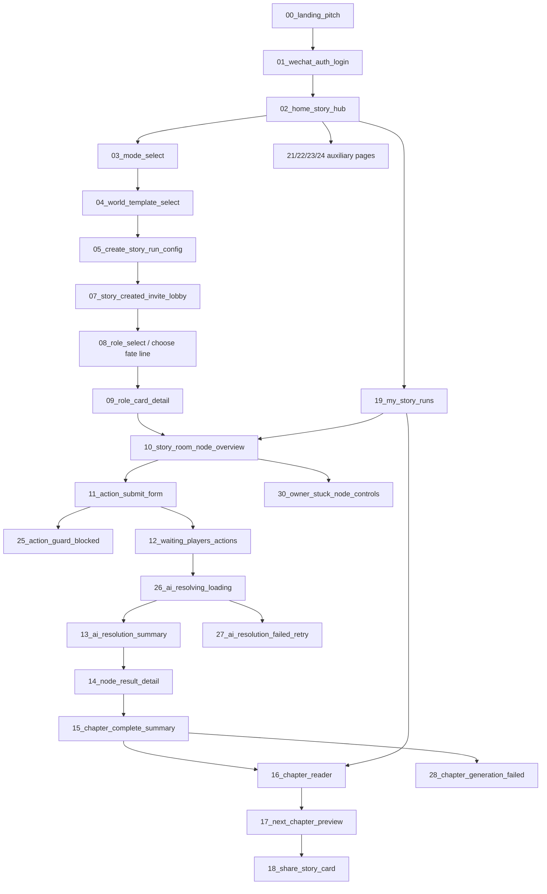

# UI Flow Index - AI 多人故事局 UI/2

> Based on `docs/AI多人故事局_PRD_阶段化工程完整增强版_v5.md`.
>
> PRD main loop: create story run -> choose world template -> generate chapter sandbox and roles -> choose fate line -> submit player action -> ActionGuard/audit -> AI director resolves -> update clues/relationships/danger -> generate multi-POV chapter -> personal story card -> share or continue.
>
> Note: these images are UI/acceptance assets, not proof that product code has been implemented.

## MVP P0 Foreground Main Flow

1. `00_landing_pitch.png` - 产品落地入口：一起玩出一章小说。
2. `01_wechat_auth_login.png` - 微信授权登录 mock。
3. `02_home_story_hub.png` - 首页/故事局中心：继续故事、推荐模板、我的入口。
4. `03_mode_select.png` - 选择模式：创建故事局、加入朋友故事、单人试玩。
5. `04_world_template_select.png` - 选择世界模板。
6. `05_create_story_run_config.png` - 创建故事局配置：局名、人数、可见范围、房主参与等。
7. `06_join_story_hall.png` - 加入朋友/故事大厅分支。
8. `07_story_created_invite_lobby.png` - 故事局创建完成：邀请码、已加入角色、邀请好友。
9. `08_role_select.png` - 角色选择页；当前图可覆盖选择角色流程，但 PRD v5 更强调“选择你的命运线”，后续实现应强化 `personalHook` / `destinyQuestion`。
10. `09_role_card_detail.png` - 角色卡：公开信息、个人目标、隐藏秘密、关系；命运线字段由 `21_my_role_profile.png` 进一步补强。
11. `10_story_room_node_overview.png` - 故事局房间：当前剧情、目标、线索、玩家状态；“我的影响/私密线索”由 `21`、`30` 补强。
12. `11_action_submit_form.png` - 提交角色行动。
13. `12_waiting_players_actions.png` - 等待其他玩家行动/房主推进剧情。
14. `13_ai_resolution_summary.png` - AI 导演结算概览。
15. `14_node_result_detail.png` - 本轮详细结果：直接后果、三个回响、跨角色影响、线索、状态变化。
16. `15_chapter_complete_summary.png` - 章节完成总结。
17. `16_chapter_reader.png` - 多 POV 章节正文阅读。
18. `17_next_chapter_preview.png` - 下一章预告。
19. `18_share_story_card.png` - 分享故事卡。
20. `19_my_story_runs.png` - 我的故事局/复访入口。

## Mini Program Auxiliary Pages

- `21_my_role_profile.png` - 我的角色/我的命运线：突出 `personalHook`、`destinyQuestion`、`privateClues`、未解问题、我的影响。
- `22_my_chapters.png` - 我的章节：章节列表、多 POV 标签、个人故事卡入口、阅读/分享/继续。
- `23_notifications.png` - 通知：行动提醒、AI 结算完成、新私密线索、跨角色影响、审核消息。
- `24_report_feedback.png` - 举报与反馈：内容安全分类、故事上下文、补充说明、提交反馈。

## Exception / Acceptance / Compliance States

- `25_action_guard_blocked.png` - ActionGuard 拦截失败：越权、宣布结果、操控他人、跳过剧情的修改提示。
- `26_ai_resolving_loading.png` - AI 结算生成中：整理行动、计算三个回响、更新线索关系、生成下一节点。
- `27_ai_resolution_failed_retry.png` - AI 结算失败重试：失败原因、retry、房主兜底、AI 任务日志 trace。
- `28_chapter_generation_failed.png` - 章节生成失败：节点结果保留、章节未发布、重新生成。
- `29_content_audit_failed.png` - 内容审核失败：敏感内容提示、修改建议、重提交流程、auditId。
- `30_owner_stuck_node_controls.png` - 节点卡住/房主推进：玩家状态、提醒、AI 托管、强制推进确认。

## Backend / Admin / Ops Coverage

These are backend/admin coverage assets, not player P0 mini-program flow screens.

- `31_admin_dashboard.png` - Dashboard：活跃故事局、待处理 AI、审核异常、事件量、快捷入口。
- `32_admin_story_run_detail.png` - 故事局详情：状态、章节节点、玩家角色、危险等级、世界状态、管理动作。
- `33_admin_action_logs.png` - 玩家行动与用户行为日志：ActionGuard/audit 状态、风险、埋点、traceId。
- `34_admin_ai_task_audit_logs.png` - AI 任务日志与审核日志：任务类型、retry、latency、审核结果、失败原因。
- `35_admin_template_metrics.png` - 模板数据看板：开局转化、章节完成、分享率、审核失败率、Top hooks。

## Non-P0 / Commercial Placeholder

- `20_unlock_next_chapter.png` - 商业化/解锁占位图。PRD v5 section 32 明确“暂不实现付费系统”，因此该图不纳入 MVP P0 主流程，也不作为 P0 验收图。若后续进入商业化阶段，应重新评审付费、合规和支付链路。

## Flow Diagram

## Coverage Matrix

| PRD 功能点 | 已覆盖图片 | 是否满足 | 缺口 | 新增图片 |
|---|---|---:|---|---|
| 微信登录 mock | `01_wechat_auth_login.png` | 满足 | 无 | - |
| 首页：开一局故事、单人试玩、加入朋友故事 | `00_landing_pitch.png`, `02_home_story_hub.png`, `03_mode_select.png` | 满足 | README 已更新到 PRD v5 | - |
| 世界模板/创建 StoryRun/加入等待 | `04_world_template_select.png`, `05_create_story_run_config.png`, `06_join_story_hall.png`, `07_story_created_invite_lobby.png`, `12_waiting_players_actions.png` | 满足 | 无 | - |
| 角色选择页：选择命运线 | `08_role_select.png` | 部分满足 | 当前标题仍偏“选择角色”，后续实现应改为“选择你的命运线”并强化命运钩子/命运问题 | `21_my_role_profile.png` 补强命运线表达 |
| 角色卡页：公开身份、个人目标、命运问题、隐藏秘密 | `09_role_card_detail.png` | 部分满足 | `personalHook`、`destinyQuestion`、`privateClues` 需要更高层级 | `21_my_role_profile.png` |
| 故事局房间页：当前剧情、目标、私密线索、公开线索、我的影响、玩家状态、房主推进 | `10_story_room_node_overview.png`, `12_waiting_players_actions.png` | 部分满足 | “我的影响”与节点卡住/房主控制缺失 | `21_my_role_profile.png`, `30_owner_stuck_node_controls.png` |
| 行动提交页 | `11_action_submit_form.png` | 满足 | ActionGuard 失败态缺失 | `25_action_guard_blocked.png` |
| ActionGuard：拦截越权、宣布结果、操控他人、跳过剧情 | - | 满足 | 原 00-20 未覆盖 | `25_action_guard_blocked.png` |
| AI 导演结算：行动结果、三个回响、跨角色影响、线索、关系、危险等级 | `13_ai_resolution_summary.png`, `14_node_result_detail.png` | 基本满足 | 生成中/失败重试缺失 | `26_ai_resolving_loading.png`, `27_ai_resolution_failed_retry.png` |
| 下一节点生成与节点异常 | `14_node_result_detail.png`, `17_next_chapter_preview.png` | 基本满足 | 节点卡住/房主推进缺失 | `30_owner_stuck_node_controls.png` |
| 多 POV 章节生成、个人故事卡、分享卡 | `15_chapter_complete_summary.png`, `16_chapter_reader.png`, `18_share_story_card.png` | 基本满足 | 章节生成失败缺失 | `28_chapter_generation_failed.png` |
| 我的故事局 / 我的章节 | `19_my_story_runs.png` | 基本满足 | 我的章节独立页缺失 | `22_my_chapters.png` |
| 我的角色页 | - | 满足 | 原 00-20 未覆盖 | `21_my_role_profile.png` |
| 通知页 | - | 满足 | 原 00-20 未覆盖 | `23_notifications.png` |
| 举报反馈页 | - | 满足 | 原 00-20 未覆盖 | `24_report_feedback.png` |
| 内容安全审核 mock / 审核失败 | - | 满足 | 原 00-20 未覆盖 | `29_content_audit_failed.png` |
| 后台基础查看：Dashboard、故事局列表/详情、玩家行动、AI任务、审核日志、用户行为日志、模板数据看板 | - | 满足为 UI 覆盖资产 | 原 00-20 未覆盖；真实后台实现仍需开发 | `31_admin_dashboard.png`, `32_admin_story_run_detail.png`, `33_admin_action_logs.png`, `34_admin_ai_task_audit_logs.png`, `35_admin_template_metrics.png` |
| 核心事件埋点可观测 | - | 满足为 UI 覆盖资产 | 原 00-20 未覆盖 | `33_admin_action_logs.png`, `34_admin_ai_task_audit_logs.png` |
| PRD 32：暂不实现付费系统 | `20_unlock_next_chapter.png` | 已处理 | 该图有真实付费倾向，不作为 P0 验收 | README 标为 Non-P0 / Commercial Placeholder |

## MVP Still Not Recommended For Main Flow

- `20_unlock_next_chapter.png`：保留为商业化占位或未来商业化评审材料，不进入 MVP P0 主流程。
- 31-35 后台管理页：属于运营/审核/观测补充，不是玩家端主流程。
- 支线/番外/付费升级：若出现于图中，只作为非 P0 占位，不应阻塞 MVP P0 验收。

## Development Priority If Implementation Starts

1. P0 玩家闭环：首页/创建/加入/模板/大厅 -> 命运线选择 -> 角色卡 -> 房间 -> 行动提交 -> AI 结算 -> 章节阅读/分享。
2. 命运线数据显性化：`personalHook`、`destinyQuestion`、`privateClues`、我的影响。
3. Guard 与审核可靠性：ActionGuard 拦截、内容审核失败、AI/章节生成失败重试。
4. 我的内容与通知：我的角色、我的章节、通知、举报反馈。
5. 后台可观测：Dashboard、故事局详情、行动/用户日志、AI/审核日志、模板指标。
6. 付费/解锁继续保持在 MVP P0 外。
