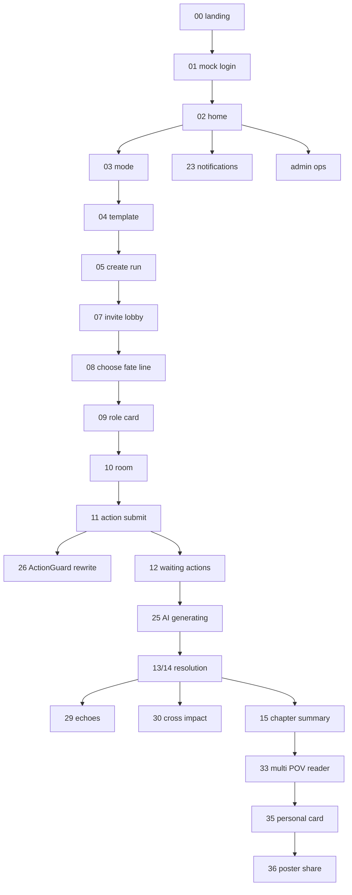

# UI Flow Index - AI ????? UI/2

> Based on `docs/AI?????_PRD_??????????_v5.md` and final P0 acceptance source `docs/03-mvp-p0-acceptance-criteria.md`.
>
> These images are UI/acceptance assets. The current implementation maps them to mini-program routes, preview API contracts, and admin observability endpoints; they are not pixel-perfect screenshot proof.
>
> Important: this README intentionally references the newest UI filenames currently present in `docs/UI/2`. Old UI filenames were not restored. `20_unlock_next_chapter.png` remains a non-P0 commercial placeholder only.

## Latest UI image inventory

### MVP P0 foreground main flow

- `00_landing_pitch.png`
- `01_wechat_auth_login.png`
- `02_home_story_hub.png`
- `03_mode_select.png`
- `04_world_template_select.png`
- `05_create_story_run_config.png`
- `06_join_story_hall.png`
- `07_story_created_invite_lobby.png`
- `08_role_select.png`
- `09_role_card_detail.png`
- `10_story_room_node_overview.png`
- `11_action_submit_form.png`
- `12_waiting_players_actions.png`
- `13_ai_resolution_summary.png`
- `14_node_result_detail.png`
- `15_chapter_complete_summary.png`
- `16_chapter_reader.png`
- `17_next_chapter_preview.png`
- `18_share_story_card.png`
- `19_my_story_runs.png`

### Non-P0 commercial placeholder

- `20_unlock_next_chapter.png` - ???/??????MVP P0 ?????????????????????????

### Mini program auxiliary pages

- `21_my_fate_line.png`
- `22_my_chapters.png`
- `23_notification_center.png`
- `24_report_feedback.png`

### Exception / intelligence / chapter support states

- `25_ai_generating_status.png`
- `26_actionguard_rewrite.png`
- `27_private_clue_detail.png`
- `28_fate_net_lite.png`
- `29_three_echoes_summary.png`
- `30_cross_role_influence_detail.png`
- `31_action_information_strategy.png`
- `32_ai_error_or_fallback.png`
- `33_chapter_reader_multi_pov.png`
- `34_chapter_catalog_timeline.png`
- `35_personal_story_card_detail.png`
- `36_personal_role_poster_share.png`
- `37_world_status_overview.png`
- `38_character_relationship_overview.png`
- `39_plot_timeline.png`
- `40_suspicious_information_panel.png`

### Backend / admin / ops coverage

- `admin_01_dashboard.png`
- `admin_02_story_runs.png`
- `admin_03_ai_logs.png`
- `admin_04_content_audit.png`

## Implementation route mapping

| UI asset | Implemented route / API | P0 role |
|---|---|---|
| `21_my_fate_line.png` | `/pages/insight/index?kind=fate-line` | ???????????????????? |
| `22_my_chapters.png` | `/pages/insight/index?kind=chapters` | ????????????/???? |
| `23_notification_center.png` | `/pages/insight/index?kind=notifications`, `GET /api/notifications` | ???? |
| `24_report_feedback.png` | `/pages/insight/index?kind=report`, `POST /api/feedback/report` | ?????mock audit ?? |
| `25_ai_generating_status.png` | `/pages/insight/index?kind=generating` | AI ????? |
| `26_actionguard_rewrite.png` | `/pages/insight/index?kind=actionguard`, `GET /api/admin/action-guard` | ActionGuard ???? |
| `27_private_clue_detail.png` | `/pages/insight/index?kind=private-clue` | ?????? |
| `28_fate_net_lite.png` | `/pages/insight/index?kind=fate-net` | ??? Lite ???? |
| `29_three_echoes_summary.png` | `/pages/insight/index?kind=echoes` | ?????? |
| `30_cross_role_influence_detail.png` | `/pages/insight/index?kind=impacts` | ??????? |
| `31_action_information_strategy.png` | `/pages/insight/index?kind=strategy` | ?????? |
| `32_ai_error_or_fallback.png` | `/pages/insight/index?kind=ai-error` | AI ??/?? |
| `33_chapter_reader_multi_pov.png` | `/pages/insight/index?kind=multi-pov` | ? POV ???? |
| `34_chapter_catalog_timeline.png` | `/pages/insight/index?kind=catalog` | ????/??? |
| `35_personal_story_card_detail.png` | `/pages/insight/index?kind=story-card` | ??????? |
| `36_personal_role_poster_share.png` | `/pages/insight/index?kind=poster` | ???????? |
| `37_world_status_overview.png` | `/pages/insight/index?kind=world` | ???? |
| `38_character_relationship_overview.png` | `/pages/insight/index?kind=relationships` | ???? |
| `39_plot_timeline.png` | `/pages/insight/index?kind=timeline` | ????? |
| `40_suspicious_information_panel.png` | `/pages/insight/index?kind=suspicious` | ?????? |
| `admin_01_dashboard.png` | `/pages/admin/index`, `GET /api/admin/dashboard` | Admin dashboard |
| `admin_02_story_runs.png` | `/pages/admin/index`, `GET /api/admin/story-runs`, `GET /api/admin/story-runs/:runId` | ?????/?? |
| `admin_03_ai_logs.png` | `/pages/admin/index`, `GET /api/admin/ai-tasks`, `GET /api/admin/event-logs` | AI ?? / EventLog |
| `admin_04_content_audit.png` | `/pages/admin/index`, `GET /api/admin/audit-logs`, `GET /api/admin/action-guard` | ???? / ActionGuard |

## Coverage matrix

| PRD / acceptance point | UI evidence | Code/API evidence | Status |
|---|---|---|---|
| P0 ???????????????/??????????????????????? | `00`-`19` | mini program core pages, preview API, story E2E | covered |
| ????personalHook?destinyQuestion?privateClues????? | `21_my_fate_line.png`, `27_private_clue_detail.png` | `enrichFateLine`, `/story-runs/:runId/insights`, insight page | covered |
| ActionGuard??????????????????????????? | `26_actionguard_rewrite.png`, `31_action_information_strategy.png` | `/nodes/:nodeId/actions`, `/admin/action-guard`, E2E blocked action | covered |
| AI ?????????????????????????? | `25`, `29`, `30`, `32` | `resolveNode`, `buildEchoes`, `buildCrossImpacts`, insight page | covered |
| ? POV ??????????? | `33`, `34`, `35`, `36` | `generateChapter`, `enrichChapter`, chapter/share pages | covered |
| ?????????????????? | `37`, `38`, `39`, `40` | `/story-runs/:runId/insights`, room/insight pages | covered |
| ????? | `23`, `24` | `/notifications`, `/feedback/report` | covered with mock provider |
| ??????? | `admin_01`-`admin_04` | `/admin/dashboard`, `/admin/story-runs`, `/admin/ai-tasks`, `/admin/audit-logs`, `/admin/event-logs`, `/admin/action-guard` | covered |
| ???????? | `20_unlock_next_chapter.png` | docs only | intentionally non-P0 |

## Flow diagram

## Notes on backup / old assets

- New files listed above are authoritative for this UI/2 pass.
- Existing `docs/UI/2/backup/` is retained for old asset preservation if needed.
- Do not restore old names such as `21_my_role_profile.png`, `23_notifications.png`, `25_action_guard_blocked.png`, `31_admin_dashboard.png`; the implementation now references the newest filenames.
