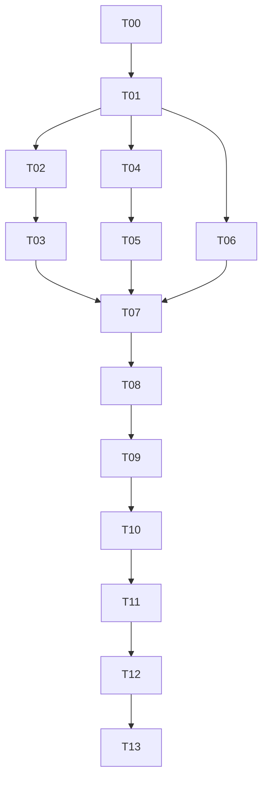

# Many Worlds v1.4 P0 Closeout Auto-Execute Master Plan

本计划规定任务依赖、断点续跑、失败回修和最终验收顺序，执行时不得跳过前置门禁。

## 1. Objective

Close payment, invite/reward/poster, canonical navigation and multi-user gameplay as one real-user flow. Finish with three isolated core players completing seven rounds and three fresh invitees proving reward, duplicate and cap behavior.

## 2. Default execution mode

`same-session-serial` on Windows/Codex App. Reuse current repository and preserve dirty user files. Parallel work is permitted only for read-only discovery or mutually exclusive files; browser E2E remains serial because it owns shared runtime state.

## 3. Task graph

| Task | Outcome | Gate |
|---|---|---|
| T00 | orchestration and RunId | none |
| T01 | live baseline, UI/asset/route map | source paths readable |
| T02 | payment context, checkout, status and idempotency contracts | T01 PASS |
| T03 | PAY-01—07 UI and return-to-room | T02 PASS; PAY-03 source is confirmed |
| T04 | combined room+ref join and reward contracts | T01 PASS |
| T05 | invite modal, channels and dynamic poster | T04 PASS |
| T06 | homepage links, canonical routes, rewrites | T01 PASS |
| T07 | integration/contract tests | T02—T06 PASS |
| T08 | one-to-one visual comparison | all references present; otherwise BLOCKED |
| T09 | bounded visual repair loop | T08 has material diffs |
| T10 | real browser A/B/C/D/E/F E2E | T07 PASS, T08/09 PASS |
| T11 | independent API/DB readback | T10 browser trace exists |
| T12 | report, secret and real-payment guard | T10/T11 PASS |
| T13 | final aggregate gate | all prior gates terminal |

## 4. Persistence and handoff

Every task writes `docs/auto-execute/results/Txx.json` and `docs/auto-execute/latest/Txx-HANDOFF.md` only when that task is actually executed. A `BLOCKED` or `REPAIR_REQUIRED` result must contain the exact failed gate, observed evidence and next task. Do not fabricate PASS to advance the graph.

## 5. Stop rules

- Stop before a real payment or production mutation.
- UI-PAY-03 is currently present; if any required reference is later absent or corrupt, stop only the affected visual gate and continue safe non-visual tasks.
- Stop final PASS if any route is 404, any dead link remains, login loses returnTo, paid does not return to the room, invite does not auto-join, or A/B/C do not reach 21 accepted actions and 7 unique resolutions.
- Webhook, unlock and referral duplicates must be proven by database readback, not inferred from UI text.
