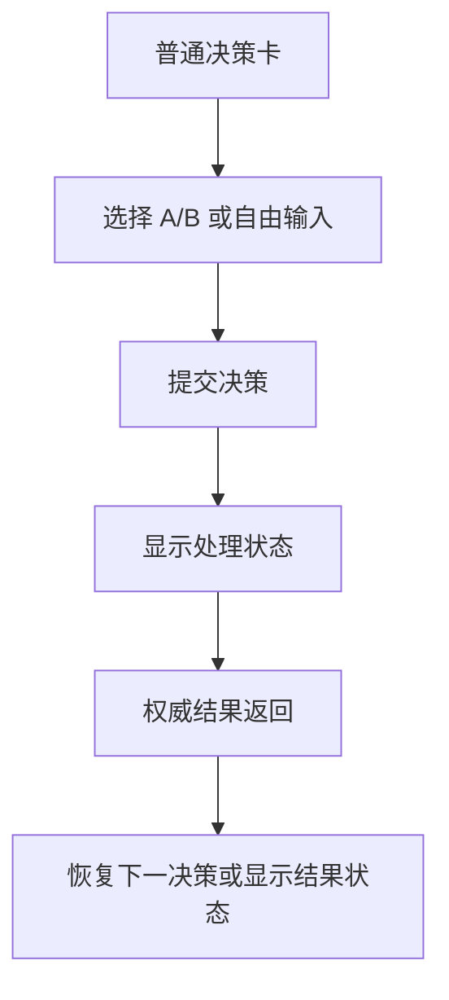
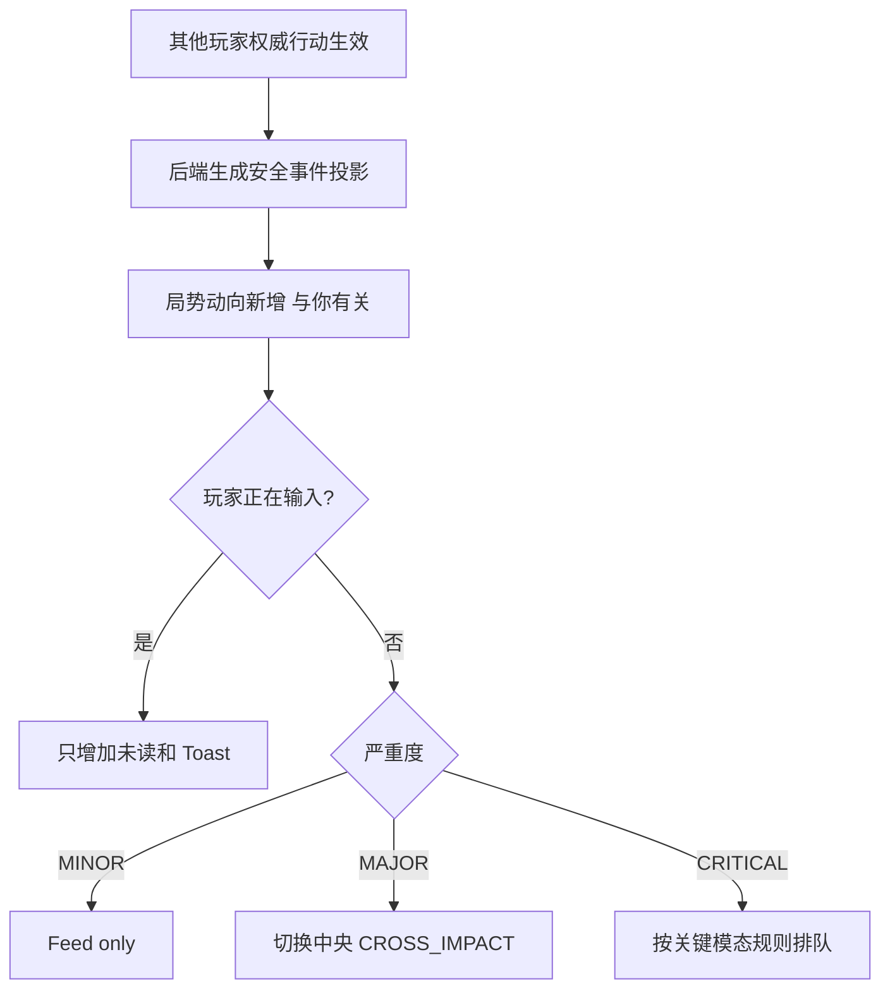
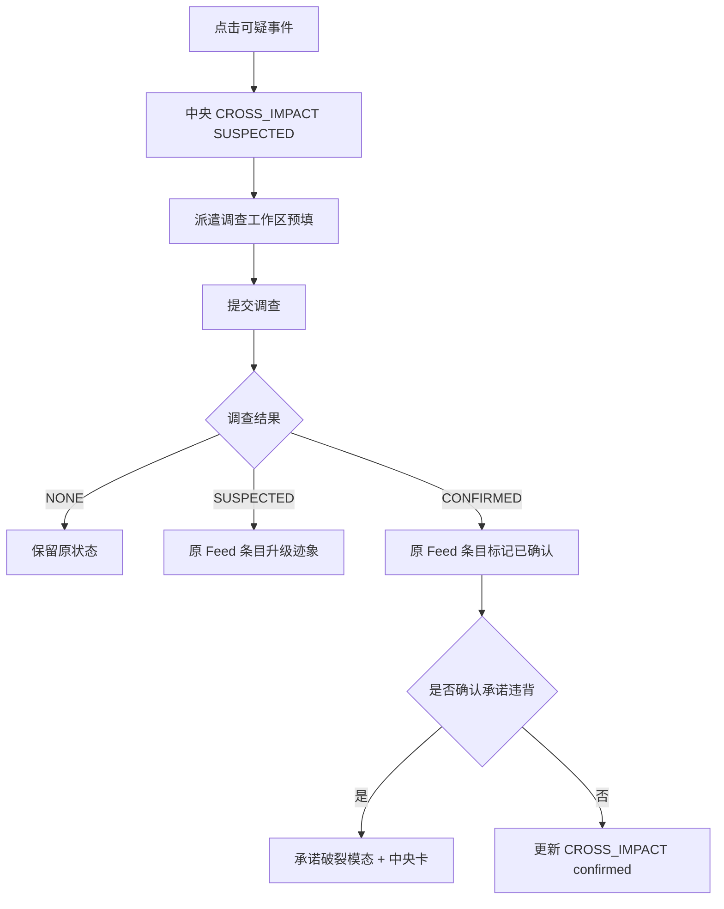
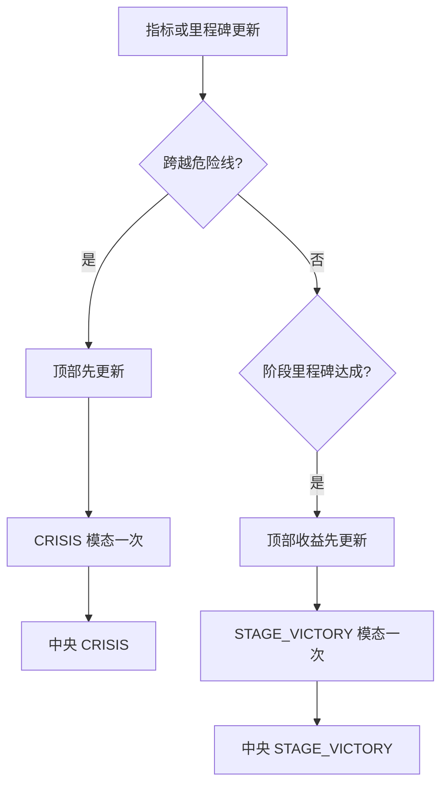

# Our Many Worlds：A-Emotion 多人互动 MVP 主游戏页面最终冻结规范、PRD 与前端实现 vFinal

> 文档状态：**最终冻结版 / 可直接交给 Codex 开发**  
> 适用产品：Our Many Worlds / 《桑田诏》多人 MVP  
> 适用路由：现有真实 `/game` 主游戏页面  
> 版本关系：本文件替代此前《主游戏页面最终 UI 结构、PRD 与线框说明 v1.0》中的冲突或过时内容。  
> 上位实现文档：`Our_Many_Worlds_A-Emotion多人互动MVP_最终上线实施_后端流程测试验收_vFinal.md`  
> 核心冻结原则：**保留现有三栏页面；不新增页面类型；中央只保留 5 类状态卡；右侧“局势动向”升级为经过权限过滤、聚合和排序的实时滚动事件流；关键状态只通过统一头部颜色区分。**

---

## 目录

1. [最终产品与页面决策](#1-最终产品与页面决策)
2. [视觉基准图与使用方式](#2-视觉基准图与使用方式)
3. [页面信息架构与冻结命名](#3-页面信息架构与冻结命名)
4. [全局布局与视觉规范](#4-全局布局与视觉规范)
5. [顶部导航与世界指标](#5-顶部导航与世界指标)
6. [左栏：目标、资源与筹码](#6-左栏目标资源与筹码)
7. [中央主舞台与统一状态卡](#7-中央主舞台与统一状态卡)
8. [关键弹窗：内容、触发与恢复](#8-关键弹窗内容触发与恢复)
9. [右栏“局势动向”实时事件流](#9-右栏局势动向实时事件流)
10. [四个现有工作区](#10-四个现有工作区)
11. [完整页面交互流程](#11-完整页面交互流程)
12. [前端组件与状态模型](#12-前端组件与状态模型)
13. [前端数据获取、轻实时与容错](#13-前端数据获取轻实时与容错)
14. [后端接口依赖与安全边界](#14-后端接口依赖与安全边界)
15. [埋点、产品指标与可访问性](#15-埋点产品指标与可访问性)
16. [前端开发顺序](#16-前端开发顺序)
17. [自动化测试与视觉验收](#17-自动化测试与视觉验收)
18. [最终 Definition of Done](#18-最终-definition-of-done)
19. [附录 A：固定文案模板](#附录-a固定文案模板)
20. [附录 B：建议 TypeScript 合同](#附录-b建议-typescript-合同)
21. [附录 C：测试 ID 与 Codex 交接清单](#附录-c测试-id-与-codex-交接清单)

---

# 1. 最终产品与页面决策

## 1.1 一句话结论

本次页面不再继续扩展功能，而是把已经确定的 A-Emotion MVP 收敛成一个稳定页面系统：

> **1 个真实 `/game` 主页面 + 5 类中央状态卡 + 1 个可滚动实时局势流 + 4 个既有工作区。**

页面必须持续回答：

```text
我的目标是什么？
我最可能因为什么失败？
别人刚刚怎样改变了我的处境？
这条信息是公开、与我有关，还是可疑？
我现在应该调查、质问、使用筹码、谋划，还是暂不回应？
```

## 1.2 页面只保留这些能力

### 主页面

- 顶部导航；
- 五项世界指标；
- 左栏目标、资源、筹码；
- 中央主舞台；
- 右栏今日谋划、四个操作入口、局势动向、当前工作区。

### 中央 5 类状态

1. `DECISION`：普通决策；
2. `CROSS_IMPACT`：他人行动影响了你，包含未知、可疑、已确认三种来源等级；
3. `PROMISE_BROKEN`：承诺破裂；
4. `CRISIS`：濒临失败；
5. `STAGE_VICTORY`：阶段胜利。

### 关键弹窗

只允许：

- 承诺破裂；
- 濒临失败；
- 阶段胜利。

### 右侧事件流

只允许三类展示标签：

- `【与你有关】`
- `【公开】`
- `【可疑】`

## 1.3 本次明确不做

```text
不新增第五个操作按钮；
不新增独立消息中心；
不新增平行多人主页面；
不新增关系图、命运网或复杂地图；
不公开其他玩家原始秘密决策；
不把所有事件都弹窗；
不把右侧做成自动横向跑马灯；
不让新动态打断正在输入的内容；
不新增同步回合、准备、锁定或多人窗口 UI；
不把正文大面积染成红、绿或橙色；
不为每种状态单独开发完全不同的卡片结构；
不依靠 AI 决定谁能看见什么。
```

## 1.4 页面成功标准

首次玩家在不读说明文档的情况下，应能在 30 秒内指出：

- 自己的主目标；
- 当前失败压力；
- 右侧最新一条与自己有关的动向；
- 当前信息的可信程度；
- 应该点击哪个现有入口回应。

---

# 2. 视觉基准图与使用方式

以下六张图片是本文件的视觉基准。Codex 开发时应以图片确定布局、层级和风格，以本文件确定字段、触发、状态和业务规则。

## 2.1 默认决策态


用途：

- 三栏主页面基准；
- 左栏最终命名与信息密度；
- 中央普通决策卡；
- 右栏默认 3 条局势动向；
- 派遣调查工作区。

## 2.2 局势动向展开态


用途：

- 右栏固定高度、内部滚动；
- 6 条可见事件；
- 未读、新事件、标签、时间；
- “查看全部动态”展开逻辑。

## 2.3 他人影响态


用途：

- `CROSS_IMPACT` 中央卡；
- 顶部指标与中央影响同步；
- 两个信息块；
- 两按钮加一文字入口。

## 2.4 承诺破裂态


用途：

- `PROMISE_BROKEN` 头部橙红；
- “结果 / 你获得”两个信息块；
- “立即反击 / 暂时隐瞒 / 稍后处理”。

## 2.5 濒临失败态


用途：

- `CRISIS` 头部橙红；
- 顶部皇帝信任必须同步为 18；
- “危险来源 / 你可以”两个信息块；
- “立刻应对 / 稍后处理 / 查看详情”。

## 2.6 阶段胜利态


用途：

- `STAGE_VICTORY` 头部绿色；
- 顶部改革进度同步；
- “收益 / 对手受限”两个信息块；
- “继续推进 / 稍后查看 / 先保持低调”。

## 2.7 图片与文档冲突时的优先级

1. 业务触发、权限、内容字段：以本文为准；
2. 页面布局、视觉层级、信息密度：以图片为准；
3. 图片中的偶发错字、名称漂移或数值：以本文冻结命名和字段为准；
4. 代码实现必须复用仓库现有 `/game`，不得用静态 HTML 仿图替代。

---

# 3. 页面信息架构与冻结命名

## 3.1 页面信息架构

```text
/game
├─ GlobalHeader
│  ├─ Brand
│  ├─ ChapterAndChoice
│  └─ GlobalActions
├─ WorldMetricBar
│  ├─ Treasury
│  ├─ PublicSentiment
│  ├─ GrainPrice
│  ├─ ReformProgress
│  └─ EmperorTrust + DangerHint
└─ GameShell
   ├─ LeftStatusSidebar
   │  ├─ CurrentObjectiveCard
   │  ├─ ResourceCard
   │  └─ TokenCard
   ├─ CenterStage
   │  └─ UnifiedStateCard
   │     ├─ DecisionContent
   │     ├─ CrossImpactContent
   │     ├─ PromiseBrokenContent
   │     ├─ CrisisContent
   │     └─ StageVictoryContent
   └─ RightActionHub
      ├─ ManeuverQuotaCard
      ├─ ActionEntryGrid
      ├─ SituationFeed
      └─ WorkbenchPanel
```

## 3.2 冻结命名

### 左栏

- 当前目标
- 主目标
- 当前风险
- 当前判断
- 我的资源
- 我的筹码

### 四个操作入口

- 人物交流
- 派遣调查
- 使用筹码
- 自拟谋划

### 右栏事件模块

- 局势动向

### 中央状态

- 普通决策
- 他人影响
- 承诺破裂
- 濒临失败
- 阶段胜利

禁止再出现：

```text
人物交谈 / 人脉交流
策谋调度 / 策略调度
当前动能 / 当前功绩 / 当前功能
深思调查 / 渠道调查 / 流言调查
密报谋划 / 部属谋划
```

> 现有仓库若使用旧字段名，内部字段可暂时兼容；用户可见文案必须统一。

---

# 4. 全局布局与视觉规范

## 4.1 桌面布局

```css
.game-shell {
  display: grid;
  grid-template-columns:
    clamp(280px, 19vw, 340px)
    minmax(620px, 1fr)
    clamp(360px, 23vw, 440px);
  gap: 16px;
  min-height: 680px;
  height: calc(
    100vh
    - var(--global-header-height)
    - var(--world-metric-bar-height)
  );
}
```

优先复用现有布局变量，不要求机械覆盖现有 CSS。

## 4.2 滚动边界

- 浏览器主体尽量不整体滚动；
- 左栏、右栏可独立滚动；
- `SituationFeed` 必须内部滚动；
- 中央卡内容过长时只滚动中央舞台；
- 关键弹窗出现时锁定背景滚动；
- 新事件不能改变用户当前输入焦点；
- 新事件不能强制把右栏滚动到顶部。

## 4.3 色彩冻结

### 基础色

- 白；
- 浅灰；
- 淡紫；
- 深蓝灰正文。

### 品牌紫

用于：

- 主按钮；
- 选中态；
- 普通决策；
- 他人影响头部；
- “与你有关”标签。

### 橙红

只用于：

- 承诺破裂头部；
- 濒临失败头部；
- 顶部危险指标；
- 小型风险图标。

### 绿色

只用于：

- 阶段胜利头部；
- 收益数字；
- 成功图标。

### 正文规则

- 正文区域统一白底；
- 信息块统一浅边框；
- 不使用整块红底、绿底；
- 不用颜色表达善恶，只表达信息类型和严重度。

## 4.4 统一卡片外观

- 最大宽度：680—760 px；
- 圆角：20—24 px；
- 卡片阴影：轻；
- 内边距：24—32 px；
- 信息块间距：12—16 px；
- 主按钮高度：52—58 px；
- 次按钮高度：44—52 px；
- 卡片切换：150—250ms；
- 不允许每种状态使用完全不同的尺寸与排版。

---

# 5. 顶部导航与世界指标

## 5.1 导航内容

```text
Our Many Worlds
第 1 章
本角色第 X 次抉择
历史回顾
再来一局
返回主页
```

不新增消息中心图标。

## 5.2 世界指标

固定五项：

```text
国库银两
民心
粮价
改桑进度
皇帝信任
```

## 5.3 皇帝信任状态

### 正常

```text
皇帝信任 43
距离失去主持权还有 23
```

### 数值变化

```text
皇帝信任 37 ↓6
因账册异常，信任近期有所下降
```

显示 2—4 秒后回归稳定文本。

### 危险

```text
皇帝信任 18
再出现一次公开治理失败，将失去改革主持权
```

## 5.4 一致性不变量

- 中央卡写“皇帝信任下降 6”，顶部必须同时显示 37 或 43→37；
- `CRISIS` 中央卡写 18，顶部不得仍显示 43；
- `STAGE_VICTORY` 写改革进度 +12，顶部必须显示新的 12%；
- 页面刷新后不得重新播放已确认过的变化动画；
- 未确认来源只显示“账册异常”“外部行动”等安全原因；
- 已确认后才允许显示公开角色名称。

---

# 6. 左栏：目标、资源与筹码

## 6.1 当前目标

固定三行：

```text
主目标
获取原始粮册，保全治桑主导权

当前风险
御史已关注改桑进度，可能弹劾

当前判断
巡抚与县令都接触过账册
```

规则：

- 每行一句；
- 每句尽量不超过 20 个汉字；
- 当前判断必须遵守当前角色知识边界；
- 不把“可疑”写成“已确认”；
- 次要目标隐藏在现有历史或详情中，不在此并列。

## 6.2 我的资源

固定：

- 银两；
- 粮草；
- 兵丁；
- 幕僚；
- 密报。

主界面只显示名称和数值；用途放 Tooltip。

## 6.3 我的筹码

每项：

```text
筹码名称
一句最短用途
```

状态：

- 可用；
- 选中；
- 已使用；
- 不可用；
- 未验证。

## 6.4 左栏变化规则

- 资源变化可短暂显示前值→后值；
- 不自动展开说明；
- 不因右侧新事件改变左栏滚动位置；
- 当前风险变为危险时，仅图标和短文本加强，不整卡变红。

---

# 7. 中央主舞台与统一状态卡

## 7.1 中央卡统一骨架

除普通决策外，其余四类状态卡统一为：

```text
┌──────────────────────────────────┐
│ [类型图标] 标题                  │
│ 一句摘要                         │
├──────────────────────────────────┤
│ 信息块 A                         │
│ 1—2 条关键信息                   │
├──────────────────────────────────┤
│ 信息块 B                         │
│ 1—2 条关键信息                   │
├──────────────────────────────────┤
│ [主按钮] [次按钮]                │
│        低优先级文字入口           │
└──────────────────────────────────┘
```

## 7.2 统一 CTA 规则

- 一个主按钮；
- 一个次按钮；
- 一个文字入口；
- 不能出现三个同权重按钮；
- 文字入口不得消耗谋划次数，除非进入并提交后续行动；
- 点击主或次按钮只切换到既有工作区并预填上下文，不新建新页面。

## 7.3 `DECISION` 普通决策

### 内容

```text
你要如何应对？

你的选择会立即改变局势，并可能影响其他角色。

A：由总督府定复核清单……
B：先由县令按总督列出的项目初核……

你也可以写下自己的决定
[输入框]

[提交决策]
```

### 展示

- 默认进入游戏时显示；
- 处理完其他中央卡后恢复；
- 玩家正在编辑时，新普通事件不得替换此卡；
- 重大事件可排队，见第 8 章。

## 7.4 `CROSS_IMPACT` 他人影响

### 头部

- 类型色：紫；
- 标题：他人的行动影响了你的处境；
- 摘要：送达总督府的粮册出现异常，部分页面可能被替换。

### 信息块 A：影响

```text
改革进度暂时停滞
皇帝信任下降 6
```

### 信息块 B：你知道

```text
来源尚未确认
巡抚与县令都接触过账册
```

### CTA

- 主：派遣调查；
- 次：公开质问；
- 文字：暂不回应。

### 来源等级

- `HIDDEN`：来源尚未确认；
- `SUSPECTED`：迹象指向巡抚衙门；
- `CONFIRMED`：调查确认巡抚要求县令只提交副本。

同一卡片更新，不增加新的“揭晓卡”类型。

## 7.5 `PROMISE_BROKEN` 承诺破裂

### 头部

- 类型色：橙红；
- 标题：承诺破裂；
- 摘要：巡抚没有兑现承诺，县令只交出了转抄副本。

### 信息块 A：结果

```text
改革进度受阻
皇帝信任风险上升
```

### 信息块 B：你获得

```text
巡抚手令抄录
一次公开质问机会
```

### CTA

- 主：立即反击；
- 次：暂时隐瞒；
- 文字：稍后处理。

## 7.6 `CRISIS` 濒临失败

### 头部

- 类型色：橙红；
- 标题：你正在失去主持权；
- 摘要：皇帝信任已降至 18，再出现一次公开治理失败，你将失去改革主持权。

### 信息块 A：危险来源

```text
账册异常被朝廷注意
巡抚提交的副本仍有疑点
```

### 信息块 B：你可以

```text
使用筹码稳定信任
立即派遣调查
```

### CTA

- 主：立刻应对；
- 次：稍后处理；
- 文字：查看详情。

## 7.7 `STAGE_VICTORY` 阶段胜利

### 头部

- 类型色：绿；
- 标题：你夺回了主动权；
- 摘要：原始粮册已经落入你手中，巡抚暂时无法继续控制奏报口径。

### 信息块 A：收益

```text
改革进度 +12
你获得新的质问主动权
```

### 信息块 B：对手受限

```text
巡抚难以继续控制口径
县令开始动摇
```

### CTA

- 主：继续推进；
- 次：稍后查看；
- 文字：先保持低调。

## 7.8 中央卡切换优先级

```text
CRISIS
  > PROMISE_BROKEN
  > STAGE_VICTORY
  > CROSS_IMPACT
  > DECISION
```

同一时间只显示一张。

## 7.9 返回普通决策

- “暂不回应”“稍后处理”“稍后查看”“先保持低调”均回到此前决策卡；
- 事件仍保留在局势动向和历史回顾；
- 已输入文本不得丢失；
- 后续重新打开事件时恢复其最新状态。

---

# 8. 关键弹窗：内容、触发与恢复

## 8.1 展示分级

| 级别 | 展示 | 是否阻断 |
|---|---|---|
| 轻微 | 局势动向；可选 Toast | 否 |
| 重要 | 局势动向 + 中央卡 | 否 |
| 关键 | 一次性关键模态 + 中央卡持久化 | 是，短时 |

`CROSS_IMPACT` 默认不弹模态。

## 8.2 关键模态统一骨架

```text
头部：图标 + 标题 + 一句摘要
正文：信息块 A + 信息块 B
底部：主按钮 + 次按钮 + 文字入口
```

正文保持白底，只有头部区分颜色。

## 8.3 承诺破裂模态触发

仅当全部成立：

```text
存在正式 Promise
Promise 已被实际违背
当前查看者是承诺接收者或合法观察者
违背事实已经由调查、公开证据或权威事件确认
Promise 从 BROKEN 进入 REVEALED
该 viewer 尚未展示过该 triggerVersion 的模态
```

不满足时：

- 只记录后台状态；
- 不提前提示“承诺破裂”；
- 可先显示可疑动向。

关闭后：

- 中央保留 `PROMISE_BROKEN`；
- 局势动向更新为“已确认”；
- “稍后处理”不消耗谋划次数。

## 8.4 濒临失败模态触发

仅当监控指标跨越危险阈值：

```text
previousValue >= dangerThreshold
currentValue < dangerThreshold
```

示例：

```text
previousValue = 23
currentValue = 18
dangerThreshold = 20
```

规则：

- 同一危险区间只弹一次；
- 在危险区内从 18 降到 16 不重复弹；
- 离开危险区后再次进入，可按世界规则生成新的 `triggerVersion`；
- 不因页面刷新重复弹；
- 顶部数值必须先更新，再显示模态。

关闭后中央保留 `CRISIS`。

## 8.5 阶段胜利模态触发

仅当阶段里程碑从未达成变为达成：

```text
milestone.status: INACTIVE -> ACHIEVED
```

例如：

- 当前角色首次控制原始粮册；
- 改革进度达到阶段阈值；
- 解锁公开核对原册；
- 对手失去奏报口径控制。

同一 `milestoneId + stateVersion + viewerRoleId` 只弹一次。

关闭后中央保留 `STAGE_VICTORY`。

## 8.6 模态队列

优先级：

```text
CRISIS = 300
PROMISE_BROKEN = 200
STAGE_VICTORY = 100
```

规则：

- 一次只显示一个；
- 其他进入队列；
- 正在提交行动时，等待提交完成再展示；
- 正在输入时，先持久保存前端草稿，再展示；
- 关闭第一个后，延迟 200ms 展示下一个；
- 不允许多个遮罩叠加；
- 页面恢复后只补显未展示、仍有效的模态。

---

# 9. 右栏“局势动向”实时事件流

## 9.1 产品定义

`SituationFeed` 不是其他玩家原始行动日志，而是：

> **当前玩家有资格感知、并且可能改变其判断或下一步行动的世界变化流。**

## 9.2 事件分类

### `RELATED` → `【与你有关】`

- 直接改变当前玩家状态、风险、目标、资源或选项；
- 标签色：紫。

### `PUBLIC` → `【公开】`

- 所有相关角色都能知道；
- 标签色：蓝灰。

### `SUSPICIOUS` → `【可疑】`

- 可观察痕迹，尚未确认完整来源；
- 标签色：琥珀。

`REVEAL` 不增加第四类标签；它更新原事件的 `statusLabel` 为“已确认”。

## 9.3 默认紧凑态

- 位于四个操作入口与工作区之间；
- 固定高度建议：220—280 px；
- 默认显示最近 3 条；
- 超过 3 条出现内部垂直滚动条；
- 标题显示未读数量：`局势动向 · 3`；
- 右上角：`展开 >`；
- 底部：`查看全部动态 >`。

## 9.4 展开态

- 不打开新页面；
- 占用右栏工作区的主要高度；
- 建议高度：420—520 px；
- 可见 6 条；
- 首次加载最多 10 条；
- 当前工作区暂时折叠，但四个操作入口仍可见；
- 右上角：`收起 >`；
- 关闭后恢复此前工作区与输入草稿。

## 9.5 每条事件字段

```text
标签
标题
安全状态摘要
时间
未读标记
```

示例：

```text
【与你有关】原始粮册的递送出现异常
来源未知 · 刚刚

【公开】巡抚正式承诺提交原册
尚未验证 · 10 分钟前

【可疑】有人正在接触你的幕僚
迹象指向巡抚衙门 · 1 小时前
```

## 9.6 排序

1. 未处理的关键 `RELATED` 事件置顶；
2. 其余按 `eventSequence DESC`；
3. 同一聚合事件只占一条；
4. 旧事件升级为已确认时在原位置更新，并短暂高亮；
5. 不以客户端本地时间决定权威顺序。

## 9.7 新事件到达

### 用户位于列表顶部

- 新事件插入顶部；
- 行背景高亮 3 秒；
- 未读数增加；
- 可显示小型“新”标记。

### 用户已向下滚动

- 不跳动；
- 顶部出现粘性提示：`3 条新动态`；
- 点击后滚到顶部；
- 原阅读位置保持。

### 用户正在输入

- 不改变焦点；
- 不替换中央卡；
- 只增加未读与轻量 Toast；
- `CRITICAL` 关键模态按第 8 章排队。

## 9.8 点击行为

### `RELATED`

- 打开对应 `CROSS_IMPACT`；
- 若已确认为承诺破裂，打开 `PROMISE_BROKEN`；
- 预填最自然回应工作区。

### `SUSPICIOUS`

- 打开 `CROSS_IMPACT`，来源等级为 `SUSPECTED`；
- 默认主按钮为派遣调查；
- 右栏调查工作区预填对象、迹象和目标。

### `PUBLIC`

- 在事件行内展开安全详情；
- 若公开行动直接影响当前玩家，则事件应归为 `RELATED`；
- 纯公共背景不强制替换中央决策卡。

### 已处理事件

- 打开只读详情；
- 不再显示可重复提交的回应；
- 可跳转历史回顾。

## 9.9 已读、已查看与已处理

```text
unread：尚未进入视口或打开
seen：在视口停留至少 1 秒
acknowledged：点击打开或选择“暂不回应”
resolved：完成与该事件绑定的回应，或事件已失效
```

未读数只统计 `seenAt == null`。

## 9.10 聚合

聚合键：

```text
roomId
+ runId
+ viewerRoleId
+ stageId
+ sharedObjectId
+ eventFamily
```

例如：

```text
联系县令
要求转抄
延迟递送
```

对总督只显示：

```text
【与你有关】原始粮册的递送出现异常
多项迹象表明，账册流转过程被改变。
```

## 9.11 轻实时更新

优先级：

1. 复用现有 SSE / WebSocket；
2. 若无，使用 7 秒轮询；
3. 玩家提交行动后立即刷新；
4. 页面重新聚焦时立即刷新；
5. 网络恢复时基于游标补拉。

不得只依赖浏览器本地生成假动态。

---

# 10. 四个现有工作区

## 10.1 人物交流

字段：

- 交流对象；
- 交流类型：普通交流 / 正式承诺；
- 预设承诺；
- 输入内容；
- 提交。

从事件进入时预填：

- 对象；
- 事件摘要；
- 可选质问模板。

## 10.2 派遣调查

字段：

- 调查对象；
- 已知迹象；
- 调查方向；
- 本次意图；
- 补充要求；
- 提交。

调查结果：

- `NONE`
- `SUSPECTED`
- `CONFIRMED`

## 10.3 使用筹码

字段：

- 可用筹码；
- 作用对象；
- 预期用途；
- 可能消耗；
- 提交。

从事件进入时：

- 相关筹码置顶；
- 无效筹码置灰并说明；
- 不新增筹码库存。

## 10.4 自拟谋划

字段：

- 针对对象；
- 当前已知；
- 自由输入；
- 风险提示；
- 提交。

底层只映射：

```text
HELP
BLOCK
INVESTIGATE
EXPOSE
HIDE
```

## 10.5 工作区草稿

每个工作区按：

```text
runId + roleId + workbenchType + contextEventId
```

保存内存草稿。页面刷新是否保留，按现有产品策略；但中央卡切换和局势流展开不得丢失。

---

# 11. 完整页面交互流程

## 11.1 普通决策



## 11.2 他人影响



## 11.3 调查与来源升级



## 11.4 危险与阶段胜利



---

# 12. 前端组件与状态模型

## 12.1 组件树

```text
GamePageShell
├─ GlobalHeader
├─ WorldMetricBar
├─ LeftStatusSidebar
│  ├─ CurrentObjectiveCard
│  ├─ ResourceCard
│  └─ TokenCard
├─ CenterStage
│  ├─ UnifiedStateCard
│  └─ KeyModalHost
└─ RightActionHub
   ├─ ManeuverQuotaCard
   ├─ ActionEntryGrid
   ├─ SituationFeed
   │  └─ SituationFeedItem
   └─ WorkbenchPanel
      ├─ TalkWorkbench
      ├─ InvestigateWorkbench
      ├─ TokenWorkbench
      └─ PlanWorkbench
```

## 12.2 统一状态卡实现

推荐一个基础组件，而非复制五套 CSS：

```tsx
<UnifiedStateCard
  type={card.type}
  accent={card.accent}
  icon={card.icon}
  title={card.title}
  summary={card.summary}
  blockA={card.blockA}
  blockB={card.blockB}
  primaryAction={card.primaryAction}
  secondaryAction={card.secondaryAction}
  tertiaryAction={card.tertiaryAction}
/>
```

`DECISION` 可使用同一外框、专用内容插槽。

## 12.3 页面状态

```ts
interface GamePageUiState {
  activeCard: CenterCardViewModel;
  previousDecisionCard: DecisionCardViewModel | null;

  activeWorkbench: WorkbenchType;
  workbenchContext: WorkbenchContext | null;
  workbenchDrafts: Record<string, WorkbenchDraft>;

  situationFeedMode: "COMPACT" | "EXPANDED";
  situationFeedScrollTop: number;
  pendingNewFeedCount: number;

  modalQueue: KeyModalViewModel[];
  activeModal: KeyModalViewModel | null;

  isSubmittingAction: boolean;
  isTextComposing: boolean;
}
```

## 12.4 状态切换建议

使用 reducer / finite state transition，不散落在多个组件中：

```ts
type GameUiAction =
  | { type: "OPEN_FEED_ITEM"; item: SituationFeedItemView }
  | { type: "CLOSE_CENTER_EVENT" }
  | { type: "OPEN_WORKBENCH"; workbench: WorkbenchType; context?: WorkbenchContext }
  | { type: "FEED_ITEMS_RECEIVED"; payload: FeedDelta }
  | { type: "MODAL_ENQUEUED"; modal: KeyModalViewModel }
  | { type: "MODAL_CLOSED"; modalId: string }
  | { type: "METRICS_UPDATED"; metrics: WorldMetricView[] }
  | { type: "ACTION_SUBMIT_STARTED" }
  | { type: "ACTION_SUBMIT_FINISHED" };
```

## 12.5 不允许的前端实现

- 不从原始后台事件自行推断可见性；
- 不把 `sourceRoleId` 收到后再通过 CSS 隐藏；
- 不用事件文案字符串匹配决定卡片类型；
- 不因 Feed 更新重建整个 `/game` 页面；
- 不用 React key 错误导致输入框重挂载；
- 不将模态“已展示”只存在内存中；
- 不用前端时间决定事件顺序和阈值。

---

# 13. 前端数据获取、轻实时与容错

## 13.1 `useSituationFeed`

```ts
interface UseSituationFeedOptions {
  roomId: string;
  runId: string;
  viewerRoleId: string;
  pollIntervalMs?: number;
}

interface UseSituationFeedResult {
  items: SituationFeedItemView[];
  unreadCount: number;
  cursor: string | null;
  status: "IDLE" | "LOADING" | "LIVE" | "DEGRADED" | "ERROR";
  refresh(): Promise<void>;
  markSeen(eventIds: string[]): Promise<void>;
  acknowledge(eventId: string): Promise<void>;
}
```

## 13.2 获取策略

- 初次进入：获取最近 10 条安全投影；
- 默认展示前 3；
- SSE 有效时订阅 viewer 频道；
- SSE 断开后回退 7 秒轮询；
- 每次 action submit 成功后立即刷新；
- `visibilitychange` 回到前台时刷新；
- 使用 `cursor/eventSequence` 增量拉取；
- 重复事件按 `eventId + projectionVersion` 合并。

## 13.3 新事件不打断输入

当：

```text
isTextComposing === true
或
isSubmittingAction === true
```

则：

- 只更新 Feed；
- 只增加未读；
- 不自动切中央卡；
- 关键模态进入队列；
- 提交结束后按优先级处理。

## 13.4 异常降级

### Feed 接口失败

- 工作区和主决策继续可用；
- Feed 顶部显示“局势动向暂时未更新”；
- 不显示假数据；
- 自动重试。

### 文案缺失

使用结构化模板：

```text
新的局势变化
该事件影响了你的当前目标。
点击查看详情。
```

### 事件详情失效

显示：

```text
该局势已经进入历史记录。
```

并跳转历史回顾。

---

# 14. 后端接口依赖与安全边界

前端只依赖 viewer-safe 数据。

## 14.1 建议逻辑接口

> 实际路由前缀遵循仓库当前约定；以下为逻辑合同。

```text
GET  /runs/:runId/interaction-feed
GET  /interaction-events/:eventId
POST /interaction-events/:eventId/seen
POST /interaction-events/:eventId/acknowledge
POST /promises
GET  /runs/:runId/interaction-summary
```

## 14.2 Feed 响应必须包含

```ts
interface InteractionFeedResponse {
  runId: string;
  viewerRoleId: string;
  items: SituationFeedItemView[];
  unreadCount: number;
  nextCursor: string | null;
  serverSequence: number;
}
```

## 14.3 Feed 响应不得包含

- 无权限 sourceRoleId；
- 原始私密 action payload；
- 其他角色完整结果；
- 其他角色私人目标；
- 未确认的承诺违背结论；
- 后台 audience selector；
- 其他 run 的事件。

## 14.4 详情响应

只能比 Feed 多提供当前 viewer 已获授权的结构化字段，不得因点击详情扩大权限。

## 14.5 回应上下文

点击事件进入现有动作时，前端携带：

```ts
interface ResponseContext {
  responseToEventId: string;
  preferredEntry: WorkbenchType;
  sharedObjectId?: string;
  knownFacts: string[];
}
```

后端必须重新校验该 viewer 是否有权响应该事件。

---

# 15. 埋点、产品指标与可访问性

## 15.1 页面埋点

```text
GAME_PAGE_VIEWED
SITUATION_FEED_VIEWED
SITUATION_FEED_EXPANDED
SITUATION_FEED_ITEM_SEEN
SITUATION_FEED_ITEM_OPENED
SITUATION_FEED_NEW_ITEMS_BADGE_CLICKED
CROSS_IMPACT_CARD_VIEWED
PROMISE_BROKEN_MODAL_VIEWED
CRISIS_MODAL_VIEWED
STAGE_VICTORY_MODAL_VIEWED
EVENT_RESPONSE_WORKBENCH_OPENED
EVENT_RESPONSE_SUBMITTED
EVENT_DEFERRED
```

## 15.2 关键指标

- Feed 打开率；
- 与我有关事件点击率；
- 可疑事件转调查率；
- 事件影响后下一动作改变率；
- 承诺破裂后回应率；
- 危险提示后保护行为率；
- 阶段胜利后继续推进率；
- 玩家是否能说出谁影响了自己。

## 15.3 可访问性

- Feed 使用 `role="feed"`；
- 新普通事件用 `aria-live="polite"`；
- 危险模态用 `aria-live="assertive"`，但仅一次；
- Feed item 可键盘聚焦；
- 标签必须有文字，不能只靠颜色；
- 模态关闭后焦点返回触发项；
- 弹窗出现前保存输入草稿；
- 支持 `prefers-reduced-motion`。

---

# 16. 前端开发顺序

## P0：统一页面命名与组件骨架

- 冻结用户可见命名；
- 建立 `UnifiedStateCard`；
- 保留普通决策；
- 建立状态卡快照。

退出：

- 五类状态可用同一骨架渲染；
- 视觉与参考图一致；
- 不依赖假页面。

## P1：局势动向实时 Feed

- 紧凑态；
- 展开态；
- 内部滚动；
- 三类标签；
- 未读与 seen；
- 新事件不跳动；
- 点击事件。

退出：

- 3 条默认、6 条展开；
- 10 条数据仍不卡顿；
- 工作区草稿不丢失。

## P2：他人影响与工作区联动

- `CROSS_IMPACT`；
- 派遣调查预填；
- 公开质问跳人物交流；
- 暂不回应。

## P3：三类关键模态

- 承诺破裂；
- 濒临失败；
- 阶段胜利；
- 队列；
- 一次性展示；
- 关闭后中央持久化。

## P4：顶部指标一致性与历史

- 指标变化；
- 危险线；
- Feed 升级；
- 历史回顾入口。

## P5：真实接口、降级、埋点和 E2E

---

# 17. 自动化测试与视觉验收

## 17.1 DOM 测试

### UI-001 冻结命名

断言用户可见只出现：

```text
人物交流
派遣调查
使用筹码
自拟谋划
主目标
当前风险
当前判断
局势动向
```

### UI-002 五类中央状态

每种状态：

- 头部；
- 摘要；
- 两个信息块；
- 两按钮；
- 一文字入口。

### UI-003 顶部一致性

- `CROSS_IMPACT`：43→37；
- `CRISIS`：18；
- `STAGE_VICTORY`：12%。

### UI-004 Feed

- 默认 3 条；
- 展开 6 条；
- 有内部 scrollbar；
- 新事件未读；
- 用户滚动时不跳顶；
- 新事件 badge；
- 三类标签。

### UI-005 工作区草稿

打开 Feed、中央卡和模态后输入不丢失。

### UI-006 关键模态

- 触发一次；
- 不重复；
- 队列优先级；
- 关闭后中央卡存在。

## 17.2 视觉回归

尺寸：

- 2048×1106；
- 1672×941；
- 1440×900；
- 1280×800。

快照：

1. 默认决策；
2. Feed 展开；
3. 他人影响；
4. 承诺破裂；
5. 濒临失败；
6. 阶段胜利。

## 17.3 交互验收

- Feed 点击相关事件打开对应中央卡；
- 可疑事件打开调查工作区；
- 公开事件不抢中央决策；
- 暂不回应不消耗；
- 模态不丢草稿；
- 刷新不重复弹；
- 无关角色看不到事件；
- HIDDEN 不泄露来源。

## 17.4 性能

- 10 条 Feed 初始渲染 < 100ms（常规桌面开发机）；
- 新增一条不重渲染整个页面；
- 轮询过程中输入不卡顿；
- 事件聚合后不出现大量 DOM 节点；
- 图片背景和卡片动画不导致明显 layout shift。

## 17.5 禁止验收方式

- 不得用静态 HTML 证明完成；
- 不得用测试专用路由；
- 不得把完整事件发到前端后 CSS 隐藏；
- 不得用 mock Feed 代替真实服务集成作为最终 E2E；
- 不得只验证“文字出现”，必须验证权限、触发、点击、状态同步和恢复。

---

# 18. 最终 Definition of Done

## 18.1 页面

- 真实 `/game` 三栏结构保持；
- 视觉与六张基准图一致；
- 用户可见命名无漂移；
- 中央只有五类状态；
- 正文白底，状态色集中在头部。

## 18.2 局势动向

- 是 viewer-safe 实时事件流；
- 默认 3 条；
- 展开 6 条；
- 内部滚动；
- 三类标签；
- 事件聚合；
- 未读、seen、ack；
- 用户向下滚动时不跳顶；
- 点击能进入中央和既有工作区。

## 18.3 弹窗

- 只有三类；
- 触发确定；
- 一次性；
- 有队列；
- 与顶部和中央状态一致；
- 不丢输入；
- 刷新不重复。

## 18.4 安全

- 前端不收到无权来源；
- 不公开原始私密行动；
- 详情不扩大权限；
- runId、roleId 与 viewer 校验；
- 无关角色无事件。

## 18.5 测试

- DOM；
- 视觉；
- Contract；
- HTTP；
- 三角色真实 `/game` E2E；
- 刷新、断线、重复请求；
- HIDDEN / SUSPECTED / CONFIRMED；
- 关键模态不重复。

---

# 附录 A：固定文案模板

## A.1 Feed

```text
【与你有关】{title}
{statusLabel} · {timeLabel}

【公开】{title}
{statusLabel} · {timeLabel}

【可疑】{title}
{statusLabel} · {timeLabel}
```

## A.2 CROSS_IMPACT

```text
他人的行动影响了你的处境

{summary}

影响
{impactLine1}
{impactLine2}

你知道
{knowledgeLine1}
{knowledgeLine2}

[派遣调查] [公开质问]
暂不回应
```

## A.3 PROMISE_BROKEN

```text
承诺破裂

{summary}

结果
{resultLine1}
{resultLine2}

你获得
{gainLine1}
{gainLine2}

[立即反击] [暂时隐瞒]
稍后处理
```

## A.4 CRISIS

```text
你正在失去主持权

{summary}

危险来源
{riskLine1}
{riskLine2}

你可以
{optionLine1}
{optionLine2}

[立刻应对] [稍后处理]
查看详情
```

## A.5 STAGE_VICTORY

```text
你夺回了主动权

{summary}

收益
{gainLine1}
{gainLine2}

对手受限
{limitLine1}
{limitLine2}

[继续推进] [稍后查看]
先保持低调
```

---

# 附录 B：建议 TypeScript 合同

```ts
export type CenterCardType =
  | "DECISION"
  | "CROSS_IMPACT"
  | "PROMISE_BROKEN"
  | "CRISIS"
  | "STAGE_VICTORY";

export type WorkbenchType =
  | "TALK"
  | "INVESTIGATE"
  | "TOKEN"
  | "PLAN";

export type SituationFeedCategory =
  | "RELATED"
  | "PUBLIC"
  | "SUSPICIOUS";

export type DisclosureLevel =
  | "HIDDEN"
  | "SUSPECTED"
  | "CONFIRMED";

export interface StateCardBlock {
  title: string;
  lines: string[];
}

export interface StateCardAction {
  id: string;
  label: string;
  workbench?: WorkbenchType;
  consumesManeuverOnSubmit: boolean;
}

export interface CenterCardViewModel {
  id: string;
  type: CenterCardType;
  accent: "PURPLE" | "ORANGE_RED" | "GREEN";
  title: string;
  summary: string;
  blockA?: StateCardBlock;
  blockB?: StateCardBlock;
  primaryAction?: StateCardAction;
  secondaryAction?: StateCardAction;
  tertiaryAction?: StateCardAction;
  sourceEventId?: string;
}

export interface SituationFeedItemView {
  eventId: string;
  projectionVersion: number;
  eventSequence: number;

  category: SituationFeedCategory;
  disclosure: DisclosureLevel;

  title: string;
  statusLabel: string;
  timeLabel: string;

  isUnread: boolean;
  isAcknowledged: boolean;
  isResolved: boolean;

  targetCardType?: CenterCardType;
  preferredWorkbench?: WorkbenchType;
}

export interface KeyModalViewModel {
  id: string;
  type: "PROMISE_BROKEN" | "CRISIS" | "STAGE_VICTORY";
  priority: 100 | 200 | 300;
  stateVersion: number;
  card: CenterCardViewModel;
}
```

---

# 附录 C：测试 ID 与 Codex 交接清单

## C.1 建议测试 ID

```text
game-page-shell
world-metric-bar
metric-emperor-trust
left-current-objective
center-stage
center-state-card
center-state-card-title
center-state-card-block-a
center-state-card-block-b
center-primary-action
center-secondary-action
center-tertiary-action
right-action-hub
action-entry-talk
action-entry-investigate
action-entry-token
action-entry-plan
situation-feed
situation-feed-unread-count
situation-feed-new-items-chip
situation-feed-item-{eventId}
situation-feed-expand
situation-feed-collapse
workbench-talk
workbench-investigate
workbench-token
workbench-plan
key-modal-promise-broken
key-modal-crisis
key-modal-stage-victory
```

## C.2 Codex 开发交接清单

- [ ] 先阅读仓库现有 `/game` 结构和组件，不新建平行页面；
- [ ] 使用六张视觉基准图；
- [ ] 统一用户可见命名；
- [ ] 建立 `UnifiedStateCard`；
- [ ] 建立 `SituationFeed`；
- [ ] 复用既有四个入口；
- [ ] 只消费后端 viewer-safe 投影；
- [ ] 接入 SSE 或 7 秒轮询降级；
- [ ] 保存工作区草稿；
- [ ] 实现关键模态队列；
- [ ] 实现顶部指标一致性；
- [ ] 加入 DOM、视觉、权限和 E2E 测试；
- [ ] 不用假页面或静态 mock 作为最终验收。
