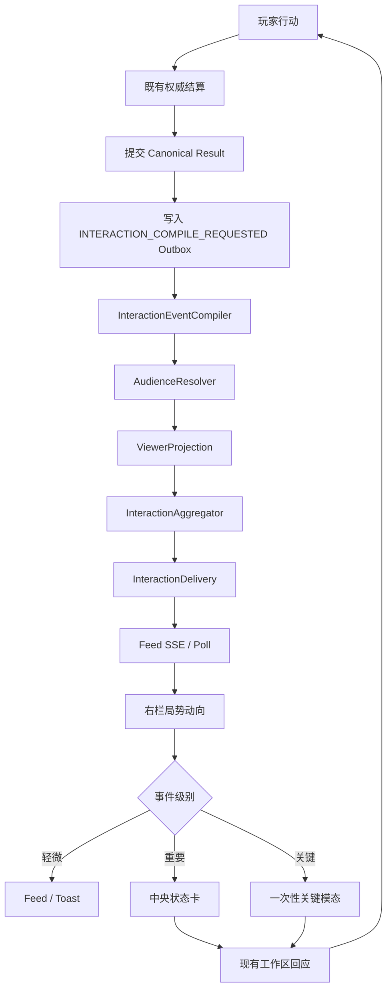
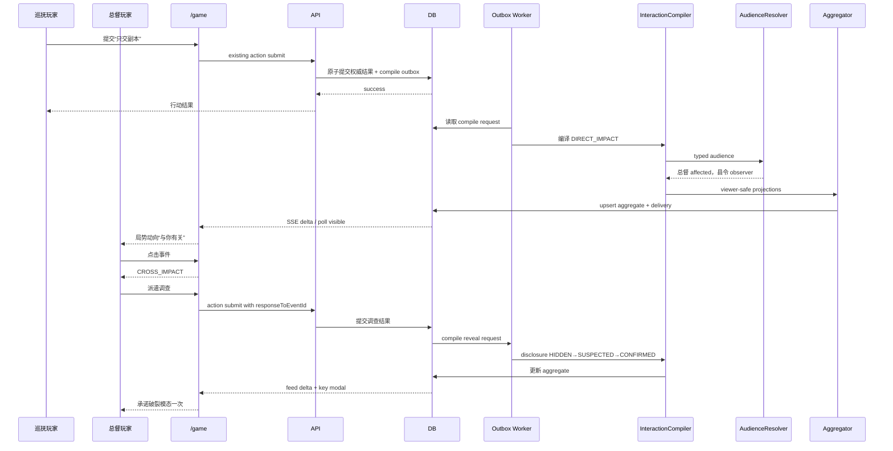

# Our Many Worlds：A-Emotion 多人互动 MVP 最终上线实施、后端流程、测试与验收 vFinal

> 文档状态：**最终上线冻结版 / 可直接交给 Codex 开发**  
> 适用产品：Our Many Worlds / 《桑田诏》多人 MVP  
> 适用页面：现有真实 `/game`  
> 配套页面文档：`Our_Many_Worlds_A-Emotion多人互动MVP_主游戏页面最终冻结规范_PRD与前端实现_vFinal.md`  
> 版本关系：本文件替代此前《最终上线实施、页面、流程、测试与验收方案 v1.0》中的冲突或过时内容。  
> 核心目标：**用现有即时行动和既有权威结算链路，增加真实跨玩家影响、有限信息、调查揭晓、轻量承诺、危险线、阶段胜利和右侧实时局势流，验证玩家是否真正感受到其他真人。**

---

## 目录

1. [最终上线定义与冻结范围](#1-最终上线定义与冻结范围)
2. [产品体验合同](#2-产品体验合同)
3. [MVP 共享冲突与角色规则](#3-mvp-共享冲突与角色规则)
4. [端到端玩家与系统流程](#4-端到端玩家与系统流程)
5. [后端领域模型](#5-后端领域模型)
6. [跨玩家事件生成与查看者投影](#6-跨玩家事件生成与查看者投影)
7. [事件展示、中央卡与弹窗触发矩阵](#7-事件展示中央卡与弹窗触发矩阵)
8. [局势动向 Feed 后端能力](#8-局势动向-feed-后端能力)
9. [轻量正式承诺与承诺破裂](#9-轻量正式承诺与承诺破裂)
10. [危险线与濒临失败](#10-危险线与濒临失败)
11. [阶段胜利与里程碑](#11-阶段胜利与里程碑)
12. [AI 职责边界与模板降级](#12-ai-职责边界与模板降级)
13. [逻辑 API、SSE 与前后端合同](#13-逻辑-apisse-与前后端合同)
14. [存储、事务、Outbox 与幂等](#14-存储事务outbox-与幂等)
15. [权限、安全与防泄漏](#15-权限安全与防泄漏)
16. [异常、恢复与兼容](#16-异常恢复与兼容)
17. [Feature Flag、灰度与回滚](#17-feature-flag灰度与回滚)
18. [分阶段开发顺序](#18-分阶段开发顺序)
19. [自动化测试体系](#19-自动化测试体系)
20. [真实 `/game` 三角色 E2E](#20-真实-game-三角色-e2e)
21. [真人测试、指标与通过线](#21-真人测试指标与通过线)
22. [需求—实现—测试追踪矩阵](#22-需求实现测试追踪矩阵)
23. [最终 Definition of Done](#23-最终-definition-of-done)
24. [附录 A：事件码与承诺码](#附录-a事件码与承诺码)
25. [附录 B：完整 JSON 示例](#附录-b完整-json-示例)
26. [附录 C：完整时序图](#附录-c完整时序图)
27. [附录 D：Codex 执行检查清单](#附录-dcodex-执行检查清单)

---

# 1. 最终上线定义与冻结范围

## 1.1 采用路线

本次上线采用：

# **A-Emotion：现有即时行动流程 + 跨玩家情绪反馈层**

```text
玩家提交现有主线决策或谋划
        ↓
既有权威结算确认世界变化
        ↓
在同一提交事务中写入 Interaction 编译请求
        ↓
规则系统编译公开行动、直接影响、可观察痕迹或揭晓
        ↓
服务端为每个角色生成 viewer-safe 投影
        ↓
投影被聚合并进入右侧“局势动向”
        ↓
重要事件打开中央状态卡
        ↓
关键事件一次性触发承诺破裂、濒临失败或阶段胜利弹窗
        ↓
玩家从现有人物交流、派遣调查、使用筹码、自拟谋划回应
```

## 1.2 本次只验证的核心假设

> **另一个真人做出的选择是否真实改变我的处境，并让我产生怀疑、被骗、紧张、反击、翻盘或阶段胜利的情绪。**

## 1.3 冻结范围

| 项目 | 冻结内容 |
|---|---|
| 世界 | 《桑田诏》 |
| 真人角色 | 浙江总督、浙江巡抚、县令 |
| 共享冲突 | 原始粮册 |
| 压力指标 | 皇帝信任 |
| 页面 | 真实 `/game` 三栏页面 |
| 操作入口 | 人物交流、派遣调查、使用筹码、自拟谋划 |
| 结算 | 复用现有即时行动和权威写入 |
| 事件类型 | PUBLIC_ACTION / DIRECT_IMPACT / OBSERVABLE_TRACE / REVEAL |
| 来源等级 | HIDDEN / SUSPECTED / CONFIRMED |
| Feed 标签 | RELATED / PUBLIC / SUSPICIOUS |
| 中央卡 | DECISION / CROSS_IMPACT / PROMISE_BROKEN / CRISIS / STAGE_VICTORY |
| 关键弹窗 | 承诺破裂、濒临失败、阶段胜利 |
| Feed 实时性 | SSE 优先；无则 7 秒轮询 |
| 互动影响 | 每个玩家行动最多 1 个重大跨玩家影响 |
| 承诺 | 每名玩家整局最多 1 个预设正式承诺 |
| 测试 | Unit、Contract、Service、HTTP、Web、视觉、真实三角色 E2E、真人房间 |

## 1.4 明确不做

```text
不实现 SettlementWindow；
不实现全员准备与同步锁定；
不实现多 Intent Batch；
不实现复杂反应链；
不实现通用承诺语言理解；
不实现世界无关互动引擎；
不新增主页面；
不新增独立消息中心；
不公开原始秘密行动；
不依赖 AI 决定 audience；
不允许一次行动永久淘汰玩家；
不让弹窗替代真实权威状态；
不把 Feed 变成其他玩家所有动作日志；
不新增更多共享冲突。
```

## 1.5 与未来 B-lite 的关系

本版本验证“互动感”。

只有当真实用户明确感到互动，却集中反馈：

- 先提交的人占便宜；
- 没机会阻止对方；
- 同时争夺的对象被顺序处理；
- 即时结算不公平；

才进入 B-lite。

---

# 2. 产品体验合同

## 2.1 玩家必须获得的体验

```text
我知道自己的主目标；
我必须依赖但不能完全相信别人；
别人能真实改变我的状态或下一步；
我先看到有限迹象，而不是后台真相；
我能调查、质问、保护或反击；
关键时刻我知道自己快输了或夺回了主动；
最终我知道谁影响了我，以及下一局可以怎么改。
```

## 2.2 有价值情绪与产品问题的边界

| 有价值情绪 | 产品问题 |
|---|---|
| 我怀疑他骗了我 | 我看不懂系统 |
| 我快输了 | AI 无缘无故扣分 |
| 我想反击 | 我没有任何回应入口 |
| 我识破了他 | 系统提前泄露答案 |
| 我差一点赢 | 结果纯随机 |
| 我被背叛 | 页面数据互相矛盾 |

## 2.3 体验不变量

1. 不伪造其他真人行动；
2. 不用 AI 虚构承诺破裂；
3. 不把后台已知等同于玩家已知；
4. 重大负面影响必须提供回应；
5. 来源等级只能单调升级；
6. 同一关键弹窗不重复；
7. Feed 不是动作数量，而是有意义事件；
8. 权威结果先于叙事文案；
9. 无权限角色不得收到事件；
10. 刷新、重试不得重复扣资源或重复发布。

---

# 3. MVP 共享冲突与角色规则

## 3.1 唯一共享对象

```ts
type SharedObjectId = "original-grain-ledger";

type GrainLedgerState =
  | "UNKNOWN"
  | "REPORTED_ONLY"
  | "COPY_DELIVERED"
  | "ORIGINAL_LOCATED"
  | "ORIGINAL_CONTROLLED"
  | "ORIGINAL_DISCLOSED";
```

## 3.2 三角色关系

| 角色 | 主目标 | 害怕失去 | 依赖 |
|---|---|---|---|
| 总督 | 获取可信原册，保住主持权 | 皇帝信任、改革授权 | 巡抚或县令的账册与证词 |
| 巡抚 | 保住奏报口径和地方控制 | 朝廷信用 | 县令配合、总督接受口径 |
| 县令 | 避免替罪并保留自保证据 | 官位、安全、证据控制 | 判断向谁交证据 |

## 3.3 允许的核心行动

```text
提交原册
提交副本
延迟递送
隐藏关键页
把证据交给另一方
先行向朝廷解释责任
公开质问
私下施压
保留证据
```

## 3.4 正式承诺

```text
提交原始粮册
不公开追究隐瞒责任
朝廷问责时替对方作证
```

## 3.5 调查结果

```text
NONE
SUSPECTED
CONFIRMED
```

---

# 4. 端到端玩家与系统流程

## 4.1 完整链路



## 4.2 权威顺序

1. 行动被现有系统验证；
2. 世界状态和资源变化被权威提交；
3. Interaction 编译请求与权威结果引用在同一事务写 Outbox；
4. 事件编译器只消费已确认结果；
5. audience 解析和投影；
6. Feed 聚合与投递；
7. AI 或模板生成安全文案；
8. 页面展示；
9. Narrator 可在之后补充文学表达。

## 4.3 最低可上线链路

```text
巡抚隐藏原册
→ 总督皇帝信任 -6 / 改革暂时停滞
→ 生成 DIRECT_IMPACT
→ 总督收到 RELATED Feed
→ 县令可能收到 SUSPICIOUS Trace
→ 无关角色不收到
→ 总督派遣调查
→ 事件 HIDDEN→SUSPECTED→CONFIRMED
→ 若有 Promise，触发 PROMISE_BROKEN
→ 总督反击或隐瞒
```

---

# 5. 后端领域模型

## 5.1 枚举

```ts
export type InteractionEventKind =
  | "PUBLIC_ACTION"
  | "DIRECT_IMPACT"
  | "OBSERVABLE_TRACE"
  | "REVEAL";

export type DisclosureLevel =
  | "HIDDEN"
  | "SUSPECTED"
  | "CONFIRMED";

export type EventSeverity =
  | "MINOR"
  | "MAJOR"
  | "CRITICAL";

export type SituationFeedCategory =
  | "RELATED"
  | "PUBLIC"
  | "SUSPICIOUS";

export type RecommendedPresentation =
  | "FEED_ONLY"
  | "CENTER_CARD"
  | "KEY_MODAL";

export type CenterCardType =
  | "CROSS_IMPACT"
  | "PROMISE_BROKEN"
  | "CRISIS"
  | "STAGE_VICTORY";
```

## 5.2 Canonical InteractionEvent

```ts
export interface InteractionEvent {
  id: string;
  roomId: string;
  runId: string;
  stageId: string;

  sourceActionId: string;
  sourceRoleId: string;

  kind: InteractionEventKind;
  eventCode: string;
  eventFamily: string;
  severity: EventSeverity;

  sharedObjectId?: "original-grain-ledger";

  canonicalFacts: string[];
  impacts: InteractionImpact[];

  audienceSpec: InteractionAudienceSpec;

  disclosure: DisclosureLevel;
  suspectedRoleIds?: string[];

  promiseId?: string;
  milestoneId?: string;
  metricTransitionId?: string;

  occurredAt: string;
  eventSequence: number;
  stateVersion: number;
}
```

## 5.3 Impact

```ts
export interface InteractionImpact {
  targetRoleId: string;
  type:
    | "STAT"
    | "RESOURCE"
    | "GOAL_PROGRESS"
    | "ACTION_OPTION"
    | "RISK"
    | "SHARED_OBJECT";
  key: string;
  before?: number | string;
  after?: number | string;
  delta?: number;
  effectCode: string;
}
```

## 5.4 AudienceSpec

```ts
export type InteractionAudienceSpec =
  | {
      type: "PUBLIC_RELEVANT_ROLES";
      roleIds: string[];
    }
  | {
      type: "AFFECTED_ROLES";
      roleIds: string[];
    }
  | {
      type: "OBSERVERS";
      resolverCode: string;
      contextRefs: string[];
    }
  | {
      type: "EXPLICIT";
      roleIds: string[];
    };
```

不得使用未验证的 legacy `affectedActorIds` 绕过 typed audience。

## 5.5 ViewerProjection

```ts
export interface ViewerInteractionProjection {
  eventId: string;
  projectionVersion: number;

  roomId: string;
  runId: string;
  viewerRoleId: string;

  category: SituationFeedCategory;
  disclosure: DisclosureLevel;
  severity: EventSeverity;

  title: string;
  safeSummary: string;
  statusLabel: string;

  visibleImpacts: Array<{
    label: string;
    value: string;
  }>;

  knownFacts: string[];
  visibleSourceRoleId?: string;
  visibleSuspectedRoleIds?: string[];

  responseOptions: Array<{
    code: string;
    label: string;
    preferredEntry:
      | "TALK"
      | "INVESTIGATE"
      | "TOKEN"
      | "PLAN"
      | "DEFER";
  }>;

  recommendedPresentation: RecommendedPresentation;
  centerCardType?: CenterCardType;

  eventSequence: number;
  occurredAt: string;
}
```

## 5.6 Delivery

```ts
export interface InteractionDelivery {
  eventId: string;
  projectionVersion: number;
  viewerRoleId: string;

  deliveredAt: string;
  seenAt: string | null;
  acknowledgedAt: string | null;
  resolvedAt: string | null;

  keyModalShownAt: string | null;
  keyModalStateVersion: number | null;
}
```

## 5.7 Aggregate

```ts
export interface InteractionAggregate {
  id: string;
  aggregationKey: string;

  roomId: string;
  runId: string;
  stageId: string;
  viewerRoleId: string;

  sharedObjectId?: string;
  eventFamily: string;

  latestEventId: string;
  projectionVersion: number;
  eventSequence: number;

  category: SituationFeedCategory;
  disclosure: DisclosureLevel;
  severity: EventSeverity;

  title: string;
  safeSummary: string;
  statusLabel: string;

  visibleImpacts: unknown[];
  responseOptions: unknown[];

  createdAt: string;
  updatedAt: string;
}
```

---

# 6. 跨玩家事件生成与查看者投影

## 6.1 InteractionEventCompiler

输入：

- Canonical action result；
- 资源和指标变化；
- 共享对象变化；
- 可观察痕迹；
- Promise ledger；
- 当前世界配置。

输出：

- 0 或 1 个重大跨玩家事件；
- 可附带轻微公共事件；
- 不得凭空生成世界事实。

## 6.2 事件生成规则

生成事件当且仅当至少一项成立：

1. 改变某角色状态；
2. 改变某角色下一步；
3. 触及原始粮册；
4. 产生合法观察痕迹；
5. 改变公开世界；
6. 确认来源或承诺状态。

全部为否则不生成当前 viewer 的投影。

## 6.3 分类映射

| EventKind | Feed category | 典型展示 |
|---|---|---|
| DIRECT_IMPACT | RELATED | 与你有关 |
| PUBLIC_ACTION | PUBLIC | 公开 |
| OBSERVABLE_TRACE | SUSPICIOUS | 可疑 |
| REVEAL | 保留原 category，status=已确认 | 更新原事件 |

## 6.4 来源等级

### HIDDEN

- 不显示 sourceRoleId；
- 不在 JSON 中发送 public name；
- `statusLabel = 来源未知`。

### SUSPECTED

- 只显示合法嫌疑；
- `statusLabel = 迹象指向……`；
- 不等同确认。

### CONFIRMED

- 必须有证据或公开事实；
- 可以显示公开角色名和已确认行为。

## 6.5 ViewerProjector

```ts
function projectForViewer(
  event: InteractionEvent,
  viewerRoleId: string,
  worldContext: WorldContext,
): ViewerInteractionProjection | null {
  assertSameRun(event, worldContext);

  const audience = resolveTypedAudience(
    event.audienceSpec,
    worldContext,
  );

  if (!audience.includes(viewerRoleId)) {
    return null;
  }

  return buildFailClosedProjection({
    event,
    viewerRoleId,
    worldContext,
  });
}
```

## 6.6 Fail-closed

若：

- audience resolver 失败；
- role 不存在；
- runId 不匹配；
- disclosure 数据不完整；
- SUSPECTED 没有迹象依据；
- CONFIRMED 没有证据引用；

则：

- 不投递私密内容；
- 记录结构化错误；
- 允许投递最低限度公共内容，前提是确属公开；
- 不让 AI 猜测。

---

# 7. 事件展示、中央卡与弹窗触发矩阵

## 7.1 展示矩阵

| 条件 | Feed | Toast | 中央卡 | 关键模态 |
|---|---|---|---|---|
| PUBLIC_ACTION，纯背景 | PUBLIC | 可选 | 否 | 否 |
| OBSERVABLE_TRACE MINOR | SUSPICIOUS | 是 | 点击后 | 否 |
| DIRECT_IMPACT MINOR | RELATED | 是 | 点击后 | 否 |
| DIRECT_IMPACT MAJOR | RELATED | 是 | 是 | 否 |
| REVEAL，无 Promise | 更新原条目 | 可选 | CROSS_IMPACT confirmed | 否 |
| REVEAL，确认 Promise 违背 | 更新原条目 | 否 | PROMISE_BROKEN | 一次 |
| 指标首次跨入危险线 | RELATED | 否 | CRISIS | 一次 |
| 阶段里程碑首次达成 | RELATED/PUBLIC | 否 | STAGE_VICTORY | 一次 |

## 7.2 RecommendedPresentation

```ts
function recommendPresentation(
  event: InteractionEvent,
  derived: DerivedTriggerState,
): RecommendedPresentation {
  if (derived.crisisEntered) return "KEY_MODAL";
  if (derived.promiseBrokenRevealed) return "KEY_MODAL";
  if (derived.stageVictoryAchieved) return "KEY_MODAL";

  if (event.severity === "MAJOR") return "CENTER_CARD";
  if (event.severity === "CRITICAL") return "CENTER_CARD";

  return "FEED_ONLY";
}
```

前端可延迟展示以保护输入，但不得降级权限或修改业务类型。

## 7.3 关键模态去重键

```text
viewerRoleId
+ modalType
+ triggerId
+ stateVersion
```

## 7.4 模态优先级

```text
CRISIS 300
PROMISE_BROKEN 200
STAGE_VICTORY 100
```

---

# 8. 局势动向 Feed 后端能力

## 8.1 Feed 不是事件表直出

必须经过：

```text
InteractionEvent
→ ViewerProjection
→ Aggregate
→ Delivery state
→ Feed DTO
```

## 8.2 聚合键

```text
roomId
+ runId
+ viewerRoleId
+ stageId
+ sharedObjectId
+ eventFamily
```

## 8.3 聚合更新

同一键的新事件：

- 更新 `latestEventId`；
- 增加 `projectionVersion`；
- 升级 `disclosure`；
- 合并 visible impacts；
- 更新 response options；
- 更新 `eventSequence`；
- 不新建重复 Feed 行。

## 8.4 排序

服务端返回：

1. 未解决关键 RELATED；
2. 其余按 `eventSequence DESC`；
3. 不按客户端时间；
4. 同一投影版本只返回一次。

## 8.5 游标

建议：

```ts
type FeedCursor = string; // encode eventSequence + projectionVersion
```

请求：

```text
afterCursor
limit <= 10
```

## 8.6 未读

- Delivery 创建时 unread；
- 前端 item 进入视口 1 秒后 `seen`；
- 打开或“暂不回应”后 `acknowledged`；
- 完成回应后 `resolved`。

## 8.7 轻实时

### SSE 事件

```text
interaction.feed.delta
interaction.key-modal.available
interaction.metrics.updated
```

SSE payload 只能是 viewer-safe projection 或引用 ID。

### 轮询

无 SSE 时：

- 7 秒；
- action submit 后；
- focus 后；
- 网络恢复后。

---

# 9. 轻量正式承诺与承诺破裂

## 9.1 SimplePromise

```ts
export type SimplePromiseStatus =
  | "ACTIVE"
  | "FULFILLED"
  | "BROKEN"
  | "REVEALED"
  | "EXPIRED";

export interface SimplePromise {
  id: string;
  roomId: string;
  runId: string;

  sourceRoleId: string;
  targetRoleId: string;

  promiseCode:
    | "DELIVER_ORIGINAL_LEDGER"
    | "DO_NOT_PUBLICLY_BLAME"
    | "TESTIFY_FOR_TARGET";

  relatedObjectId?: "original-grain-ledger";
  visibility: "PRIVATE" | "PUBLIC";

  createdByActionId: string;
  expiresAtStageId?: string;

  status: SimplePromiseStatus;

  fulfilledByActionId?: string;
  brokenByActionId?: string;
  revealedByEventId?: string;

  createdAt: string;
  updatedAt: string;
}
```

## 9.2 创建

- 只能人物交流；
- 只能预设 promiseCode；
- 每名玩家整局最多 1 个；
- 普通聊天不自动升级；
- 后端校验双方角色和 run。

## 9.3 兑现与违背

确定性规则：

```text
DELIVER_ORIGINAL_LEDGER
- 提交原册：FULFILLED
- 只交副本 / 隐藏 / 延迟超过期限：BROKEN
```

不允许模型仅凭措辞判断。

## 9.4 违背不等于揭晓

```text
ACTIVE
→ BROKEN
→ REVEALED
```

`BROKEN` 时：

- 行动者知道自己的行动；
- 接收者只看到影响或痕迹；
- 不弹“承诺破裂”。

`REVEALED` 时：

- 有调查证据、公开事实或合法确认；
- 触发 PromiseBroken 事件；
- 弹模态一次。

## 9.5 承诺破裂事件

必须引用：

- promiseId；
- brokenByActionId；
- reveal evidence refs；
- targetRoleId；
-实际影响；
- 解锁回应。

---

# 10. 危险线与濒临失败

## 10.1 规则

```ts
export interface MetricThresholdRule {
  metricKey: "emperorTrust";
  warningThreshold: 25;
  dangerThreshold: 20;
  triggerCode: "LOSE_REFORM_AUTHORITY_RISK";
}
```

## 10.2 阈值转换

```ts
export interface MetricTransition {
  id: string;
  runId: string;
  roleId: string;
  metricKey: string;
  before: number;
  after: number;
  thresholdStateBefore: "NORMAL" | "WARNING" | "DANGER";
  thresholdStateAfter: "NORMAL" | "WARNING" | "DANGER";
  sourceEventId?: string;
  stateVersion: number;
}
```

## 10.3 弹窗条件

```text
before != DANGER
after == DANGER
```

在 DANGER 内继续下降不重复。

## 10.4 不直接淘汰

进入危险：

- 警告；
- 解锁保护行动；
- 不立即终止游戏；
- 后续明确失败事件才可能失去主持权。

---

# 11. 阶段胜利与里程碑

## 11.1 里程碑合同

```ts
export interface StageMilestone {
  id: string;
  code:
    | "CONTROL_ORIGINAL_LEDGER"
    | "BREAK_OPPONENT_REPORT_CONTROL"
    | "RESTORE_REFORM_MOMENTUM";
  runId: string;
  beneficiaryRoleId: string;
  status: "INACTIVE" | "ACHIEVED" | "REVOKED";
  stateVersion: number;
  evidenceRefs: string[];
  achievedAt?: string;
}
```

## 11.2 触发

例如：

```text
原始粮册 state = ORIGINAL_CONTROLLED
controllerRoleId = 当前玩家
且此前不是 ACHIEVED
```

## 11.3 结果

- 改革进度 +12；
- 新质问主动权；
- 对手口径控制受限；
- Feed 更新；
- modal 一次；
- 中央 StageVictory。

## 11.4 阶段胜利不是终局

- 可被后续行动削弱；
- 不替代最终胜负；
- 必须说明具体获得了什么；
- 不只给“胜利”文字。

---

# 12. AI 职责边界与模板降级

## 12.1 规则系统决定

- 事件是否发生；
- 受影响者；
- 观察者；
- 来源等级；
- 数值变化；
- 可选回应；
- Promise 是否违背；
- 是否进入危险；
- 是否达成里程碑；
- 卡片类型；
- 模态触发。

## 12.2 AI 可以做

- 在安全结构上生成一句摘要；
- 调整《桑田诏》风格；
- 把结构化结果写得自然；
- 生成不改变事实的短叙事。

## 12.3 AI 禁止

- 增加受众；
- 暴露 sourceRole；
- 将 SUSPECTED 写成 CONFIRMED；
- 虚构 Promise；
- 虚构证据；
- 改变数值；
- 改变胜负；
- 创建新规则；
- 决定 modal 是否触发。

## 12.4 模板优先

Feed 和关键卡全部可无模型运行。

模板示例：

```text
DIRECT_IMPACT:
{sharedObjectName}出现异常，影响了你的{impactLabel}。

OBSERVABLE_TRACE:
你发现了与{sharedObjectName}有关的可疑迹象。

REVEAL:
调查确认了{confirmedFact}。
```

模型失败时使用模板，不影响游戏继续。

---

# 13. 逻辑 API、SSE 与前后端合同

> 实际 API 前缀与文件位置必须结合仓库审计；不得另建平行 API。

## 13.1 Feed

```http
GET /runs/{runId}/interaction-feed?cursor={cursor}&limit=10
```

响应：

```ts
interface InteractionFeedResponse {
  runId: string;
  viewerRoleId: string;
  items: ViewerInteractionProjection[];
  unreadCount: number;
  nextCursor: string | null;
  serverSequence: number;
}
```

## 13.2 详情

```http
GET /interaction-events/{eventId}
```

只返回当前 viewer-safe 详情。

## 13.3 Seen

```http
POST /interaction-events/{eventId}/seen
```

请求带 projectionVersion，幂等。

## 13.4 Acknowledge

```http
POST /interaction-events/{eventId}/acknowledge
```

用于打开、暂不回应或开始回应。

## 13.5 正式承诺

```http
POST /promises
```

```json
{
  "targetRoleId": "provincial-governor",
  "promiseCode": "DELIVER_ORIGINAL_LEDGER",
  "visibility": "PRIVATE",
  "clientRequestId": "..."
}
```

## 13.6 现有行动响应上下文

现有 action submit 增加可选字段：

```ts
interface InteractionResponseContext {
  responseToEventId?: string;
  responseOptionCode?: string;
}
```

后端重新校验，不信任前端预填。

## 13.7 SSE

viewer 专属频道：

```text
interaction.feed.delta
interaction.key-modal.available
interaction.metrics.updated
```

Payload：

- eventId；
- projectionVersion；
- viewerRoleId；
- serverSequence；
- 必要的安全视图；
- 不得携带 raw event。

---

# 14. 存储、事务、Outbox 与幂等

## 14.1 优先复用

若仓库已有：

- V2_CROSS_IMPACT；
- V2_OBSERVABLE_TRACE；
- NarrativeEntry；
- per-role delivery；
- Outbox；
- state revision；

必须优先映射，不重复建旁路。

## 14.2 推荐存储

缺失时增加：

```text
interaction_events
interaction_deliveries
interaction_aggregates
simple_promises
metric_transitions
stage_milestones
```

## 14.3 权威事务

行动提交事务内：

1. 写 canonical result；
2. 写世界状态；
3. 写资源变化；
4. 写 `INTERACTION_COMPILE_REQUESTED` Outbox；
5. 提交。

不在事务里调用模型。

## 14.4 编译 Outbox

Worker：

1. 读取 canonical result；
2. 编译 event；
3. audience；
4. projection；
5. aggregate；
6. delivery；
7. 写 viewer SSE outbox。

## 14.5 幂等键

```text
interaction:{sourceActionId}:{eventCode}:{targetRoleId}
delivery:{eventId}:{projectionVersion}:{viewerRoleId}
aggregate:{aggregationKey}:{projectionVersion}
promise:{sourceRoleId}:{runId}
modal:{viewerRoleId}:{modalType}:{triggerId}:{stateVersion}
metric-transition:{roleId}:{metricKey}:{stateVersion}
milestone:{milestoneCode}:{beneficiaryRoleId}:{stateVersion}
```

## 14.6 唯一约束

- event idempotency key；
- delivery event+version+viewer；
- aggregate key；
- promise sourceRole+run；
- modal dedupe key。

## 14.7 事件编译失败

- 不回滚已确认世界事实；
- Outbox 重试；
- 超过阈值进入 dead-letter；
- Feed 可显示结构化“结果已确认，局势摘要稍后补充”；
- 不能伪造内容。

---

# 15. 权限、安全与防泄漏

## 15.1 校验

每次 Feed/详情/seen/ack：

- 当前用户属于房间；
- runId 正确；
- role ownership 正确；
- delivery 存在；
- projectionVersion 匹配；
- 事件未跨 run；
- 不接受前端指定 viewerRoleId 代替服务端会话。

## 15.2 服务端过滤

客户端永远只收到 `ViewerInteractionProjection`。

## 15.3 HIDDEN

响应中不得包含：

- sourceRoleId；
- source public name；
- suspectedRoleIds；
- raw action；
- raw audience。

## 15.4 SUSPECTED

只包含合法嫌疑，不包含真实来源作为隐藏字段。

## 15.5 CONFIRMED

必须 evidenceRefs 非空，或事实公开。

## 15.6 防重放

旧 run 的 action/event/ack 请求全部拒绝。

## 15.7 对抗测试

- 改 eventId 读取别人事件；
- 改 runId；
- 改 viewerRoleId；
- HIDDEN JSON 泄漏；
- CSS 隐藏；
- legacy audience bypass；
- duplicate delivery；
- stale projectionVersion；
- cross-room cursor。

---

# 16. 异常、恢复与兼容

## 16.1 SSE 失败

回退轮询，不影响行动。

## 16.2 Feed 失败

显示“局势动向暂未更新”，不显示假数据。

## 16.3 文案失败

模板降级。

## 16.4 重复行动

现有 action 幂等，事件幂等，不重复影响和 Feed。

## 16.5 页面刷新

- Feed 恢复；
- seen/ack 恢复；
- 未展示关键模态补显；
- 已展示不重复；
- 当前权威指标一致。

## 16.6 玩家离线

Delivery 保留；回来后增量获取。

## 16.7 旧存档

无 Interaction 数据时：

- Feed 隐藏；
- 普通决策不变；
- 不迁移伪事件；
- 新功能仅对 Feature Flag 新房间开启。

## 16.8 Solo

- 可隐藏 Feed；
- 或只显示 PUBLIC；
- 不伪造“其他玩家”；
- 单人回归必须不受影响。

---

# 17. Feature Flag、灰度与回滚

## 17.1 Flags

```ts
interface AEmotionFeatureFlags {
  aEmotionEnabled: boolean;
  situationFeedEnabled: boolean;
  crossImpactCardEnabled: boolean;
  keyModalsEnabled: boolean;
  simplePromiseEnabled: boolean;
  interactionHistoryEnabled: boolean;
  pollIntervalMs: number;
}
```

## 17.2 房间级冻结

创建房间时写入规则版本和 flags，整局不变。

## 17.3 灰度

1. 开发房间；
2. 内部 3 人房间；
3. 邀请制 10 房间；
4. 30—50 房间 Alpha；
5. 受控 Beta。

## 17.4 回滚

可单独关闭：

- key modals；
- Feed；
- Promise；
- CrossImpactCard。

关闭后：

- 世界权威状态保留；
- 不删除历史；
- 不伪造回滚事件；
- 页面回归普通决策。

---

# 18. 分阶段开发顺序

## M0：仓库审计与冻结

确认：

- 现有 V2_CROSS_IMPACT；
- V2_OBSERVABLE_TRACE；
- NarrativeEntry；
- Outbox；
- `/game` 组件；
- SSE/轮询；
- modal；
- history；
- action submit。

产出接入点清单。

## M1：一条真实跨玩家影响

固定：

```text
巡抚隐藏原册
→ 总督受影响
→ Feed RELATED
→ 中央 CROSS_IMPACT
```

## M2：来源升级和 Feed 聚合

- HIDDEN；
- SUSPECTED；
- CONFIRMED；
- aggregate；
- seen/ack；
- 3/6 条滚动。

## M3：顶部危险与 CRISIS

- MetricTransition；
- 顶部一致；
- modal once；
- 中央持久化。

## M4：Promise 与承诺破裂

- SimplePromise；
- deterministic broken；
- reveal；
- modal once。

## M5：阶段胜利与终局摘要

- milestone；
- victory；
- interaction summary。

## M6：安全、恢复、E2E、灰度

---

# 19. 自动化测试体系

## 19.1 Unit

### U-001 事件生成条件

覆盖六个生成条件和全部为否。

### U-002 分类

- DIRECT_IMPACT→RELATED；
- PUBLIC_ACTION→PUBLIC；
- OBSERVABLE_TRACE→SUSPICIOUS；
- REVEAL 更新原分类。

### U-003 disclosure

- HIDDEN 无来源；
- SUSPECTED 仅合法嫌疑；
- CONFIRMED 要证据；
- 单调升级。

### U-004 聚合

- 同 key 更新；
- 不同 viewer 不合并；
- 不同 run 不合并；
- disclosure 升级；
- impact 合并。

### U-005 Promise

- create；
- fulfill；
- break；
- reveal；
- no repeat；
- 普通聊天不创建。

### U-006 危险线

- 23→18 弹；
- 18→16 不弹；
- 18→25 离开；
- 25→18 新 version 可弹。

### U-007 Milestone

- inactive→achieved；
- 重算不重复；
- revoked 不误弹胜利。

### U-008 模态优先级

CRISIS > PROMISE > VICTORY。

## 19.2 Contract

- Feed DTO 不含 raw source；
- HIDDEN schema；
- SUSPECTED schema；
- CONFIRMED evidence；
- cursor；
- old run；
- modal trigger；
- response context。

## 19.3 Service / Integration

### S-001 直接影响

巡抚行动产生总督 RELATED，数值一致。

### S-002 无关角色

无 delivery。

### S-003 可观察痕迹

县令得到 SUSPICIOUS，不得看完整来源。

### S-004 公共行动

相关角色均得到 PUBLIC。

### S-005 Reveal

原 aggregate 升级，不新增重复行。

### S-006 PromiseBroken

只有 revealed 后 modal。

### S-007 Outbox retry

不重复 event/delivery/aggregate。

### S-008 AI 失败

模板存在，权威状态不回滚。

## 19.4 HTTP

- 未登录；
- 非房间成员；
- role spoof；
- cursor；
- limit；
- seen 幂等；
- ack 幂等；
-详情不扩大权限；
- old run；
- projection version。

## 19.5 Web DOM

依据页面文档 UI-001—UI-006。

## 19.6 视觉

六张基准图对应六个快照。

## 19.7 安全对抗

- raw event 泄漏；
- sourceRoleId；
- legacy audience；
- cross-run；
- cross-room；
- hidden field；
- stale cursor；
- duplicate modal；
- inspect network response。

## 19.8 性能

- 10 条 Feed；
- 100 条历史；
- 7 秒轮询；
- SSE burst 5 条；
- 聚合后 DOM；
- 输入不卡顿。

---

# 20. 真实 `/game` 三角色 E2E

## 20.1 环境

- 三个浏览器上下文；
- 同一真实房间；
- 总督、巡抚、县令；
- 真实 `/game`；
- 真实 HTTP；
- 持久化数据库；
- 禁止测试专用页面和内存假路由。

## 20.2 E2E-01 私人信息

三个角色看到不同信息。

## 20.3 E2E-02 正式承诺

巡抚对总督承诺提交原册；县令不可见私密承诺。

## 20.4 E2E-03 隐藏行动

巡抚只提交副本：

- 总督指标真实变化；
- 总督 Feed `与你有关`；
- 来源未知；
- 县令按规则看到痕迹；
- 无关角色不见。

## 20.5 E2E-04 点击与调查

- 总督点击 Feed；
- 中央 CrossImpact；
- 点击派遣调查；
- 右栏预填；
- 提交。

## 20.6 E2E-05 SUSPECTED

原 Feed 条目升级，未泄露完整来源。

## 20.7 E2E-06 CONFIRMED + PromiseBroken

- 证据确认；
- 原 Feed 标记已确认；
- PromiseBroken modal 一次；
- 关闭后中央卡；
- 刷新不重复。

## 20.8 E2E-07 CRISIS

- 信任 23→18；
- 顶部先更新；
- Crisis modal 一次；
- 18→16 不重复。

## 20.9 E2E-08 StageVictory

- 总督控制原册；
- 改革 0→12；
- Victory modal 一次；
- 中央卡存在。

## 20.10 E2E-09 Feed 滚动

- 默认 3；
- 展开 6；
- 有 scrollbar；
- 用户向下滚动；
- 新事件到达不跳；
- 出现新动态 chip；
- 点击回顶。

## 20.11 E2E-10 幂等与恢复

- 重复 action；
- worker retry；
- refresh；
- reconnect；
- seen/ack；
- no duplicate。

---

# 21. 真人测试、指标与通过线

## 21.1 规模

10—20 个房间完成首轮验证；通过后扩至 30—50。

## 21.2 结束问题

1. 哪个玩家对你的影响最大？
2. 你何时开始不相信某个人？
3. 你何时最担心自己会输？
4. 哪一步让你夺回主动？
5. 再玩一次你会改变什么？

## 21.3 建议通过线

| 指标 | 目标 |
|---|---:|
| 能说出至少一名影响自己的真人 | ≥60% |
| 有明显怀疑、欺骗或背叛感 | ≥40% |
| 受到影响后主动回应 | ≥30% |
| 理解主要胜负原因 | ≥70% |
| 认为结果来自玩家行动 | ≥75% |
| 愿意换策略再玩 | ≥30% |
| 认为 AI 随意裁决 | ≤20% |
| 讨论真人选择多于 AI 文笔 | 必须成立 |

## 21.4 进入 B-lite 的信号

互动成立，但集中抱怨先后公平和缺少反制。

---

# 22. 需求—实现—测试追踪矩阵

| 需求 | 后端 | 前端 | 测试 |
|---|---|---|---|
| 他人真实影响我 | InteractionEventCompiler | CrossImpactCard | S-001 / E2E-03 |
| 不泄密 | ViewerProjector | 只消费 safe DTO | C-HIDDEN / 安全对抗 |
| 可疑到确认 | disclosure + aggregate | Feed 原条目升级 | U-003 / E2E-05/06 |
| 实时局势流 | Delivery + SSE/poll | SituationFeed | HTTP / E2E-09 |
| 承诺破裂 | SimplePromise + Reveal | modal + card | U-005 / E2E-06 |
| 濒临失败 | MetricTransition | 顶部 + Crisis | U-006 / E2E-07 |
| 阶段胜利 | Milestone | Victory | U-007 / E2E-08 |
| 不重复 | Idempotency + unique | modal dedupe | S-007 / E2E-10 |
| 回应入口 | response context | workbench prefill | DOM / E2E-04 |
| 历史因果 | summary query | history | E2E-10/终局 |

---

# 23. 最终 Definition of Done

## 23.1 产品

- 共享冲突未扩大；
- 四个操作入口未增加；
- 玩家感受到其他真人；
- 可疑和确认有区别；
- 重大负面有回应；
- 阶段胜负可感知。

## 23.2 后端

- 事件只源自权威结果；
- typed audience；
- viewer-safe projection；
- 聚合；
- delivery；
- seen/ack/resolved；
- Promise；
- MetricTransition；
- Milestone；
- Outbox；
- 幂等；
- run 隔离。

## 23.3 前端

满足配套页面文档全部 DoD。

## 23.4 安全

- HIDDEN 网络响应不泄漏；
- SUSPECTED 不含真实来源；
- CONFIRMED 有证据；
- 无关角色无 delivery；
- 旧 run 被拒绝；
- CSS 隐藏不是安全边界。

## 23.5 测试

- Unit；
- Contract；
- Service；
- HTTP；
- DOM；
- Visual；
- 安全对抗；
- 三角色真实 E2E；
- 真人房间。

## 23.6 上线

- Feature Flag；
- 灰度；
- 回滚；
- 监控；
- dead-letter；
- 失败模板；
- 不影响 Solo。

---

# 附录 A：事件码与承诺码

## A.1 事件码

```text
LEDGER_DELIVERY_ANOMALY
LEDGER_COPY_DELIVERED
LEDGER_ORIGINAL_LOCATED
LEDGER_SOURCE_SUSPECTED
LEDGER_SOURCE_CONFIRMED
PROMISE_DELIVER_LEDGER_BROKEN
EMPEROR_TRUST_DANGER_ENTERED
ORIGINAL_LEDGER_CONTROL_GAINED
REFORM_MOMENTUM_RESTORED
```

## A.2 承诺码

```text
DELIVER_ORIGINAL_LEDGER
DO_NOT_PUBLICLY_BLAME
TESTIFY_FOR_TARGET
```

## A.3 事件族

```text
LEDGER_FLOW
PROMISE
EMPEROR_TRUST
STAGE_CONTROL
```

---

# 附录 B：完整 JSON 示例

## B.1 HIDDEN Feed item

```json
{
  "eventId": "evt-ledger-001",
  "projectionVersion": 1,
  "eventSequence": 108,
  "category": "RELATED",
  "disclosure": "HIDDEN",
  "severity": "MAJOR",
  "title": "原始粮册的递送出现异常",
  "safeSummary": "部分页面可能在送达前被替换。",
  "statusLabel": "来源未知",
  "visibleImpacts": [
    { "label": "改革进度", "value": "暂时停滞" },
    { "label": "皇帝信任", "value": "-6" }
  ],
  "knownFacts": [
    "巡抚与县令都接触过账册"
  ],
  "responseOptions": [
    {
      "code": "INVESTIGATE_SOURCE",
      "label": "派遣调查",
      "preferredEntry": "INVESTIGATE"
    },
    {
      "code": "PUBLIC_QUESTION",
      "label": "公开质问",
      "preferredEntry": "TALK"
    },
    {
      "code": "DEFER",
      "label": "暂不回应",
      "preferredEntry": "DEFER"
    }
  ],
  "recommendedPresentation": "CENTER_CARD",
  "centerCardType": "CROSS_IMPACT",
  "occurredAt": "2026-08-08T14:00:00Z"
}
```

## B.2 SUSPECTED upgrade

```json
{
  "eventId": "evt-ledger-001",
  "projectionVersion": 2,
  "eventSequence": 112,
  "category": "SUSPICIOUS",
  "disclosure": "SUSPECTED",
  "severity": "MAJOR",
  "title": "原始粮册的递送出现异常",
  "safeSummary": "异常发生在巡抚衙门要求复核之后。",
  "statusLabel": "迹象指向巡抚衙门",
  "visibleSuspectedRoleIds": ["provincial-governor"],
  "recommendedPresentation": "CENTER_CARD",
  "centerCardType": "CROSS_IMPACT"
}
```

## B.3 PromiseBroken modal

```json
{
  "id": "modal-promise-001",
  "type": "PROMISE_BROKEN",
  "priority": 200,
  "stateVersion": 1,
  "triggerId": "promise-001",
  "viewerRoleId": "governor-general",
  "card": {
    "type": "PROMISE_BROKEN",
    "title": "承诺破裂",
    "summary": "巡抚没有兑现承诺，县令只交出了转抄副本。",
    "blockA": {
      "title": "结果",
      "lines": ["改革进度受阻", "皇帝信任风险上升"]
    },
    "blockB": {
      "title": "你获得",
      "lines": ["巡抚手令抄录", "一次公开质问机会"]
    }
  }
}
```

---

# 附录 C：完整时序图



---

# 附录 D：Codex 执行检查清单

- [ ] 阅读两个 vFinal 文档；
- [ ] 审计现有 `/game`、V2_CROSS_IMPACT、V2_OBSERVABLE_TRACE、Outbox；
- [ ] 禁止创建平行页面；
- [ ] 建立 viewer-safe event pipeline；
- [ ] 建立聚合和 Delivery；
- [ ] 接入 Feed 与轻实时；
- [ ] 建立五类中央卡；
- [ ] 建立三类 modal trigger；
- [ ] 建立 SimplePromise；
- [ ] 建立 MetricTransition；
- [ ] 建立 StageMilestone；
- [ ] 添加幂等和 typed audience；
- [ ] 加入模板降级；
- [ ] 加入 Unit、Contract、Service、HTTP、DOM、Visual、安全、E2E；
- [ ] 在真实三角色 `/game` 验收；
- [ ] 输出测试证据、截图、关键请求响应和最终 SHA。
