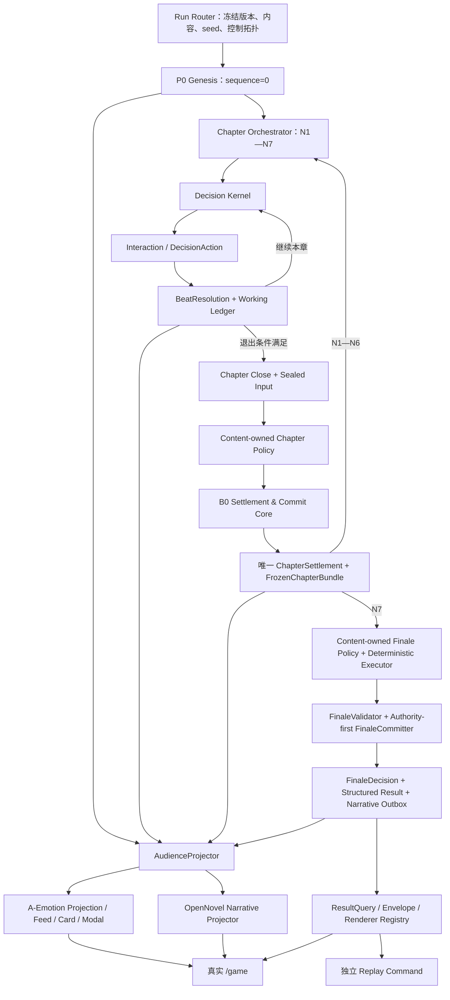

# Our Many Worlds《最终章》
# 多分支代码吸收、模块化集成、开发、测试与统一验收总方案 v1.0

> 文档状态：`FINAL_CHAPTER_INTEGRATION_PLAN_V1`
>
> 日期：2026-08-11
>
> 本文中的“最终章”是项目最后一次功能收口、代码集成和产品验收阶段，不是新增 N8，也不是新增一种游戏玩法。
>
> 本文是实施合同，不是“代码已经合并”或“产品已经通过验收”的证据。

---

# 0. 最终决定

## 0.1 一句话方案

> **以 `docs/主游戏最终版` 为唯一目标合同，先冻结各来源分支的精确 SHA，再按高内聚、低耦合的最终模块边界选择性吸收代码；随后只在一个最终集成 SHA 上补齐功能、执行故障与安全测试，并在真实 `/game`、非生产数据库、真实 Provider 和多浏览器环境完成统一验收。**

## 0.2 “先合并各分支代码”的正式含义

本文中的“合并”统一解释为：

1. 读取并冻结来源分支；
2. 识别该分支真正提供的功能能力；
3. 将能力归入最终章唯一目标模块；
4. 按文件、符号、hunk 或真正单一职责的提交吸收；
5. 改造成最终合同；
6. 在目标集成树重新运行测试；
7. 登记 `KEEP / ADAPT / REJECT` 与替代证据。

它不表示：

- 对多个分支依次执行无条件 `git merge`；
- 把每个分支的默认架构都保留下来；
- 先把冲突全部堆进 `main` 再慢慢修；
- 因为某项功能已经开发很多就保留重复实现；
- 把来源分支自己的测试结果当作最终章 PASS。

统一规范已将“整分支合并”列入明确风险和非目标，并要求 exact SHA、模块级选择性移植和单一高冲突文件 owner。[统一规范 §20、§21、§25](./Our_Many_Worlds_桑田诏_Pressure_OpenNovel_统一权威路由与冲突消解规范_v1.0.md)（L3464、L3486、L3653）

## 0.3 最终完成定义

最终章只有在以下条件同时成立时才完成：

- 一个最终集成 SHA 包含全部目标能力且没有第二套权威链；
- 每个来源能力都有来源、去向、取舍和测试证据；
- P0、N1—N7、Beat、每章唯一 B0/ChapterSettlement、Finale、Narrative、Result、Replay 全链闭合；
- A-Emotion 只做安全投影与玩家反馈，不成为第二结算引擎；
- OpenNovel 只做 Narrative Projection，失败不回滚权威结果；
- 真实 `/game` 符合六张冻结图和前端 vFinal；
- clean clone、非生产数据库、Windows seed、真实 Provider、多角色浏览器和故障矩阵均有可复核证据；
- 最终状态是 `PASS`，或明确记录真实外部阻塞为 `EXTERNAL_BLOCKED`，不得用部分通过冒充完成。

---

# 1. 唯一权威基线

## 1.1 文档权威与 SHA-256

| 权威层 | 文件 | SHA-256 | 唯一决定内容 |
|---|---|---|---|
| 运行与架构 | [Pressure + OpenNovel 统一规范](./Our_Many_Worlds_桑田诏_Pressure_OpenNovel_统一权威路由与冲突消解规范_v1.0.md) | `5AE192B449CB370A7DFCA3FA6DF8D664AF7D4439CAB0F31F4B995267E4A4A485` | Run、P0、N1—N7、Decision/Beat、B0、ChapterSettlement、Finale、Narrative、Result、Replay、Legacy 边界 |
| 后端产品层 | [A-Emotion 后端 vFinal](./Our_Many_Worlds_A-Emotion多人互动MVP_最终上线实施_后端流程测试验收_vFinal.md) | `01D1B7EAC378A3A4BA7263A6544BB92199FA9598B48340871549DF08CEE16A26` | 跨玩家影响、Promise、调查揭晓、危机、阶段胜利、Feed、Outbox、viewer-safe 投影 |
| 前端产品层 | [主游戏页面 vFinal](./Our_Many_Worlds_A-Emotion多人互动MVP_主游戏页面最终冻结规范_PRD与前端实现_vFinal.md) | `44671E012E5C3BDB8211F3A833ECEF3314EEA3709C98BED31741DBD6A7E0B926` | 真实 `/game`、三栏、五类中央状态、三类关键模态、三类 Feed 标签、四个工作区 |

## 1.2 六张视觉权威

| 图 | SHA-256 | 验收状态 |
|---|---|---|
| [01_main_decision.png](./01_main_decision.png) | `0B3AA861C4B499A7335AAF0BDCDF27B887C0E3D5E183FC00D8EFD1C8BA9A5F15` | 普通决策态 |
| [02_situation_feed_expanded.png](./02_situation_feed_expanded.png) | `8E5A4CC4441405297830D5C449AC41C8E93B44123C50548254F9B0D410366910` | Feed 展开态 |
| [03_cross_player_impact.png](./03_cross_player_impact.png) | `11AE4B4157A596FA72B058C8CF4E7A53869777123ED417CCB060CFA5313D90F4` | 他人影响态 |
| [04_promise_broken.png](./04_promise_broken.png) | `ED17B32AAA7F2F997A18F4D8CE601CA8031AC4F871D789A0197616B755EC9531` | 承诺破裂态 |
| [05_crisis.png](./05_crisis.png) | `31DEEAA2EC32795FA0293CC62D258F2F631227A6F623888D1379063CD62ED37F` | 危机态 |
| [06_stage_victory.png](./06_stage_victory.png) | `EB6F55A96C59164EF0E0D1921A5043C495C45AFB54EC1F708E90806A28317EE0` | 阶段胜利态 |

前端 vFinal 正文中曾引用 `./Our_Many_Worlds_AEmotion_vFinal_assets/*.png`，但当前目标目录没有该子目录。本方案以本表中**同目录六张 PNG 的实际文件 readback 与 SHA-256**为唯一可执行视觉基线；不得按失效相对路径寻找另一套图片，也不得用同名未核 hash 文件替换。

目录中其他未被前端 vFinal 引用的图片不自动成为新视觉需求。若未来要纳入，必须单独修改权威清单和 hash；不能因文件存在而扩散范围。

## 1.3 冲突裁定顺序

1. Pressure 统一规范决定 authority、模块边界、事务顺序和版本路由；
2. A-Emotion 后端 vFinal 决定 authority 输出之后的互动事件、安全投影和投递；
3. 前端 vFinal 与六图决定玩家最终看到的 `/game`；
4. 分支代码、分支测试、旧文档和实现习惯均不能反向覆盖以上三层。

A-Emotion 文档中“既有即时行动结算”的旧接入假设只保留为历史实现背景。最终章中，A-Emotion 必须消费已确认的 Beat、FrozenChapterBundle 或 Finale 输出，不能再定义第二套权威提交链。

## 1.4 明确不新增

- 不新增 N8；
- 不新增第二个《桑田诏》单人入口；
- 不新增 T20 Run；
- 不新增平行主游戏页、独立消息中心、关系图或第五操作入口；
- 不新增中央状态类型、第四种 Feed 标签或额外关键模态；
- 不新增玩家可见的 PREPARE/COMMIT/SettlementWindow UI；
- 不让 Generic 直接接管阶段 1 正式 Finale；
- 不让 OpenNovel、模型、Web 或 A-Emotion 决定世界规则或胜负；
- 不把模块化解释为现在就拆微服务；
- 不做 destructive migration、历史 Run 重算或生产数据迁移。

前端冻结非目标见[前端 vFinal §1.3](./Our_Many_Worlds_A-Emotion多人互动MVP_主游戏页面最终冻结规范_PRD与前端实现_vFinal.md)（L90），系统非目标见[统一规范 §21](./Our_Many_Worlds_桑田诏_Pressure_OpenNovel_统一权威路由与冲突消解规范_v1.0.md)（L3486）。

---

# 2. 当前仓库事实与执行前置条件

## 2.1 当前基线快照

截至本文生成时：

- 当前分支：`main`；
- 本地 `HEAD`：`8584867d20cc089126f458afa82636e5ad570cd4`；
- `origin/main`：`8584867d20cc089126f458afa82636e5ad570cd4`；
- 当前工作树存在多项其他任务的未提交修改、删除和未跟踪文件；
- 高冲突脏路径已经包括 `rooms.service.ts`、OpenNovel Runtime、Web `platform.js` 等；
- 这些修改全部按“他人/其他任务所有”处理，不得 reset、覆盖、顺手合入或 broad stage。

本节只是 2026-08-11 的观察快照，实施开始时必须重新核验。

## 2.2 分支头观察值不是最终冻结值

以下是 2026-08-11 通过 `git ls-remote` 看到的远程头，仅用于证明分支仍在移动：

| 来源分支 | 观察到的 remote HEAD | 状态 |
|---|---|---|
| `codex/chatgpt-pro-main-game-final-v1` | `d92bd899c68756ec5596fb1234b14b1e3972a41c` | `OBSERVED_NOT_FROZEN` |
| `codex/chatgpt-pro-maneuver-evidence-v1` | `7ab3406c99ccafb68ad410981290a55ea67f40e7` | `OBSERVED_NOT_FROZEN` |
| `codex/chatgpt-pro-sangtian-runtime-v1` | `5badb6fa62a823de7019ce6a046efffbd74268d8` | `OBSERVED_NOT_FROZEN` |
| `codex/chatgpt-pro-dynamic-kernel-lite` | `8fba8ef1e0305a6651b2b2cd7eb737815da07ab8` | `OBSERVED_NOT_FROZEN` |
| `codex/openovel-multiplayer-v1` | `9dce9f6d6c20e36dfc387ed87529de77a361e260` | `REFERENCE_ONLY_UNTIL_INTAKE` |

任何实施者不得把本表直接复制成最终 source manifest。每个分支宣布候选完成后，必须重新读取 remote HEAD、common ancestor、diff、测试和临时文件；SHA 变化即重新审计。

当前 owner 已要求各来源分支尽快结束开发并完成收尾，个别分支仍可能继续产生新提交。因此：

- 当前所有 `OBSERVED_NOT_FROZEN` SHA 都只是观察值；
- 分支完成代码、测试和收尾说明后，先标记 `READY_FOR_INTAKE`；
- 等本轮来源全部 ready，再在同一时间窗重新执行一次 remote readback 并写入正式 source manifest；
- 正式冻结后的新增提交不会自动进入最终章，必须作为新的 delta 单独审计、分类和批准；
- 这样可以避免边吸收、边追逐分支移动头造成遗漏或重复。

## 2.3 已知回归锚点与最终 Source SHA 必须分开

下列 SHA 是先前已有验证或明确能力定性的**历史回归锚点**。它们用于回答“新候选相对已知行为改变了什么”，不是本次最终章的 source SHA，也不得覆盖未来冻结的 remote HEAD：

| 来源分支 | 历史参考 SHA | 已知意义 | 本次用途 |
|---|---|---|---|
| `codex/chatgpt-pro-maneuver-evidence-v1` | `e7635c279e72ae8efaff614159447d88c7ba22d0` | 先前用户测试候选参考点 | B0 行为、测试与 manifest 的差异基线 |
| `codex/chatgpt-pro-maneuver-evidence-v1` | `9c8297dacfc00d59b58ddd48d15834b2862983c5` | 后续 readback/evidence 参考点 | 核对证据链、交付产物和后续漂移 |
| `codex/chatgpt-pro-main-game-final-v1` | `99585c7a3fe85321bf2f339baba8aa08f2b2be46` | 先前有证据的 Generic S0—S6 与文本终局基线 | Generic/Result 回归对照；**不代表 S7—S9 或真实 `/game` 完成** |

正式 intake 必须同时保存：`historicalCheckpointSha`、`finalSourceSha`、两者之间的 commit/diff、各自测试证据与能力变化说明。历史锚点不能被标为 `READY_FOR_INTAKE`，最终 moving head 也不能仅因包含历史锚点就自动判定通过。

## 2.4 默认集成落点

根据仓库 `AGENTS.md`：

- 正常开发默认直接在 `main`；
- 当前 `main` 存在并发脏改动时，不能强行开始集成；
- 首选做法是等待/协调现有 owner 将其工作明确提交或明确归属，然后在安全的 `main` 上集成；
- 如果仍无法安全使用 `main`，必须停止，并向 owner 说明冲突、风险和拟使用的精确分支/worktree 名称；只有获得当次明确批准后才可创建；
- 本文不构成创建新分支、worktree、PR、push、deploy 或生产 migration 的授权。

## 2.5 进入代码集成的 `FC-G0` 门

以下全部满足，才能开始第一行产品代码吸收：

- [ ] 三份权威文档和六图 hash 与第 1 节一致；
- [ ] 当前 `main`、`origin/main`、dirty state 已记录；
- [ ] 所有并发脏文件 owner 已确认；
- [ ] 每个来源分支候选 SHA 已冻结；
- [ ] 每个 SHA 的 common ancestor 和 diff 已保存；
- [ ] `source-regression-manifest` 已建立；
- [ ] `path-ownership-matrix` 已建立；
- [ ] 每个功能项已初步标为 `KEEP / ADAPT / REJECT`；
- [ ] 当前基线测试结果已保存，既有失败与新失败可区分；
- [ ] 没有未授权的分支/worktree/merge/push/部署动作。

任一未满足：`FC-G0=FAIL`，不得进入代码吸收。

---

# 3. 最终章唯一端到端链路



硬不变量见[统一规范 §6.3—6.4](./Our_Many_Worlds_桑田诏_Pressure_OpenNovel_统一权威路由与冲突消解规范_v1.0.md)（L282）：

1. P0 只提交一次 Genesis；
2. Beat 只修改可恢复的章内工作态，不推进 `worldSequence`；
3. N1—N7 每章只有一次 B0/ChapterSettlement/FrozenChapterBundle；
4. 七章后 `worldSequence=7`；
5. N7 后只有一个 FinaleDecision，不创建“第八章”；
6. AudienceProjector 必须早于 Provider 和客户端；
7. OpenNovel、A-Emotion、Result 和 Web 不能反向修改权威结果；
8. Provider/Narrative 失败不能阻止或撤销权威提交；
9. Replay 是独立 Command，只创建新 Run/Lobby，不修改 source Run。

---

# 4. 高内聚、低耦合模块合同

## 4.1 模块成立标准

模块不是“放在不同目录”就成立。每个模块必须同时具备：

- 一个明确 owner；
- 一组唯一职责；
- 固定输入/输出 DTO；
- 明确拥有的数据表或零持久化；
- 只通过 Port/Event 与其他模块通信；
- 禁止依赖清单；
- 单元、合同、故障和可观测证据；
- 不能跨模块直接写内部表。

第一版在同一 monorepo 内模块化，不立即拆微服务，符合[统一规范 ADR-008](./Our_Many_Worlds_桑田诏_Pressure_OpenNovel_统一权威路由与冲突消解规范_v1.0.md)（L3581）。

## 4.2 模块与数据所有权

| 模块 | 唯一拥有 | 输入 | 输出/Port | 持久化所有权 | 明确禁止 |
|---|---|---|---|---|---|
| Run Router | 路由注册、冻结、stored-route dispatch | 创建参数、Registry | `FrozenRunRouteV1`、`RunRouteRegistryPort` | `RunRouteSnapshot` | 结算、叙事、按人数猜引擎 |
| Genesis | P0 初始世界、六席和控制拓扑 | route、P0 内容、seed | `GenesisSnapshot/Commit` | `GenesisSnapshot`、`GenesisCommit` | DecisionPoint、ChapterSettlement |
| Chapter Orchestrator | N1—N7 生命周期、退出条件、DecisionPoint 调度 | 上一 Frozen、WorkingState、内容 | `ChapterRuntime`、close guard | `ChapterRuntime`、`DecisionPointInstance` | 世界规则计算、Finale、直接写 Frozen |
| Decision Kernel | 选择/编译下一正式决策 | 内容 Kernel、WorkingState | `DecisionKernelPort`、`DecisionPointPlanV1` | 无权威写 | 提交世界、选择终局 |
| Interaction / Action | 聊天与正式行动分流、draft/revise/confirm/seal | viewer、controlEpoch、revision | `DecisionAction` | `DecisionAction/Revision`、Message | 把普通聊天偷偷升级为规则行动 |
| Working Ledger | append-only 工作态、预留、承诺、知识、revision CAS | WorkingDelta | `ChapterWorkingState` | Ledger、Reservation | 推进 worldSequence、当 UI 草稿丢弃 |
| Beat Resolution | 局部确定性反馈 | sealed actions、working revision | `BeatResolutionV1`、`WorkingDeltaV1` | `BeatResolution` + ledger write | FrozenChapterBundle、完整 B0 commit |
| ChapterSettlement Orchestrator | 关闭 guard、拒绝新行动、封存输入 | 完整 ledger、最终 hash | `SealedChapterSettlementInputV1` | 仅封存/状态 | 自己计算世界规则、直接写权威世界 |
| Content Chapter Policy | 《桑田诏》章末规则 | sealed input、accepted package | `ChapterSettlementEvaluationV1` | 无 | 数据库事务、Provider、Narrative |
| B0 Core | canonical batch/hash、delta 校验、CAS、原子 commit、manifest/outbox、恢复 | sealed input、policy port、repo ports | `B0SettlementCorePort`、receipt | Settlement、Bundle、SeatArc、commit/root event/outbox | 剧情、内容规则、Finale、Narrative |
| Seat Control | HUMAN/AI、default、handoff/reclaim、presence | RoleControl、DecisionPoint | control timeline | RoleControl/Presence | 绕过 Action API 写世界 |
| Finale | N7 后世界结局和六席 verdict | Genesis、七个 Bundles、Finale policy | validated Finale command | 仅经唯一 Committer 写 `FinaleDecision` | 读 Narrative、调用完整 B0 settle、创建 N8 |
| Legacy Terminal Adapter | 进行中旧 T20 的确定性终局输入适配 | 已提交 Legacy T20/Canon | validated legacy terminal command | 经统一 Committer 写 `LegacyTerminalCommit` | Provider、最后一幕、历史 completed backfill |
| Audience Projector | 服务端权限过滤 | committed source、viewer | `AudienceProjectorPort`、viewer-safe DTO | 仅授权审计/缓存 | 把全部秘密给模型/前端、按文案猜权限 |
| A-Emotion Projection | InteractionEvent、聚合、delivery、Feed、Promise reveal、Crisis、Milestone 投影 | 已确认 Beat/Chapter/Finale、Promise ledger | viewer-safe Feed/Card/Modal DTO、SSE outbox | interaction read-model/delivery/aggregate | 世界写入、第二结算器、凭空造事实 |
| OpenNovel Narrative | audience-safe 事实到文学表达 | Narrative job、sourceCommitHash | `NarrativeProjectorPort`、artifact/status | `NarrativeProjection/Artifact` | verdict、资源、Canon、Ending/Finale 写、commit veto |
| Result Read Model | 单一 URL、Envelope、Adapter、Registry、只读 ReplayAction | frozen route、authority result、narrative status、viewer | result DTO | 只读 read-model | 重新裁定、GET 写业务表、调用 Provider |
| Replay Command | 鉴权、策略、幂等创建新 Run/Lobby | server-authored action、viewer | `ReplayCreationReceiptV1` | `ReplayCommandReceipt` | 修改 source Run/Finale/Result |
| Web `/game` | 冻结页面、五卡、三模态、Feed、四工作区 | viewer-safe DTO、rendererKey | 玩家 UI | 无权威写 | 猜 schema/verdict/权限、第五入口/平行页 |

建议目录与核心 Port 以[统一规范 §16.2](./Our_Many_Worlds_桑田诏_Pressure_OpenNovel_统一权威路由与冲突消解规范_v1.0.md)（L2422）为准，不由各来源分支自行命名第二套目录。

## 4.3 五个相互独立的权威事务

1. Genesis transaction；
2. Beat transaction；
3. Chapter/B0 transaction；
4. Pressure Finale transaction；
5. 进行中 Legacy terminal transaction。

Narrative 始终在这些事务提交后消费 durable Outbox。完整边界见[统一规范 §16.4](./Our_Many_Worlds_桑田诏_Pressure_OpenNovel_统一权威路由与冲突消解规范_v1.0.md)（L2578）。

---

# 5. 来源分支能力吸收矩阵

## 5.1 初步模块映射

下表描述的是“能力来源候选”，不是当前 remote HEAD 已通过验收。

| 来源 | 目标能力 | 目标工作包 | 默认处置 | 必须适配/拒绝的旧语义 |
|---|---|---|---|---|
| `codex/chatgpt-pro-sangtian-runtime-v1` | P0、N1—N7、六席、五轨、对象/知识/证据/责任、内容 Finale、loader/validator | PC-W0、W3、W4、W6、W8 | `KEEP + ADAPT` | 不把固定 PREPARE/COMMIT/REACTION 预算当新 Runtime；内容文件也必须逐项登记，不能路径级盲拷 |
| `codex/chatgpt-pro-dynamic-kernel-lite` | RequirementDependency、Kernel Selector、WorkingSet、fingerprint、pin/recovery、settled reaction 与 next decision 分离 | PC-W4、W5 | `ADAPT` | 移除 PartOne/T20/单席假设；每 action settlement 降为 Beat/WorkingDelta；拒绝每 action world commit |
| `codex/chatgpt-pro-maneuver-evidence-v1` | B0 canonical batch/hash、稳定排序、资源冲突、Serializable/CAS、manifest、outbox、恢复 | PC-W1、W6、W11 | `KEEP + ADAPT` | Window 只作历史实现；新入口是 sealed chapter input；拒绝固定 window clock、固定产品人数/Reaction 和每 Window world commit 语义 |
| `codex/openovel-multiplayer-v1` | 六席、RoleControl/controlEpoch、AI 补位、presence、takeover/reclaim、world-first/sequence、隐私投影、SSE/reconnect | PC-W7 | `REFERENCE → ADAPT` | 拒绝独立 ActorThread 权威时钟、最后线程完成终局、每 action world commit，以及整分支大范围删除 |
| `codex/chatgpt-pro-main-game-final-v1` | 只作为四个独立 intake 子桶的共同来源，具体边界见 5.2；任何子桶是否存在及是否可用都以冻结 SHA 的实际 diff/symbol/test 为证 | PC-W7、W8、W9、W10 | `逐桶 KEEP / ADAPT / REJECT` | 禁止把该分支当兜底整包；拒绝新 Pressure 使用 T20、旧五指标、单主角或 OpenNovel 内混合 authority；Generic 阶段 1 无正式写权限 |

## 5.2 `main-game-final-v1` 必须拆成四个 intake 子桶

四个子桶必须分别建立 manifest 记录、source path/symbol、目标 owner 和替代测试。一个子桶通过不能替其他子桶背书；冻结 SHA 中不存在的能力必须记为 `MISSING`，不能凭分支名推定已经实现。

| Intake 子桶 | 允许吸收的能力 | 工作包 | 默认处置 | 明确拒绝 | 最低替代测试 |
|---|---|---|---|---|---|
| `MGF-GENERIC` | 纯 deterministic evaluator、fact/metric ledger、detail compiler | PC-W8 | `KEEP pure core + ADAPT adapter` | DB/Repository/Provider capability、正式 Finale 写权、T20/旧五指标硬编码 | `FIN-*`、`GENERIC-SHADOW-*`、authority-zero-write |
| `MGF-NARRATIVE` | TruthGuard、deterministic fallback、事实约束校验 | PC-W9 | `KEEP pure guard + ADAPT projector` | Narrator 判胜负、模型先于权威 commit、Narrative veto/rollback | `NAR-*`、`PRIV-*`、`PUB-*`、authority-hash-unchanged |
| `MGF-RESULT` | Result Envelope、Adapter/Renderer Registry、result web surface | PC-W10 | `ADAPT` | V3 全局覆盖 V1、单 renderer 猜 payload、GET 写业务表、泄露他席秘密 | `RES-*`、`REP-*`、`LEG-*`、zero-write read test |
| `MGF-AEMOTION-UI` | A-Emotion interaction/feed/modal 后端投影；真实 `/game` 冻结 UI surface | PC-W7、PC-W10 | `ADAPT` | 从文案反推规则、第二权威状态机、raw secret 直出、mock/test page 代替 `/game`、扩展冻结 UI | `AE-*`、`UI-*`、`VIS-*`、真实多浏览器 `E2E-*` |

`MGF-AEMOTION-UI` 在 manifest 中还要拆成两个 owner：后端 projector/delivery 归 `PC-W7`，Web/renderer/视觉归 `PC-W10`。不得由同一“main-game-final 集成提交”同时无边界地修改两侧内部状态。

## 5.3 `KEEP` 条件

必须全部满足：

- 职责落在正确模块；
- 只有一个权威生产者；
- 不跨模块写内部表；
- 不破坏五个事务；
- 输入输出可映射到最终 DTO；
- 能在目标树重新运行或改写为等价测试；
- 不携带 workflow、bootstrap、repair、transport 等交付噪音。

## 5.4 `ADAPT` 条件

任何一项成立即必须适配后再进目标树：

- 能力正确但 owner/目录错误；
- DTO、状态、事件名或唯一键不是最终合同；
- 直接依赖 `rooms.service.ts`、Prisma、OpenNovel Provider 或 Web；
- 事务边界太宽；
- 旧测试断言 T20、每 Action/Window world commit、ActorThread finale 或 Narrative 回滚；
- 只支持单席、单主角或旧五指标；
- 可以作为纯 evaluator，但当前持有 repository/commit capability。

## 5.5 `REJECT` 条件

出现任一项直接拒绝进入新 Pressure profile：

- 第二 terminal trigger、Finale、Committer、Result source 或 route registry；
- Beat 推进 worldSequence；
- B0 拥有《桑田诏》内容规则、章节编排、Finale 或 Narrative；
- OpenNovel/Provider 决定胜负或阻塞权威事务；
- A-Emotion 根据文案推断规则或成为权威状态机；
- 前端接收全量秘密再用 CSS 隐藏；
- Generic shadow 写正式结果或阻塞官方链；
- 新建 T20、SAME T20 replay、N8；
- 平行 `/game`、第五入口、新卡片/模态/Feed 标签；
- 无法说明来源、目标 owner、替代测试或必要性。

## 5.6 来源测试的处理

来源分支测试也必须分类：

- 符合最终语义：随能力吸收并在目标树运行；
- 测试夹具有用但断言旧语义：保留夹具，重写断言；
- 专门验证被拒绝语义：转成“该旧路径对新 profile 必须失败”的反向回归；
- 临时交付/workflow 测试：拒绝，但记录理由；
- 删除或替换任何来源测试前，必须在 manifest 中写明目标测试 ID；不能静默丢失。

---

# 6. Source Regression Manifest

## 6.1 目的

Source manifest 同时解决两个核心风险：

- **无遗漏**：每个分支真正提供的功能、测试和数据资产都有去向；
- **无多余**：被拒绝的旧语义、重复实现和临时噪音不会进入活动链。

## 6.2 最小记录结构

每个来源能力必须记录：

```json
{
  "sourceBranch": "codex/...",
  "sourceSha": "40-char sha",
  "commonAncestor": "40-char sha or documented none",
  "capabilityId": "FC-CAP-...",
  "sourceCommits": [],
  "sourcePaths": [],
  "sourceSymbols": [],
  "sourceTests": [],
  "targetWorkPackage": "PC-W0..PC-W11",
  "targetModule": "...",
  "targetPaths": [],
  "disposition": "KEEP|ADAPT|REJECT",
  "rationale": "...",
  "replacementTestIds": [],
  "owner": "...",
  "integrationCommit": null,
  "status": "FROZEN|EXTRACTED|INTEGRATED|VERIFIED|REJECTED"
}
```

## 6.3 完整性门禁 `FC-MRG`

| ID | 必须证明 | PASS 条件 |
|---|---|---|
| `FC-MRG-001` | 来源冻结 | 每个 branch name 对应唯一 remote SHA、common ancestor 和完整 diff |
| `FC-MRG-002` | 能力全分类 | 所有产品路径、符号、测试、migration、配置和数据资产均有 disposition；未分类数为 0 |
| `FC-MRG-003` | 唯一生产者 | route、Genesis、ChapterSettlement、Finale、Narrative、Result 各只有一个 owner/producer |
| `FC-MRG-004` | 无静默丢测试 | 每个被移除/改写 source test 都有 replacementTestId 和理由 |
| `FC-MRG-005` | 无噪音 | 临时 workflow/bootstrap/repair/transport 文件未进入，或有明确产品必要性批准 |
| `FC-MRG-006` | 高冲突单 owner | Prisma、shared exports、Outbox vocabulary、Result registry、`rooms.service.ts`、入口 Web 各只有一个集成 owner |
| `FC-MRG-007` | 最终树可追溯 | 每项 INTEGRATED 能从 target commit 回到 source SHA/symbol/test |
| `FC-MRG-008` | rejected 不可达 | 新 Pressure route 的依赖图和运行测试均无法命中被拒绝旧路径 |

任一失败：该工作包不能进入下一个集成 Gate。

---

# 7. 实际代码吸收方法

## 7.1 允许的方法

按风险从低到高：

1. **单一职责提交吸收**：只有当该提交完全属于一个最终模块、没有噪音、测试和依赖完整时使用；
2. **路径级 patch**：用于边界清晰的 package/module，但仍逐文件审查；
3. **符号/hunk 级移植**：用于高冲突文件和混合旧语义的分支；
4. **重新实现 Adapter**：来源代码的领域能力正确、接缝错误时，在目标模块按最终 Port 实现最薄适配器。

## 7.2 禁止的方法

- 整分支 blind merge；
- broad `git checkout <branch> -- apps packages`；
- 把源分支 lockfile、workflow 和临时脚本一并拖入；
- 先解决文本冲突、后决定语义；
- 一个提交同时修改多个无关模块；
- 未运行该模块测试就继续吸收下一来源；
- 在原分支修复后只引用其测试结果，不把修复和测试带到目标 SHA；
- `git reset --hard`、覆盖他人脏改动、force push；
- 未授权创建集成分支/worktree、push、PR、deploy 或生产 migrate。

## 7.3 每个能力的吸收循环

```text
冻结 source SHA
→ 读取 diff/commit/path/symbol/test
→ 对照最终模块合同
→ KEEP/ADAPT/REJECT
→ 先落 shared contract/port
→ 落最小实现与 migration expand
→ 接 wiring
→ 移植/改写测试
→ 模块 Gate
→ source manifest 登记 target commit
→ 才进入下一能力
```

## 7.4 高冲突文件

以下必须串行、单 owner：

- `prisma/schema.prisma` 和 migration；
- shared root export/index、核心 schema；
- Outbox task/status vocabulary；
- Result Registry、Renderer Registry；
- `apps/api/src/rooms.service.ts` 及入口 controller/module；
- `apps/api/src/continuous-story-v2/**` 与新 Pressure adapter 接缝；
- OpenNovel `runtime.ts`、atomic commit 相关接缝；
- `/game` 主入口、共享状态、`platform.js`/renderer 接缝；
- package scripts/lockfile。

这些文件不得由多个工作包同时直接编辑；其他模块通过独立 Port/Adapter 接入。

---

# 8. 最终章实施顺序

统一使用 Pressure 工作包 `PC-W0—PC-W11`；来源分支不拥有工作包顺序。[统一规范 §16.5—16.6](./Our_Many_Worlds_桑田诏_Pressure_OpenNovel_统一权威路由与冲突消解规范_v1.0.md)（L2590）

## 8.1 总依赖

```text
FC-G0 / Source Manifest
        ↓
PC-W0 Contracts / Registry
├─ PC-W1 DB Expand ─┐
├─ PC-W2 Run Router ┼─ PC-W3 Genesis ─┐
├─ PC-W4 Decision Kernel ───────────── PC-W5 Beat/Working ─ PC-W6 B0 ─ PC-W8 Finale
├─ PC-W7a Seat/Audience/Security Port 预铺 ───────────────────────────────────┐
└─ PC-W9a Narrative Port/TruthGuard/Fallback 预铺 ────────────────────────────┤
                         W5/W6/W8 正式 DTO 冻结                              │
                                  ├─ PC-W7b Aggregate/Feed/SSE/Modal 接线 ────┤
                                  └─ PC-W9b Narrative Projector 接线 ─────────┤
                                               W7b + W8 + W9b ─ PC-W10 Result/Web
                                                                     ↓
                                                                  PC-W11
```

图中的 `a`/`b` 是同一工作包的两个落地阶段，不创建新业务模块或新 scope。`W7a/W9a` 只能预铺稳定 Port、schema、Guard 和测试夹具；在 `W5/W6/W8` 正式 DTO 冻结前，禁止接真实 Aggregate、Feed、Provider、Result 或 UI 数据流。

## 8.2 `PC-W0` 合同、Registry、机器附件

先交付：

- shared schema、错误码、canonical JSON；
- Run 五元组与所有内容/合同/hash；
- command/event/outbox vocabulary；
-合法/非法 route registry；
- source manifest 和机器可读测试矩阵；
- architecture/capability 禁止依赖测试。

退出：未知组合 fail-closed、无 `TBD`、一个 profile 只有一个 terminal/policy/renderer。

## 8.3 `PC-W1` 数据库 expand

只新增最终规范模型、唯一键、索引、CAS、checkpoint/outbox vocabulary；不得修改历史记录语义。模型清单见[统一规范 §16.3](./Our_Many_Worlds_桑田诏_Pressure_OpenNovel_统一权威路由与冲突消解规范_v1.0.md)（L2544）。

退出：clean DB 与含 Legacy fixture 的非生产 DB 均升级成功；Windows seed 通过；失败可回滚，无半写；不做 destructive cleanup。

## 8.4 `PC-W2—PC-W3` Router 与 Genesis

- 所有新单人/多人创建 `pressure_chapter_v1`；
- 冻结 route/seed/content/control topology；
- 停止创建新 T20；
- P0 只提交 sequence 0 Genesis；
- 1+5 与 2—6 控制拓扑都能初始化；
- Genesis Narrative 失败不回滚。

退出：重复/并发创建只有一个 route 与 Genesis；已建 Run 不随 flag/default 变化；所有入口按 stored route。

## 8.5 `PC-W4—PC-W5` Chapter、Decision、Interaction、Beat

- 接入内容驱动 N1—N7；
- Dynamic Kernel 只负责选择下一决策；
- 普通聊天与正式 DecisionAction 分流；
- append-only Working Ledger；
- 同章允许多个 DecisionPoint；
- current reaction 与 next decision 分离；
- Beat 只更新 WorkingState 和安全反馈，不推进世界序号。

退出：1、4、7 和动态数量 DecisionPoint 均可运行；重连后 same point/working hash；资源不能重复预留；NOT_REQUIRED 不阻塞。

## 8.6 `PC-W6` ChapterSettlement + B0 Core

- Orchestrator 只关闭/封存；
- 内容 Policy 只计算《桑田诏》章末规则；
- B0 只 canonicalize、validate、commit、manifest/outbox、recover；
- 每章只写一次 Settlement/Bundle；
- worldSequence 每章只 +1；
- N1—N6 排下一章，N7 排 Finale。

退出：七章后 worldSequence=7；数组排列不影响 hash；资源守恒；重复请求回读同 receipt；故障无半写；B0/Orchestrator 均无越权依赖。

## 8.7 `PC-W7` Seat、AI、Audience 与 A-Emotion 投影

分两阶段实施：

**`W7a` Port / Schema / Security 预铺**：

- HUMAN/AI、default、presence、takeover/reclaim 的 Port 与控制合同；
- 1+5 与 2—6 控制矩阵夹具；
- 共享 AudienceProjector 接口、visibility lattice、禁止泄密测试；
- A-Emotion InteractionEvent/Aggregate/Delivery 的 schema 和只读消费边界；
- 本阶段不能连接真实 Beat/Chapter/Finale 输出，不能写第二套权威状态。

**`W7b` DTO 冻结后的产品接线**：

- 只在 `W5 Beat`、`W6 FrozenChapterBundle`、`W8 Finale/Result` DTO 冻结后开始；
- 接 Aggregate、delivery、Feed、Promise、调查揭晓、Crisis、StageVictory；
- 接 SSE/poll/reconnect；
- Provider 与客户端只得到 viewer-safe DTO。

退出：`W7a/W7b` 边界可由依赖扫描证明；旧 controlEpoch 拒绝；无关席位无 delivery；HIDDEN 不泄露 source；SUSPECTED 不夹带真实来源；CONFIRMED 有证据；投影不能写 Frozen/Finale。

## 8.8 `PC-W8` Finale、统一终局提交与 Generic Shadow

- N7 后内容包 Finale 是唯一正式 Policy；
- 一个共同世界结局 + 六席 verdict；
- 唯一 Authority-first terminal commit；
- 进行中 Legacy T20 只经 deterministic adapter 收尾；
- Generic 只做无写权限 candidate shadow 和 semantic diff；
- Finale 不调用完整 B0 settle、不增加 worldSequence、不创建 N8；
- 权威 Result 与 Narrative Outbox 同事务，Narrative 不在事务内。

退出：并发只有一个 Finale/LegacyTerminalCommit；结构化结果立即可查；shadow 零权威写且可单独关闭；代码中没有 Narrative veto 路径。

## 8.9 `PC-W9` OpenNovel Narrative Projector

- GENESIS/BEAT/CHAPTER/FINALE 四类 job；
- Legacy terminal 使用同一 projection 机制；
- Audience 前置；
- ContextCompiler、NarrativeRenderer、TruthGuard、Fallback、Publisher；
- sourceCommitHash 幂等；
- 只写 NarrativeProjection/Artifact/status/presentationHash。

退出：timeout/500/空文本/虚构/泄密都不改变任何 authority hash；fallback 可读；重试只生成一个逻辑 projection。

## 8.10 `PC-W10` Result、Replay、Web

`PC-W10` 不能提前按猜测 DTO 开工最终接线。只有 `W7b` viewer-safe/A-Emotion contract、`W8` authoritative Result/Finale contract 和 `W9b` NarrativeProjection contract 全部冻结后，才能作为一个 exact-SHA 兼容单元同时完成：

- 单一 Result URL；
- Result Envelope；
- Legacy Solo、Legacy Multiplayer、Pressure、Generic 四条 Registry 映射；
- world + own seat + authorized cross-impact；
- authoritative 与 narrative 双状态；
- ReplayPolicy + 独立幂等 ReplayCommand；
- `/game` 三栏、五卡、三模态、三 Feed 标签、四工作区；
- 六图视觉与真实接口。

退出：API/Shared/Web/Registry 同 SHA；未知 renderer fail-closed；GET Result 零业务写；Narrative pending/failure 时权威结果仍可见；Replay 不修改旧 Run。

## 8.11 `PC-W11` 验收与上线证据

完成：聚合测试命令、故障矩阵、Provider Harness、真实 Provider runner、metrics/traces、clean clone、非生产 DB、多浏览器、manifest、受控 flag 和回滚演练。

缺真实外部条件时必须 `EXTERNAL_BLOCKED`，不能写 PASS。

---

# 9. 提交、并行与回滚策略

## 9.1 原子提交粒度

每个提交只属于一个工作包和一个可解释能力，例如：

```text
final-chapter(PC-W0): freeze route and shared contracts
final-chapter(PC-W1): expand pressure chapter persistence
final-chapter(PC-W4): adapt dynamic kernel selector
final-chapter(PC-W6): integrate B0 chapter commit core
final-chapter(PC-W7): add viewer-safe interaction projection
final-chapter(PC-W9): split narrative projection from authority commit
final-chapter(PC-W10): integrate result envelope and frozen game UI
```

每个提交必须：

- 能独立解释和审查；
- 对应 source manifest 项；
- 包含或紧邻对应测试；
- 不混入格式化、删除他人文件或无关修复；
- 通过本模块退出门后才进入下一提交。

## 9.2 并行边界

可以并行：

- shared contract 草案；
- migration expand 草案；
- 纯 Decision Kernel adapter；
- Narrative Port/TruthGuard；
- Web renderer fixture。

必须串行：

- Prisma schema/migrations；
- Run routing；
- shared export index；
- Outbox vocabulary；
- Result Registry；
- `rooms.service.ts`；
- `/game` 入口和同一高冲突文件。

## 9.3 回滚

代码集成回滚单位是一个模块提交或连续模块提交组，不是整仓 reset，也不是回到某个来源分支。

发现问题时：

1. 停止下游吸收；
2. 保存失败证据；
3. 确认最后一个通过 Gate；
4. 使用非破坏性 revert/修复提交（执行时仍需 owner 授权）；
5. migration 只做 expand，避免数据不可逆；
6. 回查原分支仅用于理解实现；
7. 修复必须落回最终集成树并新增回归；
8. source manifest 更新后再继续。

运行时回滚只能关闭后续新建或暂停 Narrative/Renderer Worker；不能把已建 Pressure Run 切回 T20、修改 Finale、删除旧 Run或用 Web 本地结果顶替服务端。[统一规范 §19.2](./Our_Many_Worlds_桑田诏_Pressure_OpenNovel_统一权威路由与冲突消解规范_v1.0.md)（L3442）

---

# 10. 合并后问题如何快速回查原分支

## 10.1 先定位模块，不先猜分支

| 现象 | 首查模块 | 关键证据 | 可能回查来源 |
|---|---|---|---|
| 同入口进入不同引擎 | Run Router | routeHash、registryVersion、stored route | main-game-final / current main |
| P0 初始状态不同 | Genesis/内容包 | seed、contentHash、genesisHash | sangtian-runtime |
| 下一决策不稳定 | Decision Kernel | workingStateHash、selector/pin trace | dynamic-kernel-lite |
| 当前反应被下一决策覆盖 | Beat/Kernel Adapter | reactionSourceHash、nextDecisionSourceHash | dynamic-kernel-lite |
| 重连后资源/承诺丢失 | Working Ledger/Seat Control | workingRevision、reservation/controlEpoch | dynamic-kernel / openovel-multiplayer reference |
| 一章出现两个结果 | ChapterSettlement/B0 | sealed input、manifest、receipt、unique conflict | maneuver-evidence |
| 章末规则算错但事务正确 | Content Policy | policyVersion/hash、evaluation trace | sangtian-runtime |
| 结果正确但半写/重复 sequence | B0 Core | CAS、fence、checkpoint、DB readback | maneuver-evidence |
| 六席 Finale 缺席/不一致 | Finale compiler | seven bundle hashes、six seat outputs | sangtian-runtime / main-game-final tools |
| 文案未出现 | Narrative Outbox/OpenNovel | sourceCommitHash、lease、status/error | main-game-final / OpenNovel current code |
| 文案改写事实 | TruthGuard | usedFactRefs、validation report | main-game-final tools |
| 玩家看到他席秘密 | Audience/A-Emotion | authorization decision、filtered DTO hash | openovel-multiplayer reference / A-Emotion source |
| Result 页面选错 renderer | Result Registry/Web | schemaVersion、rendererKey | main-game-final |

## 10.2 修复纪律

1. 先在最终集成 SHA 稳定复现；
2. 通过模块日志/hash/receipt 定位 owner；
3. 读取 source manifest，找到来源 SHA、符号和原测试；
4. 必要时只读比较原分支；
5. 在最终目标模块做最小修复，不直接让原分支重新接管；
6. 增加最终语义回归测试；
7. 重跑本模块、下游合同和相关 E2E；
8. 更新 manifest、integration commit 和缺陷证据。

原分支从最终章开始只承担“来源证据与实现参考”，不承担最终产品真相。

---

# 11. 测试总门禁

## 11.1 测试对象

测试按模块合同组织，不按来源分支组织。最终验收对象永远是唯一集成 SHA。

```text
模块单元/合同
        +
事务、幂等、故障恢复
        +
权限与安全
        +
真实 /game 产品链
        +
clean clone / 非生产 DB / 真实 Provider
= 最终章可验收候选
```

## 11.2 Gate 顺序

| Gate | 内容 | 未通过后果 |
|---|---|---|
| `FC-G0` | source SHA、dirty ownership、manifest、基线 | 不开始集成 |
| `FC-G1` | contracts、route、架构依赖、migration expand | 不接应用服务 |
| `FC-G2` | Genesis/Chapter/Decision/Beat/B0/Finale 模块确定性 | 不接产品 UI |
| `FC-G3` | 事务、唯一键、幂等、fault recovery、privacy | 不进入 E2E |
| `FC-G4` | Result/Narrative/A-Emotion/真实 `/game` 多角色链 | 不生成候选 SHA |
| `FC-G5` | exact-SHA clean clone、非生产 DB、真实 Provider、多浏览器 ACC | 不得宣布 PASS/上线 |

## 11.3 模块测试族

| 测试族 | 必须证明 |
|---|---|
| `RR-*` | 五元组及 hashes 冻结；未知组合 fail-closed；所有入口按 stored route；新 T20 不可创建 |
| `GEN-*` | P0 sequence=0；一次 Genesis；控制拓扑正确；Narrative 不回滚 |
| `ORC/DP/INT/BEAT-*` | 多 DecisionPoint；聊天/行动分流；revision/CAS；Beat 零 worldSequence 写 |
| `CT/B0C/DB/TX/REC-*` | sealed input、每章唯一提交、资源守恒、排列不变、无半写、receipt 可恢复 |
| `TOP/AI-*` | 1+5、2—6、default、presence、takeover/reclaim、NOT_REQUIRED |
| `FIN/GENERIC-SHADOW/ATC-*` | N7 后唯一 Finale；六席完整；无 N8；shadow 零写；authority-first |
| `NAR/PUB/PRIV-*` | Audience 先于 Provider；Narrative timeout/虚构/泄密不改权威；fallback/幂等 |
| `AE-U/S/HTTP/E2E-*` | Feed、Promise、调查升级、Crisis、StageVictory、typed audience、聚合和投递 |
| `RES/REP-*` | 单一 Result URL；四 renderer；GET 零业务写；server-authored replay；旧 Run 不变 |
| `LEG-*` | 已完成旧 Run 只读；进行中 T20 经统一 terminal adapter；无新 T20/SAME replay |
| `UI/VIS-*` | 真实 `/game`、五卡、三模态、三 Feed 标签、四工作区、六图、草稿/滚动/重连 |
| `ACC-*` | clean clone、DB、Provider、浏览器、manifest 的最终证据 |

详细测试矩阵以[统一规范 §17](./Our_Many_Worlds_桑田诏_Pressure_OpenNovel_统一权威路由与冲突消解规范_v1.0.md)（L2731）、[A-Emotion 后端 §19—23](./Our_Many_Worlds_A-Emotion多人互动MVP_最终上线实施_后端流程测试验收_vFinal.md)（L1392）和[前端 §17—18](./Our_Many_Worlds_A-Emotion多人互动MVP_主游戏页面最终冻结规范_PRD与前端实现_vFinal.md)（L1474）为准。

---

# 12. 必跑功能场景

## 12.1 新单人

- 1 真人控制 1 席；
- 另外 5 席 AI；
- P0 只 Genesis；
- N1—N7 每章多个内容驱动 DecisionPoint；
- 每章恰好一个 Settlement/Bundle；
- 七章 worldSequence=7；
- N7 后一个共同世界结局和六席 verdict；
- 结构化 Result 早于 Narrative 可读；
- Replay 创建新 Pressure Run，不改旧 Run。

## 12.2 新多人

- 2、3、4、5、6 真人分别完成 P0—N7；
- 其余席 AI 补位；
- 人数只改变 control topology，不改变章节/规则/Finale；
- required/default/not-required 正确；
- 断线、takeover、reclaim 和 stale controlEpoch 正确；
- 共同世界一致，个人私密投影不同。

## 12.3 章内互动与 A-Emotion

至少一条真实三角色链必须覆盖：

1. 玩家创建正式承诺；
2. 另一个角色执行隐藏行动；
3. authority/Beat 产生合法影响；
4. 受影响玩家获得 `RELATED`；
5. 观察者只获得合法 `SUSPICIOUS`；
6. 调查把 HIDDEN/SUSPECTED 升级为 CONFIRMED；
7. Promise 从 BROKEN 到 REVEALED，触发一次 PromiseBroken；
8. 指标跨线触发一次 Crisis，不直接淘汰；
9. Milestone 达成触发一次 StageVictory，不等于终局；
10. Feed 聚合、seen、ack、reconnect 和重复请求幂等。

## 12.4 Result / Replay

- Legacy Solo V1；
- Legacy Multiplayer V1；
- Pressure Result；
- Generic V3 Profile Renderer；
- 四条 Registry 同一 SHA 完整；
- 玩家只见 world + own seat + allowed cross impacts；
- Narrative pending/fallback/published 均能显示权威 Result；
- 未知 schema/renderer fail-closed；
- GET/refresh/六席并发读取对权威表零写；
- Replay 只执行服务器返回 action，并产生唯一 receipt。

## 12.5 Legacy

- 已完成历史 Run 不改写、不重算；
- 进行中 T20 保持已提交世界状态，只在 terminal 进入统一 authority-first adapter；
- 最后一幕交由异步 Narrative；
- Narrative 失败不撤销 Ending/Canon/Result/Run completed；
- 所有入口均不能创建新 T20；
- SAME replay 固定禁用，LATEST 明示创建 Pressure。

---

# 13. 故障、恢复与幂等矩阵

## 13.1 必须版本化的 fault points

至少包含：

```text
AFTER_GENESIS_INPUT_FROZEN
AFTER_GENESIS_TX_BEFORE_ACK
AFTER_BEAT_EVALUATED_BEFORE_CAS
AFTER_BEAT_CAS_BEFORE_ACK
AFTER_CHAPTER_INPUT_SEALED
AFTER_CHAPTER_POLICY_EVALUATED
BEFORE_CHAPTER_TX
AFTER_CHAPTER_TX_BEFORE_ACK
AFTER_CHAPTER_OUTBOX_LEASE_BEFORE_PUBLISH
BEFORE_FINALE_TX
AFTER_FINALE_TX_BEFORE_ACK
AFTER_LEGACY_TERMINAL_INPUT_COMPILED
BEFORE_LEGACY_TERMINAL_TX
AFTER_LEGACY_TERMINAL_TX_BEFORE_ACK
AFTER_TERMINAL_OUTBOX_PERSISTED_BEFORE_NARRATIVE_LEASE
AFTER_NARRATIVE_PROVIDER_SUCCESS_BEFORE_PERSIST
AFTER_NARRATIVE_PERSIST_BEFORE_PUBLISH_ACK
```

每个 fault case 必须保存：

- pre-state hash；
- 注入点和 throw/kill 类型；
- 恢复 worker identity；
- post-state hash；
- DB readback；
- checkpoint/fence/lease；
- 最终 receipt；
- authority hash 未变化证明。

Fault 只能通过测试专用 `FaultInjectionPort` 注入，生产配置、HTTP、内容包和玩家输入均不能激活。完整机器合同见[统一规范 §17.19.1](./Our_Many_Worlds_桑田诏_Pressure_OpenNovel_统一权威路由与冲突消解规范_v1.0.md)（L3243）。

## 13.2 幂等硬断言

- 同 key + 同 fingerprint：回读同 receipt；
- 同 key + 不同 fingerprint：fail-closed，零写；
- 同章并发 close：一个 commit；
- 同 Run 并发 Finale：一个 FinaleDecision；
- commit 成功但 ack 失败：不再次裁定、不再次 +sequence；
- Narrative retry：一个逻辑 projection，不改权威；
- Feed delivery/reveal/modal：按 viewer/version 去重；
- Replay 同 key：一个新 Run/Lobby receipt。

---

# 14. 安全、隐私与能力门禁

## 14.1 服务端过滤

- AudienceProjector 必须在 Provider 和客户端之前；
- HIDDEN 不包含隐藏真实 sourceRoleId、公开名、raw action、raw audience；
- SUSPECTED 只包含规则允许的嫌疑集合，不夹带真实来源；
- CONFIRMED 必须有 evidence/public fact；
- 详情接口不因点击扩大权限；
- 日志、cache、SSE、dead-letter、Provider payload 都执行同一策略；
- 前端不得收到完整事件再 CSS 隐藏。

## 14.2 Capability tests

构建/架构测试必须证明：

- Narrative 模块没有 World/Settlement/Finale/LegacyTerminal commit repository；
- Generic shadow 没有 terminal listener、Result writer 或 authority repository；
- Chapter Orchestrator 没有权威 Chapter repository 写能力；
- B0 只通过 `ChapterSettlementEvaluatorPort` 读取内容规则；
- ResultQuery 没有 Settlement/Finale/Provider/ReplayCommand 写依赖；
- Web 不 import 领域 evaluator；
- 所有跨模块写入都通过批准 Port。

## 14.3 对抗场景

- 篡改 runId/eventId/viewerRoleId/roleId/controlEpoch；
- cross-room cursor；
- stale projectionVersion；
- duplicate delivery；
- old run replay；
- Provider 试图泄露他席秘密；
- Provider 试图修改 verdict/数值/对象/证据；
- Web 伪造 replay target；
- 六席并发 Result/read/feed；
- 缓存中混入其他 viewer 投影。

任一泄露或越权写入：最终候选直接 FAIL。

---

# 15. 真实 `/game` 与视觉验收

## 15.1 页面能力冻结

只允许：

- 一个真实 `/game`；
- 顶部导航和五项世界指标；
- 左栏目标/资源/筹码；
- 中央五类状态：`DECISION / CROSS_IMPACT / PROMISE_BROKEN / CRISIS / STAGE_VICTORY`；
- 三类关键模态：`PROMISE_BROKEN / CRISIS / STAGE_VICTORY`；
- 右栏四入口：人物交流、派遣调查、使用筹码、自拟谋划；
- Feed 三标签：`RELATED / PUBLIC / SUSPICIOUS`；
- `REVEAL` 只更新原事件，不成为第四标签。

## 15.2 必验交互

- 一次只显示一张中央卡；
- 优先级：Crisis > PromiseBroken > StageVictory > CrossImpact > Decision；
- Feed 默认 3 条、展开可见 6 条、首次最多 10 条、内部滚动；
- 新事件不打断输入、不强制滚顶；
- 模态队列一次一个，刷新不重复；
- 中央状态和 Feed 展开不丢工作区草稿；
- RELATED/SUSPICIOUS/PUBLIC 点击行为正确；
- 已处理事件不能重复回应；
- 10 条 Feed 首渲染满足前端 vFinal 的 `<100ms` 目标；
- 四个冻结分辨率、六个状态图均有截图 diff。

## 15.3 禁止验收替代

- 静态 HTML；
- 测试专用路由；
- mock Feed 代替最终 E2E；
- 只验文字出现；
- 单浏览器/单账号；
- 只截图不保存 network/console/DB readback；
- 页面能打开或 HTTP 200。

---

# 16. 测试命令与证据

## 16.1 最终章必须创建的聚合入口

以下命令是 `PC-W0/PC-W11` 的交付目标；在代码真正创建并执行前不能标为 PASS：

```text
pnpm test:pressure-chapter:contracts
pnpm test:pressure-chapter:api
pnpm test:pressure-chapter:settlement-core
pnpm test:pressure-chapter:db
pnpm test:pressure-chapter:fault
pnpm test:pressure-chapter:e2e
pnpm test:pressure-chapter:browser
pnpm test:pressure-chapter:legacy
pnpm test:pressure-chapter:provider-contract
pnpm test:pressure-chapter:provider-live
pnpm test:pressure-chapter:acceptance
```

## 16.2 clean clone 固定前置

```text
pnpm install --frozen-lockfile
pnpm db:generate
pnpm typecheck
pnpm build
pnpm --filter @apps/openovel-runtime build
pnpm --filter @apps/web build
```

## 16.3 非生产数据库与 Windows 门

秘密注入 `DATABASE_URL`，不在日志或 manifest 保存连接串：

```text
pnpm db:migrate:deploy
pnpm db:seed
pnpm test:pressure-chapter:settlement-core
pnpm test:pressure-chapter:db
pnpm test:pressure-chapter:fault
pnpm test:pressure-chapter:e2e
```

不得用会生成新 migration 的 `pnpm db:migrate` 代替 deploy；Windows `pnpm db:seed` 不能用 Linux/container seed 替代。

## 16.4 现有回归入口

```text
pnpm typecheck
pnpm test:story:v4:contracts
pnpm --filter @apps/api test
pnpm --filter @apps/openovel-runtime test
pnpm --filter @apps/web test
pnpm test:security-projection
pnpm test:concurrency
pnpm test:storage-recovery
pnpm test:pressure-chapter:legacy
```

执行时必须先核验脚本是否存在；不存在的目标命令应由对应工作包实现，不能用相似命令冒名顶替。完整命令合同见[统一规范 §17.19](./Our_Many_Worlds_桑田诏_Pressure_OpenNovel_统一权威路由与冲突消解规范_v1.0.md)（L3225）。

---

# 17. 最终真实验收 `ACC`

| ID | 环境/动作 | PASS 条件 |
|---|---|---|
| `ACC-001` | clean clone 精确远程 SHA | HEAD 等于 manifest；worktree clean |
| `ACC-002` | frozen install/typecheck/build/unit/contract | 全部 exit 0，保留版本、日志、lockfile hash |
| `ACC-003` | 独立非生产 DB migration + Windows seed | migration/readback/unique/index 与 manifest 一致 |
| `ACC-004` | B0C/DB/REC | 无半写、重复 sequence、orphan、不可恢复 task |
| `ACC-005` | deterministic Provider，1+5 完整七章 | P0 + 7 Settlement + 1 Finale；worldSequence=7 |
| `ACC-006` | 2、3、4、5、6 真人各完整七章 | AI 补位、屏障、隐私、Finale 全正确 |
| `ACC-007` | 两个及六个真实登录浏览器 | 阅读、互动、行动、结算、重连与 DB 一致 |
| `ACC-008` | private/covert/越权 | Screenshot、Network、SSE 均无泄露 |
| `ACC-009` | 非生产真实 Provider | 至少一个完整 1+5；Truth Guard 与脱敏证据完整 |
| `ACC-010` | 版本化 fault matrix | 每个点都有 pre/post hash、checkpoint/fence/receipt |
| `ACC-011` | 六席 Result + Replay | 一个共同结局、安全个人投影、新 Run、不改旧结果 |
| `ACC-012` | completed/incomplete Legacy 浏览器 fixture | 只读兼容、统一 terminal、无新 T20、Narrative 不回滚 |
| `ACC-013` | 生成 acceptance manifest | SHA、routes、hashes、migration、tests、DB、screenshots、network 完整 |

本表继承[统一规范 §17.18](./Our_Many_Worlds_桑田诏_Pressure_OpenNovel_统一权威路由与冲突消解规范_v1.0.md)（L3207）。

## 17.1 acceptance manifest 最小内容

- final integration SHA 和 remote ref；
- 三份权威文档、六图、lockfile、migration、测试矩阵 SHA-256；
- 所有 source SHA 与 target integration commits；
- route/profile/policy/result/narrative 版本和 hash；
- Node/pnpm/Prisma/OS/浏览器版本；
- 命令、exit code、stdout/stderr 文件 hash；
- DB migration head、唯一约束和关键表 readback；
- fault receipts；
- Provider 安全摘要、TruthGuard、artifact hash；
- 六图 screenshot/diff；
- console/network/SSE 安全证据；
- PASS/FAIL/EXTERNAL_BLOCKED 状态和理由。

## 17.2 状态词

只允许：

- `NOT_RUN`：尚未执行；
- `PASS`：该 Gate 全部条件有证据；
- `FAIL`：已执行且条件不满足；
- `EXTERNAL_BLOCKED`：缺真实外部条件；
- `NOT_APPLICABLE`：经权威合同证明不适用并记录理由。

`PARTIAL_PASS`、`ENGINEERING_PASS`、`HTTP_200`、`BRANCH_READY` 都不能代替最终产品 PASS。

---

# 18. 最终 FAIL 条件

出现任一项，最终章直接 FAIL：

- source manifest 有未分类能力或测试；
- 权威产物存在两个生产者；
- 一个章节 0 次或超过 1 次 ChapterSettlement；
- Beat 推进 worldSequence；
- 七章后 worldSequence 不等于 7；
- Finale 形成 N8 或调用完整章级 B0 settle；
- B0 扫描 raw chat、硬编码《桑田诏》规则或调用 Provider；
- Orchestrator 绕过 B0 写 Frozen；
- 事务发生半写、重复 sequence、orphan outbox 或 receipt 无法对账；
- Narrative/Generic shadow/Result/Web 改写或回滚权威结果；
- 新入口、Replay 或内部 API 仍能创建 T20；
- HIDDEN/SUSPECTED/CONFIRMED 或 Result 泄露他席秘密；
- 四条 Result Registry 映射缺失；
- `/game` 出现第五入口、额外中央状态/关键模态/Feed 标签或平行页面；
- 只在原分支、mock、unit、workflow、HTTP 200 或模型自述中通过；
- 没有 exact-SHA clean clone、非生产 DB、真实 Provider或真实多浏览器，却宣称 PASS。

---

# 19. Ownership 与协作规则

## 19.1 角色

| 角色 | 唯一责任 |
|---|---|
| Integration Owner | source manifest、顺序、高冲突文件、目标 commits、最终 SHA |
| Contract Owner | shared schema、Port、Registry、canonical hash、测试矩阵 |
| Data Owner | Prisma/migrations/repository capability/DB readback |
| Module Owner | 一个 PC-W 工作包的实现、测试、日志和退出门 |
| Security Owner | Audience、capability、隐私对抗、Provider/日志审计 |
| Test Owner | 聚合脚本、fault matrix、clean clone、ACC manifest |
| Product Owner | 只判断是否符合三份文档和六图，批准 Gate/上线 |

一个人可以承担多个角色，但一个高冲突文件在同一时间只能有一个 owner。

## 19.2 每个工作包的批准文件清单

进入实现前必须写明：

- 可编辑路径；
- 只读参考路径；
- 明确禁止路径；
- source SHA/commits；
- 上下游 DTO；
- migration ownership；
- 测试 ID；
- rollback flag；
- 当前 dirty overlap。

发现超出清单的必要修改时，暂停并更新 ownership；不能边做边扩大职责。

---

# 20. 实施检查清单

## 20.1 开始前

- [ ] 确认“最终章”不新增功能/N8；
- [ ] 重新 hash 三文档六图；
- [ ] 重新读取 remote heads；
- [ ] 冻结 exact source SHAs；
- [ ] 记录 common ancestor/diff；
- [ ] 处理或确认 main dirty ownership；
- [ ] 建立 source manifest；
- [ ] 建立 path owner；
- [ ] 保存基线测试；
- [ ] `FC-G0` 通过。

## 20.2 每个能力吸收时

- [ ] 对应最终模块；
- [ ] KEEP/ADAPT/REJECT；
- [ ] 无第二生产者；
- [ ] 无跨模块写；
- [ ] Port/DTO 先行；
- [ ] migration 仅 expand；
- [ ] source tests 已分类；
- [ ] 单元/合同/故障通过；
- [ ] target commit 已写回 manifest；
- [ ] 下游 Gate 未被跳过。

## 20.3 候选完成时

- [ ] PC-W0—W11 全部适用退出门通过；
- [ ] `FC-MRG-001..008` 通过；
- [ ] duplicate producer scan 通过；
- [ ] rejected path 不可达；
- [ ] 新 Solo 1+5 完整；
- [ ] 2—6 真人完整；
- [ ] A-Emotion 三角色链完整；
- [ ] Provider failure isolation 完整；
- [ ] Result/Replay/Legacy 完整；
- [ ] 六图视觉完整；
- [ ] fault/security 完整；
- [ ] clean clone/DB/Provider/browser 完整；
- [ ] ACC-001—013 有证据；
- [ ] final integration SHA 已冻结并可远程读取。

---

# 21. ADR-FC-001：按模块吸收，而不是整分支合并

## Decision

采用 exact-SHA source manifest + module-level selective integration + single final integration SHA。

## Drivers

1. 最终架构已经冻结，分支只是不同阶段的能力来源；
2. 多分支同时修改高冲突文件，整合历史会带回旧语义；
3. 用户要求无遗漏、无多余、易定位、易优化；
4. 高内聚、低耦合要求唯一 owner、Port、数据所有权和单向依赖；
5. 最终验收必须可复现。

## Alternatives considered

### A. 等所有分支各自完全验收后整分支 merge

不采用。分支各自可能通过不同的产品语义，等待不会自动消除重复权威、旧状态机和共享文件冲突。

### B. 立即整分支依次 merge，再统一修冲突

不采用。文本冲突解决不能替代职责裁决，且最容易产生遗漏、重复和隐性旧路径。

### C. 放弃现有分支，按最终文档从零重写

不采用。会浪费已实现并可验证的内容、Kernel、B0、多人基础设施、Generic 工具和 UI 能力。

### D. 按模块选择性吸收并统一验收

采用。前期需要 source manifest 和适配工作，但能最大程度复用已有实现，同时保持唯一权威链和可追溯性。

## Consequences

- 不会保留每个分支的完整 Git 语义；
- 集成初期比 blind merge 多一道分类工作；
- 高冲突文件必须串行；
- 每项能力都有清晰来源和测试；
- 发现问题时可快速回到正确原分支，但修复仍落在最终模块；
- 最终只有一个集成 SHA 被验收。

## Follow-ups

1. 等各来源候选宣布完成后冻结 source SHAs；
2. 生成真实 source-regression-manifest；
3. 给 PC-W0—W11 分配 owner/approved paths；
4. 通过 `FC-G0` 后才开始代码吸收；
5. 完成后按 ACC-001—013 验收。

---

# 22. 最终结论

最终章不是继续扩散功能，也不是把几条分支机械拼成一棵树。

最终章的实施方式固定为：

> **先冻结最终合同和来源 SHA；再把每条分支中的有效能力吸收到唯一目标模块；以 Port、DTO、数据 ownership 和单向依赖保证高内聚、低耦合；随后只在一个最终集成 SHA 上补齐功能、运行故障/隐私/真实产品测试；出现问题时按 manifest 回查原分支，但最终修复和验收始终发生在集成树。**

这样才能同时保证：

- 想要的功能被真正吸收；
- 旧语义和临时噪音不会整包进入；
- 不遗漏来源实现和测试；
- 不保留重复裁定器、重复状态机和重复页面；
- 问题可以快速定位到模块、来源 SHA、目标提交和测试；
- 最终章能以一套真实、可重放、可审计的证据完成。
