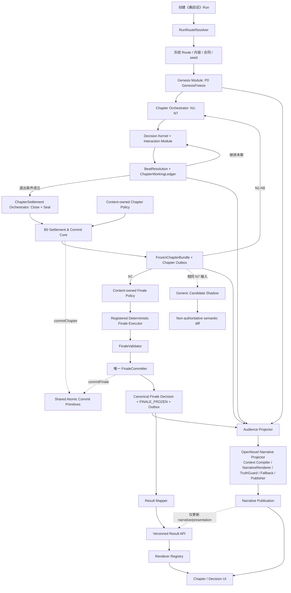
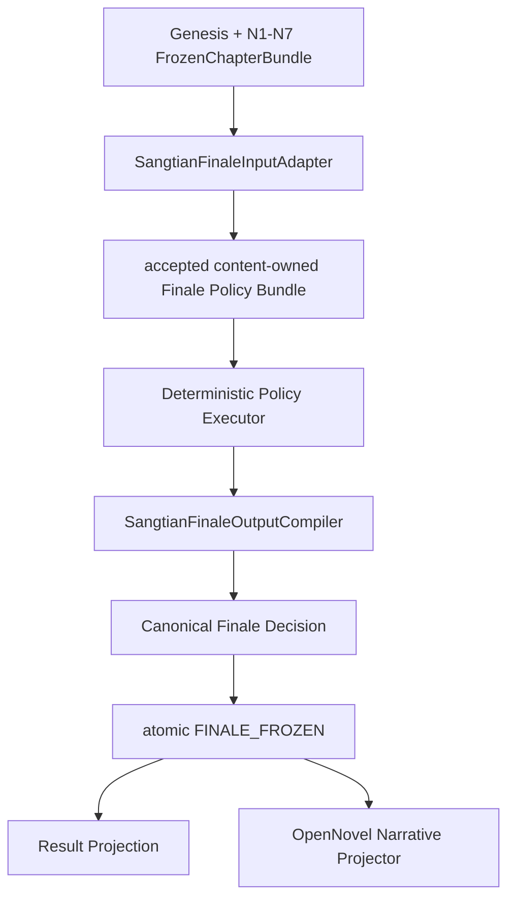

# Our Many Worlds
# 《桑田诏》Pressure + OpenNovel 统一权威路由与冲突消解规范 v1.0

> 文档状态：六类冲突均已形成正式决议；本文作为模块化完整功能的开发与测试基线，代码尚未实施。  
> 决策日期：2026-08-11。  
> 适用对象：新建《桑田诏》单人 Run、新建《桑田诏》多人 Run，以及相关 Result、Narrative、Legacy 兼容与重玩链路。  
> 本文只定义冲突消解后的目标合同、实施顺序和验收边界，不表示代码已经修改、测试已经执行或候选已经通过验收。  
> 本文不迁移、不重算、不覆盖任何已创建或已完成 Run。
> 本次修订把“每节点固定 PREPARE/COMMIT/REACTION”替换为“连续章节剧情 + 内容驱动 DecisionPoint + 章内可恢复 WorkingState + 每章唯一 ChapterSettlement”；该替换只适用于本文定义的新 runtimeProfile。

---

# 0. 文档性质与规范词

本文是以下五份方案之间的上位冲突消解规范：

1. `Our_Many_Worlds_桑田诏_MVP游戏运行机制开发与测试统一规格_v1.0.1.md`；
2. `Our_Many_Worlds_Solo_Endgame_MVP_单人终局裁定与重玩闭环_完整实现测试方案_v1.0.md`；
3. `Our_Many_Worlds_Multiplayer_Endgame_MVP_多人共同终局裁定与重玩闭环_完整实现测试方案_v1.0.md`；
4. `Our_Many_Worlds_B0同步结算多人博弈_完整实施开发测试与受控上线方案_v1.0.md`；
5. `Our_Many_Worlds_Generic_Endgame_MVP_配置驱动通用终局引擎_完整实现测试方案_v3.0.md`。

本文使用以下规范词：

- **MUST / 必须**：实现和验收不可省略；
- **MUST NOT / 禁止**：任何实现均不得违反；
- **SHOULD / 应当**：默认执行，偏离时必须记录理由与替代证据；
- **MAY / 可以**：允许但不是本版本硬门；
- **Legacy**：仅服务已按旧版本创建的 Run，不表示错误或待删除；
- **New Run**：本文生效后，由正式新建入口创建且尚未冻结版本的 Run。

---

# 1. 最终决策

## 1.1 一句话结论

> **新《桑田诏》单人和多人共用同一套 Pressure 权威游戏内核；OpenNovel 在所有活动链路中只承担小说化 Narrative Projection，不再承担第二套状态机、第二事实源、第二终局裁定器或权威提交 veto。**

统一链路为：

```text
Run Route Freeze
→ P0 GenesisFreeze
→ N1—N7 连续章节剧情
→ 章内多个内容驱动 DecisionPoint / BeatResolution
→ Chapter Close + Sealed Settlement Input
→ B0 Settlement & Commit Core
→ 每章唯一 ChapterSettlement
→ FrozenChapterBundle
→ Content-owned Finale Policy + Registered Deterministic Executor
→ FinaleValidator + 唯一 FinaleCommitter
→ Canonical Finale Decision / FINALE_FROZEN
├→ Versioned Result API → 立即返回结构化权威结局
└→ Narrative Outbox → Audience Projection
   → OpenNovel Narrative Projector
   → Narrative Artifact / presentationHash
   → Result 展示更新（不改变权威结果）
→ 独立 Replay Command（仅在玩家确认后创建新 Run/Lobby）
```

## 1.2 用户可见产品形态

- 产品只提供一个新的“《桑田诏》单人”入口；
- 新单人表示“1 名真人控制 1 个制度席，另外 5 席由 AI 控制”；
- 新多人表示“2—6 名真人控制相应制度席，其余席位由 AI 补齐”；
- 单人和多人使用相同的章节、DecisionPoint、对象、知识、ChapterSettlement、FrozenChapterBundle 和 Finale；
- 用户仍然可以获得 OpenNovel 风格的章节、人物视角、最后一幕和文学表达；
- 用户不需要知道内部存在 Pressure Runtime 与 OpenNovel Narrative Projector 两个组件。

## 1.3 Legacy 结论

- 停止创建新的 `openovel_v1` / T20 Run；Legacy `RESTART_SAME_EXPERIENCE` 不再创建 T20；
- 已完成 Legacy Run 及其 Ending/Head/Result 永不重算、永不改写，只通过 Legacy Adapter/Renderer 读取；
- 进行中的 Legacy OpenNovel Run 不迁移为 Pressure 世界状态机，但在到达 T20 终局时 MUST 经 `LegacyTerminalInputAdapter` 进入统一的 authority-first terminal commit；
- `SangtianEndingModule` 不再拥有 Narrative 与权威结果同一 Head 提交的权限；其可复用确定性分类能力必须抽为无 Provider、无提交权的 evaluator/adapter；
- 已有 `continuous_story_v2` Run 继续使用其冻结 ActorThread/`EndgameMvpV1` 领域规则，但所有尚未执行的文学投影同样服从“权威先提交、OpenNovel 后生成”；
- Legacy Result 继续按其冻结 Schema 返回；历史读取兼容不等于保留第二种活动终局失败策略；
- 新建《桑田诏》单人和多人只创建 Pressure Run。

---

# 2. 为什么必须这样收敛

此前文档把“Solo”同时用作两个不同概念：

1. **参与形态**：只有 1 名真人；
2. **运行引擎**：OpenNovel T20。

新方案将两者拆开：

- `participantMode` 决定真人数量与席位控制；
- `runtimeProfile` 决定真正的世界状态机；
- 新单人只是 Pressure Runtime 的一种控制拓扑，不是第二套游戏引擎。

同一个 Run 不能同时以 T20 和 P0/N1—N7 作为权威时钟，也不能同时让 `SangtianEndingModule`、`EndgameMvpV1`、`ConfigDrivenEndingModule` 和内容包 Finale 争夺终局权威。

因此，本方案统一的是**权威内核**，保留的是 OpenNovel 的**文学表达能力**。

---

# 3. 权威顺序

## 3.1 《桑田诏》领域事实

新《桑田诏》Pressure Run 的领域权威顺序为：

1. accepted content package：P0—N7 的场景、决策与结算规则，六席、对象、知识、branch selector、默认轨迹、五轨与 Finale；这些领域事实由新 profile 编译为 `GenesisSnapshot`、`WorkingDelta` 与 `FrozenChapterBundle`；
2. Run 创建时冻结的版本、package hash、run seed 与席位拓扑；
3. GenesisSnapshot、sealed DecisionAction、ChapterWorkingLedger、FrozenChapterBundle、ordered root events 和 Finale Decision；
4. 可重建的服务端 projection；
5. Narrative 与 Web 展示。

Narrative、Web、本地缓存、Prompt、模型推理和当前默认配置均不得反向覆盖上游权威。

依据：运行机制规格 L69—90、L825—846。

## 3.2 本文与旧文档的关系

- 本文负责新《桑田诏》Run 的跨文档路由、所有权和冲突决议；
- 运行机制 v1.0.1 继续提供 accepted content package、P0—N7 顺序、六席、对象、知识、证据、责任、五轨和 Finale 等领域事实；
- 运行机制 v1.0.1 中固定“每节点恰好一个 PREPARE、一个 COMMIT、N2/N4/N7 可选 REACTION”的 phase graph、三槽唯一键、附件 hash 与对应测试，只继续约束按该版本创建的既有 V1 Run；它们不约束本文的新 Continuous Chapter Run；
- 本文第 7—8 节及其新机器合同是新 Continuous Chapter Run 的节奏、状态机和持久化上位规范；不得静默修改旧附件或让新旧 profile 共用同一个 contract/hash；
- Solo Endgame v1 的历史数据格式、确定性分类和 Result 读取只在 Legacy OpenNovel 范围内继续有效；其“最后一幕失败则 T20/Ending/Head 整体不提交”条款被本文统一终局合同取代；
- Multiplayer Endgame v1 只在 Legacy Continuous Story V2 范围内继续有效；
- B0 的同快照、稳定排序、原子提交、Outbox、幂等和 NarrativeRenderer 非权威原则可以复用；
- Generic v3 可以服务其他新世界；对《桑田诏》只允许复用纯 toolkit/执行器，旧配置不得接管；阶段 2 candidate 只 shadow，阶段 3 只有等价验收和新 policyVersion 后才作用于后续新 Run。

## 3.3 工程现实

精确源码、现有 API、Prisma 模型和当前测试决定具体落点。第 16.1 节记录了本次 exact-SHA 能力快照；实施时若最新源码与本文目标合同不一致，应登记为工作包实现缺口并重新审计 SHA，而不是用现状反向修改本文的产品决策。

---

# 4. 术语

| 术语 | 定义 |
|---|---|
| Pressure Runtime | 新《桑田诏》唯一权威运行内核，执行 P0 Genesis、N1—N7 连续章节、章内 DecisionPoint、ChapterSettlement 与 Freeze |
| `OpenNovelNarrativeProjector` | 完整文学投影模块；产品文案可写作“OpenNovel Narrative Projector”；内部包含 `NarrativeContextCompiler`、`NarrativeRenderer`、`NarrativeTruthGuard`、`NarrativeFallbackRenderer` 与 `NarrativePublisher`，不是终局裁定器 |
| NarrativeRenderer | OpenNovel Narrative Projector 内部负责调用 Provider 或 authored template 生成文字的组件；旧文档中的 `Narrator` 在本文统一指该内部组件，不是独立业务模块 |
| NarrativeArtifact | 绑定 `sourceCommitHash/sourceContentHash/audience` 的非权威文学产物；可以重试或发布新 revision，但不能修改来源权威状态 |
| Legacy OpenNovel Run | 已按 OpenNovel T20 规则创建的历史 Run；完成记录只读，未完成 Run 在终局时经统一 LegacyTerminalInputAdapter 提交，不再保留 Narrative 回滚行为 |
| LegacyTerminalInputAdapter | 将进行中 Legacy T20 的确定性状态、Canon、Ending 和 Result 编译为统一 authority-first terminal command；不得读取或生成 Narrative |
| Authoritative Terminal Commit | 在任何文学生成前原子提交状态、Canon、Ending/Finale、Result 和 Narrative Outbox 的统一活动终局合同 |
| Legacy Continuous Story V2 Run | 已按 ActorThread/Continuous Story V2 创建的历史多人 Run |
| GenesisFreeze | P0 建立并冻结初始权威世界的领域操作；不是玩家行动结算，也不是持久化实体名 |
| GenesisCommit | `GenesisFreeze` 的唯一原子提交记录；每个 Run 恰好一个，记录输入、输出、hash、sequence=0 与事务证明 |
| GenesisSnapshot | `GenesisFreeze` 产生的不可变初始世界快照；是 N1 的唯一 Frozen 输入，可由 `GenesisCommit` 引用和校验 |
| ChapterRuntime | N1—N7 某一章的运行聚合，拥有状态、内容版本、工作修订号、退出条件和唯一结算引用 |
| DecisionPoint | 内容包在章节剧情中声明的正式决策点；只有会影响规则状态的行动才进入正式账本 |
| BeatResolution | 对一个正式 DecisionPoint 的确定性局部解析；产生 WorkingDelta，不推进世界序号 |
| ChapterWorkingState | 当前章节内可恢复、可继续推演的权威工作态；对本章后续决策有约束，但尚未成为跨章 Frozen 世界 |
| WorkingDelta | BeatResolution 对 ChapterWorkingState 的追加式变化，包括预留、承诺、章内知识和局部反馈 |
| ChapterSettlement | 章节结束时对本章完整正式行动账本执行的唯一确定性总裁定 |
| FrozenChapterBundle | ChapterSettlement 原子提交后的不可变章末权威结果，包含共同世界、六席主线、五轨、对象、证据、知识、责任、因果与 carry-forward |
| SeatArcState | 每个制度席在共同世界中的个人主线状态；不能脱离共同世界独立推进或独立裁定终局 |
| Finale Decision | N7 Frozen 后，由唯一 Finale Policy 产生的不可变世界结局和六席裁定 |
| terminal trigger | 某 runtimeProfile 进入唯一终局裁定器的触发条件 |
| Run Route | Run 创建时冻结的引擎、策略、Runtime、终局和结果 Schema 组合 |
| Result Envelope | Result API 的公共外壳，用于声明实际 payload 的版本与来源 |
| Narrative | 从权威事实派生的文学文本，不是事实或胜负来源 |
| deterministic replay | 使用相同冻结输入重算并验证 hash 相同 |
| product replay | 用户创建一个新的 Run 重新体验；不得覆盖旧 Run |

特别规定：

> `Solo` 只表示参与形态，不再自动等于 OpenNovel、T20 或任何具体裁定器。

---

# 5. 目标架构



箭头只允许自上游流向下游：

- Narrative 不得反向修改 Finale Decision；
- Result Mapper 不得重新裁定；
- Web 不得补造或推断结果；
- AI 席位只提交候选/合法 action，不得直接写世界；
- Generic 工具层不得绕过 Pressure Finale Policy；阶段 1 只能做 candidate shadow，未来只有冻结了新 policyVersion 的新 Run 才能把 Generic-backed executor 注册为正式实现；
- ChapterSettlement Orchestrator 只负责关闭和封存，不得自己实现第二套 Commit；
- B0 Core 不得拥有《桑田诏》世界规则、Finale verdict 或 Narrative 能力；
- OpenNovel 只能消费 B0/Finale 已提交且经 Audience Projector 过滤的 DTO。
- 所有能够继续完成的活动 Run，包括进行中的 Legacy T20，必须先完成 Authoritative Terminal Commit 再调用 OpenNovel；不存在 NarrativeRenderer 失败后撤销权威提交的例外路径。

---

# 6. 组件职责与唯一生产者

| 产物/能力 | 唯一生产者 | 只读消费者 |
|---|---|---|
| Run Route | RunRouteResolver / Run 创建事务 | 所有 API、Worker、Projector、Renderer |
| P0 初始权威状态 | Genesis Module | Chapter Orchestrator、Projection、审计 |
| 章节与 DecisionPoint | Chapter Orchestrator / Decision Kernel | Projection、Web、AI Seat |
| sealed DecisionAction | Action Confirm/Seal 服务 | BeatResolution、ChapterSettlement |
| ChapterWorkingState | Chapter Working Ledger | Decision Kernel、Interaction、Projection |
| BeatResolution / WorkingDelta | Beat Resolution Module | Working Ledger、Narrative、章末 Settlement |
| SealedChapterSettlementInput | ChapterSettlement Orchestrator | B0 Settlement & Commit Core、审计与恢复 |
| ChapterSettlementEvaluation | Content-owned Chapter Policy 经纯 evaluator | B0 Validator/Committer、审计 |
| ChapterSettlement / FrozenChapterBundle | B0 Settlement & Commit Core 唯一原子事务 | 下一章、Finale、Projection、Narrative |
| 世界结局与六席 verdict | `SangtianContentFinalePolicy` 经唯一 Finale Engine | Result Mapper、Narrative、Generic shadow comparison |
| Finale 持久化 | 唯一 FinaleCommitter，经 B0 Atomic Commit primitives | Result、审计与恢复 |
| Legacy T20 终局输入 | `LegacyTerminalInputAdapter` | 统一 Authoritative Terminal Committer |
| 活动 Legacy Ending/Canon/Result 持久化 | 统一 Authoritative Terminal Committer；不含 NarrativeArtifact | Legacy Result Adapter、OpenNovel Narrative Projector、审计 |
| 文学文本 | OpenNovel Narrative Projector | Result Mapper、Web |
| Result payload | 服务端 Result Mapper | Web Renderer |
| 页面结构 | 对应 Schema Renderer | 用户 |

## 6.1 唯一生产者硬约束

- 一个 `runtimeProfile` MUST 只注册一个 terminal trigger；
- 一个 `endgamePolicyVersion` MUST 只绑定一个终局裁定器；
- 一个 Run MUST 只产生一个正式 Finale Decision；
- 一个 Result 字段 MUST 有唯一服务端生产者；
- Web MUST NOT 生产 verdict、gain、loss、cause、reveal 或 replay route；
- Narrative MUST NOT 生产 branch、track、object outcome、custody、responsibility 或 verdict。

## 6.2 模块边界

模块是代码职责和接口边界，不要求立即拆成独立微服务。第一版 SHOULD 在现有 monorepo 内以 package/module/port 隔离：

| 模块 | 只拥有 | 必须调用/读取 | 禁止直接做 |
|---|---|---|---|
| Run Router | 路由注册、冻结、分派 | Registry、Run 存储 | 结算、叙事、终局 |
| Genesis Module | P0 初始快照与一次 GenesisFreeze | accepted P0 内容 | 玩家行动、ChapterSettlement |
| Chapter Orchestrator | N1—N7 生命周期、退出条件、DecisionPoint 调度 | 内容编排、WorkingState | 计算 Finale、生成文学正文 |
| Decision Kernel | 根据当前工作态选择/编译下一正式决策 | 内容 Kernel、WorkingState | 写 Frozen 世界 |
| Interaction Module | 聊天、私聊、调查、交易协商和目标席参与 | Audience、DecisionPoint | 将普通聊天偷偷变成行动 |
| Chapter Working Ledger | 追加 WorkingDelta、修订号、预留和承诺 | BeatResolution | 推进 `worldSequence` |
| Beat Resolution | 局部确定性解析 | sealed actions、当前 working revision | 创建 FrozenChapterBundle |
| ChapterSettlement Orchestrator | 章末退出 guard、拒绝新行动、封存输入、调用唯一 B0 Core | 前章 Frozen、完整 ledger、最终 working hash、内容/合同版本 | 自己计算世界规则、直接写世界、生成文学文本 |
| Content-owned Chapter Policy | 定义五轨、对象、知识、证据、责任和六席 SeatArc 的章末规则 | Sealed input、accepted content package | 事务、数据库写入、模型调用、Narrative |
| B0 Settlement & Commit Core | 同快照、canonical batch/hash、稳定排序、调用 policy port、WorldDelta 校验、CAS/原子提交、manifest、Outbox、幂等恢复 | Sealed input、Chapter Policy evaluator、权威 Repository ports | 定义世界专用规则、选择下一剧情、Finale verdict、Provider/Narrative |
| Seat Control / AI | HUMAN/AI 控制、default、handoff/reclaim | RoleControl、DecisionPoint | 绕过 Action API 写世界 |
| Audience Projector | 先于任何模型调用做权限裁剪 | committed source、viewer identity | 根据文案猜权限 |
| OpenNovel Narrative Projector | audience-safe 结构化结果到文学表达；内部拥有 Context Compiler、NarrativeRenderer、Truth Guard、Fallback、Publisher | 已提交 DTO、source commit/hash、Narrative Outbox | 裁胜负、改资源、造事实、阻塞或撤销 Authoritative Commit |
| Finale Engine | N7 后唯一世界/六席裁定 | 内容包 policy、N1—N7 bundles | 读取 Narrative/Prompt |
| Legacy Terminal Adapter | 把进行中 T20 状态编译成确定性 Ending/Canon/Result command | 冻结 Legacy route、T20 settled state | 调用 Provider、生成最后一幕、保留旧回滚语义 |
| Persistence / Outbox | Repository/transaction/outbox port 实现、唯一键、CAS、恢复 | 已验证 domain commands/events | 改变领域规则、绕过 B0/FinaleCommitter 直接解释输入 |
| Result / Web | 权限安全 DTO 与 renderer | frozen route、Finale、Narrative | 自行计算 verdict/cause |

依赖方向 MUST 是 `domain contracts ← domain services ← adapters/infrastructure`。核心模块只能依赖 `NarrativeProjector`、`Clock`、`Outbox`、`Repository` 等 port，不得 import OpenNovel provider、Web renderer 或具体数据库客户端来决定规则。

## 6.3 端到端运行链与阶段所有权

下面的链路是新《桑田诏》Solo 与 Multiplayer 共用的唯一产品链；参与人数只改变 RoleControl，不改变阶段、规则、结算和终局所有权。

| 阶段 | 唯一 Owner | 输入 | 正式输出 | 权威写入 | 失败语义 |
|---|---|---|---|---|---|
| S0 创建 Run | Run Router / 创建事务 | world、participantMode、选角/房间、当前注册表 | 冻结 RunRouteSnapshot、seed、内容/合同 hash、初始控制拓扑 | 一次 | 非法组合 fail-closed，零 Genesis |
| S1 P0 Genesis | Genesis Module | 冻结 route、accepted P0 内容、seed、六席控制 | GenesisSnapshot/GenesisCommit、N1 opening outbox | `sequence=0`，一次 | 并发/崩溃只得到一个 Genesis；Narrative 不回滚 |
| S2 章节编排 | Chapter Orchestrator / Decision Kernel | 上一 Frozen、当前 WorkingState、内容 requirement | ChapterRuntime、DecisionPointPlan | 只写章工作域 | 缺配置/依赖 fail-closed；不写 Frozen 世界 |
| S3 玩家互动 | Interaction / Action Seal | 公聊私聊、正式选择、controlEpoch、revision | Message 或 sealed DecisionAction | 普通聊天与正式行动分流 | stale/越权/重复请求零正式写入 |
| S4 局部解析 | Beat Resolution / Working Ledger | 当前 point、sealed actions、working revision | BeatResolution、WorkingDelta、reservation/commitment/knowledge 更新、feedback outbox | 只写章工作域 | 可恢复；不得推进 worldSequence |
| S5 关闭与封存 | ChapterSettlement Orchestrator | exit predicate、完整 ledger、最终 working hash | 不可变 SealedChapterSettlementInput + inputHash | 封存后拒绝新正式行动 | 未闭合 point/reaction/default 时不得进入 B0 |
| S6 章末权威结算 | B0 Settlement & Commit Core | Sealed input、共同 Snapshot、Content Chapter Policy | ChapterSettlement、WorldDelta、FrozenChapterBundle、commit manifest、next/finale outbox | 每章唯一事务，`worldSequence + 1` | 验证/事务失败整体零写；同 fingerprint 幂等恢复 |
| S7 章后分派 | Audience Projector / Outbox | 已提交 Bundle、viewer/control/knowledge | viewer-safe 结构化结果、CHAPTER_NARRATIVE job、N1—N6 下一章任务 | 非权威投影/任务 | 发布失败可重试，不回滚 Bundle |
| S8 N7 Finale | Finale Engine + 唯一 FinaleCommitter | Genesis、七个连续 Bundle、Content Finale Policy | worldOutcome、六席 verdict、FinaleDecision、`FINALE_FROZEN`、outbox | 每 Run 唯一事务 | evaluator/validator/commit 失败 fail-closed；Narrative 不参与事务 |
| S9 文学投影 | Audience Projector + OpenNovel Narrative Projector | 已提交且 audience-safe 的 Genesis/Beat/Chapter/Finale DTO | Narrative artifact/status/presentationHash | 只写非权威投影 | Provider/Validator 失败重试或 fallback，不改任何权威 hash |
| S10 Result / Replay | ResultQueryService / Replay Command | frozen route、Finale/Legacy Result、Narrative、viewer | versioned Result Envelope；经确认后创建新 Run/Lobby | GET 零业务写；Command 幂等新建 | 未知 Schema fail-closed；旧 Run 永不解冻或重算 |

## 6.4 全链路共同不变量

1. 每个权威产物只有一个生产者；任何 Adapter、Projector、Renderer 均不得成为第二事实源。
2. P0 只提交 Genesis；N1—N7 每章只由 B0 Core 提交一个 FrozenChapterBundle；N7 后只由 FinaleCommitter 提交一个 FinaleDecision。
3. Beat、Narrative、Result 和普通聊天均不得推进 `worldSequence`。
4. B0 Core 只接受不可变 Sealed input，不扫描聊天正文、不调用 Decision Kernel，也不根据 Narrative 判断行动含义。
5. Content Policy 定义“规则是什么”；冻结路由注册的纯 evaluator 执行规则；B0/FinaleCommitter 负责“怎样验证并安全盖章”。Generic 在阶段 1 仅做无写权限 candidate shadow。
6. Audience Projector 在任何 Provider 调用前执行；Provider、日志、重试和 dead-letter 都不得得到未授权六席全量秘密。
7. 所有活动运行路径的权威提交事务与 Narrative 发布事务必须分离；Outbox 可以与权威提交同事务创建，但 NarrativeRenderer/Provider/TruthGuard/Publisher 必须发生在提交之后。
8. 同一冻结输入的 canonical hash、evaluation hash、commit hash 和最终业务 hash 在刷新、重启、重试、数组排列变化下保持稳定。
9. 已完成 Legacy OpenNovel T20、ActorThread 和旧 B0 Window 继续按冻结 route 只读；进行中 Legacy 可保留其产品时钟和领域输入，但终局必须适配统一 authority-first commit，且不得把旧提交单位混入新 Chapter profile。

## 6.5 所有活动终局统一链路

“统一”指所有尚可能执行一次终局提交的 Run 使用同一行为合同；不要求把不同 Runtime 的领域状态强塞进同一数据表，也不重写已完成历史记录。

```text
Pressure N7 / Legacy T20 / Legacy Multiplayer terminal state
        ↓
对应的确定性 Terminal Input Adapter
        ↓
对应的确定性 Evaluator + Validator
        ↓
Authority-first Terminal Commit
一次原子写入：
- authoritative state / Canon
- Ending 或 FinaleDecision
- Result payload/reference
- terminal receipt/root event
- Narrative Outbox
        ↓ commit 成功后立即分叉
        ├─ Result API：结构化结果可读
        └─ Audience Projector
              ↓
           OpenNovel Narrative Projector
           ContextCompiler → NarrativeRenderer
           → TruthGuard → Fallback → Publisher
              ↓
           NarrativeArtifact / presentationHash
```

各 Runtime 可以有不同的 Terminal Input Adapter、Evaluator 和 Result Schema，但 MUST 共享以下不可变合同：

1. Authority Commit command 不包含 `finalSceneNarrative`、Prompt、Provider response 或模型生成文本；
2. 权威事务只允许创建 Narrative Outbox，不允许同步调用 OpenNovel/Provider；
3. Authority Commit 成功后 `structuredResultReady=true`，不等待 Narrative；
4. NarrativeArtifact 必须绑定 `sourceCommitHash/sourceContentHash/audience`；
5. NarrativeRenderer/TruthGuard/Publisher 任一点失败只改变 NarrativeProjection 状态；
6. 已完成历史 Run 不重新进入该链，只由只读 Adapter/Renderer 返回其既有数据；
7. 不实现 `LEGACY_ATOMIC_HEAD`、Narrative rollback feature flag 或按 runtimeProfile 分叉的失败策略。

---

# 7. Run 路由与版本冻结

## 7.1 最小冻结五元组

每个 Run 创建时 MUST 冻结：

```ts
interface FrozenRunRouteV1 {
  engineVersion: string;
  strategyVersion: string;
  runtimeProfile: string;
  endgamePolicyVersion: string;
  /** Result API payload 的外层业务 Schema，不是内层 presentation Schema。 */
  resultSchemaVersion: string;
}
```

`resultSchemaVersion` 的语义固定为 Result API `payload` 的完整 Schema：

- Legacy Solo：`openovel_result_v2`；
- Legacy Multiplayer：`continuous_story_result_v3`；
- Pressure：`sangtian_pressure_result_v1`；
- Generic：当前为 `endgame_presentation_v3`。

它不得被解释成 renderer key，也不得与内层 `presentationSchemaVersion` 混用。

## 7.2 同时冻结的可复现输入

除五元组外，还必须冻结或不可变引用：

```ts
interface FrozenRunExecutionRefV1 {
  route: FrozenRunRouteV1;
  contentPackageVersion: string;
  contentPackageSha256: string;
  orchestrationPackageVersion: string;
  orchestrationPackageSha256: string;
  runtimeContractVersion: string;
  runtimeContractSha256: string;
  testMatrixVersion: string;
  testMatrixSha256: string;
  runSeed: string;
  narrativeProfileVersion: string;
  featureSetVersion: string;
  resultContractRegistryVersion: string;
  participantMode: "SOLO" | "MULTIPLAYER";
  seatIds: string[];
  humanSeatIdsAtStart: string[];
  controlTopologyVersion: string;
  initialRoleControlSnapshotHash: string;
}
```

其中：

- `contentPackage*` 冻结 P0—N7 的故事事实、六席、对象、五轨和 Finale 规则；
- `orchestrationPackage*` 冻结章节编排、DecisionPoint、退出条件和允许的互动模式；
- `runtimeContract*` 冻结本节定义的状态机、Schema 与事件 vocabulary；
- `testMatrix*` 指向和该合同同时发布的机器可读验收矩阵；
- 任一 hash 尚未生成时不得写 `TBD` 后创建正式 Run；
- 新 profile 不得复用运行机制 v1.0.1 固定三槽附件的文件名或 hash。

`participantMode` 与初始控制拓扑在 Run 正式开始、Lobby 锁定后冻结。之后的掉线接管、handoff 与 reclaim 必须作为有序控制权事件记录；它们不得修改初始快照，也不得改变 Run 的参与模式。

## 7.3 初始路由矩阵

以下 key 是规范性逻辑标识。实施前必须核实实际已存储的 Legacy key，不得为统一命名而回填历史 Run。

| Run 类型 | engineVersion | strategyVersion | runtimeProfile | endgamePolicyVersion | resultSchemaVersion |
|---|---|---|---|---|---|
| 新《桑田诏》单人 | `pressure_chapter_v1` | `sangtian_pressure_chapter_v1_0` | `SANGTIAN_CONTINUOUS_CHAPTER_V1` | `sangtian_content_finale_v1` | `sangtian_pressure_result_v1` |
| 新《桑田诏》多人 | `pressure_chapter_v1` | `sangtian_pressure_chapter_v1_0` | `SANGTIAN_CONTINUOUS_CHAPTER_V1` | `sangtian_content_finale_v1` | `sangtian_pressure_result_v1` |
| Legacy OpenNovel Solo | 已存储 Legacy 值 | 已存储 Legacy 值 | `OPENNOVEL_T20_V1` 或已存储等价值 | `sangtian_openovel_ending_v1` 或已存储等价值 | `openovel_result_v2` |
| Legacy Continuous Story V2 | `continuous_story_v2` 或已存储等价值 | 已存储内容版本 | `CONTINUOUS_STORY_ACTOR_THREAD_V2` 或已存储等价值 | `endgame_mvp_v1` | `continuous_story_result_v3` |
| Generic 新世界 | 由 Generic Registry 决定 | 世界配置版本 | `CONFIG_ENDGAME_RUNTIME_V1` | `config_driven_endgame_v3` | `endgame_presentation_v3` |

`Legacy OpenNovel Solo` 行只用于读取既有 Run、继续其已提交 T20 世界状态并在终局时解析正确 Adapter；它不是 Create Registry 项。所有 Create/Replay-SAME/Internal-create 路径 MUST 拒绝新建该五元组。`Legacy Continuous Story V2` 的新建能力独立管理，不得因此开放 T20。

B0 当前只进入本文的基础设施原则对照，不进入本版本的完整 Run 路由验收矩阵。原因是 B0 文档尚未定义可冻结的 terminal policy 与 result schema。

上表中的新 key 是本文为目标功能冻结的正式逻辑标识。实现若发现某 key 已在生产 Registry 中占用，必须发布语义等价的新 key 并修订本文与机器合同；禁止把本文语义塞进旧 `SANGTIAN_PRESSURE_SPINE_V1` 后继续沿用旧 hash。

任何 B0 Run 在其终局文档补齐前：

- 不得声称满足本文 `FrozenRunRouteV1`；
- 不得用空值、`TBD` 或运行时猜测代替 `endgamePolicyVersion/resultSchemaVersion`；
- 不得复用 Pressure、Legacy 或 Generic 的裁定器作为静默 fallback；
- 只有在另立规范并给出完整五元组后，才能加入统一 Registry。

## 7.4 路由解析规则

Run 创建事务必须：

1. 根据正式产品入口解析目标 world 与体验版本；
2. 从服务端 Registry 获得完整路由；
3. 校验五元组、package hash、policy、result adapter、presentation schema 和 renderer 均已注册；
4. 原子保存冻结值；
5. 创建六个制度席，冻结 participantMode 与初始控制拓扑；
6. 返回带 `runtimeProfile` 的正式 projection。

所有后续请求必须先读取 Run 的冻结路由，再分派：

```text
request
→ load Run
→ verify membership/control
→ read frozen route
→ dispatch registered handler
→ reject mismatch
```

禁止：

- 按 `worldId === "sangtian"` 猜 Runtime；
- 按 `playerCount === 1` 猜 OpenNovel；
- 按当前 `game.json` 或最新默认配置重新解释旧 Run；
- 按 feature flag 把已创建 Run 切换到另一套裁定器；
- 发现未知 route 时“尽量降级”到 Legacy。

## 7.5 路由失败

任一冻结版本缺失、未注册、hash 不符或 handler 不匹配时必须 fail-closed，并返回稳定错误码，例如：

- `RUN_ROUTE_INCOMPLETE`；
- `RUNTIME_PROFILE_UNSUPPORTED`；
- `ENDGAME_POLICY_MISMATCH`；
- `RESULT_SCHEMA_UNSUPPORTED`；
- `CONTENT_PACKAGE_HASH_MISMATCH`。

不得通过调用另一套 Runtime 或裁定器进行静默恢复。

---

# 8. 新单人和新多人的 Continuous Chapter 运行合同

## 8.1 唯一差异：控制拓扑

| 项目 | 新单人 | 新多人 |
|---|---|---|
| 真人席位 | 1 | 2—6 |
| AI 席位 | 5 | 0—4 |
| P0 Genesis / N1—N7 | 相同 | 相同 |
| DecisionPoint / WorkingState | 相同 | 相同 |
| ChapterSettlement / FrozenChapterBundle | 相同 | 相同 |
| Finale Policy | 相同 | 相同 |
| 权限投影 | 按当前真人席 | 按各真人席 |

- 六个 `StoryRole` 永远存在；
- `RoleControl` 决定 HUMAN_ACTIVE、AI_ACTIVE、离线接管与 reclaim；
- AI 失败必须使用内容包确定性 default；
- 真人或 AI 请求到达顺序不得影响同一输入的 Resolution；
- 玩家数量不得进入胜负规则分支；
- 单人不得把其他五席降级为无规则背景 NPC；
- `ActorThread` MAY 作为每席 Narrative/Projection 流，但 MUST NOT 成为章节权威时钟或独立终局触发器。

依据：运行机制规格 L277—283；旧 Multiplayer ActorThread 的终局语义只保留给 Legacy V2。

## 8.2 产品运行不变量

新《桑田诏》采用：

> **连续章节剧情 + 内嵌多个内容驱动决策与互动点 + 每章唯一 ChapterSettlement。**

具体含义：

1. P0 只建立序章与初始权威世界，执行一次 `GenesisFreeze`；
2. 玩家从 N1 开始，在同一章节中持续阅读剧情、交谈、调查、谋划、交易、使用能力并推进个人主线；
3. 内容包可声明任意数量的剧情 Beat 和正式 DecisionPoint，Runtime 不把“普通章两个窗口、关键章三个窗口”写成产品硬规则；
4. 普通聊天、私聊、试探和角色扮演可以发生，但只有会改变资源、承诺、技能、对象、知识、证据、责任、关系或规则状态的选择才形成正式 `DecisionAction`；
5. 每个正式 DecisionPoint 经过一次 `BeatResolution`，只更新可恢复的 `ChapterWorkingState`；
6. 章内反馈可以影响本章后续剧情与决策，但不得生成跨章 `FrozenChapterBundle`，也不得推进 `StoryRun.worldSequence`；
7. 章节退出条件成立后，系统综合本章全部正式行动、预留、承诺和局部解析，执行恰好一次 `ChapterSettlement`；
8. N1—N6 的 FrozenChapterBundle 成为下一章唯一权威输入；N7 Frozen 后进入唯一 Finale。

流程节点固定为一个 P0 序章加 N1—N7 七个正式可玩章节。实现中的 `chapterCount`、`chapterSequence`、`ChapterRuntime` 和“每章一次 ChapterSettlement”均只计算 N1—N7：`chapterCount=7`，`chapterSequence=1..7`；P0 由 Genesis 合同单独计数。章内 DecisionPoint 数量由内容决定。实现 MAY 配置安全上限防止损坏内容产生无限循环，但该上限是故障保险，不是玩家可见的固定行动额度，也不能在正常内容中代替退出条件。

## 8.3 三层状态与权威范围

| 层 | 示例 | 权威范围 | 是否推进 worldSequence | 是否可被 Narrative 修改 |
|---|---|---|---:|---:|
| Frozen World | GenesisSnapshot、N1—N7 FrozenChapterBundle、FinaleDecision | 跨章/终局唯一事实 | Genesis=0；N1—N7 每章 +1 | 否 |
| Chapter Working | DecisionAction、reservation、commitment、WorkingDelta、BeatResolution | 当前章节后续决策的正式工作事实 | 否 | 否 |
| Narrative Projection | 对话、描写、章节文字、角色视角、最后一幕 | audience-safe 表达 | 否 | 不适用 |

`ChapterWorkingState` 不是随时可丢弃的 UI 草稿。它 MUST 持久化、版本化、可重放，对当前章后续决策具有约束力；但只有 ChapterSettlement 才能把本章累计结果冻结为下一章和 Finale 可读取的世界事实。

若前一 Beat 的 WorkingDelta 后来需要被推翻，禁止覆盖或删除旧记录；必须追加一个有明确原因和 source reference 的补偿/反转 LedgerEntry，并由 ChapterSettlement 统一裁定。

### 8.3.1 跨模块共享权威类型

模块之间禁止传递没有 Schema 的任意 JSON。`PC-W0` MUST 在 `packages/shared/src/pressure-chapter/` 冻结下列类型及对应 JSON Schema、canonical serializer、validator 和 hash 规则；字段扩展只能发布新 `schemaVersion`，不得让调用方读取未声明字段猜语义。

```ts
type ChapterIdV1 = "N1" | "N2" | "N3" | "N4" | "N5" | "N6" | "N7";

type SeatIdV1 =
  | "cabinet_finance"
  | "jiangnan_merchant"
  | "qingliu_law"
  | "sili_weaving"
  | "zhejiang_administration"
  | "zhejiang_governor";

type TrackIdV1 =
  | "civilian_land"
  | "mulberry_silk"
  | "fiscal_military"
  | "evidence_responsibility"
  | "court_imperial_face";

type ScalarFactValueV1 = string | number | boolean | null;

interface TrackStateV1 {
  schemaVersion: "sangtian_track_state_v1";
  values: Record<TrackIdV1, number>;
  stateHash: string;
}

interface ObjectStateV1 {
  objectId: string;
  version: number;
  stateCode: string;
  holderSeatId: SeatIdV1 | null;
  quantity: number | null;
  tags: string[];
  factRefs: string[];
}

interface KnowledgeStateV1 {
  seatId: SeatIdV1;
  knownFactRefs: string[];
  secretRefs: string[];
  disclosedToSeatIds: SeatIdV1[];
  stateHash: string;
}

interface EvidenceStateV1 {
  evidenceId: string;
  version: number;
  status: "ACTIVE" | "CONTESTED" | "INVALIDATED" | "SEALED";
  holderSeatIds: SeatIdV1[];
  supportsFactRefs: string[];
  visibilityPolicyRef: string;
}

interface ResponsibilityStateV1 {
  responsibilityId: string;
  subjectSeatId: SeatIdV1;
  sourceFactRefs: string[];
  level: number;
  status: "OPEN" | "ACKNOWLEDGED" | "TRANSFERRED" | "RESOLVED";
}

interface SeatArcStateV1 {
  seatId: SeatIdV1;
  arcStage: string;
  publicGoalProgress: number;
  privateGoalProgress: number;
  gainRefs: string[];
  lossRefs: string[];
  costRefs: string[];
  stateHash: string;
}

interface WorldStateV1 {
  schemaVersion: "sangtian_world_state_v1";
  worldSequence: number;
  factValues: Record<string, ScalarFactValueV1>;
  resources: Record<string, number>;
  tracks: TrackStateV1;
  objects: ObjectStateV1[];
  knowledgeBySeat: Record<SeatIdV1, KnowledgeStateV1>;
  evidence: EvidenceStateV1[];
  responsibilities: ResponsibilityStateV1[];
  seatArcs: Record<SeatIdV1, SeatArcStateV1>;
  /** 除本字段外以上全部字段 canonical JSON 的唯一聚合 hash。 */
  stateHash: string;
}

interface CausalEdgeV1 {
  causeRef: string;
  effectRef: string;
  relation: "ENABLES" | "PREVENTS" | "SUPPORTS" | "CONFLICTS" | "COSTS" | "REVEALS" | "ASSIGNS_RESPONSIBILITY";
  evidenceRefs: string[];
}

interface WorkingDeltaV1 {
  workingFactMutations: Array<{ factRef: string; before: ScalarFactValueV1; after: ScalarFactValueV1 }>;
  commitmentMutations: Array<{ commitmentId: string; operation: "CREATE" | "FULFILL" | "BREAK" | "CANCEL"; seatIds: SeatIdV1[]; sourceActionId: string }>;
  knowledgeMutations: Array<{ seatId: SeatIdV1; addFactRefs: string[]; removeFactRefs: string[] }>;
  seatArcWorkingMutations: Array<{ seatId: SeatIdV1; progressDelta: number; sourceActionId: string }>;
}

interface ResourceReservationMutationV1 {
  reservationKey: string;
  seatId: SeatIdV1;
  resourceId: string;
  amount: number;
  operation: "RESERVE" | "RELEASE" | "CONSUME";
  sourceActionId: string;
}

interface WorldDeltaV1 {
  factMutations: Array<{ factRef: string; before: ScalarFactValueV1; after: ScalarFactValueV1 }>;
  resourceMutations: Array<{ resourceId: string; before: number; after: number; sourceRefs: string[] }>;
}

interface SeatArcDeltaV1 {
  seatId: SeatIdV1;
  beforeStateHash: string;
  afterState: SeatArcStateV1;
  sourceRefs: string[];
}

type TrackDeltaV1 = Partial<Record<TrackIdV1, number>>;

interface ObjectKnowledgeEvidenceResponsibilityDeltaV1 {
  objectStates: ObjectStateV1[];
  knowledgeStates: KnowledgeStateV1[];
  evidenceStates: EvidenceStateV1[];
  responsibilityStates: ResponsibilityStateV1[];
}

interface CarryForwardV1 {
  nextChapterId: ChapterIdV1 | "FINALE";
  unlockedContentRefs: string[];
  unresolvedCommitmentRefs: string[];
  pendingConsequenceRefs: string[];
  carryForwardHash: string;
}

type DeterministicPredicateV1 =
  | { op: "ALL" | "ANY"; clauses: DeterministicPredicateV1[] }
  | { op: "NOT"; clause: DeterministicPredicateV1 }
  | { op: "COMPARE"; factRef: string; comparator: "EQ" | "NE" | "GT" | "GTE" | "LT" | "LTE" | "IN"; value: ScalarFactValueV1 | ScalarFactValueV1[] };

interface DeadlinePolicyV1 {
  durationMs: number;
  clock: "SERVER_MONOTONIC";
  expiryAction: "APPLY_DEFAULT" | "FAIL_CLOSED";
}

interface DeterministicDefaultPolicyV1 {
  policyRef: string;
  actionType: string;
  payload: Record<string, ScalarFactValueV1>;
  policyHash: string;
}

interface SangtianFinaleCompiledRulesV1 {
  schemaVersion: "sangtian_finale_compiled_rules_v1";
  worldOutcomeRuleRefs: string[];
  seatVerdictRuleRefs: Record<SeatIdV1, string[]>;
  disclosureRuleRefs: string[];
  rulesHash: string;
}
```

类型所有权必须同时写入架构测试：

| 类型 | 唯一创建/修改者 | 可读者 | 禁止行为 |
|---|---|---|---|
| `WorldStateV1` | Genesis 初始化；此后只由 B0/Finale 原子提交原语按已验证 command 物化 | Orchestrator、Policy、Finale、Projection 的只读 port | Orchestrator、Narrative、Result 直接修改 |
| `WorkingDeltaV1` | Beat Resolver，经 Working Ledger CAS 追加 | 当前章 Orchestrator、Decision Kernel、Chapter Policy | 直接当成跨章 Frozen 世界 |
| `WorldDeltaV1`/`SeatArcDeltaV1`/`TrackDeltaV1` | 内容包 Chapter Policy 计算；B0 Validator 验证后提交 | B0、审计、FrozenBundle compiler | B0 硬编码业务规则重新计算；Provider 修改 |
| `FrozenChapterBundleV1` | B0 Core 唯一提交 | 下一章、Finale、Audience、Result | 更新、删除、叙事反推或重建 |
| `SangtianPressureFinaleDecisionV1` | Finale Policy 计算、FinaleValidator 验证、FinaleCommitter 唯一提交 | Audience、Narrative、Result | Generic shadow、OpenNovel、Web 覆盖 |

`Record` 的 key 也必须按 Schema allowlist 校验；不能以“类型上是 string”为由接受任意五轨、席位、状态码或事实命名。所有数组在 hash 前使用合同规定的稳定排序，禁止依赖数据库返回顺序。

## 8.4 P0：Genesis 而非玩家行动结算

P0 表示 Prologue/序章节点。accepted content package 已规定 P0 不可操作、行动额度为零、完成后立即进入 N1，同时冻结初始对象、六席知识边界、五轨基线和 `frozen.P0.LOCKED`。

产品理解上，P0 等同于狼人杀/剧本杀开始前“布置牌桌、发身份牌、宣布不可撤销初始局势”：共同历史已经发生，六席各自获得公开与私密信息，初始资源、压力和责任被固定；玩家不能用自由输入否定“桑田诏已经下达”这一前提。N1 才是第一次正式出牌。

前端 SHOULD 隐藏内部编号 `P0`，显示内容标题，例如“序章：桑田诏下”；N1—N7 显示为七个正式可玩章节。`P0` 不是第零轮玩家行动，也不是玩家 0。

因此正式语义是：

```text
RUN_ROUTE_FROZEN
→ GENESIS_COMPUTING
→ GENESIS_FROZEN
→ N1_CHAPTER_OPENING
```

P0 MUST：

- 建立六席及初始控制权快照；
- 建立共同世界、对象版本、知识边界、证据/责任基线、五轨基线与初始 branch context；
- 绑定 route、content/orchestration package hash、run seed；
- 在一个原子事务中写唯一 `GenesisCommit`、`GenesisSnapshot`、根事件和 N1 opening outbox；
- 使用 `sequence=0`，并保持 `StoryRun.worldSequence=0`；
- 可重放得到同一 `genesisHash`。

P0 MUST NOT：

- 打开玩家 DecisionPoint；
- 创建伪造的 PREPARE/COMMIT；
- 产生普通 N1—N7 `ChapterSettlement` 计数；
- 因 OpenNovel 序章文本生成失败而回滚 Genesis。

建议合同：

```ts
interface GenesisSnapshotV1 {
  schemaVersion: "sangtian_genesis_snapshot_v1";
  runId: string;
  nodeId: "P0";
  sequence: 0;
  routeHash: string;
  contentPackageSha256: string;
  orchestrationPackageSha256: string;
  /** 唯一完整初始聚合；worldSequence=0，seatArcs/knowledge 恰好覆盖六席。 */
  initialWorldState: WorldStateV1;
  genesisHash: string;
}
```

## 8.5 N1—N7 Chapter 状态机

每章使用相同的状态机：

```text
CHAPTER_OPENING
→ CHAPTER_ACTIVE
→ DECISION_POINT_OPEN
→ ACTION_DRAFTING
→ ACTIONS_SEALED
→ BEAT_RESOLVING
→ BEAT_RESOLVED
→ CHAPTER_ACTIVE
→ ...零到多个后续 DecisionPoint...
→ CHAPTER_CLOSING
→ CHAPTER_SETTLING
→ CHAPTER_FROZEN
→ N+1 CHAPTER_OPENING 或 FINALE_COMPUTING
```

合法转移由 `runtimeContractVersion` 的机器合同定义，并在服务端 fail-closed。不得让前端、Prompt 或模型直接推进状态。

与旧 V1 的差别是：

- 没有“每章恰好一次 PREPARE、一次 COMMIT”的固定 phase；
- 一个章节可以有零到多个普通剧情 Beat 和多个正式 DecisionPoint；
- 每个 DecisionPoint 可以只涉及一个席、部分席或全部六席；
- 每个 BeatResolution 都不会生成 Frozen 世界；
- 每章只允许一次 `CHAPTER_SETTLING → CHAPTER_FROZEN`。

## 8.6 DecisionPoint 与互动模式

每个正式 DecisionPoint 至少冻结：

```ts
interface DecisionPointDefinitionV1 {
  decisionPointKey: string;
  chapterId: "N1" | "N2" | "N3" | "N4" | "N5" | "N6" | "N7";
  ordinal: number;
  mode: "SOLO_BEAT" | "TARGETED_INTERACTION" | "SYNC_CONTEST";
  purpose: string;
  requiredSeatIds: string[];
  allowedActionTypes: string[];
  perSeatActionBudget: Record<string, number>;
  closeCondition: DeterministicPredicateV1;
  deadlinePolicy: DeadlinePolicyV1 | null;
  absenceDefaultPolicy: DeterministicDefaultPolicyV1;
  aiFailureDefaultPolicy: DeterministicDefaultPolicyV1;
  beatResolutionPolicy: string;
  allowedWorkingDeltaTypes: string[];
  feedbackVisibilityPolicy: string;
  reactionPolicy: {
    enabled: boolean;
    eligibleSeatIds: string[];
    trigger: DeterministicPredicateV1 | null;
    maxDepth: 0 | 1;
  };
}
```

三种模式：

| 模式 | 用途 | 屏障规则 |
|---|---|---|
| `SOLO_BEAT` | 单席调查、使用能力、个人主线选择 | 只等待该席；其他席为 `NOT_REQUIRED` |
| `TARGETED_INTERACTION` | 谈判、交易、请求、协作、定向对抗 | 只等待内容声明的相关席；其他席为 `NOT_REQUIRED` |
| `SYNC_CONTEST` | 必须使用同一工作快照同时封存的竞争/表决/冲突 | 只对 required seats 建同步屏障；同快照、稳定排序、确定性 default |

正式约束：

- MVP 的参与状态只有 `REQUIRED` 与 `NOT_REQUIRED`：`requiredSeatIds` 必须是六席的无重复子集，未列入者一律为 `NOT_REQUIRED`；本版本不定义 `OPTIONAL`；
- `NOT_REQUIRED` 席位不得阻塞 DecisionPoint；
- 若内容需要“自愿加入”，必须先通过普通互动/邀请形成明确接受，再创建一个冻结参与者的新 DecisionPoint；不得用未定义的 optional seat 在关闭时临时加入、生成 default 或接受迟到行动；
- ordinary chat/private roleplay 不创建同步屏障；
- required seat 缺席、真人超时或 AI 失败必须使用冻结的确定性 default；
- 配置缺少参与者、关闭条件、default、allowed delta 或 resolver 时必须 fail-closed；
- Runtime 不得暗中采用“默认两个窗口”或“默认等待六席”；
- MVP 允许一次非递归 Reaction；是否开启、参与者、触发条件和最大次数必须由当前 DecisionPoint 配置；
- Reaction 是 Beat 内的一部分，不单独推进 worldSequence，也不得递归打开第二层 Reaction。

## 8.7 BeatResolution 与 Chapter Working Ledger

正式行动链：

```text
DecisionPoint opened at workingRevision = r
→ draft/revise
→ confirm/seal with controlEpoch + expectedWorkingRevision
→ deterministic BeatResolution
→ append WorkingDelta at r + 1
→ publish audience-safe local feedback
→ select next DecisionPoint or evaluate chapter exit
```

每次 BeatResolution MUST：

- 绑定 `chapterRuntimeId`、`decisionPointId`、输入 working revision/hash、sealed action ids/hash、resolver version；
- 对相同 canonical input 产生相同输出；
- 以 CAS 保证只从预期 working revision 提交；
- 追加 LedgerEntry，不覆盖历史；
- 更新预留、承诺、章内知识、可见局部结果和 SeatArc working state；
- 记录 current reaction 与 next decision 的不同 source：当前行动造成的 reaction 不能被下一 DecisionPoint 的 Prompt 覆盖；
- 通过 Audience Projector 后才允许生成玩家可见反馈；
- 创建幂等 Narrative outbox，但不依赖 Narrative 成功；
- 保持 `StoryRun.worldSequence` 不变。

建议最小合同：

```ts
interface BeatResolutionV1 {
  schemaVersion: "sangtian_beat_resolution_v1";
  runId: string;
  chapterRuntimeId: string;
  decisionPointId: string;
  baseWorkingRevision: number;
  committedWorkingRevision: number;
  inputWorkingStateHash: string;
  sealedActionIds: string[];
  sealedActionsHash: string;
  resolverVersion: string;
  workingDelta: WorkingDeltaV1;
  reservationMutations: ResourceReservationMutationV1[];
  reactionContextRef: { sourceHash: string } | null;
  nextDecisionContextRef: { sourceHash: string } | null;
  resolutionHash: string;
}
```

章内资源使用采用 reservation ledger：

- 正式行动先预留资源，后续 DecisionPoint 计算可用余额时必须扣除有效预留；
- 不得因“尚未 ChapterSettlement”允许同一资源重复承诺；
- 取消、失效或被反制的预留必须追加释放记录；
- 最终实际扣除、转移和对象归属只在 ChapterSettlement 原子事务中物化；
- ChapterSettlement 必须证明资源守恒、无负库存、无重复扣除。

## 8.8 章节退出与唯一 ChapterSettlement

章节关闭条件由 orchestration package 的确定性 predicate 决定，至少可以读取：

- 必需剧情/制度 requirements 是否完成；
- 必需 DecisionPoint 是否 resolved；
- 待处理 targeted interaction/reaction 是否清空或已按 default 关闭；
- 章节最小故事条件和内容声明的 safety constraints；
- 当前 ChapterWorkingState、SeatArc working state 和 reservation/commitment ledger。

退出 predicate MUST NOT 读取 Narrative 文本、模型主观判断、HTTP 到达顺序或前端本地状态。

进入 `CHAPTER_CLOSING` 后：

1. 拒绝新的正式 DecisionAction；
2. 允许既有普通聊天只读回放，不再将其提升为正式行动；
3. ChapterSettlement Orchestrator 封存 route hash、base world state/hash、上一章 Frozen hash、完整正式 ledger hash、最终 working hash、内容/策略/合同版本，生成唯一 inputHash；
4. B0 Core 从权威 Repository 回读同一 `baseWorldSequence/baseWorldStateHash`，规范化并稳定排序正式行动，形成 Canonical Batch；
5. B0 Core 通过 `ChapterSettlementEvaluatorPort` 调用内容包 Chapter Policy，生成一次确定性候选 Evaluation；
6. B0 Validator 校验输入未漂移、资源守恒、对象/知识/证据/责任合法、六席完整、WorldDelta allowlist、causal refs 和 evaluationHash；
7. B0 Committer 原子写 WorldDelta、六席 SeatArcDelta、对象/知识/证据/责任/五轨/因果、ChapterSettlement、FrozenChapterBundle、根事件、commit manifest、下一章或 Finale outbox；
8. `StoryRun.worldSequence` 恰好 +1；
9. 标记 ChapterRuntime 为 FROZEN。

建议输入、评估与冻结合同：

```ts
interface ChapterSettlementInputV1 {
  schemaVersion: "sangtian_chapter_settlement_input_v1";
  runId: string;
  chapterRuntimeId: string;
  chapterId: "N1" | "N2" | "N3" | "N4" | "N5" | "N6" | "N7";
  baseWorldSequence: number;
  baseWorldStateHash: string;
  runRouteHash: string;
  previousFrozenHash: string;
  decisionLedgerHash: string;
  finalWorkingStateHash: string;
  sealedDecisionActionIds: string[];
  reservationLedgerHash: string;
  contentPolicyVersion: string;
  contentPolicyHash: string;
  settlementContractVersion: string;
  settlementContractHash: string;
  inputHash: string;
}

interface ChapterSettlementEvaluationV1 {
  schemaVersion: "sangtian_chapter_settlement_evaluation_v1";
  inputHash: string;
  worldDelta: WorldDeltaV1;
  seatArcDeltas: SeatArcDeltaV1[];
  trackDelta: TrackDeltaV1;
  objectKnowledgeEvidenceResponsibilityDelta: ObjectKnowledgeEvidenceResponsibilityDeltaV1;
  causalEdges: CausalEdgeV1[];
  carryForward: CarryForwardV1;
  evaluationHash: string;
}

interface B0SettlementCommitResultV1 {
  schemaVersion: "b0_settlement_commit_result_v1";
  settlementId: string;
  frozenChapterBundleId: string;
  runId: string;
  chapterRuntimeId: string;
  chapterId: "N1" | "N2" | "N3" | "N4" | "N5" | "N6" | "N7";
  inputHash: string;
  evaluationHash: string;
  baseWorldSequence: number;
  committedWorldSequence: number;
  baseWorldStateHash: string;
  committedWorldStateHash: string;
  worldDeltaHash: string;
  commitManifestHash: string;
  bundleHash: string;
  rootEventId: string;
  outboxDedupeKeys: string[];
  commitHash: string;
}
```

`ChapterSettlementInputV1` 在进入 B0 Core 后即视为 `SealedChapterSettlementInput`：除 task lease/checkpoint 等基础设施状态外，其任何业务字段都不得更新。`B0SettlementCommitResultV1` 是提交收据，不是第二份世界状态；所有世界与六席事实仍以同事务写入的权威表和 `FrozenChapterBundleV1` 为准。

```ts
interface FrozenChapterBundleV1 {
  schemaVersion: "sangtian_frozen_chapter_bundle_v1";
  runId: string;
  chapterId: "N1" | "N2" | "N3" | "N4" | "N5" | "N6" | "N7";
  chapterSequence: 1 | 2 | 3 | 4 | 5 | 6 | 7;
  baseWorldSequence: number;
  committedWorldSequence: number;
  previousFrozenHash: string;
  decisionLedgerHash: string;
  finalWorkingStateHash: string;
  settlementPolicyVersion: string;
  worldDelta: WorldDeltaV1;
  committedWorldStateHash: string;
  /** 唯一完整章末聚合；其 stateHash 必须等于 committedWorldStateHash。 */
  frozenWorldState: WorldStateV1;
  causalEdges: CausalEdgeV1[];
  carryForward: CarryForwardV1;
  bundleHash: string;
}
```

唯一性与序号硬约束：

- `GenesisCommit`：每 Run 恰好一个，sequence 0；
- `ChapterRuntime`：`(runId, chapterSequence)` 唯一；
- `ChapterSettlement`：`chapterRuntimeId` 唯一；
- `FrozenChapterBundle`：`(runId, chapterSequence)` 与 `committedWorldSequence` 均唯一；
- N1—N7 完成后，权威 `worldSequence` 必须恰好为 7；
- BeatResolution、Narrative、Result 查询、刷新和重试均不得改变该序号；
- 同 fingerprint 重试复用原结算；不同 fingerprint 必须 `CHAPTER_SETTLEMENT_FINGERPRINT_MISMATCH`；
- 禁止 last-write-wins、第二个 bundle 或用 Narrative 补写 WorldDelta。

## 8.9 命令与领域事件

新 profile 至少定义以下命令/事件 vocabulary，并冻结其 Schema 版本：

| 类型 | 名称 | 关键用途 |
|---|---|---|
| Command | `FREEZE_GENESIS` | 创建唯一 P0 Genesis |
| Event | `GENESIS_FROZEN` | 宣告 sequence 0 初始权威成立 |
| Event | `CHAPTER_OPENED` | 绑定 previous frozen hash 与内容编排版本 |
| Event | `DECISION_POINT_OPENED` | 声明参与席、模式、工作修订与配置 hash |
| Command | `DRAFT_DECISION_ACTION` | 保存可修订草稿，不可结算 |
| Command | `SEAL_DECISION_ACTION` | 绑定 controlEpoch、revision 与幂等 key |
| Event | `BEAT_RESOLVED` | 追加 WorkingDelta，不推进 worldSequence |
| Event | `CHAPTER_CLOSING_STARTED` | 关闭正式行动入口并封存输入 |
| Event | `CHAPTER_SETTLEMENT_COMMITTED` | 原子提交章末总裁定 |
| Event | `CHAPTER_FROZEN` | 发布 FrozenChapterBundle hash |
| Event | `FINALE_FROZEN` | 发布唯一终局裁定 |
| Event | `NARRATIVE_PROJECTION_PUBLISHED` | 发布可重建表达，不改变权威状态 |

API 命名可以适配现有 `/v4/rooms/:roomId/*` 路由，但请求和响应必须显式携带 `runId`、`chapterRuntimeId`、`decisionPointId`、`expectedWorkingRevision`、`controlEpoch` 和 `idempotencyKey`；不得继续用固定 `MAIN/PREPARE/COMMIT` actionSlot 猜当前 DecisionPoint。

`idempotencyKey` 是新 Pressure Action 命令唯一的幂等字段名。服务端必须计算并持久化 `requestFingerprint = hash(commandType + runId + chapterRuntimeId + decisionPointId + seatId + controlEpoch + expectedWorkingRevision + canonicalPayload)`，并以 `(runId, idempotencyKey)` 建唯一约束：同 key、同 fingerprint 返回原命令结果；同 key、不同 fingerprint 返回 `IDEMPOTENCY_KEY_REUSED` 且零写入。`clientRequestId`、`requestId` 只能在 Legacy adapter 边缘被一次性归一化，不能进入新领域合同、表字段、测试名或事件 payload。

## 8.10 唯一终局触发器

`SANGTIAN_CONTINUOUS_CHAPTER_V1` 的 terminal trigger 固定为：

> N7 的唯一 ChapterSettlement 成功并持久化合法 `FrozenChapterBundle` 后，进入 `FINALE_COMPUTING`。

以下条件不得触发新 Pressure 终局：

- T20 或 `HANDOFF_READY`；
- 某条 ActorThread 完成；
- 所有 ActorThread 完成；
- 某个 BeatResolution 完成；
- Narrative 生成完成；
- 前端点击“查看结果”；
- AI 认为故事应该结束；
- Generic 旧 `completion.when`；
- B0 Window 数量达到某个全局常量。

## 8.11 核心可执行不变量

代码、数据库和测试必须共同证明：

1. P0 有一次正式 GenesisFreeze，但没有玩家行动 ChapterSettlement；
2. N1—N7 每章可以有多个 DecisionPoint 和 BeatResolution；
3. 任一 BeatResolution 不推进 `worldSequence`；
4. N1—N7 每章恰好一个 ChapterSettlement/FrozenChapterBundle；
5. 只等待 required seats，`NOT_REQUIRED` 永不阻塞；
6. 当前 reaction 与下一 decision 的上下文、source hash 不混淆；
7. 同章资源预留不能重复透支；
8. 任何 Narrative/Provider/Web 故障都不回滚 WorkingDelta、ChapterSettlement 或 Finale；
9. 新单人和新多人除了控制拓扑与权限投影外没有规则分叉；
10. N7 Frozen 前不存在正式 Finale，N7 Frozen 后只存在一个 Finale。

---

# 9. Pressure Finale 唯一裁定合同

## 9.1 输入

Finale Policy 只能读取：

- Run 冻结路由、package version/hash 和 run seed；
- P0 的 `GenesisSnapshot` 与 genesisHash；
- N1—N7 按顺序排列且 hash 链连续的七个 `FrozenChapterBundle`；
- 最终对象状态、保管和版本；
- 六席最终 `SeatArcState`、gain/loss/cost 与合法控制权事件；
- 合法的知识、证据、责任与因果引用；
- 内容包定义的五轨与 Finale 规则。

建议最小输入合同：

```ts
interface SangtianFinaleInputV1 {
  schemaVersion: "sangtian_finale_input_v1";
  runId: string;
  routeHash: string;
  runSeed: string;
  genesisHash: string;
  frozenChapterBundles: FrozenChapterBundleV1[]; // 恰好 N1—N7，顺序与 hash 链已校验
  /** 直接引用 N7 Frozen 的唯一完整聚合；worldSequence=7，六席齐全。 */
  finalWorldState: WorldStateV1;
  causalEdges: CausalEdgeV1[];
  policyVersion: string;
  policyHash: string;
  inputHash: string;
}

interface FrozenFinalePolicyV1 {
  policyVersion: string;
  policyHash: string;
  contentPackageVersion: string;
  contentPackageSha256: string;
  ruleSchemaVersion: string;
  compiledRules: SangtianFinaleCompiledRulesV1;
}
```

`SangtianFinaleInputAdapter` MUST 校验：七个 bundle 恰好覆盖 N1—N7、previousHash 连续、最后 committedWorldSequence=7、六席唯一且齐全、所有 evidence/cause reference 可解析。任一失败都不能调用正式 evaluator。

Finale Policy 禁止读取：

- Narrative 文本；
- Prompt 或模型推理；
- HTTP 到达顺序；
- 数据库自增 ID 顺序；
- Web 本地状态；
- 未提交草稿；
- 当前默认 policy；
- Generic 的另一套《桑田诏》五指标作为替代事实模型。

## 9.2 规范输出

```ts
interface SangtianPressureFinaleDecisionV1 {
  schemaVersion: "sangtian_pressure_finale_decision_v1";
  runId: string;
  runtimeProfile: "SANGTIAN_CONTINUOUS_CHAPTER_V1";
  /** 阶段 1 为 sangtian_content_finale_v1；未来只允许 Registry 已批准且由 Run 冻结的版本。 */
  policyVersion: string;
  packageSha256: string;
  routeHash: string;
  genesisHash: string;
  frozenChapterBundleHashes: string[];
  worldOutcome: {
    outcomeId: string;
    titleKey: string;
    verdictLineKey: string;
  };
  tracks: Array<{
    trackId: string;
    level: "LOW" | "MID" | "HIGH";
    evidenceRefs: string[];
  }>;
  seats: Array<{
    seatId: string;
    verdict: "WIN" | "COSTLY_WIN" | "LOSS";
    gainRefs: string[];
    lossRefs: string[];
    causeRefs: string[];
  }>;
  objectOutcomeRefs: string[];
  evidenceAndResponsibilityRefs: string[];
  semanticOutcomeHash: string;
  executionFingerprint: string;
  decidedAt: string;
}
```

`titleKey`、`verdictLineKey` 等可本地化字段不参与模型裁定。具体字段可在代码审计后按现有 Schema 落位，但不得丢失：

- package 与 route 版本；
- P0 Genesis 与 N1—N7 FrozenChapterBundle 输入 hash；
- 唯一世界结局；
- 五轨结果；
- 六席 verdict；
- 因果、对象、证据和责任引用；
- deterministic semantic outcome hash 与包含 policy/executor 版本的 execution fingerprint。

## 9.3 原子性与幂等

Finale 事务必须原子完成：

1. 校验 N7 Frozen、Run phase、policy 和 package hash；
2. 校验该 Run 尚无 Finale，或已有 Finale hash 相同；
3. 计算 canonical decision；
4. 写入不可变 Finale Decision；
5. 写唯一 `FINALE_FROZEN` 根事件；
6. 更新 Run 为权威 `COMPLETED`；
7. 创建 Result/Narrative Outbox；
8. 提交。

幂等键建议至少绑定：

```text
runId
+ runtimeProfile
+ endgamePolicyVersion
+ packageSha256
+ genesisHash
+ N1-N7 FrozenChapterBundle hashes
```

并发触发时：

- 同 fingerprint 复用原 Finale；
- 不同 fingerprint 必须 `FINALE_FINGERPRINT_MISMATCH`；
- 禁止 last-write-wins；
- 禁止第二条 `FINALE_FROZEN`；
- 禁止重新调用其他裁定器。

## 9.4 正式决议：内容包拥有规则，Generic 只执行规则

> **状态：Accepted。** 《桑田诏》accepted content package 拥有规则语义；Generic 只能执行该内容规则，不得携带旧指标、T20 或单主角模型重新定义《桑田诏》；OpenNovel 只负责文学投影。

“可以把《桑田诏》Finale 与 Generic 结合”不等于“让 Generic 文档里的旧《桑田诏》配置接管终局”。两者的正确关系是：

> **accepted content package 负责规则是什么；Generic toolkit 只负责怎样安全、确定、可重放地执行配置规则。**

可以把它理解为：内容包是经过验收的“公式和判分标准”，Generic 是“计算器”。计算器可以通用，但不能把公式替换成自己附带的另一个示例。

正式执行链：



Generic toolkit MAY 提供：

- package snapshot、hash 和 Schema 校验；
- 安全 DSL/Predicate；
- 确定性 priority、fallback、排序与 fingerprint；
- metric/fact ledger 和 replay；
- detail blueprint compiler；
- Narrative Fact Validator 与 authored fallback；
- presentation 的通用拼装工具。

Generic 旧《桑田诏》配置 MUST NOT 直接复用：

- `imperial_trust/court_support/reform_progress/grain_price/public_support` 旧五指标；
- T20/`HANDOFF_READY` completion；
- 只有 `world_outcome + protagonist_fate` 的两轴；
- 只读取 Solo 主角的输入；
- 只支持 Solo/Legacy 的 V3 result/presentation；
- 任何会与 `sangtian_content_finale_v1` 同时写 `FINALE_FROZEN` 的模块。

原因不是字段名不同，而是信息模型不同。例如 `evidence_responsibility` 同时包含证据链是否成立、账册真伪、责任归属和因果引用，不能重命名成一个普通支持度分数；同样的五个数字也无法表达六席分别承担的代价。

迁移采用三阶段：

1. **专用 policy 正式运行**：`sangtian_content_finale_v1` 是唯一写入者，优先保证 accepted content 行为正确；
2. **Generic candidate 影子运行**：把相同内容规则无损编码为 `sangtian_config_finale_candidate_v1`，只比较世界结局、五轨、六席 verdict、gain/loss/cause、对象/证据/责任和 `semanticOutcomeHash`；影子结果禁止写数据库权威表、禁止发给普通玩家；
3. **等价后只切新 Run**：全部黄金、性质、DB、真实 E2E 等价且 owner 批准后，才为后续新 Run 注册例如 `sangtian_config_finale_v2`；旧 Run 继续使用原 policy，不迁移、不重算。

Generic 执行器是否位于 `apps/openovel-runtime` 目录不决定权限。真正边界由输入 DTO、模块依赖、数据库写权限和唯一 producer 约束决定；NarrativeRenderer 和 presentation builder 永远不能获得 Finale commit capability。

---

# 10. OpenNovel Narrative Projector

## 10.1 新职责

代码、Schema、日志和测试中的外部模块名统一为 `OpenNovelNarrativeProjector`。`Narrator` 只允许出现在被引用的旧文档/旧源码文件名中，不得成为新 module/service/port 名称。OpenNovel 在所有活动 Run 中统一作为下游文学投影模块，可以复用：

- `NarrativeContextCompiler`；
- `NarrativeRenderer`；
- `NarrativeTruthGuard` / Surface Guard；
- Writer/Verifier 流程；
- 角色视角和风格控制；
- 章节、当前现场与最后一幕表达；
- `NarrativeFallbackRenderer`；
- `NarrativePublisher` 的幂等发布。

“文学投影”的准确含义是：输入已经确定的结构化结果，输出人能读懂、有角色视角和文学质量的表达。它不是简单润色器，也不是第二个游戏引擎。

本功能定义四种投影模式；Legacy T20 的最后一幕也使用 `FINALE_NARRATIVE`，但其 `sourceAuthority` 为已经提交的 Legacy terminal commit：

| 模式 | 结构化输入 | 典型输出 | 权威限制 |
|---|---|---|---|
| `GENESIS_NARRATIVE` | GenesisSnapshot 与 audience-safe 初始身份/知识投影 | 序章、共同历史背景、各席开场视角与 N1 引子 | 只能表达已冻结 Genesis；Provider 失败时必须使用 authored deterministic fallback，不得阻塞 N1 |
| `BEAT_NARRATIVE` | 已提交 BeatResolution、WorkingDelta、当前 audience working projection | 对话回应、场景变化、局部反馈、下一选择的自然衔接 | 可以描述本章工作事实，必须区分已发生/预留/pending；不得冻结世界 |
| `CHAPTER_NARRATIVE` | FrozenChapterBundle | 章末结果、六席安全视角、下一章 hook | 只能表达已冻结章末事实 |
| `FINALE_NARRATIVE` | FinaleDecision 或 Legacy authoritative terminal commit + viewer-safe result | 最后一幕、人物归宿、共同结局文学文本 | 不得改变 worldOutcome/verdict/cause/Ending/Canon |

## 10.2 输入合同

Narrative Job 必须绑定：

```ts
interface OpenNovelNarrativeProjectionJobV1 {
  schemaVersion: "openovel_narrative_projection_job_v1";
  jobId: string;
  runId: string;
  audience: { kind: "PUBLIC" | "SEAT"; seatId: string | null };
  sourceRuntimeProfile: string;
  projectionKind: "GENESIS_NARRATIVE" | "BEAT_NARRATIVE" | "CHAPTER_NARRATIVE" | "FINALE_NARRATIVE";
  sourceAuthority:
    | "GENESIS_FROZEN"
    | "CHAPTER_WORKING"
    | "CHAPTER_FROZEN"
    | "FINALE_FROZEN"
    | "LEGACY_TERMINAL_COMMITTED";
  sourceId: string;
  sourceCommitHash: string;
  sourceContentHash: string;
  allowedFactIds: string[];
  allowedObjectVersionIds: string[];
  allowedKnowledgeIds: string[];
  narrativeProfileVersion: string;
  idempotencyKey: string;
}
```

Narrative Projector 只能看到当前 audience 有权知道的事实集合。

`Audience Projector` 是独立的安全边界，必须在任何 Prompt/Provider 调用之前执行。OpenNovel 不得先接收完整六席数据再自行删除秘密；Provider payload、日志、trace、retry body 与 fallback context 都只能包含 audience-safe DTO。

## 10.3 输出合同

Narrative 输出必须：

- 引用 source frozen/finale hash；
- 保存其使用的 fact/object references；
- 通过事实、权限和表面安全校验；
- 生成稳定 contentHash；
- 幂等发布；
- 不成为 Finale Decision 的组成输入。

```ts
interface OpenNovelNarrativeArtifactV1 {
  schemaVersion: "openovel_narrative_artifact_v1";
  jobId: string;
  runId: string;
  projectionKind: "GENESIS_NARRATIVE" | "BEAT_NARRATIVE" | "CHAPTER_NARRATIVE" | "FINALE_NARRATIVE";
  sourceId: string;
  sourceCommitHash: string;
  sourceContentHash: string;
  audience: { kind: "PUBLIC" | "SEAT"; seatId: string | null };
  narrativeProfileVersion: string;
  projectorVersion: string;
  text: string;
  usedFactRefs: string[];
  validationReportHash: string;
  contentHash: string;
  renderMode: "PROVIDER" | "AUTHORED_FALLBACK";
  status: "PUBLISHED" | "FALLBACK_PUBLISHED";
}
```

NarrativeProjection 的幂等 fingerprint 至少绑定：

```text
projectionKind
+ sourceCommitHash
+ sourceContentHash
+ narrativeProfileVersion
+ projectorVersion
+ audience kind/seatId
```

同 fingerprint 重试必须返回或替换同一逻辑 projection revision；不同 fingerprint 不得复用 idempotency key。

## 10.4 禁止职责

OpenNovel Narrative Projector MUST NOT：

- 执行 T20；
- 读取 `PartOneState` 决定新 Pressure 结局；
- 调用 `SangtianEndingModule`；
- 选择 branch、轨迹、对象归属或 verdict；
- 创建或修改 GenesisSnapshot、ChapterWorkingState、FrozenChapterBundle 或 FinaleDecision；
- 创建第二个 Canon；
- 回滚 Settlement 或 Finale；
- 从最终正文反推事实；
- 泄露其他席位未授权秘密；
- 在 Narrative 中把 pending 写成已发生。

## 10.5 上游安全边界、内部子模块与端口

`AudienceProjector` 是 OpenNovel 上游的独立安全模块，而不是 OpenNovel 内部可绕过的过滤步骤。它负责按 viewer/seat 过滤事实、知识和因果，只通过 audience-safe DTO port 向 OpenNovel 输出；OpenNovel、Provider、日志和 fallback 均不得持有过滤前的六席全集。

OpenNovel Narrative Projector SHOULD 只在该安全边界之后内部分成：

1. `NarrativeContextCompiler`：把 audience-safe 结构化 DTO 编译为受版本控制的 Narrative context；
2. `NarrativeRenderer`：Provider 或 authored template 生成文学文本；
3. `NarrativeTruthGuard`：验证事实、时态、对象归属、权限和禁止断言；
4. `NarrativeFallbackRenderer`：Provider 不可用时生成确定性可读文本；
5. `NarrativePublisher`：幂等持久化与 audience-safe 事件发布。

核心领域只依赖以下行为等价 port：

```ts
interface NarrativeProjectorPort {
  enqueue(job: OpenNovelNarrativeProjectionJobV1): Promise<{ jobId: string }>;
}
```

该 port 返回只表示任务已持久化，不表示文学文本已生成，更不得把 Provider 错误冒充 ChapterSettlement/Finale 错误。

## 10.6 Retry、Fallback 与发布规则

`narrativeProfileVersion` 必须冻结 Provider 最大尝试次数、退避计划、可重试错误集合、TruthGuard 版本、fallback template/version 与发布替换策略；运行中不得读取“当前默认值”改变同一 job 行为。

- timeout、HTTP 5xx、空文本、格式错误进入 `FAILED_RETRYABLE` 并按冻结计划重试；
- 虚构权威事实、修改 verdict/数值、跨席泄密由 `NarrativeTruthGuard` 拒绝，污染文本永不发布；是否再尝试 Provider 仍受冻结最大次数限制；
- 达到最大 Provider 尝试次数，或 Provider 被运维暂停时，`NarrativeFallbackRenderer` 必须只用原 audience-safe DTO 生成确定性文本，经同一 TruthGuard 后发布为 `FALLBACK_PUBLISHED`；
- `NarrativePublisher` 故障只重试同一 artifact revision，不得重新调用 evaluator/committer；
- 后续 Provider 优化只有在相同 sourceCommitHash/audience/profile 下通过 Guard，才可追加新 revision 并把状态变为 `PUBLISHED`；旧 fallback artifact 保留审计但不再作为当前展示；
- 玩家 Result 请求不得同步触发 Provider 或改变重试计数。

---

# 11. 全系统权威状态与 OpenNovel 文学投影失败语义

## 11.1 权威状态与表达状态分离

所有尚可能执行活动终局提交的 Run 使用两个正交状态；Runtime 自己的 `FINALE_FROZEN/PART_COMPLETE/RESULT_READY` 仍保留，但统一映射到以下跨 Runtime 状态：

```ts
type AuthoritativeTerminalStatus =
  | "NOT_STARTED"
  | "COMMITTING"
  | "FINALIZED";

type NarrativeProjectionStatus =
  | "PENDING"
  | "GENERATING"
  | "VALIDATING"
  | "PUBLISHED"
  | "FALLBACK_PUBLISHED"
  | "FAILED_RETRYABLE";
```

允许的 Narrative 状态转换只有：

```text
PENDING → GENERATING → VALIDATING → PUBLISHED
                     ↘ FAILED_RETRYABLE → GENERATING
                     ↘ FALLBACK_PUBLISHED → GENERATING → VALIDATING → PUBLISHED
```

`FALLBACK_PUBLISHED` 表示玩家已经有安全可读的确定性文本，后台仍可按策略尝试 Provider 优化；任何状态转换都必须以相同 `sourceCommitHash + audience + projectorVersion` 做 CAS/幂等校验。不存在能把 `AuthoritativeTerminalStatus` 从 `FINALIZED` 退回的 Narrative 转换。

`AuthoritativeTerminalStatus=FINALIZED` 后：

- 世界结局已经成立；
- 普通 action endpoint 已关闭；
- Result API 可以返回结构化权威结果；
- Narrative 可以继续生成或重试；
- NarrativeRenderer/Provider/TruthGuard/Publisher 失败不得把 Run 改回 N7、T20 或任何 terminal committing 状态。

同一失败隔离原则适用于四种投影：

- `GENESIS_NARRATIVE` 失败：GenesisCommit/Snapshot 与 N1 opening 不回滚；立即返回内容包提供、且绑定同 genesisHash 的确定性序章 fallback，Provider 版本可异步补齐；
- `BEAT_NARRATIVE` 失败：已提交 BeatResolution/WorkingLedger 不回滚；使用确定性局部反馈或显示可重试状态，后续 DecisionPoint 仍以结构化 WorkingState 为准；
- `CHAPTER_NARRATIVE` 失败：FrozenChapterBundle、worldSequence 和下一章 opening 不回滚；章节正文可异步补齐；
- `FINALE_NARRATIVE` 失败：FinaleDecision、Run completed 和结构化 Result 不回滚；最后一幕可异步补齐。

任何 Narrative job 都不得占有 domain transaction。Outbox 创建可以与对应 domain commit 同事务，但 Provider 调用、文本生成、验证和发布必须在事务提交后执行。

## 11.2 Result 就绪语义

为避免 `resultReady` 混淆，Pressure projection 至少区分：

```ts
structuredResultReady: boolean;
narrativeStatus: NarrativeProjectionStatus;
fullPresentationReady: boolean;
resultUrl: string | null;
```

规则：

- Finale Frozen 后 `structuredResultReady=true`；
- `resultUrl` 可以立即可用；
- Narrative 未发布时页面显示“权威结局已确认，故事化结局生成中”；
- Narrative 发布后 `fullPresentationReady=true`；
- Narrative 失败时保留结构化结果和重试能力；
- authored fallback 通过相同事实与权限校验并发布后，`narrativeStatus=FALLBACK_PUBLISHED`、`fullPresentationReady=true`；
- 后续 Provider 文本只有通过相同 source/audience/hash 校验后才能替换 fallback revision，且只能改变 NarrativeArtifact/presentationHash。

## 11.3 Legacy 活动终局适配（无失败语义例外）

本文正式废止“最后一幕失败则 T20/Ending/Head 整体不提交”的活动行为。它不再由 Legacy route、feature flag 或历史 policyVersion 命中。

已完成 Legacy Run：

- Ending、Head、Result 和已有 finalSceneNarrative 保持原样只读；
- 不拆写、不重算、不为其补造新 commit；
- Legacy Adapter/Renderer 继续按冻结 Schema 展示。

进行中 Legacy OpenNovel Run 到达 T20 时使用：

```text
T20 settled state / HANDOFF_READY
        ↓
LegacyTerminalInputAdapter
只编译确定性 state + Canon + Ending + Result
        ↓
Legacy Terminal Validator
        ↓
Authority-first Terminal Commit
原子写 Ending/Canon/Result/terminal receipt/Narrative Outbox
        ↓
structuredResultReady=true / PART_COMPLETE 或 STORY_COMPLETE
        ├─ Result API 立即可读
        └─ Audience Projector → OpenNovel Narrative Projector
           → NarrativeRenderer/TruthGuard/Fallback/Publisher
```

进行中 Legacy 收尾使用以下内部合同；它们不是新的玩家 Result Schema，而是把旧 Atomic Head 拆开所需的 authority command/receipt：

```ts
interface LegacyTerminalInputV1 {
  schemaVersion: "legacy_terminal_input_v1";
  runId: string;
  frozenRouteHash: string;
  sourceTurnId: string;
  sourceRevision: 20;
  terminalSignal: "HANDOFF_READY";
  settledStateHash: string;
  canonBeforeHash: string;
  endingPolicyVersion: string;
  inputHash: string;
}

interface LegacyAuthoritativeEndingV1 {
  schemaVersion: "legacy_authoritative_ending_v1";
  scope: "PART" | "STORY";
  endingKey: string;
  title: string;
  verdict: "WIN" | "COSTLY_WIN" | "LOSS";
  gain: string[];
  loss: string[];
  causes: Array<{ sourceRef: string; factText: string }>;
  sourceTurnId: string;
  sourceRevision: 20;
  // 禁止出现 finalSceneNarrative、Prompt 或 Provider output。
}

interface LegacyStructuredResultV1 {
  schemaVersion: "legacy_structured_result_v1";
  runId: string;
  resultType: "SOLO_PART_END" | "SOLO_STORY_END";
  authoritativeEnding: LegacyAuthoritativeEndingV1;
  causeRefs: string[];
  replayPolicyVersion: string;
  // 玩家可见文学文本由 Result Adapter 后置组合，不属于该结构。
}

interface ValidatedLegacyTerminalCommitCommandV1 {
  schemaVersion: "validated_legacy_terminal_commit_command_v1";
  kind: "LEGACY_OPENOVEL";
  runId: string;
  expectedRuntimeTerminalState: "HANDOFF_READY";
  expectedStateHash: string;
  expectedCanonHash: string;
  inputHash: string;
  authoritativeEnding: LegacyAuthoritativeEndingV1;
  canonMutations: CanonicalLegacyCanonMutationV1[];
  canonAfterHash: string;
  structuredResult: LegacyStructuredResultV1;
  structuredResultHash: string;
  resultSchemaVersion: "openovel_result_v2";
  narrativeOutbox: TerminalNarrativeOutboxCommandV1;
  narrativeOutboxFingerprint: string;
  idempotencyKey: string;
  commandFingerprint: string;
}

interface LegacyTerminalCommitReceiptV1 {
  schemaVersion: "legacy_terminal_commit_receipt_v1";
  runId: string;
  runtimeTerminalState: "PART_COMPLETE" | "STORY_COMPLETE";
  inputHash: string;
  endingHash: string;
  canonHash: string;
  structuredResultHash: string;
  sourceCommitHash: string;
  narrativeOutboxId: string;
  commitManifestHash: string;
}
```

`LegacyAuthoritativeEndingV1` 和结构化 Result 属于内部 authority read model；`OpenNovelResultV2Adapter` 负责把它与已发布 NarrativeArtifact 或确定性只读 fallback 组合成冻结的外部 `openovel_result_v2`。canonical serializer、字段排序、hash domain separator、idempotency scope 与 validator 必须在 `PC-W0` 机器合同中冻结。

硬约束：

- `LegacyTerminalInputAdapter` 不得接收或调用 Provider，不得把 finalSceneNarrative 放入 authority command；
- `SangtianEndingModule` 若保留，只能抽取确定性分类/映射能力，不能拥有 Atomic Head 或 Narrative 提交权；
- 原 Head 中权威 state/Canon/Ending 与 NarrativeArtifact 必须拆成两个提交域，以 `sourceCommitHash` 关联；
- NarrativeRenderer 失败时 Ending/Canon/Result/Run completed 保持不变；
- 不新增 T20 Run；Legacy replay 的 SAME_EXPERIENCE 动作必须禁用，LATEST_EXPERIENCE 明确进入 Pressure；
- 已完成历史记录只读不是第二种活动失败策略。

---

# 12. Result API 与 Renderer Registry

## 12.1 单一入口

继续复用现有 Result 路由，不新建平行终局页面或第二套业务 API。

Solo 文档将 path 参数称为 `runId`，Multiplayer 文档称为 `roomId`。代码审计必须确认当前 Controller 的真实语义；无论最终参数名是什么，正式响应必须同时返回并校验 `roomId` 与 `runId` 的关系。

## 12.2 公共 Envelope

```ts
interface EndgameResultEnvelopeV1 {
  envelopeSchemaVersion: "endgame_result_envelope_v1";
  roomId: string;
  runId: string;
  worldId: string;
  frozenRoute: {
    engineVersion: string;
    strategyVersion: string;
    runtimeProfile: string;
    endgamePolicyVersion: string;
    resultSchemaVersion: string;
  };
  resultContractRegistryVersion: string;
  payloadSchemaVersion:
    | "openovel_result_v2"
    | "continuous_story_result_v3"
    | "sangtian_pressure_result_v1"
    | "endgame_presentation_v3";
  presentationSchemaVersion:
    | "endgame_presentation_v1"
    | "sangtian_pressure_result_v1"
    | "endgame_presentation_v3";
  rendererKey:
    | "legacy_openovel_endgame_v1"
    | "legacy_continuous_story_endgame_v1"
    | "sangtian_pressure_endgame_v1"
    | "generic_endgame_v3";
  /** 跨 Runtime 的中性状态；成功的 Result Envelope 只返回已最终化结果。 */
  authoritativeResultStatus: "FINALIZED";
  /** 保留各 Runtime 的真实终态，不把 Legacy 伪装成 Pressure FROZEN。 */
  runtimeTerminalState:
    | "FINALE_FROZEN"
    | "PART_COMPLETE"
    | "STORY_COMPLETE"
    | "RESULT_READY"
    | "COMPLETED"
    | "GENERIC_ENDGAME_FINALIZED";
  narrativeStatus:
    | "PENDING"
    | "GENERATING"
    | "VALIDATING"
    | "PUBLISHED"
    | "FALLBACK_PUBLISHED"
    | "FAILED_RETRYABLE";
  /** 绑定实际权威提交；Legacy completed 可使用冻结 final Head/Result commit hash。 */
  sourceCommitHash: string;
  decisionHash: string;
  presentationHash: string | null;
  payload:
    | LegacyOpenNovelEndgamePresentationV1
    | LegacyMultiplayerEndgamePresentationV1
    | SangtianPressureResultV1
    | GenericEndgamePresentationV3;
}
```

强不变量：

- `payloadSchemaVersion` MUST 等于 `frozenRoute.resultSchemaVersion`；
- 为兼容 Result 合同保留的 `decisionHash` MUST 等于该 Runtime 的正式业务结果 hash：Pressure 为 FinaleDecision.`semanticOutcomeHash`，Legacy OpenNovel 为冻结 Ending/structured-result hash，Legacy Multiplayer 为冻结共同结果 hash，Generic 为正式 adjudication semantic hash；不得把包含 executor/policy 元数据的 `executionFingerprint` 暴露成业务结果 hash；
- `sourceCommitHash` MUST 绑定产生该 Result 的实际 authority commit；已完成 Legacy 可使用冻结 final Head/Result commit hash，部署后收尾的 T20 使用 `LegacyTerminalCommitReceiptV1.sourceCommitHash`；NarrativeArtifact 的 sourceCommitHash 必须逐字相等；
- `presentationSchemaVersion` 与 `rendererKey` MUST 由冻结的 `resultContractRegistryVersion` 映射，客户端不得自行选择；
- `authoritativeResultStatus` 是跨 Runtime 的中性状态；`runtimeTerminalState` 必须保留对应 Runtime 的真实终态；
- Pressure 使用 `FINALE_FROZEN`，Legacy Solo 使用 `PART_COMPLETE/STORY_COMPLETE`，Legacy Multiplayer 使用 `RESULT_READY/COMPLETED`，不得为了套 Envelope 伪造状态；
- Result 尚未最终化时返回现有 `RESULT_NOT_READY` 或行为等价错误，不得返回一个伪造的 `FINALIZED` Envelope；
- 已完成历史 Legacy 原始 payload Schema 与数据必须保持不变，Envelope 只增加明确路由，不重写历史 payload；部署后由统一 terminal adapter 完成的 Legacy Run 仍使用已冻结 Schema，但 Narrative 字段只能来自已发布 artifact 或 Result Adapter 的确定性只读 placeholder/fallback，不得来自 authority transaction；
- Envelope、payload 和 presentation 三层 Schema 必须分别校验。

## 12.3 Pressure Result

`sangtian_pressure_result_v1` 的正式合同为：

```ts
type PressureResultType =
  | "SANGTIAN_PRESSURE_SOLO_END"
  | "SANGTIAN_PRESSURE_SHARED_END";

interface PressureResultCauseV1 {
  sourceStageId: "P0" | "N1" | "N2" | "N3" | "N4" | "N5" | "N6" | "N7";
  sourceKind: "GENESIS" | "CHAPTER_SETTLEMENT";
  chapterSettlementId: string | null;
  frozenSourceHash: string;
  sourceDecisionActionIds: string[];
  frozenFactRef: string;
  title: string;
  factText: string;
  direction: "HELPED" | "HURT" | "DECISIVE";
}

interface PressureReplayActionV1 {
  actionId: string;
  requestSchemaVersion: "pressure_replay_command_v1";
  type:
    | "RESTART_SAME_EXPERIENCE"
    | "START_LATEST_EXPERIENCE"
    | "CHANGE_ROLE"
    | "BACK_TO_WORLDS";
  label: string;
  targetExperience: "SAME_FROZEN_ROUTE" | "LATEST_REGISTERED_ROUTE" | null;
  targetParticipantMode: "SOLO" | "MULTIPLAYER" | null;
  launchKind: "CREATE_RUN" | "CREATE_LOBBY" | "NAVIGATE";
  href: string | null;
  enabled: boolean;
  disabledReason: string | null;
  actionFingerprint: string;
}

interface PressureReplayCommandV1 {
  schemaVersion: "pressure_replay_command_v1";
  sourceRunId: string;
  actionId: string;
  actionFingerprint: string;
  requestedRoleId: SeatIdV1 | null;
  idempotencyKey: string;
  requestFingerprint: string;
}

interface ReplayCreationReceiptV1 {
  schemaVersion: "replay_creation_receipt_v1";
  sourceRunId: string;
  actionId: string;
  launchKind: "CREATE_RUN" | "CREATE_LOBBY" | "NAVIGATE";
  createdRunId: string | null;
  createdLobbyId: string | null;
  navigationTarget: string | null;
  frozenTargetRouteHash: string | null;
  receiptHash: string;
}

interface SangtianPressureResultV1 {
  schemaVersion: "sangtian_pressure_result_v1";
  resultType: PressureResultType;
  room: {
    roomId: string;
    runId: string;
    worldId: "sangtian";
    participantMode: "SOLO" | "MULTIPLAYER";
    completedAt: string;
  };
  route: {
    engineVersion: string;
    strategyVersion: string;
    runtimeProfile: "SANGTIAN_CONTINUOUS_CHAPTER_V1";
    /** 必须等于 frozen route；阶段 1 为 sangtian_content_finale_v1。 */
    endgamePolicyVersion: string;
    contentPackageVersion: string;
    contentPackageSha256: string;
  };
  worldOutcome: {
    outcomeId: string;
    title: string;
    verdictLine: string;
    summary: string;
  };
  tracks: Array<{
    trackId: string;
    label: string;
    level: "LOW" | "MID" | "HIGH";
    summary: string;
    evidenceRefs: string[];
  }>;
  viewerSeat: {
    seatId: string;
    roleKey: string;
    roleName: string;
    verdict: "WIN" | "COSTLY_WIN" | "LOSS";
    verdictLabel: string;
    gain: string[];
    loss: string[];
    causes: PressureResultCauseV1[];
  };
  visibleOutcomes: Array<{
    kind: "OBJECT" | "EVIDENCE" | "RESPONSIBILITY";
    outcomeId: string;
    title: string;
    summary: string;
    sourceRefs: string[];
  }>;
  reveal: null | {
    title: string;
    text: string;
    sourceRefs: string[];
  };
  narrative: {
    status:
      | "PENDING"
      | "GENERATING"
      | "VALIDATING"
      | "PUBLISHED"
      | "FALLBACK_PUBLISHED"
      | "FAILED_RETRYABLE";
    text: string | null;
    contentHash: string | null;
    sourceCommitHash: string;
    sourceDecisionHash: string;
  };
  replayHint: string;
  replayActions: PressureReplayActionV1[];
  continueNextPartCapability: null;
  decisionHash: string;
  structuredResultHash: string;
  presentationHash: string | null;
}
```

`sourceKind="GENESIS"` 时，`sourceStageId` MUST 为 `P0`、`chapterSettlementId` MUST 为 `null`、`sourceDecisionActionIds` MUST 为空，`frozenSourceHash` MUST 等于 `genesisHash`；它只用于解释内容包明确声明会影响终局的初始约束。`sourceKind="CHAPTER_SETTLEMENT"` 时，`sourceStageId` MUST 为 N1—N7，且 settlement id、bundle hash 与行动引用必须能沿 Frozen hash 链验证。这样 P0 可以作为合法裁定输入，但不能被伪装成一章玩家行动。

Pressure v1 明确不提供下一部分入口，因此 `continueNextPartCapability=null`，不得渲染 `CONTINUE_NEXT_PART`。未来接入下一部分必须发布新的 Result Schema/Capability 版本，不能让 Web 自行增加 CTA。

正式不变量：

- `resultType` 由 `participantMode` 确定，不参与胜负裁定；
- 同一多人 Run 的所有 viewer 看到相同 `worldOutcome` 和 tracks，但 `viewerSeat`、reveal 与 `visibleOutcomes` 必须按权限投影；
- `viewerSeat.causes.length <= 3`，每一条都必须回指 FrozenChapterBundle 中的事实，并能追溯到零到多个 source DecisionAction；
- `reveal` 至多一条，没有安全内容时为 null；
- `narrative.sourceDecisionHash` 必须等于 `decisionHash`；
- `narrative.sourceCommitHash` 必须等于 Envelope.`sourceCommitHash` 和对应 NarrativeArtifact.`sourceCommitHash`；
- Narrative 未发布时 text/contentHash 为 null，`structuredResultHash` 仍必须稳定；
- Narrative 未完成时 Result MUST 立即返回已确认的结构化结果；Web 显示“权威结局已确认，故事化结局正在生成”，不得等待 Provider；
- Narrative 正常发布或 deterministic fallback 发布后 `presentationHash` 必须稳定；
- Envelope 与 payload 中的 narrativeStatus 必须一致；
- 同一冻结输入的 canonical JSON snapshot 与 hashes 不得因刷新、重启或模型重试漂移。

不得展示：

- 内部分数、阈值或 Prompt；
- 未授权席位的秘密；
- 模型推理；
- 随机生成的证据；
- 由 Web 计算的 verdict；
- 由 Narrative 反推的 cause。

## 12.4 Renderer Registry

服务端 Registry 必须先按 payload Schema 选择 Adapter，再按 presentation Schema 选择 Renderer：

| payloadSchemaVersion | Result Adapter | presentationSchemaVersion | rendererKey |
|---|---|---|---|
| `openovel_result_v2` | `OpenNovelResultV2Adapter` | `endgame_presentation_v1` | `legacy_openovel_endgame_v1` |
| `continuous_story_result_v3` | `ContinuousStoryResultV3Adapter` | `endgame_presentation_v1` | `legacy_continuous_story_endgame_v1` |
| `sangtian_pressure_result_v1` | `SangtianPressureResultV1Adapter` | `sangtian_pressure_result_v1` | `sangtian_pressure_endgame_v1` |
| `endgame_presentation_v3` | `GenericEndgameV3Adapter` | `endgame_presentation_v3` | `generic_endgame_v3` |

正式约束：

- Generic 文档中的“只渲染 V3”只适用于 Generic Profile，不适用于全局客户端；
- Adapter 与 Renderer 映射必须由冻结的 `resultContractRegistryVersion` 决定；
- Renderer 不得按 `worldId`、payload 形状或字段存在性猜 Schema；
- 未知 Schema 必须 fail-closed；
- Renderer 不得计算业务结果或拼装未经服务端授权的 replay URL；
- 同一 Run 刷新、重连、服务重启后 decisionHash 必须稳定。

## 12.5 最终实现合同（无过渡态）

Result 不是一项独立迁移项目，而是本完整功能中承接 Finale、权限投影、OpenNovel Narrative 与 Web 展示的一个交付环节。本规范只定义最终要实现的版本，不定义也不接受“先上 Envelope、再补 Legacy Renderer、再接 Generic、最后接 Pressure”等过渡版本。`PC-W10` 完成时必须同时满足本节全部合同。

本环节是只读结果交付边界，不拥有游戏权威。`GET Result` 及其 Adapter、Envelope、Audience Projector、Renderer Registry：

- 不得调用 ChapterSettlement、Finale evaluator 或任何胜负分类器；
- 不得推进 Run/Chapter/World 状态，不得修改 `worldSequence`、Genesis、FrozenChapterBundle、FinaleDecision 或六席权威 verdict；
- 不得从 Narrative、页面字段或旧正文反推、补写证据和 cause；
- 不得调用 Provider 重新生成权威结果；Narrative 的异步发布只能更新非权威 presentation artifact/status；
- 重复查询、刷新、重连只允许读取权威结果并产生非权威缓存/观测记录，对权威业务表必须零写入；
- `replayActions` 的展示属于 Result，真正创建新 Run/Lobby 必须进入独立、鉴权且幂等的 Command Handler；`GET Result` 本身无业务副作用。

最终形态固定为：

1. 全产品继续使用一个 Result URL；
2. 所有成功的 Result 响应统一返回 `endgame_result_envelope_v1`；
3. Run 创建时冻结的 `resultSchemaVersion` 决定 payload 合同，`resultContractRegistryVersion` 决定 Adapter、presentation 与 Renderer；
4. Registry 必须同时具备 Legacy OpenNovel V1、Legacy Multiplayer V1、Pressure V1、Generic V3 四条完整映射；任何一条缺失、重复或与冻结 route 不一致，候选均不得启用；
5. 已完成历史 Legacy 原始 payload 只作为 Envelope 内的 `payload` 返回，其字段、裁定结果和历史 hash 不重算、不改写；新增的只是显式 route/schema/renderer 元数据；
6. 新 Pressure Solo 与 Multiplayer 使用同一个 `sangtian_pressure_result_v1`，人数只影响 `participantMode`、控制拓扑和 viewer-safe 投影，不产生第二套 Result 合同；
7. Generic V3 只允许由 Generic Profile 命中，不得成为全局默认或兜底 Renderer；
8. Audience Projector 必须在 Result Adapter 和任何 Narrative/Presentation 输出之前执行。普通玩家只得到共同世界、自己的席位结果和获准公开的跨席影响；
9. Web 只按 Envelope 中经过服务端 Registry 校验的 `rendererKey` 分派，不按 `worldId`、字段形状、当前 feature flag 或本地默认值猜测；
10. `replayActions` 由服务端按冻结 route 和当前用户权限生成，客户端不得自行拼接启动参数或把 Legacy Run 静默改成 Pressure；
11. API、Shared Schema、Web Renderer、缓存版本和 Registry 必须来自同一个 exact-SHA 候选并作为一个兼容单元验收；“API 已返回 Envelope、Web 尚无对应 Renderer”等半完成组合不属于可交付版本；
12. 旧 Run 的权威结果数据不做迁移。若旧记录缺少新 route 元数据，只能通过确定性的 Legacy Route Resolver 映射到明确 Legacy 合同；无法唯一判断时 fail-closed，不得默认成 Pressure 或 Generic；
13. 部署时尚未完成、之后经 `LegacyTerminalInputAdapter` 收尾的 OpenNovel Run 仍返回 `openovel_result_v2`，但 authority transaction 不写 finalSceneNarrative。若 NarrativeArtifact 尚未发布，Adapter 只可在内存中生成绑定同 sourceCommitHash 的确定性事实型 placeholder 来满足旧 payload 形状，同时 Envelope 暴露真实 `narrativeStatus`；只有 OpenNovel 已持久化安全 fallback artifact 时状态才可为 `FALLBACK_PUBLISHED`。该只读 placeholder 不得落入 Ending/Canon/Result authority hash，也不得阻塞响应。

Adapter、Renderer、Schema 与 fixture 可以作为同一个 `PC-W10` 工作包内的开发任务并行实现，但任何子任务都不构成可单独发布、验收或声明完成的产品版本。Legacy V1 支持是最终系统中的永久版本化读取能力，不是等待删除的临时兼容层；V1、Pressure V1 与 Generic V3 的长期共存就是本环节的最终状态。

本节的最终合同只约束 Result 交付环节，不改变第 15.1 节已经确定的“内容 Finale → Generic 纯执行器”权威关系。前者解决 API/Schema/Renderer 兼容，后者解决终局规则由谁定义、由谁执行；两者不得混为一件事。

## 12.6 与整体模块的接口关系

Result 会涉及后端，但属于读取与投影后端。它对整体只有单向接口依赖，不得产生反向业务影响。

| 已定模块 | 影响级别 | Result 需要的接口 | Result 禁止做的事 |
|---|---|---|---|
| Run Router | 轻微接口 | 读取冻结的 `runtimeProfile`、`endgamePolicyVersion`、`resultSchemaVersion`、`resultContractRegistryVersion` | 按当前默认值、flag 或客户端参数改写已建 Run 路由 |
| P0 Genesis | 无业务影响 | 必要时只读 `genesisHash` 和允许公开的初始 cause 引用 | 修改 Genesis、补造初始事实或把 P0 伪装成 ChapterSettlement |
| Chapter Orchestrator | 无业务影响 | 无 | 推进章节、关闭 DecisionPoint 或触发 N7/Finale |
| Decision Kernel | 无业务影响 | 无 | 选择新决策、重放 Kernel 或根据结果页生成新 affordance |
| Interaction Module | 无业务影响 | 无 | 处理聊天、交易、承诺或把页面操作写入 Working Ledger |
| Working Ledger / Beat Resolution | 无业务影响 | 无；不得以 WorkingState 作为正式结局来源 | 从未 Frozen 的 working delta 推断或修补结果 |
| ChapterSettlement | 只读引用 | 读取 FrozenChapterBundle 中已经冻结的 cause/evidence 引用 | 调用 Settlement、重新合并行动或修改 `worldSequence` |
| Authority-first Terminal Committer（含 Pressure Finale / Legacy terminal） | 轻微接口 | 读取已提交的 `worldOutcome`、六席 `seatOutcomes` 或 Legacy Ending/Canon/Result、cause/evidence refs 与 authority hash | 再裁定、改写 verdict/Ending/Canon、补写 FinaleDecision/LegacyTerminalCommit 或改变唯一 Commit |
| Audience Projector | 直接复用 | 按 viewer、seat、knowledge/evidence 权限生成安全投影 | 在发送给 Web 或 Provider 之后才删除秘密 |
| OpenNovel Narrative Projector | 只读关联 | 读取已持久化的 audience-safe narrative artifact/status/hash | 由 Result 请求调用 Provider 重新裁定或让 Narrative 覆盖结构化结果 |
| Result API / Adapter / Envelope | 本环节主要改动 | 读取、鉴权、投影、合同校验和包装 | 写入任何权威游戏状态 |
| Web Renderer | 本环节主要改动 | 按服务端 `rendererKey` 展示 | 计算 verdict/cause、猜 Schema、拼装未授权 replay 参数 |
| Replay Command | 独立命令接口 | 展示服务端生成的 `replayActions`；用户确认后调用独立 Command | 让 `GET Result` 创建、复用或解冻 Run |

正确依赖方向固定为：

```text
ChapterSettlement
        ↓
Finale Engine
        ↓
Validated Pressure Finale Command ─┐
                                  ├→ AuthorityFirstTerminalCommitter
Legacy T20 → LegacyTerminalInputAdapter
          → Validated Legacy Command ─┘
                                  ↓
                         写入不可变权威结果与 Outbox
        ↓
ResultQueryService（只读）
        ↓
Audience Projector
权限过滤
        ↓
Result Adapter / Envelope
格式包装
        ↓
Web Renderer
页面显示
```

禁止出现以下反向依赖：

```text
Result API ──禁止──> 修改或重跑 Finale
Web Renderer ──禁止──> 计算胜负、cause 或权限
OpenNovel ──禁止──> 修改权威结果
GET Result ──禁止──> 推进 Run、章节或 worldSequence
```

## 12.7 后端实现步骤与数据边界

`ResultQueryService` 的正式执行顺序为：

1. 根据已认证 viewer 校验 Room/Run 成员资格和 Result 读取权限；
2. 读取 Run 冻结的 route 与 `resultContractRegistryVersion`；
3. 读取已经提交并最终化的权威 Finale/Legacy Result；未最终化则返回稳定 `RESULT_NOT_READY`；
4. 使用 Audience Projector 生成 viewer-safe 结构化投影；
5. 按 Registry 选择唯一 Result Adapter，并分别校验 payload/presentation Schema；
6. 读取已经持久化且 audience-safe 的 Narrative artifact/status；缺失或失败时只返回规定状态或确定性 fallback，不在查询链调用 Provider；
7. 由服务端 Replay Policy 生成当前 viewer 有权执行的 `replayActions`；
8. 组装并校验 `EndgameResultEnvelopeV1` 后返回；
9. 除 access log、trace 和可丢弃 cache 外不产生写入。

建议的模块接口为：

```ts
interface AuthoritativeResultReader {
  readFinalized(runId: string): Promise<AuthoritativeResultSnapshot | null>;
}

interface ResultAudienceProjector {
  project(
    source: AuthoritativeResultSnapshot,
    viewer: ResultViewerContext,
  ): Promise<ViewerSafeResultProjection>;
}

interface ResultContractRegistry {
  resolve(
    frozenRoute: FrozenRunRoute,
    registryVersion: string,
  ): ResultContractBinding;
}

interface ResultEnvelopeAssembler {
  assemble(input: ResultEnvelopeInput): EndgameResultEnvelopeV1;
}
```

依赖规则：

- `ResultQueryService` 可以依赖上述只读 port；
- Result 模块不得依赖 Chapter Orchestrator、Decision Kernel、Beat/Settlement command service 或 Finale evaluator 的写接口；
- Adapter 只能做字段映射、Schema 校验和稳定排序，不能包含世界规则、阈值或胜负分类；
- Renderer Registry 是展示分派表，不是 Runtime Router 或裁定器注册表；
- Audience Projector 必须是 Adapter 与 Narrative 输出的上游安全边界。

数据库影响限制为：

| 允许增加或确认 | 明确禁止修改 |
|---|---|
| Run 冻结的 `resultSchemaVersion` 与 `resultContractRegistryVersion` | Genesis 内容和 hash 语义 |
| 权威 Finale Result 的只读引用、`semanticOutcomeHash`/`decisionHash` | ChapterWorkingState、DecisionAction、BeatResolution |
| audience-safe Narrative artifact/status/presentationHash | ChapterSettlement、FrozenChapterBundle、worldSequence 规则 |
| 非权威 Result cache、访问日志、trace | 六席权威 verdict、worldOutcome、cause/evidence 归属 |
| 为 Result 唯一读取和权限查询所需的索引 | 通过 Result 查询补写、重算或迁移历史结局 |

因此，本环节不会改变游戏内核、章节流程、结算规则或 Finale 裁定。工程改动集中在 Shared Schema、Result API、权限投影和 Web Renderer；主要风险是多人隐私、版本错配与 Legacy 读取，而不是游戏规则漂移。

---

# 13. Legacy、重玩与新 Run

## 13.1 Legacy 读取

- 已完成 Legacy OpenNovel Result 继续返回其原 `openovel_ending_v1 / endgame_presentation_v1`，记录只读、不回填、不重算；
- 部署本文合同后仍未完成的 Legacy OpenNovel Run 可以继续其既有 T20 世界状态机，但终局信号只能进入 `LegacyTerminalInputAdapter`；Adapter 生成确定性终局命令，由统一 authority-first terminal committer 先提交 Ending、Canon、结构化 Result 与 Narrative Outbox，随后才由 OpenNovel 异步生成最后一幕；
- 进行中 Legacy Run 的 Result Adapter 在 Narrative 尚未发布时，MUST 从已提交结构化事实生成纯确定性、只读、不落权威表的事实型 placeholder，以保持历史 `openovel_result_v2` payload 形状；它不得成为 Ending/Canon/Result 的输入，也不得伪报 `FALLBACK_PUBLISHED`；
- Legacy Continuous Story V2 Result 继续返回其原 Blueprint/V1 projection；
- 历史缺失结果只能按已有 Legacy fallback 返回，禁止从正文猜结局；
- 任何 Legacy 读取不得触发 Pressure Finale 或 Generic 重算。

## 13.2 Product replay

所有会重新启动一次可玩体验的 replay action 都不得复用或解冻旧 Run：Solo 的 `CREATE_RUN` 动作直接创建新 Run；Multiplayer 的 `CREATE_LOBBY` 动作先创建新 Lobby，并在成员与席位确认后创建新 Run。纯导航动作不创建 Run。无论哪种动作，旧 Run 都保持不可变。

服务端必须明确区分：

- `RESTART_SAME_EXPERIENCE`：新 Run 使用原 Run 的兼容 route/version；
- `START_LATEST_EXPERIENCE`：新 Run 使用当前正式新版本；
- `CHANGE_ROLE`：新 Run 使用明确版本，改变控制席；
- `BACK_TO_WORLDS`：不创建 Run。

Legacy Result 上不得把“重玩原体验”静默改成 Pressure：

- Legacy OpenNovel/T20 已停止新建，`RESTART_SAME_EXPERIENCE` 必须返回 `enabled=false` 与稳定原因，Command Handler 也必须拒绝绕过 UI 的调用；
- `START_LATEST_EXPERIENCE` 可以创建 Pressure Run，但必须明确标注“体验新版《桑田诏》”，不得冒充原 T20 体验；
- Legacy Continuous Story V2 是否允许同版本重玩由其独立 creation capability 决定，不得借此重新开放 T20。

Pressure replay 默认创建新的 Pressure Run：

- 新 runId；
- 新 idempotencyKey；
- 不复制已发生世界状态；
- 不删除、覆盖或解冻旧 Run；
- `CHANGE_ROLE` 只改变真人控制席，不改变规则或 participantMode；
- 是否锁定原 packageVersion 或进入最新版必须由动作类型明确表达，不得隐式决定。

## 13.3 Replay 模式矩阵

| 来源 | Action | 目标 | 是否允许 | 服务端规则 |
|---|---|---|---:|---|
| Pressure Solo | `RESTART_SAME_EXPERIENCE` | Pressure Solo，同冻结 route | 是 | 直接创建新 Run；1 真人 + 5 AI |
| Pressure Solo | `START_LATEST_EXPERIENCE` | Pressure Solo，最新正式 route | 是 | 直接创建新 Run；必须显示版本变化 |
| Pressure Solo | `CHANGE_ROLE` | Pressure Solo，同冻结 route、不同真人席 | 是 | 目标席必须可选；仍是 1 真人 + 5 AI |
| Pressure Multiplayer | `RESTART_SAME_EXPERIENCE` | Multiplayer Lobby，同冻结 route | 是 | 先创建新 Lobby；成员和席位确认后才创建/冻结 Run |
| Pressure Multiplayer | `START_LATEST_EXPERIENCE` | Multiplayer Lobby，最新正式 route | 是 | 先创建新 Lobby；必须显示版本变化 |
| Pressure Multiplayer | `CHANGE_ROLE` | Multiplayer Lobby，同冻结 route | 是 | 请求者可选择新席；不得自动替其他成员选席 |
| Legacy OpenNovel Solo | `RESTART_SAME_EXPERIENCE` | Legacy Solo，同 route | 否 | T20 creation 已退休；返回 disabled action 与稳定原因，服务端拒绝强制提交 |
| Legacy OpenNovel Solo | `START_LATEST_EXPERIENCE` | Pressure Solo，最新正式 route | 是 | 明确标注“体验新版”，不得冒充原体验 |
| Legacy Continuous Story V2 | `RESTART_SAME_EXPERIENCE` | Legacy Multiplayer Lobby，同 route | 条件允许 | 仅在 Legacy creation capability 开启时 |
| Legacy Continuous Story V2 | `START_LATEST_EXPERIENCE` | Pressure Multiplayer Lobby，最新正式 route | 是 | 明确标注“体验新版”，重新确认成员与席位 |
| 任意结果 | `BACK_TO_WORLDS` | 世界选择页 | 是 | 不创建 Room 或 Run |

Replay action 不得隐式改变 `participantMode`：

- Solo replay 仍为 Solo；
- Multiplayer replay 仍为 Multiplayer；
- 从 Solo 切到 Multiplayer 或反向切换，必须返回世界/模式选择流程，或未来新增显式 `CHANGE_PARTICIPANT_MODE` 合同；
- Web 不得仅通过修改人数参数改变目标 Runtime。

多人 replay 只创建新 Lobby，不得自动把旧房间成员加入新 Run。每名成员必须重新获得有效成员资格并确认席位；Lobby 锁定后才冻结 `humanSeatIdsAtStart` 与 `initialRoleControlSnapshotHash`。

## 13.4 Replay 幂等

同一 replay idempotencyKey 与相同 fingerprint：

- 只创建一个新 Run；
- 重试返回同一新 runId。

同 key 不同 fingerprint 必须返回 `IDEMPOTENCY_KEY_REUSED`。

Replay 闭环的唯一合法链路为：

```text
ResultQueryService
        ↓
ReplayPolicyPort.listActions(sourceRun, viewer, frozenRoute)
        ↓
PressureReplayActionV1[]（仅描述可执行动作）
        ↓ 玩家确认
ReplayCommandHandler.execute(PressureReplayCommandV1)
        ↓
重新鉴权 + 回读 source Run + 按 actionId 重算服务端动作
        ↓
RunRouteRegistryPort 解析 SAME 或 LATEST 目标 route
        ↓
CREATE_RUN / CREATE_LOBBY / NAVIGATE
        ↓
ReplayCreationReceiptV1
```

命令处理器 MUST：

- 只接受 `sourceRunId/actionId/actionFingerprint/requestedRoleId/idempotencyKey/requestFingerprint`，并把所有客户端值视为待验证输入；不得接受客户端提交 engine/runtime/policy/result schema、目标人数、任意 URL 或完整 route；
- 重新调用 `ReplayPolicyPort` 校验该 viewer 当前仍有权执行 action，且 action fingerprint 与服务器重算值一致；
- `RESTART_SAME_EXPERIENCE` 使用 source Run 冻结 route；`START_LATEST_EXPERIENCE` 在命令执行时通过 Registry 解析并冻结当前正式 route；
- source 为 Legacy OpenNovel/T20 时，`RESTART_SAME_EXPERIENCE` 永远不可执行；即使客户端伪造 enabled 状态或合法旧 route，Command Handler 也必须 fail-closed 且零创建；
- Multiplayer 只创建 Lobby，不能绕过成员/席位确认直接生成已冻结 Run；
- 通过独立 Replay creation transaction 与唯一幂等记录提交，绝不写 source Run、source Result、原 Finale 或原 Bundle；
- 导航动作只返回 allowlist 中的服务端目标，不创建 Run/Lobby；
- 同 key/同 fingerprint 返回同一 receipt；同 key/不同 fingerprint 零写入并返回稳定错误。

---

# 14. 六类冲突的正式决议

| 冲突 | 旧主张 | 正式决议 |
|---|---|---|
| 新 Solo 引擎 | OpenNovel T20 与 Pressure 都声称负责新 Solo | 新《桑田诏》Solo 只走 Pressure；OpenNovel 只做 Narrative Projection；T20 仅 Legacy |
| 新多人终局触发 | ActorThread 全完成与 N7 Frozen 都可能触发 | Pressure 只以 N7 `FrozenChapterBundle` 触发；ActorThread 规则只服务 Legacy V2 |
| Finale 唯一权威 | 内容包 Finale 与 Generic 指标/axes 并存 | `sangtian_content_finale_v1` 拥有规则；Generic 只能执行该规则并先经影子等价验证，旧指标不得接管 |
| Result V1/V3 | V1 与 V3 都试图成为全局合同 | 单一 Result URL + versioned envelope + renderer registry；Pressure 使用独立结果 Schema |
| B0/Generic 信任边界 | OpenNovel Runtime 既叙事又放置裁定模块 | B0 独立为章级 Settlement & Commit Core，Finale 使用独立 Policy/Validator/Committer；Narrative 只读，目录位置不能赋予 NarrativeRenderer 写世界权限 |
| NarrativeRenderer 回滚 | 旧 Solo 规范要求最后一幕失败时整体不提交，Pressure/B0 要求权威先提交 | 所有活动终局统一 authority-first；OpenNovel 只异步投影，任何 Renderer/Provider/Guard/Publisher 失败都不得阻止、撤销或重开权威提交；已完成历史记录只读 |

## 14.1 新 Solo 冲突依据

- 运行机制规格 L102—129、L277—283：新 Solo/多人同一同步内核；
- Solo Endgame L16—44、L104—128：OpenNovel T20 与 `SangtianEndingModule`。

决议：Solo Endgame 的 T20 状态机、历史数据和确定性分类条款仅对已存在 Legacy OpenNovel Run 有效；其中“最后一幕失败则 T20/Ending/Head 整体不提交”的条款由本文第 6.5、11.3 与 14.6 节正式取代。

## 14.2 新多人冲突依据

- 运行机制规格 L241—257：N7 Frozen 后 Finale；
- Multiplayer Endgame L839—880、L1093—1127：ActorThread 全完成后 `EndgameMvpV1`。

决议：Multiplayer 文档只负责 Legacy `continuous_story_v2`。

## 14.3 Finale 冲突依据

- 运行机制规格 L69—75、L171—175、L958—970：accepted package 与五轨/六席 Finale；
- Generic v3 L49—99、L1603—1659：Generic 指标与 outcome axes。

决议：新 Pressure Run 只注册 N7 Frozen terminal trigger 和一个 `endgamePolicyVersion`。第一阶段由 `sangtian_content_finale_v1` 正式裁定；Generic candidate 只做无副作用影子执行；等价通过后才可为后续新 Run 注册新的 Generic-backed policyVersion。

## 14.4 Result 冲突依据

- Solo Endgame L444—533；
- Multiplayer Endgame L451—540；
- Generic v3 L1380—1456、L1823—1830。

决议：V1、Pressure、V3 版本化共存，不允许全局 renderer 覆盖；第 12.5 节定义的完整 `PC-W10` 合同就是本环节唯一目标版本，不存在 Result 专用过渡方案。

## 14.5 信任边界冲突依据

- B0 L322—340：OpenNovel Runtime 只小说化已确认事实；
- Generic v3 L176—203、L1786—1803：确定性裁定、Narrative 与 Commit 被描述在同一 Runtime 流水线/目录，容易把进程/目录边界误当成权限边界，并把权威提交放到文学生成之后。

决议：Generic 的 evaluator 可以作为无网络、无 Provider、无数据库写权限的纯执行器复用，但确定性规则计算与原子 Commit 属于权威领域层；OpenNovel Narrative Projector 只读。即使暂时位于同一进程，也必须通过模块依赖、接口、数据库 capability 与事务测试证明不可反向写入。

## 14.6 NarrativeRenderer 回滚冲突依据

以下三项只记录发生过冲突的历史来源，不表示旧 Solo 条款仍是活动行为、兼容策略或回归目标：

- Solo Endgame L942—956：Legacy T20 最后一幕失败整体不提交；
- 运行机制规格 L304—306、L433—450、L839—860；
- B0 L105—116、L497—514、L1136—1173。

决议：采用一个最终系统行为，不保留按 profile 分叉的回滚策略：

1. Pressure N7、进行中 Legacy T20 和其他活动终局信号先分别经其确定性 Input Adapter/Policy/Validator 生成 authority command；
2. 唯一有写权限的 terminal committer 原子提交状态、Canon、Ending/Finale、Result、commit receipt 与 Narrative Outbox；
3. Result 在权威提交成功后立即可读；
4. OpenNovel Narrative Projector 消费 Outbox，按 `Audience Projector → Context Compiler → NarrativeRenderer → NarrativeTruthGuard → NarrativeFallbackRenderer → NarrativePublisher` 生成或补发文学文本；
5. Renderer/Provider/TruthGuard/Publisher 的 timeout、5xx、空文本、虚构或泄密只改变 NarrativeProjection 状态和 artifact，不得回滚权威结果；
6. 已完成历史 Run 不重写；未完成 Legacy T20 通过 `LegacyTerminalInputAdapter` 接入该链；系统不得再存在 Narrative 阻止或撤销 authority commit 的活动代码路径。

---

# 15. Generic、B0 与现有能力的正确位置

## 15.1 Generic

Generic 的长期定位是通用 policy executor，不是《桑田诏》规则所有者。它可以：

- 为其他新世界提供配置驱动终局；
- 提供纯函数 Predicate、规则表达式、事实校验、fingerprint 等工具；
- 执行内容包已经定义和冻结的世界规则；
- 生成可审计 evaluation trace、semantic outcome 和 detail blueprint；
- 为其他新世界提供同一套无业务偏好的执行框架。

Generic v3 当前禁止：

- 在未通过等价验证前替换 `sangtian_content_finale_v1`；
- 使用皇帝信任/朝中支持等另一套指标重算 Pressure 结局；
- 把 `endgame_presentation_v3` 变成全局唯一 renderer；
- 让 `ConfigDrivenEndingModule` 与 Content Finale 同时拥有正式 trigger/commit 权限；
- 把影子结果写入 Finale、Run、Result、Narrative 或普通玩家事件。

三阶段迁移固定为：

| 阶段 | policyVersion | 权威权限 | 目的 |
|---|---|---|---|
| 1 正式专用 policy | `sangtian_content_finale_v1` | 唯一正式 evaluator/committer 输入 | 最快交付正确、模块化、可验收的《桑田诏》终局 |
| 2 Generic shadow | `sangtian_config_finale_candidate_v1` | 无写权限、无用户可见输出、不得阻塞正式链 | 验证 Generic 是否无损表达全部内容规则 |
| 3 Generic-backed 新 policy | `sangtian_config_finale_v2` 或评审通过的等价 key | 只对按新 route 创建的 Run 生效 | 在语义不变的前提下替换执行方式 |

阶段 1 本身必须模块化为 `InputAdapter → ContentPolicyEvaluator → OutputCompiler → FinaleCommitter`；不能以“以后 Generic 化”为由写成一个不可拆分的大服务。阶段 2 可以与阶段 1 并行开发，但不进入正式请求关键路径。阶段 3 不是本 MVP 上线硬门。

Generic promotion 必须：

1. 无损编码 accepted content package 的 Finale；
2. 使用冻结 package/policy 版本；
3. 通过全部黄金案例与性质测试；
4. 证明同输入的 world outcome、五轨、六席 verdict、gain/loss/cause、对象/证据/责任完全等价；
5. 发布新的 `endgamePolicyVersion`；
6. 仅对迁移后新 Run 生效。

等价比较使用 `semanticOutcomeHash`，不得要求包含 policy/executor 版本的 `executionFingerprint` 相同。任何不一致都必须保存 input hash、两套 policy hash、evaluation trace 与字段级 diff；禁止自动“多数表决”或把 candidate 结果合并进正式结果。

## 15.2 B0

### 15.2.1 正式模块定位

B0 在新 Pressure Profile 中正式抽取为独立逻辑模块：

```text
B0 Settlement & Commit Core
权威结算与原子提交内核
```

它不是新的 Runtime、剧情模块或第二裁定器，也不要求立即独立部署。它位于 ChapterSettlement Orchestrator 与权威 Repository/Outbox 之间，负责把不可变章末输入安全地转化为一次正式提交。

一句话职责：

> 接收已经封存的章节正式行动和共同 Snapshot，通过内容包 Policy 计算并验证唯一 WorldDelta，以一次原子事务提交 ChapterSettlement/FrozenChapterBundle、推进一次 worldSequence，并创建结构化结果 Outbox。

B0 Core 负责“怎样结算和安全盖章”；内容包负责“按照什么《桑田诏》规则结算”。

### 15.2.2 完整模块链

```text
ChapterSettlement Orchestrator
关闭章节、拒绝新正式行动
        ↓
SealedChapterSettlementInput
route/base state/ledger/working/policy/contract hashes
        ↓
B0 Input & Snapshot Guard
同 run/chapter/baseWorldSequence/baseWorldStateHash
        ↓
B0 Canonical Batch Builder
规范化、稳定排序、inputHash
        ↓
Content-owned Chapter Policy Evaluator
五轨、对象、知识、证据、责任、六席 SeatArc、因果
        ↓
ChapterSettlementEvaluation
WorldDelta + evaluationHash
        ↓
B0 WorldDelta Validator
版本、allowlist、资源守恒、引用、权限、完整性
        ↓
B0 Atomic Committer
Serializable/CAS + unique constraints
        ↓
ChapterSettlement + FrozenChapterBundle
worldSequence + 1 + commit manifest + root event
        ↓
Authoritative Outbox
viewer-safe projection / next chapter / N7 Finale task
```

### 15.2.3 子模块与唯一职责

| B0 子模块 | 输入 | 输出 | 禁止职责 |
|---|---|---|---|
| Input Sealer Guard | ChapterRuntime、ledger/working/policy hashes | 不可变 Sealed input、inputHash | 扫描聊天猜行动、选择剧情退出时点 |
| Snapshot Guard | runId、base sequence/state hash | 一致的权威 Snapshot 或稳定错误 | 使用最新默认值替换冻结 route |
| Canonical Batch Builder | sealed actions/reservations | 稳定排序 Canonical Batch、batchHash | 修改 action 语义、调用模型补参数 |
| Policy Executor Adapter | Canonical Batch、Snapshot、Content Policy | ChapterSettlementEvaluation | 自己定义五轨/角色/世界规则 |
| WorldDelta Validator | input/evaluation/snapshot | validated evaluation 或 fail-closed | 自动修补非法 delta、从 Narrative 补 cause |
| Atomic Committer | validated evaluation、expected sequence/hash | Settlement、Bundle、manifest、root event、outbox、commit receipt | 生成文学文本、修改 policy、重复推进 sequence |
| Recovery/Idempotency | input/evaluation/commit fingerprints、checkpoint | 原提交回读或确定性恢复 | last-write-wins、覆盖已 Frozen 结果 |

### 15.2.4 B0 可以复用的能力

- 同一 Snapshot 与 `baseWorldSequence/baseWorldStateHash` guard；
- canonical serialization/hash 与稳定排序；
- 支持/冲突/独立关系的通用数据结构；
- 资源预留聚合、守恒和非法 mutation 校验；
- Serializable/CAS、唯一键、commit manifest；
- runId/sequence/idempotency/fingerprint guard；
- Transactional Outbox、lease/checkpoint/fence 与崩溃恢复；
- typed audience routing intent；
- Narrative 后置、失败不回滚权威结果。

### 15.2.5 B0 明确不拥有

- P0—N7 剧情、章节退出条件和下一 DecisionPoint；
- 公聊/私聊、交易协商或把普通文本升级成正式行动；
- 《桑田诏》五轨、对象、证据、责任、角色和具体增减规则；
- Finale 的 world outcome 与六席 WIN/COSTLY_WIN/LOSS；
- OpenNovel、Prompt、Provider、Narrative、Truth Guard 或页面 Renderer；
- 根据当前默认配置重解释已建 Run；
- 旧 B0 的固定 6 Window、固定 2—5 真人、`reactionDepth=0`、禁止 AI 接管或固定 `B0_PRIMARY` 产品语义。

### 15.2.6 与现有模块的边界

- ChapterSettlement Orchestrator 决定“何时关闭并封存”，B0 Core 决定“怎样验证并只提交一次”；二者不得各自实现 Commit。
- Content-owned Chapter Policy 产生领域 Evaluation，B0 Core 只负责调用、验证和提交，不在基础设施层硬编码《桑田诏》规则。
- B0 的完整 world commit MUST 只发生在 N1—N7 每章唯一 ChapterSettlement；BeatResolution 最多复用纯关系/冲突计算，不能调用 B0 Atomic Committer 或推进 worldSequence。
- FinaleCommitter MAY 复用 B0 的 canonical hash、CAS、unique、manifest、outbox 和 recovery primitives，但不得调用“章末 Batch → FrozenChapterBundle”完整流水线，也不得让 B0 计算 Finale verdict。
- Audience Projector 消费已提交结构化结果；B0 只创建 typed audience intent，不将六席全量私密 payload 直接发送给 Provider。
- OpenNovel 永远在 B0/Finale 权威 Commit 之后工作，且没有 B0/Finale Repository 写能力。

### 15.2.7 旧 B0 实现的适配边界

- 旧 `ActionWindow.nodeId @unique`、`PlayerAction(nodeId, roleId, actionSlot)` 和固定 `B0_PRIMARY` 不能作为新章节 ledger；
- 旧“一 Window 一 world commit”只能迁移为“一 Chapter 一 world commit”，不得套到每个 DecisionPoint；
- 必须新增或等价实现 ChapterRuntime、DecisionPoint、WorkingLedger、BeatResolution、ChapterSettlement 和 FrozenChapterBundle 一等实体；
- Batch 是内部实现手段，不是产品时钟；必须保持 P0 Genesis、N1—N7 Chapter、六席、五轨、contentHash 和 Finale 语义不变；
- 选择性移植 B0 的纯合同、验证、Commit/Outbox 与 fault-recovery 能力，禁止整分支覆盖新 Chapter 模型或现有并发改动。

## 15.3 Dynamic Kernel

Dynamic Kernel 可以提供 RequirementDependency、Kernel Selector、WorkingSet、状态指纹、pin/recovery，以及“当前 settled reaction 与下一 decision context 分离”。它不得原样保留“每次 action 立即修改并提交 PartOneState”的权威语义。

在新 profile 中：

- `PartOneActionSettlement` 的可复用局部解析语义降为 `BeatResolution/WorkingDelta`；
- WorkingSet 是当前 DecisionPoint 的上下文编译结果，不等于完整 ChapterWorkingLedger；
- current reaction 必须绑定当前 Beat source hash，next WorkingSet 必须绑定下一 DecisionPoint source hash；
- 只有 ChapterSettlement 可以冻结跨章世界。

## 15.4 Continuous Story V2 / Multiplayer 基础设施

可复用六席创建、AI 补位、RoleControl、controlEpoch、presence、takeover/reclaim、世界序号预留、隐私 projection、SSE/重连与 world-first 原则。

不得复用为新权威语义的部分：

- 六条独立 ActorThread 作为共同章节时钟；
- 每席 action 立即 world commit；
- 最后一条 ActorThread 完成即终局；
- 每席独立 ending 代替一个共同世界结局和六席裁定。

ActorThread MAY 保留为 seat narrative stream 或恢复索引，但必须投影自共同 ChapterRuntime/FrozenChapterBundle。

## 15.5 OpenNovel Runtime

OpenNovel Runtime 的最终定位是全系统唯一文学投影模块，可复用 Context Compiler、role POV、NarrativeRenderer、Truth/Surface Guard、deterministic fallback 与发布能力。它不再拥有任何 Runtime 的游戏裁定权、终局提交权或“文案失败即可撤销权威结果”的 veto 权。

旧 T20、PartOneState、SangtianEndingModule、final prose 与 Ending 同一 Atomic Head 的链属于待拆除实现债务，不是继续保留的目标架构：

- 已完成历史 Head/Ending 只读，不拆分、不回填；
- 未完成 Legacy T20 保留既有已提交世界状态，但终局只允许经 `LegacyTerminalInputAdapter` 形成确定性 authority command；
- `SangtianEndingModule` 若继续复用，只能作为无 Provider、无数据库写权限的纯分类/映射函数；
- 状态、Canon、Ending/Finale、结构化 Result 由 API 侧 terminal committer 先提交；最后一幕、章节文本和角色视角作为 `NarrativeArtifact` 后置生成；
- 两条链只通过不可变 `sourceCommitHash`、source authority hash 与 audience binding 关联。

所有活动 profile 都必须通过同一个 `NarrativeProjectorPort` 进入 OpenNovel；OpenNovel 只接收 Audience Projector 已过滤的 Genesis/Beat/Chapter/Finale/Legacy-terminal DTO，且其数据库能力只允许写 NarrativeProjection、NarrativeArtifact、非权威 presentation cache 与发布事件，不得包含 World、Canon、Ending、ChapterSettlement、FinaleDecision、Result authority 或 Run terminal commit capability。

---

# 16. 实施工作包

## 16.1 已审计分支能力快照

以下为 2026-08-11 已读取的精确远端提交快照，不表示这些分支已经互相兼容或通过产品验收。实施开始前必须重新读取 remote head、common ancestor、dirty state 和候选 SHA；若 SHA 变化，必须重新审计差异。

| 能力来源 | 审计 SHA | 可选择性复用 | 不得原样接管 |
|---|---|---|---|
| `codex/chatgpt-pro-sangtian-runtime-v1` | `99031a083310f113457e210cf5a391e680d0a5d2` | P0、N1—N7、六席、对象/知识/五轨、node content、Finale 领域事实与 loader/validator | 固定每节点 prepare/commit/reaction budget；它没有 API/DB ChapterSettlement |
| `codex/chatgpt-pro-dynamic-kernel-lite` | `c6aafdc1a68811839c56e5e8ab3cdc9c3c3ac4ad` | RequirementDependency、Kernel Selector、WorkingSet、状态指纹、pin/recovery、settled reaction 与 next decision 分离 | PartOne/T20/单席；每 action 立即权威提交；已提交内容资产的 settledReaction 尚未验收完成 |
| `codex/chatgpt-pro-maneuver-evidence-v1` | `689bf663e256a9d9ca71892ddbc076c356cdc1d6` | freeze、canonical batch/hash、稳定排序、冲突/资源聚合、Serializable/CAS、manifest、atomic commit、outbox、Narrative 后置 | 一 Window 一 world commit、固定 `B0_PRIMARY`、固定 window 产品时钟；没有 ChapterWorkingState/ChapterSettlement |
| `codex/openovel-multiplayer-v1` | `9dce9f6d6c20e36dfc387ed87529de77a361e260` | 六席/AI 补位、RoleControl/controlEpoch、presence、takeover/reclaim、世界序号保护、隐私 projection、SSE/reconnect | 独立 ActorThread 权威时钟、每 action world commit、最后线程完成终局；整分支相对 main 有大范围删除 |
| `codex/chatgpt-pro-main-game-final-v1` | `99585c7a3fe85321bf2f339baba8aa08f2b2be46` | package/hash loader、metric/fact ledger、确定性 adjudicator、detail compiler、Narrative validator/fallback、presentation 工具 | 生产《桑田诏》仍为 T20/旧五指标/单主角；没有 N7 Pressure input、共同世界 + 六席 result 或权限安全多人投影 |

首批 source extraction 入口：

- 内容：该 SHA 的 `packages/templates/config/sangtian/**`、P0/N1—N7 node/settlement/finale assets 及对应 loader/validator；
- Dynamic Kernel：`packages/templates/src/runtime-contract/kernel-selector-lite.ts`、`packages/templates/src/story-package/dynamic-kernel-lite-runtime.ts`、`part-one-runtime-types.ts`、`part-one-runtime-engine.ts`；
- B0：`packages/shared/src/continuous-strategy/b0-settlement.schemas.ts`、`packages/templates/src/runtime-contract/b0-batch-settlement.ts`、`apps/api/src/b0-settlement/b0-window-coordinator.*`、`b0-settlement-commit.*`、`b0-settlement-pipeline.service.ts`；
- Multiplayer infra：`prisma/schema.prisma` 的 RoleControl/Presence/ActorThread 区域、`apps/api/src/continuous-story-v2/continuous-story-v2.service.ts`、world-sequence reservation/fast commit/world-first orchestrator、`apps/openovel-runtime/src/role-runtime.ts`；
- Generic：`packages/shared/src/endgame/endgame-package-loader-v1.mjs`、metric ledger、fact store、config-driven adjudicator、detail compiler、narrator/presentation；`apps/openovel-runtime/src/sangtian-ending.ts` 仅作为 Legacy/反例回归，不移植到新权威链。

与能力一起抽取、并必须在最终集成 SHA 上继续执行的 source-SHA 回归清单：

| 来源 SHA | 必须抽取/重建的测试入口 | 集成要求 |
|---|---|---|
| `99031a083310f113457e210cf5a391e680d0a5d2` | `packages/templates/tests/pressure-spine.test.ts`、`packages/templates/src/pressure-spine/{loader,validator,indexer}.ts` 对应合同、`scripts/acceptance/run-sangtian-phase2-suite.mjs` | 验 P0/N1—N7 内容事实、loader/validator/indexer 与 manifest；不保留固定 PREPARE/COMMIT 期望 |
| `c6aafdc1a68811839c56e5e8ab3cdc9c3c3ac4ad` | `packages/templates/tests/part-one-dynamic-kernel-*.test.ts`、`apps/openovel-runtime/tests/sangtian-dynamic-kernel-*.spec.ts` | 改写为 Decision Kernel/Beat 边界；不得继续断言每 action world commit |
| `689bf663e256a9d9ca71892ddbc076c356cdc1d6` | `apps/api/src/b0-settlement/*.spec.ts`、`packages/templates/tests/*b0*.test.ts` 与 fault/manifest tests | 保留 canonical hash、CAS、原子性、outbox/recovery；提交单位适配 Chapter |
| `9dce9f6d6c20e36dfc387ed87529de77a361e260` | `apps/api/src/continuous-story-v2/continuous-story-v2-world-first.spec.ts`、`game-page-projection-privacy.spec.ts`、`fact-audience.spec.ts`、`openovel-presence.spec.ts`、`apps/web/tests/continuous-story-v2.test.mjs`、`scripts/e2e/openovel-mp-*` | 作为 Legacy/基础设施回归；不得把独立 ActorThread 带入新 profile |
| `99585c7a3fe85321bf2f339baba8aa08f2b2be46` | `packages/shared/tests/generic-endgame-*.spec.mjs`、`apps/openovel-runtime/tests/*ending*.spec.ts`、`apps/api/src/openovel-adapter/*.spec.ts`、`apps/web/tests/*endgame*.test.mjs` | 同时覆盖 Generic S0—S6 与 Legacy Solo API/Web；Generic 不获得 Pressure 写权 |

`PC-W0` 必须生成机器可读 `source-regression-manifest`，逐项记录 source branch/SHA/path、目标 test path、语义保留/替换理由和文件 hash。仅在原分支执行成功不算集成证据；这些测试必须被移植或行为等价重建，并由最终集成 SHA 的 `pnpm test:pressure-chapter:legacy` 聚合执行。

集成原则：

- 禁止把任一分支整树合并后再“修到能跑”；
- 以本文模块为 ownership 单位，按 symbol/contract/测试选择性移植；
- 每个移植项必须记录 source branch、source SHA、source path、target path、语义修改和保留测试；
- 同名文件如 `rooms.service.ts`、`continuous-story-v2.service.ts`、`story-narrative.provider.ts`、`player-intent.ts`、shared schemas、OpenNovel runtime 和 Web result renderer 是高冲突区，必须由单一工作包 owner 串行集成；
- 不得通过删除并行任务代码、重置 dirty worktree 或静默采用最后写入版本解决冲突。

## 16.2 建议代码边界

第一版在 monorepo 内模块化，不要求拆微服务。目标目录和 ownership 为：

| 位置 | 责任 |
|---|---|
| `packages/shared/src/pressure-chapter/` | 纯 Schema、命令、事件、DTO、错误码、canonical serialization；不得依赖 API/Prisma/OpenNovel/Web |
| `packages/shared/src/settlement-core/` | B0 Core 纯合同、Canonical Batch/Hash、WorldDelta/manifest/receipt Schema、错误码与验证接口；不得包含《桑田诏》规则或 Provider 依赖 |
| `packages/templates/src/pressure-chapter/` | 内容 package compiler、Decision Kernel adapter、Beat evaluator、ChapterSettlement evaluator、Content Finale policy；不得写数据库 |
| `apps/api/src/run-routing/` | Run Route Registry、Legacy resolver、Create/Action/Result/Replay 的 stored-route dispatch；不得包含章节或终局规则 |
| `apps/api/src/pressure-runtime/` | Genesis、Chapter Orchestrator、Decision/Interaction application services、Working Ledger、Seat Control；不得实现 B0 commit、Finale policy 或 Result renderer |
| `apps/api/src/settlement-core/` | B0 Input/Snapshot Guard、Canonical Batch composition、Validator、Atomic Committer、manifest、Outbox、idempotency/recovery；只通过 port 调用内容 evaluator |
| `apps/api/src/finale/` | Finale input adapter、正式 policy executor orchestration、validator、唯一 FinaleCommitter 与 Generic shadow 调度；正式与 shadow capability 分离 |
| `apps/api/src/legacy-terminal/` | `LegacyTerminalInputAdapter`、Legacy terminal validator 与 authority-first command orchestration；只读取已提交 T20/Canon 状态，不调用 Provider，不生成最后一幕，不改历史 completed Run |
| `apps/api/src/projection-security/` | 一套共享 `AudienceProjectorPort` 与授权审计，供 Beat、Chapter、Finale Narrative 和 Result 复用；过滤必须先于 Provider/客户端 |
| `apps/api/src/result-read-model/` | 只读 ResultQuery、Adapter、Envelope、Result Registry 与 ReplayAction 描述；不得持有任何 authority commit port |
| `apps/api/src/replay/` | Replay Policy、独立鉴权/幂等 Command Handler、Run/Lobby creation adapter 与 receipt；不得修改 source Run/Result/Finale |
| `apps/openovel-runtime/src/narrative-projector/` | `NarrativeContextCompiler`、`NarrativeRenderer`、`NarrativeTruthGuard`、`NarrativeFallbackRenderer`、`NarrativePublisher`；只实现 `NarrativeProjectorPort`，只写 Narrative artifact/presentation |
| `apps/web/public/` 与 `apps/web/tests/` | Chapter/DecisionPoint/Result renderer；只消费服务端 projection，不实现规则 |
| `prisma/schema.prisma` 与新 migration | 新 profile 一等持久化、唯一键、索引、vocabulary；不得破坏 Legacy 表 |
| `scripts/acceptance/` 与 `scripts/e2e/` | exact-SHA、DB readback、1+5/2—6、七章、fault、privacy、browser、Provider 证据 |

核心 port 最少包括：

```ts
interface DecisionKernelPort {
  selectNext(input: DecisionKernelInputV1): Promise<DecisionPointPlanV1 | null>;
}

interface BeatResolverPort {
  resolve(input: BeatResolutionInputV1): Promise<BeatResolutionV1>;
}

interface RunRouteRegistryPort {
  resolveCreate(input: CreateRunRouteInputV1): FrozenRunRouteV1;
  resolveStored(runId: string): Promise<FrozenRunRouteV1>;
}

interface LegacyRouteResolverPort {
  resolveLegacy(runId: string): Promise<FrozenLegacyRunRouteV1>;
}

interface ChapterSettlementInputBuilderPort {
  seal(input: ChapterCloseContextV1): Promise<SealedChapterSettlementInputV1>;
}

interface ChapterSettlementEvaluatorPort {
  evaluate(input: ChapterSettlementInputV1): Promise<ChapterSettlementEvaluationV1>;
}

interface B0SettlementCorePort {
  settle(input: ChapterSettlementInputV1): Promise<B0SettlementCommitResultV1>;
}

interface AtomicCommitPrimitivesPort {
  commitChapter(command: ValidatedChapterCommitCommandV1): Promise<B0SettlementCommitResultV1>;
  commitFinale(command: ValidatedFinaleCommitCommandV1): Promise<FinaleCommitReceiptV1>;
  commitLegacyTerminal(command: ValidatedLegacyTerminalCommitCommandV1): Promise<LegacyTerminalCommitReceiptV1>;
}

interface FinalePolicyExecutorPort {
  execute(input: SangtianFinaleInputV1, policy: FrozenFinalePolicyV1): Promise<SangtianFinaleEvaluationV1>;
}

interface FinaleInputAdapterPort {
  compile(runId: string): Promise<SangtianFinaleInputV1>;
}

interface FinaleValidatorPort {
  validate(input: SangtianFinaleInputV1, evaluation: SangtianFinaleEvaluationV1): ValidatedFinaleCommitCommandV1;
}

interface FinaleCommitterPort {
  commit(command: ValidatedFinaleCommitCommandV1): Promise<FinaleCommitReceiptV1>;
}

interface LegacyTerminalInputAdapterPort {
  compile(runId: string): Promise<LegacyTerminalInputV1>;
}

interface LegacyTerminalValidatorPort {
  validate(input: LegacyTerminalInputV1): ValidatedLegacyTerminalCommitCommandV1;
}

interface AuthorityFirstTerminalCommitterPort {
  commit(
    command: ValidatedFinaleCommitCommandV1 | ValidatedLegacyTerminalCommitCommandV1,
  ): Promise<FinaleCommitReceiptV1 | LegacyTerminalCommitReceiptV1>;
}

interface AudienceProjectorPort {
  project<TSource, TProjection>(request: AudienceProjectionRequestV1<TSource>): Promise<TProjection>;
}

interface ReplayPolicyPort {
  listActions(input: ReplayPolicyInputV1): Promise<PressureReplayActionV1[]>;
}

interface ReplayCommandPort {
  execute(command: PressureReplayCommandV1, actor: AuthenticatedActorV1): Promise<ReplayCreationReceiptV1>;
}

interface NarrativeProjectorPort {
  enqueue(job: OpenNovelNarrativeProjectionJobV1): Promise<{ jobId: string }>;
}
```

Port 的实现不得获得超出职责的 repository。例如 `NarrativeProjectorPort` 没有 World/Settlement/Finale 写接口；Generic executor 没有 terminal listener 或 commit repository。

组合约束：

- `ChapterSettlementOrchestrator` 只依赖 `B0SettlementCorePort`，不得同时依赖权威 Chapter Repository 写接口；
- Create、Action、Result 与 Replay 都只通过同一个 `RunRouteRegistryPort` 读取冻结路由；Legacy 推导只允许走 `LegacyRouteResolverPort`，不得在各 controller 中复制 if/else；
- `B0SettlementCore` 在构造时注入唯一 `ChapterSettlementEvaluatorPort`、Snapshot/Repository/Outbox ports 和 commit primitives；业务请求不得动态选择第二 evaluator；
- `AuthorityFirstTerminalCommitterPort` 是活动终局提交的唯一应用层入口；Pressure command 进入 `commitFinale`，Legacy T20 command 进入 `commitLegacyTerminal`，controller/worker/adapter 不得直接调用底层 commit primitive；
- `FinaleCommitter` 只复用 `AtomicCommitPrimitivesPort.commitFinale` 的 canonical/CAS/manifest/outbox 能力，不调用 `B0SettlementCorePort.settle`；Legacy Terminal Adapter 只编译/校验输入，不持有任何 commit repository；
- `AtomicCommitPrimitivesPort` 的三个入口共享事务、幂等和恢复基础设施，但使用不同 command/schema/唯一键，禁止把 Finale 或 Legacy terminal 伪装成第八个 ChapterSettlement；
- Beat/Chapter/Finale Narrative 与 Result 必须复用同一个 `AudienceProjectorPort` 及策略版本；不得各自实现秘密过滤；
- Result 只能依赖 `ReplayPolicyPort.listActions` 生成 CTA；真正写入只能由独立 `ReplayCommandPort` 执行，二者共享同一策略实现和 action fingerprint，不得复制 route/权限逻辑；
- `OpenNovel NarrativeProjectorPort` 与 ResultQueryService 均不得依赖上述任何 commit port。
- `AuthorityFirstTerminalCommitterPort`、`FinaleCommitterPort`、`LegacyTerminalInputAdapterPort` 与 `LegacyTerminalValidatorPort` 均不得依赖 OpenNovel、Provider、NarrativeRenderer、NarrativeTruthGuard、NarrativePublisher 或 `NarrativeArtifactRepository`；构建时依赖图和 capability test 必须强制该规则。

## 16.3 持久化模型与唯一约束

建议新增模型，而不是修改旧 ActionWindow/ActorThread 的唯一语义：

| 模型 | 最小字段/唯一约束 | 说明 |
|---|---|---|
| `RunRouteSnapshot` | `runId @unique`；五元组、内容/编排/合同/测试版本与 hash、seed、初始控制拓扑 hash | 新 Run 唯一路由事实 |
| `GenesisSnapshot` | `runId @unique`；sequence=0、snapshotJson、genesisHash、content/object/knowledge/control topology hashes；提交后不可更新 | P0 冻结产生、N1 唯一读取的初始世界快照 |
| `GenesisCommit` | `runId @unique`、`genesisSnapshotId @unique`；inputHash、genesisHash、sequence=0、commit manifest；FK 指向同事务 Snapshot | P0 唯一原子提交证明 |
| `ChapterRuntime` | `@@unique([runId, chapterSequence])`；chapterId、state、workingRevision、previousFrozenHash、contentHash | N1—N7 章运行聚合 |
| `DecisionPointInstance` | `@@unique([chapterRuntimeId, ordinal])` 与稳定 key；mode、required seats、其余席隐含 `NOT_REQUIRED`、configHash、状态/deadline | 内容驱动正式决策点；MVP 无 OPTIONAL 状态 |
| `DecisionAction` | `@@unique([decisionPointId, seatId, actionOrdinal])`、`@@unique([runId, idempotencyKey])`；requestFingerprint、controlEpoch、currentRevision、sealedHash | 同章同席允许多个不同决策行动；同 key 不同 fingerprint 零写入 |
| `DecisionActionRevision` | `@@unique([decisionActionId, revision])`；draft/confirmed payload hash | 追加历史，不覆盖已确认版本 |
| `ChapterWorkingLedgerEntry` | `@@unique([chapterRuntimeId, workingRevision])`；source type/id、before/after hash、WorkingDelta | 当前章可恢复正式工作态 |
| `ResourceReservation` | reservation key 唯一；chapter/seat/resource/amount/status/source action | 防止同章重复透支 |
| `BeatResolution` | `decisionPointId @unique`；input/output revision/hash、resolverVersion、reaction/next context refs | 每正式点唯一局部解析 |
| `ChapterSettlement` | `chapterRuntimeId @unique`；base/committed sequence、input/evaluation/worldDelta/manifest/commit hashes | B0 Core 每章唯一总裁定与提交收据；不得由 Orchestrator 直接写 |
| `FrozenChapterBundle` | `@@unique([runId, chapterSequence])`、`@@unique([runId, committedWorldSequence])`；bundleHash、previousHash | N1—N7 不可变 hash 链 |
| `SeatArcSnapshot` | `@@unique([frozenChapterBundleId, seatId])` | 六席章末个人主线，不是独立世界 |
| `FinaleDecision` | `runId @unique`；policy/input/evaluation/semantic/commit hashes | 每 Run 唯一正式终局 |
| `LegacyTerminalCommit` | `runId @unique`；source T20/revision/state/canon hashes、ending/result hashes、commit manifest、terminal state、`sourceCommitHash` | 只服务部署时仍未完成的 Legacy OpenNovel Run；不含 finalSceneNarrative/Provider output；已完成历史 Run 不 backfill |
| `FinaleShadowComparison` | `@@unique([runId, candidatePolicyVersion])`；official/candidate semantic hash、diff、status | 无权威外键写入能力的影子证据 |
| `NarrativeProjection` | `@@unique([projectionKind, sourceCommitHash, narrativeProfileVersion, projectorVersion, audienceKind, audienceSeatId])`；source kind/id/content hash、状态、attempt/checkpoint/error、published artifact ref | Genesis/Beat/Chapter/Finale/Legacy-terminal 幂等投影；只属于表达域 |
| `NarrativeArtifact` | `projectionId + revision @unique`；sourceCommitHash、audience、renderMode、text、usedFactRefs、validationReportHash、contentHash、presentationHash、publishedAt | Provider 与 deterministic fallback 的不可变文学产物；不得被权威表引用为裁定输入 |
| `ReplayCommandReceipt` | `@@unique([sourceRunId, idempotencyKey])`；requestFingerprint、actionId、launchKind、createdRunId/createdLobbyId/navigationTarget、targetRouteHash、receiptHash | Replay Command 的幂等收据；source Run 只读；NAVIGATE 不创建 Run/Lobby |

数据库 migration MUST：

- 只 expand 新表/枚举/索引，不改变 Legacy 记录语义；
- 新 Outbox task/status/checkpoint vocabulary 在代码使用前先 expand；
- backfill 只写可从旧字段确定推导的 Legacy route 标签，不得把旧 Run 标成新 profile；
- 新写入启用后再执行 contract/cleanup；本功能 MVP 禁止 destructive cleanup；
- 在独立非生产数据库验证从生产兼容基线升级、Windows seed、schema readback 和回滚预案。

## 16.4 原子边界

实现必须保持以下相互独立的权威提交事务；Narrative 始终在这些事务提交后消费 durable Outbox：

1. **Genesis transaction**：route 已冻结 → GenesisSnapshot/commit/root event/N1 outbox；失败全回滚；Narrative 不在事务内。
2. **Beat transaction**：校验 controlEpoch/workingRevision → sealed actions/BeatResolution/WorkingLedger/reservation/feedback outbox；不写 WorldSequence/FrozenBundle。
3. **Chapter transaction**：ChapterSettlement Orchestrator 只封存 ledger 并调用 `B0SettlementCorePort`；B0 Core 校验 Snapshot、执行内容规则、验证 WorldDelta，并原子物化六席、五轨、对象/知识/证据/责任、worldSequence+1、Settlement、Bundle、root event、下一章/Finale outbox。
4. **Pressure Finale transaction**：校验 N7 与唯一 policy → 确定性 Finale evaluation/validation → `AuthorityFirstTerminalCommitterPort` 通过 `AtomicCommitPrimitivesPort.commitFinale` 写入 FinaleDecision/FINALE_FROZEN/Run completed/结构化 Result/terminal receipt/Narrative Outbox；它不得调用完整章级 B0 batch。Generic shadow、OpenNovel 和 Narrative output 不在事务内。
5. **Legacy terminal transaction**：`LegacyTerminalInputAdapter` 从已提交 T20/HANDOFF_READY 状态生成确定性输入 → Legacy validator → `AuthorityFirstTerminalCommitterPort` 通过 `AtomicCommitPrimitivesPort.commitLegacyTerminal` 原子写入 Canon/Ending/结构化 Result/LegacyTerminalCommit/Run terminal state/Narrative Outbox；finalSceneNarrative、Provider output、NarrativeArtifact 和 presentationHash 不在事务内。已完成历史 Run 不执行该事务。

任何跨事务恢复只允许根据 durable checkpoint/outbox 继续未完成步骤，不得通过重新解释 Narrative 或当前默认配置补状态。权威 commit 成功但 worker ack 失败时，重试必须回读同一 receipt；不得再次裁定、再次增加 sequence、再次创建 Ending/Finale 或撤销 Run terminal state。

## 16.5 开发工作包

本规范的工作包 ID 统一使用 `PC-W0—PC-W11`（Pressure Chapter）。禁止在任务系统、提交信息、证据 manifest 或验收报告中省略 `PC-` 前缀；仓库其他方案已占用同名裸编号，裸编号不具备唯一含义。

### PC-W0：合同、Registry 与机器附件

交付：

- shared Schema/错误码/canonical JSON；
- 新五元组、内容/编排/合同/测试 hashes；
- 合法与非法 route registry；
- command/event vocabulary；
- `LegacyTerminalInputV1`、`LegacyAuthoritativeEndingV1`、`LegacyStructuredResultV1`、`CanonicalLegacyCanonMutationV1`、`TerminalNarrativeOutboxCommandV1`、`ValidatedLegacyTerminalCommitCommandV1`、`LegacyTerminalCommitReceiptV1`、`OpenNovelNarrativeProjectionJobV1`、`OpenNovelNarrativeArtifactV1` 与 authoritative/narrative 双状态合同；
- content/orchestration compiler 与机器可读 test matrix；
- Legacy route 映射；
- source-regression manifest 与 `test:pressure-chapter:legacy` 聚合入口。

退出门：所有 route 可唯一解析；未知组合 fail-closed；无 `TBD` hash；新 profile 无第二 terminal/policy/renderer。

### PC-W1：数据库 expand 与 Repository

交付：第 16.3 节模型、唯一键、CAS repository、outbox/checkpoint vocabulary、migration verifier、legacy readback；其中 `LegacyTerminalCommit` 不得包含 Narrative，`NarrativeProjection/NarrativeArtifact` 不得获得 authority 外键写入能力。

退出门：clean DB 与含 Legacy fixture 的 DB 均可升级；旧表/结果不漂移；并发唯一约束真实生效；migration 失败可回滚且无半写。

### PC-W2：Run Router 与入口

交付：

- 新单人、多人入口统一创建 `pressure_chapter_v1`；
- 1 真人 + 5 AI、2—6 真人 + AI 补位；
- route/hash/seed/初始控制拓扑原子冻结；
- game/action/result/replay 按 stored route 分派；
- 停止创建新的 OpenNovel/T20 Run；已完成 T20 只读，未完成 T20 的 terminal signal 只路由到 `LegacyTerminalInputAdapter`；Legacy OpenNovel `RESTART_SAME_EXPERIENCE` 固定禁用，LATEST 明确创建 Pressure；
- feature flag 只影响新建。

高冲突 ownership：`rooms.service.ts`、相关 controller/module、world config/registry、shared projection、入口 Web。必须由一个 integrator 处理，保留现有 dirty edits。

退出门：人数只改变 RoleControl；修改默认配置或 flag 后已建 Run 不变；旧 Run 不迁移；任何入口、Replay 或内部 API 都不能新建 T20；活动 Legacy terminal 不再命中旧 Narrative 整体回滚链。

### PC-W3：P0 Genesis Module

交付：P0 content adapter、六席和控制权、初始世界/资源/五轨/对象/知识/证据/责任、GenesisSnapshot + GenesisCommit、sequence 0、N1 opening、GENESIS_NARRATIVE projection/fallback。

退出门：P0 无 DecisionPoint/ChapterSettlement；同输入 genesisHash 稳定；并发创建只得到一个 Genesis；Narrative 失败不回滚。

### PC-W4：Chapter Orchestrator 与 Decision Kernel

交付：

- N1—N7 ChapterRuntime 状态机；
- 内容驱动 Beat/DecisionPoint 编排与确定性退出 predicate；
- Dynamic Kernel adapter：RequirementDependency、selector、WorkingSet、pin/recovery；
- SOLO_BEAT/TARGETED_INTERACTION/SYNC_CONTEST；
- current reaction 与 next decision source 分离；
- 故障安全上限与诊断，不把上限当产品行动额度。

退出门：1、4、7 和动态数量 DecisionPoint 均可运行；没有默认两个/三个窗口；NOT_REQUIRED 不阻塞；重启恢复同一点和 WorkingSet hash。

### PC-W5：Interaction、DecisionAction、Working Ledger 与 BeatResolution

交付：

- 公聊/私聊与正式行动分流；
- draft/revise/confirm/seal、controlEpoch、idempotency；
- append-only WorkingLedger、workingRevision CAS；
- reservation/commitment/knowledge/SeatArc working state；
- Beat evaluator、一次非递归 reaction、audience-safe feedback outbox。

退出门：普通聊天不进 Settlement ledger；同席多点行动不覆盖；stale revision 拒绝；资源不可重复预留；Beat 不推进 worldSequence。

### PC-W6：ChapterSettlement Orchestrator + B0 Settlement & Commit Core

交付：

- Chapter close guard、退出条件诊断和 `SealedChapterSettlementInput` 封存；
- B0 Snapshot Guard、canonical batch、稳定排序、input/evaluation/delta/manifest/commit hash；
- `ChapterSettlementEvaluatorPort` 与内容包五轨、对象、知识、证据、责任、六席 SeatArc evaluator；
- WorldDelta Validator：资源守恒、禁止重复扣除、对象/证据/知识/责任引用完整、六席结果完整；
- Serializable/CAS `AtomicCommitPrimitivesPort.commitChapter`：一次写入 WorldDelta、ChapterSettlement、FrozenChapterBundle、root event、commit manifest 与 durable outbox；
- idempotency/recovery receipt、bundle hash chain、N1—N6 next chapter、N7 Finale outbox。

退出门：Chapter Orchestrator 无权威 Repository 写能力；B0 Core 不硬编码《桑田诏》规则、不调用 Provider、不裁定 Finale；每章恰好一个 Settlement/Bundle；七章后 worldSequence=7；排列不变性、资源守恒、重复提交、部分写入阻断和 crash recovery 全部通过。

### PC-W7：Seat Control、AI、隐私与重连

交付：六席创建、AI default、presence、takeover/reclaim、control timeline、REQUIRED/NOT_REQUIRED participation、Audience Projector、SSE/reconnect、covert/knowledge projection。

退出门：1+5 和 2—6 全矩阵通过；旧 controlEpoch 无权提交；Provider 输入先过滤；API/Event/log/cache 无跨席泄露。

### PC-W8：确定性 Finale、Authority-first Terminal Commit 与 Generic Shadow

交付：

- `SangtianFinaleInputAdapter`；
- `sangtian_content_finale_v1` evaluator；
- output compiler、FinaleValidator、semanticOutcomeHash/executionFingerprint；
- `LegacyTerminalInputAdapter` 与 validator：只把进行中 T20 的已提交状态编译为 deterministic authority command，不调用 Provider、不包含 finalSceneNarrative；
- `AuthorityFirstTerminalCommitterPort` 作为唯一活动终局写入口：Pressure 使用 `commitFinale`，Legacy T20 使用 `commitLegacyTerminal`；两者都在同一事务写结构化 Result 与 Narrative Outbox，且都不得等待 OpenNovel；
- Pressure FinaleCommitter 仅复用 `AtomicCommitPrimitivesPort.commitFinale`，不得调用 `B0SettlementCorePort.settle`，不得生成“第八章” Settlement/Bundle；
- Generic executor port 与无写权限 `sangtian_config_finale_candidate_v1` shadow worker；
- 字段级 diff/evidence；
- T20/ActorThread/旧 completion guard。

退出门：N7 前无 Finale；N7 并发只有一个正式结果；进行中 Legacy T20 并发只有一个 LegacyTerminalCommit；所有 authority result 均在 Narrative 前完成持久化并立即可查；六席结果完整；Finale 不增加章级 worldSequence；shadow 不写权威/玩家数据、不阻塞；旧指标无法注册新 route；代码中无 Narrative/Provider 阻止或撤销 terminal commit 的活动路径。

### PC-W9：OpenNovel Narrative Projector

交付：经独立 Audience Projector 预过滤后的已提交 DTO、GENESIS/BEAT/CHAPTER/FINALE 四种 job（FINALE source 可为 Pressure Finale 或 `LEGACY_TERMINAL_COMMITTED`）、`NarrativeContextCompiler`、`NarrativeRenderer`、`NarrativeTruthGuard`、`NarrativeFallbackRenderer`、`NarrativePublisher`、deterministic fallback、`sourceCommitHash` 绑定、幂等 publish、retry/checkpoint；不开发第二套独立 Narrator 模块；模块不得持有 B0/Finale/Legacy terminal commit port 或权威 Repository capability。

退出门：Provider timeout/500/空文本/虚构/泄密不会阻止、回滚或重开任何规则/终局结果；所有 retry/fallback 对权威表零写入；fallback 可读；相同 sourceCommitHash/audience 只发布一个逻辑 projection；发布前后 decisionHash/worldSequence/Ending/Canon/verdict 不变。

### PC-W10：Result、Web 与 Replay

交付：以一个 exact-SHA 兼容单元同时完成单一 Result URL、Envelope、四条完整 Registry 映射、Legacy Solo Renderer、Legacy Multiplayer Renderer、Pressure schema/Renderer、Generic V3 Profile Renderer、viewer-safe world+own seat projection、`authoritativeResultStatus=FINALIZED` 与六态 `narrativeStatus`、Narrative pending/fallback/published UI、Legacy payload 的只读 deterministic factual fallback、`ReplayPolicyPort` 生成的 server-authored actions、独立 `ReplayCommandPort`/幂等 receipt、Chapter/DecisionPoint UI、reconnect/readback。这些内容共同构成本环节唯一可验收的最终版本。

退出门：V1/Pressure/V3 在同一候选中全部可用；四条 Registry 映射缺一不可；API/Shared/Web/缓存版本一致；权威结果在 Narrative pending/failed 时仍立即可读；Web 不猜 schema/计算 verdict；多人只看到授权内容；fallback/重试只改变 NarrativeArtifact/status/presentationHash；Legacy T20 SAME replay 不能创建；Result CTA 与 Replay Command 共享同一 policy/fingerprint，合法 replay 新建唯一 Run/Lobby，旧 Run 的 payload、裁定与 hash 不变。

### PC-W11：验收、可观测性与受控上线

交付：本节 test IDs、authority-first terminal 架构/capability 扫描、版本化 fault matrix/测试专用 `FaultInjectionPort`、deterministic Provider Harness、真实 Provider runner、metrics/traces、exact-SHA manifest、clean-clone runner、非生产 DB、多浏览器证据、off/shadow/internal/limited/on、rollback drill；故障矩阵必须覆盖 Pressure Finale 与进行中 Legacy T20 的 commit-before-ack、Outbox、Renderer/Provider/TruthGuard/Publisher 边界。

退出门：第 17 节全部适用 Gate 有可复核证据；缺外部条件时标记 `EXTERNAL_BLOCKED`，不得写 PASS。

## 16.6 实施顺序与并行边界

```text
PC-W0
├─ PC-W1 ─ PC-W3 ─ PC-W6(B0 Core) ─ PC-W8(Finale Commit) ─ PC-W10 ─ PC-W11
├─ PC-W2 ─┘
├─ PC-W4 ─ PC-W5 ─┘
├─ PC-W7 ─────────┘
└─ PC-W9 可在 PC-W0 后开发 port/validator，但只有 PC-W5/PC-W6/PC-W8 DTO 稳定后接线
```

允许并行：shared contract、migration expand、纯 Decision Kernel adapter、Narrative port/validator、Web 静态 renderer fixture。必须串行集成：Prisma schema、Run routing、shared export index、Outbox vocabulary、Result registry、`rooms.service.ts` 和任何同一高冲突文件。

每个工作包必须独立满足：单一 owner、批准文件清单、源 SHA、输入/输出合同、单元测试、故障测试、可回退 flag、无未声明跨模块写入。

---

# 17. 验收矩阵

## 17.1 最小发布硬门

| Gate | 必须证明 | 必须执行并汇总的测试 ID |
|---|---|---|
| `RUN-ROUTE-001` | Run 创建冻结精确五元组，非法组合 fail-closed，所有后续请求按 stored route 路由 | `CT-001`、`CT-018..020`、`RES-001..002`、`LEG-005..006` |
| `PRESSURE-AUTH-001` | 新单人/多人只使用 Pressure 状态机，差异仅为控制拓扑 | `TOP-001..004`、`FLOW-011`、`FIN-002` |
| `GENESIS-001` | P0 只产生一次 sequence 0 GenesisFreeze，不产生 DecisionPoint/ChapterSettlement | `CT-017`、`DB-001`、`REC-013..014`、`FLOW-001` |
| `CHAPTER-001` | N1—N7 支持内容驱动多 DecisionPoint，参与状态闭合，Beat 不推进任何 Frozen World 状态 | `CT-002..013`、`CT-021`、`DB-003..005`、`DB-017..018`、`FLOW-002..005` |
| `SETTLEMENT-001` | N1—N7 每章恰好一个 ChapterSettlement/FrozenChapterBundle，七章后 worldSequence=7 | `CT-014..015`、`DB-006..011`、`DB-016`、`FLOW-006..008`、`FLOW-014` |
| `B0-CORE-001` | B0 是唯一章级确定性结算与原子提交内核：只接收封存输入、业务规则由注入的 Content Policy 拥有、写入全有或全无、可幂等恢复且完全不依赖 Narrative；Finale 只复用提交原语 | `B0C-001..014`、`DB-006..011`、`REC-004..008`、`FLOW-002..008`、`FIN-004` |
| `TERMINAL-001` | N7 FrozenChapterBundle 后只产生一个 Finale | `DB-012`、`REC-009..010`、`FLOW-009..010`、`FIN-001`、`FIN-004..005` |
| `AUTHORITY-FIRST-001` | 所有活动终局都先提交状态/Canon/Ending 或 Finale/Result/receipt/Outbox，再异步调用 OpenNovel；任何 Narrative 组件均无阻止、撤销、重开或改写权威结果的 capability | `ATC-001..010`、`DB-019`、`REC-016..018`、`FLOW-012`、`RES-014..015` |
| `ADJUDICATOR-001` | Legacy Solo、Legacy Multiplayer、Generic 裁定器均不能裁定 Pressure Run | `FIN-002`、`FLOW-011`、`LEG-001`、`LEG-003..004` |
| `GENERIC-SHADOW-001` | candidate 只比较语义结果，不写权威表、不返回玩家、不阻塞正式链 | `DB-015`、`REC-012`、`GEN-001..005`、`PRIV-010` |
| `NARRATIVE-001` | 四种 Narrative job 及 Pressure/Legacy terminal source 的 Renderer/Provider/Guard/Publisher 失败都不回滚、不重结算、不双写 | `REC-007..008`、`REC-011`、`REC-015`、`REC-018`、`FLOW-012`、`NAR-001..006`、`ATC-005..010` |
| `PRIVACY-001` | Audience filter 在 Provider 前执行，API/Event/log/cache 不跨席泄密，shadow 不可由玩家读取 | `PRIV-001..010`、`TOP-008`、`ACC-008` |
| `RESULT-001` | Result 最终合同完整成立：单一 URL 正确分派四类合同，API/Shared/Web/Registry 同版本，权威完成与 Narrative 状态分离，查询链对权威状态零写入，无可验收的过渡或半完成组合 | `RES-001..015`、`PRIV-009`、`LEG-005..006`、`ACC-011..012` |
| `RECOVERY-001` | crash/retry 后 Genesis、Frozen、Finale 与 Legacy terminal authority hash 稳定 | `REC-001..018`、`DB-006..012`、`DB-019`、`ACC-004`、`ACC-010` |
| `LEGACY-001` | 已完成 OpenNovel/V2 Run 不迁移、不重算、仍可读取；进行中 T20 只经统一 terminal adapter 完成且不保留 Narrative 回滚；抽取能力回归在集成树继续执行 | `LEG-001`、`LEG-003..009`、`LEG-010A`、`LEG-010B`、`LEG-011..012`、`ATC-003..009`、`ACC-012` |
| `REPLAY-001` | Result CTA 与 Replay Command 共用服务端 policy/fingerprint；启动型 replay 幂等创建唯一新 Run/Lobby，导航不创建，旧 Run 保持不可变 | `REP-001..008`、`LEG-007..008`、`RES-012`、`ACC-011` |
| `ROLLOUT-001` | off/shadow/on 与 rollback 不伤已建 Run | `ROL-001..003`、`GEN-005`、`ACC-001`、`ACC-013` |

范围表达式（例如 `CT-002..013`）表示必须执行该闭区间内的每个 ID，不是允许抽样。聚合脚本 MUST 输出 `gate → test IDs → test result → evidence path/hash` 映射；只报告 Gate 名或只运行其中一个代表用例不得判定通过。

## 17.2 Run 路由

### A1 新单人

Given：

- 通过正式《桑田诏》单人入口创建 Run。

Then：

- `engineVersion=pressure_chapter_v1`；
- `strategyVersion=sangtian_pressure_chapter_v1_0`；
- `runtimeProfile=SANGTIAN_CONTINUOUS_CHAPTER_V1`；
- `participantMode=SOLO`；
- 1 HUMAN_ACTIVE + 5 AI；
- `humanSeatIdsAtStart` 恰好一个，初始控制拓扑 hash 可回读；
- policy 为 `sangtian_content_finale_v1`；
- result schema 为 `sangtian_pressure_result_v1`；
- 不产生 T20/PartOneState 终局链。

### A2 新多人

Given：

- 分别以 2、3、4、5、6 名真人创建 Run。

Then：

- 与单人相同的 engine/strategy/runtime/policy/schema；
- `participantMode=MULTIPLAYER`；
- 只改变 RoleControl；
- 空席由 AI 补齐；
- `humanSeatIdsAtStart` 与锁定 Lobby 的真人席一致；
- handoff/reclaim 形成控制权事件，不改初始拓扑 hash；
- 状态机和 FrozenChapterBundle Schema 相同。

### A3 默认版本变化

Given：

- 创建 Run 后修改 Registry 默认版本或将 flag 从 on 切为 off。

Then：

- 已建 Run 继续按冻结 route；
- 不能降级为 OpenNovel 或另一 policy；
- 新建行为按当前 flag 控制。

### A4 非法路由与存储路由强制

Given：

- 尝试把 Pressure engine 与 Legacy runtime、Generic policy、V1/V3 result schema 任意混搭；
- 或在 Run 创建后修改 Registry default，再依次调用 create/read/action/chapter/result/replay。

Then：

- Registry 对所有未登记五元组 fail-closed，Run/Genesis/账本零写入；
- 合法新单人/多人只接受第 7.3 节的精确五元组；
- action、chapter、Finale、Result 与 replay source 全部读取 stored `RunRouteSnapshot`，不得重新按当前 default 推导；
- route hash 与五元组任一字段不一致时返回稳定错误并记录审计，禁止降级到 Legacy/Generic。

## 17.3 唯一终局

### B1 非法触发

对 Pressure Run 人工触发 T20 ending、ActorThread completion、`EndgameMvpV1`、`ConfigDrivenEndingModule`：

- 全部被明确拒绝或 no-op；
- 记录审计；
- 不写第二份结果。

### B2 并发终局

两个 Worker 同时处理 N7：

- 只提交一条 `FINALE_FROZEN`；
- 只产生一个 decisionHash；
- 同 fingerprint 返回原结果；
- 不同 fingerprint fail-closed。

### B3 确定性

相同 package hash、run seed、Genesis hash 与 N1—N7 FrozenChapterBundle hashes：

- world outcome 相同；
- 五轨相同；
- 六席 verdict 相同；
- decisionHash 相同；
- 输入排列变化不改变结果。

## 17.4 Narrative

### C1 Provider timeout

- Pressure Finale 保持 Frozen；进行中 Legacy T20 的 Ending/Canon/Result/Run completed 保持已提交；
- structured result 可读；
- Narrative 状态为 `FAILED_RETRYABLE`，或安全 fallback 已发布时为 `FALLBACK_PUBLISHED`；
- retry 只补 Narrative；
- 不新增 Settlement/Finale/Ending/LegacyTerminalCommit，不重开 terminal state。

### C2 事实污染

模型输出相反 verdict、虚构对象归属或无权限秘密：

- `NarrativeTruthGuard` 拒绝；
- 不发布污染的 NarrativeArtifact；
- decisionHash/sourceCommitHash 与所有 authority hash 不变；
- 可使用合法 fallback 或重试。

### C3 幂等发布

同 job 重试多次：

- 每个 sourceCommitHash/audience 只存在一个有效 published NarrativeProjection revision；
- sourceCommitHash/sourceContentHash 一致；
- 不重复创建玩家可见事件。

## 17.5 Result

同一环境分别查询：

- Legacy OpenNovel V1；
- Legacy Multiplayer V1；
- Pressure Result；
- Generic V3。

必须满足：

- 每个响应显式返回 `envelopeSchemaVersion`、`roomId`、`runId`、`frozenRoute.runtimeProfile`、`frozenRoute.endgamePolicyVersion`、`frozenRoute.resultSchemaVersion`、`payloadSchemaVersion`、`presentationSchemaVersion`、`rendererKey`、`authoritativeResultStatus`、`runtimeTerminalState`、`narrativeStatus`、`sourceCommitHash`、`decisionHash`；
- `authoritativeResultStatus=FINALIZED`，同时 `runtimeTerminalState` 与对应 Runtime 的真实终态一致；
- `payloadSchemaVersion === frozenRoute.resultSchemaVersion`；
- Legacy Solo payload 保持 `openovel_result_v2`，Legacy Multiplayer payload 保持 `continuous_story_result_v3`；
- 每个响应的 Envelope、payload 和 presentation 分别通过对应 Schema 校验；
- 前端只根据 Envelope 中的 route/schema 元数据选择 renderer；
- 对应 renderer 正确选择；
- 禁止根据 `payload` 字段形状、`worldId` 或字段是否存在来猜 Schema；
- 未知 schema 显示稳定错误；
- 不出现 V1 被 V3 覆盖或 Pressure 被旧 placeholder 覆盖；
- 当前用户只收到有权查看的 seat projection；
- Pressure Result 的 canonical JSON snapshot、`structuredResultHash` 和 `decisionHash` 在刷新/重启后稳定；
- Narrative pending/fallback/published 转换只允许 `narrativeStatus`、文学文本、NarrativeArtifact ref/contentHash 和 `presentationHash` 变化，其他结构化字段与 authority hashes 不得漂移；
- Pressure v1 的 `continueNextPartCapability` 必须为 null，页面不得自行生成下一部分 CTA。
- 四条 Registry 映射必须在同一 exact-SHA 候选中全部注册并通过 fixture；缺少任一 Adapter、Schema 或 Renderer 均不得启用本环节；
- API、Shared Schema、Web 静态资源与 `resultContractRegistryVersion` 必须来自同一候选，缓存旧 Web 遇到不兼容 Registry 时必须稳定提示刷新/升级，不能选错 Renderer；
- 已完成历史 Legacy payload 在 Envelope 内与冻结 fixture 逐字段一致；允许新增外层路由元数据，不允许重算或改写原始结果；部署后由 terminal adapter 收尾的 T20 使用相同 V2 shape，但 Narrative 只来自 artifact 或确定性只读 fallback；
- 新 Pressure Solo/Multiplayer 必须使用同一个 payload/presentation schema 和 Renderer，人数变化不得产生第二套结果合同；
- 所有 `replayActions` 必须来自服务端；篡改、伪造或跨 profile 提交必须被拒绝。
- 重复 `GET Result`、刷新、重连和不同 viewer 查询不得调用 Settlement/Finale/Provider，不得推进状态或修改任何权威业务表；只允许非权威 cache/access log/trace 发生变化。

## 17.6 Legacy 与 replay

- 已完成 OpenNovel Run 仍按原 T20/Ending/Head 只读；
- 未完成 OpenNovel Run 保留其已提交 T20 世界状态，到 terminal 时只经 `LegacyTerminalInputAdapter` 收尾；
- 旧 V2 Run 仍按 ActorThread/Blueprint 读取；
- 旧 Run 不因为 package/JSON 更新而改变；
- Legacy OpenNovel `RESTART_SAME_EXPERIENCE` 固定禁用且服务端拒绝；Legacy V2 SAME 只按其独立 creation capability；
- `START_LATEST_EXPERIENCE` 明确创建 Pressure；
- replay 不隐式改变 participantMode；
- Multiplayer replay 先创建 Lobby，成员/席位确认后才冻结新 Run；
- `CHANGE_ROLE` 保持 route 与 participantMode，只改变允许的控制席；
- 相同 replay key 重试返回相同新 runId；
- 新旧 Run 数据彼此不覆盖。

## 17.7 恢复

分别在以下位置注入 crash：

1. Finale 计算前；
2. Finale 事务提交前；
3. Finale 已提交、Outbox 未领取；
4. LegacyTerminalInput 已编译、Legacy terminal 事务提交前；
5. Legacy terminal 已提交、worker ACK 前；
6. 任一 terminal Outbox 已持久化、OpenNovel 未领取；
7. Narrative 生成后、发布前；
8. Narrative 已发布、客户端响应丢失。

必须证明：

- 事务前无半写；
- 事务后不重算 Finale、不重复分类 Legacy Ending；
- checkpoint 只恢复未完成步骤；
- Narrative 只补发一次；
- 决策、资源、对象、Canon、Ending、事件和 Result hash 不漂移；
- 所有 Provider/Renderer/Guard/Publisher fault 均发生在 authority commit 之后，且不得把 terminal 状态退回 COMMITTING。

## 17.8 统一测试夹具与测试落点

标准七章 fixture MUST：

- 固定六席 `S1...S6`；
- P0 Genesis `sequence=0`、`worldSequence=0`；
- N1—N7 的 DecisionPoint 数量故意不同，例如 `1、4、动态分支、2、7、3、5`，证明 Runtime 没有固定 2/3 Window 暗规则；
- 同时包含 SOLO_BEAT、两席 TARGETED_INTERACTION、六席 SYNC_CONTEST、NOT_REQUIRED、一次非递归 Reaction、资源竞争、私密/covert、真人缺席、AI failure default；
- 每章至少包含普通聊天与正式 DecisionAction，验证两者不会混入同一权威账本；
- N7 使用 accepted content Finale，产生一个共同世界结果和六席 verdict；
- 固定并回读 route/内容/编排/合同/测试所有 versions/hashes。

建议测试文件 ownership：

| 别名 | 建议位置 |
|---|---|
| CT | `packages/shared/src/pressure-chapter/*.contract.spec.ts` |
| EV | `packages/templates/tests/pressure-chapter-*.test.ts` |
| RR | `apps/api/src/run-routing/*.spec.ts` |
| CO | `apps/api/src/pressure-runtime/*orchestrator*.spec.ts` |
| B0C | `apps/api/src/settlement-core/*.spec.ts` |
| TX | `apps/api/src/settlement-core/*commit*.spec.ts` |
| PL | `apps/api/src/finale/*pipeline*.spec.ts` |
| LT | `apps/api/src/legacy-terminal/*.spec.ts` |
| PV | `apps/api/src/projection-security/*.spec.ts` |
| NV | `apps/openovel-runtime/src/narrative-projector/*.spec.ts` |
| RQ | `apps/api/src/result-read-model/*.spec.ts` |
| RP | `apps/api/src/replay/*.spec.ts` |
| MIG | `apps/api/src/settlement-core/*database-vocabulary*.spec.ts` |
| WEB | `apps/web/tests/pressure-chapter-*.test.mjs` |
| E2E | `scripts/e2e/pressure-chapter-*.ts` |
| ACC | `scripts/acceptance/pressure-chapter-*.mjs` |

现有 B0、continuous-strategy、continuous-story-v2、OpenNovel、Solo Endgame、Generic Endgame 与 Web Result 测试必须作为 source regression 清单逐条处置，不能为了让新测试通过而静默删除。与本文正式 supersession 冲突的旧断言必须保留测试来源和替换理由，并改写为新的 authority-first 语义；不得继续把旧 Narrative 整体回滚当作回归目标。

## 17.9 合同与单元测试

| ID | 前置/动作 | 必须断言 | 位置 |
|---|---|---|---|
| `CT-001` | 创建并回读新 Run | 五元组及全部 package/contract hashes 非空且运行中不可修改 | CT/CO |
| `CT-002` | 编译 1、4、7、动态数量 DecisionPoint | 全部合法；Runtime 不假定 2/3 个；缺 resolver/exit/default 时 fail-closed | CT/EV |
| `CT-003` | 一个点只要求 S1/S2 | S1/S2 REQUIRED；S3—S6 NOT_REQUIRED 且不 default、不阻塞 | CT/CO |
| `CT-004` | 同席在三个不同点提交 | 三个正式 Action 共存，revision 只作用于所属 Action | CT/CO |
| `CT-005` | 同 `(runId,idempotencyKey)` 重放同/不同 requestFingerprint | 同 fingerprint 返回原 Action；不同 fingerprint `IDEMPOTENCY_KEY_REUSED` 且零写入 | CO |
| `CT-006` | workingRevision=5 时以 5/4 提交 | 5 成功推进 6；4 stale 且零写入 | CO |
| `CT-007` | WorkingDelta allowlist | reservation/commitment/章内 knowledge 可写；worldSequence/Finale/最终五轨拒绝 | CT/CO |
| `CT-008` | SOLO_BEAT 由 S1 完成 | 不等待其他席；一个 BeatResolution；worldSequence 不变 | CO/EV |
| `CT-009` | SYNC_CONTEST 六席乱序并发 | 同 working snapshot；关闭前互不可见；排列变化 resolutionHash 相同 | CO/EV |
| `CT-010` | deadline 时 required 真人缺席、AI 失败、另有 NOT_REQUIRED | 只为 required 缺席/失败席生成冻结 default；NOT_REQUIRED 无 default | CO/EV |
| `CT-011` | 配置一次 Reaction 后再触发 reaction-to-reaction | 第一次合法；第二层拒绝；未配置的点无 Reaction 入口 | CT/CO |
| `CT-012` | 聊天/私聊/角色扮演与正式交易混合 | 只有 sealed DecisionAction 进入 ledger/Settlement input | CT/EV |
| `CT-013` | 多点竞争同一资源 | 余额按 reservation 扣减；取消追加 release；最终只物化一次 | CO/EV |
| `CT-014` | 打乱整章 Action/Ledger 数组 | inputHash、evaluationHash、bundleHash 稳定 | EV |
| `CT-015` | N(k) Bundle 构建 N(k+1) opening | previousHash/carryForward/六席起点严格来自 N(k) | CT/EV |
| `CT-016` | current reaction 与 next WorkingSet 使用不同 source | reaction 继续表达当前 Beat，不能被下一决策 Prompt 覆盖 | EV |
| `CT-017` | P0 相同 route/content/seed 重算 | genesisHash 稳定；无 DecisionPoint/ChapterSettlement | EV/CO |
| `CT-018` | 单人和 2—6 真人分别创建新 Run | 五元组逐字段精确等于第 7.3 节 Pressure 值；只允许 participantMode/控制拓扑不同 | CT/CO/E2E |
| `CT-019` | 枚举 Pressure/Legacy/Generic engine、runtime、policy、result 的非法混搭 | 未注册组合全部 fail-closed；Run/Genesis/Outbox 零写入 | CT/CO |
| `CT-020` | 创建后改变 Registry default，再调用 action/chapter/result/replay | 各入口只按 stored route/hash；不得漂移、回退或重推导 | CO/E2E |
| `CT-021` | 内容提交 `OPTIONAL/optionalSeatIds` 或自愿玩家迟到加入已开 point | Schema fail-closed；MVP 只接受 REQUIRED/NOT_REQUIRED；自愿加入必须新建冻结参与者的 DecisionPoint | CT/CO |

## 17.10 数据库、唯一性与事务测试

| ID | 故障/并发动作 | 必须断言 | 位置 |
|---|---|---|---|
| `DB-001` | 同 Run 并发创建两个 Genesis，并尝试修改已提交 Snapshot | 仅一对 GenesisSnapshot/GenesisCommit、one-to-one FK 与 sequence 0；无孤儿；Snapshot update 被拒绝 | TX/MIG |
| `DB-002` | 同 Run/N1 并发创建 ChapterRuntime | 仅一个成功；`run+chapterSequence` 唯一 | TX/MIG |
| `DB-003` | 同章节创建多个 DecisionPoint | 不受旧 ActionWindow.nodeId 唯一约束；ordinal/key 稳定唯一 | TX/MIG |
| `DB-004` | S1 在不同点各提交一次 | 多条 Action 共存；旧 `B0_PRIMARY` 不覆盖新 ledger | TX/MIG |
| `DB-005` | 同 DecisionPoint 并发 resolve | 一个 BeatResolution；workingRevision 只推进一次 | TX |
| `DB-006` | close/deadline/worker 竞争章末结算 | 一条 Settlement、一条 Bundle、一个 owner | TX |
| `DB-007` | 正常提交含世界/五轨/六席/资源变化 | 全部变化、sequence、manifest、outbox 在同一事务 | TX |
| `DB-008` | baseWorldSequence 过期 | `WORLD_SEQUENCE_MISMATCH`；所有领域表和 outbox 零写入 | TX |
| `DB-009` | 制造资源版本冲突/非法 mutation | 整体回滚；不得只写 CanonFact 或只扣部分资源 | TX |
| `DB-010` | 相同 Settlement 重放 | `ALREADY_COMMITTED`；sequence/扣费/Bundle/outbox 不重复 | TX |
| `DB-011` | 同 chapterId、不同 evaluationHash 重放 | fail-closed；不覆盖原结果 | TX |
| `DB-012` | 两 Worker 并发 Finale | 一个 FinaleDecision、一个 FINALE_FROZEN、一个 commitHash | TX |
| `DB-013` | 从含 Legacy fixtures 的 DB 升级 | 旧 ActionWindow/ActorThread/Ending/Result 完整；新约束不误拒旧数据 | MIG |
| `DB-014` | 合法/非法 Outbox vocabulary | 合法通过；未知 task/status/checkpoint 被 Schema/DB 拒绝 | MIG |
| `DB-015` | candidate shadow 尝试获得正式 repository | 编译/模块测试或 runtime capability guard 拒绝；权威表零写入 | CT/TX |
| `DB-016` | 依次提交 N1—N7 | 第 k 章 `baseWorldSequence=k-1`、`committedWorldSequence=k`、Bundle sequence=k、提交后 StoryRun.worldSequence=k；任一不连续则整章零写入 | TX/E2E |
| `DB-017` | 任一 BeatResolution 成功后读取全部跨章权威表 | 只允许 DecisionAction/WorkingLedger/reservation/working outbox 变化；StoryRun.worldSequence、正式 world/object/五轨/SeatArcSnapshot、ChapterSettlement、FrozenChapterBundle、FinaleDecision 均零写入 | TX/E2E |
| `DB-018` | 同 Run 跨 DecisionPoint 并发复用同 idempotencyKey；另一个 Run 使用同 key | 同 Run 由唯一约束和 fingerprint 规则只保留一条逻辑命令；不同 Run 允许；无半写 reservation/ledger | TX/MIG |
| `DB-019` | 两 Worker 对同一进行中 T20 并发提交 Legacy terminal；或同 key 不同 source state hash | 只有一个 LegacyTerminalCommit/Ending/Result/terminal outbox；同 fingerprint 回读原 receipt，不同 fingerprint fail-closed；无 finalSceneNarrative 权威写入 | LT/TX/MIG |

## 17.11 幂等、崩溃与恢复测试

| ID | 注入点 | 恢复后必须断言 | 位置 |
|---|---|---|---|
| `REC-001` | Action 持久化、HTTP 响应前退出 | 同 `(runId,idempotencyKey,requestFingerprint)` 返回原 Action；不重复 reservation | CO/E2E |
| `REC-002` | WorkingLedger 已写、feedback outbox 未确认 | revision 不重复；反馈只发布一次 | PL/E2E |
| `REC-003` | DecisionPoint opened 后 API/worker 重启 | 恢复同 point、configHash、workingRevision、viewer projection | CO/E2E |
| `REC-004` | chapter closing 输入已封存、resolver 前退出 | 重领同一任务；inputHash 不漂移 | PL/E2E |
| `REC-005` | resolver 完成、Chapter commit 前退出 | 权威世界零半写；重算 evaluationHash 相同 | TX/E2E |
| `REC-006` | Chapter commit 完成、worker ACK 前退出 | `ALREADY_COMMITTED`；worldSequence 只 +1 | TX/E2E |
| `REC-007` | Bundle 已提交、Narrative 前退出 | 下一章/结构化投影可恢复；Narrative 后补且不重复 | PL/E2E |
| `REC-008` | OpenNovel timeout/500/空文本 | Working/Bundle 不变；retry/fallback；记录失败 | PL/E2E |
| `REC-009` | N7 Frozen、Finale worker 未 ACK | 恢复唯一 Finale task；一个正式结果 | PL/E2E |
| `REC-010` | Finale committed、Result/Narrative outbox 未领 | 结构化 Result 可回读；后续任务幂等完成 | PL/E2E |
| `REC-011` | Narrative 发布、客户端响应丢失 | 刷新返回同 contentHash；不新增玩家事件 | PL/WEB |
| `REC-012` | Shadow worker 任意位置失败 | 正式 Finale/Result 延迟和内容不变；candidate 可独立重试/停用 | PL/E2E |
| `REC-013` | route 已冻结、Genesis transaction 前或中途退出 | 无半个 Genesis/sequence 0/root event；重启后以同 inputHash 只提交一次且 genesisHash 稳定 | TX/E2E |
| `REC-014` | GenesisCommit 已完成、N1 opening outbox ACK 前退出 | Genesis 不重写；outbox 最终只发布一次；只创建一个 N1 ChapterRuntime/opening | PL/E2E |
| `REC-015` | Genesis committed、GENESIS_NARRATIVE Provider/validator/publisher 任一点退出 | Genesis/N1 不回滚；同 audience 只发布一个 projection 或确定性 fallback；重试 content/source hash 一致 | PL/E2E |
| `REC-016` | 进行中 T20 已编译 LegacyTerminalInput，terminal transaction 前退出 | Ending/Canon/Result/terminal state/outbox 零半写；重试使用同 source hashes，生成同 command fingerprint | LT/TX/E2E |
| `REC-017` | Legacy terminal transaction committed、worker ACK 前退出 | 回读同一 LegacyTerminalCommit receipt；Ending/Canon/Result/Outbox 各一份；Run 保持 complete，不重新分类 | LT/TX/E2E |
| `REC-018` | Pressure 或 Legacy terminal 已提交，OpenNovel Renderer/Provider/Guard/Publisher 任一点失败 | authority hash、worldSequence、Canon、Ending/Finale、verdict、Run terminal state 不变；只重试/发布唯一 NarrativeArtifact 或 fallback | LT/PL/NV/E2E |

## 17.12 控制拓扑与互动屏障测试

| ID | 场景 | 必须断言 | 位置 |
|---|---|---|---|
| `TOP-001` | Solo 1 真人 | 六席；1 HUMAN_ACTIVE + 5 AI_ACTIVE；共享同一 ChapterRuntime | CO/E2E |
| `TOP-002` | humanCount=2,3,4,5,6 参数化 | 六席恒定；AI=`6-humanCount`；无第七席/空席 | CO/E2E |
| `TOP-003` | 1+5 完整 P0—N7 | AI 使用同一 Action 合同；每章一个共同 Bundle | E2E |
| `TOP-004` | humanCount=2,3,4,5,6 分别完整运行 P0—N7 | 玩家数不改变章节、规则或结局权威；每种人数都得到七个共同 Bundle、一个 Finale；controlEpoch/ownership 正确 | E2E/ACC |
| `TOP-005` | seat rebind 后旧会话提交 | 旧 epoch 拒绝；新控制者成功；旧请求不入 ledger | CO/E2E |
| `TOP-006` | S1/S2 定向谈判，其他席继续剧情 | S3—S6 不阻塞；WorkingDelta 对后续相关席生效 | CO/E2E |
| `TOP-007` | 某席个人主线提前完成 | 不关闭共同章节、不触发 Finale | CO/E2E |
| `TOP-008` | 六席读取章末结果 | 同 BundleHash/共同世界；SeatArc/audience projection 可不同 | PV/E2E |
| `TOP-009` | required 真人超时和 AI provider 失败 | 按冻结 default 关闭；请求到达/失败顺序不改变结果 | CO/EV |

## 17.13 权限、隐私与 Provider 输入测试

| ID | 攻击/场景 | 必须断言 | 位置 |
|---|---|---|---|
| `PRIV-001` | S1 private action，S2 查 API/Event | 无 raw payload、目标、证据、private delta、隐藏 origin | PV |
| `PRIV-002` | covert 未侦测 | 世界可受影响，目标席不获来源/事件提示 | PV/EV |
| `PRIV-003` | covert 被侦测但来源隐藏 | 目标只看影响，不看 actor；内部因果仍完整 | PV/EV |
| `PRIV-004` | S1 token 请求 S2 资源 | 403/404；body/log/error 不泄露 | PV/E2E |
| `PRIV-005` | SYNC_CONTEST 未关闭，S1 已提交 | S2 只看安全 ready 状态，不看内容 | PV/WEB |
| `PRIV-006` | 检查 S1 OpenNovel Provider payload | 只含 S1 audience-safe DTO；无其他席私密 ledger | PV/PL |
| `PRIV-007` | reconnect/control switch/cache restore | 不因旧 cache/projection 获得其他席权限 | PV/WEB |
| `PRIV-008` | 检查 trace/retry/dead-letter/fallback context | 敏感数据同样被过滤/脱敏；不得只保护 HTTP response | PV/PL |
| `PRIV-009` | Result 查询六席 | 普通玩家只得 world + own seat + authorized cross impacts；内部验收可证明六席齐全 | PV/E2E |
| `PRIV-010` | 玩家通过 Result/API/Event/SSE/cache 猜测或请求 Generic candidate comparison | 响应中无 candidate policy/hash/diff/status；只有受权内部审计接口可读，且读取不进入玩家事件 | PV/E2E |

## 17.14 P0、N1—N7、ChapterSettlement 与 Finale 流程测试

| ID | 场景 | 必须断言 | 位置 |
|---|---|---|---|
| `FLOW-001` | 完成 P0 | Genesis 恰好一个；无 ChapterSettlement/Bundle；worldSequence=0 | CO/E2E |
| `FLOW-002` | N1 多普通互动 + 正式点 | 可有多个 Beat；章末 Settlement/Bundle 各 1；worldSequence=1 | EV/E2E |
| `FLOW-003` | N2 超过三个 DecisionPoint | 全部可运行；第三点后不强制结算；章末仍一次 | E2E |
| `FLOW-004` | N3—N6 覆盖异步/同步/Reaction/covert | 每章 Settlement 数与完成章节数一致 | E2E |
| `FLOW-005` | 任意数量 Beat 后读 StoryRun | worldSequence 与跨章最终状态不提前推进；working state 可恢复 | TX/E2E |
| `FLOW-006` | 完成 N1—N7 DB readback | 每章 count=1；总数=7；worldSequence=7 | ACC |
| `FLOW-007` | 校验 hash 链 | N(k).previousHash=N(k-1).bundleHash；N1.previous=genesisHash | EV/ACC |
| `FLOW-008` | 跳过/重复 N4 | 越序、重复拒绝；已冻结 Bundle 不可修改 | TX |
| `FLOW-009` | N6 Frozen | 无 Finale；Run 未 completed | PL/E2E |
| `FLOW-010` | N7 Frozen | Content Finale 恰好一次；一个 world outcome + 六席 verdict | PL/E2E |
| `FLOW-011` | 检查正式 Finale 输入 | 只含 Genesis/七 Bundle/内容规则；不读旧 axes/ActorThread/Narrative | EV/PL |
| `FLOW-012` | Pressure Finale 或 Legacy terminal 提交后 OpenNovel 失败 | `authoritativeResultStatus=FINALIZED`；结构化 Result 立即可读；Narrative 为 `FAILED_RETRYABLE` 或 `FALLBACK_PUBLISHED`；decisionHash/sourceCommitHash/worldSequence/Canon/Ending/六席 verdict 不变 | LT/PL/NV/RQ/WEB |
| `FLOW-013` | 相同 route/seed/ActionLedger 全局 replay | Genesis、七 Bundle、semanticOutcomeHash 全相同 | EV/ACC |
| `FLOW-014` | 回读 N1—N7 sequence/commit/hash 三链 | 每章 base/committed sequence 连续、StoryRun 指向最新、previousHash 连续；任一断链即 FAIL | TX/ACC |

## 17.15 Finale、Generic Shadow、Narrative 与 Result 专项测试

| ID | 场景 | 必须断言 |
|---|---|---|
| `FIN-001` | 缺任一章、bundle 乱序或 hash 断链 | 正式 Finale fail-closed，零写入 |
| `FIN-002` | 旧五指标/T20/HANDOFF/ActorThread completion | 无法为新 Pressure route 触发或提供正式 policy；进行中 Legacy T20 signal 只能进入 `LegacyTerminalInputAdapter`，不得直达旧 Atomic Head 或 Narrative rollback path |
| `FIN-003` | 打乱同一 canonical Finale input | world/tracks/六席/semanticOutcomeHash 不变 |
| `FIN-004` | 两 Worker 同时触发 N7 | 一个 FinaleDecision/FINALE_FROZEN；同 fingerprint replay |
| `FIN-005` | 同 idempotency key 不同 fingerprint | `FINALE_FINGERPRINT_MISMATCH`，不覆盖 |
| `ATC-001` | 构建依赖与 capability 扫描 | authority command/validator/committer 不 import、注入或动态解析 OpenNovel、Provider、NarrativeRenderer/Guard/Publisher、NarrativeArtifactRepository；违反即构建/测试失败 |
| `ATC-002` | Pressure N7 正常终局，暂不启动 OpenNovel worker | FinaleDecision、Run completed、结构化 Result、terminal receipt 与 Narrative Outbox 同事务提交；Result 立即可读且 `narrativeStatus=PENDING` |
| `ATC-003` | 同一进行中 T20 重复编译 Legacy terminal input | Adapter 输出和 command fingerprint 确定；输入只来自已提交 state/Canon，且不含 Prompt、Provider output 或 finalSceneNarrative |
| `ATC-004` | 进行中 T20 正常终局，暂不启动 OpenNovel worker | Canon、Ending、结构化 Result、LegacyTerminalCommit、Run terminal state 与 Narrative Outbox 同事务提交；Result 立即可读且不创建第二个 Head/Chapter/Finale |
| `ATC-005` | terminal commit 后 Provider timeout/500/空文本 | authority 记录、hash、sequence 与 terminal state 逐字段不变；Narrative 转 `FAILED_RETRYABLE` 或发布 deterministic fallback |
| `ATC-006` | Renderer 虚构胜负/事实或跨席泄密 | TruthGuard 拒绝，原文本不发布；fallback/retry 只使用 audience-safe facts；authority 与其他席隐私不变 |
| `ATC-007` | authority commit 后、worker ACK 前 kill 并并发重试 | 回读同一 terminal receipt/outbox；不重复 Ending/Finale/Result；相同 sourceCommitHash/audience 最多一个逻辑 NarrativeProjection |
| `ATC-008` | 查询已完成历史 T20 Run | 原 Head/Ending/finalSceneNarrative/payload/hash 逐字段只读；不创建 LegacyTerminalCommit、Outbox 或新 NarrativeArtifact |
| `ATC-009` | 通过入口、Replay、内部 API 尝试新建 T20 或 SAME_EXPERIENCE | 全部 fail-closed/disabled 且零创建；`START_LATEST_EXPERIENCE` 明确创建 Pressure route |
| `ATC-010` | Narrative pending→fallback→Provider published | 只允许 status、NarrativeArtifact、presentationHash 与非权威发布事件变化；decisionHash/sourceCommitHash/worldSequence/Canon/Ending/Finale/verdict/causes 不变，跨 source/audience artifact 复用被拒绝 |
| `GEN-001` | official 与 candidate 同输入 | 保存字段级 semantic diff；candidate executionFingerprint 可不同 |
| `GEN-002` | candidate 输出不同 verdict | 正式结果不变；comparison=DIFF；禁止 promotion |
| `GEN-003` | candidate timeout/crash | 正式链不阻塞；可停用或独立重试 |
| `GEN-004` | candidate 尝试写 Finale/Result/Event | capability/DB guard 拒绝，审计告警 |
| `GEN-005` | promotion gate | 黄金/性质/DB/E2E 全等价且 owner 批准前不能注册 v2 为 default |
| `NAR-001` | GENESIS/BEAT/CHAPTER/FINALE 四类 job | source authority/sourceCommitHash/audience 正确，模式间不混用；FINALE source 可为 Pressure Finale 或 `LEGACY_TERMINAL_COMMITTED`，但 payload 必须使用对应 Adapter |
| `NAR-002` | 模型反写 verdict/对象/证据/秘密 | Truth Guard 拒绝；权威 hash 不变；fallback/retry |
| `NAR-003` | 同 job 多次重试 | 一个逻辑 published projection；不重复玩家事件 |
| `NAR-004` | Genesis Provider timeout/500/越权文本 | Genesis/N1 opening 不回滚；立即使用同 genesisHash 的 authored deterministic fallback；Provider 只可异步补齐安全版本 |
| `NAR-005` | job 创建后修改全局 Provider retry/fallback 默认值 | 该 job 仍按冻结 `narrativeProfileVersion` 的次数、退避、Guard 与 fallback version 执行；content/status 不被当前默认值重解释 |
| `NAR-006` | 达最大尝试发布 fallback，随后 Provider 成功；并在 publish 前后注入故障 | fallback 与 Provider 文本均经同一 Guard；只追加/切换同一 projection revision；状态最终 PUBLISHED；authority 零写，玩家事件不重复 |
| `RES-001` | V1/Pressure/V3 同环境查询 | Envelope/adapter/renderer 按 frozen registry 精确分派 |
| `RES-002` | 未知 schema/route mismatch | 稳定 fail-closed；Web 不猜 shape/worldId |
| `RES-003` | Narrative pending→fallback/published | 只允许 narrativeStatus、NarrativeArtifact、presentationHash 与文学文本变化；结构化字段稳定 |
| `RES-004` | Legacy Solo 查询 | 返回 Envelope；内层 `openovel_result_v2/endgame_presentation_v1` 与冻结 fixture 逐字段一致，原结果 hash 不变 |
| `RES-005` | Legacy Multiplayer 六席分别查询 | 返回 Envelope；共同世界一致，每人只得自己的 V1 projection 和获准跨席影响，无其他席秘密 |
| `RES-006` | Generic V3 分派 | 只有 Generic Profile 可命中 `generic_endgame_v3`；Legacy/Pressure 强制请求或错误注册 V3 均 fail-closed |
| `RES-007` | Pressure Solo 与 2—6 真人 Multiplayer | 全部使用 `sangtian_pressure_result_v1/sangtian_pressure_endgame_v1`；人数只改变 participantMode、控制拓扑与权限投影 |
| `RES-008` | Registry 完整性启动检查 | 四条映射齐全且唯一；缺 Adapter/Schema/Renderer、重复 key 或 frozen route 不匹配时拒绝启用 |
| `RES-009` | API/Shared/Web/Registry 版本错配 | 不渲染错误页面、不降级猜测；返回稳定版本错误并触发安全刷新/升级路径 |
| `RES-010` | exact-SHA 完整组合校验 | API、Shared、Web 与 Registry 必须组成完整可运行版本；任何缺 Renderer、缺 Adapter 或全局 V3 覆盖的组合都不能通过 readiness/验收 |
| `RES-011` | 创建后修改默认 schema、flag、registry default | 已建 Run 仍按 frozen route 返回同一 payload、presentation、renderer 与 decisionHash |
| `RES-012` | 篡改 replayActions、跨 profile/参与模式提交 | 服务端拒绝；合法 action 只创建合同规定的新 Run/Lobby，旧 Run 和 Result 不变 |
| `RES-013` | 重复查询、刷新、重连及六席并发读取 Result | 不调用 Settlement/Finale/Provider；Run、worldSequence、Genesis、七章 Bundle、FinaleDecision、六席 verdict 与全部权威 hash 零变化 |
| `RES-014` | authority 已提交但 Narrative job 未领取/生成中/校验中/失败可重试 | Envelope 返回 `authoritativeResultStatus=FINALIZED` 与准确六态 `narrativeStatus`；结构化结果、Result URL 和允许的 replayActions 立即可用；Web 显示“权威结局已确认，故事化结局正在生成”，不本地猜结局 |
| `RES-015` | 同一 Result 从 PENDING→FALLBACK_PUBLISHED→PUBLISHED | 前后 diff allowlist 仅含 narrativeStatus、文学文本、NarrativeArtifact ref/contentHash、presentationHash；decisionHash、worldSequence、endingKey/worldOutcome/verdict/causes/Canon refs/replay policy 不变；刷新与重连稳定 |

## 17.16 Legacy、Replay 与 Feature Flag 回归

| ID | 场景 | 必须断言 | 位置 |
|---|---|---|---|
| `LEG-001` | 部署时仍未完成的 `openovel_v1/T20` Run 继续 | 已提交的 T20 世界状态不迁移、不创建 ChapterRuntime；terminal signal 只经 LegacyTerminalInputAdapter 与 authority-first committer，SangtianEndingModule 仅可作为纯确定性分类函数 | LT/TX/E2E |
| `LEG-003` | 旧 Multiplayer ActorThread Run | 按旧版本完成；不改写新 terminal 规则 | E2E |
| `LEG-004` | 旧 Continuous Strategy Run | MAIN/MANEUVER/REACTION 唯一约束和 API 不回归 | E2E |
| `LEG-005` | 旧 Run 缺新 route 字段 | 只回填确定 Legacy 值；绝不默认新 Pressure | RR/RQ |
| `LEG-006` | 新 feature flag off | 不创建新 Pressure profile；已完成 Legacy 读取不变，进行中 T20 仍可经统一 terminal adapter 完成；不得恢复旧 Narrative rollback | RR/LT/E2E |
| `LEG-007` | Legacy SAME_EXPERIENCE/LATEST | OpenNovel T20 SAME 永久禁用且后端零创建；Continuous Story V2 SAME 只按其独立 capability；LATEST 明确创建对应 Pressure 新版 | RP/RQ/WEB |
| `LEG-008` | Pressure replay 相同 key | 创建一个新 Run/Genesis；旧 Run/Result 不变 | RP/TX |
| `LEG-009` | 从 `99585c7a...` 抽取的 Generic S0—S6 shared tests | package/hash、fact/metric ledger、adjudicator、detail/narrator/presentation 工具行为保留；不得接管 Pressure authority | CT/EV |
| `LEG-010A` | 从 `99585c7a...` 抽取的已完成 Solo T20/Ending/API/Web fixtures | 原 Head/Ending/finalSceneNarrative/V1/V3 adapter 与结果展示逐字段只读，不 backfill、不重算、不写 Outbox | LT/RQ/WEB |
| `LEG-010B` | 从 `99585c7a...` 抽取并重写的未完成 Solo T20 terminal/failure tests | Ending/Canon/Result 先提交、Run completed、Narrative 可补发；timeout/500/空文本不回滚；旧“最后一幕失败则整体不提交”断言被正式替换 | LT/NV/RQ/WEB |
| `LEG-011` | 从 `9dce9f6d...` 抽取的 Multiplayer world-first/privacy/reconnect/API/Web tests | Legacy ActorThread 可继续；新 Chapter 模型不破坏旧 Run | PV/E2E/WEB |
| `LEG-012` | 从 `689bf663...` 抽取的 B0 canonical batch/commit/outbox/fault tests | B0 工具确定性、CAS、原子性与恢复能力不回归；不得把 Window 当新章节时钟 | B0C/TX |
| `REP-001` | Result 为 viewer 生成 replayActions | 只由 `ReplayPolicyPort` 生成；每项含 actionId/schema/fingerprint；无权动作 disabled 或不存在 | RQ/RP |
| `REP-002` | 客户端篡改 engine/runtime/policy/result schema、participantMode、URL 或 action payload | Command Schema 拒绝未声明字段；服务端只按 sourceRun/actionId 重算，零创建 | CT/RP |
| `REP-003` | 同 key/同 fingerprint 重放 CREATE_RUN/CREATE_LOBBY | 返回同一 receipt 和同一 created id；只存在一个 `ReplayCommandReceipt` | RP/TX |
| `REP-004` | 同 key/不同 fingerprint | `IDEMPOTENCY_KEY_REUSED`；不创建第二 Run/Lobby，不覆盖 receipt | RP/TX |
| `REP-005` | SAME/LATEST 在 Registry default 改变前后执行 | SAME 精确继承 source frozen route；LATEST 只在命令时解析并冻结合法当前 route | RR/RP |
| `REP-006` | Multiplayer replay | 只创建 Lobby；成员/席位未确认前无新 Run/Genesis；不得自动带入旧成员 | RP/E2E |
| `REP-007` | CHANGE_ROLE/跨 participantMode/越权 source Run | 只允许合法目标席；跨模式与越权拒绝；source Run/Result/Finale/Bundle 零变化 | RP/PV/E2E |
| `REP-008` | BACK_TO_WORLDS/NAVIGATE | 只返回服务端 allowlist 导航目标；Run/Lobby/Genesis 创建数为零；允许记录唯一幂等 command receipt | RP/WEB |
| `ROL-001` | `off → contract shadow → internal` 切换 | 新建资格按 flag 改变；既有 Run 永远按 frozen route 继续 | RR/E2E |
| `ROL-002` | `limited/default → off` 回滚 | 立即停止创建新 Pressure Run；已建 Run、Result、replay source 不改写 | RR/E2E |
| `ROL-003` | Pressure 与 Generic shadow flag 独立开关 | 任意组合不改变正式 policy/Result；shadow 关闭后无残留阻塞任务 | PL/E2E |

`LEG-002` 已被永久撤销，编号不得复用；其旧含义“最后一幕失败则 T20/Ending/Head 整体不提交”与 `AUTHORITY-FIRST-001` 正面冲突，不再是合法产品行为或测试期望。

## 17.17 B0 Settlement & Commit Core 专项测试

本组测试验证“B0 是可复用提交内核，而不是第二个《桑田诏》规则引擎”。它与 CT/DB/REC/FLOW 的关系是：CT/DB/REC/FLOW 证明产品链行为，B0C 证明实现边界和同一提交原语没有被不同调用方绕开；两者都必须执行。

| ID | 场景 | 必须断言 | 位置 |
|---|---|---|---|
| `B0C-001` | 传入 raw chat、未 sealed action、缺 route/contract hash 的 input | B0 fail-closed；不扫描聊天表补输入；全部权威表与 outbox 零写入 | CT/B0C |
| `B0C-002` | sealed input 的 baseWorldSequence/hash 与 Repository 当前值相同/不同 | 相同才继续；stale 返回稳定错误，Policy 不执行且零写入 | B0C/TX |
| `B0C-003` | 同一正式行动、ledger、reservation 以不同数组/数据库读取顺序进入 | canonical batch、inputHash、evaluationHash、worldDeltaHash、bundleHash 和 commitHash 全部相同 | CT/B0C |
| `B0C-004` | 同 `(runId, chapterId, idempotencyKey)`、同 fingerprint 重放 | 返回原 `B0SettlementCommitResultV1`；不重复调用业务提交、不增加 sequence/outbox | B0C/TX |
| `B0C-005` | 同 idempotency key、不同 fingerprint | `CHAPTER_SETTLEMENT_FINGERPRINT_MISMATCH`；不得覆盖原 Settlement/Bundle | B0C/TX |
| `B0C-006` | 为同一 B0 Core 注入 fixture Content Policy 与《桑田诏》正式 Policy | B0 只调用冻结 route 指定的唯一 evaluator；core 包无《桑田诏》五轨判断、终局规则、Provider import 或 Prompt | CT/B0C |
| `B0C-007` | Policy 输出重复扣资源、负库存、非法五轨/对象版本、未知证据/责任/cause ref、缺席位 | WorldDelta Validator 全部拒绝；错误携带 rule/source ref；零权威写入 | B0C |
| `B0C-008` | 正常章末提交并逐表 readback | World/六席/五轨/对象/知识/证据/责任、Settlement、Bundle、root event、manifest、outbox 在同一事务成立；sequence 恰好 +1 | B0C/TX/ACC |
| `B0C-009` | 在 evaluation 后、事务开始前 kill | 无半写；重试使用同 sealed input 与 evaluation hash，产生唯一结果 | B0C/REC |
| `B0C-010` | 在事务 commit 后、HTTP/worker ack 前 kill | 重试返回原 receipt；不重复 sequence、root event、manifest 或 outbox dedupe key | B0C/REC |
| `B0C-011` | outbox delivery 重复、乱序、lease 丢失或持续失败 | 权威 Chapter commit 不回滚；每 audience/source 仅一个逻辑任务；可从 checkpoint 恢复 | B0C/REC/PV |
| `B0C-012` | Provider/OpenNovel 完全不可用，对同一章执行结算 | Chapter acceptance、全部权威值/ID/hash 与 Provider 可用时完全相同；只影响 NarrativeProjection 状态 | B0C/NAR |
| `B0C-013` | 架构依赖扫描 + Orchestrator 单测 | ChapterSettlement Orchestrator 只能 seal/call `B0SettlementCorePort`；没有 Prisma/authority Repository/transaction write import | CT/CO |
| `B0C-014` | N7 后提交 Finale | FinaleCommitter 只调用 `AtomicCommitPrimitivesPort.commitFinale`；不构建 chapter canonical batch、不创建第八个 Settlement/Bundle、不把 worldSequence 从 7 增至 8 | B0C/FIN/TX |

模块级覆盖要求：

- `packages/shared/src/settlement-core/`：canonical serialization、hash、validator/error contract 100% 分支覆盖；
- `apps/api/src/settlement-core/`：正常提交、每个唯一冲突、每个 fault hook、outbox dedupe 与 capability 测试全部命中；
- `apps/api/src/pressure-runtime/`：只保留 close/seal/call/receipt state transition 的 thin adapter 测试；
- `apps/api/src/finale/`：单独证明 Finale Policy/Validator/Committer，不以 B0 chapter 测试代替；
- `apps/api/src/legacy-terminal/`：Adapter/Validator/authority command determinism、terminal unique commit、旧 rollback path 不可达、completed history 零写入全部命中；
- `apps/openovel-runtime/src/narrative-projector/`：Renderer/TruthGuard/Fallback/Publisher 的 timeout、无效输出、隐私、dedupe、sourceCommitHash 和 capability 测试全部命中；
- `apps/api/src/result-read-model/` 与 Web：authoritative finalized + Narrative 六态、fallback 与发布前后字段 diff allowlist 全部命中；
- 架构依赖扫描 MUST 对禁止 import/capability fail-closed，代码 review 说明不能替代自动测试。

## 17.18 Clean-clone 与真实产品验收

| ID | 环境/动作 | PASS 条件 |
|---|---|---|
| `ACC-001` | clean clone 指定远程 SHA | HEAD 精确等于 manifest SHA；worktree clean；不是脏 main 产物 |
| `ACC-002` | frozen install/typecheck/build/unit/contract | 所有命令 exit 0，保留原始日志和工具版本 |
| `ACC-003` | 独立非生产 PostgreSQL/Supabase migration + Windows seed | migration/readback/约束/index 与 manifest 一致 |
| `ACC-004` | 执行 B0C/DB/REC 全套 | 无半写、重复 sequence、orphan、不可恢复 task，章级与 Finale 提交原语边界成立 |
| `ACC-005` | deterministic Provider 完成 1+5 七章 | P0 + 七次唯一 Settlement + Finale；worldSequence=7 |
| `ACC-006` | API 会话分别以 2、3、4、5、6 真人完整运行 | 每种人数都完成 P0—N7、七次唯一 Settlement 与一个 Finale；补位/屏障/隐私正确 |
| `ACC-007` | 两个及六个真实登录浏览器 | 阅读、聊天、定向互动、同步行动、结算、重连与 DB 一致；不只看 HTTP 200 |
| `ACC-008` | 两浏览器 private/covert/越权 | Screenshot、Network、SSE/WebSocket 均无泄露 |
| `ACC-009` | 秘密注入真实 Provider 凭据，在非生产环境运行 `provider-live` | 至少一个完整 1+5 Run；NarrativeRenderer 只表达允许事实；请求/响应安全摘要、Truth Guard、错误策略与 artifact hash 有脱敏证据 |
| `ACC-010` | 按冻结 fault matrix 可控 kill API/worker | 每个声明 fault point 均有 pre/post DB hash、checkpoint/fence/receipt；Genesis、四类 Narrative、Beat、Chapter、Pressure Finale 与 Legacy terminal 前后恢复满足 REC/ATC |
| `ACC-011` | 六席结果页 + replay | 一个共同结局、六席安全投影、新 Run，不改旧结果 |
| `ACC-012` | 已完成与未完成 Legacy fixtures 真实浏览器 | 已完成 Solo/多人/Result 逐字段只读；未完成 T20 经 adapter 提交 authority 后立即显示结构化结果，Narrative pending/fallback/published 可见且失败不回滚；无路由错配或新 T20 creation |
| `ACC-013` | 生成验收 manifest | 含 SHA、路由版本、所有 hash、migration head、test IDs、DB readback、截图、console/network 日志及文件 SHA-256 |

## 17.19 测试命令与证据状态

`PC-W0/PC-W11` 必须新增并维护以下聚合脚本：

```text
pnpm test:pressure-chapter:contracts
pnpm test:pressure-chapter:api
pnpm test:pressure-chapter:settlement-core
pnpm test:pressure-chapter:db
pnpm test:pressure-chapter:fault
pnpm test:pressure-chapter:e2e
pnpm test:pressure-chapter:browser
pnpm test:pressure-chapter:legacy
pnpm test:pressure-chapter:provider-contract
pnpm test:pressure-chapter:provider-live
pnpm test:pressure-chapter:acceptance
```

### 17.19.1 故障注入与 Provider Harness 机器合同

`test:pressure-chapter:fault` MUST 读取版本化的 `scripts/acceptance/pressure-chapter-fault-matrix.v1.json`，不得只随机 kill。矩阵至少包含：

```text
AFTER_GENESIS_INPUT_FROZEN
AFTER_GENESIS_TX_BEFORE_ACK
AFTER_BEAT_EVALUATED_BEFORE_CAS
AFTER_BEAT_CAS_BEFORE_ACK
AFTER_CHAPTER_INPUT_SEALED
AFTER_CHAPTER_POLICY_EVALUATED
BEFORE_CHAPTER_TX
AFTER_CHAPTER_TX_BEFORE_ACK
AFTER_CHAPTER_OUTBOX_LEASE_BEFORE_PUBLISH
BEFORE_FINALE_TX
AFTER_FINALE_TX_BEFORE_ACK
AFTER_LEGACY_TERMINAL_INPUT_COMPILED
BEFORE_LEGACY_TERMINAL_TX
AFTER_LEGACY_TERMINAL_TX_BEFORE_ACK
AFTER_TERMINAL_OUTBOX_PERSISTED_BEFORE_NARRATIVE_LEASE
AFTER_NARRATIVE_PROVIDER_SUCCESS_BEFORE_PERSIST
AFTER_NARRATIVE_PERSIST_BEFORE_PUBLISH_ACK
```

实现 MUST 提供只能由测试进程注入的 `FaultInjectionPort`；生产配置、HTTP 请求、房间内容和玩家输入都不能启用 fault point。每个点的测试必须记录 pre-state hash、kill/throw 位置、恢复 worker identity、post-state hash、DB readback、outbox/checkpoint/fence 和最终 receipt。

`test:pressure-chapter:provider-contract` 使用仓库内确定性 Provider Harness，逐项返回：成功、timeout、HTTP 500、空文本、格式错误、篡改 verdict/数值/对象/证据、跨席秘密、重复响应和延迟响应。它 MUST 覆盖 GENESIS/BEAT/CHAPTER/FINALE 四种 Narrative job，并分别覆盖 Pressure Finale 与 `LEGACY_TERMINAL_COMMITTED` source，断言 Truth Guard/fallback/retry/dedupe 与所有权威表零变化。

`test:pressure-chapter:provider-live` 使用秘密注入的真实非生产 Provider 凭据；命令必须在缺凭据时返回结构化 `EXTERNAL_BLOCKED`，不能伪造 PASS。日志、manifest、fixture 和截图不得保存 token、完整秘密 prompt 或其他席位私密 payload；至少保存 provider/model 配置摘要、请求/响应安全摘要 hash、latency、retry/fallback、truth-guard report 与最终 narrative artifact hash。

以下命令用于可复现实测，不接受手工描述替代：

```text
pnpm test:pressure-chapter:fault -- --matrix scripts/acceptance/pressure-chapter-fault-matrix.v1.json
pnpm test:pressure-chapter:provider-contract
pnpm test:pressure-chapter:provider-live
```

Clean clone 的固定前置命令必须从仓库根目录执行并留存 stdout/stderr、exit code、Node/pnpm/Prisma 版本与 lockfile hash：

```text
pnpm install --frozen-lockfile
pnpm db:generate
pnpm typecheck
pnpm build
pnpm --filter @apps/openovel-runtime build
pnpm --filter @apps/web build
```

在隔离的非生产数据库上，Windows/PowerShell 验收必须通过秘密注入设置 `DATABASE_URL`，不得把连接串写入日志或 manifest，然后从同一 clean clone 执行：

```text
pnpm db:migrate:deploy
pnpm db:seed
pnpm test:pressure-chapter:settlement-core
pnpm test:pressure-chapter:db
pnpm test:pressure-chapter:fault
pnpm test:pressure-chapter:e2e
```

验收禁止用会生成新 migration 的 `pnpm db:migrate` 代替 deploy；`ACC-003` 必须回读 migration head、Genesis/Chapter/Finale/LegacyTerminalCommit/NarrativeProjection 唯一约束、索引和 seed 标识。Windows 的 `pnpm db:seed` 是必跑门，不能以 Linux/container seed 或“migration 成功”替代。

同时必须运行现有回归入口：

```text
pnpm typecheck
pnpm test:story:v4:contracts
pnpm --filter @apps/api test
pnpm --filter @apps/openovel-runtime test
pnpm --filter @apps/web test
pnpm test:security-projection
pnpm test:concurrency
pnpm test:storage-recovery
pnpm test:pressure-chapter:legacy
```

`test:pressure-chapter:legacy` 不是上述现有命令的别名。它 MUST 读取 `PC-W0` 的 source-regression manifest，验证每个 source-SHA 项在目标树都有对应测试与 hash，并至少覆盖 `LEG-009`、`LEG-010A`、`LEG-010B`、`LEG-011..012`；manifest 缺项、仍断言旧 Narrative 原子回滚、只链接原分支日志、或 Generic/Solo/Multiplayer/B0 任一族未执行时命令必须非零退出。

上述新命令在代码实现前尚不存在；本文列出的是 `PC-W0/PC-W11` 必须创建的正式测试接口，不得在未创建、未运行时标为通过。

正式判定：

- 任一章 0 次或超过 1 次 ChapterSettlement：FAIL；
- B0 接受未封存输入、扫描 raw chat 补规则输入、硬编码《桑田诏》Policy 或调用 Provider：FAIL；
- Chapter Orchestrator 绕过 B0 写权威表，或 Finale 调用完整章级 settle/创建第八个 Bundle：FAIL；
- World/Settlement/Bundle/manifest/root event/outbox 任一部分写入、重复写入或无法由 receipt 对账：FAIL；
- 任一 Beat 推进 worldSequence：FAIL；
- NOT_REQUIRED 阻塞或被伪造 default：FAIL；
- Narrative/Shadow 回滚或改写权威结果：FAIL；
- 任一 authority command/transaction 依赖 OpenNovel、Provider 或 Narrative output，或等待 Narrative 成功后才提交：FAIL；
- Renderer/Provider/Guard/Publisher 失败导致 Ending/Canon/Result/Finale/Run completed 不提交、撤销或重开：FAIL；
- 任一入口、Replay 或内部 API 仍能创建新 T20 Run，或 Legacy OpenNovel SAME_EXPERIENCE 可执行：FAIL；
- 隐私/covert 越权泄露：FAIL；
- N7 前 Finale、第二裁定器或旧触发器命中：FAIL；
- Legacy Run 被静默迁移/重算：FAIL；
- 仅 unit/mock/branch-local 通过：只能记工程证据，不是产品 PASS；
- 缺非生产 DB、真实 Provider 或真实多浏览器时：`EXTERNAL_BLOCKED`，不得升级为 PASS；
- 产品 PASS 必须绑定精确远程 SHA，并可从 clean clone 重算 manifest 与关键 hashes。

---

# 18. 可观测性

每个关键操作至少记录：

- roomId；
- runId；
- engineVersion；
- strategyVersion；
- runtimeProfile；
- endgamePolicyVersion；
- resultSchemaVersion；
- content/orchestration/runtimeContract/testMatrix versions 与 SHA-256；
- genesisId/genesisHash；
- chapterRuntimeId/chapterId/decisionPointId/workingRevision；
- DecisionAction/BeatResolution inputHash/outputHash；
- ChapterSettlementId、base/committed worldSequence、ledger/evaluation/commit hash；
- FrozenChapterBundleId/bundleHash/previousHash；
- Finale official/candidate policyVersion、input/evaluation/semantic/commit hashes；
- terminal kind、Legacy source turn/revision/state/canon/ending/result hashes、terminal receipt/sourceCommitHash；
- shadow comparison status 与字段级 diff artifact；
- narrative jobId/sourceCommitHash/sourceContentHash、authoritativeResultStatus/narrativeStatus；
- audience kind/seatId、projection kind、projectorVersion；
- idempotencyKey/fingerprint；
- traceRequestId/providerId（`traceRequestId` 仅用于链路追踪，不代替 Action 的 `idempotencyKey`）；
- latency、attempt、fallback 与错误码。

必须可回答：

1. 这个 Run 为什么走这套 Runtime？
2. P0 是否只冻结一次，N1—N7 当前在哪一章/哪一个 working revision？
3. 当前 DecisionPoint 为什么出现、等待哪些席、哪些席是 NOT_REQUIRED？
4. 某个资源为何可用/被预留/在章末扣除？
5. 每章哪个唯一 Settlement 产生了哪个 Bundle 和下一章输入？
6. 哪个 terminal trigger 和 policy 产生了结局？
7. official 与 Generic shadow 是否一致，不一致在哪个字段？
8. 是否曾有第二裁定器或越权 committer 尝试命中？
9. Narrative 在 authority commit 后哪个内部组件失败/重试/fallback，使用了哪个 sourceCommitHash 与 audience-safe source；失败前后哪些 authority hashes 已证明不变？
10. Result 使用哪个 renderer，replay 创建了哪个新 Run？

错误诊断必须按模块归因：`ROUTE / GENESIS / ORCHESTRATOR / DECISION_KERNEL / INTERACTION / WORKING_LEDGER / BEAT / CHAPTER_SETTLEMENT_ORCHESTRATOR / B0_SETTLEMENT_CORE / CONTENT_CHAPTER_POLICY / SEAT_CONTROL / AUDIENCE / FINALE_POLICY / FINALE_COMMIT / LEGACY_TERMINAL_ADAPTER / LEGACY_TERMINAL_COMMIT / NARRATIVE_CONTEXT / NARRATIVE_RENDERER / NARRATIVE_TRUTH_GUARD / NARRATIVE_FALLBACK / NARRATIVE_PUBLISHER / RESULT / LEGACY_READ`。不得只记录一个笼统 `INTERNAL_ERROR`。

快速定位矩阵：

| 现象 | 首查模块 | 对比证据 |
|---|---|---|
| 同入口创建到不同引擎 | Run Router | routeHash、Registry version、create fingerprint |
| P0 初始数据不同 | Genesis | content/seed/control topology、genesisHash |
| 下一决策不稳定 | Decision Kernel | workingStateHash、candidate trace、selector/pin hash |
| 重连后资源/承诺丢失 | Working Ledger | workingRevision、ledger before/after hash、reservation keys |
| 当前反应被下一选择覆盖 | Beat/Decision Kernel adapter | reactionSourceHash 与 nextDecisionSourceHash |
| 一章出现两个结果 | ChapterSettlement Orchestrator / B0 Core | sealed input、evaluation/manifest/commit hash、idempotency receipt、unique conflict、worldSequence |
| 章末规则结果错误但提交原子性正常 | Content-owned Chapter Policy | policy version/hash、canonical input、evaluation trace、rule/source refs |
| 章末结果正确但出现半写、重复事件或序号错误 | B0 Settlement Core | commit manifest、transaction/fence/checkpoint、root event/outbox dedupe、DB readback |
| 六席结果不一致或少席 | Finale Input/Output Compiler | seven bundle hashes、seat count、semantic field diff |
| official/shadow 不一致 | Content Policy/Generic Executor | official/candidate policyHash、evaluation trace、semantic diff |
| 进行中 T20 到达终局但未完成/重复完成 | Legacy Terminal Adapter/Commit | source state/canon/input/command/receipt hashes、unique conflict、旧 rollback path trace |
| 权威结局已完成但文案未出现 | Narrative Outbox / OpenNovelNarrativeProjector | sourceCommitHash、outbox lease/checkpoint、narrativeStatus、attempt/error |
| 结局正确但文案错误 | OpenNovelNarrativeProjector | sourceCommitHash/sourceContentHash、audience、truth-guard report、artifact revision |
| 玩家看到别人秘密 | Audience Projector | authorization decision、filtered DTO hash、Provider payload digest |
| 页面选择错误 renderer | Result Registry/Web | frozen result schema、registry version、rendererKey |

HTTP 200、模型自述或单一日志均不能作为完成证据。

---

# 19. 上线与回滚

## 19.1 上线阶段

```text
off
→ contract shadow
→ internal single-player
→ internal multiplayer
→ limited on
→ default on
```

- `off`：不创建新 Pressure Run；
- `contract shadow`：只导入、校验、路由演算和确定性 fixture，不向用户创建；它与 Generic Finale candidate shadow 是不同 flag/状态；
- `internal`：仅内部账户/房间；
- `limited on`：受控比例的新 Run；
- `default on`：正式新《桑田诏》单人/多人入口。

每一阶段只允许在以下明确门槛通过后推进：

| 转换 | 最低退出门 |
|---|---|
| `off → contract shadow` | Registry、五元组、全部 package/contract hashes 与非法组合合同测试通过；shadow 不创建用户 Run |
| `contract shadow → internal single-player` | `RUN-ROUTE-001`、`GENESIS-001`、`CHAPTER-001`、`SETTLEMENT-001`、`B0-CORE-001`、`TERMINAL-001`、`AUTHORITY-FIRST-001`、`ADJUDICATOR-001`、`NARRATIVE-001`、`PRIVACY-001`、`RESULT-001`、`RECOVERY-001` 全部通过 |
| `internal single-player → internal multiplayer` | 1 真人 + 5 AI 完整 P0—N7；再以 2、3、4、5、6 真人分别完成 P0—N7、AI 补位、typed audience 和隐私投影测试 |
| `internal multiplayer → limited on` | Legacy read/terminal adapter、replay、authority-first failure isolation 与 rollout rollback 回归通过；真实非生产数据库、真实浏览器、真实 Provider 完整路线至少各有一份可复核证据 |
| `limited on → default on` | 白名单范围内无已知 P0 双裁定、双写、串 Run、权限泄露、旧 Run 重解释；产品 owner 审阅证据并明确批准 |

`limited on` 必须使用可审计的白名单账户或白名单房间，不得使用不可复现的客户端随机比例。若未来改为服务端百分比灰度，必须冻结 rollout assignment，并在审计中记录 assignment key 与规则版本。

“内部账户”“白名单房间”和“产品 owner 批准”必须由服务端配置或发布记录可回读；聊天自述、HTTP 200 或单一截图不构成阶段通过。

## 19.2 回滚

回滚只允许：

- 关闭后续新建；
- 暂停某 renderer 或 Narrative Worker 并显示可恢复状态；
- 让已建 Run 按冻结 route 继续或等待修复；
- 独立关闭 Generic candidate shadow；不得因此关闭正式 `sangtian_content_finale_v1`；

回滚禁止：

- 把已建 Pressure Run 切到 OpenNovel；
- 调用 `SangtianEndingModule` 为 Pressure Run 补结果；
- 修改已有 Finale；
- 删除旧 Run；
- 重解释历史 Result；
- 为恢复可用性而重新启用旧 Atomic Head/Narrative 整体回滚路径、新 T20 creation 或 T20 SAME replay；
- 因 Narrative Worker 暂停而撤销、重开或延迟已经成功的 authority commit；
- 用 Web 本地结果顶替服务端。

---

# 20. 风险与缓解

| 风险 | 后果 | 缓解 |
|---|---|---|
| 仍按玩家人数猜 Runtime | 新单人误进 OpenNovel | frozen route + registry dispatch + fail-closed |
| 两个终局监听器都订阅完成事件 | 双 Finale/结果覆盖 | 每 profile 一个 terminal trigger + policy guard + 唯一键 |
| Narrative 被当作任一 terminal commit 必需字段 | Provider 故障阻塞/回滚世界、Canon、Ending 或 Result | authority-first terminal contract + authoritative/narrative 状态拆分 + capability gate |
| Generic 全局替换 Result Renderer | Legacy/多人结果页失效 | envelope + schema registry + coexistence E2E |
| Legacy replay 静默进新版或重新开放 T20 | 用户体验与历史比较失真、旧状态机继续扩散 | T20 SAME 固定禁用；LATEST 明示 Pressure；后端 command 复验 |
| feature flag 改变已建 Run | 进行中 Run 被重解释 | flag 只影响 Create Run |
| Pressure 直接复用 B0 产品常量 | 节点/Reaction/人数语义损坏 | 只复用基础设施不变量 |
| B0 Core 继续吸收章节编排、内容规则、Finale 或 Narrative | 形成新的 God Module/第二裁定器，故障无法归因 | 纯 evaluator port + 独立目录/capability + B0C-006/013/014 架构测试 |
| OpenNovel 获取完整私密事实 | 跨席泄露 | typed audience + server-side filter + validator |
| 同目录导致职责再次混合 | NarrativeRenderer 获得写世界/Canon/Ending 能力 | 模块依赖方向、能力接口和事务权限测试 |
| 每个 Beat 误用 B0 full commit | 一个章节产生多次 worldSequence/Frozen | Beat/Chapter 两事务分离 + DB gate + FLOW-005 |
| WorkingState 被当成可丢 UI 草稿 | 重启后决策/资源漂移 | append-only ledger + workingRevision CAS + REC-003 |
| Generic shadow 进入关键路径 | 正式 Result 延迟或被覆盖 | 独立 outbox/capability、无权威 repository、可单独关闭 |
| 通用化时只比较旧/新 hash | 版本元数据不同造成假差异，或语义差异被掩盖 | semanticOutcomeHash + 字段级 diff；executionFingerprint 单独保存 |
| 整分支合并 | 删除现行能力或把 Legacy 语义带入新 profile | exact-SHA、模块级选择性移植、单一高冲突文件 owner |

---

# 21. 明确不做

本规范不做：

- 同一个新 Run 同时运行 T20 与 P0/N1—N7；
- 新增第二个《桑田诏》单人产品入口；
- 批量迁移历史 Run；
- 把旧 OpenNovel Head 重写成 Pressure 数据；
- 把旧 V2 Blueprint 重编译成 Pressure Finale；
- 立即让 Generic v3 接管《桑田诏》；
- 把 Generic candidate shadow 作为 MVP 正式上线的阻塞依赖或第二权威；
- 把 B0 的具体 Window/人数/Reaction 常量强加给 Pressure；
- 让模型、Web 或 Narrative 决定结果；
- 把模块化等同于立即拆成微服务；
- 整体合并任一并行分支；
- 以 Mock、HTTP 200 或分支自述代替真实验收。

---

# 22. 旧文档覆盖表

| 文档 | 原条款 | 新适用范围/决议 |
|---|---|---|
| Solo Endgame v1 | Solo 由 OpenNovel T20 + `SangtianEndingModule` 裁定 | 仅 Legacy OpenNovel Run；新 Solo 走 Pressure |
| Solo Endgame v1 | 最后一幕失败则 T20/Ending/Head 整体不提交 | 正式废止为活动行为；已完成历史记录只读，未完成 T20 经 LegacyTerminalInputAdapter 先提交 Ending/Canon/Result，再异步生成最后一幕 |
| Multiplayer Endgame v1 | 六 ActorThread 全完成触发 `EndgameMvpV1` | 仅 Legacy `continuous_story_v2`；新 Pressure 以 N7 FrozenChapterBundle 触发 |
| Solo/Multiplayer v1 | `endgame_presentation_v1` 作为共同展示 | 继续服务 Legacy；Pressure 使用独立 Schema |
| Generic v3 | 新《桑田诏》由旧 `ConfigDrivenEndingModule`/五指标裁定 | 旧业务配置不适用；Generic toolkit 可执行内容包规则，但先 shadow 等价、再只切新 Run |
| Generic v3 | Web 只渲染 V3 | 只适用于 Generic Profile；全局 Web 按 Schema 分派 |
| B0 | OpenNovel Runtime 只叙事、Narrator 非权威 | 扩展为全系统 Narrative 边界；旧称 Narrator 统一为 OpenNovel 内部 `NarrativeRenderer`，所有活动终局均不得受其回滚 |
| B0 | 同快照、原子 Commit、稳定排序、Outbox、幂等 | 正式抽取为独立 `B0 Settlement & Commit Core`；只负责 canonicalize/validate/commit/recovery，内容包规则仍由 Content Policy 拥有 |
| 运行机制 v1.0.1 | 新 Solo/多人共用 Pressure | 保留，作为统一内核 |
| 运行机制 v1.0.1 | OpenNovel 只复用表达组件 | 本文补充为正式 Narrative Projector 合同 |
| 运行机制 v1.0.1 | 每节点固定 PREPARE/COMMIT/条件 REACTION、phaseGraph、三槽与旧附件 hash | 仅既有 V1 profile；新 `SANGTIAN_CONTINUOUS_CHAPTER_V1` 服从本文第 7—8 节与新机器合同 |

---

# 23. ADR

## ADR-001：新《桑田诏》单人和多人共用 Pressure

- 状态：Accepted；
- 决策：新单人/多人使用相同 Runtime、Settlement 与 Finale；
- 驱动：消除两套状态机和单人/多人规则漂移；
- 后果：停止创建新的 OpenNovel T20；已完成 T20 只读，进行中 T20 只保留既有世界状态并通过统一 terminal adapter 收尾；新单人需要 AI 五席与权限投影；
- 跟进：按 `PC-W0/PC-W2/PC-W7` 与第 17 节验收。

## ADR-002：OpenNovel 统一为 Narrative Projector

- 状态：Accepted；
- 决策：保留 OpenNovel 的文学表达；所有活动 Run 中它都不再拥有世界、Canon、Ending、Finale 或 Result authority；
- 驱动：既保留小说质量，又防止第二事实源；
- 后果：需要 Genesis/Beat/Chapter/Finale/Legacy-terminal → Narrative 的 typed contract、Audience 前置过滤、`sourceCommitHash` 与异步状态；不再开发独立 Narrator 模块；
- 跟进：按 `PC-W9` 与 NAR/PRIV 测试验收。

## ADR-003：内容包 Finale 是新《桑田诏》唯一终局权威

- 状态：Accepted；
- 决策：`sangtian_content_finale_v1` 拥有规则并作为阶段 1 唯一正式 policy；Generic 只做纯执行器/candidate shadow；
- 驱动：accepted package 已定义真实五轨、对象、证据与责任；
- 后果：阶段 2 比较 semanticOutcomeHash/字段 diff；阶段 3 只为后续新 Run 发布新 policyVersion；
- 跟进：按 `PC-W8`、FIN/GEN/ACC 测试验收。

## ADR-004：单一 Result URL，Schema 版本化共存

- 状态：Accepted；
- 决策：使用 Result Envelope 与 Renderer Registry；`PC-W10` 的唯一目标版本必须完整包含四类映射，不定义 Result 专用过渡方案；
- 驱动：保留 Legacy V1、Generic V3，同时支持 Pressure；
- 后果：客户端必须支持多 renderer 并对未知 Schema fail-closed；API/Shared/Web/Registry 必须同一 exact-SHA 验收，任何缺失映射都阻止启用；
- 跟进：按 `PC-W10` 与 RES/LEG/ACC 测试验收。

## ADR-005：所有活动终局先提交权威结果、再由 OpenNovel 生成 Narrative

- 状态：Accepted；
- 决策：Pressure Finale 与进行中 Legacy T20 都先原子提交状态/Canon/Ending 或 Finale/Result/receipt/Outbox；`NarrativeRenderer`、Provider、TruthGuard、Fallback、Publisher 全部在提交后运行，失败不得阻止、撤销或重开权威提交；
- 驱动：确定性、恢复、Provider 故障隔离，并消除历史双失败策略；
- 后果：旧 OpenNovel Atomic Head 必须拆成 authority commit 与 NarrativeArtifact；页面必须区分 `authoritativeResultStatus` 和六态 `narrativeStatus`；完成历史记录只读；
- 跟进：按 `PC-W2/PC-W8—PC-W11`、`AUTHORITY-FIRST-001` 与 ATC/REC/NAR/RES/LEG 测试验收。

## ADR-006：已完成历史 Run 不改写，进行中 Legacy terminal 只做确定性适配

- 状态：Accepted；
- 决策：已完成历史 Run 按冻结版本只读；进行中 Legacy Run 的已提交世界状态不迁移、不重算，但其 terminal signal 必须经 `LegacyTerminalInputAdapter` 接入 authority-first 提交，不再执行旧 Narrative 整体回滚；
- 驱动：兼容性、可复现性与用户历史完整性；
- 后果：Legacy result adapter/renderer 必须长期共存；Legacy terminal adapter 只在仍未完成的旧 Run 收尾时使用；T20 creation 与 SAME replay 永久关闭；
- 跟进：按 `LEG-001`、`LEG-003..008`、`LEG-010A/B`、ATC 与 ACC-012 验收。

## ADR-007：P0 Genesis + N1—N7 连续章节，每章唯一结算

- 状态：Accepted；
- 决策：P0 只做 sequence 0 GenesisFreeze；N1—N7 允许内容驱动多个 DecisionPoint/BeatResolution，每章只做一次 ChapterSettlement；
- 驱动：同时满足连续剧情互动、共同世界、六席个人主线、恢复和章级唯一权威；
- 后果：需要 ChapterWorkingState/ledger 与 Frozen World 两层权威；Beat 不推进 worldSequence；
- 跟进：按 `PC-W3—PC-W6` 与 CT/DB/FLOW 测试验收。

## ADR-008：模块化先于微服务化

- 状态：Accepted；
- 决策：先在 monorepo 内用 contracts/ports/repository capability/单向依赖建立模块；不以独立部署作为模块成立条件；
- 驱动：尽快交付、快速定位故障、避免网络/部署复杂度掩盖领域边界；
- 后果：必须有模块级日志、hash、测试和 owner，禁止跨模块内部表写入；
- 跟进：只有负载、隔离或团队 ownership 提供证据时，才另立微服务拆分 ADR。

## ADR-009：B0 独立为 Settlement & Commit Core

- 状态：Accepted；
- 决策：B0 作为独立逻辑模块，唯一负责封存输入校验、同 Snapshot canonical batch、WorldDelta 验证、原子提交、manifest/outbox、幂等与恢复；《桑田诏》章末业务规则由注入的 Content-owned Chapter Policy 拥有；
- 驱动：复用已经实现的确定性/事务能力，同时避免把 B0 变成第二个章节编排器、内容裁定器或 Narrative Runtime；
- 后果：ChapterSettlement Orchestrator 必须保持 thin adapter；Finale 只能复用 atomic commit primitives，不能调用完整 B0 chapter settle；B0 Core 必须有独立 package、port、capability 和 B0C 专项门禁；
- 跟进：按 `PC-W6`、`B0-CORE-001`、B0C/DB/REC/FLOW 与 ACC-004 验收。

---

# 24. 替代方案与不采用原因

## 方案 A：Pressure 权威内核 + OpenNovel Narrative Projection

采用。

优点：

- 单人/多人规则统一；
- 权威链清晰；
- 保留小说表达；
- 与 accepted content package 一致；
- NarrativeRenderer/Provider 故障不破坏世界、Canon、Ending、Finale 或 Result。

代价：

- 需要新 Pressure Result Schema；
- 需要抽取 Narrative Projector；
- 需要 Legacy/新路由长期共存。

## 方案 B：继续让 OpenNovel 作为新单人主内核

不采用。

原因：

- 单人/多人再次分叉；
- T20 与 P0/N1—N7 冲突；
- 需要在 OpenNovel 中重新实现六席、同步快照、Reaction 和 Frozen；
- 实质上会把 OpenNovel 重写成另一套 Pressure。

## 方案 C：立即让 Generic v3 接管全部终局

当前不采用。

原因：

- 会同时替换 Finale policy 与 Result schema；
- Generic 当前指标与 accepted package 五轨不是同一事实模型；
- Multiplayer 生命周期尚不是 Generic P0 范围；
- 缺少对新旧裁定等价性的证据。

## 最强反对意见

“既然长期目标是配置驱动，为什么不立即把《桑田诏》Pressure Finale 写成 Generic 配置，避免世界专用 policy？”

回答：

当前 accepted content package 已经冻结 P0—N7、FrozenChapterBundle 所需领域事实、五轨和 Finale。立即转成 Generic 不是简单复用框架，而是重新编码领域事实、裁定逻辑和结果合同。没有逐案例等价证明时，这会把一次冲突消解升级成另一次高风险迁移。

因此，本版本先固定正确权威链；未来可以在不改变输入输出语义的前提下，把 policy 的执行机制配置化，但必须使用新 policyVersion，只影响新 Run。

---

# 25. 实施与集成边界

本文已完成文档冲突审计和精确分支能力快照。代码实施依次执行：

1. 实施开始时重新冻结五个来源分支的 remote SHA/common ancestor；
2. 按 `PC-W0—PC-W11` 分配单一 owner 与批准文件清单；
3. 先 contracts/migration expand，再路由/Genesis/Chapter/Settlement/Finale，最后 Narrative/Result/上线；
4. 每个工作包在目标集成点运行其单元、合同、故障和 Legacy 回归；
5. 候选完成后在 exact-SHA clean clone、非生产 DB、真实 Provider 和多浏览器环境执行 ACC。

实施期间：

- 不宣称代码已经兼容；
- 不宣称无需 migration 或整分支可直接合并；
- 未经 owner 当前授权不 merge、push、PR、deploy、生产 migrate 或触碰生产数据；
- 不让任何单一分支以自己的默认值覆盖本文路由矩阵。

---

# 26. 文档完成标准

本冲突消解规范以以下已确认结论作为实施基线：

1. 新《桑田诏》单人和多人共用 Pressure 权威内核；
2. P0 是不可操作 Genesis；N1—N7 是七个可玩连续章节；
3. 章内多个内容驱动 DecisionPoint/BeatResolution，只更新可恢复 WorkingState；
4. N1—N7 每章恰好一个 ChapterSettlement/FrozenChapterBundle；
5. B0 是唯一章级 Settlement & Commit Core，只执行注入的内容规则并负责确定性验证、原子提交、幂等与恢复；它不拥有剧情、内容规则、Finale 或 Narrative；
6. OpenNovel 在所有活动 Run 中只做 audience-safe GENESIS/BEAT/CHAPTER/FINALE Narrative Projection；其内部组件统一为 Context Compiler、NarrativeRenderer、TruthGuard、Fallback 与 Publisher；
7. `SangtianEndingModule` 只可为进行中 Legacy T20 提供纯确定性分类/映射能力，`EndgameMvpV1` 只服务其 Legacy V2；二者都不得持有 OpenNovel Narrative 或统一 terminal commit 的混合所有权；
8. accepted content package 拥有《桑田诏》Finale 规则，Generic 只做纯执行器和先 shadow 后 promotion；
9. N7 Frozen 后只有一个 Pressure FinaleDecision；Pressure Finale 与进行中 Legacy T20 都只能通过 `AuthorityFirstTerminalCommitterPort` 先提交结构化权威结果与 Narrative Outbox，OpenNovel/shadow 失败不阻止、不撤销、不重开；
10. Result 使用单一 URL、版本化 Envelope 和 Renderer Registry；其最终版本同时包含 Legacy Solo、Legacy Multiplayer、Pressure 与 Generic 四类完整映射，不存在 Result 专用过渡版本；
11. 已完成旧 Run 不迁移、不重算；进行中 Legacy T20 的世界状态仍按冻结 Run Route 运行，但 terminal signal 必须经统一 Adapter 收尾；系统停止创建新 T20，SAME replay 固定禁用；
12. 模块先以 contracts/ports/data ownership/依赖方向在 monorepo 内成立，不要求立即微服务化；
13. `PC-W0—PC-W11`、持久化模型、五个权威原子事务、B0C/ATC/功能/故障/隐私/Legacy/ACC 测试与命令构成完整功能交付范围；系统中不得存在 Narrative 阻止或撤销权威提交的活动代码路径。

满足以上十三项表示**架构冲突、模块边界、开发路线与测试门禁已完成文档级收敛**。它不表示代码已经修改、migration 已执行、测试已运行或产品已经 PASS；这些状态只能由第 17 节绑定精确远程 SHA 的独立证据证明。
