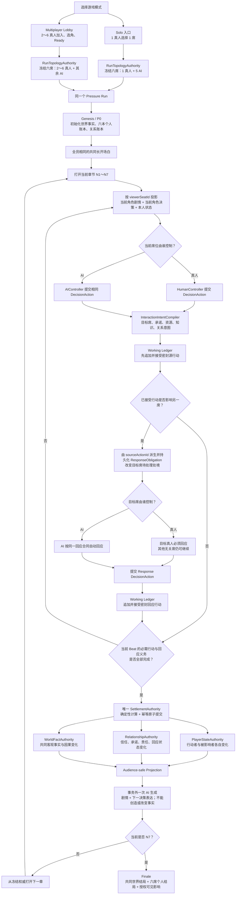
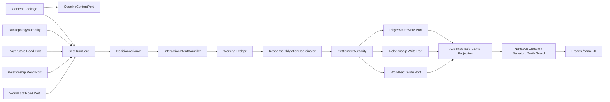

# 单人主流程内嵌多人互动层：统一六席运行时模块化架构设计 v1.0（2026-08-15 修订版）

## 0. 本次修订与术语冻结

本次修订只澄清统一六席架构、权威顺序、模块命名、当前实现边界和实施工期，
不代表相关运行时代码已经完成。

冻结以下表达：

```text
UnifiedSixSeatRuntime
├─ ControllerProfile.Solo：1 HUMAN + 5 AI
└─ ControllerProfile.Multiplayer：2～6 HUMAN + 其余 AI
```

Solo 不是 Multiplayer 的子程序，Multiplayer 也不调用 Solo 引擎。两者都是同一个
六席 Run 的 Controller 配置。`participantMode` 只能决定入口、真人席位数量、等待和
接管策略，不能决定剧情、合法行动、结算、Beat 推进、章末总结或终局规则。

为避免与正在开发的 N1 多 Beat 项目模块编号冲突，本文统一使用：

```text
N1-M1～N1-M5：N1 多 Beat、故事包、推进、一次生成、章末总结确认门
USR-M0～USR-M10：本文的 Unified Six-seat Runtime 架构模块
```

尤其需要注意：`N1-M5` 是“章末总结确认门”；`USR-M5` 是未来的
“Player State Authority”，二者不是同一个模块。

## 1. 文档结论

桑田不应实现为“两套游戏”或“多人服务调用旧 Solo 引擎六次”。正确结构是：

```text
统一六席 Pressure 运行时
├─ Solo：1 个真人 Controller + 5 个 AI Controller
└─ Multiplayer：2～6 个真人 Controller + 其余 AI Controller
```

两种模式必须共用同一个内容包、场景编译器、行动合同体系、裁决、章节推进、因果链
和终局运行时；但六个席位从内容包中读取各自不同的私人剧情、人物压力、合法行动和
决策表达。`participantMode` 只决定大厅规则和席位由真人还是 AI 控制，不能决定使用
哪套剧情或裁决引擎。

因此，“把单人包含在多人流程里”的准确工程含义是：

- 抽出所有席位都使用的 `SeatTurnCore`（角色回合内核）；
- Solo 和 Multiplayer 都运行同一个六席 Run；
- 每个真人席位都获得一条完整的“单人式角色体验”，但不同席位的剧情和决策不同；
- 多人可以理解为多个席位视角的单人式体验在同一世界中并行、互相影响并统一结算；
- 多人只增加真人大厅、真人等待、强制回应和在线控制协调；
- 跨角色影响、承诺、关系、共同事实即使在 Solo 也存在，只是目标席位由 AI 自动回应；
- 不再建立第二套 Solo/Multiplayer 状态、规则或页面。

这里的“多个单人式体验”不等于六条独立 `StoryRun`。六席共享同一个公共 Beat 和客观
世界事实，但每席分别编译自己的 `ViewerStoryPack`：

```text
同一 Public Beat / World Authority
├─ 浙江总督：总督私人剧情 + 总督合法决策
├─ 浙江巡抚：巡抚私人剧情 + 巡抚合法决策
├─ 清流法司：法司私人剧情 + 法司合法决策
├─ 江南商会：商会私人剧情 + 商会合法决策
├─ 司礼监织造：织造私人剧情 + 织造合法决策
└─ 内阁财政：财政私人剧情 + 财政合法决策
             ↓
六席行动汇入同一 Working Ledger 和 Settlement
```

本文件是架构与实施边界文档，不代表下述缺失模块已经实现。本次不修改游戏代码、
数据库、API、路由或冻结的 `/game` 页面。

## 2. 产品流程不变量

### 2.1 两种模式共同的玩家流程

```text
全员相同的共同长开场白
→ 当前角色专属剧情
→ 当前角色专属决策
→ 提交统一 DecisionAction
→ 系统权威裁决
→ 更新当前角色下一处境
→ N1～N7 继续
→ 共同世界结局 + 当前角色个人结局
```

### 2.2 两种模式共用的跨席互动，以及 Controller 差异

```text
真人或 AI 提交 DecisionAction
→ 校验并把源行动密封写入 Working Ledger
→ 系统从已接受的源行动识别被影响席位
→ 持久化 ResponseObligation，并改变目标席待处理处境
→ 目标席使用同一 Response DecisionAction 合同回应
   ├─ HUMAN Controller：等待真人回应
   └─ AI Controller：确定性自动回应
→ 当前 Beat 的必需行动和回应义务全部完成
→ Settlement 原子更新双方个人状态、承诺、信任、关系和共同事实
→ 事务提交后，AI 一次生成 viewer-safe 的剧情和下一决策表达
```

“必须回应”的定义：它阻塞自己所属 Beat 的收敛与 Settlement，不阻塞无关席位的
独立行动，也不应笼统锁死整个 Run。只有目标席位已经回应，或经过冻结、可追溯的
超时默认策略处理后，相关 Beat 才能完成。页面提示不是权威，持久化的回应义务才是
权威。

源行动必须先被 Working Ledger 接受，之后才能派生回应义务。禁止先创建义务、再尝试
写入源行动，否则源行动失败时可能留下没有权威来源的孤儿义务。

Narrator/DeepSeek 必须在 Settlement 事务之外运行。它可以解释已提交结果并表达下一
决策，但不能延长数据库事务、创建事实、改变 Delta 或决定是否完成回应义务。

## 3. 当前代码审计结论

### 3.1 已经共用的主干

| 能力 | 当前状态 | 代码证据 |
|---|---|---|
| 桑田 Solo 与多人选择同一引擎 | 已实现 | `packages/templates/config/sangtian/game.json:23-31` 同时启用两种模式，并固定 `pressure_chapter_v1` |
| 同一注册项支持两种参与模式 | 已实现 | `packages/templates/src/runtime-contract/pressure-chapter-registry.ts:14,201-209,241-249` |
| 一个 Run 始终生成六个席位 | 已实现 | `apps/api/src/pressure-chapter/production/run-shell.ts:252-294` |
| Solo 只是 1 真人 + 5 AI | 已实现 | `run-shell.ts:273-292,315-317,362-365` |
| 多人只多大厅、选角、Ready | 已实现 | `run-shell.ts:234-246,303-326` |
| 启动顺序共用 | 已实现 | `apps/api/src/pressure-chapter/production/start-lifecycle.ts:204-206,228-331`：Roster → Route → P0 → SeatControl → N1 |
| 共同开场白共用 | 已实现 | `apps/api/src/pressure-chapter/game-projection/shared-genesis-opening.ts:6-32`；调用点 `game-projection.service.ts:312-318` |
| 角色剧情和决策按 viewer 席位投影 | 已实现 | `apps/api/src/pressure-chapter/integration/game-projection.adapters.ts:32-152` |
| 决策提交、Beat、Settlement 共用 | 已实现 | `apps/api/src/pressure-chapter/http/pressure-chapter-http.facade.ts:138-280`；`orchestrator/chapter-orchestrator.service.ts:175-225,311-471` |
| N1～N7 与 Finale 共用 | 已实现 | `chapter-orchestrator.service.ts:474-504` |
| 终局含共同结局和六席个人结局 | 已实现 | `packages/shared/src/pressure-chapter/contracts/finale.ts:65-90,358-378`；`contracts/result-authority.ts:121-161` |
| 终局按 viewer 隔离 | 已实现 | `apps/api/src/pressure-chapter/result/audience-projector.ts:43-98,130-148` |
| 正式 `/game` 页面共用 | 已实现 | `apps/web/public/game-bootstrap.js:56-62`；`pressure-main-game-storage-v1.js:59-140` |

结论：桑田的 Solo 和 Multiplayer 已经共用生命周期与章节主干，不能再造第二个
Multiplayer Runtime，也不应让 Multiplayer 依赖旧 `solo-story-engine`。

### 3.2 当前尚未真正共用或尚未完成的层

| 缺口 | 当前事实 | 风险 |
|---|---|---|
| 六席个人指标账本 | 五项开局指标来自一套数组，N1 后读取共同 `WorldState.tracks` | 六个角色无法独立变化和结算 |
| 六席个人资源账本 | 每席初始资源已不同，但代码明确标注为 `projection-only` | 页面能显示开局值，但 Settlement 不能持续改变本人资源 |
| 成对关系/信任账本 | 已有承诺、知识、角色弧线、可见影响事件；没有找到 Settlement 唯一持久化的成对信任状态 | 无法证明“行动后双方关系持续变化” |
| 强制回应状态机 | A-Emotion 有 `responseOptions` 和弹窗事件，但正式页面当前文案仍说明回应不阻塞其他剧情线 | “对方必须回应”目前不是运行时硬约束 |
| 共同开场内容依赖方向 | Pressure 共同开场直接依赖旧 Solo `fixed-opening` | 形成 Pressure → 旧 Solo 的反向依赖 |
| 全仓库旧 Solo 引擎 | 非 Pressure 世界仍存在 OpenNovel、SoloStory、Continuous Story 等兼容路径 | 不能把“桑田已统一”误报为“全仓库已统一” |

个人状态缺口的直接证据：

- `apps/api/src/pressure-chapter/initial-player-state/sangtian-initial-player-state.ts:16-27`
  明确写着初始值在个人结算引入前只是投影；
- 同文件 `:29-62` 才是按六席区分的初始资源；
- `apps/api/src/pressure-chapter/integration/game-projection.adapters.ts:192-212` 在
  `worldSequence > 0` 后读取共同 `world.tracks`；
- `apps/api/src/pressure-chapter/product-adapters/seat-private-content.adapters.ts:105-160`
  每次从静态初始目录重建资源，并未读取可演进个人账本；
- `packages/shared/src/pressure-chapter/contracts/domain.ts:100-111` 的 `WorldStateV1`
  把 facts、resources、tracks、knowledge 和 seatArcs 放在同一世界状态中，没有独立
  `PlayerStateBySeat` 与 `RelationshipState`。

互动层已经具备可复用材料，但不等于完整闭环：

- `working-ledger/contracts.ts:20-42` 已表达目标席、资源预留、承诺、知识和角色弧线；
- `interaction/formal-interaction.service.ts:126-209` 已做跨席权限与资源/承诺校验；
- `a-emotion-lifecycle/contracts.ts:24-44` 明确 Working Ledger 是承诺生命周期唯一权威；
- 但 `apps/web/public/app.js:924` 的默认呈现仍是“这项回应不会阻塞其他角色继续行动”；
- `packages/shared/src/pressure-chapter/b0/types.ts:101-143` 的最终结果仍以
  `WorldDelta`、共同资源、共同 track 和 seat arc 为主，没有个人/关系 Delta 的窄合同。

### 3.3 N1 多 Beat 分支与本文架构的关系

截至本次审计，`codex/chatgpt-pro-n1-multibeat-v1` 已形成以下独立能力：

| N1 模块 | 已有能力 | 与统一六席架构的关系 |
|---|---|---|
| N1-M1 | N1 多 Beat 作者内容与合法行动 | 可被 Solo/Multiplayer 共用，不应读取 participantMode |
| N1-M2 | 按 `viewerSeatId` 编译故事包 | 符合 Audience-safe、席位隔离的统一读取方向 |
| N1-M3 | 通用 Beat 推进 | 应由必需行动、回应义务与 Settlement 结果驱动 |
| N1-M4 | 一次 DeepSeek 生成剧情和下一决策 | 符合事务后表达、Provider 不写权威的边界 |
| N1-M5 | 章末总结与玩家确认门 | 应同时适用于 Solo/Multiplayer，不得成为 Solo 专用状态 |

因此当前分支不需要重建故事包、Beat 或 Narrator。但它只覆盖“内容、推进、表达和章末
确认”，尚未实现本文要求的持久化 `ResponseObligation`、六席个人状态账本、定向关系
账本和统一多域 Delta。

该分支与最新 `main` 已分别演进，集成时禁止整分支覆盖或直接用旧文件替换当前生产
实现。必须以届时最新 `main` 为准确基线，按 N1-M1～N1-M5 独立验证并选择性移植，
每个模块分别检查公共合同、数据库、正式 `/game` 页面和性能快照是否发生回退。

验收时必须补充 Controller 等价性测试：在相同 content hash、seatId、Beat、权威状态
和行动下，Solo/Multiplayer 的故事包、合法行动、action fingerprint、Beat 推进和
Settlement 结果必须一致；允许不同的只有 Controller 来源、等待方式和弹窗接收者。

### 3.4 多人弹窗分支的可吸收边界

`codex/pressure-modal-trigger-chain` 不能整体合并。可以逐 hunk 审查并选择性吸收：

- 从已提交跨席影响派生 viewer-safe 弹窗 Projection；
- 目标席响应选项的只读权限适配；
- seen / modal-shown / acknowledge 的 viewer 隔离、幂等和过期检查；
- 不改变故事、决策、AI 策略与 Settlement 结果的通用后端修复。

以下内容明确拒绝吸收：旧平行游戏页面、旧 Workbench、第二套 Solo/Multiplayer 推进、
旧 Settlement 接线、会关闭自由输入或改变五个确定性 AI 策略的实现。

弹窗只是 `ResponseObligation` 的 Projection/Delivery，不是义务权威本身。只有已经由
密封源行动派生、持久化并受 Convergence 检查的义务，才能阻塞相关 Beat；浏览器是否
显示过弹窗、用户是否关闭弹窗均不能决定权威状态。

## 4. 目标权威模型

### 4.1 不能继续把所有数值称为 World State

目标状态必须拆为四个权威域，并由一次 Settlement 原子提交：

```text
RunTopologyAuthority
├─ 六席定义
├─ 每席 Controller（human / ai）
└─ participantMode（只影响协调策略）

PlayerStateAuthority[seatId]
├─ personalMetrics（五项指标，各席独立）
├─ personalResources（银、粮、兵、文书等，各席独立）
├─ roleGoalProgress / gains / losses / costs
└─ knowledge / private facts

RelationshipAuthority[fromSeatId][toSeatId]
├─ directedTrust（A 信任 B 不等于 B 信任 A）
├─ commitments（issuer、receiver、状态、证据）
├─ responsibilities
└─ responseObligations

WorldFactAuthority
├─ 已经客观发生的共同事实
├─ 世界对象与地点状态
├─ 公共证据及公开范围
└─ 因果边
```

以下数据禁止继续作为“全员共同数值”处理：个人财政余裕、个人民心表现、个人证据
与责任、个人改桑表现、皇帝对该角色的信任，以及角色持有的银、粮、兵、幕僚、密报。
六席初始值可以相同，但必须复制为六本独立账本，之后独立变化。

### 4.2 建议的窄合同

下面只是合同形状，不是本次代码实现：

```ts
type PersonalStateBySeatV1 = Record<SeatIdV1, {
  metricValues: Record<PersonalMetricIdV1, number>;
  resources: Record<ResourceIdV1, { quantity: number; version: number }>;
  goalProgress: number;
  gainRefs: string[];
  lossRefs: string[];
  costRefs: string[];
  knowledgeRefs: string[];
}>;

type RelationshipStateV1 = {
  directedTrust: Array<{
    fromSeatId: SeatIdV1;
    toSeatId: SeatIdV1;
    value: number;
    version: number;
  }>;
  commitments: CommitmentStateV1[];
  responseObligations: Array<{
    obligationId: string;
    sourceActionId: string;
    targetSeatId: SeatIdV1;
    status: "RESPONSE_REQUIRED" | "RESPONDED" | "DEFAULTED" | "CANCELLED";
    responseActionId: string | null;
    deadlinePolicyRef: string;
  }>;
};

type WorldFactStateV1 = {
  facts: Record<FactIdV1, ScalarFactValueV1>;
  objects: ObjectStateV1[];
  evidence: EvidenceStateV1[];
  causalEdges: CausalEdgeV1[];
};

type UnifiedSettlementDeltaV1 = {
  actorPersonalDelta: PersonalStateDeltaV1;
  targetPersonalDeltas: Array<PersonalStateDeltaV1>;
  relationshipDeltas: RelationshipDeltaV1[];
  worldFactDelta: WorldFactDeltaV1;
  responseObligations: ResponseObligationMutationV1[];
};
```

Provider、Prompt、Narrator 和页面均不得直接写这些权威状态。

## 5. 完整统一流程图



## 6. 单人和多人对照

| 阶段 | Solo | Multiplayer | 是否同一模块 |
|---|---|---|---|
| 房间/入口 | 直接创建并自动 Ready | Lobby 加入、选角、Ready | 否，仅入口协调不同 |
| 六席构成 | 1 真人 + 5 AI | 2～6 真人 + 其余 AI | 是，`RunTopologyAuthority` |
| 共同开场白 | 相同 | 相同 | 是 |
| 当前角色剧情 | 当前真人席位的私人剧情 | 每个真人分别看到本席私人剧情 | 同一 `SeatTurnCore`，输出按 seatId 不同 |
| 当前角色决策 | 当前真人席位的合法决策 | 每个真人分别得到本席合法决策 | 同一合同类型，选项和行动按 seatId 不同 |
| AI 角色决策 | AI Controller | AI Controller | 是 |
| 跨席行动 | 目标多为 AI | 目标可能为真人 | 是，`InteractionOverlay` |
| 必须回应 | AI 自动回应 | 真人等待回应；断线才走默认策略 | 同一义务合同，不同 Controller |
| 裁决 | 同一 Settlement | 同一 Settlement | 是 |
| 个人状态 | 六席各自账本 | 六席各自账本 | 是 |
| 关系/承诺 | 人与 AI 之间同样记录 | 真人之间同样记录 | 是 |
| 共同事实 | 同一条世界因果链 | 同一条世界因果链 | 是 |
| 下一章/终局 | N1～N7 / Finale | N1～N7 / Finale | 是 |

## 7. 模块依赖方向



强制规则：

- 依赖只允许由内容与领域权威向投影和页面单向流动；
- `SeatTurnCore` 不知道 HTTP、Prisma、Supabase、浏览器或 Provider；
- `InteractionOverlay` 只生成意图，不能直接更新状态；
- `SettlementAuthority` 是唯一能决定真实变化的模块；
- 三类账本由同一事务/同一幂等 commit manifest 原子写入，但保持三个独立领域合同；
- Narrative 只能解释 Settlement 已提交的因果，不能补造事实；
- `/game` 只显示 viewer-safe Projection，不能自己计算资源、指标或关系。

## 8. 模块清单与实施卡

### USR-M0：Run Topology（保留并收窄）

- 用户目标：Solo 和多人只在真人控制席位数量上不同。
- 唯一职责：创建六席、冻结每席 Controller、管理控制 epoch 与接管。
- 明确不负责：剧情、决策、裁决、个人状态、关系。
- 输入及权威来源：大厅成员/选角/Ready 或 Solo 单席选择。
- 输出及消费者：冻结的 `RunTopologyV1`，由 Start Lifecycle 和 Controller Adapter 使用。
- 允许依赖：角色目录、身份认证、大厅持久化。
- 禁止依赖：Narrator、Settlement 内部状态、页面。
- 当前生产文件：`production/run-shell.ts`、`production/start-lifecycle.ts`、`seat-control/*`。
- 聚焦测试：1 真人+5 AI、2～6 真人+其余 AI、重复 start、控制权 epoch。
- 回滚：保持现有 Run Shell 合同；不触碰 N1～N7。
- 玩家参与节点：Solo 创建、多人选角与 Ready。
- 失败归属：人数/选角/控制权错误归本模块。

### USR-M1：Opening Content Port（需要解耦）

- 用户目标：所有模式、所有席位先看到相同共同长开场白。
- 唯一职责：从桑田内容包读取并投影共同开场。
- 明确不负责：角色 N1、决策、状态变化。
- 输入及权威来源：已发布内容包版本与哈希。
- 输出及消费者：`SharedOpeningProjectionV1`，由 Game Projection 使用。
- 允许依赖：Content Package Loader。
- 禁止依赖：旧 Solo 引擎、participantMode、数据库。
- 当前生产文件：`game-projection/shared-genesis-opening.ts`；需把旧 Solo `fixed-opening`
  的内容权威提升到共享 Content Port。
- 聚焦测试：Solo/多人、六席、FAST/REPLAY 输出相同且版本绑定。
- 回滚：恢复当前投影函数，不改页面。
- 玩家参与节点：进入真实 `/game` 的第一屏。
- 失败归属：开场缺失/版本错误归本模块。

### USR-M2：Seat Turn Core（保留现有主干）

- 用户目标：单人和多人使用完全相同的席位编译机制；六席分别得到符合本人身份、
  私人信息、当前压力和合法行动的不同“角色剧情 → 角色决策”。
- 唯一职责：依据章节、席位及 viewer-safe 状态生成该席剧情材料和决策合同。
- 明确不负责：谁控制该席、写数据库、裁决结果、生成多人大厅。
- 输入及权威来源：章节内容、SeatId、个人/关系/世界事实只读快照。
- 输出及消费者：统一 `DecisionActionV1` 所需的场景与决策 Projection。
- 允许依赖：Content、只读领域端口。
- 禁止依赖：participantMode 分支、HTTP、Prisma、Provider 事实生成。
- 当前生产文件：`integration/game-projection.adapters.ts`、`game-projection/*`、
  `integration/decision-command.compiler.ts`。
- 聚焦测试：相同 seat/state/content 在 Solo 与多人产生相同场景、选项和 action fingerprint。
- 回滚：保持当前 `pressure_chapter_game_projection_v1` 公共响应。
- 玩家参与节点：每章当前角色剧情和决策。
- 失败归属：角色内容串位、决策合同不同归本模块。

### USR-M3：Interaction Intent（保留并扩展窄合同）

- 用户目标：行动可以明确影响另一个角色，而不是只改变共同数值。
- 唯一职责：把密封行动编译为目标席、资源、承诺、知识、关系和事实意图。
- 明确不负责：决定最终数值、直接写状态、生成解释文本。
- 输入及权威来源：`DecisionActionV1`、内容规则、可互动席位权限。
- 输出及消费者：`InteractionIntentV2`，由 Working Ledger 和 Settlement 使用。
- 允许依赖：Formal Interaction Access、内容规则。
- 禁止依赖：页面、Narrator、直接 Prisma 写入。
- 当前生产文件：`interaction/*`、`working-ledger/contracts.ts`、
  `working-ledger/working-ledger.ts`。
- 聚焦测试：目标权限、资源预留、承诺幂等、禁止跨席私密泄露。
- 回滚：新字段版本化；旧 Intent 只映射已存在能力。
- 玩家参与节点：提交会影响他人的行动。
- 失败归属：目标识别/意图编译错误归本模块。

### USR-M4：Response Obligation（新模块）

- 用户目标：被真人影响后必须作出真实回应。
- 唯一职责：创建、读取、完成、默认或取消回应义务，并为目标席打开回应决策。
- 明确不负责：决定影响结果、修改信任、生成 Narrative。
- 输入及权威来源：已接受的源行动和冻结的 Interaction Policy。
- 输出及消费者：持久化 `ResponseObligationV1` 与目标席 Response Decision Pin。
- 允许依赖：Working Ledger、SeatControl 只读端口、Deadline Default Policy。
- 禁止依赖：页面是否打开弹窗、WebSocket 是否在线。
- 建议生产边界：新增 `pressure-chapter/response-obligation/*`，通过窄端口接入
  Orchestrator，不放进通用 Manager。
- 聚焦测试：真人必须回应、AI 自动回应、超时默认、断线重连、重复回应幂等。
- 回滚：关闭义务策略后回到普通必需席收敛，不删除源行动。
- 玩家参与节点：目标玩家收到“必须回应”的当前任务。
- 失败归属：回应未创建/错误阻塞/错误默认归本模块。

### USR-M5：Player State Authority（新权威）

- 用户目标：六个角色拥有各自独立且可持续变化的指标和资源。
- 唯一职责：保存、版本化和读取每席个人账本。
- 明确不负责：计算 Delta、世界事实、关系、页面格式化。
- 输入及权威来源：P0 初始配置；之后仅接受 Settlement 提交的个人 Delta。
- 输出及消费者：`PersonalStateBySeatV1` 只读快照与版本。
- 允许依赖：领域合同、持久化端口。
- 禁止依赖：共同 `WorldState.tracks` 作为替代权威、静态 Projection 回退。
- 当前相关文件：`initial-player-state/*`、`product-adapters/seat-private-content.adapters.ts`、
  `integration/game-projection.adapters.ts`；实施将涉及公共合同和数据库，必须另行审批。
- 聚焦测试：六本账本隔离、相同开局独立变化、资源版本冲突、viewer 不泄露。
- 回滚：读路径可暂时回退旧快照；不得把已提交个人变化合并回共同 tracks。
- 玩家参与节点：“我的资源”和五项个人指标。
- 失败归属：个人值错误/串位/丢失归本模块。

### USR-M6：Relationship & Commitment Authority（新权威/复用承诺）

- 用户目标：承诺、信任、责任和双方关系可持续变化并可追溯。
- 唯一职责：维护有方向的信任、承诺生命周期、责任和回应义务引用。
- 明确不负责：世界事实、个人资源、Narrative 情绪文案。
- 输入及权威来源：Settlement 的 Relationship Delta；承诺事件继续以 Working Ledger
  已提交事件为源证据。
- 输出及消费者：viewer-safe 关系快照、终局因果与后续 Seat Turn。
- 允许依赖：Working Ledger 提交证据、Settlement commit manifest。
- 禁止依赖：A-Emotion 展示状态作为权威、前端本地 relationships 数组。
- 当前相关文件：`a-emotion-promise/*`、`a-emotion-lifecycle/*`、`working-ledger/*`。
- 聚焦测试：A→B 与 B→A 独立、承诺履行/违背、跨章延续、权限隔离。
- 回滚：保留原承诺事件；关系读模型可重建，不能删除审计证据。
- 玩家参与节点：人物互动、承诺结果、关系变化提示。
- 失败归属：关系方向/承诺状态/权限错误归本模块。

### USR-M7：World Fact Authority（从 WorldState 中收窄）

- 用户目标：所有玩家共享同一条客观历史，但不共享个人账本。
- 唯一职责：保存已经发生的共同事实、对象、证据、公开范围和因果边。
- 明确不负责：个人指标/资源、双方信任、页面叙事。
- 输入及权威来源：仅 Settlement 的 `WorldFactDeltaV1`。
- 输出及消费者：下一章内容编译、Audience Projection、Finale。
- 允许依赖：领域合同、持久化端口。
- 禁止依赖：Provider 生成事实、页面回写。
- 当前生产文件：`contracts/domain.ts`、`chapter-settlement/*`、`persistence/*`。
- 聚焦测试：同一事实一次提交、CAS、重放、公开/私密证据隔离。
- 回滚：从 Frozen Chapter Bundle/commit manifest 重建。
- 玩家参与节点：所有人共同看到的世界变化。
- 失败归属：客观事实与因果错误归本模块。

### USR-M8：Unified Settlement Authority（扩展现有唯一裁决）

- 用户目标：一次行动同时、可靠地改变行动者、目标者、双方关系和共同事实。
- 唯一职责：根据密封行动和内容规则计算统一 Delta，并以一次幂等事务原子提交。
- 明确不负责：写剧情文本、页面显示、玩家认证。
- 输入及权威来源：Sealed Actions、已完成回应义务、当前三个权威快照、冻结规则。
- 输出及消费者：个人 Delta、关系 Delta、世界事实 Delta、commit manifest、因果边。
- 允许依赖：纯领域规则和三个写端口的事务协调器。
- 禁止依赖：Narrator、HTTP payload 未密封字段、页面状态。
- 当前生产文件：`chapter-settlement/*`、`packages/shared/src/pressure-chapter/b0/*`、
  `persistence/*`；保留现有 Settlement，不创建第二个裁决器。
- 聚焦测试：确定性、原子性、幂等、冲突回滚、行动者/目标/关系/事实同时变化。
- 回滚：按 settlement contract 版本切回旧计算器；已提交记录不可重写。
- 玩家参与节点：提交决策后的真实结果。
- 失败归属：最终变化不正确归本模块。

### USR-M9：Audience Projection + Narrative（保留单向输出）

- 用户目标：每个玩家只看到自己的状态和被授权事实，并得到简短清晰解释。
- 唯一职责：先做 viewer-safe Projection，再让 AI 表达已提交结果并经 Truth Guard 校验。
- 明确不负责：裁决、状态写入、创建回应义务。
- 输入及权威来源：三个权威只读快照、Settlement 证据、当前 SeatId。
- 输出及消费者：现有 `pressure_chapter_game_projection_v1` 和 Narrative Artifact。
- 允许依赖：Audience ACL、Narrative Context、Provider、Truth Guard。
- 禁止依赖：其他席位私密状态、Provider 反写权威。
- 当前生产文件：`game-projection/*`、`narrative*/*`、`a-emotion/projector.ts`。
- 聚焦测试：六席隔离、短解释只引用提交事实、Provider 失败不损坏 Settlement。
- 回滚：保留确定性 Projection；Narrative 可重试。
- 玩家参与节点：三栏 `/game` 页面和结果解释。
- 失败归属：事实正确但显示/表达错误分别归 Projection/Narrative。

### USR-M10：Chapter Progression & Finale（保留并改读新权威）

- 用户目标：N1～N7 后得到共同世界结局和每席个人结局。
- 唯一职责：在全部必需行动/回应已完成且 Settlement 冻结后推进章节或进入 Finale。
- 明确不负责：计算个人状态、关系或 Narrative。
- 输入及权威来源：Frozen Chapter Bundles、三个最终权威快照、因果边。
- 输出及消费者：下一章打开命令或 `sangtian_pressure_result_v1`。
- 允许依赖：现有 Orchestrator、Finale、Result Audience Projector。
- 禁止依赖：participantMode 选择不同终局规则。
- 当前生产文件：`orchestrator/chapter-orchestrator.service.ts`、`finale/*`、`result/*`。
- 聚焦测试：N1～N6 下一章、N7 Finale、六席个人结局、授权 impact 隔离。
- 回滚：沿用现有 Frozen Bundle 与 result authority。
- 玩家参与节点：下一章与终局页面。
- 失败归属：错误推进/漏终局/错误个人结局归本模块。

## 9. 建议实施顺序（一次只实施一个模块）

### 阶段 0：合同冻结与兼容审计

1. 固定现有 `/game`、提交决策和结果响应，不改玩家页面。
2. 为相同 seat/state/content 的 Solo/多人建立等价合同测试。
3. 明确旧 OpenNovel/SoloStory/Continuous 路径只做兼容，不接入新的桑田权威链。

### 阶段 1：个人账本

1. 定义 `PersonalStateBySeatV1` 和个人 Delta；
2. P0 为六席分别复制初始五指标，并加载各自初始资源；
3. 持久化六本账本；
4. Game Projection 改读当前 viewer 的个人账本；
5. 删除 `worldSequence === 0` 的投影特判作为事实来源。

验收门：同一角色在 Solo 与多人看到相同初始值；任一席变化不会改变其他五席。

### 阶段 2：统一 Settlement 扩展

1. B0 规则输出个人、关系和世界事实三类 Delta；
2. 一次事务提交三类 Delta 和同一 commit manifest；
3. 保持旧 `WorldDelta` 兼容适配器只读，不成为第二权威。

验收门：一个行动同时改变行动者和目标者，重放不重复扣资源。

### 阶段 3：关系与承诺

1. 复用 Working Ledger 承诺事件；
2. 新增 directed trust 与 responsibility；
3. A-Emotion 只投影关系权威，不拥有关系状态。

验收门：A→B 和 B→A 独立；承诺履行/违背跨章可追溯。

### 阶段 4：强制回应

1. 新增 Response Obligation 合同与持久化；
2. 真人目标收到强制 Response Decision Pin；
3. AI 目标用同一合同自动提交；
4. 超时采用冻结默认策略；
5. Orchestrator 在最终 Settlement 前检查所有义务。

验收门：目标真人不回应时章节不能完成；回应后双方状态与关系正确变化。

### 阶段 5：终局读取新权威

1. Finale 输入加入最终个人/关系快照哈希；
2. 保留一个共同 world outcome；
3. 六席 personal outcome 分别基于本人因果；
4. viewer-safe Result 继续只显示本人和授权影响。

验收门：相同历史在 Solo/多人产生相同世界结局和相同席位个人结局。

每一阶段都会修改公共合同、数据库或权威链，实施前必须各自提交模块卡并重新审批；
不得把五个阶段合并成一个大改。

## 10. 改动量、十小时边界与交付拆分

### 10.1 改动量结论

本设计不能按“一个十小时任务”整体实现。原因不是代码行数，而是它包含三类不同风险：

| 范围 | 改动量 | 主要风险 | 单独预计 |
|---|---:|---|---:|
| N1-M1～N1-M5 完成生产接线与独立验收 | 中等 | 旧分支与 main 集成、章末确认状态、正式页面合同 | 4～8 小时 |
| Controller 等价测试与既有六席主干收窄 | 小到中等 | 发现 participantMode 隐式分支 | 2～4 小时 |
| 弹窗 Projection/Delivery 的选择性吸收 | 中等 | 旧并行页面、重复事件、viewer 隔离 | 3～6 小时 |
| USR-M4 持久化 ResponseObligation | 中到大 | 公共合同、持久化、并发、超时与重连 | 8～16 小时 |
| USR-M5/USR-M6 个人与关系账本 | 大 | 新权威、数据库、回读兼容、隐私 | 16～32 小时 |
| USR-M8 多域原子 Settlement 与终局改读 | 大 | 原子性、幂等、历史兼容、N1～N7 回归 | 16～32 小时 |

以上是工程实施与自动化验证估算，不包括项目所有者的真实页面体验验收、外部 Provider
波动、Supabase 性能异常或与其他并行任务的冲突处理。

### 10.2 十小时内可以安全完成的范围

十小时内可以以一个明确里程碑交付，而不是声称整个统一运行时完成：

```text
里程碑 A：现有权威不扩张的统一体验闭环
1. 完成并验收 N1-M1～N1-M5；
2. 证明 N1 故事包、Beat、一次生成和章末总结不读取 participantMode；
3. 建立同一 seat/state/content/action 的 Solo/Multiplayer 等价测试；
4. 保留正式 /game，不新增数据库表，不新增个人/关系第二权威；
5. 对多人弹窗分支只完成可吸收/拒绝的 hunk 清单，或在剩余时间充分时吸收
   纯 Projection/Delivery 幂等修复。
```

该里程碑完成后，每个席位都能得到本人不同的 N1 多 Beat 剧情和决策，并共用同一个
内容包、编译器、一次 DeepSeek 生成链、章末总结与确认门；Solo 与多人不会因为模式
不同而走两套引擎或推进逻辑。但它仍不能声称“真人被影响后必须回应”以及“六席个人/
关系数值持续演进”已经完成。

### 10.3 十小时内禁止伪装完成的范围

- 不在没有持久化合同的情况下把弹窗事件称为 `ResponseObligation`；
- 不用前端数组、Narrative 或共同 tracks 冒充个人状态/关系权威；
- 不为赶时间同时修改公共合同、Prisma schema、Settlement、Finale 和正式页面；
- 不整分支合并旧多人实现；
- 不把 N1 测试通过冒充 N1～N7、Solo/Multiplayer 和终局整体通过。

### 10.4 后续模块化交付建议

完成十小时里程碑后，按 `USR-M4 → USR-M5 → USR-M6 → USR-M8 → USR-M10`
逐模块实施。每个模块必须独立提交、独立回滚，并在进入下一个模块前完成其聚焦测试；
涉及数据库或玩家可见页面时重新取得明确批准。

## 11. 必须通过的合同与真实流程测试

### 11.1 等价性测试

- 同一 content hash、同一 seatId、个人状态、关系状态和世界事实下，Solo/多人产生相同
  角色剧情材料、决策选项、action vocabulary 和 fingerprint；
- 不同 seatId 必须分别获得作者定义的私人剧情、压力、合法行动和决策；禁止为了所谓
  “模式共用”把六席降级成相同文本或相同选项；
- 仅 Controller source 可不同（HUMAN/AI），Settlement 规则不得不同；
- 同一历史在 N7 得到相同共同结局和对应席位个人结局。

### 11.2 个人状态隔离

- 六席开局可以有相同五指标，但必须是六个独立版本；
- 修改浙江巡抚账本不得改变浙江总督；
- 目标席资源不足只能拒绝涉及该目标账本的行动；
- viewer 不能读取其他席位私密资源和指标。

### 11.3 多人互动闭环

测试必须证明完整链条，而不是只证明接口存在：

```text
玩家 A 行动
→ 产生目标 B 的 ResponseObligation
→ B 页面出现必须回应的 Decision Pin
→ B 回应
→ Settlement 原子改变 A、B、A→B/B→A、承诺和共同事实
→ 两端分别收到 viewer-safe 的短解释
```

还需覆盖：B 为 AI、B 断线、B 超时、重复提交、并发回应、Settlement 冲突回滚。

### 11.4 N1～N7 和终局

- 每章只允许一个 Frozen Bundle；
- 所有必需席位和回应义务完成后才能 Settlement；
- N1～N6 只能打开一个下一章；
- N7 只能生成一个 Finale；
- 共同结局、六席个人结局和授权 impact 均来自同一因果链。

### 11.5 真实页面验收

- 使用现有批准的真实 `/game`，不新增平行页面；
- Solo 与两个真实账号多人局分别完成至少 N1；
- 核对共同开场、角色剧情、角色决策、本人资源/指标、强制回应、短解释；
- 页面只验证投影，不作为状态权威；
- UI 或视觉变化必须另行提交审批说明。

## 12. 禁止方案

- 禁止 Multiplayer 调用旧 `SoloStoryEngine` 六次；
- 禁止每个玩家创建一条独立 StoryRun 再事后拼接；
- 禁止按 `participantMode` 复制两套剧情、规则、Settlement 或 Finale；
- 禁止把个人指标继续存在共同 `WorldState.tracks`；
- 禁止页面或 Prompt 自己计算信任、资源和结算；
- 禁止 A-Emotion Feed 成为关系权威；
- 禁止用关键词临时判断是否要求回应；
- 禁止为了验证新后端建立正式平行 `/game` 页面；
- 禁止一次跨越个人账本、关系、回应、Settlement、数据库和页面全部实施。

## 13. 最终验收标准

只有同时满足以下条件，才能说“单人主流程已被多人完整复用”：

1. Solo 和 Multiplayer 在桑田均绑定同一 Pressure route/strategy；
2. 两者只在 RunTopology 和 Controller 等待策略上不同；
3. 共同开场、席位剧情/决策编译机制、行动合同体系、Settlement、N1～N7、Finale
   共用；六席私人剧情和合法决策必须按 seatId 正确区分；
4. 六席各自拥有独立且持续演进的个人指标与资源账本；
5. 跨席行动能权威地改变行动者、目标者、双方关系和共同事实；
6. 目标真人的强制回应由持久化义务约束，而非 UI 提示；
7. AI 目标使用同一回应合同自动完成，不创建第二规则；
8. Narrative 只解释已提交结果；
9. `/game` 只投影 viewer-safe 状态；
10. Solo 与真实双账号多人 E2E 均通过，且没有第二权威或平行运行时。

## 14. 架构决定

采用：

```text
Unified Six-seat Pressure Runtime
+ SeatTurnCore
+ Controller Adapters
+ Interaction/Response Overlay
+ Atomic Multi-domain Settlement
```

拒绝：

```text
MultiplayerRuntime → 调用旧 SoloStoryEngine × 6
```

理由是前者保持一个 Run、一条因果链、一个 Settlement、一套 N1～N7 和一个 Finale，
同时让 Solo 与多人拥有完全相同的角色体验；后者会制造六条互相冲突的状态与因果权威，
无法可靠实现“一个真人行动改变另一个真人处境”。
